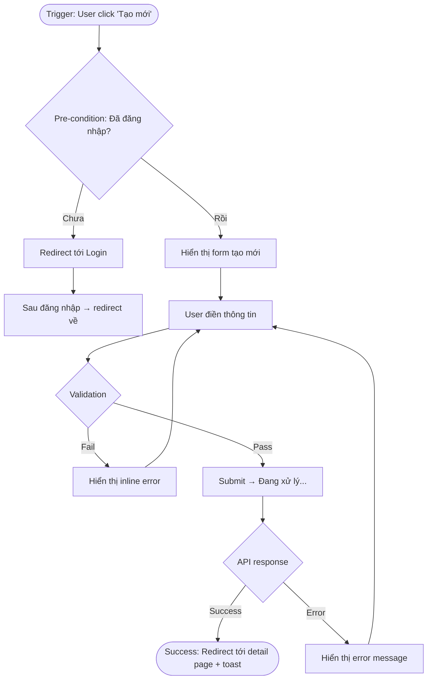

# Playbook: Thiết kế User Flow

> **Type**: Agent Skill Playbook
> **Agent**: ux-designer
> **Triggered by**: /wf-design-ux Phase 4 khi cần thiết kế user journey / flows cho feature
> **Output**: `.mc-data/docs/phase4-ux/user-flows/[feature-name]-flow.md`

---

## Khi nào dùng playbook này

- Được gọi trong `/wf-design-ux` khi cần map user journey cho feature mới
- Khi cần xác định các bước thực tế mà user phải đi qua để hoàn thành task
- Khi feature có nhiều nhánh điều kiện hoặc nhiều loại user khác nhau
- Khi cần identify điểm đau (friction points) và opportunity trong flow hiện tại

---

## Procedure

### Bước 1: Đọc context đầu vào

```
INPUT: Paths do skill cung cấp qua prompt
FALLBACK: tra .claude/references/path-registry.md → PHASE2 (feature specs), PHASE1 (requirements)

Cần xác định:
□ Feature name và REQ-ID tương ứng
□ Các personas liên quan (ai sẽ thực hiện flow này?)
□ Business goal của flow (user phải đạt được gì?)
□ Constraints hệ thống (authentication? phân quyền? trạng thái dữ liệu trước đó?)
□ Platform (web desktop / mobile web / native app?)
```

### Bước 2: Identify tất cả user types cần flow

```
READ: ux-research-methods.md → Section 3: Persona Template

Với mỗi persona liên quan đến feature:
□ Persona name và vai trò
□ Entry point điển hình (họ đến từ đâu? từ dashboard / email notification / direct link?)
□ Mục tiêu cụ thể (họ muốn đạt gì sau khi hoàn thành flow?)
□ Trình độ kỹ thuật (ảnh hưởng đến mức độ guidance cần thiết)
□ Context sử dụng (vội vàng / có thời gian? mobile / desktop?)

Mỗi persona có thể cần flow riêng nếu:
- Entry point khác nhau
- Permissions khác nhau
- Business rules áp dụng khác nhau
```

### Bước 3: Map entry points của mỗi flow

```
Với mỗi flow sẽ thiết kế, xác định rõ:

□ Trigger: Điều gì khiến user bắt đầu flow?
  - Direct navigation (menu, sidebar, breadcrumb)
  - Notification (email, in-app, push)
  - CTA từ trang khác
  - Deep link / URL trực tiếp
  - Hệ thống tự redirect sau event nào đó

□ Pre-conditions: User phải đang ở trạng thái nào trước khi bắt đầu?
  - Đã đăng nhập?
  - Đã hoàn thành bước setup nào đó?
  - Có quyền gì?
  - Dữ liệu nền cần có sẵn?

□ Entry state: Màn hình / trạng thái đầu tiên user thấy khi flow bắt đầu
```

### Bước 4: Định nghĩa success criteria cho mỗi flow

```
Trước khi thiết kế steps, phải rõ:

□ Success state: Flow kết thúc thành công trông như thế nào?
  - User hoàn thành action cụ thể gì?
  - System state thay đổi thế nào?
  - User được redirect đi đâu? Thấy thông báo gì?

□ Measurable criteria:
  - Task completion rate target: >X%
  - Time-on-task target: <Y phút
  - Drop-off rate acceptable: <Z%

□ Business value: Flow này đóng góp gì vào business goal?
```

### Bước 5: Document flow step-by-step

```
Cho mỗi flow, viết theo cấu trúc:

TRIGGER: [Điều gì kích hoạt flow]
  ↓
PRE-CONDITIONS: [Trạng thái cần có trước]
  ↓
STEP 1: [Tên bước — mô tả action của user]
  User thấy: [Màn hình / element gì]
  User làm: [Action cụ thể]
  System phản hồi: [Gì xảy ra ngay lập tức]
  ↓
STEP 2: ...
  ↓
[Tiếp tục cho đến success state]
  ↓
SUCCESS STATE: [Mô tả kết quả cuối cùng]

Decision points (nhánh rẽ) được ghi rõ:
ĐIỀU KIỆN: [Điều gì quyết định nhánh]
  → Nhánh A: [Nếu X thì xảy ra gì]
  → Nhánh B: [Nếu Y thì xảy ra gì]
```

### Bước 6: Xác định error flows và edge cases

```
Với mỗi step trong happy path, hỏi:

□ Điều gì có thể xảy ra sai?
  - Validation fail (input không hợp lệ)
  - Network error / timeout
  - Permission bị thu hồi giữa chừng
  - Data không tồn tại / đã bị xóa
  - Concurrent edit conflict

□ Với mỗi error:
  - User thấy gì? (error message, inline error, toast, error page)
  - User có thể recover không? Làm thế nào?
  - System state sau error là gì? (data có bị mất không?)

□ Edge cases đặc biệt:
  - Empty state: Không có dữ liệu để hiển thị
  - First-time user: Chưa có context / setup
  - Power user: Workflow nhanh hơn, cần shortcuts
  - Interrupted flow: User thoát giữa chừng, quay lại sau
```

### Bước 7: Vẽ flow diagram bằng Mermaid

```
Sử dụng Mermaid flowchart để visualize:



Lưu ý khi vẽ diagram:
□ Dùng hình oval cho Start/End states
□ Dùng hình thoi cho decision points
□ Dùng hình chữ nhật cho steps
□ Label rõ ràng trên mỗi mũi tên điều kiện
□ Chú thích màu sắc nếu cần phân biệt happy path vs error path
```

### Bước 8: Annotate với business rules

```
Với các decision points và steps quan trọng, thêm annotation giải thích:

□ Business rules áp dụng: "Manager chỉ thấy record của team mình"
□ Data rules: "Email phải unique trong system"
□ Permission rules: "Chỉ Admin mới có thể xóa"
□ Timing rules: "Có thể edit trong vòng 24h sau khi tạo"
□ Limit rules: "Tối đa 10 items per user"

Format annotation:
> ℹ️ Business Rule: [Mô tả rule]
> REQ-ID: [REQ-ID liên quan]
```

### Bước 9: Xác định cross-flow interactions

```
Kiểm tra flow này tương tác với flow khác như thế nào:

□ Flow nào cần complete trước flow này? (prerequisites)
□ Flow này trigger flow nào tiếp theo? (downstream flows)
□ Flow này chia sẻ data / state gì với flow khác?
□ Nếu flow bị cancel, có flow nào bị ảnh hưởng không?

Ví dụ:
- Flow "Tạo đơn hàng" → trigger "Cập nhật tồn kho" + "Gửi email xác nhận"
- Flow "Xóa user" → block nếu user đang có flow "Phê duyệt" pending
```

### Bước 10: Output — viết file

```
Ghi vào: .mc-data/docs/phase4-ux/user-flows/[feature-name]-flow.md
(Sử dụng path do skill cung cấp; fallback theo quy tắc trên)

Cấu trúc file output:
```

---

## Cấu trúc File Output

```markdown
# User Flow: [Feature Name]

> **REQ-ID**: [REQ-XXX-NNN]
> **Feature**: [Tên feature]
> **Phase**: 4 — UX Design
> **Ngày tạo**: YYYY-MM-DD
> **Designer**: ux-designer

## Tổng quan

| Thuộc tính | Giá trị |
|-----------|---------|
| Personas | [Persona 1, Persona 2] |
| Entry point chính | [Mô tả entry point] |
| Success state | [Mô tả success state] |
| Platform | [Web / Mobile / Both] |
| Độ phức tạp | [Simple / Medium / Complex] |

## Personas và Entry Points

### Persona: [Tên]
- **Entry point**: [Từ đâu]
- **Mục tiêu**: [Muốn đạt gì]
- **Pre-conditions**: [Cần có gì trước]

## Happy Path: [Tên flow chính]

### Success Criteria
- Task completion rate target: >X%
- Time-on-task target: <Y phút

### Flow Steps

**Trigger**: [Mô tả trigger]

**Bước 1**: [Tên bước]
- User thấy: [Màn hình / element]
- User làm: [Action]
- System: [Phản hồi]

[Tiếp tục...]

**Success State**: [Mô tả kết quả]

### Flow Diagram

```mermaid
[Diagram Mermaid]
```

## Error Flows & Edge Cases

### Error: [Tên error]
- **Trigger**: [Khi nào xảy ra]
- **User thấy**: [Error message / UI]
- **Recovery**: [Cách recover]

## Business Rules

| Rule | Mô tả | REQ-ID |
|------|-------|--------|
| [Rule name] | [Mô tả] | [REQ-XXX] |

## Cross-Flow Interactions

| Flow liên quan | Quan hệ | Ảnh hưởng |
|---------------|---------|-----------|
| [Flow name] | Prerequisite / Downstream | [Mô tả] |
```

---

## Checklist trước khi submit

```
□ Mỗi flow có REQ-ID tham chiếu rõ ràng
□ Tất cả personas đã được cover
□ Happy path đầy đủ từ trigger đến success state
□ Error flows và edge cases đã được xử lý
□ Business rules đã được annotate
□ Flow diagram Mermaid render được (syntax hợp lệ)
□ Cross-flow interactions đã được ghi nhận
□ File được lưu đúng path output
```
