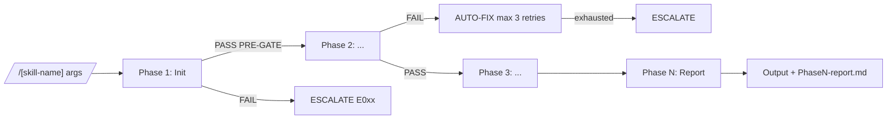

# /[skill-name]: $ARGUMENTS

> **TRƯỚC KHI POPULATE FILE NÀY** — đọc 2 tài liệu sau để xác định template path:
>
> 1. **[docs/04-skill-design/README.md](../../docs/04-skill-design/README.md) §1** — quyết định có cần tạo design canon (`docs/04-skill-design/{skill}/`) hay không. Bắt buộc khi: skill >3 phases, ≥3 cross-skill artifacts, spawn agents, hoặc có Playwright integration.
> 2. **[docs/04-skill-design/_template/00-master-checklist.md](../../docs/04-skill-design/_template/00-master-checklist.md)** — checklist 10-step end-to-end (gồm CLAUDE.md update, slash command, audit scripts) → gating trước commit.
>
> **Variant template** (chọn theo loại skill):
> | Loại skill | Variant cần dùng | File khác biệt |
> |---|---|---|
> | **Quick** (1-2 phases, không spawn agent) | `_template/` rút gọn (bỏ Phase 0, Context/Checkpoint, Registry Update) | — |
> | **Lane/Probe** (e.g. wf-fix-functional) | `_template/` + thay `02-arguments.md` → `02-quality-dimensions.alt.md` + thêm `05-execution-profiles.alt.md` | `02`, `05` |
> | **Orchestrator** (e.g. wf-fix-bugs) | `_template/` đầy đủ + thêm `08-user-scenarios.alt.md` | `08` |
> | **Standard** (đa số skill) | `_template/` mặc định (9 file) | — |
>
> Verify trước commit: `bash .claude/scripts/check-skill-design-populated.sh docs/04-skill-design/{skill}/`

---

## Overview

| Muc                     | Noi dung                     |
| ----------------------- | ---------------------------- |
| **Muc dich**      | [1 cau mo ta muc tieu chinh] |
| **Prerequisites** | [Skill/file can co truoc]    |
| **Duration**      | [Quick\| Multi-session]      |
| **Phases**        | [X phases]                   |
| **Input**         | [file/path]                  |
| **Output**        | [file/path]                  |

### Workflow Position

```
/[prev-skill] -> /[skill-name] -> /[next-skill]
                      |
                 YOU ARE HERE
```

### Phase Flow Diagram

> **BẮT BUỘC dùng Mermaid khi skill có >3 phases.** ASCII flow chỉ chấp nhận cho quick skills (1-3 phases).



> Diagram chi tiết hơn (sequence, profile dispatch) → đặt trong `docs/04-skill-design/{skill}/03-phase-routing.md`.

---

## Arguments

| Argument     | Description                               | Default |
| ------------ | ----------------------------------------- | ------- |
| `scope`    | [Mo ta]                                   | `all` |
| `--status` | Xem tien do (Multi-session only)          | -       |
| `--resume` | Resume tu checkpoint (Multi-session only) | -       |

> **Quick skills:** Ghi ro "Skill Quick — khong ho tro `--resume` / `--status`."
> va chi can argument-hint cho arguments thuc te (VD: `[project-name]`).

---

## Protocols & Strategy

> **Protocol:** Xem `.claude/skills/protocols/`

### Priority Ladder (BẮT BUỘC)

1. **Độ chính xác, chất lượng, tính nhất quán**
2. **Tốc độ và song song hóa** — chủ động tối ưu sau khi mục 1 được bảo vệ

```
YEU CAU THIET KE SKILL:
- Moi phase phai co PRE-GATE/POST-GATE de bao ve accuracy
- Output downstream phai chi ro input upstream can doc
- Neu dung PARALLEL, phai mo ta ownership, contract va merge checkpoint
- BAT BUOC dien Parallelization Strategy duoi day (CORE-039)
```

### Execution Strategy

| Condition           | Mode                                         |
| ------------------- | -------------------------------------------- |
| Tasks doc lap, >=3  | **PARALLEL** — spawn agents dong thoi |
| Tasks co dependency | **SEQUENTIAL** — cho ket qua truoc    |
| Mix                 | **HYBRID**                             |

> **Quick skills khong dung agents:** Bo section nay.

### Parallelization Strategy (BẮT BUỘC — CORE-039)

> Mọi skill mới hoặc khi overhaul PHẢI điền bảng dưới. Skill cũ grandfathered nhưng KHUYẾN NGHỊ bổ sung.
> Triết lý: sau khi đảm bảo accuracy + quality, **chủ động** tối ưu thời gian xử lý — không mặc định sequential.

| Phase/Step | Mode | Owner(s) | Write scope (output paths) | Lý do an toàn | Merge checkpoint |
|-----------|------|----------|---------------------------|---------------|------------------|
| Phase 1 Init | SEQUENTIAL | main | `$SESSION_DIR/status.json` | Cần init trước khi spawn | — |
| Phase 2 lanes A/B/C | PARALLEL | agent-X, agent-Y, agent-Z | `lanes/A/`, `lanes/B/`, `lanes/C/` (tách biệt) | Mỗi lane 1 writer; contract: schema-vN | Phase 3 aggregate |
| Phase 3 aggregate | SEQUENTIAL | main | `$SESSION_DIR/aggregate.json` | Cần kết quả Phase 2 | POST-GATE T1-T4 |
| Phase 4 verify | PARALLEL (read-only) | reviewer agents | KHÔNG ghi — chỉ đọc + report | Read-only, race-free | Final report |

**Nếu skill 100% sequential** → ghi rõ một dòng lý do:
> KHÔNG có cơ hội song song hóa an toàn vì [lý do — vd: linear data dependency, single-file output, atomic transaction].

**Pattern parallel-safe đã chuẩn hóa (ưu tiên dùng):**
- Lane parallel: spawn nhiều `Agent()` trong cùng 1 message → `docs/03-design-patterns/04-parallel-lane-dispatch.md`
- Wave dispatch: chia theo dependency graph (vd: wf-cmi 3-wave coordinator)
- Read-then-merge: nhiều reader song song + 1 writer hợp nhất (Safe-Write CORE-006)
- Bash parallel: chạy nhiều bash command độc lập trong cùng response

**Điều kiện cứng (CORE-025):** Contract rõ + 1 file = 1 writer + write scope tách biệt + merge checkpoint.

### Template Usage Rule (BẮT BUỘC — CORE-031)

> Mọi output file PHẢI được tạo từ template: **READ template → POPULATE với actual data → WRITE output.**
> Protocol chi tiết: `.claude/skills/protocols/` §19.

```
TEMPLATE LOCATIONS:
- Skill templates: .claude/skills/workflow/[skill]/templates/
- Doc output: .claude/doc-framework/[phase]/
- Digest templates: .claude/doc-framework/_digests/
- Meta templates: .claude/doc-framework/_meta/

ENFORCE trong procedures/flow-new.md:
- Moi Step ghi file → ghi ro "tu template [path]"
- _contract.json outputs.working[].template phai khop voi template thuc te (hoac null + ghi ly do)
```

### Fix Rules (Skill-specific)

| Error Type       | Auto-Fix Strategy | Escalate If |
| ---------------- | ----------------- | ----------- |
| `[error_type]` | [strategy]        | [condition] |

> **BAT BUOC** cho moi skill — bo sung Fix Rules cua protocols/

---

## Phase 0: Context Loading

> **Chi ap dung cho Multi-session skills.**
> **Quick skills:** Bat dau tu Phase 1.

**PRE-GATE:** `test -f [required-input-file]`

| Step | Action                 | Tool  | Verify                            |
| ---- | ---------------------- | ----- | --------------------------------- |
| 0.1  | Tao tracking directory | Bash  | `test -d .mc-data/work/[skill]` |
| 0.2  | Tao status.json        | Write | `test -f [status-file]`         |
| 0.3  | Load required context  | Read  | Content loaded                    |

**POST-GATE:** Context loaded, status file created

---

## Phase N: [Phase Name]

> [Mo ta ngan]

**PRE-GATE:** `[condition — command hoac logic check]`

| Step | Action      | Tool   | Verify       |
| ---- | ----------- | ------ | ------------ |
| N.1  | [Hanh dong] | [Tool] | `[verify]` |
| N.2  | [Hanh dong] | [Tool] | `[verify]` |

**POST-GATE:** `[condition]`

---

## Phase Nb: [Sub-phase Name] (Optional)

> Sub-phases danh so N + letter (6b, 6c, 7a...) cho cac buoc phu
> trong cung nhom logic voi Phase N chinh.

---

## Phase X: Cross-Validation (Conditional)

> **Khi dung:** Skills co nhieu outputs can kiem tra nhat quan.
> Ap dung Auto-Correction Loop Protocol tu protocols/

**PRE-GATE:** Tat ca output files cua phases truoc ton tai

| Step | Action                             | Tool      | Verify            |
| ---- | ---------------------------------- | --------- | ----------------- |
| X.1  | Chay tat ca validation checks      | Read/Grep | errors[]          |
| X.2  | Auto-fix errors (max 3 iterations) | Edit      | re-check          |
| X.3  | Log ket qua                        | Output    | error_log updated |

**POST-GATE:** errors.length == 0 HOAC escalated to user

---

## Phase Y: Stakeholder Review (Conditional)

> **Khi dung:** Skills tao docs cho Phase 1-6.
> Ap dung Stakeholder Review Protocol tu protocols/

**PRE-GATE:** Tat ca docs cua phase da tao

| Step | Action                                          | Tool  | Verify         |
| ---- | ----------------------------------------------- | ----- | -------------- |
| Y.1  | Doc tat ca docs + template stakeholder-review   | Read  | Loaded         |
| Y.2a | Spawn agent: Phan B (SO-01)                     | Agent | Non-empty      |
| Y.2b | Spawn agent: Phan C (SO-02) + Phan D (SO-03)    | Agent | Non-empty      |
| Y.3  | Tao stakeholder-review.md                       | Write | `test -f`    |
| Y.4  | Auto-Correction Loop (max 3) — fix source docs | Edit  | PASS           |
| Y.5  | Save checkpoint                                 | Write | Status updated |

**POST-GATE:** stakeholder-review.md exists, non-empty, no Critical/High PENDING

| N.last | Tạo phase-summary.md (§14) | Write | `test -f .mc-data/work/[skill]/phase-summary.md` |

---

## Registry Update (Conditional)

> **Khi dung:** Skills ghi vao req-registry.json.
> Ap dung Registry Safe-Write Protocol tu protocols/

```
QUY TAC:
1. DOC registry NGAY TRUOC KHI GHI
2. CHI MODIFY fields duoc phan cong (xem bang trong protocols/)
3. GHI ATOMIC — single write operation
4. VALIDATE sau ghi — jq '.' registry.json
5. Thuc hien trong MAIN CONVERSATION — KHONG spawn agent
```

> **Canonical full table:** `.claude/rules/00-core.md` §4a Registry Safe-Write Protocol.
> Bảng dưới là mirror đồng bộ — khi mâu thuẫn, §4a thắng. Role column theo quy ước §4a:
> PRIMARY (owner chính), SEED (ghi lần đầu), APPEND (chỉ thêm), SAFE-UPDATE (chỉ upgrade, không downgrade),
> FIX-INVALID (chỉ sửa giá trị sai), UPDATE-MODE (theo change_type), NONE (không ghi).

| Skill | Field | Role |
| ----- | ----- | ---- |
| `/wf-brainstorm` | `project`, `departments[]`, `interface_type` | SEED |
| `/wf-analyze-requirements` | `systems[]`, `modules[]`, `departments[]`, `requirements[]`, `interface_type` | PRIMARY |
| `/wf-define-features` | `features[]` (gom `features[].impl_status`) | PRIMARY |
| `/wf-define-features` | `impl_status` (per REQ-ID) | SAFE-UPDATE (chi `"skipped"` cho DEPRECATE module) |
| `/wf-design` | `design_status` | PRIMARY |
| `/wf-design-ux` | `ux_design_status` | PRIMARY |
| `/wf-plan-modules` | `implementation_order` | PRIMARY |
| `/wf-plan-modules` | `impl_status` (per REQ-ID) | SAFE-UPDATE (chi `"skipped"` cho `$DEPRECATED_MODULES`) |
| `/wf-implement-feature` | `impl_status` (per REQ-ID) | PRIMARY |
| `/wf-verify-sync` | `impl_status` (per REQ-ID) | SAFE-UPDATE (KHONG downgrade `done`) |
| `/wf-fix-bugs` | — | NONE (orchestrator) |
| `/wf-fix-triage` | — | NONE (triage only) |
| `/wf-fix-execute` | `impl_status` (per REQ-ID) | SAFE-UPDATE (Phase 4a only) |
| `/wf-design` (legacy flow) | `design_status` + `systems[]`, `modules[]`, `departments[]`, `requirements[]`, `features[]`, `interface_type` | PRIMARY (legacy registry build) |
| `/wf-design` (legacy flow) | `requirements[].impl_status` | FIX-INVALID (invalid → `not_started`) |
| `/wf-annotate-code` | — | NONE (chi REQ-ID comments trong code) |
| `/wf-add-scope` | `modules[]`, `features[]` | APPEND |
| `/wf-manage-change` | `requirements[]`, `features[]`, `impl_status` | UPDATE-MODE |

---

## Sample `_contract.json`

> **BAT BUOC** cho moi skill. Schema: `.claude/schemas/skill-contract-v1.json`.
> Required top-level fields (8): `$schema`, `skill`, `version`, `phase`, `description`, `procedure`, `outputs`, `registry_scope`.
> Optional: `prerequisites`, `inputs`, `doc_framework_ref`, `cross_skill_contracts`.

```json
{
  "$schema": "skill-contract-v1",
  "skill": "[skill-name]",
  "version": "1.0.0",
  "phase": "Phase X — [Phase Name]",
  "description": "[Mo ta ngan 1 cau]",
  "procedure": [
    "procedures/flow-new.md",
    "procedures/_shared.md"
  ],
  "prerequisites": {
    "required_files": [".mc-data/docs/_meta/req-registry.json"],
    "required_phases_completed": ["wf-[prev-skill]"]
  },
  "inputs": [
    {
      "path": ".mc-data/docs/_meta/req-registry.json",
      "required": true,
      "description": "Single source of truth"
    }
  ],
  "outputs": {
    "docs": [
      {
        "path": ".mc-data/docs/phaseX/[filename].md",
        "required": true,
        "template": ".claude/doc-framework/phaseX/[template].md",
        "description": "Output doc description"
      }
    ],
    "working": [
      {
        "path": ".mc-data/work/[skill]/status.json",
        "required": true,
        "template": "templates/status.template.json",
        "description": "Skill session status"
      },
      {
        "path": ".mc-data/work/[skill]/phase-summary.md",
        "required": true,
        "template": ".claude/doc-framework/_meta/phase-summary.template.md",
        "description": "CORE-028 phase summary"
      }
    ]
  },
  "registry_scope": {
    "fields_owned": ["<field1>", "<field2>"],
    "write_role": "PRIMARY",
    "note": "Role phai khop bang §4a trong 00-core.md"
  },
  "cross_skill_contracts": {
    "orchestrates": [
      {
        "skill": "wf-[lane-skill-1]",
        "trigger": "Phase X — when condition Y met",
        "passes": ["session_id", "scope", "profile", "ci_context"],
        "validation": "POST-GATE T1-T4 on lane output before continuing"
      },
      {
        "skill": "wf-[lane-skill-2]",
        "trigger": "Parallel with lane-1",
        "passes": ["session_id", "scope", "profile"],
        "validation": "Same"
      }
    ],
    "produces_for": {
      "wf-[next-skill]": [
        {
          "artifact": ".mc-data/work/[skill]/sessions/{id}/[skill]-impact.json",
          "schema": "[skill]-impact-v1",
          "trigger_flag": "--from-[skill]"
        }
      ]
    },
    "consumes_from": {
      "wf-[prev-skill]": [
        {
          "artifact": ".mc-data/work/[prev-skill]/sessions/{id}/preflight-report.json",
          "schema": "preflight-v1",
          "required": false,
          "graceful_degradation": "WARN if missing, continue without preflight context"
        }
      ]
    }
  }
}
```

> **Cross-skill contract notes:**
> - `orchestrates[]`: chỉ điền cho **orchestrator skills** (skill spawn ≥1 sub-skill). KHÔNG điền cho skill leaf.
> - `produces_for{}`: map `consumer-skill-name → [list artifacts]`. Mỗi artifact PHẢI có `$schema` versioned + `audit_chain` (CORE-036).
> - `consumes_from{}`: map `producer-skill-name → [list artifacts]`. `required: true|false` để consumer biết graceful degradation strategy.
> - Tham chiếu chi tiết: [`docs/03-design-patterns/03-cross-skill-artifacts.md`](../../docs/03-design-patterns/03-cross-skill-artifacts.md)

> **Quy tac:**
> - `outputs.working[].template` PHAI tro toi template thuc te (hoac `null` + `"note"` giai thich ly do khong dung template).
> - `registry_scope.fields_owned[]` PHAI khop bang §4a trong `.claude/rules/00-core.md`.
> - `registry_scope.write_role` PHAI la 1 trong: `PRIMARY`, `SEED`, `APPEND`, `SAFE-UPDATE`, `FIX-INVALID`, `UPDATE-MODE`, `NONE`.
> - `$schema` PHAI la const `"skill-contract-v1"` — validate qua `.claude/scripts/validate-schema-sync.sh`.

---

## Output Report

```markdown
## [Skill Name] Hoan tat!

| Muc | Gia tri |
|-----|---------|
| Files created | [count] |
| Verification | PASSED |

Next: /[next-skill]
```

> Moi skill PHAI co inline template cho output report.
> Neu skill tao nhieu files, them bang **Output Files**:

| # | File   | Path   | Purpose   |
| - | ------ | ------ | --------- |
| 1 | [name] | [path] | [purpose] |

---

## Error Handling

| Code | Situation                | Action                                |
| ---- | ------------------------ | ------------------------------------- |
| E001 | PRE-GATE fail            | STOP — chay prerequisite skill truoc |
| E002 | POST-GATE fail           | Retry (x3) theo Auto-Correction Loop  |
| E003 | Max retries exceeded     | ESCALATE to user                      |
| E004 | File write fail          | Retry 3 lan, sau do escalate          |
| E005 | File exists (overwrite?) | ASK user truoc khi overwrite          |
| E006 | [Skill-specific error]   | [Action]                              |

> **Toi thieu 5 error codes.** Skill phuc tap nen co 8-15 codes.

---

## Related Skills

| Skill             | Relation                                       |
| ----------------- | ---------------------------------------------- |
| `/[prev-skill]` | Prerequisite — output lam input cho skill nay |
| `/[next-skill]` | Next step — nhan output cua skill nay         |
| `/[alt-skill]`  | Alternative khi [condition]                    |

---

## Context & Checkpoint (Multi-session only)

> **Quick skills:** Bo section nay, ghi "Quick skill — khong ho tro --resume/--status" trong Arguments.

> **Protocol:** Nếu skill có thể chạy nhiều lần — áp dụng Working Directory Session Isolation (`.claude/skills/protocols/` §18)

| Context Usage | Hanh dong                         |
| ------------- | --------------------------------- |
| < 65%         | Tiep tuc binh thuong              |
| 65-80%        | Chuan bi checkpoint               |
| 80-90%        | Luu checkpoint ngay               |
| > 90%         | FORCE STOP — checkpoint bat buoc |

### Resume Process

1. READ `[skill]-status.json` tu `.mc-data/work/[skill]/`
2. LOAD context tu checkpoint
3. CONTINUE tu `next_action`

> **Schema:** `.claude/skills/schemas/status-file-schema.json`

---

## Optional Sections

> Cac section duoi day la OPTIONAL — chi them khi can thiet.

### Examples (max 3, <=15 lines each)

```
Example 1: [use case]
Phase 1: PASS -> Phase 2: PASS -> Done
Output: [files]
```

### References

| File       | Purpose   |
| ---------- | --------- |
| `[file]` | [purpose] |
