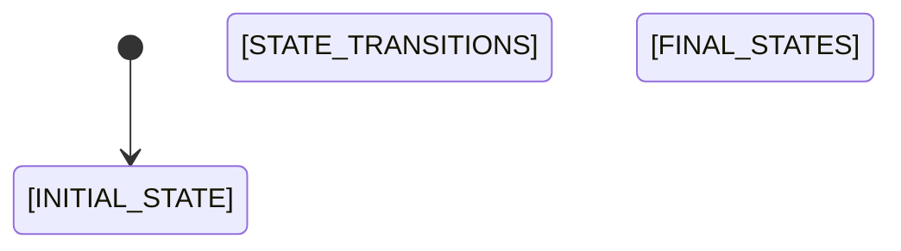

# State Diagram — [ENTITY_NAME]

<!-- Template: entity-state.md (CORE-031). Generated by /wf-diagram.
     Chi sinh cho entity co >= 3 trang thai (quy tac loc).
     Entity chi co active/inactive → BO QUA (khong sinh diagram).
     State dau = [*], cuoi = [*]. Transition ghi event/action gay chuyen trang thai. -->

## States

[STATES_TABLE]

<!-- Bang Markdown:
| State | Mô tả | Vào từ | Ra đến |
|-------|-------|--------|--------|
| pending | Đơn hàng vừa tạo, chờ xác nhận | [*] | confirmed, cancelled |
| confirmed | Đã xác nhận, chờ thanh toán | pending | paid, cancelled |
| paid | Đã thanh toán | confirmed | shipped |
| shipped | Đã giao cho shipper | paid | delivered |
| delivered | Khách đã nhận | shipped | [*] |
| cancelled | Đã hủy | pending, confirmed | [*] |
-->

## Transitions

[TRANSITIONS_TABLE]

<!-- Bang Markdown:
| From | To | Event/Action | Điều kiện | Source ref |
|------|----|--------------| ---------|------------|
| pending | confirmed | confirm() | Stock available | order.service.ts#confirm |
-->

## Notes

[STATE_NOTES]

<!-- Ghi chu:
     - State nao la final, intermediate
     - Co retry/timeout giua state nao khong
     - // TODO: can xac nhan — neu co state khong ro
-->

## Source

[STATE_SOURCE_REFS]

<!-- File source chua state machine / status enum:
     - apps/backend/src/order/order-status.enum.ts
     - apps/backend/src/order/order.service.ts (transition logic)
-->
