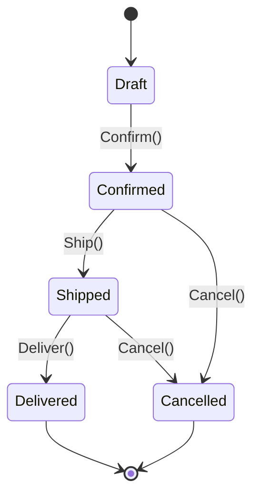

# State Machine — {FEAT-ID}: {Feature Name}

> Generated: {date} | Session: {SESSION_ID}
> Phạm vi: state machine cho entity chính có field status/state.
> Bỏ section này nếu feature không có status field.

---

## 1. Entity & Status Field

- **Entity:** `{EntityName}` (file: `{path/Entity.cs}`)
- **Status field:** `{FieldName}` (enum hoặc string)
- **Enum values:** `{Draft, Confirmed, Shipped, Delivered, Cancelled, ...}`

---

## 2. State Diagram

---

## 3. Valid Transitions

| # | From State | Action / Method | To State | Allowed Role | Precondition | Side Effects (cross-module) |
|---|-----------|-----------------|----------|--------------|--------------|------------------------------|
| 1 | Draft | Confirm | Confirmed | SalesManager | Customer.Active = true | Publish OrderConfirmedEvent |
| 2 | Confirmed | Ship | Shipped | WarehouseManager | Inventory.Available ≥ Quantity | Publish OrderShippedEvent, deduct inventory |
| 3 | Shipped | Deliver | Delivered | DeliveryStaff | POD uploaded | Publish OrderDeliveredEvent |
| 4 | Confirmed | Cancel | Cancelled | SalesManager | - | Publish OrderCancelledEvent, restore inventory |
| 5 | Shipped | Cancel | Cancelled | Manager | - | Compensation: restore inventory, reverse logistics |

---

## 4. Invalid Transitions (PHẢI BỊ REJECT)

| # | From State | Action | Expected Result | Test target |
|---|-----------|--------|-----------------|--------------|
| 1 | Draft | Ship (skip Confirm) | 400/422 + `INVALID_STATE_TRANSITION` | api-test-report.md §7 |
| 2 | Delivered | Cancel | 400/422 + `STATE_FINAL` | api-test-report.md §7 |
| 3 | Cancelled | Confirm | 400/422 + `STATE_TERMINAL` | api-test-report.md §7 |
| 4 | Draft | Deliver | 400/422 + `INVALID_STATE_TRANSITION` | api-test-report.md §7 |

---

## 5. State Lookup — Code locations

| State | Set tại | Read tại |
|-------|---------|----------|
| Draft | `{EntityName}.Create()` constructor | List/Detail queries |
| Confirmed | `ConfirmCommandHandler` line N | OrdersService.GetConfirmed() |
| ... | ... | ... |

---

## 6. Test Coverage Map

| Invalid Transition | Test case trong api-test-report.md | Status |
|--------------------|-------------------------------------|--------|
| Draft → Ship | §7 #1 | ⬜ Chưa test / ✅ PASS / ❌ FAIL |
| Delivered → Cancel | §7 #2 | - |
