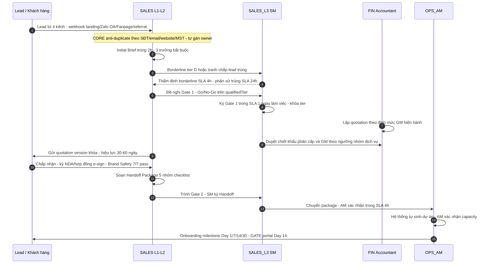
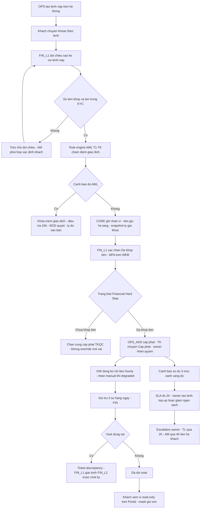
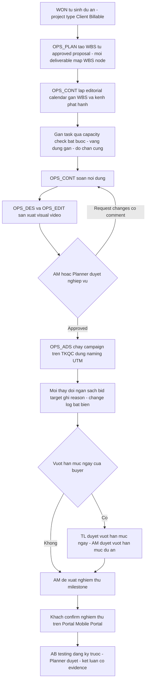
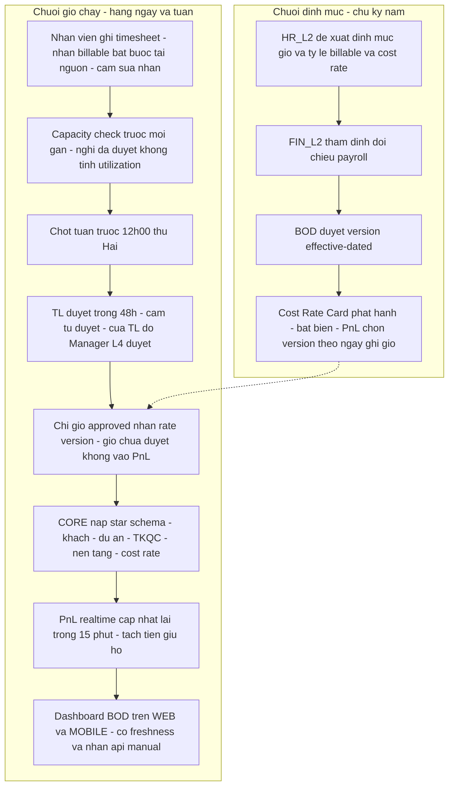
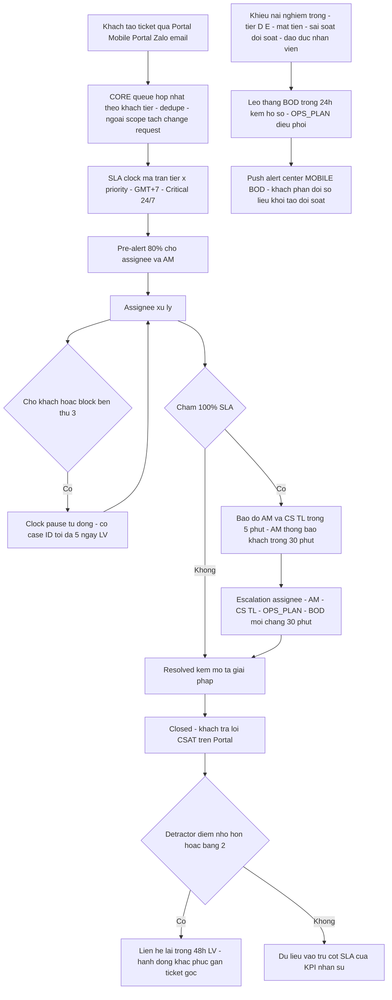

# Quy Trình Kinh Doanh Tổng Thể — BCERP

> **Loại tài liệu:** Mô hình kinh doanh — Toàn bộ luồng vận hành xuyên phòng ban (cross-dept workflow)
> **Cập nhật bởi:** business-analyst (tự động qua `/wf-analyze-requirements` — Phase 6b)
> **Ngày cập nhật:** 12/09/2026
> **Trạng thái:** Đang đánh giá
>
> READS: `P1-01-project-overview.md`, `departments/sales/sales.md`, `departments/operations/operations.md`, `departments/finance/finance.md`, `departments/hr/hr.md`, `departments/bod/bod.md`
> USED BY: `departments/[dept]/[dept].md`, `_meta/req-registry.json`, `phase2-features/[sys]/[mod]/[feat].md`

---

## 1. Mô Hình Kinh Doanh

**Loại hình kinh doanh:** Digital marketing agency — trung gian quản lý tài khoản quảng cáo (TKQC) đa nền tảng (Meta, Google, TikTok, Bing, X, Pinterest, Yandex) cho 1.000+ khách toàn cầu với 2.600+ TKQC active, kết hợp dịch vụ marketing (ads ops, SEO, web/đồ họa, content, TikTok Shop monitoring). Nguyên tắc tiền cốt lõi: **tiền nạp QC của khách là tiền giữ hộ (nợ phải trả)** — không bao giờ là doanh thu; doanh thu chỉ tính trên **phí dịch vụ + markup/chiết khấu agency**.

**Sản phẩm / Dịch vụ chính:**

| STT | Sản phẩm / Dịch vụ | Mô tả ngắn | Đối tượng khách hàng |
|-----|--------------------|-----------|---------------------|
| 1 | Agency account & cho thuê TKQC | Mở, quản lý, cấp phát TKQC 7 nền tảng theo naming chuẩn; khách nạp trước 100% ngân sách QC | FMCG, F&B, Retail, Beauty, B2B đa quốc gia |
| 2 | Ads operations | Xây dựng, tối ưu chiến dịch theo mục tiêu conversion/traffic/awareness | Khách tier B–E |
| 3 | SEO / Web / Thiết kế / Content | Deliverable số: website, key visual, video, bài viết theo editorial calendar | Khách theo hợp đồng dịch vụ |
| 4 | TikTok Shop monitoring | Giám sát GMV/đơn/settlement qua API per-client — chỉ số tham chiếu, tách bạch khỏi P&L agency | Khách có shop TikTok |

**Bốn trụ cột chi phối mọi luồng:** (1) minh bạch dữ liệu khách qua Client Portal multi-tenant; (2) Financial Hard Stop — không cấp phát TKQC khi FIN_L1 chưa xác nhận "đã khớp tiền", chặn cứng trong code, không vai nào bypass; (3) P&L realtime theo dự án/khách, tách tuyệt đối khỏi tiền giữ hộ; (4) Lifecycle V6.0 stage-gate machine-checkable với audit log bất biến.

---

## 2. Các Bộ Phận Tham Gia

| STT | Phòng ban | Vai trò chính trong kinh doanh | Quy mô |
|-----|-----------|-------------------------------|--------|
| 1 | Kinh doanh (SALES) | Nửa đầu Lifecycle V6.0: lead → scoring → Gate 1/Gate 2 → quotation → hợp đồng → Handoff; quota & hoa hồng theo thực nhận | L1–L5 (GDKD L5 quy hoạch, tạm BOD kiêm nhiệm) |
| 2 | Vận hành & Marketing nội bộ (OPS) | Handoff, proposal, campaign delivery, Command Center 2.600+ TKQC, ví góc ops, SLA/ticket, portal khách | OPS_PLAN (L5), OPS_AM, OPS_ADS, OPS_CONT/DES/EDIT |
| 3 | Tài chính - Kế toán (FIN) | Gác cổng dòng tiền: ví TKQC, đối soát 3 số, Hard Stop, AR/AP, duyệt chi, AML/KYC, HĐĐT | FIN_L1, FIN_L2, phối hợp CFO |
| 4 | Hành chính Nhân sự (HR) | Hồ sơ L1–L5 nguồn sự thật, Cost Rate Card, quy tắc timesheet/capacity, KPI–PIP, PII | HR_L1, HR_L2 |
| 5 | Ban Điều Hành (BOD) | Duyệt vượt ngưỡng, P&L oversight, audit log, alert center, chính sách/tham số/tier | CEO, CFO kiêm CTO |
| 6 | Khách hàng (bên ngoài, tham gia trực tiếp) | Nạp tiền theo lệnh, nghiệm thu trên Portal, tạo ticket, trả CSAT | 1.000+ tenant, ~2.000–3.000 user |

---

## 3. Luồng Kinh Doanh Chính (End-to-End)

> Năm luồng xuyên phòng ban — "con đường tiền đi" và "con đường việc đi". Quy trình nội bộ từng phòng ở mức business rule nằm tại `departments/[dept]/[dept].md`; tại đây chỉ mô tả điểm tiếp xúc giữa các dept và với khách. Mỗi luồng được tham chiếu trong Mục 4 theo format "Luồng X, Bước Bn".

### 3.1. Luồng 1: Lead → Deal → Handoff → Onboarding (SALES → OPS)

**Các phòng ban tham gia:**

| Bước | Phòng ban | Công việc | REQ-ID |
|------|-----------|-----------|--------|
| B1 Thu nhận lead | SALES | 4 kênh vào Raw Data; anti-duplicate; SM phân xử trùng 24h | REQ-SALES-001 |
| B2 Initial Brief | SALES | 3 trường bắt buộc trong 2h; meeting notes trước QUALIFIED | REQ-SALES-002 |
| B3 Scoring & tier | SALES (SM) | AUTO SCORING K1–K12, knockout K1–K5; SM thẩm định borderline 4h | REQ-SALES-003 |
| B4 Gate 1 | SALES (SM) | Ký Go/No-Go trong 1 ngày LV; khóa qualifiedTier | REQ-SALES-004 |
| B5 Quotation | FIN + SALES | Lập theo định mức GM; duyệt chiết khấu ≤5/5–15/15–20/>20%; version khóa | REQ-SALES-006, REQ-FIN-008 |
| B6 Hợp đồng & Brand Safety | SALES + OPS + FIN | NDA trước Full Brief; Brand Safety 7/7; nạp trước 100% NSQC; e-sign | REQ-SALES-007 |
| B7 Gate 2 & Handoff | SALES + OPS | Package 5 nhóm 100%; SM ký, AM xác nhận 4h; capacity trống = 0 → cảnh báo GDKD + OPS_PLAN | REQ-SALES-008, REQ-OPS-004 |
| B8 Onboarding | OPS (AM) | Tự sinh dự án; milestone Day 1/7/14/30; GATE kích hoạt portal Day 14; thiếu sót quay về SM | REQ-OPS-004, REQ-OPS-010 |
| B9 Chuyển tier & credit | SALES + OPS + FIN | Tier chuyển nguyên trạng cho CS tại WON; split ghi trước Gate 2; credit theo thực nhận đối chiếu AR | REQ-SALES-005, REQ-SALES-009, REQ-FIN-007 |

**RACI** (R = thực hiện, A = chịu trách nhiệm, C = tham vấn, I = thông báo):

| Bước | SALES | FIN | OPS | HR | BOD |
|------|-------|-----|-----|----|----|
| B1–B3 Lead/Scoring | R/A | I | — | — | I (deal BOD-sponsored) |
| B4 Gate 1 | A (SM ký) | — | I | — | I (escalate quá SLA) |
| B5 Quotation | A (TPKD/GDKD duyệt chiết khấu theo ma trận) | R (lập theo định mức GM) | — | — | A (>20% chiết khấu) |
| B6 Hợp đồng | R/A | C (nạp 100%) | C (ràng buộc vận hành) | — | A (HĐ giá trị lớn) |
| B7 Gate 2 | R (SM ký) | I | A (AM xác nhận 4h) | C (capacity) | I |
| B8 Onboarding | I | I | R/A | — | I |
| B9 Tier/Credit | R/A | C (AR nguồn sự thật) | I | I | I |

**Handoff & SLA:** SALES → FIN tại B5 (duyệt chiết khấu: TPKD 8 giờ LV, GDKD 1 ngày, BOD 2 ngày); SALES → OPS tại B7 (AM xác nhận **4h**, WON → AM xác nhận capacity **24h** là điều kiện mở DEPLOY); OPS → SALES tại B8 (thiếu sót Day 1–30 quay về SM — handoff miệng/chat không được công nhận); OPS ↔ HR tại B7 (capacity check 4h → TL 8h → HR_L2 cân đối đầu người).

### 3.2. Luồng 2: Tiền Giữ Hộ & Financial Hard Stop (Khách → FIN → OPS_ADS)

*Lưu ý: node trong sơ đồ viết không dấu để bảo đảm renderer Mermaid ổn định; nội dung chuẩn có dấu ở bảng dưới.*

**Các phòng ban tham gia:**

| Bước | Phòng ban | Công việc | REQ-ID |
|------|-----------|-----------|--------|
| B1 Lệnh nạp | OPS (AM/ADS) | Lệnh trên hệ thống chứa khách/TKQC/số tiền/tỷ giá/căn cứ — cấm lệnh miệng Zalo/điện thoại | REQ-OPS-003, REQ-FIN-001 |
| B2 KYC & AML | FIN + OPS | KYC Verified trước cấp phát; AML T1–T6; đỏ → khóa mềm, điều tra 24h, BOD quyết | REQ-FIN-009, REQ-FIN-010 |
| B3 Ghi nhận ví | FIN (L1) | Đối chiếu sao kê — lệnh; snapshot tỷ giá khóa; tiền giữ hộ tăng, cấm auto-hạch toán thành doanh thu | REQ-FIN-001, REQ-FIN-004 |
| B4 Xác nhận khớp tiền | FIN (L1) | "Đã khớp tiền" trên WEB với MFA; evidence sao kê + timestamp bắt buộc | REQ-FIN-006 |
| B5 Hard Stop | Hệ thống (CORE) | Chặn cứng tầng API + UI; không override; thu hồi xác nhận → TK tự pause + alert TL | REQ-OPS-002, REQ-FIN-006 |
| B6 Cấp phát TKQC | OPS (ADS) | Registry chuyển "Cấp phát"; naming/UTM chuẩn; SoD 4 vai dòng tiền | REQ-OPS-001, REQ-OPS-002 |
| B7 Đồng bộ & đối soát | FIN + GW | Pull hourly 7 nền tảng; đối trừ 3 vế hằng ngày; vượt dung sai → ticket, cấm tự cân số; phí nền tảng ghi theo giao dịch gốc | REQ-FIN-005, REQ-FIN-004, REQ-FIN-014 |
| B8 Duyệt chi nạp nền tảng | FIN + BOD | Kế hoạch nạp tuần duyệt gộp; >50 triệu dual approval CFO; >200 triệu + CEO | REQ-FIN-008, REQ-BOD-001 |
| B9 Cảnh báo số dư | OPS + FIN | ADS 7 ngày rolling; xanh/vàng/đỏ; SLA đỏ 2h; escalation owner → TL (2h) → AM (4h, liên hệ khách) | REQ-OPS-003, REQ-FIN-002 |
| B10 Minh bạch khách | Khách + FIN | Portal xem ví read-only, mask giá vốn thành "điều chỉnh đối soát", disclaimer độ trễ | REQ-FIN-017, REQ-OPS-010 |
| B11 Nền móng kiểm soát | FIN + BOD | Audit log hash-chain WORM ≥10 năm; dual approval điều chỉnh/hoàn tiền; CEO duyệt giao dịch CFO khởi tạo | REQ-FIN-012, REQ-FIN-003, REQ-BOD-002 |

**RACI:**

| Bước | SALES | FIN | OPS | HR | BOD |
|------|-------|-----|-----|----|----|
| B1 Lệnh nạp | I | C | R/A | — | — |
| B2 KYC/AML | I | R/A | C (thu thập hồ sơ) | — | A (EDD, đỏ) |
| B3–B4 Ghi nhận & khớp tiền | — | R/A | I | — | I |
| B5 Hard Stop | I | A | R (gặp gate) | — | I (không bypass) |
| B6 Cấp phát | I | C (view-only) | R/A | I (offboard revoke) | — |
| B7 Đối soát | — | R/A | C | — | I |
| B8 Duyệt chi | — | R | C | — | A (ngưỡng cao) |
| B9 Cảnh báo ví | I (AM giữ khách) | C | R/A | — | I (alert center) |
| B10 Portal ví | — | C | R (mask, cấp quyền) | — | I |

**Handoff & SLA:** OPS → FIN tại B1 (lệnh nạp là input duy nhất FIN chấp nhận đối chiếu); FIN → OPS tại B4–B5 (khớp tiền mở Hard Stop — không bypass; khẩn ngoài giờ xử lý nhanh hơn nhưng không bỏ bước); OPS_ADS → OPS_AM → khách tại B9 (SLA đỏ 2h, escalation có timestamp từng chặng); FIN → khách tại B10 (số tranh chấp hiển thị "Đang đối soát"); giao dịch CFO khởi tạo vượt ngưỡng → CEO duyệt ≤4h; kỳ đã chốt chỉ CFO mở lại có phiếu lý do (REQ-BOD-010); bút toán đối chiếu sổ kế toán VAS hằng tháng qua GW (REQ-FIN-013); HĐĐT chỉ phát hành trên doanh thu dịch vụ từ chứng từ đã khóa kỳ (REQ-FIN-011, REQ-FIN-012).

### 3.3. Luồng 3: Campaign Delivery (OPS nội bộ, khách nghiệm thu qua Portal)

**Các phòng ban tham gia:**

| Bước | Phòng ban | Công việc | REQ-ID |
|------|-----------|-----------|--------|
| B1 WBS & project type | OPS (PLAN) | WBS từ approved proposal đã qua gate EVALUATION/PROPOSAL (Brand Safety 7/7, GM duyệt); project type khóa tập nhãn timesheet; campaign không gắn dự án tự pause trong 4h LV | REQ-OPS-005, REQ-OPS-006, REQ-OPS-001 |
| B2 Editorial calendar | OPS (CONT) | Pipeline Ý tưởng → Đã xuất bản; trượt deadline cảnh báo TL + AM cập nhật khách | REQ-OPS-006 |
| B3 Gán task | OPS + HR (quy tắc) | Capacity check bắt buộc; vàng >90% TL duyệt, đỏ ≥100% chặn cứng; khẩn khách ≤110% trong ≤5 ngày LV | REQ-OPS-007, REQ-HR-009 |
| B4 Duyệt creative | OPS | Pipeline đa vai, cấm tự duyệt; quá 3 vòng/deliverable escalate TL chốt phạm vi với khách qua AM | REQ-OPS-006 |
| B5 Chạy campaign & change log | OPS (ADS) | Change log bất biến có reason; dữ liệu chi tiêu theo campaign từ GW để đối chiếu hiệu quả | REQ-OPS-006, REQ-OPS-012 |
| B6 Nghiệm thu | OPS → Khách | Milestone 100% WBS Approved → khách confirm Portal; quá 5 ngày LV nhắc + escalate AM | REQ-OPS-010, REQ-SALES-008 |
| B7 Dữ liệu nền tảng | OPS + GW | TikTok Shop GMV/settlement chỉ tham chiếu — chặn mapping vào doanh thu; không làm OMS/WMS | REQ-OPS-011 |

**RACI:**

| Bước | SALES | FIN | OPS | HR | BOD |
|------|-------|-----|-----|----|----|
| B1 WBS | I (feedback package) | — | R/A | — | — |
| B3 Capacity | — | — | R | A (quy tắc, escalation 8h) | — |
| B4 Duyệt creative | — | — | R/A | — | — |
| B5 Change log | — | C (dung sai đối soát) | R/A | — | I (alert vượt hạn mức tuần) |
| B6 Nghiệm thu | I | — | R; A = khách | — | — |
| B7 TikTok Shop | I (SM Gate Go-live) | C (đối soát settlement) | R/A | — | I |

**Handoff & SLA:** Luồng khép kín trong OPS nhưng có 3 điểm cắt: SALES nhận feedback milestone onboarding (B6); HR sở hữu quy tắc capacity — quá SLA 4h escalate TL, quá 8h HR_L2 (B3); FIN nhận chi tiêu theo campaign để đối trừ và chặn hạch toán GMV vào doanh thu (B5–B7). Mỗi bước duyệt nội bộ SLA 8h LV, chậm 2 bước liên tiếp escalate TL.

### 3.4. Luồng 4: Nhân Sự Chi Phí → P&L (HR/OPS → FIN → BOD)

**Các phòng ban tham gia:**

| Bước | Phòng ban | Công việc | REQ-ID |
|------|-----------|-----------|--------|
| B1 Định mức & rate | HR → FIN → BOD | HR_L2 đề xuất; FIN_L2 thẩm định đối chiếu payroll (lệch >±10% trả về); BOD duyệt; version SCD2 bất biến | REQ-HR-006, REQ-BOD-009 |
| B2 Ghi timesheet | OPS + toàn công ty | Nhãn Client Billable/Internal Non-billable tại nguồn; correction qua audit log; nghỉ đã duyệt tự trừ capacity | REQ-OPS-007, REQ-HR-004 |
| B3 Chấm công & OT | HR + TL | 40h chuẩn/48h trần gồm OT (Điều 107 BLLĐ); OT ≤8h/tuần duyệt trước; vượt trần/retro HR_L2 duyệt 24h | REQ-HR-003 |
| B4 Duyệt tuần | OPS TL + HR (quy tắc) | TL duyệt 48h, approver ≠ người ghi; quá 72h escalate Manager | REQ-HR-009, REQ-OPS-007 |
| B5 Cost → P&L | FIN | Giờ approved × rate version theo ngày ghi giờ; chi outsource/tools gắn mã dự án, không gắn được → overhead + lý do | REQ-FIN-016, REQ-HR-006 |
| B6 P&L & BI | BOD | P&L = Doanh thu DV − (giờ × rate + outsource + tools); tách tiền giữ hộ; freshness ≤15 phút; metric catalog CFO duyệt | REQ-BOD-003, REQ-BOD-004 |
| B7 KPI feedback | HR | KPI 3 trụ cột tự tổng hợp từ dữ liệu OPS (task/deliverable/SLA); quá tải >100% ≥2 tuần miễn phạt điểm On-time | REQ-HR-007 |

**RACI:**

| Bước | SALES | FIN | OPS | HR | BOD |
|------|-------|-----|-----|----|----|
| B1 Định mức/rate | — | R (thẩm định) | C | A (đề xuất) | A (duyệt cuối) |
| B2 Ghi timesheet | R (phòng mình) | — | R/A | C (quy tắc) | — |
| B3 Chấm công/OT | — | C (payroll) | R | R/A | — |
| B4 Duyệt tuần | — | — | R/A | C (escalation, OT vượt trần) | — |
| B5 Cost → P&L | — | R/A | I | C (rate version) | — |
| B6 P&L/BI | — | C | I | I | R/A |
| B7 KPI | — | — | C (dữ liệu gốc) | R/A | A (chốt L4–L5) |

**Handoff & SLA:** HR → OPS tại B1 (OPS chỉ dùng cấu hình, không tự thay); OPS → FIN tại B4–B5 (chỉ giờ approved được allocate cost — gate CORE; FIN nhận tổng hợp công/OT có log cho payroll); FIN → BOD tại B6 (dashboard realtime, nhãn nguồn api/manual); HR → OPS ngoài luồng khi offboarding: sự kiện nghỉ việc → thu hồi tài khoản ERP và quyền TKQC trong 24h, OPS thực thi và xác nhận (REQ-HR-001). Lương/cost cá nhân là Restricted — chỉ HR_L2 + BOD xem, FIN_L2 đọc khi thẩm định có log (REQ-HR-010).

### 3.5. Luồng 5: CSKH & SLA (Khách → OPS_AM → BOD khi khiếu nại)

**Các phòng ban tham gia:**

| Bước | Phòng ban | Công việc | REQ-ID |
|------|-----------|-----------|--------|
| B1 Tiếp nhận | Khách → OPS | Queue hợp nhất đa kênh; state machine New → Closed; reopen trong 7 ngày giữ ngữ cảnh | REQ-OPS-009, REQ-OPS-010 |
| B2 SLA clock | OPS | Ma trận tier × priority (E nhanh nhất — A chậm nhất; Critical 24/7); HĐ cam kết cao hơn ghi đè profile; pause tự động Pending/Blocked-3rd-party | REQ-OPS-008 |
| B3 Pre-alert & breach | OPS | 80% cảnh báo vàng; 100% báo đỏ AM + CS TL ≤5 phút; AM thông báo khách trong 30 phút — không báo là vi phạm riêng | REQ-OPS-008 |
| B4 Escalation | OPS → BOD | Override: CS TL gia hạn lần 1 ≤50%; OPS_PLAN lần 2; BOD miễn theo đợt — lý do + audit log bắt buộc | REQ-OPS-008, REQ-BOD-006 |
| B5 CSAT & detractor | Khách + OPS | CSAT tự động sau Closed; detractor ≤2 liên hệ lại 48h LV; tier CSAT <4,0 hai tháng liên tiếp → review dịch vụ OPS_PLAN | REQ-OPS-009 |
| B6 Khiếu nại nghiêm trọng | OPS → BOD | Tier D/E, mất tiền, sai sót đối soát, đạo đức nhân viên → BOD trong 24h kèm hồ sơ | REQ-OPS-009, REQ-BOD-006 |
| B7 Phản đối số liệu | Khách → FIN | AM khởi tạo đối soát; Portal hiển thị "Đang đối soát"; xử lý theo quy trình discrepancy | REQ-FIN-004, REQ-OPS-010 |
| B8 Feedback KPI/PIP | HR | SLA breach là đầu vào trụ cột 3 của KPI; vi phạm nghiêm trọng là gợi ý mở PIP | REQ-HR-007, REQ-HR-008 |

**RACI:**

| Bước | SALES | FIN | OPS | HR | BOD |
|------|-------|-----|-----|----|----|
| B1 Tiếp nhận | I | — | R/A | — | — |
| B2–B3 SLA | — | — | R/A | — | I |
| B4 Escalation/Override | — | — | R | — | A (miễn theo đợt, khiếu nại) |
| B5 CSAT | — | — | R/A | C (KPI) | I |
| B6 Khiếu nại | I (SM giữ quan hệ) | C (sai sót đối soát) | R | — | A |
| B7 Phản đối số liệu | — | R/A | R (AM điều phối) | — | I |
| B8 KPI/PIP | — | — | C (dữ liệu) | R/A | A (PIP kết luận) |

**Handoff & SLA:** khách → OPS qua Portal/kênh chính thức (B1); OPS → BOD khiếu nại **24h** và breach đỏ ≤5 phút vào alert center (B4, B6); OPS ↔ FIN phản đối số liệu khởi tạo đối soát, Portal hiển thị trạng thái riêng (B7); OPS → HR dữ liệu SLA cho KPI kỳ và gợi ý PIP (B8). Breach lặp (≥3/khách/30 ngày hoặc ≥2 cùng root cause/90 ngày) → post-mortem 5 ngày LV.

---

## 4. Các Điểm Chuyển Giao Giữa Phòng Ban

| STT | Từ → Sang | Nội dung chuyển giao | Cách thực hiện trên BCERP | SLA | Tham chiếu |
|-----|-----------|---------------------|---------------------------|-----|-----------|
| 1 | SALES → FIN | Lập quotation theo định mức; duyệt GM/chiết khấu | Quotation engine, version khóa, trace định mức hiệu lực | TPKD 8h; GDKD 1 ngày; BOD 2 ngày | Luồng 1, Bước B5 |
| 2 | SALES → OPS | Handoff Package 5 nhóm, ký 3 bên SM + AM | E-approval WEB; checklist chặn Gate 2 nếu <100%; tự sinh dự án | AM xác nhận 4h; capacity 24h | Luồng 1, Bước B7–B8 |
| 3 | OPS → SALES | Feedback thiếu sót onboarding Day 1–30 | Milestone tracking gắn package; cảnh báo trượt mốc | Theo mốc Day 1/7/14/30 | Luồng 1, Bước B8 |
| 4 | OPS → FIN | Lệnh nạp/top-up/điều chỉnh ví | Lệnh hệ thống; cấm lệnh miệng | Khớp tiền trước khi cấp phát | Luồng 2, Bước B1 |
| 5 | FIN → OPS | Xác nhận "Đã khớp tiền" mở Hard Stop | Chặn cứng tầng API + UI, không override | Không bypass; khẩn = nhanh hơn, không bỏ bước | Luồng 2, Bước B4–B5 |
| 6 | OPS → Khách | Cảnh báo đỏ số dư — yêu cầu nạp | Alert đỏ + escalation; AM liên hệ khách trong ngày LV | SLA đỏ 2h; escalate 2h/4h | Luồng 2, Bước B9 |
| 7 | FIN → Khách | Số dư ví, chi tiêu daily, trạng thái đối soát | Portal read-only qua view lọc tenant; mask giá vốn; watermark | Disclaimer độ trễ 15 phút–24h | Luồng 2, Bước B10 |
| 8 | OPS → Khách | Nghiệm thu deliverable theo milestone | Khách confirm Portal/Mobile Portal, realtime | Chờ confirm 5 ngày LV | Luồng 3, Bước B6 |
| 9 | OPS → FIN | Giờ timesheet đã duyệt → chi phí dự án | Gate CORE: chỉ giờ approved × Cost Rate Card | TL duyệt 48h; quá 72h escalate | Luồng 4, Bước B4–B5 |
| 10 | HR → OPS | Định mức giờ/billable/OT; thu hồi TKQC khi offboarding | Cấu hình effective-dated do BOD duyệt; sự kiện nghỉ → revoke | Định mức chu kỳ năm; revoke 24h | Luồng 4, Bước B1 |
| 11 | Khách → OPS | Ticket/CSAT/khiếu nại kênh chính thức | Queue hợp nhất Portal/Zalo/email, state machine | FR/Res theo tier × priority; Critical 24/7 | Luồng 5, Bước B1–B2 |
| 12 | OPS → BOD | Khiếu nại nghiêm trọng; breach đỏ; rủi ro dòng tiền | Alert center + push MOBILE ≤5 phút, hồ sơ kèm theo | Khiếu nại 24h; breach 5 phút | Luồng 5, Bước B4, B6 |

---

## 5. Các Bên Liên Quan Bên Ngoài

| STT | Bên ngoài | Loại quan hệ | Tương tác chính | Tần suất |
|-----|-----------|-------------|-----------------|----------|
| 1 | 7 nền tảng QC (Meta, Google, TikTok, Bing, X, Pinterest, Yandex) | Cung ứng dịch vụ QC | Nạp tiền, sync số dư/chi tiêu qua API Gateway, die account, Business Verification | Sync hourly; giao dịch hằng ngày |
| 2 | Khách hàng 1.000+ tenant | Khách hàng | Nạp tiền giữ hộ, nghiệm thu Portal, ticket, CSAT, KYC/UBO, DPA (khách EU/US) | Hằng ngày |
| 3 | Ngân hàng | Tài chính | Tiền khách về TK BC; đối chiếu sao kê ↔ lệnh nạp | Hằng ngày |
| 4 | Cơ quan thuế & DV HĐĐT | Pháp lý | HĐĐT XML TT78/2021 + NĐ123/2020, mã cơ quan thuế | Theo phát sinh |
| 5 | Đối tác chính thức Google/TikTok/Yandex | Đối tác kênh | Referral lead, chính sách agency, hỗ trợ tài khoản | Liên tục |
| 6 | Phần mềm kế toán VAS hiện hữu | Tích hợp | Đồng bộ bút toán/chứng từ/HĐĐT — tích hợp, không thay thế | Hằng tháng |
| 7 | Luật sư VN (dữ liệu/công nghệ) + auditor độc lập | Tư vấn/Xác nhận | NĐ13/2023, GDPR/CCPA, Luật Kế toán 2015, AML/KYC, mẫu HĐ | Theo giai đoạn |

---

## 6. Chỉ Số Kinh Doanh Quan Trọng (KPIs)

| STT | Chỉ số | Ý nghĩa | Ai theo dõi | Tần suất |
|-----|--------|---------|-------------|----------|
| 1 | Case cấp TKQC khi chưa khớp tiền | Phải = 0 — thước đo Financial Hard Stop | BOD, FIN | Realtime |
| 2 | Sai lệch đối trừ 3 số | Mục tiêu ±0,1%; dung sai nạp = 0/dòng | FIN_L2, CFO | Hằng ngày |
| 3 | Độ tươi chi tiêu QC | ≤1h; stale nghiêm trọng >8h alert BOD | OPS, BOD | Realtime |
| 4 | P&L realtime theo dự án/khách | Freshness ≤15 phút, tách tiền giữ hộ | BOD | Realtime |
| 5 | SLA compliance FR/Res theo tier × priority | Breach, MTTR, breach lặp; AM báo khách 30 phút | OPS_AM, OPS_PLAN, BOD | Tuần/tháng |
| 6 | CSAT + tỷ lệ detractor | Đo sau mỗi ticket; tier <4,0 hai tháng → review dịch vụ | OPS_AM, OPS_PLAN | Ticket/tháng |
| 7 | Pipeline coverage & attainment | ≥3× quota = on-track; <2× đỏ bắt buộc kế hoạch bổ sung | SM, GDKD | Tuần |
| 8 | Win rate theo tier + độ chính xác scoring | Độ lệch điểm CQ vs kết quả thực | GDKD, BOD | Quý |
| 9 | Capacity utilization & tỷ lệ billable thực tế | Vàng >90%, đỏ ≥100%; so mục tiêu L1 ≥80% → L5 20–30% | OPS_PLAN, TL, HR_L2 | Tuần |
| 10 | Aging AR/AP + clawback | Nợ >90 ngày → clawback hoa hồng 100% phần chưa thu | FIN_L2, GDKD | Tuần/tháng |
| 11 | Tỷ lệ die account & thời gian thay thế | Evidence bất biến; TK dự phòng chuyển hướng ≤4h LV | OPS_ADS, TL | Sự cố/tháng |
| 12 | Onboarding adoption portal | GATE Day 14: khách tự xem số dư + chi tiêu + ticket | OPS_AM | Theo khách |

---

## 7. Quy Định & Ràng Buộc Kinh Doanh

| STT | Quy định | Mô tả | Ảnh hưởng đến |
|-----|----------|-------|---------------|
| 1 | Tiền giữ hộ = nợ phải trả | Không hạch toán thành doanh thu; doanh thu chỉ phí dịch vụ/markup; HĐĐT không xuất cho dòng giữ hộ | FIN, SALES, BOD |
| 2 | Financial Hard Stop không bypass | Chặn cứng trong code; không nút override, không "chờ duyệt"; yêu cầu mở khóa bị từ chối + audit log — kể cả CEO/Super Admin | OPS, FIN, BOD |
| 3 | SoD 4 vai dòng tiền | Đề xuất ≠ khớp tiền ≠ duyệt chi ≠ ghi sổ; dual approval 3 giao dịch rủi ro cao; CEO duyệt thay giao dịch CFO khởi tạo | FIN, BOD |
| 4 | Audit log bất biến WORM ≥10 năm | Append-only + hash-chain cho sự kiện tiền/hợp đồng; xem log cũng bị log; sửa chỉ qua reversal có reason code | Toàn công ty |
| 5 | "Không ghi nhận = không tồn tại" | Lead, deal, timesheet, split credit, chữ ký gate phải có bản ghi hệ thống trước khi phát sinh hệ quả; chặn 2 tầng UI + API | SALES, OPS |
| 6 | Bảo vệ dữ liệu cá nhân | NĐ13/2023 + GDPR: breach notification 72h; tenant isolation tuyệt đối; PII lương/cost Restricted; DSAR 1 tháng | Toàn công ty, Khách |
| 7 | Lao động | Điều 107 BLLĐ 2019: chặn cứng OT >48h/tuần, trần 200h/năm; e-sign hợp đồng theo Luật GDTĐT 2023 | HR, OPS |
| 8 | Quảng cáo & brand safety | Luật Quảng cáo 2012 (knockout K1); Brand Safety 7/7 pass mới qua gate; không cam kết KPI cứng cho khách | SALES, OPS |
| 9 | AML/KYC | KYC Verified trước cấp phát TKQC; rule T1–T6; hoàn tiền chỉ về đúng TK nguồn trùng tên pháp nhân | FIN, OPS |
| 10 | Nguyên tắc hệ thống | Mọi lệnh qua hệ thống (cấm lệnh miệng); dữ liệu degraded gắn nhãn `manual`; chỉ báo freshness mọi số liệu | Toàn công ty |

---

## 8. Điểm Cắt Giữa Các Hệ Thống

Sáu hệ thống: **SYS-CORE-BACKEND** (CORE — nguồn sự thật, rule engine, enforcement), **SYS-BCERP-WEB** (WEB — mặt làm việc nội bộ), **SYS-INTEGRATION-GW** (GW — data plane 7 nền tảng + connector VAS), **SYS-PORTAL-WEB** (PORTAL — khách web), **SYS-MOBILE-INTERNAL** (M-INT — ký duyệt + cảnh báo nội bộ), **SYS-MOBILE-PORTAL** (M-PORTAL — khách mobile).

| Luồng | Đường đi qua hệ thống | Điểm cắt đáng chú ý |
|-------|----------------------|---------------------|
| Luồng 1 | GW (webhook lead 3 kênh số) → CORE (anti-duplicate, scoring, gate engine) → WEB (pipeline, quotation, checklist) → M-INT (SM ký gate — kênh ký chính từ GĐ2, MFA step-up) → CORE (tự sinh dự án) → PORTAL/M-PORTAL (khách kích hoạt — GATE Day 14) | M-INT không nhập liệu hàng loạt; lead webhook lỗi → hàng đợi retry ở GW, không mất lead |
| Luồng 2 | WEB (tạo lệnh, xác nhận khớp tiền MFA) → CORE (ledger append-only, hard stop tầng API, SoD engine, AML T1–T6, snapshot tỷ giá) → GW (pull hourly, nhãn `manual` khi degraded) → CORE (đối trừ 3 số) → M-INT (push alert, duyệt ví ngoài giờ) → PORTAL/M-PORTAL (ví read-only, mask giá vốn) | Hard Stop chủ ý **không có bản M-INT/PORTAL** — không tồn tại nút duyệt để bypass; xác nhận khớp tiền chỉ trên WEB |
| Luồng 3 | CORE (WBS, gate, change log bất biến, capacity engine) → WEB (calendar, duyệt creative, form thay đổi ngân sách) → GW (đẩy thay đổi xuống platform, kéo chi tiêu theo campaign) → PORTAL/M-PORTAL (khách confirm nghiệm thu) | Change log từ chối request thiếu reason ở tầng API; khẩn cấp pause trước — bổ sung reason trong 4h LV |
| Luồng 4 | WEB/M-INT (ghi timesheet, TL duyệt) → CORE (gate "giờ chưa duyệt không vào P&L", Cost Rate Card SCD2, star schema) → WEB/M-INT (dashboard BOD, freshness ≤15 phút) | Định mức/rate là tham số effective-dated do BOD duyệt — OPS không có nút sửa; M-INT chưa khai báo cho HR (duyệt mobile xem xét khi mở scope) |
| Luồng 5 | PORTAL/M-PORTAL (khách tạo ticket, trả CSAT) + GW (webhook email/Zalo) → CORE (queue hợp nhất, SLA clock GMT+7, escalation, CSAT engine) → WEB/M-INT (assignee xử lý, AM báo khách, duyệt gia hạn) → CORE → M-INT (push BOD khiếu nại/breach đỏ) | Đồng hồ hiển thị song song giờ địa phương khách; override bắt buộc lý do + audit log |
| Nền dùng chung | CORE: audit log hash-chain mọi sự kiện tiền/hợp đồng/phân quyền, WORM ≥10 năm, giám sát BOD (REQ-BOD-005); GW: credentials vault MFA bắt buộc, rotate ≥90 ngày — **M-INT cấm toàn bộ thao tác vault** (REQ-BOD-008); phân quyền: chỉ CEO duyệt gán/thu hồi role, quarterly access review (REQ-BOD-007); PORTAL tách network zone, chỉ đọc view tổng hợp đã lọc tenant, không chạm DB nội bộ | Tham số/chính sách BOD duyệt trên WEB (effective-dated); M-INT BOD là kênh cảnh báo khẩn push ≤5 phút, không tra cứu audit log |

---

**Lưu ý:** Tài liệu mô tả **mô hình kinh doanh thực tế xuyên phòng ban** — không phải thiết kế kỹ thuật. Mỗi luồng tham chiếu REQ-ID từ 5 department docs; chi tiết mức business rule (`BR-*`) nằm tại `departments/[dept]/[dept].md`, là đầu vào cho `_meta/req-registry.json` và Phase 2 (`phase2-features/`).
