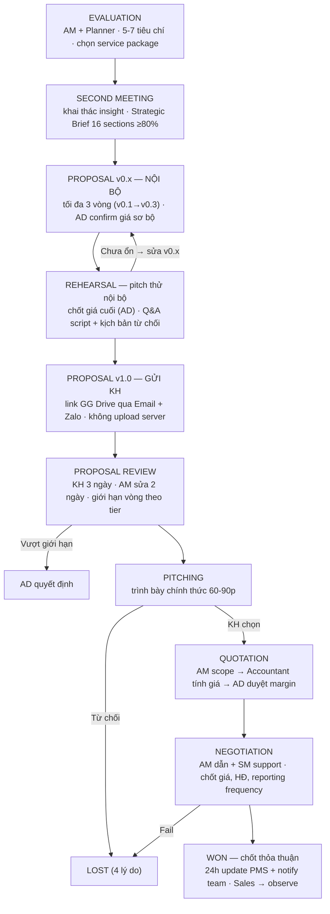

# GIAI ĐOẠN 2: ĐÁNH GIÁ & ĐỀ XUẤT (EVALUATION → WON)

**Mã tài liệu:** `03_Giai_doan_2_Danh_gia_va_De_xuat.md`
**Phiên bản:** 1.0 — 12/09/2026
**Chủ thực thi:** BPVH (AM dẫn chính, Planner hỗ trợ, AD phê duyệt giá/escalation) · Accountant tính giá
**Nguyên tắc giai đoạn:** Vận hành thực thi — Sales theo dõi (Observe) `[V6.0]`
**Trình tự theo v2.3:** EVALUATION → SECOND_MEETING → PROPOSAL_INTERNAL → REHEARSAL → PROPOSAL → PROPOSAL_REVIEW → PITCHING → QUOTATION → NEGOTIATION → WON

---

## 1. Sơ đồ luồng giai đoạn

## 2. Các bước chi tiết

### 2.1 EVALUATION (PMS: `EVALUATION`)

| 5W1H | Nội dung |
|------|----------|
| **What** | Đánh giá khả năng thực thi từ góc độ vận hành: nguồn lực, timeline, KPI khả thi |
| **Who** | AM chủ trì · Planner hỗ trợ phân tích |
| **When** | Trong 2 ngày sau khi nhận bàn giao từ Sales |
| **Where/Tools** | PMS evaluation form · họp nội bộ 30p |
| **Why** | Đảm bảo BPVH chỉ nhận dự án có thể thực thi tốt |
| **How** | Review brief → họp nội bộ 30p → chấm tiêu chí → xác định service package phù hợp |

- **Input:** brief chi tiết đã qualified; Tier + scoring từ Sales (`clientTier`).
- **Output:** evaluation report + service package đề xuất (`servicePackage`) — dùng chuẩn bị Second Meeting.
- **Done (Hard Gate):** tiêu chí đã đánh giá đủ; service package đã chọn; stage PMS = EVALUATION.
- **SLA:** nhận bàn giao → **2 ngày làm việc** → tối đa +1 ngày nếu brief phức tạp.
- **Rủi ro & Escalation:**

| Rủi ro | Xử lý |
|--------|-------|
| Brief quá sơ sài không đủ evaluate | AM yêu cầu Sales clarify thêm — chưa chuyển stage cho đến khi đủ info |
| Dự án vượt quá năng lực hiện tại | AM báo Account Director → AD quyết định nhận hay từ chối |

- **PMS:** Project Module (`servicePackage`) · Strategic Brief Module (bắt đầu fill sections).
- **Chi tiết bộ tiêu chí `[KXN-6]`:** v2.3 ghi "5–7 tiêu chí kỹ thuật" **không liệt kê**. V6.0 có bộ đầy đủ: **Brand Safety Hard Stop 7 tiêu chí** (pháp lý SP · policy nền tảng · Luật Quảng cáo VN · claim y tế/công dụng · tranh chấp nhãn hiệu · không fake review · không xung đột lợi ích với client hiện tại — fail 1 → LOST chủ động) + **Weighted Scoring thang 5 điểm, pass ≥3.5**: KPI Feasibility 20% · Resource Capacity 15% · Client Collaboration 15% · Service Fit / Track Record / Tech Readiness / Creative Assets mỗi cái 10% · Timeline / Profitability mỗi cái 5%. Borderline 3.0–3.49: AM Lead (tier A/B/C) hoặc AD (tier D/E) thẩm định trong 4h.

### 2.2 SECOND MEETING (PMS: `SECOND_MEETING`)

| 5W1H | Nội dung |
|------|----------|
| **What** | Họp chuyên sâu BPVH–KH khai thác insight thương hiệu, đối thủ, mục tiêu thật |
| **Who** | AM chủ trì · Planner tham dự · có thể có Creative Lead `[KXN-13]` · SE observe `[V6.0]` |
| **When** | Trong 3 ngày sau Evaluation |
| **Where/Tools** | Zoom/Meet · PMS ghi Strategic Brief · GG Docs note thô |
| **Why** | Khai thác sâu hơn First Meeting — BPVH hiểu kỹ thuật hơn Sales |
| **How** | AM chuẩn bị câu hỏi từ Evaluation · Planner focus strategy · ghi live vào Strategic Brief |

- **Input:** brief sơ bộ + evaluation report (AM đã review trước); danh sách câu hỏi cần làm rõ.
- **Output:** **Strategic Brief đầy đủ 16 sections** (nội dung 16 sections chưa định nghĩa `[KXN-7]`); insight USP/đối thủ/target audience.
- **Done:** 16 sections điền ≥80%; insight thương hiệu và đối thủ đã ghi nhận; KPI kỳ vọng đã confirm lại với KH.
- **SLA:** sau Evaluation → **3 ngày làm việc tổ chức** → +2 ngày nếu KH không available.
- **Rủi ro:** KH không cung cấp đủ thông tin đối thủ/brand → AM research độc lập qua MXH → ghi giả định trong brief → confirm lại qua Zalo sau meeting.
- **PMS:** Strategic Brief Module · Event Module (attendance).
- **Bổ sung V6.0 — Quick Meeting trước Second Meeting (15–30p nội bộ):** Sales bàn giao trực tiếp sắc thái KH cho AM + Planner; 5 output bắt buộc của Second Meeting: (1) meeting notes chi tiết, (2) giải quyết tồn đọng từ Evaluation, (3) xác nhận IN/OUT of scope, (4) re-align KPI theo giai đoạn (tháng 1 testing, tháng 3 tối ưu), (5) thống nhất đầu mối duy nhất là AM.

### 2.3 PROPOSAL v0.x — Bản nội bộ (PMS: `PROPOSAL_INTERNAL`)

| 5W1H | Nội dung |
|------|----------|
| **What** | Soạn Proposal draft để team nội bộ review trước Rehearsal — chưa gửi KH |
| **Who** | AM soạn chính · Planner review strategy · Creative Lead review feasibility `[KXN-13]` |
| **When** | 3–5 ngày sau Second Meeting |
| **Where/Tools** | GG Slides/Docs soạn · PMS track version · họp review nội bộ |
| **Why** | Tránh sai sót trước khi ra KH; đảm bảo team alignment trước Rehearsal |
| **How** | AM soạn v0.1 → họp review nội bộ → chỉnh sửa → v0.2… **tối đa 3 vòng nội bộ** |

- **Input:** Strategic Brief đầy đủ; service package đã confirm. **Output:** Proposal v0.x (link GG Drive private — KHÔNG gửi KH); feedback list internal review.
- **Done:** team nội bộ đã review ≥1 lần; strategy được Planner confirm; **giá sơ bộ được AD confirm trước Rehearsal**.
- **SLA:** sau Second Meeting → **5 ngày làm việc (gồm tối đa 3 vòng review)** → không gia hạn.
- **Rủi ro & Escalation:** >3 vòng sửa nội bộ → AM họp Planner + AD quyết định nhanh, chấp nhận version tốt nhất để vào Rehearsal; team không đồng thuận strategy → escalate AD, AD final decision.
- **PMS:** Project Module (stage + revision count) · File Module (lưu từng version).
- **Định mức theo tier `[KXN-8]` `[AUD-01]`:** V6.0 quy định — Tier B/C: AM tự soạn **8–12 trang** (kế hoạch thực thi + ngân sách); Tier D/E: Planner chủ trì **15–25 trang** (phân tích thị trường, persona, creative framework, media mix, case study); Tier E Big Corp bổ sung Team Bios + bảo mật dữ liệu + Brand Safety + rà soát điều khoản HĐ. ⚠️ Policy `phan-loai-khach-hang-tier.md` §2.2 quy định **ngược chiều** — đang chờ chủ dự án chốt (AUD-01, xem tài liệu 10 §3.4).

### 2.4 REHEARSAL — Pitching nội bộ (PMS: `REHEARSAL`)

| 5W1H | Nội dung |
|------|----------|
| **What** | Chạy thử toàn bộ bài pitch nội bộ trước khi ra KH · chốt chiến lược và giá cuối |
| **Who** | AM chủ trì · Planner · Creative Lead `[KXN-13]` · SE observe |
| **When** | Sau khi v0.x ổn · trước khi gửi v1.0 cho KH |
| **Where/Tools** | Meeting room nội bộ / Zoom · KHÔNG có mặt KH |
| **Why** | Tăng tự tin · phát hiện điểm yếu · chuẩn bị kịch bản từ chối · team alignment |
| **How** | Pitch y như thật → phân công ai answer gì → kịch bản: giá cao / thua đối thủ / thời điểm → chưa ổn thì sửa v0.x |

- **Input:** Proposal v0.x tốt nhất sau tối đa 3 vòng; danh sách câu hỏi KH có thể hỏi (AM chuẩn bị từ insight Second Meeting).
- **Output:** Proposal v1.0 hoàn chỉnh sẵn gửi KH; Q&A script + kịch bản từ chối (note nội bộ PMS).
- **Done:** toàn bộ team đã pitch thử ≥1 lần; **giá và điều khoản được AD confirm**; v1.0 đã upload link lên PMS; kịch bản từ chối đã ghi nhận.
- **SLA:** v0.x đã ổn → **1 buổi (2–3 tiếng)** → chưa đạt thì sửa lại, schedule lại trong 2 ngày.
- **Rủi ro & Escalation:** pitch thử phát hiện strategy sai cơ bản → dừng, quay về sửa Strategic Brief (AM + Planner redesign, mất thêm 2–3 ngày); team không align về giá → **AD quyết định giá cuối — AM không được tự thỏa thuận giá ngoài khung AD duyệt**.
- **PMS:** Project Module · File Module (v1.0 + Q&A script).

### 2.5 PROPOSAL v1.0 — Gửi KH (PMS: `PROPOSAL`)

| 5W1H | Nội dung |
|------|----------|
| **What** | Gửi Proposal v1.0 chính thức cho KH xem và phản hồi |
| **Who** | AM gửi · Planner cc |
| **When** | Ngay sau Rehearsal pass |
| **Where/Tools** | Email gửi link GG Drive · Zalo thông báo ngắn · PMS log version |
| **Why** | Lần đầu KH thấy Proposal — ấn tượng đầu tiên quan trọng |
| **How** | Email chính thức kèm link GG Drive · Zalo thông báo · **không upload file lên server** |

- **Input:** v1.0 đã Rehearsal pass (link shareable). **Output:** Proposal đến tay KH + đầu mối; ProposalRevision record (timestamp + ai gửi + version nào).
- **Done:** email đã gửi thành công; KH confirm nhận; PMS đã log version + timestamp; stage = PROPOSAL.
- **SLA:** sau Rehearsal pass → **1 ngày làm việc để gửi** → không gia hạn.
- **Rủi ro:** KH không nhận được email → thông báo Zalo ngay → resend cc thêm địa chỉ.
- **PMS:** ProposalRevision Module.

### 2.6 PROPOSAL REVIEW — Vòng lặp feedback (PMS: `PROPOSAL_REVIEW`)

| 5W1H | Nội dung |
|------|----------|
| **What** | Vòng lặp: KH phản hồi → AM chỉnh → gửi version mới |
| **Who** | AM nhận feedback · Planner support chỉnh strategy · KH review |
| **When** | Mỗi vòng: KH có 3 ngày phản hồi · AM có 2 ngày chỉnh |
| **Where/Tools** | Zalo/Email nhận feedback · PMS log feedback · GG Drive update cùng link |
| **Why** | Hoàn thiện Proposal theo kỳ vọng KH trong giới hạn cho phép |
| **How** | KH feedback → AM nhập PMS (text + ảnh chat) → chỉnh → gửi version mới |

- **Input:** proposal version hiện tại; feedback KH (**bắt buộc log vào PMS dù KH gửi kênh nào**).
- **Output:** version mới (cùng link, update file); revision history đầy đủ.
- **Done:** feedback đã nhập PMS; version mới đã chỉnh; **revision count chưa vượt giới hạn**.
- **Giới hạn vòng sửa:** v2.3 — **Tier A/B ≤2 vòng · Tier C/D ≤4 vòng**; vượt → PMS tự block + cảnh báo → AM báo AD → AD quyết định: chấp nhận thêm 1 lần hoặc vào Pitching với version hiện tại. *(V6.0 ghi B/C ≤2 · D/E ≤4 — khác do mô hình tier `[KXN-1]`)*.
- **SLA:** sau mỗi version → KH 3 ngày · AM 2 ngày sửa → KH không phản hồi 3 ngày: nhắc · 5 ngày: escalate SM.
- **Rủi ro:** KH liên tục thay đổi yêu cầu cơ bản → AM họp riêng clarify root requirement → nếu cần quay về Second Meeting rebrief.
- **PMS:** ProposalRevision Module (versions, feedback, đếm vòng) · Notification (alert sắp đến giới hạn).

### 2.7 PITCHING (PMS: `PITCHING`)

| 5W1H | Nội dung |
|------|----------|
| **What** | Trình bày chính thức Proposal trước KH và ban lãnh đạo phía KH |
| **Who** | AM chủ trì · Creative Lead support `[KXN-13]` · Planner sẵn sàng answer |
| **When** | Sau khi KH review đủ và sẵn sàng nghe pitch `[V6.0]: 60–90p, AM dẫn dắt dựa trên bài toán kinh doanh` |
| **Where/Tools** | Zoom/Meet/trực tiếp · GG Slides deck |
| **Why** | Thuyết phục KH chọn BC Agency — Rehearsal giúp team tự tin |
| **How** | Dùng slide GG Slides · pitch theo kịch bản đã Rehearsal · dùng Q&A script |

- **Input:** proposal version cuối KH đã review; Q&A script từ Rehearsal.
- **Output:** quyết định KH (Zalo/Email confirm + PMS update ngay sau buổi pitch); ghi chú buổi pitch (phản ứng KH, điểm cần cải thiện) phục vụ post-mortem nếu LOST.
- **Done:** pitch đã diễn ra đầy đủ; KH đã đưa phản hồi; PMS đã update stage + ghi chú.
- **SLA:** sau khi KH confirm lịch → **trong 5 ngày làm việc** → +3 ngày nếu KH bận.
- **Rủi ro:** KH cần thêm thời gian suy nghĩ → AM follow up sau 3 ngày → tuần 2 SM contact → tuần 3 vẫn im lặng coi như LOST.
- **PMS:** Project Module · Event Module (attendance).
- **LOST sau pitching — 4 lý do:** thua đối thủ / chiến lược không phù hợp / thời điểm không phù hợp / nhân sự không đáp ứng.

### 2.8 QUOTATION (PMS: `QUOTATION`)

| 5W1H | Nội dung |
|------|----------|
| **What** | Lập bảng báo giá chính thức chi tiết dựa trên scope đã thống nhất sau Pitching |
| **Who** | AM lập scope → **Accountant tính giá** → **AD duyệt margin** → gửi KH |
| **When** | Trong 2 ngày sau khi KH chọn Agency |
| **Where/Tools** | GG Sheets báo giá · Email gửi chính thức · PMS lưu version |
| **Why** | Cơ sở pháp lý cho đàm phán; KH có số cụ thể để approve nội bộ |
| **How** | AM xác định scope chi tiết → Accountant tính giá → AD duyệt → gửi KH |

- **Input:** scope chi tiết từ Proposal đã được accept. **Output:** báo giá chính thức (PDF/GG Sheets) đến KH + decision maker.
- **Done:** báo giá chi tiết từng hạng mục; **AD đã duyệt margin**; KH đã nhận; PMS lưu version + timestamp.
- **SLA:** KH chọn Agency sau Pitching → **2 ngày làm việc** → không gia hạn.
- **Rủi ro:** giá vượt ngân sách KH → AM chủ động nêu trước Negotiation, chuẩn bị phương án scope thu nhỏ giữ nguyên giá.
- **PMS:** Budget Module (`totalBudget`, `monthlyBudget` sơ bộ) · File Module (quotation PDF).
- **Bổ sung V6.0:** Accountant tính giá **theo định mức**; Quản lý duyệt **biên lợi nhuận (Gross Margin)**.

### 2.9 NEGOTIATION (PMS: `NEGOTIATION`)

| 5W1H | Nội dung |
|------|----------|
| **What** | Đàm phán giá, điều khoản HĐ và set reporting frequency cho toàn dự án |
| **Who** | **AM dẫn đầu · SM support** · KH + lãnh đạo phía KH |
| **When** | Sau khi KH nhận Quotation · kéo dài 1–5 ngày |
| **Where/Tools** | Email/Zalo/gặp trực tiếp · GG Drive tài liệu · PMS update config |
| **Why** | Chốt giá + điều khoản cuối; set reporting frequency; nền tảng pháp lý HĐ |
| **How** | Đàm phán từng hạng mục → set DAILY/WEEKLY/MONTHLY → KH đồng ý WON · fail LOST |

- **Input:** quotation chính thức. **Output:** HĐ đã ký (hoặc LOI) — Accountant lưu, PMS gắn project; reporting frequency set trên PMS (áp dụng toàn bộ ONGOING).
- **Done (Hard Gate):** HĐ hoặc LOI đã ký 2 bên; reporting frequency đã set; stage chuyển WON hoặc LOST.
- **SLA:** KH nhận Quotation → **5 ngày làm việc** → được phép nếu có lý do pháp lý, SM approve.
- **Rủi ro & Escalation:**

| Rủi ro | Xử lý |
|--------|-------|
| Gap giá quá lớn | AM báo SM + AD → họp nội bộ xem điều chỉnh → không được → LOST |
| Kéo dài quá SLA | Reminder 2 ngày/lần → quá 7 ngày SM contact CEO phía KH → quá 14 ngày LOST hoặc PAUSED |
| Điều khoản pháp lý phức tạp | AM escalate AD + CEO → tham vấn pháp lý nếu cần |

- **PMS:** Project Module (`reportingFrequency`) · Budget Module (set chính thức) · Audit Log (mọi thay đổi giá trong đàm phán).
- **LOST trong negotiation — 4 lý do:** giá không phù hợp / cấp trên KH không duyệt / giấy tờ vướng mắc / lý do khác.

### 2.10 WON — Chốt thỏa thuận (PMS: `WON`)

| 5W1H | Nội dung |
|------|----------|
| **What** | Đánh dấu thắng deal · chuyển giao Sales → Operations · bắt đầu chuẩn bị |
| **Who** | AM · SM xác nhận |
| **When** | Ngay khi KH đồng ý qua Negotiation |
| **Where/Tools** | PMS update stage WON · Zalo thông báo team |
| **Why** | **Điểm chuyển giao quan trọng nhất — Sales → Ops — bắt đầu đồng hồ D-day** |
| **How** | Update PMS → notify team → bắt đầu thu thập tài nguyên → chờ tiền vào TK |

- **Input:** HĐ đã ký + quotation chính thức. **Output:** stage WON + team assign; checklist thu thập tài nguyên tự sinh (song song chờ tiền).
- **Done:** stage = WON; toàn BPVH đã notify; checklist tài nguyên đã tạo; **SE chuyển observe mode**.
- **SLA:** KH confirm đồng ý → **24h phải update PMS + notify team** → không gia hạn.
- **Rủi ro:** delay WON → tiền vào quá lâu → AM nhắc KH sau 5 ngày → quá 14 ngày SM contact KH.
- **PMS:** Project Module (assign full team) · Task Module (auto-generate checklist tài nguyên).

## 3. Điểm phê duyệt trong giai đoạn

| Quyết định | Người phê duyệt | Ghi chú |
|-----------|-----------------|---------|
| Thẩm định borderline Evaluation | AM Lead (tier A/B/C) hoặc AD (tier D/E) `[V6.0]` | SLA 4h |
| Giá sơ bộ Proposal v0.x | **AD confirm trước Rehearsal** | Bắt buộc |
| Giá cuối + điều khoản | **AD quyết định tại Rehearsal** | AM không tự thỏa ngoài khung |
| Vượt giới hạn revision | AD | Chấp nhận thêm 1 lần hoặc pitch với version hiện tại |
| Duyệt margin Quotation | AD (`[V6.0]`: Quản lý duyệt Gross Margin) | Accountant tính giá theo định mức |
| Gia hạn Negotiation quá SLA | SM | Chỉ khi có lý do pháp lý |
| Bàn giao WON | SM xác nhận | 24h update PMS |

## 4. SLA tổng hợp giai đoạn

| Stage | Trigger | SLA | Gia hạn |
|-------|---------|-----|---------|
| EVALUATION | Nhận bàn giao | 2 ngày làm việc | +1 ngày brief phức tạp |
| SECOND MEETING | Evaluation xong | 3 ngày tổ chức | +2 ngày KH không available |
| PROPOSAL v0.x | Second Meeting xong | 5 ngày (≤3 vòng nội bộ) | Không |
| REHEARSAL | v0.x ổn | 1 buổi 2–3h | Reschedule trong 2 ngày |
| PROPOSAL v1.0 | Rehearsal pass | 1 ngày gửi | Không |
| PROPOSAL REVIEW | Mỗi version | KH 3 ngày · AM 2 ngày | KH im 3 ngày: nhắc · 5 ngày: SM |
| PITCHING | KH confirm lịch | 5 ngày làm việc | +3 ngày KH bận |
| QUOTATION | KH chọn Agency | 2 ngày làm việc | Không |
| NEGOTIATION | KH nhận Quotation | 5 ngày làm việc | SM approve nếu lý do pháp lý |
| WON | KH confirm | 24h update PMS + notify | Không |
| AD phản hồi borderline/escalate `[V6.0]` | Yêu cầu | 4h | Không |
