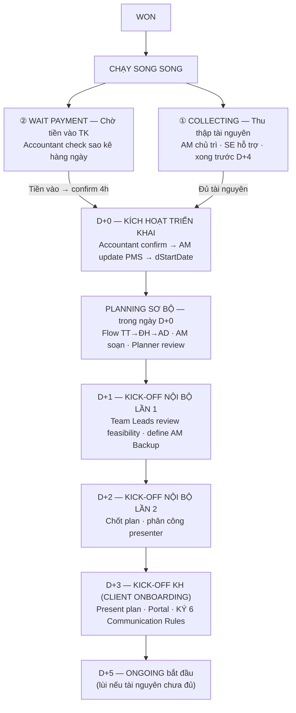

# GIAI ĐOẠN 3: TRIỂN KHAI — DEPLOY (D+0 → D+5)

**Mã tài liệu:** `04_Giai_doan_3_Trien_khai_Deploy.md`
**Phiên bản:** 1.0 — 12/09/2026
**Chủ thực thi:** BPVH (AM dẫn chính) · Accountant gác cổng tài chính
**Ghi chú nguồn:** Giai đoạn này **không có nội dung trong `01_Quy_trinh_MKT_Tong_the.md` V6.0** (file nguồn bị cắt cụt tại đúng header GIAI ĐOẠN 3 — gap AUD-02). Toàn bộ nội dung dưới đây tái dựng từ **Lifecycle v2.3**, đã bù được khoảng trống này nhưng cần chủ dự án xác nhận là quy định chính thức `[KXN-10]`.

---

## 1. Sơ đồ luồng giai đoạn

## 2. Hai luồng song song sau WON

### 2.1 COLLECTING — Thu thập tài nguyên (PMS: `COLLECTING`)

| 5W1H | Nội dung |
|------|----------|
| **What** | Thu thập toàn bộ tài sản số KH cần thiết để chạy dự án — checklist theo scope Proposal |
| **Who** | AM chủ trì · SE hỗ trợ liên hệ KH |
| **When** | Bắt đầu ngay sau WON · song song chờ tiền |
| **Where/Tools** | PMS checklist task · Zalo yêu cầu KH cấp quyền |
| **Why** | Cần đủ tài nguyên trước D+5 — tránh delay sau khi tiền vào |
| **How** | Checklist theo service package → gửi request quyền cho KH → track từng item trên PMS |

- **Input:** service package đã chọn (`servicePackage`). **Output:** quyền truy cập ad accounts đã request (Meta BM / Google Ads / TikTok Ads Manager — KH accept trong 1–3 ngày); checklist đủ/thiếu/đang chờ.
- **Done:** checklist đã tạo trên PMS; toàn bộ request đã gửi KH; item thiếu đã ghi nhận + deadline cho KH.
- **SLA:** ngay sau WON → **hoàn tất trước D+4** → D+5 lùi nếu tài nguyên chưa sẵn sàng.
- **Rủi ro & Escalation:**

| Rủi ro | Xử lý |
|--------|-------|
| KH chưa có fanpage/ad account | AM hỗ trợ tạo mới, hướng dẫn từng bước → D+5 lùi đến khi setup xong |
| KH chậm cấp quyền | Nhắc hàng ngày qua Zalo → quá 3 ngày AM call trực tiếp → quá 5 ngày AD contact KH |

- **PMS:** Task Module (auto-generate checklist theo service package) · CMS Module tương lai (track ad account/top-up) `[KXN-9]`.

### 2.2 WAIT PAYMENT — Chờ tiền vào TK (PMS: `WAIT_PAYMENT`)

| 5W1H | Nội dung |
|------|----------|
| **What** | Theo dõi chuyển khoản KH — **tiền vào TK là điều kiện duy nhất kích hoạt D+0** |
| **Who** | Accountant theo dõi hàng ngày · thông báo AM ngay khi confirm |
| **When** | Từ sau WON đến khi tiền vào |
| **Where/Tools** | Ngân hàng online (sao kê) · Zalo Accountant → AM · PMS payment record |
| **Why** | Không có D+0 thì không có timeline triển khai |
| **How** | Accountant check sao kê hàng ngày → tiền vào → confirm ngay cho AM → AM update PMS |

- **Input:** chờ chuyển khoản (sao kê ngân hàng). **Output:** Accountant confirm tiền vào → thông báo AM → kích hoạt D+0.
- **Done:** tiền đã vào TK công ty; Accountant đã confirm; AM đã nhận thông báo.
- **SLA:** sau WON → **Accountant confirm trong 4h làm việc sau khi tiền vào** → không gia hạn.
- **Rủi ro:** tiền vào nhưng thiếu (chưa đủ phase 1) → Accountant báo AM ngay → AM contact KH clarify → **chưa trigger D+0 cho đến khi đủ số**.
- **PMS:** Project Module (`paymentConfirmedAt`) · Notification (alert D+0; alert HĐ chưa có sau 3 ngày).

## 3. D+0 — Kích hoạt triển khai (PMS: `D0_TRIGGER`)

| 5W1H | Nội dung |
|------|----------|
| **What** | Điểm kích hoạt chính thức toàn bộ timeline triển khai |
| **Who** | Accountant xác nhận → thông báo AM ngay |
| **When** | Khi tiền phase đầu vào TK công ty |
| **Where/Tools** | PMS payment confirmation record · Zalo Accountant → AM |
| **Why** | Không có D+0 thì không có D+1/2/3/5 — đây là điều kiện duy nhất |
| **How** | **HĐ có thể ký sau** · tiền vào là điều kiện đủ · Accountant confirm → AM update PMS → timeline bắt đầu |

- **Input:** chuyển khoản từ KH; HĐ đã ký (khuyến nghị). **Output:** D+0 timestamp (`dStartDate`, `paymentConfirmedAt`) — toàn bộ D+1/2/3/5 tính từ ngày này; cảnh báo nếu HĐ chưa upload.
- **Done:** Accountant đã confirm tiền vào; D+0 timestamp đã set; AM đã nhận thông báo; **Planning Draft bắt đầu ngay**.
- **SLA:** khi tiền vào TK → **Accountant confirm trong 4h làm việc** → không gia hạn.
- **Rủi ro:** HĐ chưa ký sau 3 ngày từ D+0 → PMS tự cảnh báo AM + AD (`hasContractWarning`) → AM chủ động follow up KH ký HĐ.
- **PMS:** Project Module (`dStartDate`, `paymentConfirmedAt`, `hasContractWarning`) · Budget Module (confirm payment, set budget active).
- **⚠️ Khoản pháp lý `[KXN-5]`:** "HĐ có thể ký sau D+0" (v2.3) trong khi Done criteria của NEGOTIATION là "HĐ hoặc LOI đã ký 2 bên" — cần chốt LOI có đủ điều kiện kích hoạt D+0 không và rủi ro pháp lý khi triển khai trước khi ký.

## 4. PLANNING SƠ BỘ — ngày D+0 (PMS: `PLANNING_DRAFT`)

| 5W1H | Nội dung |
|------|----------|
| **What** | Soạn bản plan đầu tiên theo flow **TT→ĐH→AD** ngay từ D+0 |
| **Who** | AM soạn chính · Planner review strategy và media logic |
| **When** | D+0 — bắt đầu ngay trong ngày tiền vào TK |
| **Where/Tools** | GG Slides (media deck) · GG Sheets (media plan) · PMS link plan |
| **Why** | Có nội dung để kick-off nội bộ D+1 — draft plan là khung để team góp ý |
| **How** | **TT** = Tổng hợp brief + insight · **ĐH** = Chiến lược + thông điệp + audience · **AD** = Action plan kênh + lịch + budget |

- **Input:** Strategic Brief 16 sections; service package + objective + reporting frequency.
- **Output:** Planning Draft (GG Slides + Sheets, link PMS) — dùng cho Kick-off Internal D+1; task list auto-generate theo service package + objective.
- **Done:** TT tổng hợp xong; ĐH draft strategy + thông điệp; AD có kênh + lịch + budget sơ bộ; link đã upload PMS.
- **SLA:** D+0 → **hoàn thành trong ngày D+0 để kịp D+1** → không gia hạn.
- **Rủi ro:** thiếu thông tin để lên plan → AM request clarify KH ngay → lên plan với assumption rõ ràng, mark để confirm ở Kick-off KH.
- **PMS:** Task Module (auto-generate từ template) · Media Plan Module.

## 5. Kick-off Nội bộ lần 1 — D+1 (PMS: `KICKOFF_INTERNAL_1`)

| 5W1H | Nội dung |
|------|----------|
| **What** | Toàn bộ team vận hành họp review Planning Draft — phát hiện vấn đề trước khi ra KH |
| **Who** | AM chủ trì · Planner · Lead Content · Lead Design · Lead Media · Lead Video |
| **When** | D+1 |
| **Where/Tools** | Zoom/Meet nội bộ · GG Slides review live · PMS ghi feedback |
| **Why** | Team review draft trước khi chốt — mọi bộ phận hiểu plan của mình |
| **How** | Review từng hạng mục · từng Lead nêu feasibility · AM ghi nhận điểm cần sửa |

- **Input:** Planning Draft từ D+0. **Output:** danh sách feedback + điểm cần sửa; phân công chỉnh sửa (deadline trước D+2); **tại đây cũng define AM Backup** (`backup_am_id`).
- **Done:** toàn team đã tham dự hoặc gửi feedback trước; danh sách điểm cần sửa đã tổng hợp; phân công rõ ai sửa gì, deadline khi nào.
- **SLA:** D+1 → **1–2 tiếng** → **không thể lùi** — vắng phải gửi feedback trước qua chat.
- **Rủi ro & Escalation:** Lead thấy plan không khả thi → thảo luận tại chỗ điều chỉnh scope; thay đổi lớn → AM + Planner họp thêm sau buổi. Team không đủ resource → AM escalate AD ngay → quyết định: thuê thêm / thu hẹp scope / lùi timeline.
- **PMS:** Project Module (stage) · Event Module (attendance).

## 6. Kick-off Nội bộ lần 2 — D+2 (PMS: `KICKOFF_INTERNAL_2`)

| 5W1H | Nội dung |
|------|----------|
| **What** | Review plan đã chỉnh sửa sau D+1 · chốt lần cuối trước khi trình KH |
| **Who** | AM chủ trì · Planner · toàn bộ team BPVH |
| **When** | D+2 |
| **Where/Tools** | Zoom/Meet nội bộ · GG Slides plan final · PMS stage update |
| **Why** | Plan hoàn chỉnh · team confident · sẵn sàng trình KH |
| **How** | Review các điểm đã sửa từ D+1 → chốt plan → phân công presenter → chuẩn bị deck KH |

- **Input:** plan đã chỉnh theo feedback D+1. **Output:** plan chốt nội bộ (slides + media plan final); phân công presenter (AM dẫn chính, Lead bộ phận explain phần của mình).
- **Done:** plan đã sửa đầy đủ theo feedback D+1; team đồng thuận; deck KH sẵn sàng; presenter rõ.
- **SLA:** D+2 → **1–2 tiếng** → không thể lùi.
- **Rủi ro:** phát hiện vấn đề mới → nhỏ: sửa ngay trong buổi; lớn: AM + Planner ở lại giải quyết sau buổi.
- **PMS:** Project Module · File Module (plan final + deck KH).

## 7. Kick-off KH / Client Onboarding — D+3 (PMS: `KICKOFF_CLIENT`)

| 5W1H | Nội dung |
|------|----------|
| **What** | Họp chính thức đầu tiên với KH · present plan · giới thiệu portal · **ký 6 Communication Rules** |
| **Who** | AM chủ trì · toàn bộ team BPVH · KH + đầu mối liên lạc phía KH |
| **When** | D+3 sau D+0 |
| **Where/Tools** | Zoom/Meet là chính · PMS Portal giới thiệu · GG Slides deck · Zalo confirm |
| **Why** | Align kỳ vọng ngay từ đầu · set rules rõ tránh tranh chấp · KH biết portal để theo dõi |
| **How** | Present plan D+2 → giới thiệu portal → cấp quyền → **KÝ xác nhận 6 Rules** → confirm KPI + reporting frequency |

- **Input:** plan hoàn chỉnh từ D+2; D+0 đã kích hoạt + checklist tài nguyên đủ.
- **Output:** biên bản kick-off + 6 Communication Rules đã ký (PDF, upload PMS + email KH); Client Portal account đã tạo và KH đã login; request quyền ad accounts đã gửi.
- **Done (Hard Gate):** 6 Rules đã được KH ký xác nhận `[KXN-11]`; KH đã đăng nhập portal ≥1 lần; request quyền đã gửi đủ; KPI + reporting frequency confirm 2 chiều; biên bản upload PMS.
- **SLA:** D+3 → **1–2 tiếng** → không gia hạn; D+5 lùi theo nếu trễ.
- **Rủi ro & Escalation:**

| Rủi ro | Xử lý |
|--------|-------|
| KH không book được lịch D+3 | AM đề xuất 3 slot → vẫn không được → AD contact → D+5 tự động lùi |
| KH từ chối ký 6 Rules | AM giải thích từng rule → còn không → AD negotiate → ghi exception trên PMS |
| Tài nguyên chưa sẵn sàng | Ghi nhận checklist + set deadline KH cung cấp → D+5 lùi đến khi đủ |

- **PMS:** Project Module (`communicationRules`) · Client Portal (tạo account KH) · Event Module (recurring event weekly/monthly review) · Notification (nhắc KH login nếu 24h chưa vào).
- **⚠️ Gap lớn `[KXN-11]`:** v2.3 yêu cầu ký 6 Communication Rules nhưng **chỉ định nghĩa Rule 4** (Im lặng = Đồng ý, 24h — xem 05 §5.7) **và Rule 6** (gửi báo cáo cả 3 kênh Zalo + Email + Portal). **4 rule còn lại không được định nghĩa ở bất kỳ nguồn nào** — phải hỏi khách hàng trước khi xây form ký trên PMS.

## 8. Điểm gác và phê duyệt trong giai đoạn

| Mốc | Người gác | Điều kiện |
|-----|-----------|-----------|
| D+0 | **Accountant (`FIN_L1`)** | Tiền vào TK — điều kiện duy nhất; thiếu tiền không có D+0 |
| Trước D+4 | AM | Checklist tài nguyên hoàn tất |
| D+1, D+2 | AM | Kick-off nội bộ không lùi — vắng phải gửi feedback trước |
| D+3 | AM → AD | KH ký 6 Rules; từ chối → AD negotiate |
| D+5 | AM + Media | Đủ tài nguyên (pixel, quyền ad account) mới vào ONGOING |

## 9. SLA tổng hợp giai đoạn

| Việc | SLA | Gia hạn |
|------|-----|---------|
| Accountant confirm tiền | 4h làm việc sau khi tiền vào | Không |
| Planning Draft | Trong ngày D+0 | Không |
| Kick-off nội bộ ×2 | D+1, D+2 · 1–2h/buổi | Không thể lùi |
| Kick-off KH | D+3 · 1–2h | Không — D+5 lùi theo nếu trễ |
| Thu thập tài nguyên | Trước D+4 | D+5 lùi nếu thiếu |
| Follow up HĐ sau D+0 | Cảnh báo PMS sau 3 ngày chưa có | AM chủ động follow up |
