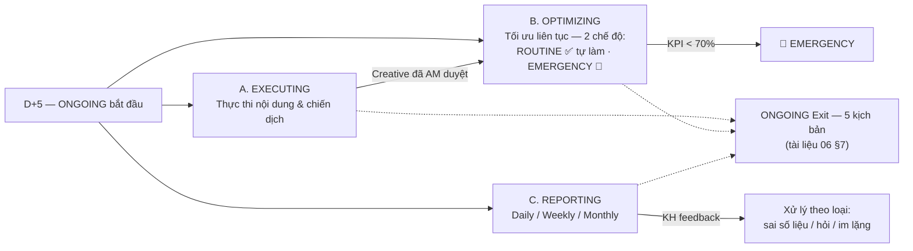
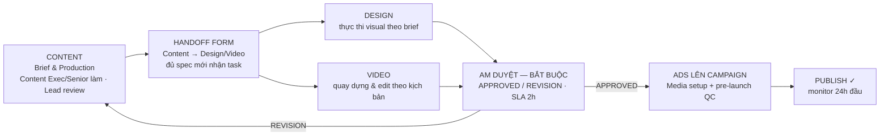
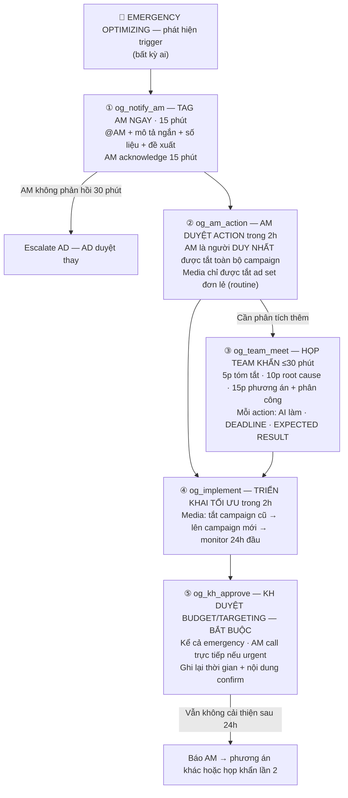

# GIAI ĐOẠN 4: VẬN HÀNH ONGOING (từ D+5)

**Mã tài liệu:** `05_Giai_doan_4_Van_hanh_ONGOING.md`
**Phiên bản:** 1.0 — 12/09/2026
**Chủ thực thi:** Toàn bộ BPVH — Media, Content, Design, Video, AM, Planner
**Nguồn:** Lifecycle v2.3 — modal ONGOING: **3 nhánh chạy song song liên tục từ D+5** (39 sub-protocol)

---

## 1. Sơ đồ 3 nhánh

## 2. Nhánh A — EXECUTING: Thực thi nội dung & chiến dịch

### 2.1 Luồng sản xuất chính

#### 2.1.1 Content Brief & Production (`og_content`)

- **Phụ trách:** Content Executive/Senior làm · Content Lead review · **AM duyệt final**.
- **Nội dung:** lên ý tưởng, viết caption, kịch bản, brief cho Design/Video — "Content là ngọn hải đăng" định hướng toàn bộ creative.
- **Cadence:** theo content calendar · buffer 20% slot cho trending.
- **Input:** media plan + content calendar; brand guidelines + brief KH (tone, color, messaging).
- **Output:** caption/copy đã QC; brief cho Design/Video (đủ: kích thước, CTA, deadline, reference).
- **Done checklist:** TEXT — tone ✓ · độ dài platform ✓ · CTA ✓ · chính tả ✓ · không vi phạm policy ✓. ẢNH/VIDEO — kích thước ✓ · text ≤20% ✓ · resolution ✓ · format đúng ✓. Brief đủ thông tin + deadline rõ.
- **SLA:** tự QC + Lead review **trong 4h** · AM review **trong 2h** · tối đa **3 vòng nội bộ** — vòng 4 escalate AM.
- **Rủi ro:** content không qua QC sau 3 vòng → AM quyết định chấp nhận version hiện tại hoặc delay lịch đăng. Trend đột xuất → Content đề xuất AM trong 2h → AM approve thì dùng buffer slot, push bài planned sang tuần sau.
- **PMS:** Content Post Module — status flow `IDEA→DRAFT→REVIEW→APPROVED→SCHEDULED→PUBLISHED` · Task Module.

#### 2.1.2 Cross-team Handoff Form (`og_handoff_form`)

- **Phụ trách:** Content tạo task + điền form · Design/Video Lead phân công · AM kiểm soát deadline.
- **Nguyên tắc:** **chỉ handoff sau khi AM đã approve — không handoff draft.** Hỏi đáp qua PMS comment, không Zalo riêng.
- **Form Design cần đủ:** project · hạng mục · platform · nội dung chính · key message · CTA · kích thước · số variants · deadline.
- **Form Video cần đủ:** loại video · platform · kịch bản đính kèm · footage có sẵn · style · nhạc · subtitle · format output · deadline.
- **SLA:** Lead phân công ngay trong ngày · **T-2 ngày** PMS auto-reminder · **T-1** AM nhắn Zalo · đúng deadline chưa có → escalate **AD trong 2h**.
- **Rủi ro:** brief thiếu → Content bổ sung trong 1h (lâu hơn → delay deadline tương ứng); trễ deadline → task "Late Delivery" + phương án dự phòng (delay lịch đăng / dùng content khác).
- **PMS:** Task Module (`isPartnerTask` flag) · Content Post Module · Notification · File Module.

#### 2.1.3 Design Execution (`og_design`)

- **Phụ trách:** Design Executive/Senior làm · Design Lead review · AM duyệt final. **Design không tự quyết concept.**
- **Done checklist:** kích thước đúng từng platform · text ≤20% diện tích (Facebook rule) · resolution ≥72dpi, file size hợp lý · brand color + logo đúng vị trí · safe zone không bị crop mobile.
- **SLA:** theo deadline trong brief (AM set) · trễ phải báo AM ngay, không tự ý lùi deadline.
- **Rủi ro:** brief không đủ → hỏi Content ngay qua PMS/Zalo, không tự diễn giải; trễ ảnh hưởng lịch đăng → báo AM → AM quyết định ưu tiên lại hoặc delay post.
- **PMS:** Task Module · File Module (lưu version).

#### 2.1.4 Video Production (`og_video`)

- **Phụ trách:** Video Executive/Senior làm · Video Lead review · AM duyệt final.
- **Quy trình:** nhận kịch bản → lên shot list → quay/edit → self-check → upload PMS → AM duyệt.
- **Done checklist:** tỉ lệ đúng (9:16 TikTok/Reels · 1:1 Feed · 16:9 YouTube) · **hook 3 giây đầu đủ mạnh, không bắt đầu bằng logo** · subtitle đã thêm (80% xem không bật âm) · âm thanh rõ, không ồn nền · CTA trong 5 giây cuối · không nhạc bản quyền.
- **Rủi ro:** footage không dùng được → báo AM ngay, quay bổ sung hoặc chuyển motion graphic; nhạc bị copyright → dùng thư viện miễn phí, mua license trước nếu dùng nhạc thương mại.
- **PMS:** Task Module · File Module.

#### 2.1.5 AM Duyệt Content/Creative (`og_am_review`) — ĐIỂM CHẮN BẮT BUỘC

- **Phụ trách:** **Account Manager — BẮT BUỘC, không có ngoại lệ, kể cả khẩn cấp.**
- **Chuỗi dự phòng:** AM vắng → Planner thay → cả 2 vắng → Content Lead tự duyệt + ghi log PMS.
- **Kết quả:** APPROVED (→ Ads setup) hoặc REVISION (gửi lại bộ phận kèm note **rõ ràng, không chung chung**).
- **SLA:** **2h** · video dài **4h** · trend đăng gấp: SLA 1h — quá 1h không reply → Content Lead duyệt + AM review sau.
- **PMS:** Approval Module · Content Post Module (`REVIEW → APPROVED/REVISION_REQUESTED`).

#### 2.1.6 Ads lên Campaign (`og_ads`)

- **Phụ trách:** Media Executive/Senior setup · Media Lead review · AM nhận notify.
- **Vị trí:** "point of no return" — campaign active là tốn tiền, phải chuẩn.
- **Pre-launch QC checklist (Done):** pixel/tracking active fire đúng · audience targeting đúng spec · **daily cap = monthly/30 × 1.1** · UTM parameters đã gắn · creative đúng format từng placement · lead form/landing page test thành công.
- **SLA:** sau khi AM approve → **launch trong ngày** theo lịch media plan · trễ báo AM kèm lý do.
- **Rủi ro:** ad bị reject → fix + resubmit trong 2h → vẫn bị → báo AM, xem xét thay creative; budget hết sớm → báo AM khi còn 20% → AM quyết định xin tăng budget hoặc giảm tốc độ.
- **PMS:** Ads Report Module (pull data ngay khi active) · KPI Module.

### 2.2 Các protocol kèm nhánh A

#### 2.2.1 Content Calendar Management (`og_content_calendar`)
- **Own:** Content lập lịch · Lead Content + AM review · **AM approve cuối**.
- **Cadence:** lịch tháng = 1 tuần trước khi bắt đầu tháng (Content lập 2 ngày, AM approve 1 ngày); lịch tuần = thứ 6 tuần trước.
- **Quy tắc:** **buffer 20% slot reserved cho trending** (mark "BUFFER"); trend phải đăng trong 24h kể từ khi nổi; KH thêm bài đột xuất → AM đánh giá resource → dùng buffer hoặc lùi tuần sau.
- **PMS:** Content Post Module · Task Module (auto-create theo lịch).

#### 2.2.2 Campaign Lifecycle — Vòng đời chiến dịch (`og_campaign_lifecycle`)
- **Triết lý:** KH không chịu đốt tiền 7 ngày chờ learning phase — **signal-based decision theo mốc thực tế**:
  - **24h:** chỉ fix lỗi kỹ thuật, không optimize vội.
  - **48h:** first optimization — tắt creative CTR <0.5% sau 500 impressions; tắt ad set không có click sau 1000 impressions.
  - **72h–5 ngày:** main optimization window — scale nếu CPL ≤ target.
  - **Ngày 14:** mid-month check — budget pacing + KPI projection.
  - **Ngày 25–28:** end-month prep — scale nếu KPI đạt, chuẩn bị creative tháng tới.
- **Guard:** minimum sample **500 impressions hoặc 10 conversions** trước khi tắt; không tắt trong 24h đầu trừ lỗi kỹ thuật nghiêm trọng. KPI dưới target sau 5 ngày → Media báo AM ngay, không chờ 7 ngày.
- **PMS:** Ads Report Module (log action) · KPI Module · Task Module (auto-create ngày 14, ngày 25).

#### 2.2.3 Lead Quality Tracking (`og_lead_quality`)
- **Phân công:** Agency track lead thô từ platform (**số Agency kiểm soát và chịu trách nhiệm**) · **KH tự nhập conversion data** vào GG Sheet shared · AM tổng hợp weekly mỗi thứ 2.
- **Công cụ:** GG Sheet shared · Zapier/n8n (tự động) · Pancake/Getfly nếu KH có CRM · PMS.
- **Funnel:** Lead thô → Hợp lệ → Đã liên hệ → Qualified → Chốt.
- **Trigger action theo case:** lead ảo → thu hẹp audience, loại placement kém, báo Facebook Lead Quality Feedback — xử lý trong **48h** sau khi KH báo; lead sai nhu cầu (creative gây hiểu lầm) → review copy + creative, AM họp Content sửa angle; lead nhiều KH chốt ít (không phải lỗi Agency) → AM tư vấn sales script/tốc độ gọi lại — cơ hội upsell CRM/training; **CPL > 2× target → trigger Emergency Optimizing**.

#### 2.2.4 Account Health Monitoring (`og_account_health`)
- **Phụ trách:** Media Buyer — daily check **mỗi sáng trước 9h, 5–10 phút**, bắt buộc như check email buổi sáng.
- **Checklist 5 điểm:** (1) Ads Manager account status (active? restrict? payment error?) · (2) pixel/tracking health (last fired <24h? event count bình thường?) · (3) landing page + form (load? submit test OK? pixel fire?) · (4) Business Manager (violation warning? admin access đủ?) · (5) payment method (credit đủ? thẻ còn hạn?).
- **Quy tắc:** mọi ngày phải có 1 entry log — HEALTHY hoặc ISSUE_FOUND; task không complete trước 10h → alert Lead Media; phát hiện issue → tag AM ngay (trong 5 phút), **SLA xử lý 2h**.
- **Roadmap:** Phase 2 — auto-alert Meta Events Manager khi fire rate drop >20% so với 7-day average `[KXN-9]`.

#### 2.2.5 Task Đối tác KOL/PR/Event (`og_partner`)
- **Nguyên tắc:** đối tác **không có tài khoản PMS — AM là đầu mối duy nhất**; team không contact đối tác trực tiếp.
- **Flow:** AM tạo task (`isPartnerTask=true`) → brief qua Zalo (deadline rõ, deliverable cụ thể) → đối tác thực hiện → gửi evidence (ảnh/video/screenshot) → AM verify → tick DONE (`isEvidence=true`) → ghi nhận performance đối tác (đúng hạn/chất lượng) vào hồ sơ.
- **SLA:** **T-2** PMS reminder cho AM · **T-1** AM nhắn Zalo đối tác · trễ → **AM báo AD trong 2h** + chuẩn bị phương án dự phòng (delay / thay đối tác).

#### 2.2.6 AM Backup Protocol (`og_am_backup`)
- **Define:** tại Kick-off Internal D+1 (`backup_am_id`) — **bắt buộc**. Chuỗi: **Planner → Lead Content → Account Director** (emergency cuối).
- **Activate:** khi AM vắng ≥1 ngày. AM thông báo 24h trước (trừ emergency) → handover note Zalo + PMS (**viết trước 8pm hôm trước, tối đa 10 bullet: status, pending decisions, ai đang chờ gì, deadline nào quan trọng nhất**) → backup notify team (email KH nếu vắng >3 ngày) → mọi quyết định quan trọng trong thời gian backup log vào PMS → AM review khi quay lại.
- **Guard:** PMS alert AD nếu **AM không active >4h giờ làm việc**.
- **PMS:** Project Module (`backup_am_id`, `backup_planner_id`, `handover_notes`) · Notification.

#### 2.2.7 Creative Performance Library (`og_creative_library`)
- **Mục đích:** thư viện insight từ mọi A/B test — queryable theo ngành/format/platform, không test lại những gì đã biết.
- **Quy tắc:** chỉ đưa vào khi có winner rõ ràng (không nhận inconclusive); format entry: Ngành · Platform · Variable tested · Winner · Delta % · Applicable to · Tags (max 5 tags); Media/Content điền **trong 24h** sau khi declare winner → AM validate + approve **trong 24h tiếp**; AM không approve close A/B test nếu chưa có insight entry.
- **Mở rộng tương lai:** AI auto-suggest relevant insights khi tạo proposal mới (library >50 entries thì xem xét) `[KXN-9]`.
- **PMS:** Insights Library Module (CRUD, tagging, search, cross-project query).

#### 2.2.8 Competitive Intelligence (`og_competitive`)
- **Phụ trách:** Media Buyer check **hàng tuần (thứ 5, 15 phút — không quá 30)** · AM validate · đưa vào weekly/monthly report.
- **Nguồn:** Facebook Ad Library (free) · Zalo/TikTok Search — không cần tool phức tạp. Danh sách **3–5 đối thủ chính** set từ Second Meeting + Kick-off KH (giới hạn 3 ưu tiên, review mỗi quý).
- **Output:** section **"Competitor Pulse"** — weekly 3–5 dòng, monthly 1 slide. Format: *Competitor A đang push [format] với message [Y] → Implication cho chúng ta: [Z]*. Ghi rõ cả khi "không có gì mới" / "competitor không active trên paid" — cũng là thông tin có giá trị.
- **PMS:** Strategic Brief Module (competitor list) · Report Module (template section).

#### 2.2.9 Capacity Management (`og_capacity`)
- **Phụ trách:** AD track overall · AM track team · Lead bộ phận track nhân viên · **CEO/COO quyết định ngừng nhận KH mới**.
- **Cơ chế:** mọi task có time estimate (default theo task type: viết caption 2h, design banner 3h…) → PMS aggregate theo người → dashboard traffic light: **<80% xanh (an toàn nhận thêm) · 80–100% vàng (AM cân nhắc, AD approve) · >100% đỏ (NGỪNG nhận project mới)**.
- **Quy ước:** capacity mặc định 40h/tuần; **trừ 20% productive time cho meetings/admin** (40h → effective 32h); inline warning khi assign cho người overload (không block, chỉ warn); sau 1 tháng calibrate actual vs estimate.
- **PMS:** Capacity Module (`tms` — tương lai `[KXN-9]`) · Dashboard (CEO/COO view) · Task Module (inline warning).

## 3. Nhánh B — OPTIMIZING: 2 chế độ

### 3.1 ✅ ROUTINE — Tự làm, không cần báo AM

| Protocol | Nội dung cốt lõi | Phụ trách · SLA |
|----------|------------------|-----------------|
| **Routine Optimization** (`og_routine`) | Tác vụ nhỏ trong ngưỡng cho phép: tắt ad set kém, điều chỉnh bid, duplicate winner… **Không cần duyệt AM — ghi log PMS** (action gì · tại sao · kỳ vọng); AM xem trong daily summary | Media/Content/Design tự quyết · thực hiện ngay trong ngày |
| **Signal-based Decision Rules** (`og_threshold`) | Bộ ngưỡng set lúc Kick-off nội bộ D+1/D+2 **theo từng platform** (`routineThresholds`): 24h chỉ fix kỹ thuật · 48h tắt creative CTR<0.5%/500 impressions · 72h–5 ngày main window, scale nếu CPL ≤ target | Media áp dụng · AM acknowledge |
| **A/B Testing Framework** (`og_ab_test`) | **1 variable duy nhất** · AM approve trước khi chạy · budget test tối thiểu **2–3× CPL target/ngày/ad set** · chạy **2–7 ngày** · declare winner cần **chênh ≥20% + ≥50 clicks hoặc ≥10 conversions** · **AM declare winner** · winner scale, loser tắt · insight vào Library | Media thực hiện · AM approve/declare |
| **Budget Pacing** (`og_budget_pacing`) | **Daily cap = monthly/30 × 1.1** · check % đã dùng hàng ngày · weekly pacing report cho AM · **KHÔNG tự tăng budget khi chưa có KH đồng ý** · báo AM khi còn **20% budget (~ngày 20–22)** · cuối tháng còn dư: KPI đạt → đề xuất scale; KPI chưa đạt → scale winning creative; KH không cho → roll over hoặc hoàn, **phải hỏi KH trước** | Media track hàng ngày · AM quyết định · KH approve thay đổi |

- **Rủi ro chung routine:** thực hiện action vượt ngưỡng không báo AM → AM phát hiện nhắc nhở, ghi nhận; tái diễn → escalate AD. Test nhiều variables → AM không approve. Không đủ statistical significance → chờ thêm (tối đa 7 ngày) → extend hoặc accept inconclusive.

### 3.2 🚨 EMERGENCY — Kích hoạt khi: KPI <70% target · KH báo khẩn · lỗi nghiêm trọng (ad account die, pixel hỏng…)

> Mã protocol của nhánh Emergency: `og_emergency` (khung tổng — trigger & SLA), `og_notify_am`, `og_am_action`, `og_team_meet`, `og_implement`, `og_kh_approve` (5 bước trên).

- **Nguyên tắc vàng:** ngân sách là tiền của KH — Agency không có quyền thay đổi budget/targeting khi chưa được approve; KH từ chối đổi trong khi performance kém → AM đề xuất phương án thay thế không cần đổi budget, ghi nhận "Agency đã đề xuất nhưng bị từ chối".
- **KH yêu cầu giải thích ngay:** AM acknowledge ngay qua Zalo "Chúng tôi đã phát hiện và đang xử lý" — không đợi có giải pháp hoàn chỉnh mới báo.
- **PMS:** Task Module (`isEmergency=true`, `emergencyReason`, tag toàn team) · Notification (URGENT cho AM + AD) · Audit Log (mọi thay đổi budget có KH approval).

## 4. Nhánh C — REPORTING: Daily / Weekly / Monthly

### 4.1 Chu kỳ báo cáo

| Loại | Pull data | Format | AM QC | Gửi KH |
|------|-----------|--------|-------|--------|
| **Daily** | Sáng sớm **trước 8h** | Ngắn gọn (GG Sheets + Zalo tóm tắt) | **1h** | Sáng sớm theo Communication Rules |
| **Weekly** | **Thứ 2 sáng** | Có trend (GG Sheets) | **2h** | Thứ 2 |
| **Monthly** | **Ngày 1–3 tháng sau** | Phân tích sâu + plan tháng tới (GG Slides, 9 sections) | **4h** | Ngày 1–5 (theo Monthly Closing §4.2) |

**Flow:** Pull Data → Tổng hợp → Insight → AM QC → Gửi KH cả 3 kênh → Xử lý feedback.

- **Pull Data (`og_pull_data`):** Media pull ads data, Content pull content performance; tương lai AI Agent tự động `[KXN-9]`. Nguồn: Ads Manager export CSV, Shopee/TikTok Shop, GA4, Manus AI, Zapier/n8n. **Date range chuẩn: Daily = hôm qua · Weekly = T2→CN · Monthly = ngày 1→cuối tháng.** Pull trước deadline gửi ≥4h. **Ưu tiên nguồn khi lệch số: thực tế KH > platform export > GA4/Pixel > tool trung gian** — ghi chú rõ "Số liệu theo X vì Y" (attribution window khác nhau là lý do phổ biến nhất: Facebook 7-day click vs Google 30-day).
- **Tổng hợp (`og_compile`):** Media + Content compile theo template chuẩn — **xong trong 2h**; double-check số liệu; lead funnel cập nhật nếu LEAD_GEN và KH share data (chưa có → ghi "chờ KH cập nhật" + nhắc KH).
- **Insight Template (`og_insight`):** AM viết theo framework **WHY (tại sao) → WHAT WORKED (top 3) → WHAT DIDN'T (top 3) → NEXT ACTIONS**. Weekly: 1–2 dòng Why + top 3/3 + next (AM viết 1h). Monthly: executive summary + KPI scorecard + root cause + lesson learned + plan tháng tới (AM viết 2h, **Planner duyệt depth**). **Planner có quyền reject insight chung chung** ("Kết quả tốt vì creative hiệu quả") — phải chỉ rõ creative nào, hiệu quả hơn bao nhiêu %, vì sao. Không gửi báo cáo thiếu insight — delay 1–2h còn hơn gửi báo cáo kém.
- **AM QC (`og_am_qc`) — BẮT BUỘC trước khi gửi:** kiểm tra số liệu (đúng platform, date range, không sai sót) → kiểm tra insight theo framework → kiểm tra format chuyên nghiệp → APPROVED. Phát hiện sai sau khi gửi: báo KH ngay "đang sửa lại", sửa gửi lại trong **4h**, xin lỗi ngắn gọn.
- **Gửi báo cáo (`og_send_report`) — cả 3 kênh (Rule 6):** Zalo (PDF/ảnh tóm tắt key numbers) + Email (đầy đủ PDF) + Portal (lưu trữ) cùng lúc → log timestamp PMS → chờ feedback 24–48h. Trễ lịch cam kết → AM báo KH trước (proactive).

### 4.2 Xử lý feedback KH — 4 nhánh

| Nhánh | Protocol | SLA | Quy tắc |
|-------|----------|-----|---------|
| Sai số liệu | `og_fb_data` | Acknowledge **30 phút** · sửa gửi lại **4h** | Verify từ source → sửa → giải thích ngắn gọn → log root cause (pull sai date range / attribution / tool lỗi). Không tìm ra lý do → ghi cả 2 số, giải thích attribution window, thống nhất nguồn chuẩn |
| Hỏi giải thích | `og_fb_explain` | Trả lời **2h** | Zalo/call, **không họp thêm ngoài lịch**; không jargon kỹ thuật; phức tạp → acknowledge + schedule 30p call trong ngày; log Q&A vào PMS |
| KPI <70% | → Emergency | Xem §3.2 | Chuyển sang Emergency Optimizing |
| **Im lặng** | `og_silence` — **Rule 4: Im lặng = Đồng ý** | **20h**: hệ thống tự nhắc KH · **24h**: log "Im lặng = Đồng ý" → AM tiếp tục triển khai | Đã được KH ký xác nhận tại D+3; log timestamp PMS/Audit Log làm bằng chứng. **KHÔNG áp dụng cho thay đổi budget/targeting — luôn cần approve rõ ràng** |

### 4.3 Monthly Closing — Quy trình đóng tháng (`og_monthly_closing`)

| Ngày | Việc | Trách nhiệm |
|------|------|-------------|
| **25–26** | Export + tổng hợp full month data (Ads Manager, GA4, Shopee/TikTok Shop); deadline nội bộ data xong trước ngày 26 — ngày 27 chưa có → escalate ngay | Media + Content |
| **27–28** | Internal review AM + Planner (30–45p) — duyệt format + insight | AM chủ trì · Planner duyệt |
| **29–30** | Finalize + gửi KH qua 3 kênh; budget reconciliation plan vs actual | AM |
| **1–5 tháng sau** | Monthly meeting với KH — brief tháng tới (strategy, budget, KPI target, creative direction) KH confirm | AM |

Output: Monthly Report **9 sections** (PDF + Slides, upload PMS) + brief tháng tới confirmed `[KXN-7]` (nội dung 9 sections chưa định nghĩa — xem tài liệu 10).

### 4.4 QBR — Quarterly Business Review (`og_qbr`) — dự án ≥3 tháng

- **Ai:** AM chủ trì · Planner phân tích · SE observe · KH + decision maker.
- **Khi:** tháng thứ 3 của ONGOING và mỗi 3 tháng sau (PMS alert "Đến lúc làm QBR") · prep 5 ngày · internal review 45–60p · present trong tháng thứ 3 — **không gia hạn, QBR trễ mất tính chiến lược**.
- **QBR Deck 7 sections:** (1) Executive summary · (2) KPI scorecard 90 ngày · (3) What worked vs not · (4) Market context · (5) Strategy adjustment · (6) Budget review · (7) Plan quý tới. Executive Summary fit 1 slide — chỉ highlight 3 điều tốt nhất + 3 cần cải thiện.
- **Giá trị:** catch pattern 90 ngày mà monthly bỏ qua; tăng tỉ lệ renew dài hạn (industry average **+35%**); thời điểm vàng upsell vì có full data.
- **Hệ quả:** KH confirm strategy quý tới → plan; scope đổi lớn → **trigger Renew Luồng B**; KH không hài lòng sau 3 tháng → LOST analysis với full data.

### 4.5 Client Health Score (`og_client_health`)

- **Cơ chế:** PMS **tự tính hàng tuần**, score 0–100 = **KPI achievement 40% + Payment timeliness 20% + Portal engagement 20% + Communication responsiveness 20%**.
- **Vạch màu:** ≥80 xanh (healthy — focus upsell) · 60–79 vàng (AM chủ động gặp KH tìm vấn đề tiềm ẩn) · **<60 đỏ → AD vào cuộc ngay**. **Drop >15 điểm trong 1 tuần → xử lý ngay.**
- **AM check mỗi thứ 2 sáng** khi pull weekly report; alert gửi trong 24h khi chạm ngưỡng.
- **Hiệu chỉnh:** KH không dùng portal (đã confirm) → giảm Portal weight còn 10%, tăng Communication lên 30%; score cao nhưng vẫn churn → thêm metric frequency KH chủ động contact + thời gian spend trên portal.
- **PMS:** Analytics Module · Notification (AM + AD) · Dashboard (CEO/COO view tất cả KH active).

## 5. Bảng phân công nhanh theo vai (ONGOING)

| Vai | Đầu việc chính trong ONGOING |
|-----|------------------------------|
| **Media Buyer/Exec/Lead** | Daily Health Check trước 9h · setup campaign sau AM approve · Routine optimization (tắt ad set, bid, duplicate) · A/B test · Budget pacing · pull data ads · Competitive Intelligence weekly · Campaign Lifecycle theo mốc · Emergency chỉ tắt ad set đơn lẻ |
| **Content Exec/Lead** | Content brief + caption theo calendar (buffer 20%) · self-QC checklist · handoff Design/Video · pull content performance · đóng góp Creative Library |
| **Design Exec/Lead** | Thực thi visual theo brief, không tự quyết concept · QC checklist (≤20% text, safe zone…) |
| **Video Exec/Lead** | Quay dựng theo kịch bản · QC checklist (hook 3s, subtitle, 9:16…) |
| **AM** | **Duyệt mọi content (2h)** · **QC mọi báo cáo trước gửi** · gửi báo cáo 3 kênh · xử lý mọi feedback KH · duyệt emergency action (2h) · đầu mối đối tác duy nhất · review Health Score · Monthly Closing · QBR |
| **Planner** | Backup AM #1 · duyệt depth insight Monthly · duyệt format QBR/Monthly · phân tích QBR · support phân tích emergency |
| **AD** | Escalation cuối · duyệt hành động khi AM không phản hồi · alert Health Score <60 · capacity >100% · đối tác trễ |
| **Accountant** | (chủ yếu giai đoạn khác — theo dõi payment, pro-rata khi early termination) |
