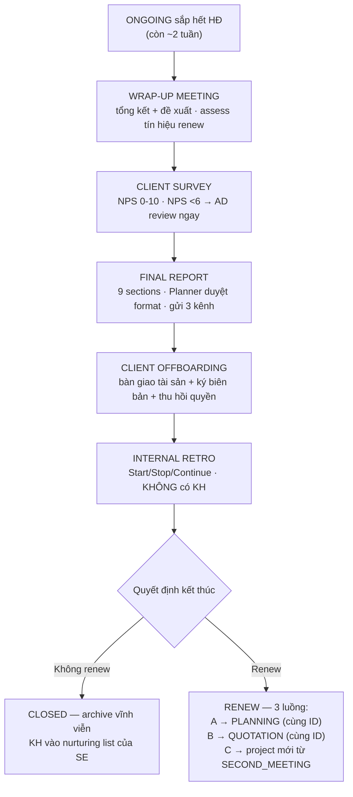

# GIAI ĐOẠN 5: KẾT THÚC — CLOSED / RENEW (+ PAUSED, LOST, EXIT)

**Mã tài liệu:** `06_Giai_doan_5_Ket_thuc_Closed_Renew.md`
**Phiên bản:** 1.0 — 12/09/2026
**Chủ thực thi:** AM dẫn chính · SE nhận lại nurturing · AD escalation · Accountant pro-rata
**Trình tự chuẩn:** WRAPUP → SURVEY → FINAL_REPORT → OFFBOARDING → INTERNAL_RETRO → CLOSED ∥ RENEW (3 luồng)

---

## 1. Sơ đồ giai đoạn

## 2. Các bước chi tiết

### 2.1 WRAP-UP MEETING (PMS: `WRAPUP`)

| 5W1H | Nội dung |
|------|----------|
| **What** | Họp tổng kết cuối dự án với KH · review kết quả · đề xuất tháng tới |
| **Who** | AM chủ trì · Planner tham dự · SE observe |
| **When** | Còn khoảng **14 ngày** trước khi HĐ hết (PMS alert AM) |
| **Where/Tools** | Zoom/Meet · GG Slides summary deck · PMS ghi feedback |
| **Why** | Tăng tỉ lệ renew · nhận feedback thật · chuẩn bị Final Report |
| **How** | Prepare summary deck (AM + Media chuẩn bị data trước) → họp → ghi feedback → explore cơ hội renew/upsell |

- **Input:** toàn bộ performance data (Ads Report, Content performance, KPI actual). **Output:** deck đã present (KH giữ + PMS lưu); feedback KH + tín hiệu renew assessed.
- **Done:** buổi họp đã diễn ra; feedback ghi vào PMS; tín hiệu renew đã assessed.
- **SLA:** còn 14 ngày trước hết HĐ → **book lịch trong 3 ngày · họp 1–1.5 tiếng** → KH không book → AD contact.
- **Rủi ro:** KH không muốn renew → AM ghi lý do → vào LOST nhóm A + nurturing plan → SM contact sau 1 tháng.
- **PMS:** Event Module · Project Module (wrap-up notes + renew signal) · Notification (alert còn 14 ngày).

### 2.2 CLIENT SURVEY (PMS: `SURVEY`)

| 5W1H | Nội dung |
|------|----------|
| **What** | Thu thập điểm hài lòng và **NPS 0–10** |
| **Who** | AM hoặc CS gửi `[KXN-13]` · KH điền |
| **When** | Ngay sau Wrap-up Meeting |
| **Where/Tools** | Google Form / Typeform · Zalo gửi link · PMS lưu kết quả |
| **Why** | Đo NPS quyết định renew strategy · data cho case study |
| **How** | 3 hình thức: AM gửi tay / CS gửi / hệ thống tự gửi `[KXN-15: chưa chốt hình thức mặc định]` |

- **Output:** NPS score (`clientSurveyScore`) + feedback chi tiết — AM + AD review.
- **Done:** form đã gửi; KH đã điền (hoặc đã nhắc 2 lần); score lưu PMS.
- **SLA:** sau Wrap-up → **gửi ngay · KH có 3 ngày điền** → nhắc 1 lần nếu chưa điền sau 2 ngày.
- **Rủi ro:** KH không điền → AM hỏi trực tiếp informal qua Zalo → ghi nhận cảm nhận từ Wrap-up. **NPS < 6 → AD review ngay.**
- **PMS:** Project Module (`clientSurveyScore`, `clientSurveyNote`).

### 2.3 FINAL REPORT (PMS: `FINAL_REPORT`)

| 5W1H | Nội dung |
|------|----------|
| **What** | Báo cáo tổng kết toàn dự án: kết quả thực tế vs KPI, insight sâu, bài học |
| **Who** | AM soạn nội dung · **Planner duyệt format + insight quality** |
| **When** | Sau Wrap-up · trước Offboarding |
| **Where/Tools** | GG Docs/Slides soạn · PMS upload · **gửi cả 3 kênh Zalo + Email + Portal** |
| **Why** | Tổng kết dự án · proof of work · input quyết định renew · lưu trữ dài hạn |
| **How** | AM soạn theo template chuẩn **9 sections** `[KXN-7]` → Planner review → AM finalize → gửi KH |

- **Input:** toàn bộ performance data; feedback Wrap-up + NPS. **Output:** Final Report hoàn chỉnh (PDF + Slides, KH + lưu nội bộ).
- **Done:** đủ 9 sections; Planner đã duyệt; KH nhận qua cả 3 kênh.
- **SLA:** sau Wrap-up → **3–5 ngày** → +2 ngày nếu data phức tạp.
- **Rủi ro:** data platform không khớp → ưu tiên nguồn: **thực tế KH > platform export > GA4 > tool trung gian**; ghi rõ nguồn và lý do lệch.
- **PMS:** Report Module · File Module.

### 2.4 CLIENT OFFBOARDING (PMS: `OFFBOARDING`)

| 5W1H | Nội dung |
|------|----------|
| **What** | Bàn giao toàn bộ tài sản số cho KH · thu hồi quyền truy cập nội bộ · ký biên bản |
| **Who** | AM chủ trì · SE hỗ trợ · KH xác nhận nhận tài sản |
| **When** | Sau Final Report · trước khi đóng project |
| **Where/Tools** | Meta BM · Google Ads · TikTok · GG Drive file bàn giao · PMS biên bản |
| **Why** | Tránh tranh chấp quyền sở hữu tài sản sau này — cặp đôi với Client Onboarding |
| **How** | Checklist bàn giao → gửi từng item → KH confirm nhận → ký biên bản → đóng access nội bộ |

- **Input:** checklist tài sản đã thu thập tại Onboarding (đối chiếu đủ). **Output:** biên bản bàn giao ký 2 bên (PDF upload PMS — bằng chứng pháp lý); quyền nội bộ thu hồi.
- **Done:** toàn bộ tài sản đã bàn giao (**ad account, fanpage, pixel, file thiết kế, data**); biên bản ký 2 bên; quyền nội bộ thu hồi; portal deactivate.
- **SLA:** sau Final Report → **2–3 ngày làm việc** → không gia hạn.
- **Rủi ro:** KH claim thiếu tài sản sau khi ký → refer biên bản đã ký; thiếu thật → bổ sung và ký addendum.
- **PMS:** File Module · Client Portal (deactivate sau khi xong).

### 2.5 INTERNAL RETROSPECTIVE (PMS: `INTERNAL_RETRO` / `og_internal_retro`)

> ⚠️ v2.3 chứa **hai bản trùng lặp** của protocol này (`internal_retro` và `og_internal_retro`) — bản tái dựng gộp theo bản chi tiết hơn (`og_internal_retro`), ghi nhận để dọn dữ liệu gốc `[KXN-16]`.

| 5W1H | Nội dung |
|------|----------|
| **What** | Họp nội bộ nhìn lại dự án — đúc rút bài học. **KHÔNG có KH** |
| **Who** | AM chủ trì · Planner · Lead Content · Lead Design · Lead Media · Lead Video |
| **When** | Sau Offboarding, trong tuần đầu tiên — trước khi project archive |
| **Where/Tools** | Zoom/Meet nội bộ · PMS Retrospective template · Insights Library |
| **Why** | Wrap-up là nhìn ra ngoài · Retro là nhìn vào trong · Không Retro = repeat cùng sai lầm |
| **How** | Format **Start / Stop / Continue** · 10p chia sẻ → 10p thảo luận → 10p action items → upload PMS |

- **Input:** Final Report + Wrap-up notes; Client Health Score trend cả dự án; NPS + feedback Survey (dữ liệu khách quan để tránh blame).
- **Output:** retrospective notes (PMS, không public cho KH, lưu vĩnh viễn dùng khi onboard KH tương tự); **≥3 action items** cụ thể có assignee + deadline (ví dụ: "Cập nhật Content QC checklist thêm mục X" → Lead Content); learnings đóng góp Creative Performance Library nếu có.
- **Done:** team leads đã tham gia (vắng gửi feedback trước); Start/Stop/Continue điền đủ; ≥3 action items assigned; notes upload PMS (**không để trong chat**).
- **SLA:** tuần đầu sau Offboarding → **30–45 phút, không kéo dài** → không gia hạn.
- **Rủi ro:** team mệt không muốn Retro → giữ format 30 phút max, AM set lịch ngay khi schedule Offboarding; Retro thành blame session → ground rule "focus process không focus con người", hỏi "Tại sao?" tối đa 2 lần, ưu tiên "Làm gì tiếp theo?"; action items không được theo dõi → tất cả vào PMS có assignee + deadline, AM review trong 1:1 tuần sau.
- **PMS:** Project Module (retrospective record) · Insights Library · Task Module.

## 3. CLOSED (PMS: `CLOSED`)

- **Xác nhận:** AM close · **SE nhận lại để nurture**.
- **Điều kiện:** Client Offboarding hoàn tất (bắt buộc) + Retro đã thực hiện.
- **Hành động:** stage CLOSED (`archivedAt`) — archive toàn bộ data **không xóa, lưu vĩnh viễn**; KH vào nurturing list của SE (tag nhóm A/B/C); dashboard Closed clients view + win/loss analytics.
- **SLA:** sau Offboarding → **24h close trên PMS** → không gia hạn.

## 4. RENEW — 3 Luồng (PMS: `RENEW`)

**Timeline SLA renew:** còn **30 ngày** — đề xuất renew → còn **14 ngày** — gặp/gọi trực tiếp → còn **7 ngày** — **AD vào cuộc** → hết HĐ chưa renew → Offboarding bình thường → CLOSED → Nurture (nhóm A).

| Luồng | Điều kiện | Điểm quay về | Ghi chú |
|-------|-----------|--------------|---------|
| **A — Gia hạn đơn giản** | Scope tương tự · NPS ≥7 + KPI ≥80% ưu tiên luồng A | **PLANNING_DRAFT mới** (cùng project ID) | D+0 mới khi tiền phase mới vào; không cần pitch lại |
| **B — Scope thay đổi nhẹ** | Scope điều chỉnh | **QUOTATION mới** (cùng project ID) | Không cần Rehearsal |
| **C — Chiến dịch/sản phẩm mới** | Scope hoàn toàn mới | **Project mới + `parentProjectId`** — bắt đầu từ SECOND_MEETING | Bỏ Sales stages |

- **Phối hợp:** AM + SE phối hợp · KH quyết định luồng · discuss bắt đầu từ Wrap-up.
- **Rủi ro & Escalation:**

| Rủi ro | Xử lý |
|--------|-------|
| KH muốn renew nhưng giảm budget | AM + SM evaluate profitability → không profitable → từ chối khéo, đề xuất scope nhỏ hơn |
| KH im lặng không phản hồi đề xuất | Còn 14 ngày AM gặp trực tiếp → còn 7 ngày AD contact → hết HĐ: Offboarding → CLOSED → Nurture nhóm A |

- **PMS:** Project Module (Luồng A/B extend · Luồng C tạo mới + `parentProjectId`) · Notification (alert 30/14/7 ngày).

## 5. PAUSED — Tạm dừng dự án (PMS: `PAUSED`)

- **Khi nào:** bất kỳ lúc nào trong lifecycle từ Sales đến Triển khai — không gắn với stage cụ thể (KH vấn đề nội bộ, thị trường biến động, Agency thiếu resource…).
- **Ai quyết định:** **AM đề xuất · SM hoặc AD duyệt**.
- **Hành động:** set stage PAUSED (`pausedAt`, `pauseReason`, `resumeDate` — review date thường 2–4 tuần sau); **pause toàn bộ campaign đang chạy** (không để budget tiếp tục chạy); thông báo team + KH qua Zalo; review định kỳ **mỗi 2 tuần** (PMS alert AM).
- **SLA:** quyết định pause → **24h update PMS + pause campaign** → review 2 tuần/lần.
- **Escalation:** sau **30 ngày** không hồi âm → AM contact KH → sau **60 ngày** → chuyển LOST nhóm A.
- **Resume:** quay về stage trước khi pause + **review plan lại**.

## 6. LOST MANAGEMENT (PMS: `LOST`)

**3 điểm LOST trên vòng đời:** First Meeting (Sales) · Pitching · Negotiation (+ AUTO LOST Knockout K1–K5 `[V6.0]` + LOST chủ động Brand Safety `[V6.0]` + Exit Non-payment).

| Bước | Nội dung |
|------|----------|
| Ghi nhận | SE (Sales stages) / AM (BPVH stages) ghi nhận — **trong 24h**: stage LOST + `lostStage` + `lostReason` + `lostAt` |
| Phân loại | **4 nhóm A/B/C/D** theo lý do — nhóm A nurture 3–6 tháng · nhóm C spy → blacklist `[KXN-17: định nghĩa chi tiết 4 nhóm chưa có nguồn]` |
| Tag | `NURTURE_ACTIVE` / `NURTURE_PASSIVE` / `BLACKLIST` |
| Kế hoạch | Set re-contact date (PMS alert SE khi đến hạn) · assign nurturing owner · SM review nurturing list **hàng tháng** |
| Quay lại | Re-qualify thành công → RAW_DATA mới |

- **Lý do LOST chuẩn:** tại Pitching — thua đối thủ / chiến lược không phù hợp / thời điểm không phù hợp / nhân sự không đáp ứng; tại Negotiation — giá không phù hợp / cấp trên KH không duyệt / giấy tờ vướng mắc / lý do khác.
- **PMS:** Project Module · Notification (re-contact date) · TMS tương lai (track LOST rate trong KPI Sales) `[KXN-9]`.

## 7. ONGOING EXIT CONDITIONS — 5 kịch bản kết thúc (`og_ongoing_exit`, PMS: `exit_reason`)

| # | Kịch bản | Protocol |
|---|----------|----------|
| 1 | **Normal end** — hết HĐ đúng hạn | Wrap-up → Survey → Report → Offboarding như chuẩn §2 |
| 2 | **Early termination** — KH/d hai bên dừng sớm | Refer termination clause HĐ (**30-day notice**); mutual agreement → **fast-track offboarding 7 ngày** · **Accountant tính pro-rata** · không hoàn tiền phần đã thực thi · **AD approve** |
| 3 | **Non-payment** — KH không thanh toán | Trễ **15 ngày → PAUSE campaign** · trễ **30 ngày → TERMINATE** |
| 4 | **KPI miss** — KPI miss liên tục nhưng KH muốn tiếp tục | Họp mutual review AM + AD + KH → Option A: reset KPI realistic · Option B: đổi strategy hoàn toàn (Renew Luồng B) · Option C: mutual termination |
| 5 | **Crisis** — khủng hoảng bất khả kháng | AD approve early termination · protocol tương ứng Early + documentation pháp lý |

- **Ai xử lý:** AM xử lý · **AD approve early termination (phản hồi trong 4h)** · **Accountant tính pro-rata** (`pro_rata_amount`).
- **Documentation bắt buộc:** exit scenario identify + document; exit documentation (pro-rata calculation + asset inventory, PDF, Accountant sign-off) — bảo vệ pháp lý cả 2 phía.
- **PMS:** Project Module (`exit_reason`, `exit_type`, `exit_date`, `pro_rata_amount`) · Notification (alert toàn team).

## 8. SLA tổng hợp giai đoạn

| Việc | Trigger | SLA | Gia hạn |
|------|---------|-----|---------|
| Wrap-up Meeting | Còn 14 ngày trước hết HĐ | Book trong 3 ngày · họp 1–1.5h | KH không book → AD contact |
| Client Survey | Sau Wrap-up | Gửi ngay · KH 3 ngày | Nhắc sau 2 ngày |
| NPS < 6 | Kết quả Survey | AD review ngay | — |
| Final Report | Sau Wrap-up | 3–5 ngày | +2 ngày data phức tạp |
| Offboarding | Sau Final Report | 2–3 ngày làm việc | Không |
| Internal Retro | Sau Offboarding | Tuần đầu · 30–45p | Không |
| CLOSED | Sau Offboarding | 24h | Không |
| Renew đề xuất / gặp / AD | Còn HĐ | 30 / 14 / 7 ngày | Hết HĐ → Offboarding → Nurture |
| PAUSED | Quyết định pause | 24h update + pause campaign | Review 2 tuần · 30 ngày contact · 60 ngày LOST A |
| LOST | Xác định LOST | 24h update PMS + nurturing plan | Không |
| AD phản hồi exit | Identify exit condition | 4h | Không |
| Non-payment | Hết hạn thanh toán | 15 ngày → PAUSE · 30 ngày → TERMINATE | — |
| Early termination | Mutual agreement | Fast-track offboarding 7 ngày | Pro-rata theo Accountant |
