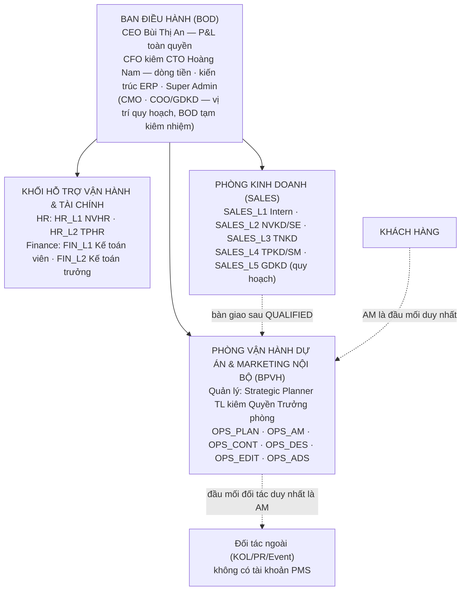
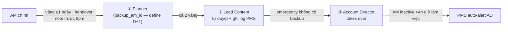
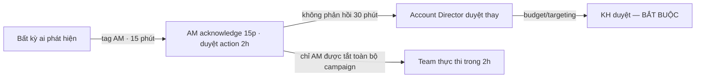

# CƠ CẤU TỔ CHỨC & PHÂN CÔNG CÔNG VIỆC THEO BỘ PHẬN

**Mã tài liệu:** `07_Co_cau_To_chuc_va_Phan_cong_Cong_viec.md`
**Phiên bản:** 1.0 — 12/09/2026
**Nguồn:** Cơ cấu tổ chức chuẩn từ tài liệu `05_Co_cau_To_chuc_Va_Triet_ly_He_thong.md` · Vai trong quy trình từ Lifecycle v2.3

---

## 1. Sơ đồ tổ chức

**Cơ chế đặc thù `[V6.0]`:** BPVH chạy song song **Dự án Khách hàng** (Client Projects) và **Dự án Nội bộ** (BC Agency Projects); Timesheet bắt buộc gắn nhãn `Client Billable` (vào COGS dự án KH) hoặc `Internal Non-billable` (chi phí nội bộ) — chặn ghi giờ chéo làm sai lệch P&L.

## 2. Định danh vai trò trong quy trình ↔ mã vai tổ chức

| Vai trong quy trình | Chức danh đầy đủ | Mã vai (tài liệu 05) | Ghi chú ánh xạ |
|---------------------|------------------|----------------------|----------------|
| SE — Sales Executive | NV Kinh doanh | `SALES_L2` NVKD | Chủ thực thi Sales Phase; observe từ WON; nhận nurturing list khi CLOSED |
| SM — Sales Manager | Trưởng phòng Kinh doanh | `SALES_L4` TPKD `[KXN-14]` | Duyệt bypass, review Tier borderline, escalation negotiation, review nurturing hàng tháng |
| TNKD — Trưởng nhóm KD | Team Leader Sales | `SALES_L3` | Hỗ trợ xử lý deal lớn `[V6.0]` — chưa xuất hiện trong lifecycle v2.3 |
| AM — Account Manager | Account Manager | `OPS_AM` | Vai dày nhất lifecycle — đầu mối duy nhất với KH |
| AD — Account Director | Account Director | **chưa có mã** `[KXN-12]` | Xuất hiện nhiều trong v2.3 (duyệt giá, escalation, health score, capacity) nhưng không có trong tài liệu 05 — cần chuẩn hóa |
| Planner | Strategic Planner | `OPS_PLAN` (kiêm Quyền Trưởng phòng Vận hành) | Backup AM #1; duyệt strategy/insight/format |
| Content Lead / Exec / Senior | Content Creator | `OPS_CONT` (khung L1–L5) | "Ngọn hải đăng" creative |
| Design Lead / Exec | Designer kiêm Photography | `OPS_DES` | Thực thi visual theo brief |
| Video Lead / Exec | Editor kiêm Cameraman | `OPS_EDIT` | Quay dựng, edit |
| Media Buyer / Exec / Lead | Ads Specialist | `OPS_ADS` | Triển khai, tối ưu chiến dịch đa kênh |
| Creative Lead | — | **chưa rõ** `[KXN-13]` | Xuất hiện ở Rehearsal/Pitching (v2.3); Kick-off/AM Backup lại dùng "Lead Content" — có phải cùng người? |
| Accountant | Kế toán viên / Kế toán trưởng | `FIN_L1` / `FIN_L2` | Confirm tiền D+0, tính giá Quotation, pro-rata |
| CS — Customer Service | — | **chưa có mã** `[KXN-13]` | Chỉ xuất hiện 1 lần trong v2.3 (Client Survey) |
| CEO / COO | — | BOD / quy hoạch | Escalation cuối: capacity >100%, điều khoản pháp lý |

## 3. Phân công công việc theo bộ phận × giai đoạn

### 3.1 PHÒNG KINH DOANH (SALES)

| Giai đoạn | Sales Executive (SALES_L2) | Sales Manager (SALES_L4) |
|-----------|---------------------------|--------------------------|
| **1. Sales** (thực thi chính) | Tiếp nhận raw data, anti-duplicate, tạo PMS 24h · gửi/nhận brief · chủ trì First Meeting · điền scoring form, chấm QUALIFIED 5 tiêu chí · hoàn thiện Handoff Package | Theo dõi pipeline · duyệt bypass First Meeting (4h) · review Tier borderline · quyết định Go/No-Go Gate 1 `[V6.0]` · ký duyệt bàn giao · contact CEO phía KH khi negotiation trễ |
| **2. Đánh giá & Đề xuất** (observe) | Observe Second Meeting · observe Rehearsal | Support Negotiation (AM dẫn đầu) · duyệt gia hạn negotiation |
| **3–4. Triển khai & ONGOING** (observe) | Hỗ trợ thu thập tài nguyên (liên hệ KH) | Escalation điểm Sales: KH im lặng proposal review 5 ngày |
| **5. Kết thúc** | Nhận nurturing list khi CLOSED · nurturing LOST theo re-contact date · re-qualify | Review nurturing list hàng tháng · evaluate profitability khi renew giảm budget |

### 3.2 PHÒNG VẬN HÀNH DỰ ÁN (BPVH)

**Account Manager (OPS_AM)** — điểm chặn chất lượng hướng khách hàng:
- GĐ2: chủ trì Evaluation, Second Meeting · soạn mọi version Proposal · gửi/quản lý revision · dẫn Negotiation.
- GĐ3: chủ trì thu thập tài nguyên · soạn Planning TT→ĐH→AD · chủ trì 3 buổi Kick-off.
- GĐ4: **duyệt toàn bộ content/creative (SLA 2h — không có ngoại lệ)** · **QC mọi báo cáo trước khi gửi** · gửi báo cáo 3 kênh · xử lý mọi feedback KH · duyệt emergency action (2h) · duyệt KH budget/targeting change · đầu mối đối tác duy nhất · review Client Health Score thứ 2 · Monthly Closing · QBR.
- GĐ5: Wrap-up, Survey, Final Report, Offboarding, Retro, xác nhận CLOSED/RENEW · đề xuất PAUSED · ghi nhận LOST (BPVH stages).

**Planner (OPS_PLAN — kiêm Quyền Trưởng phòng)** — bộ não chiến lược + dự phòng:
- GĐ2: review strategy Proposal · dự Second Meeting/Rehearsal · chủ trì soạn proposal 15–25 trang cho tier cao `[V6.0]` `[KXN-8]`.
- GĐ3: review Planning (strategy + media logic) · define AM Backup D+1.
- GĐ4: **backup AM #1** (duyệt content khi AM vắng) · duyệt depth insight Monthly (có quyền reject insight chung chung) · duyệt format Monthly/QBR · phân tích QBR · support phân tích emergency.
- GĐ5: tham dự Wrap-up · duyệt format Final Report · tham gia Retro.

**Creative teams — Content / Design / Video (`OPS_CONT` / `OPS_DES` / `OPS_EDIT`, khung L1–L5):**
- GĐ4 (chính): Content — brief + caption + kịch bản theo calendar, buffer 20% trending, self-QC, handoff; Design/Video — thực thi theo brief **không tự quyết concept**, QC checklist, upload PMS.
- Chain: Content → Handoff Form → Design/Video song song → Lead review → **AM duyệt** → Ads. Tối đa 3 vòng nội bộ, vòng 4 escalate AM.

**Media — Ads Specialist (`OPS_ADS`):**
- GĐ3: xác nhận tài nguyên ad account sẵn sàng trước D+5.
- GĐ4 (chính): Daily Health Check trước 9h (5 điểm, log bắt buộc) · setup + launch campaign (pre-launch QC) · Routine optimization trong ngưỡng (`og_threshold`) · A/B test (AM approve) · Budget pacing (daily cap = monthly/30×1.1) · Campaign Lifecycle theo mốc 24h/48h/72h–5d/14/25–28 · Competitive Intelligence weekly thứ 5 · pull data báo cáo · đóng góp Creative Library · **Emergency chỉ được tắt ad set đơn lẻ — tắt toàn bộ campaign là quyền của AM**.

**Account Director `[KXN-12]`** — lớp escalation vận hành:
- Confirm giá sơ bộ (Proposal v0.x) + giá cuối (Rehearsal) · duyệt margin Quotation · thẩm định borderline Evaluation (tier D/E) `[V6.0]` · quyết định vượt revision, dự án vượt năng lực, nhận/từ chối khi capacity 80–100% · duyệt emergency khi AM không phản hồi (30 phút) · contact KH khi chậm cấp quyền >5 ngày / KH không book Wrap-up / từ chối ký Rules · alert Health Score <60 hoặc drop >15 · approve early termination (4h) · backup AM cuối · vào cuộc khi AD alert AM inactive >4h.

### 3.3 KHỐI HỖ TRỢ VẬN HÀNH & TÀI CHÍNH

| Vai | Giai đoạn | Đầu việc |
|-----|-----------|----------|
| **Accountant — FIN_L1 Kế toán viên** | GĐ2 | Tính giá Quotation theo định mức `[V6.0]` |
| | GĐ3 | **Check sao kê hàng ngày · confirm tiền trong 4h — cổng D+0 (Financial Hard Stop `[V6.0]`)** · lưu HĐ · cảnh báo HĐ chưa có sau 3 ngày |
| | GĐ5 | Tính pro-rata khi early termination · sign-off exit documentation |
| **Kế toán trưởng — FIN_L2** | Ngang | Duyệt lệnh chi/giải ngân · chốt đối soát doanh thu + công nợ nền tảng Meta/Google/TikTok · escalation compliance `[V6.0/DI-006]` |
| **HR (HR_L1/L2)** | Ngang | Không xuất hiện trong lifecycle v2.3 — vận hành capacity settings, KPI 3 trụ cột `[V6.0]` `[KXN-18]` |

### 3.4 BAN ĐIỀU HÀNH (BOD)

| Vai | Điểm xuất hiện |
|-----|----------------|
| CEO (Bùi Thị An) | Escalation cuối điều khoản pháp lý phức tạp (Negotiation) · P&L toàn quyền `[V6.0]` |
| COO | Cùng CEO quyết định **ngừng nhận KH mới khi capacity >100%** · Dashboard Client Health overview |
| CFO-CTO (Hoàng Nam) | Quản trị kiến trúc PMS/CMS/TMS · Super Admin · phê duyệt hạn mức tín dụng TKQC `[V6.0]` |

## 4. Chuỗi dự phòng và escalation

### 4.1 AM Backup Protocol (khi AM vắng)

### 4.2 Chuỗi escalation Emergency (KPI <70% / KH báo khẩn / lỗi nghiêm trọng)

### 4.3 Nguyên tắc đầu mối

- **KH chỉ có 1 đầu mối:** AM — mọi thành viên khác không contact KH trực tiếp về quyết định (team hỏi đáp kỹ thuật qua PMS comment).
- **Đối tác ngoài chỉ có 1 đầu mối:** AM — đối tác không có PMS, giao qua Zalo, thu evidence.
- **Feedback KH mọi kênh** phải được nhập về PMS — "không ghi PMS = không tồn tại" `[V6.0]`.

## 5. Điểm còn thiếu của cơ cấu tổ chức

| Mã | Khoản | Ảnh hưởng |
|----|-------|-----------|
| `[KXN-12]` | AD chưa có trong tài liệu 05 — không có mã vai, cấp bậc, relationship line | RBAC: quyền duyệt giá/margin/termination của AD phải được cấp quyền tường minh |
| `[KXN-13]` | Creative Lead vs Lead Content có phải một người? CS nằm ở đâu? | Phân công Rehearsal/Pitching/Survey, chuỗi AM Backup |
| `[KXN-14]` | SM = TPKD hay GDKD? (GDKD đang là vị trí quy hoạch) | Ma trận phê duyệt Gate 1, bypass, hoa hồng |
| `[KXN-18]` | HR không xuất hiện trong lifecycle — quy trình tuyển/onboard nhân sự chưa có nguồn | Bộ tài liệu quy trình HR là khoảng trống riêng |
