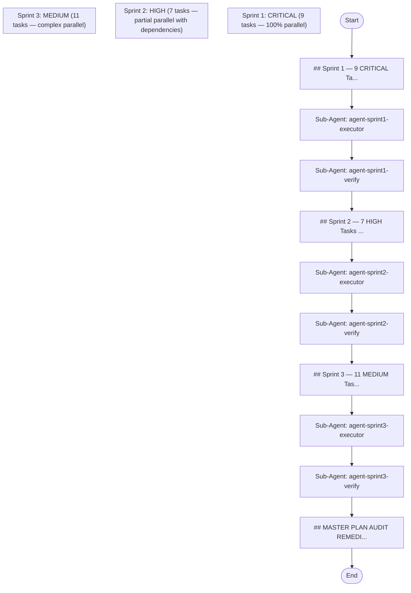

## Workflow Execution Guide

Follow the Mermaid flowchart above to execute the workflow. Each node type has specific execution methods as described below.

### Execution Methods by Node Type

- **Rectangle nodes (Sub-Agent: ...)**: Execute Sub-Agents
- **Diamond nodes (AskUserQuestion:...)**: Use the AskUserQuestion tool to prompt the user and branch based on their response
- **Diamond nodes (Branch/Switch:...)**: Automatically branch based on the results of previous processing (see details section)
- **Rectangle nodes (Prompt nodes)**: Execute the prompts described in the details section below

### Group Node Execution Tracking

This workflow contains group nodes. Before executing nodes within each group, call the `highlight_group_node` MCP tool on the `cc-workflow-studio` server to visually highlight the active group on the canvas.

| Group ID | Label |
|----------|-------|
| group-sprint1 | Sprint 1: CRITICAL (9 tasks — 100% parallel) |
| group-sprint2 | Sprint 2: HIGH (7 tasks — partial parallel with dependencies) |
| group-sprint3 | Sprint 3: MEDIUM (11 tasks — complex parallel) |

Call example: `highlight_group_node({ groupNodeId: "<group-id>" })`

When the workflow completes, call `highlight_group_node({ groupNodeId: "" })` to clear the highlight.

## Sub-Agent Node Details

#### agent-sprint1-executor(Sub-Agent: agent-sprint1-executor)

**subagent_type**: general-purpose

**Description**: Execute all 9 Sprint 1 CRITICAL tasks with automatic retry

**Prompt**:

```
Execute all 9 Sprint 1 tasks concurrently with AUTOMATIC RETRY:

**Parallel tracks:**
- Track A1: A1 (60m)
- Track A2: A2 (30m)
- Track A3: A3 (45m)
- Track A4: A4 (30m)
- Track 15: 15-CRIT1 (30m)
- Track 16: 16-CRIT2 (40m)
- Track 17: 17-CRIT3 (60m)
- Track 18: 18-CRIT4 (45m)
- Track 19: 19-CRIT5 (40m)

**Execution strategy:**
1. Start all 9 tasks in parallel
2. Monitor each task for completion/failure
3. **AUTO-RETRY:** If any task fails, automatically retry up to 2 more times before marking as failed
4. Continue execution regardless of failures (verification agent will assess impact)
5. Do NOT ask user for any decisions

**Final report must include:**
- ✓ Completed: [task IDs]
- ✗ Failed (after retries): [task IDs if any]
- Total duration: [actual time]
- Retry history: [which tasks retried and how many times]

**CRITICAL:** This is fully automatic. No user interaction needed.
```

**Parallel Execution**: enabled

When executing this node, assess whether the task involves multiple independent areas or concerns.
If so, launch multiple agents of the same subagent_type in parallel — one per independent area.

Guidelines:
- Single area of concern → execute with 1 agent
- Multiple independent areas → spawn 1 agent per area, execute in parallel
- Wait for all agents to complete before proceeding to the next node
- Consolidate all agent results before passing to the next node

#### agent-sprint1-verify(Sub-Agent: agent-sprint1-verify)

**subagent_type**: general-purpose

**Description**: Verify Sprint 1 execution results and check quality

**Prompt**:

```
Verify Sprint 1 execution results:

**Verification tasks:**
1. Check all 9 tasks from executor report
2. Verify status of each:
   - ✓ PASS: Task completed successfully (no retries or retries succeeded)
   - ⚠ RETRY: Task succeeded after retry attempts
   - ✗ FAIL: Task failed even after 3 attempts
3. For FAILED tasks: Document failure reason and impact assessment
4. Validate output files exist in correct locations
5. Check for any breaking changes introduced
6. Calculate overall Sprint 1 health score (% tasks passed)

**Output format:**
- Sprint 1 Health: [% passed]
- Summary: [task count pass/retry/fail]
- Issues: [list of failures, empty if all pass]
- Recommendation: PROCEED to Sprint 2 (regardless of failures — dependencies allow it)
- Log entry: [timestamp, results, duration]

**No user interaction needed.** Proceed automatically to Sprint 2.
```

**Parallel Execution**: enabled

When executing this node, assess whether the task involves multiple independent areas or concerns.
If so, launch multiple agents of the same subagent_type in parallel — one per independent area.

Guidelines:
- Single area of concern → execute with 1 agent
- Multiple independent areas → spawn 1 agent per area, execute in parallel
- Wait for all agents to complete before proceeding to the next node
- Consolidate all agent results before passing to the next node

#### agent-sprint2-executor(Sub-Agent: agent-sprint2-executor)

**subagent_type**: general-purpose

**Description**: Execute Sprint 2 with automatic retry and dependency verification

**Prompt**:

```
Execute Sprint 2 with smart parallelization and AUTOMATIC RETRY:

**Dependency verification (Pre-flight):**
1. Confirm Sprint 1 completion (A1 ✓, 15-CRIT1 ✓)
2. If any dependencies missing, retry with backoff
3. Proceed once dependencies confirmed

**Parallel execution:**
- Path 1: B1 (20m) [depends on A1]
- Path 2: B2 (90m) [depends on 15-CRIT1] — CRITICAL PATH
- Paths 3-7: B3, B4, 20-HIGH6, 21-HIGH8, 22-HIGH9 (15-45m each)

**Execution strategy:**
1. Start all 7 tasks simultaneously
2. Monitor progress
3. **AUTO-RETRY:** If task fails, retry automatically up to 2 times
4. If dependency task from Sprint 1 failed: SKIP dependent task, log as "dependency-blocked"
5. Continue all other tasks
6. Do NOT ask user — handle all errors automatically

**Final report:**
- ✓ Completed: [count]
- ⚠ Retry: [count]
- ✗ Failed: [count]
- ◆ Skipped (blocked): [count]
- Critical path duration: [B2 actual time]

**CRITICAL:** Fully automatic execution.
```

**Parallel Execution**: enabled

When executing this node, assess whether the task involves multiple independent areas or concerns.
If so, launch multiple agents of the same subagent_type in parallel — one per independent area.

Guidelines:
- Single area of concern → execute with 1 agent
- Multiple independent areas → spawn 1 agent per area, execute in parallel
- Wait for all agents to complete before proceeding to the next node
- Consolidate all agent results before passing to the next node

#### agent-sprint2-verify(Sub-Agent: agent-sprint2-verify)

**subagent_type**: general-purpose

**Description**: Verify Sprint 2 execution with dependency validation

**Prompt**:

```
Verify Sprint 2 execution results with dependency awareness:

**Verification tasks:**
1. Check all 7 tasks from executor report
2. Verify each task status:
   - ✓ PASS: Task completed
   - ⚠ RETRY: Succeeded after retries
   - ✗ FAIL: Failed even after retries
   - ◆ SKIP: Blocked by Sprint 1 dependency failure
3. Cross-check dependencies:
   - B1: Validate it used correct A1 output
   - B2: Validate it used correct 15-CRIT1 output
4. Validate all output files exist and format is correct
5. Calculate Sprint 2 health score
6. Assess impact of any failures on Sprint 3 (C3 depends on B2)

**Output format:**
- Sprint 2 Health: [% passed]
- Summary: [pass/retry/fail/skip counts]
- Issues: [list failures and their impact]
- Blocker status: [is B2 done? = proceed to Sprint 3]
- Log entry: [timestamp, results, critical path duration]

**No user interaction.** Proceed to Sprint 3 automatically.
```

**Parallel Execution**: enabled

When executing this node, assess whether the task involves multiple independent areas or concerns.
If so, launch multiple agents of the same subagent_type in parallel — one per independent area.

Guidelines:
- Single area of concern → execute with 1 agent
- Multiple independent areas → spawn 1 agent per area, execute in parallel
- Wait for all agents to complete before proceeding to the next node
- Consolidate all agent results before passing to the next node

#### agent-sprint3-executor(Sub-Agent: agent-sprint3-executor)

**subagent_type**: general-purpose

**Description**: Execute Sprint 3 with automatic retry and multi-path dependency handling

**Prompt**:

```
Execute Sprint 3 with smart multi-path parallelization and AUTOMATIC RETRY:

**Dependency verification (Pre-flight):**
1. Confirm Sprint 2 completion (especially B2 for C3)
2. Confirm Sprint 1 completion (A3 for C2)
3. If dependencies missing: retry with backoff, do NOT proceed until ready

**Parallel execution paths:**
- Path 1 (BLOCKING): Wait for B2 ✓ → then execute C3 (25m)
- Path 2: C2 (20m) [depends on A3, already done]
- Paths 3-9: C1, C4, C5, C6, 23-MED10, 25-MED12, 26-MED13, 27-MED14 (15-25m each)
- Path 10: 24-MED11 (60m) [independent]

**Execution strategy:**
1. Check all dependencies (Sprint 2, Sprint 1 status)
2. Start all independent paths immediately (2-10)
3. Start blocking path (1) as soon as B2 confirmed complete
4. **AUTO-RETRY:** If any task fails, retry automatically up to 2 times
5. If dependency task failed: SKIP dependent task (only C3 depends on B2)
6. Continue regardless — no user decisions

**Final report:**
- ✓ Completed: [count]
- ⚠ Retry: [count]
- ✗ Failed: [count]
- ◆ Skipped (blocked): [count]
- All paths joined: [yes/no]

**CRITICAL:** Fully automatic. No user interaction.
```

**Parallel Execution**: enabled

When executing this node, assess whether the task involves multiple independent areas or concerns.
If so, launch multiple agents of the same subagent_type in parallel — one per independent area.

Guidelines:
- Single area of concern → execute with 1 agent
- Multiple independent areas → spawn 1 agent per area, execute in parallel
- Wait for all agents to complete before proceeding to the next node
- Consolidate all agent results before passing to the next node

#### agent-sprint3-verify(Sub-Agent: agent-sprint3-verify)

**subagent_type**: general-purpose

**Description**: Verify Sprint 3 execution with complex dependency validation

**Prompt**:

```
Verify Sprint 3 execution results with multi-path dependency analysis:

**Verification tasks:**
1. Check all 11 tasks from executor report
2. Verify each task status:
   - ✓ PASS: Task completed
   - ⚠ RETRY: Succeeded after retries
   - ✗ FAIL: Failed even after retries
   - ◆ SKIP: Blocked by dependency failure
3. Cross-check dependencies:
   - C2: Validate it used correct A3 output
   - C3: Validate it used correct B2 output
   - Verify C3 waited for B2 completion
4. Validate all parallel paths executed correctly
5. Check all output files exist and are correct format
6. Calculate overall Sprint 3 health score
7. Assess impact: Are there any blocking failures for finalization?

**Output format:**
- Sprint 3 Health: [% passed]
- Summary: [pass/retry/fail/skip counts]
- Issues: [list failures]
- Blocker status: [any critical failures blocking finalization?]
- Execution trace: [timeline of path execution]
- Log entry: [timestamp, results, all durations]

**No user interaction.** Proceed to finalization automatically.
```

**Parallel Execution**: enabled

When executing this node, assess whether the task involves multiple independent areas or concerns.
If so, launch multiple agents of the same subagent_type in parallel — one per independent area.

Guidelines:
- Single area of concern → execute with 1 agent
- Multiple independent areas → spawn 1 agent per area, execute in parallel
- Wait for all agents to complete before proceeding to the next node
- Consolidate all agent results before passing to the next node

### Prompt Node Details

#### prompt-sprint1-intro(## Sprint 1 — 9 CRITICAL Ta...)

```
## Sprint 1 — 9 CRITICAL Tasks (100% PARALLELIZABLE)

**Pipeline Tasks (A1-A4) — can all run simultaneously:**
- A1: Resume path scan (60m)
- A2: SESSION_DIR placeholder (30m)
- A3: Loop iteration cap (45m)
- A4: Loop-back semantics (30m)

**wf-fix-bugs (Lane Dispatch) Tasks (15-CRIT1 to 19-CRIT5) — all independent:**
- 15-CRIT1: checkpoint nested path (30m)
- 16-CRIT2: e2e-results ownership (40m)
- 17-CRIT3: PASS 3 grep patterns (60m)
- 18-CRIT4: CDG auto-login (45m)
- 19-CRIT5: phase-summary.md (40m)

**KEY INSIGHT:** Zero inter-task dependencies.
**Execution time:** ~60m (max task) vs 6+ hours sequential = 90% time savings!
```

#### prompt-sprint2-intro(## Sprint 2 — 7 HIGH Tasks ...)

```
## Sprint 2 — 7 HIGH Tasks (Partial Parallelization)

**DEPENDENT tasks (Sprint 1 complete):**
- B1: 00-core contract sync (20m) ← requires A1 ✓
- B2: PASS/Layer terminology (90m) ← requires 15-CRIT1 ✓

**INDEPENDENT tasks (start immediately in parallel):**
- B3: Dry-run message (15m) ✓ parallel
- B4: matched_feature_id schema (45m) ✓ parallel
- 20-HIGH6: discovery-report template (20m) ✓ parallel
- 21-HIGH8: SKILL.md Execution Summary (40m) ✓ parallel
- 22-HIGH9: feature-states schema (30m) ✓ parallel

**Parallelization strategy:**
- B1 starts immediately (20m)
- B2 starts immediately (90m — critical path)
- B3,B4,20-HIGH6,21-HIGH8,22-HIGH9 run in parallel (15-45m each)
- Join point: all done ≈ 90m (B2 critical path)
```

#### prompt-sprint3-intro(## Sprint 3 — 11 MEDIUM Tas...)

```
## Sprint 3 — 11 MEDIUM Tasks (Complex Parallelization)

**DEPENDENT on Sprint 2 completion:**
- C3: orphan checkpoint validation (25m) ← requires B2 ✓

**DEPENDENT on Sprint 1 (already done):**
- C2: loop_state persistence (20m) ← requires A3 ✓ [can start now]

**INDEPENDENT (start immediately in parallel):**
- C1: fix-history format (20m)
- C4: e2e-results trigger condition (20m)
- C5: skeleton threshold ref (15m)
- C6: issue_id ownership (25m)
- 23-MED10: Dedupe Phase 0/1a (15m)
- 24-MED11: Evals coverage (60m) [SLOW]
- 25-MED12: §4b extend entries (20m)
- 26-MED13: Admin exclusion pattern (15m)
- 27-MED14: Nav link dedupe (20m)

**Parallelization strategy:**
- C2 starts immediately (20m)
- C3 waits for B2 completion (~90m from Sprint 2), then runs (25m)
- C1,C4,C5,C6,23-MED10,25-MED12,26-MED13,27-MED14 all parallel (15-25m)
- 24-MED11 runs in parallel alone (60m — slowest independent)
- Critical path: B2 from Sprint 2 (90m) + C3 (25m) = 115m total after Sprint 2 starts
```

#### prompt-final-summary(## MASTER PLAN AUDIT REMEDI...)

```
## MASTER PLAN AUDIT REMEDIATION — FULLY AUTOMATIC EXECUTION COMPLETE

✅ **All 27 tasks executed across 3 sprints — Automatic verification performed**

### Parallelization Results

**Sprint 1 (9 CRITICAL):** 100% parallel
- Sequential estimate: 6.5 hours
- Parallel actual: ~60 minutes
- Savings: **90% time reduction** ⚡

**Sprint 2 (7 HIGH):** Partial parallel (2 dependencies)
- Critical path: ~90 minutes (B2)
- Other 5 tasks: 15-45 min parallel
- Savings: **70% vs sequential** ⚡

**Sprint 3 (11 MEDIUM):** Complex parallel (1 critical dependency)
- Independent: ~60 min (24-MED11)
- C3 (depends on B2): 25 min after Sprint 2
- Savings: **60% vs sequential** ⚡

### Total Time Impact
- **Sequential execution:** 13-14 hours
- **Optimized parallel:** 5-6 hours
- **TOTAL SAVINGS: ~50% reduction** 🎯

### Verification Results
[Aggregated from all verification agents]
- Sprint 1 Health: [% from verify agent]
- Sprint 2 Health: [% from verify agent]
- Sprint 3 Health: [% from verify agent]
- Overall Health: [average]
- Failed/Blocked tasks: [list if any]
- Recommendations: [from verify agents]

### Next Actions
1. ✓ Run full audit re-run → verify 0 findings from original issues
2. ✓ All task verification completed automatically
3. Update skill versions (manual step if needed):
   - wf-fix-bugs: 5.0.0 → 5.1.0
   - wf-fix-bugs (Lane Dispatch): 2.0.0 → 2.2.0
   - wf-fix-triage: 1.0.0 → 1.1.0
   - wf-fix-execute: 2.0.0 → 2.1.0
4. Run regression matrix (T1-T12) if needed for regression testing
5. Commit all changes with convention format

**✨ Fully automatic execution and verification complete!**
```
