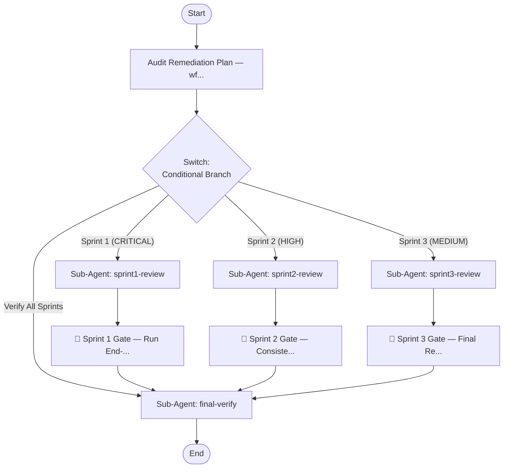

## Workflow Execution Guide

Follow the Mermaid flowchart above to execute the workflow. Each node type has specific execution methods as described below.

### Execution Methods by Node Type

- **Rectangle nodes (Sub-Agent: ...)**: Execute Sub-Agents
- **Diamond nodes (AskUserQuestion:...)**: Use the AskUserQuestion tool to prompt the user and branch based on their response
- **Diamond nodes (Branch/Switch:...)**: Automatically branch based on the results of previous processing (see details section)
- **Rectangle nodes (Prompt nodes)**: Execute the prompts described in the details section below

## Sub-Agent Node Details

#### sprint1-review(Sub-Agent: sprint1-review)

**Description**: Review Sprint 1 CRITICAL tasks (A1-A4, 15-CRIT1 to 19-CRIT5)

**Model**: opus

**Prompt**:

```
Review the following 9 CRITICAL Sprint 1 tasks from the master plan:

Pipeline issues:
- A1: Resume path scan (find -maxdepth 4)
- A2: SESSION_DIR placeholder
- A3: Loop iteration cap 3/4
- A4: Loop-back semantics

wf-fix-bugs (Lane Dispatch) issues:
- 15-CRIT1: checkpoint.json nested path fix
- 16-CRIT2: e2e-results.json ownership
- 17-CRIT3: PASS 3 grep patterns
- 18-CRIT4: CDG gate for auto-login
- 19-CRIT5: phase-summary.md for discover

For each task:
1. Check current status (pending/in_progress/completed)
2. Identify any blockers
3. Verify completeness
4. List dependencies

Provide a structured summary.
```

#### sprint2-review(Sub-Agent: sprint2-review)

**Description**: Review Sprint 2 HIGH tasks (B1-B4, 20-HIGH6 to 22-HIGH9)

**Model**: opus

**Prompt**:

```
Review the following 7 HIGH Sprint 2 consistency tasks from the master plan:

Pipeline issues:
- B1: 00-core §4b contract sync (depends A1)
- B2: PASS/Layer terminology migration (depends 15-CRIT1)
- B3: Dry-run message
- B4: matched_feature_id schema

wf-fix-bugs (Lane Dispatch) issues:
- 20-HIGH6: discovery-report.md template declaration
- 21-HIGH8: SKILL.md Execution Summary completeness
- 22-HIGH9: feature-states state field schema

For each task:
1. Verify Sprint 1 dependencies are met
2. Check status and completion percentage
3. Review for consistency violations
4. Identify schema validation issues

Gate: Run `skill-compliance-audit.sh wf-fix-bugs (Lane Dispatch) PASS`

Provide summary with dependency status.
```

#### sprint3-review(Sub-Agent: sprint3-review)

**Description**: Review Sprint 3 MEDIUM tasks (C1-C6, 23-MED10 to 27-MED14)

**Model**: opus

**Prompt**:

```
Review the following 11 MEDIUM Sprint 3 polish tasks from the master plan:

Pipeline issues:
- C1: fix-history format unify
- C2: loop_state persistence (depends A3)
- C3: orphan checkpoint validation (depends B2)
- C4: e2e-results trigger condition (cross-ref 16-CRIT2)
- C5: skeleton threshold ref
- C6: issue_id ownership contract

wf-fix-bugs (Lane Dispatch) issues:
- 23-MED10: Dedupe Phase 0/1a fix-status
- 24-MED11: Evals coverage (8+ scenarios)
- 25-MED12: §4b add 5 more contract entries (extends B1)
- 26-MED13: Admin exclusion pattern remove
- 27-MED14: Nav link dedupe track

For each task:
1. Verify Sprint 2 dependencies complete
2. Check test coverage (especially 24-MED11)
3. Validate formatting and schema consistency
4. Review contract extensions

Provide checklist with test coverage assessment.
```

#### final-verify(Sub-Agent: final-verify)

**Description**: Final verification across all sprints and version validation

**Model**: opus

**Prompt**:

```
Perform final comprehensive verification of the entire audit remediation:

1. Task Completion Summary:
   - Sprint 1 (CRITICAL): __ / 9 complete
   - Sprint 2 (HIGH): __ / 7 complete
   - Sprint 3 (MEDIUM): __ / 11 complete
   - Total: __ / 27 complete

2. Blocker Check:
   - Any 'blocked' status? If yes, document root cause
   - Any 'skipped' status? If yes, document justification

3. Test Results:
   - T1-T12 regression matrix: All PASS?
   - Compliance audit (wf-fix-bugs (Lane Dispatch)): PASS?
   - Re-audit findings: 0 old issues?

4. Version Validation:
   - All version bumps applied?
   - Changelog updated with breaking change assessment?
   - Commit convention used (fix(wf-fix-bugs): [TASK-ID]...)?

5. Documentation:
   - test-results-sprint-1/2/3.md completed?
   - Any postmortem needed (regressions found)?
   - Rollback strategy documented if used?

Output: Pass/Fail + summary for sign-off.
```

### Prompt Node Details

#### overview-prompt(Audit Remediation Plan — wf...)

```
Audit Remediation Plan — wf-fix-bugs v5.0.0

📋 Overview:
- Total Tasks: 27
- CRITICAL (Sprint 1): 9 tasks (~4-5 hours)
- HIGH (Sprint 2): 7 tasks (~3-4 hours)
- MEDIUM (Sprint 3): 11 tasks (~4 hours)

🎯 Audit Sources:
1. Pipeline-wide audit: 14 issues
2. wf-fix-bugs (Lane Dispatch) specific: 13 issues

⏱️ Update status for each task as work completes:
Valid values: pending, in_progress, completed, blocked, skipped

✅ This workflow guides you through reviewing each sprint's tasks and verifying completion.
```

#### sprint1-gate(🚪 Sprint 1 Gate — Run End-...)

```
🚪 Sprint 1 Gate — Run End-to-End Tests

Before proceeding to Sprint 2, execute regression tests:

✓ T1: Fresh scope=all → `/wf-fix-bugs` (A1)
✓ T3: scope=module → Session at sessions/{parent}/mod-/ (A1)
✓ T5: Resume mid-discover (L2 done) → Skip L0-L2 (15-CRIT1, A1)
✓ T6: Resume mid-triage → Idempotent (A1, A3)
✓ T10: Auto-login CDG flow → Trigger prompt (18-CRIT4)
✓ T11: phase-summary.md Phase 1 → Tiếng Việt ≤15 dòng (19-CRIT5)

📝 Document results in: docs/plans/test-results-sprint-1.md

✅ PASS = All 9 tasks complete + gate tests pass
⚠️  WARN = Some tasks blocked (document in Blockers)
❌ FAIL = Critical issues found (rollback strategy: revert via git revert, not reset --hard)
```

#### sprint2-gate(🚪 Sprint 2 Gate — Consiste...)

```
🚪 Sprint 2 Gate — Consistency & Schema Validation

Before proceeding to Sprint 3:

✓ T2: scope=system → Session at sessions/sys-crm/ (A1)
✓ T4: Dry-run → status=PREVIEW (A2, B3)
✓ T8: Deep scan → Orphan UI detection + CDG (C3, B4)
✓ T12: state field consumer → wf-fix-triage parse correctly (22-HIGH9)

🔍 Compliance Check:
`skill-compliance-audit.sh wf-fix-bugs (Lane Dispatch)` MUST PASS

📝 Document results in: docs/plans/test-results-sprint-2.md

✅ PASS = All 7 tasks complete + compliance audit clean
⚠️  WARN = Minor inconsistencies (document)
❌ FAIL = Schema issues or audit failures
```

#### sprint3-gate(🚪 Sprint 3 Gate — Final Re...)

```
🚪 Sprint 3 Gate — Final Regression & Version Bump

Before shipping:

✓ T7: Resume mid-execute → Batch 2 resumption (A4)
✓ T9: PASS 3 E2E flow extraction → flows extracted > 0 (17-CRIT3)

🔄 Full Audit Re-run:
`/wf-fix-bugs` on sample project → 0 old findings

📈 Test Coverage:
Evals scenarios ≥ 8 new (24-MED11)

📝 Document results in: docs/plans/test-results-sprint-3.md

🚀 Version Bump Required:
- wf-fix-bugs: 5.0.0 → 5.1.0
- wf-fix-bugs (Lane Dispatch): 2.0.0 → 2.2.0
- wf-fix-triage: 1.0.0 → 1.1.0
- wf-fix-execute: 2.0.0 → 2.1.0

⚠️  Breaking Changes Assessment:
- 15-CRIT1: Add grace period (try both paths)
- B2: Backward-compat for field renames
- 22-HIGH9: Use Option B (union type, not breaking)

✅ PASS = All 11 tasks complete + re-audit clean + version bumped
❌ FAIL = Regressions detected → rollback via `git revert`
```

### Switch Node Details

#### sprint-selector(Multiple Branch (2-N))

**Evaluation Target**: Which sprint to review?

**Branch conditions:**
- **Sprint 1 (CRITICAL)**: Review 9 CRITICAL foundation tasks
- **Sprint 2 (HIGH)**: Review 7 HIGH consistency tasks (requires Sprint 1 complete)
- **Sprint 3 (MEDIUM)**: Review 11 MEDIUM polish tasks (requires Sprint 2 complete)
- **Verify All Sprints**: Final verification and version bumping

**Execution method**: Evaluate the results of the previous processing and automatically select the appropriate branch based on the conditions above.
