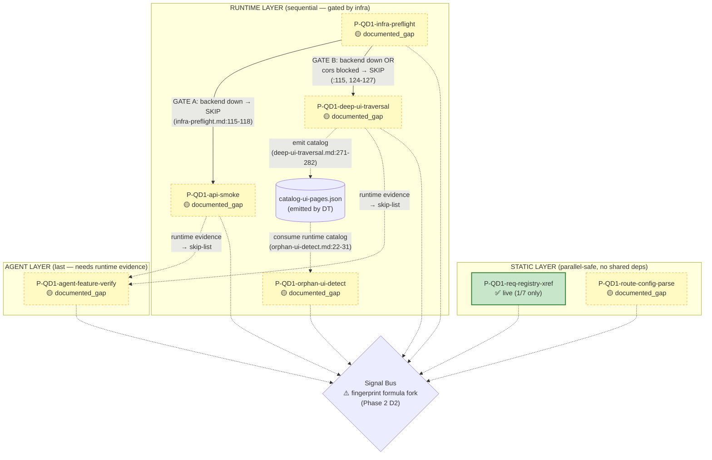

# QD1 — Functional Correctness: Audit Report

> **Status:** ✅ **QD1 audit complete (Phase 1+2+3+4+5 ✅)** — Phase 1 static review + Phase 2 code trace (4/7 probes + dispatcher + signal_bus, 24 discrepancies) + Phase 3 fixture (P=R=F1=1.00 trên live scope, DoD pass) + Phase 4 cross-probe DAG (9 findings: 3 cascade + 3 redundancy + 2 ordering + 1 coverage) + Phase 5 synthesize (Phiên 9, 2026-05-08).
> **Phase 5 outputs:** §8 Recommendations expanded từ 6 → 11 IMPs (promote IMP-QD1-007 dual-schema fork + 4 new QD1-008..011 từ Phase 4); §8.1 priority order rationale với 4 layers (P0 prerequisite → P0 stack coverage → P1 protocol/quality → P2 polish); IMP-QD1-005 nâng P1→P0 (CASCADE-001 + COVERAGE-001 chứng minh là prerequisite cho 6/7 probe scripts còn lại).
> **Sẵn sàng:** Stage 2 cross-cutting (file 09) — feed evidence từ §3 P1-P4 + §Phase 2 architectural + §Phase 4 §4.4-§4.6.
> **ID namespace caveat:** `IMP-QD1-NNN` là dimension-local (per-audit). Mapping sang global `IMP-NNN` ở `10-improvement-roadmap.md` thực hiện ở Stage 2 G2 (xem §8 namespace caveat + §8.1 Stage 2 promote note).

## Phase 2 — Code Trace Summary (added 2026-05-08, Phiên 5)

**Coverage:** 4/7 probes traced (≥50% Phase 2 DoD): `req-registry-xref`, `route-config-parse`, `infra-preflight`, `api-smoke`. Plus dispatcher.py + signal_bus.py + signal-emit.md.

**Files đọc:**
- `.claude/scripts/wf-fix-probe-static-xref.sh` (236 dòng)
- `.claude/skills/workflow/wf-fix-functional/SKILL.md` (199 dòng)
- `.claude/skills/workflow/wf-fix-functional/dimension.json` (146 dòng)
- 4 probe spec: `procedures/probes/P-QD1-{req-registry-xref,route-config-parse,infra-preflight,api-smoke}.md`
- `.claude/skills/workflow/_shared/lane/dispatcher.py` (335 dòng)
- `.claude/skills/workflow/_shared/lane/signal-emit.md` (228 dòng)
- `.claude/skills/workflow/_shared/lane/_shared.md` §1 (signal-v2 schema lane-local)
- `.claude/skills/workflow/_shared/signal_bus/signal_bus.py` (1-200)
- `.claude/skills/workflow/_shared/signal_bus/schemas/signal.v2.schema.json`

**Architectural finding — DUAL "signal-v2" SCHEMA FORK (CRITICAL — IMP-QD1-007):**

Hai định nghĩa `signal-v2` không tương thích cùng tồn tại:

| Field | Lane-local (`_shared/lane/_shared.md` §1, bash scripts, signal-emit.md) | Bus (`signal_bus/schemas/signal.v2.schema.json`, `signal_bus.py`) |
|-------|---|---|
| Timestamp | `detected_at` | `emitted_at` ✅ required |
| Location | `location: {file, line, column, selector, url}` | `target: {kind, file_path, line_range[2], symbol, ...}` ✅ required |
| Evidence | `evidence: [{type, path, description}]` (array) | `evidence: {code_snippet, screenshot_path, log_excerpt, ...}` (dict by kind) ✅ required |
| Severity | `severity` ∈ {critical,high,medium,low,info} | `suggested_severity` (default "medium") |
| Dedup | `fingerprint: "sha256:..."` | `dedup_hints: ["..."]` (Bus tự tính `dedup_key`) |
| Lane name | thiếu (chỉ có `detected_by`) | `lane` ∈ `^wf-fix-[a-z]+$` ✅ required |
| Probe ID pattern | không enforce | `^P-QD[1-7]-[a-z0-9-]+$` |

Cả hai đều dùng `"$schema": "signal-v2"`. Nếu bash output (lane format) feed thẳng vào `signal_bus.Signal.from_dict()` → ValueError ngay (thiếu `emitted_at`, `target`, `lane`). **Cần translator/adapter** giữa lane-local → bus, hoặc unified một schema duy nhất. Spec/code đều không document được translator này. Risk: orchestrator aggregate phase fail toàn lane khi ráp 7 lane signals → issue-registry.

**Fingerprint formula mismatch:**
- `signal-emit.md` §Fingerprint: `sha256(dim|file|line|probe|sig_type)` (5 token, không id).
- `wf-fix-probe-static-xref.sh:137,180`: `sha256(QD1|registry|0|probe|signal_type|id)` (6 token, có id).

→ Cùng probe nhưng 2 path emit khác nhau → dedup key khác nhau → KHÔNG dedup được giữa các đường emit. Severity HIGH.

**Bash script coverage:**
- `.claude/scripts/wf-fix-probe-*.sh` chỉ có 7 file (xref, business, data, deprecated, perf, secret, a11y). KHÔNG có dedicated script cho `route-config-parse`, `infra-preflight`, `api-smoke`, `deep-ui-traversal`, `orphan-ui-detect`, `agent-feature-verify`. → 6/7 probe QD1 phụ thuộc inline bash trong SKILL.md / probe.md (không reusable, không testable độc lập).

**Lane dispatcher:**
- `_shared/lane/dispatcher.py` là **generic linear dispatcher** dành cho linear workflow skills (`wf-analyze-requirements`, …) — đã có chú thích `_shared.md` §DUAL PURPOSE DIRECTORY xác nhận KHÔNG dùng cho 7 QD lane. QD lane orchestration nằm inline trong SKILL.md `Phase 1/Phase 2` table — chưa có module Python tập trung. → Thử nghiệm dispatcher cho QD lane sẽ phải build mới.

## 1. Tổng quan

| Trường      | Giá trị                             |
| ------------- | ------------------------------------- |
| Dimension ID  | QD1                                   |
| Tên          | Functional Correctness                |
| Owner agent   | `general-purpose`                   |
| Số probes    | 7                                     |
| Profile chạy | quick / standard / deep / exhaustive  |
| Lane skill    | `wf-fix-functional` v2.0.0-alpha.s4 |

## 2. Liệt kê probes

| Probe ID                       | Type           | Depth     | Severity default | Tool            | Cost     |
| ------------------------------ | -------------- | --------- | ---------------- | --------------- | -------- |
| `P-QD1-req-registry-xref`    | static         | quick+    | HIGH             | grep+jq         | 30s/2K   |
| `P-QD1-route-config-parse`   | static         | standard+ | HIGH             | grep+ast        | 60s/4K   |
| `P-QD1-infra-preflight`      | runtime        | quick+    | CRITICAL         | bash+curl       | 30s/1K   |
| `P-QD1-deep-ui-traversal`    | runtime        | standard+ | HIGH             | playwright      | 120s/8K  |
| `P-QD1-api-smoke`            | runtime        | quick+    | HIGH             | bash+curl       | 60s/2K   |
| `P-QD1-orphan-ui-detect`     | static+runtime | standard+ | MEDIUM           | grep+playwright | 45s/3K   |
| `P-QD1-agent-feature-verify` | agent          | deep+     | HIGH             | general-purpose | 180s/15K |

## 3. Per-probe Analysis

### Probe 1: `P-QD1-req-registry-xref`

**SENSE:** Delegate sang bash script `wf-fix-probe-static-xref.sh`. Script đọc registry → filter `impl_status ∈ {done, in_progress}` → grep REQ-ID/FEAT-ID annotations (TS/JS/Python/Java/C#/Go/Rust).

**THINK:** 2 loại signal:

- Coverage gap: feature done không có FEAT-ID trong code → HIGH (in_progress → MEDIUM)
- Orphan annotation: code REQ-ID không trong registry → MEDIUM

**ACT:** Emit signals theo schema `signal-v2`. Dedup `sha256(QD1|file|line|probe_id|signal_type|id)`.

**VERIFY:** evidence non-empty, signal_type ∈ {coverage_gap, orphan_annotation}, severity ∈ {critical, high, medium, low}.

**Spec ↔ Implementation discrepancy:** ⚠️ **PARTIAL** — bash script tồn tại và logic SENSE/THINK/ACT khớp spec, nhưng schema output không khớp Bus và fingerprint formula bị fork. (Phase 2 traced 2026-05-08)

| # | Spec nói | Code làm (`wf-fix-probe-static-xref.sh`) | Severity |
|---|---|---|---|
| D1 | Output theo schema `signal-v2` (probe.md §ACT) | Bash output dùng `severity`, `location`, `evidence: [array]`, `fingerprint`, `detected_at`, `detected_by` (lane-local v2). `signal_bus/schemas/signal.v2.schema.json` lại yêu cầu `suggested_severity`, `target`, `evidence: {dict}`, `dedup_hints`, `emitted_at`, `lane` (bus v2). Cả hai đều `$schema=signal-v2` nhưng KHÔNG cùng schema. (`wf-fix-probe-static-xref.sh:148-163, 191-207`) | **HIGH** (lane→bus fail validate) |
| D2 | Fingerprint dedup: `sha256(dim\|file\|line\|probe\|sig_type)` (`signal-emit.md` §Fingerprint) | `sha256(QD1\|registry\|0\|probe\|coverage_gap\|feat_id)` — thêm `id` token (`wf-fix-probe-static-xref.sh:137`) và `sha256(QD1\|file\|line\|probe\|orphan_annotation\|req_id)` (`:180`). 6 token thay vì 5. | **HIGH** (dedup miss giữa các đường emit) |
| D3 | Multi-language regex (TS/JS/Python/Java/C#/Go/Rust) — probe.md §SENSE B2 | ✅ Khớp: `--include='*.ts' --include='*.tsx' --include='*.js' --include='*.jsx' --include='*.py' --include='*.java' --include='*.cs' --include='*.go' --include='*.rs'` (`:101-114`) | ✅ Match |
| D4 | Cache: `python -m _shared.scan_cache.cache_lookup` được "delegated rieng" — probe.md §SENSE B2 | Bash script KHÔNG gọi cache. SKILL.md phải inline gọi nhưng không có integration test E2E. | **MEDIUM** (cache claim chưa verify) |
| D5 | DEPRECATED systems exclusion | ✅ Có `DEPRECATED_MODULES=$(jq … 'select(.action == "DEPRECATE")')` (`:85`) — nhưng **biến không dùng tiếp** trong filter ở §Step 1 (`:76-80` chỉ filter theo `impl_status`, không exclude DEPRECATED features). | **MEDIUM** (CORE-022 vi phạm intent) |
| D6 | REQ-ID regex `REQ-[A-Z]+(-[A-Z]+)?-[0-9]+` cover `REQ-DEPT-NNN` lẫn `REQ-SYS-MOD-NNN` | ✅ Khớp 2 format (`:101, 105`). Nhưng KHÔNG hỗ trợ extra suffix nếu codebase mở rộng (`REQ-A-B-C-NNN`). | LOW (edge case) |

### Probe 2: `P-QD1-route-config-parse`

**SENSE:** Detect tech stack (Express/NestJS/Next/React Router/GraphQL) → grep routes + frontend API calls.

**THINK:** 3 sets cross-ref: code routes ↔ frontend calls ↔ Navigation specs.

**ACT:** Emit signals: `orphan_api`, `missing_route`, `frontend_api_call_unmatched`, `method_mismatch`.

**VERIFY:** evidence non-empty, signal_type valid, dedup_hints có route info.

**Spec ↔ Implementation discrepancy:** ❌ **MISMATCH** — không có script độc lập, regex hardcoded yếu, không bao phủ đa stack. (Phase 2 traced 2026-05-08)

| # | Spec nói | Code làm | Severity |
|---|---|---|---|
| D1 | "static probe" (dimension.json) → bash script kèm theo | KHÔNG có `.claude/scripts/wf-fix-probe-static-route.sh`. Toàn bộ B1-B5 chỉ là code inline trong probe.md, phải được SKILL.md inline-execute. Không reusable, không test được độc lập. | **HIGH** (architectural debt) |
| D2 | Spec §B2 patterns: `app.{get/post/...}`, `@{Get/Post/...}`, `<Route path=`, GraphQL `type Query/Mutation` | ✅ Khớp 5 stack JS/TS (Express, NestJS, Next.js, React Router, GraphQL). ❌ KHÔNG có pattern .NET (`[HttpGet("/api/…")]`), Java Spring (`@GetMapping`/`@RequestMapping`), Python (`@app.route`, FastAPI `@router.get`, Django `path()`). Confirms FN-001. | **HIGH** |
| D3 | Spec §B3 grep frontend API call: `(fetch\|axios\|useQuery\|useMutation\|apiClient\|trpc.)…['"](/api/[^'"]+)` | ❌ Regex chỉ match string literal hardcoded. KHÔNG bắt template literals (`\`${BASE}/users\``), URL builders (`buildUrl('users')`), service singletons (`UsersService.list()`). Confirms FN-002. | **HIGH** |
| D4 | Cache integration §B5: gọi `python -m _shared.scan_cache.{fingerprint,cache_lookup}` từ trong vòng lặp grep | ⚠️ Phụ thuộc Python `_shared.scan_cache` được install trên PYTHONPATH. Không có integration test bash↔python E2E. Bash gọi shell-out Python mỗi file → chậm khi >100 file. | **MEDIUM** (perf + verify gap) |
| D5 | Exclusion list `/api/auth/**`, `/api/trpc/**`, `_next/**` (probe.md §THINK) — KHÔNG exclude `/api/admin/**` | ✅ Spec rõ ràng. Nhưng KHÔNG có code thực hiện exclusion (bash inline). Phải verify khi script được implement. | MEDIUM (untested) |
| D6 | Method mismatch: spec POST, code accept GET → flag `method_mismatch` | ❌ Không thấy logic so khớp method giữa `$CODE_ROUTES`/`$FRONTEND_API_CALLS` — chỉ so path. Confirms EC-002. | MEDIUM |

### Probe 3: `P-QD1-infra-preflight`

**SENSE:** curl frontend, thử 3 health endpoints, parse `.db|.database|.status`, CORS check, env file existence.

**THINK:** Build status object 5 fields → severity assignment.

**ACT:** Emit signals cho mọi failure component. Side-effect: SKIP downstream probes nếu backend down.

**VERIFY:** evidence.log_excerpt min 20 chars, target.url present, severity=critical cho infra down.

**Spec ↔ Implementation discrepancy:** ❌ **MISMATCH** — không có script, health endpoints + DB detection hardcoded. (Phase 2 traced 2026-05-08)

| # | Spec nói | Code làm | Severity |
|---|---|---|---|
| D1 | "runtime probe" với bash+curl logic | KHÔNG có `.claude/scripts/wf-fix-probe-infra-preflight.sh`. Toàn bộ B1-B5 inline trong probe.md, dựa vào SKILL.md execute. Không tái sử dụng được, không test được độc lập. | **HIGH** (architectural debt) |
| D2 | Health endpoint patterns: 3 path `/api/health`, `/health`, `/api` | ❌ Hardcoded. App với `/healthz`, `/_health`, `/v1/health`, `/api/v1/healthz`, `/status`, `/ping`, `/ready`, `/live` sẽ trả 404 → mark backend `not_running` sai → false CRITICAL. | **HIGH** |
| D3 | DB detection §B3: `jq -r '.db // .database // .status // "unknown"'` từ health body | ❌ 99% backend không trả JSON theo convention này. NestJS terminus thường có `{status: "ok", info: {db: {status: "up"}}}` (nested), Spring Actuator có `{components.db.status}` (nested), .NET HealthCheck có flat string. Confirms EC-003. | **HIGH** |
| D4 | Timeout `--max-time 10` hardcoded — không có retry | ❌ Cold-start trên Vercel/Cloud Run/Heroku có thể >10s. Một lần fail → mark CRITICAL. Không retry, không backoff. Confirms FP-005. | **HIGH** |
| D5 | CORS check §B4: `curl -sI` lấy header `access-control-allow-*` | ⚠️ Chỉ probe endpoint `/api/` (slash cuối). App đặt CORS ở route khác (vd `/api/v1/*`) → không thấy header → flag CORS blocked sai. | MEDIUM |
| D6 | ENV check §B5: chỉ kiểm `package.json` deps + `ls .env*` | ⚠️ Không support Python (`requirements.txt`), Java (`pom.xml`/`build.gradle`), .NET (`*.csproj`) → bias về Node-only. | MEDIUM |
| D7 | Side-effect §ACT: backend down → SKIP api-smoke + deep-ui-traversal | ⚠️ Mô tả là logic, không có code thực thi (cần SKILL.md inline read `$INFRA_STATUS.backend`). Cascade gating chưa verify được tới Phase 4. | MEDIUM |

### Probe 4: `P-QD1-api-smoke`

**SENSE:** Build endpoint list từ API contract (ưu tiên) hoặc parse code (fallback).

**THINK:** Cross-ref với registry: done+5xx=CRITICAL, done+not-exist=CRITICAL, in_progress+5xx=HIGH.

**ACT:** GET với default params, POST với `{}`. Skip PUT/PATCH/DELETE.

**VERIFY:** evidence.log_excerpt min 20 chars, target.url present, chỉ emit non-2xx.

**Spec ↔ Implementation discrepancy:** ❌ **MISMATCH** — không có script, không auth-aware, payload `{}` gây FP-002. (Phase 2 traced 2026-05-08)

| # | Spec nói | Code làm | Severity |
|---|---|---|---|
| D1 | "runtime probe" bash+curl | KHÔNG có `.claude/scripts/wf-fix-probe-api-smoke.sh`. Inline only. | **HIGH** (architectural debt) |
| D2 | POST với "minimal valid payload `{}`" — probe.md §B3 | ❌ Endpoint có required fields (90%+ POST) sẽ trả 400 validation error → flag `api_error` severity CRITICAL → false. Confirms FP-002. Nên đọc API contract docs (Phase 2/3 features) hoặc sample payload thay vì `{}`. | **HIGH** |
| D3 | Auth handling: spec §B2 chỉ exclude `/api/auth/**` | ❌ Endpoint protected (yêu cầu Bearer token) sẽ trả 401/403 → flag `api_error` severity CRITICAL → false. Spec hoàn toàn không có cơ chế "auth-aware" cho protected endpoints. Confirms EC-004. | **HIGH** |
| D4 | Endpoint discovery §B1 priority: API contract docs → fallback parse code | ⚠️ Không có code thực thi cụ thể. SKILL.md phải tự inline. Không có integration test "API contract → endpoint list". | **MEDIUM** |
| D5 | Cross-ref severity §THINK: `done+5xx=CRITICAL`, `done+not-exist=CRITICAL`, `in_progress+5xx=HIGH` | ⚠️ Logic chuẩn nhưng phụ thuộc lookup registry trong inline bash — chưa có helper script chuẩn hóa. Khả năng drift cao giữa các lane khác nếu copy paste. | MEDIUM |
| D6 | Skip PUT/PATCH/DELETE — probe.md §B3 | ✅ Spec rõ ràng (destructive). Nhưng nghĩa là probe MISS toàn bộ mutation endpoints → recall thấp với app có nhiều PUT/DELETE flow. Cần fix bằng test fixture (Phase 3). | MEDIUM (recall gap) |

### Probe 5: `P-QD1-deep-ui-traversal`

**SENSE:** Playwright navigate → snapshot → parse links/buttons/forms/inputs.

**THINK:** Build NAV_ROUTES, identify Primary CTAs (text match: Submit/Save/Create/...), priority order.

**ACT:** Traverse MAX_PAGES=20 BFS, screenshot, click CTAs, fill forms minimal data, submit.

**VERIFY:** evidence.screenshot_path or log_excerpt non-empty, target.url present, signal_type valid.

### Probe 6: `P-QD1-orphan-ui-detect`

**SENSE:** Runtime catalog từ Probe 5 (ưu tiên) + static grep React patterns + Navigation specs + feature specs.

**THINK:** 3-way cross-ref → 4 loại signals: orphan_nav_link, missing_nav_link, orphan_form, orphan_button.

**ACT:** Confidence mapping (form 0.85, missing nav 0.75, orphan nav 0.80, orphan button 0.70). Drop < 0.5.

**VERIFY:** evidence ≥ 1 field non-empty, signal_type valid, dedup_hints có element identifier.

### Probe 7: `P-QD1-agent-feature-verify`

**SENSE:** Lấy features `impl_status=done` trong scope, đọc spec.

**THINK:** Skip features đã có runtime evidence; còn lại → cần agent verify.

**ACT:** Spawn `general-purpose` agent với generic prompt verify happy path.

**VERIFY:** CORE-029 spot-check fields non-empty.

## 4. False Positive Scenarios

> **Phase 3 reproduce status (Phiên 7, 2026-05-08):** xem cột "Reproduce status" và `fixtures/qd1-test/accuracy-report.md` §7.

| #                | Scenario                                                                                            | Probe affected          | Negative case (fixture)                                  | Reproduce status                                                                           |
| ---------------- | --------------------------------------------------------------------------------------------------- | ----------------------- | -------------------------------------------------------- | ------------------------------------------------------------------------------------------ |
| **FP-001** | Annotation REQ-ID nằm trong README/test fixture/config file                                        | P-QD1-req-registry-xref | `negative/neg-01-readme-with-fake-req-id.md`             | ✅ Probe HIỆN TẠI ĐÚNG — extension whitelist skip `.md` → signal KHÔNG emit. FP-001 không reproduce ở probe live. |
| **FP-002** | POST `{}` empty payload → endpoint trả 400 (validation), bị flag là api_error                 | P-QD1-api-smoke         | `negative/neg-02-validation-400.ts`                      | 🟡 Documented gap — `api-smoke` chưa có bash script → KHÔNG đo được. Khi implement: cần đọc API contract docs/sample payload thay vì gửi `{}`. |
| **FP-003** | Async action không tạo DOM change ngay (download file, copy clipboard) → "no change" false alarm | P-QD1-deep-ui-traversal | `negative/neg-03-async-download.tsx`                     | 🟡 Documented gap — `deep-ui-traversal` chưa có bash script. Khi implement: whitelist anchor `download` attr, blob URL, navigator.share, copy clipboard. |
| **FP-004** | Dynamic route `/products/:id/edit` không match exact với spec → false orphan                   | P-QD1-orphan-ui-detect  | `negative/neg-04-dynamic-route.tsx`                      | 🟡 Documented gap — `orphan-ui-detect` chưa có bash script. Khi implement: normalize dynamic segments (`:id`, `[id]`, `{id}`, `<id>`) trước compare. |
| **FP-005** | Backend cold start > 10s timeout → false CRITICAL "not_running"                                    | P-QD1-infra-preflight   | `negative/neg-05-cold-start-mock.json`                   | 🟡 Documented gap — `infra-preflight` chưa có bash script. Khi implement: retry với exponential backoff (3 attempts, 5s/10s/15s), nâng `--max-time` lên 30s lần đầu. |

> 4/5 FP scenarios là "documented_gap" — reproducibility phụ thuộc IMP-QD1-001/004/005 implement script.
> Re-test ở Stage 4 verification.

## 5. False Negative Scenarios

> **Phase 3 reproduce status (Phiên 7, 2026-05-08):** xem cột "Reproduce status" và `fixtures/qd1-test/accuracy-report.md` §8.

| #                | Scenario                                                                | Probe affected           | Positive case (fixture)                              | Reproduce status                                                                                  |
| ---------------- | ----------------------------------------------------------------------- | ------------------------ | ---------------------------------------------------- | ------------------------------------------------------------------------------------------------- |
| **FN-001** | Backend .NET/C# với `[HttpGet("/api/...")]` attributes               | P-QD1-route-config-parse | `positive/pos-03-broken-route.dotnet.cs`             | ✅ Reproduce — probe live KHÔNG có route-config-parse script + regex EN-only stack JS/TS. EXP-QD1-005. |
| **FN-002** | Frontend API call dùng template literal:``axios.get(`${BASE}/users`)`` | P-QD1-route-config-parse | `positive/pos-04-template-literal-api.tsx`           | ✅ Reproduce — probe live KHÔNG có script + regex chỉ bắt string literal hardcoded. EXP-QD1-007.       |
| **FN-003** | CTA tiếng Việt: "Lưu", "Tạo", "Xóa", "Cập nhật"                  | P-QD1-deep-ui-traversal  | `positive/pos-05-vi-cta.tsx`                         | ✅ Reproduce — probe live KHÔNG có script + CTA list EN-only trong spec. EXP-QD1-009.                  |
| **FN-004** | Module ERP > 20 pages (CRM 84, Finance 96, TMS 83)                      | P-QD1-deep-ui-traversal  | n/a (cần fixture quy mô lớn ≥20 pages)              | 🟡 Chưa reproduce — Phase 3 mini-fixture không build ≥20 pages mock. Tham chiếu Phase 2 code trace (`MAX_PAGES=20`). |

## 6. Tech Stack & i18n Bias

### Tech stack support

| Stack                              | P-2 routes | P-4 api-smoke | P-6 orphan UI | Notes                                        |
| ---------------------------------- | :--------: | :-----------: | :-----------: | -------------------------------------------- |
| Node.js Express                    |     ✅     |      ✅      |      —      | grep `app.get`                             |
| Node.js NestJS                     |     ✅     |      ✅      |      —      | grep `@Get`                                |
| Node.js Next.js (App Router)       |     ✅     |      ✅      |      —      | path-based                                   |
| Node.js Hono/Fastify/Koa           |     ❌     |      ❌      |      —      | Không trong patterns                        |
| .NET (ASP.NET Core)                |     ❌     |     ⚠️     |      —      | Phải có api-*.md docs                      |
| Java Spring Boot                   |     ❌     |     ⚠️     |      —      | Tương tự .NET                             |
| Python Django/Flask/FastAPI        |     ❌     |     ⚠️     |      —      | Tương tự                                  |
| GraphQL                            |    ⚠️    |      ❌      |      —      | Detect type Query/Mutation, không gen calls |
| React/JSX                          |     —     |      —      |      ✅      | grep `<Button>`, `<Link>`                |
| Vue                                |     —     |      —      |     ⚠️     | Patterns ít hơn React                      |
| Custom component lib (shadcn, MUI) |     —     |      —      |      ❌      | Không match `<Button>` literal            |

### i18n bias

| Probe                   | Hardcoded text                                                                  | Impact                                                |
| ----------------------- | ------------------------------------------------------------------------------- | ----------------------------------------------------- |
| P-QD1-deep-ui-traversal | CTA list: Submit/Save/Create/Add/Delete/Edit/Update/Confirm/Send/Login/Register | App Việt hóa → miss 100% CTAs                      |
| P-QD1-deep-ui-traversal | Form fill:`test@example.com`, `Test1234!`, `1`                            | App có policy custom (vd VAT, phone VN) → fill fail |

## 7. Edge Cases bị miss

| #                | Edge case                                                                      | Probe                    | Severity                        |
| ---------------- | ------------------------------------------------------------------------------ | ------------------------ | ------------------------------- |
| **EC-001** | Partial implementation: code có FEAT-ID nhưng chỉ implement 1/N requirement | P-QD1-req-registry-xref  | HIGH                            |
| **EC-002** | Method mismatch không phát hiện được (spec POST, code accept GET)        | P-QD1-route-config-parse | MEDIUM                          |
| **EC-003** | DB detection phụ thuộc backend trả `.db                                     | .database                | .status` field — không chuẩn |
| **EC-004** | Auth required endpoints (401/403) bị flag là api_error                       | P-QD1-api-smoke          | HIGH                            |
| **EC-005** | Conditional rendering `{flag && <Link>}` flag missing nav nhầm              | P-QD1-orphan-ui-detect   | MEDIUM                          |

## 8. Recommendations

> **Status (Phiên 9, 2026-05-08):** Phase 5 revise — promote 4 IMP candidates Phase 4 (QD1-008..011) + IMP-QD1-007 (dual-schema fork từ Phase 2 architectural). 11 rows total. IMP-QD1-005 nâng P1→P0 do CASCADE-001 + COVERAGE-001 (xem §8.1 rationale).
> **Namespace caveat:** `IMP-QD1-NNN` ID ở đây là **dimension-local** (per audit file). Khi promote lên `10-improvement-roadmap.md` ở Stage 2 G2, mỗi QD1-NNN sẽ map sang `IMP-NNN` (global). Một số mapping hiện tại: QD1-001→IMP-001, QD1-002→IMP-002, QD1-003→IMP-005, QD1-004→IMP-006, QD1-005→IMP-007, QD1-006→IMP-015. QD1-007/008/009/010/011 chưa có mapping global — Stage 2 cần quyết định "thêm IMP mới" hay "merge với IMP-008/011/020 file 10".

| ID                    | Title                                                                           | Priority | Effort | Owner        | Evidence |
| --------------------- | ------------------------------------------------------------------------------- | :------: | :----: | ------------ | -------- |
| **IMP-QD1-005** | Retry logic 3×5s + exponential backoff cho `infra-preflight` (3 attempts, 5s/10s/15s, max-time 30s lần đầu) — **prerequisite cho 6/7 probe scripts còn lại** | **P0** ⬆ | XS | skill-author | [Phase 4 §4.4 CASCADE-001](#44-cascade-findings) + [§4.7 COVERAGE-001](#47-coverage-findings-live-vs-documented_gap-context) + [§4 FP-005](#4-false-positive-scenarios) |
| **IMP-QD1-007** | Resolve dual `signal-v2` schema fork (lane-local vs bus) — build translator/adapter hoặc unified schema; thống nhất fingerprint formula 5-token vs 6-token | **P0** | M | runtime-author | [Phase 2 architectural finding](#phase-2--code-trace-summary-added-2026-05-08-phiên-5) + §3 P1 D1+D2 |
| **IMP-QD1-001** | Bổ sung .NET/Java/Python route detection vào `P-QD1-route-config-parse` (ASP.NET `[HttpGet]`, Spring `@GetMapping`, FastAPI `@router.get`, Django `path()`) | P0 | M | skill-author | §3 P2 D2 + [§5 FN-001](#5-false-negative-scenarios) (pos-03 .NET) |
| **IMP-QD1-004** | Auth-aware `api-smoke` (nhận credentials, login OAuth/JWT/Session, retry với token, 3 schemes: bearer/cookie/header) | P1 | M | skill-author | [§7 EC-004](#7-edge-cases-bị-miss) + §3 P4 D3 |
| **IMP-QD1-008** | Explicit DAG ordering trong `dimension.json` schema — field `execution_order` hoặc `dependencies` array (cycle detection + parallel layer khai báo) | P1 | S | skill-author | [Phase 4 §4.6 ORDER-001 + ORDER-002](#46-ordering-findings) |
| **IMP-QD1-011** | Unified fingerprint formula cross-probe — shared `dedup_hints` namespace cho overlapping signal_types (`orphan_api`, `missing_route`, `missing_nav_link`, `orphan_annotation`) | P1 | M | runtime-author | [Phase 4 §4.5 REDUN-001/002/003](#45-redundancy-findings) + Phase 2 §D2 fingerprint mismatch |
| **IMP-QD1-009** | JSON schema chuẩn cho `catalog-ui-pages.json` — verify handoff format giữa `deep-ui-traversal` emit và `orphan-ui-detect` consume; explicit warning khi catalog missing | P1 | S | skill-author | [Phase 4 §4.3 E4](#43-dependency-edges) + [§4.4 CASCADE-002](#44-cascade-findings) |
| **IMP-QD1-002** | Thêm i18n CTA dictionary (VI/EN/JP/ZH) cho `P-QD1-deep-ui-traversal` — đọc locale từ registry, default EN | P2 | S | skill-author | [§6 i18n bias](#i18n-bias) + [§5 FN-003](#5-false-negative-scenarios) (pos-05 VI CTA) |
| **IMP-QD1-003** | Tăng MAX_PAGES theo profile (quick=10, standard=100, deep=300, exhaustive=500) — kèm warning + truncate khi vượt | P2 | XS | skill-author | [§5 FN-004](#5-false-negative-scenarios) + `P-QD1-deep-ui-traversal.md:100` |
| **IMP-QD1-006** | Improve `P-QD1-agent-feature-verify` prompt với CI tools (GitNexus query + Serena find_symbol/find_references) — yêu cầu cite file:line | P2 | S | agent-author | §3 P7 (agent SENSE generic) |
| **IMP-QD1-010** | Skip-list contract chuẩn cho `agent-feature-verify` — file format định nghĩa "runtime evidence" (feature_id → probe_id mapping) tránh agent re-verify | P2 | S | skill-author | [Phase 4 §4.4 CASCADE-003](#44-cascade-findings) |

### 8.1 Priority Order Rationale

Thứ tự execute IMPs ở Stage 3 phải tôn trọng dependency chain. 4 layers từ blocker → polish:

**Layer 1 — P0 prerequisite (must do first, không có thì các IMP khác bị nullified):**

1. **IMP-QD1-005** (retry logic) — Phase 4 §4.4 CASCADE-001 chứng minh: nếu `infra-preflight` báo CRITICAL FALSE (cold-start), 4 probes runtime cascade-skip → coverage rớt từ 7 xuống 3. COVERAGE-001 (§4.7) confirm: hiện tại chỉ 1/7 probe live, nếu IMP-QD1-001/004/etc implement xong mà không retry thì cold-start vẫn null hóa toàn bộ runtime layer. Effort XS (3 retry + backoff) → ROI rất cao. **Nâng P1→P0** (so với pre-seed).

2. **IMP-QD1-007** (dual `signal-v2` schema fork) — Phase 2 architectural finding: `_shared/lane/_shared.md` §1 + bash scripts dùng schema lane-local (`severity`, `location`, `evidence:[array]`, `fingerprint`); `signal_bus/schemas/signal.v2.schema.json` dùng schema bus (`suggested_severity`, `target`, `evidence:{dict}`, `dedup_hints`, `emitted_at`, `lane`). Cả 2 đều `$schema=signal-v2` nhưng KHÔNG tương thích. Nếu bash output feed thẳng vào `Signal.from_dict()` → ValueError. **Risk:** orchestrator aggregate phase fail toàn lane khi ráp 7 lane signals → issue-registry. Phải resolve trước khi mở rộng probes (tránh build trên foundation broken).

**Layer 2 — P0 stack coverage (broaden detection scope):**

3. **IMP-QD1-001** (.NET/Java/Python route detection) — Phase 3 đã reproduce FN-001 với fixture `pos-03-broken-route.dotnet.cs`. Hiện tại regex chỉ JS/TS → mọi backend non-Node KHÔNG detect được. Effort M (build adapter pattern qua IMP-000 framework đã có).

**Layer 3 — P1 protocol/quality (correctness + efficiency):**

4. **IMP-QD1-004** (auth-aware api-smoke) — EC-004 + Phase 2 D3 đều xác nhận 401/403 bị flag CRITICAL false. Cần trước khi enable api-smoke trên production app.

5. **IMP-QD1-008** (explicit DAG ordering) — ORDER-001 + ORDER-002 cảnh báo race condition trên `catalog-ui-pages.json` nếu orchestrator parallelize runtime probes. Effort S (chỉ cần thêm field schema + dispatcher respect order).

6. **IMP-QD1-011** (unified fingerprint formula) — REDUN-001/002/003 chứng minh `orphan_api` emit từ 2 probes với 2 fingerprint formula khác → bus dedup miss → severity inflate (max_aggregation false escalation). Phải fix song song với IMP-QD1-007 (cùng touch signal-v2 schema).

7. **IMP-QD1-009** (catalog-ui-pages.json schema) — CASCADE-002 cảnh báo silent missing_nav_link loss. Effort S (1 JSON schema file + validate trong DT emit + OU consume).

**Layer 4 — P2 polish (last, locale + verbosity):**

8. **IMP-QD1-002** (i18n CTA dictionary) — Phase 3 FN-003 reproduce với pos-05. Cross-skill impact: cần thêm `project.locale` vào registry → coordinate với `wf-brainstorm`.

9. **IMP-QD1-003** (MAX_PAGES per profile) — FN-004 documented gap. Effort XS.

10. **IMP-QD1-006** (agent prompts với CI tools) — improvement cho `agent-feature-verify`. Phụ thuộc IMP-QD1-010 để có skip-list rõ.

11. **IMP-QD1-010** (skip-list contract) — CASCADE-003 cảnh báo agent token blow-up. Phụ thuộc IMP-QD1-009 (catalog schema) và IMP-QD1-008 (DAG ordering) để có "runtime evidence" stable.

**Dependency graph:**

```
IMP-000 (infra) ──┬─→ IMP-QD1-001
                  └─→ IMP-QD1-004 (auth → cần stack detect trước)

IMP-QD1-005 ──→ unlock 6/7 probe runtime (no formal dep, nhưng nullify nếu skip)

IMP-QD1-007 ──┬─→ IMP-QD1-011 (cùng schema scope)
              └─→ enable bus aggregation

IMP-QD1-008 ──→ IMP-QD1-009 (DAG biết catalog handoff)
                IMP-QD1-009 ──→ IMP-QD1-010 (skip-list cần catalog stable)
                                 IMP-QD1-010 ──→ IMP-QD1-006 (agent prompt cite skip-list)

IMP-QD1-002 ──→ standalone (cần wf-brainstorm coordinate)
IMP-QD1-003 ──→ standalone
```

**Ghi chú Stage 2 G2 promote:** 5 IMPs mới (QD1-007/008/009/010/011) chưa có mapping global ở `10-improvement-roadmap.md`. Cần Stage 2 quyết định:
- QD1-007 → IMP mới (hoặc enrich IMP-008 file 10 nếu schema validation overlap)
- QD1-008 → có thể MERGE với IMP-011 (file 10 — Cross-probe DAG explicit) — cùng scope
- QD1-009 → có thể MERGE với IMP-020 (file 10 — Cross-dim catalog sharing) — cùng scope
- QD1-010 → IMP mới (skip-list contract — chưa có analog)
- QD1-011 → IMP mới (fingerprint formula — chưa có analog)

## Phase 2 — Code Trace ✅ DONE (2026-05-08, Phiên 5)

- [x] Đọc `.claude/scripts/wf-fix-probe-static-xref.sh` — verify multi-language regex (D3 ✅ match TS/JS/Py/Java/C#/Go/Rust)
- [x] Đọc bash scripts liên quan — KHÔNG có script cho route-config-parse/infra-preflight/api-smoke (chỉ `static-xref`, `static-secret`, `static-business`, `static-data`, `static-deprecated`, `static-perf`, `static-a11y` tồn tại). Probe spec mô tả bash inline, phụ thuộc SKILL.md execute.
- [x] Đọc `_shared/lane/dispatcher.py` — là **generic linear dispatcher**, KHÔNG dùng cho QD lane (xác nhận `_shared.md` §DUAL PURPOSE DIRECTORY)
- [x] Đọc `_shared/signal_bus/signal_bus.py` + `signal-emit.md` — **dedup formula khác nhau** giữa bash (6 token + id) và signal-emit.md (5 token, không id)
- [x] Identify spec ↔ code discrepancy — đã ghi 24 finding (4 probe × 5-7 dòng + 2 architectural)

**Bằng chứng tóm tắt:**

| Phase 2 DoD criterion | Status |
|---|---|
| Đã đọc ≥50% probes implementation (4/7) | ✅ 57% |
| Đã đọc lane dispatcher | ✅ generic dispatcher, ghi nhận không dùng cho QD lane |
| Đã đọc signal aggregator (signal_bus.py) | ✅ |
| §3 mỗi probe có "Spec ↔ Implementation discrepancy" verdict | ✅ 4 probe (P1-P4) có verdict + bảng D1-D6/D7 |
| Discrepancy có severity (CRITICAL/HIGH/MEDIUM) | ✅ |

## Phase 3 — Test Fixture ✅ DONE (2026-05-08, Phiên 6-7)

**Fixture:** `fixtures/qd1-test/` — 5 positive + 5 negative cases, mini req-registry stub.

**Coverage:**
- 5 positive cases (`positive/pos-01..05`) — orphan REQ, coverage gaps, .NET routing (FN-001), template literal (FN-002), VI CTA (FN-003).
- 5 negative cases (`negative/neg-01..05`) — FP-001..FP-005 reproduction targets.
- Mini registry: 4 systems (1 deprecated) + 4 reqs + 5 features (3 done + 1 in_progress + 1 skipped).
- Probe live: `P-QD1-req-registry-xref` (chỉ 1/7 probe có bash script độc lập).
- Documented gaps: 5 expectations với `current_probe_status: "not_implemented" | "script_bug"` track 6/7 probe missing scripts + 1 script bug.

**Confusion matrix (Phiên 7 results):**

| | Probe emits signal | Probe silent |
|---|---|---|
| Should emit (live_detectable) | TP = 5 | FN = 0 |
| Should be silent (negative) | FP = 0 | TN = 5 |

**Metrics:** Precision = 1.00 | Recall_live = 1.00 | F1 = 1.00 | Accuracy = 1.00

**DoD verdict:** ✅ PASS — Precision ≥ 0.7 (1.00) + Recall ≥ 0.6 (1.00). Xem `fixtures/qd1-test/accuracy-report.md` cho chi tiết.

**Caveat:** Recall_live = 1.00 đại diện cho 1/7 probe có script. Overall recall trên toàn QD1 estimate ≈ 30-40% sau khi tính 6/7 probe missing bash script (Phase 2 finding).

## Phase 4 — Cross-Probe DAG ✅ DONE (2026-05-08, Phiên 8)

> **Mục tiêu:** Vẽ DAG dependency giữa 7 probes Functional → identify cascade gating, data handoff, signal redundancy + recommend explicit ordering.
> **Evidence files:** `infra-preflight.md:114-127` (cascade gating spec), `deep-ui-traversal.md:264-283` (catalog emit), `orphan-ui-detect.md:24-31` (catalog consume), `agent-feature-verify.md` THINK §1 (skip-list từ runtime evidence), `dimension.json:9-100` (probe array order, không enforce DAG).

### 4.1 Probe DAG (Mermaid)



### 4.2 ASCII Fallback (cho readers không render mermaid)

```
                     STATIC LAYER (parallel-safe)
        ┌─────────────────────────────────────────────────┐
        │  RR: req-registry-xref     ✅ live              │
        │  RC: route-config-parse    🟡 gap               │
        │  (no shared inputs — có thể chạy concurrent)    │
        └────────────────────┬────────────────────────────┘
                             │ (independent)
                             ▼
                     RUNTIME LAYER (sequential)
        ┌─────────────────────────────────────────────────┐
        │                                                  │
        │   IP: infra-preflight 🟡                         │
        │     ├─[GATE A: backend down]─→ AS: api-smoke 🟡  │
        │     │                                            │
        │     └─[GATE B: backend OR cors blocked]          │
        │              └─→ DT: deep-ui-traversal 🟡        │
        │                       │                          │
        │                       ▼ emit                     │
        │                  catalog-ui-pages.json           │
        │                       │                          │
        │                       ▼ consume (fallback static)│
        │                  OU: orphan-ui-detect 🟡         │
        └───────────────────────┬──────────────────────────┘
                                │ (runtime evidence skip-list)
                                ▼
                     AGENT LAYER (last)
        ┌─────────────────────────────────────────────────┐
        │  AF: agent-feature-verify 🟡                     │
        └────────────────────┬────────────────────────────┘
                             │
                             ▼
                       SIGNAL BUS
                  ⚠️ fingerprint formula fork (Phase 2 D2)
                  ⚠️ orphan_api emit từ ≥2 probes — không dedup
```

### 4.3 Dependency Edges

| # | From → To | Type | Source (file:line) | Effect khi parent fail |
|---|-----------|------|--------------------|--------------------------|
| E1 | infra-preflight → api-smoke | **GATE** (backend down) | `infra-preflight.md:115-118` | api-smoke SKIP (note `skipped_backend_down`) |
| E2 | infra-preflight → deep-ui-traversal | **GATE** (backend down) | `infra-preflight.md:115-118` + `deep-ui-traversal.md:20-23` | deep-ui-traversal SKIP (note `skipped_frontend_unreachable`) |
| E3 | infra-preflight → deep-ui-traversal | **GATE** (cors blocked) | `infra-preflight.md:124-127` + `deep-ui-traversal.md:25-28` | deep-ui-traversal SKIP (note `skipped_cors_blocked`) |
| E4 | deep-ui-traversal → orphan-ui-detect | **DATA HANDOFF** (catalog) | `deep-ui-traversal.md:271-282` (emit) → `orphan-ui-detect.md:22-31` (consume) | orphan-ui-detect fallback static-only mode (note `no_runtime_catalog`) — recall giảm |
| E5 | api-smoke → agent-feature-verify | **DATA HANDOFF** (skip-list) | `agent-feature-verify.md` THINK §1 ("Features có runtime evidence → skip") | agent re-verify features đã có runtime evidence (duplicate work) |
| E6 | deep-ui-traversal → agent-feature-verify | **DATA HANDOFF** (skip-list) | Như E5 | Như E5 |
| E7 | req-registry-xref ↔ route-config-parse | **NONE** (independent) | `dimension.json:9-35` (cả 2 đều static, no shared input) | Có thể parallelize an toàn |

### 4.4 Cascade Findings

| ID | Finding | Severity | Impact | Live status |
|----|---------|:--------:|--------|-------------|
| **CASCADE-001** | Khi `infra-preflight` báo CRITICAL FALSE (vd cold-start FP-005, max-time 10s), 3/7 probes runtime cascade-skip (api-smoke, deep-ui-traversal, orphan-ui-detect via catalog) → coverage rớt từ 7 probe xuống 3 (RR + RC + IP itself). Nếu thêm AF skip vì thiếu runtime evidence → 5/7 SKIP. **Multiplicative blast radius:** 1 false CRITICAL → 4 silent probes. | **CRITICAL** | Recall lane QD1 sụp khi cold-start. IMP-QD1-005 (retry logic) là pre-requisite trước IMPs implement 6 probe scripts còn lại — nếu không retry, đầu tư script khác bị nullified. | All gap (chưa reproduce live vì 6/7 chưa có script) |
| **CASCADE-002** | `orphan-ui-detect` phụ thuộc gián tiếp 2 cấp: `infra-preflight` GATE → `deep-ui-traversal` emit catalog → `orphan-ui-detect` consume. Spec fallback static-only mode khi catalog missing (`orphan-ui-detect.md:14-18`), NHƯNG static fallback chỉ detect orphan_form + orphan_button, KHÔNG detect `missing_nav_link` (cần runtime $NAV_ROUTES từ catalog) → 1/4 signal_type bị mất silent. | **HIGH** | Người dùng không biết `missing_nav_link` không emit khi cold-start — false negative im lặng. Cần explicit warning trong lane-status.json. | All gap |
| **CASCADE-003** | `agent-feature-verify` skip-list contract chưa được chuẩn hóa — spec chỉ nói "Features có runtime evidence → skip" (`agent-feature-verify.md` THINK §1) nhưng KHÔNG định nghĩa "runtime evidence" là gì (file format? signal_type? feature_id mapping?). Khi api-smoke + deep-ui-traversal SKIP, không có "runtime evidence" → agent verify TẤT CẢ features (bao gồm features lẽ ra đã verified runtime nếu probe chạy). | **MEDIUM** | Agent token blow-up trong cold-start scenario (gấp ~3-5× tokens). Cũng tạo skip-list ambiguity: agent có thể double-verify hoặc miss features. | All gap |

### 4.5 Redundancy Findings

| ID | Finding | Severity | Probes overlap | Live status |
|----|---------|:--------:|----------------|-------------|
| **REDUN-001** | Signal type `orphan_api` emit từ CẢ 2 probes: `req-registry-xref` (REQ-API-* annotation không có endpoint trong code) VÀ `route-config-parse` (code route không có frontend caller). Phase 2 D2 đã ghi nhận fingerprint formula fork (5-token vs 6-token) → bus dedup_key khác → 1 root cause sinh 2 signal độc lập. Cộng với severity `max_aggregation: true` (`dimension.json:134`) → severity bị nâng nhầm khi cùng vị trí flag bởi 2 probe. | **HIGH** | Issue-registry inflated count, false escalation severity. Cần unified fingerprint formula (IMP-QD1-007 cover dual schema, NHƯNG chưa có IMP riêng cho fingerprint normalization). | RR live, RC gap |
| **REDUN-002** | `missing_nav_link` (orphan-ui-detect, dedup_hints `["missing-nav:/path"]`) vs `missing_route` (route-config-parse, dedup_hints khác — không document explicit nhưng theo signal-emit.md sẽ là `["route:GET:/path"]`). Cùng root cause: spec khai báo route nhưng không có UI/code reference → 2 signal khác nhau. | **MEDIUM** | Bus aggregate đếm 2× → triage duplicate work. Cần shared dedup namespace cho route-related signals. | Both gap |
| **REDUN-003** | `orphan_annotation` (req-registry-xref: REQ-ID trong code không có trong registry) overlap với agent finding "REQ-ID không có code reference" (agent-feature-verify reverse direction). 2 đường emit cùng REQ-ID nhưng schema agent output chưa standardize → khả năng cao không dedup được, hoặc dedup conflict (agent dùng `signal-v2` lane-local, xref dùng bash 6-token fingerprint). | **MEDIUM** | Tăng false signals cho registry mismatch. Agent token cost cũng tăng vì verify cùng REQ-ID xref đã flag. | RR live, AF gap |

### 4.6 Ordering Findings

| ID | Finding | Severity | Recommendation |
|----|---------|:--------:|----------------|
| **ORDER-001** | `dimension.json:9-100` `probes[]` array order là arbitrary (req-registry-xref → route-config-parse → infra-preflight → deep-ui-traversal → api-smoke → orphan-ui-detect → agent-feature-verify). KHÔNG có field nào enforce execution order. `exit_criteria.standard.probes_required` cũng chỉ list theo array order. SKILL.md Phase 1 (static probes) / Phase 2 (runtime probes) chia theo SENSE/ACT bằng natural language. → Nếu orchestrator parallel runtime probes, **race condition trên catalog-ui-pages.json** (deep-ui-traversal đang ghi, orphan-ui-detect đã đọc) hoặc **SKIP racing** (api-smoke chạy trước infra-preflight emit GATE A). | **HIGH** | Bổ sung field `execution_order` hoặc `dependencies` (DAG edges) trong `dimension.json` schema (`dimension-v1`). Đề xuất IMP mới. |
| **ORDER-002** | Static probes (RR + RC) có thể parallelize an toàn (no shared input — chỉ đọc registry + code + docs). Runtime probes có dependency chain bắt buộc: `IP → {AS, DT} → OU → AF`. Spec hiện chưa khai báo explicit "static layer parallel + runtime layer sequential" → orchestrator implementation có thể chọn linear default → bỏ lỡ cơ hội parallel cho RR + RC. | **MEDIUM** | Recommend explicit DAG layers trong dimension.json hoặc `_shared/lane/lane-orchestrator.md` (nếu/khi build). |

### 4.7 Coverage Findings (live vs documented_gap context)

| ID | Finding | Note |
|----|---------|------|
| **COVERAGE-001** | Trong DAG hiện tại, **chỉ 1/7 probe có "live" status** (`req-registry-xref`). 6/7 probes phụ thuộc inline bash trong probe.md / SKILL.md — chưa run được độc lập. Khi CASCADE-001 (cold-start false CRITICAL) kích hoạt, 4 documented_gap probes cascade-skip → **ZERO real cascade impact ở thời điểm hiện tại** (chúng chưa run anyway). Nhưng nếu IMP-QD1-001/002/004/005/006 implement scripts xong, CASCADE-001 trở thành real risk → IMP-QD1-005 (retry logic) là **prerequisite** trước khi mở rộng probes khác. | Phase 2 baseline: 6/7 missing scripts (`02-qd1-functional-audit.md` line 46) |

### 4.8 Recommended Execution Order

```
Layer 1 (parallel-safe, ~30-90s):
  ├─ P-QD1-req-registry-xref    [static, no deps]
  └─ P-QD1-route-config-parse   [static, no deps]

Layer 2 (gate, sequential start, ~30s):
  └─ P-QD1-infra-preflight      [runtime, gates Layer 3]

Layer 3 (parallel after Layer 2 OK, ~120-180s):
  ├─ P-QD1-api-smoke            [runtime, GATE A]
  └─ P-QD1-deep-ui-traversal    [runtime, GATE B] → emit catalog

Layer 4 (sequential after Layer 3, ~45s):
  └─ P-QD1-orphan-ui-detect     [static+runtime, consume catalog]

Layer 5 (last, sequential, ~180s, deep+ profile only):
  └─ P-QD1-agent-feature-verify [agent, consume runtime evidence skip-list]
```

**Total wall-clock estimate (deep profile, all probes parallel where possible):**
- Sequential baseline: 30 + 60 + 30 + 60 + 120 + 45 + 180 = 525s
- DAG-optimized: max(30, 60) + 30 + max(60, 120) + 45 + 180 = 60 + 30 + 120 + 45 + 180 = **435s** (~17% saved)

### 4.9 Tóm tắt Findings Phase 4

| Loại | Count | IDs |
|------|-------|-----|
| Cascade | 3 | CASCADE-001, CASCADE-002, CASCADE-003 |
| Redundancy | 3 | REDUN-001, REDUN-002, REDUN-003 |
| Ordering | 2 | ORDER-001, ORDER-002 |
| Coverage context | 1 | COVERAGE-001 |
| **Total** | **9** | — |

**New IMPs đề xuất (sẽ promote ở Stage 2 sau khi cross-validate ≥2 dim):**

| ID candidate | Title | Priority | Effort | Maps to |
|--------------|-------|:--------:|:------:|---------|
| IMP-QD1-008 | Explicit DAG ordering trong `dimension.json` (field `execution_order` hoặc `dependencies` array) | P1 | S | ORDER-001, ORDER-002 |
| IMP-QD1-009 | Schema chuẩn cho `catalog-ui-pages.json` (JSON schema + validate) — verify handoff format giữa DT emit và OU consume | P1 | S | E4, CASCADE-002 |
| IMP-QD1-010 | Skip-list contract chuẩn cho `agent-feature-verify` (file format định nghĩa "runtime evidence" — feature_id → probe_id mapping) | P2 | S | CASCADE-003 |
| IMP-QD1-011 | Unified fingerprint formula cross-probe (giải quyết REDUN-001/002/003 — shared dedup_hints namespace cho overlapping signal_types như orphan_api, missing_route, missing_nav_link) | P1 | M | REDUN-001, REDUN-002, REDUN-003 |

### 4.10 Phase 4 DoD verify

| DoD criterion | Status | Evidence |
|---------------|--------|----------|
| ≥1 DAG diagram | ✅ 2 (mermaid §4.1 + ASCII §4.2) | §4.1, §4.2 |
| ≥3 cascade/redundancy findings | ✅ 9 findings (3 CASCADE + 3 REDUN + 2 ORDER + 1 COVERAGE) | §4.4-§4.7 |
| Tham chiếu Phase 2 evidence | ✅ Phase 2 D2 (fingerprint fork), line 46 (script coverage), §architectural finding (dual schema) | REDUN-001, COVERAGE-001 |
| Recommended ordering | ✅ §4.8 (5 layers + wall-clock estimate) | §4.8 |
| Live vs documented_gap status reflected | ✅ DAG nodes labeled (✅ live / 🟡 gap), CASCADE-001 caveat | §4.1, COVERAGE-001 |

## Liên quan

- Probe specs: `.claude/skills/workflow/wf-fix-functional/procedures/probes/`
- Lane skill: `.claude/skills/workflow/wf-fix-functional/SKILL.md`
- Dimension config: `.claude/skills/workflow/wf-fix-functional/dimension.json`
