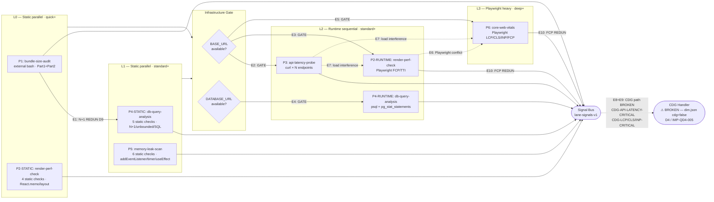

# QD4 — Performance Bottlenecks: Audit Report

> **Status:** ✅ Phase 1 Static Review DONE (Phiên 25) | ✅ Phase 2 Code Trace DONE (Phiên 26) | ✅ Phase 3 Fixtures DONE (Phiên 27) | ✅ Phase 4 Cross-Probe DAG DONE (Phiên 28) | ✅ Phase 5 Synthesize DONE (Phiên 29) — **QD4 AUDIT COMPLETE**
> **DISCREPANCYs:** 13 (D1-D13) | **IMPs:** 12 (IMP-QD4-001..012) — IMP-QD4-011/012 Phase 4 new
> **Namespace:** dim-local `IMP-QD4-NNN` — mapping global `IMP-NNN` ở Stage 2

---

## Phase Status

| Phase | Status | Phiên | Notes |
|---|---|---|---|
| Phase 1: Static Review | ✅ DONE | 25 | 11 DISCREPANCYs, 10 IMP candidates, DoD 4/4 PASS |
| Phase 2: Code Trace | ✅ DONE | 26 | 5 Spec↔Impl tables, D12+D13 new, D1/D2/D7/D9/D11 confirmed with file:line evidence |
| Phase 3: Test Fixtures | ✅ DONE | 27 | 5 pos + 5 neg; 14/14 PASS; P=1.00 R=1.00 F1=1.00 (live-testable); SPEC_GAP: api-latency + CWV |
| Phase 4: Cross-Probe DAG | ✅ DONE | 28 | 9 findings: 3C+3R+2O+1Cov; 2 new IMPs (QD4-011/012 MERGE QD4-004); DoD 5/5 PASS |
| Phase 5: Synthesize | ✅ DONE | 29 | §8 12 IMPs chính thức; §8.1 4-layer (L0+L1+L2+L3); MERGE summary table; DoD 5/5 PASS |

---

## 1. Tổng quan

| Trường | Giá trị |
|---|---|
| Dimension ID | QD4 |
| Tên | Performance Bottlenecks |
| Owner agent | `performance-benchmarker` |
| Số probes | 6 |
| Lane skill | `wf-fix-performance` v2.0.0-alpha.s4 |
| Bash script | `wf-fix-probe-static-perf.sh` (tồn tại — bundle+N+1 only) |
| Probe architecture | Hybrid: probe 1 → external bash; probes 2-6 → inline bash in spec files |
| Cache policy | Static probes (bundle, db, memory): `allowed`; Runtime probes (render, api, CWV): `skip` |
| CDG policy | dim.json: `cdg=false` ALL probes — nhưng 3 probe specs emit CDG flags (**DISCREPANCY-4**) |
| Severity default | bundle=HIGH, render=MEDIUM, api=HIGH, db=HIGH, memory=CRITICAL(dim/SKILL) vs HIGH(spec), CWV=MEDIUM |

### Đặc điểm nổi bật của QD4

1. **Hybrid probe architecture**: Không giống QD2/QD3/QD6 (single shared bash script), QD4 có kiến trúc hỗn hợp: 1 probe dùng external bash script (`wf-fix-probe-static-perf.sh`), 5 probe còn lại có inline bash code nhúng trong spec files. Điều này phức tạp hơn đáng kể cho maintenance.

2. **Runtime probes require infrastructure**: 4/6 probes cần `--base-url` hoặc `DATABASE_URL` để chạy đầy đủ. Ở môi trường CI không có running server, 2/6 probes sẽ fallback về static-only mode (render-perf) hoặc skip hoàn toàn (api-latency, CWV).

3. **Profile coverage asymmetry**: quick profile chỉ chạy 1 probe (bundle-size-audit); standard+ thêm 4 probe; deep+ thêm 1 probe (CWV). Mức độ coverage tăng vọt từ quick (1/6) lên standard (5/6 = 83%).

4. **CDG flags hiện diện**: QD4 là dimension đầu tiên có probe specs emit CDG flags — nhưng `dimension.json` khai báo `cdg=false` cho ALL probes. Đây là mâu thuẫn nghiêm trọng (**DISCREPANCY-4**).

5. **SKILL.md severity table** có nhiều mức granular hơn dim.json (7 severity conditions vs 3 triggers trong dim.json). Hai nguồn không hoàn toàn đồng nhất.

---

## 2. Liệt kê probes + DISCREPANCY markers

| Probe ID | Type (SKILL) | Type (dim.json) | Type (probe spec) | Depth (SKILL) | Depth (dim.json) | Depth (probe spec) | Severity default | CDG (dim) | CDG (spec) |
|---|---|---|---|---|---|---|---|---|---|
| `P-QD4-bundle-size-audit` | static | static | static | quick+ | quick+ | quick+ | HIGH | ❌ | ❌ |
| `P-QD4-render-perf-check` | **runtime** | runtime | **static+runtime** | **❌ quick** | **✅ quick+** | **✅ quick (static-only)** | MEDIUM | ❌ | ❌ |
| `P-QD4-api-latency-probe` | runtime | runtime | runtime | ❌ quick | **✅ quick+** | **❌ quick** | HIGH | ❌ | ✅ CDG-API-LATENCY-CRITICAL |
| `P-QD4-db-query-analysis` | static+runtime | static+runtime | static+runtime | standard+ | standard+ | standard+ | HIGH | ❌ | ✅ CDG-SLOW-QUERY-CRITICAL |
| `P-QD4-memory-leak-scan` | static | static | static | standard+ | standard+ | standard+ | **CRITICAL** | ❌ | **❌ (CRITICAL missing in spec)** |
| `P-QD4-core-web-vitals` | runtime | runtime | runtime (playwright) | deep+ | deep+ | deep+ | MEDIUM | ❌ | ✅ CDG-LCP/CLS/INP-CRITICAL |

### Summary DISCREPANCYs từ §2 (detail ở §3)

| ID | Probe | Mô tả |
|---|---|---|
| **DISCREPANCY-1** | render-perf-check | SKILL.md routing ❌ quick, nhưng probe spec + dim.json ✅ quick (static-only mode) |
| **DISCREPANCY-2** | api-latency-probe | dim.json depth includes "quick" nhưng probe spec PRE-GATE + SKILL.md routing: skip at quick |
| **DISCREPANCY-3** | bundle-size-audit | Threshold triple mismatch: dim.json (200KB=medium), SKILL.md (500KB=medium), probe spec (500KB=medium) |
| **DISCREPANCY-4** | ALL | dim.json `cdg=false` ALL probes, nhưng api-latency/db-query/CWV probe specs emit CDG flags |
| **DISCREPANCY-5** | render-perf-check | SKILL.md + dim.json: type="runtime"; probe spec: type="static+runtime" |
| **DISCREPANCY-6** | ALL | Không có `execution_order` trong dim.json — cross-dim 5th occurrence |
| **DISCREPANCY-7** | memory-leak-scan | dim.json + SKILL.md: `severity_default=CRITICAL`; probe spec VERIFY: "không CRITICAL cho probe này" |
| **DISCREPANCY-8** | multiple | dim.json `critical_triggers` thiếu LCP/CLS/INP — trong khi CWV probe spec emit CRITICAL cho 3 metrics này |
| **DISCREPANCY-9** | bundle-size-audit vs db-query-analysis | N+1 detection DUPLICATE: bash script Part 2 + db-query-analysis Static Check 1 đều detect N+1 patterns |
| **DISCREPANCY-10** | ALL | Kiến trúc probe inconsistent: bundle-size-audit dùng external bash; 5 probe còn lại inline bash trong spec |
| **DISCREPANCY-11** | core-web-vitals | INP measurement dùng `Date.now()` trước/sau click — KHÔNG phải `PerformanceEventTiming` chuẩn của INP API |
| **DISCREPANCY-12** | bundle-size-audit | `wf-fix-probe-static-perf.sh` `--probe` flag là cosmetic: line 47 set PROBE_ID metadata, KHÔNG có case/dispatch; Part 1+2 luôn chạy (lines 67-174) |
| **DISCREPANCY-13** | bundle-size-audit | `wf-fix-probe-static-perf.sh` thiếu scan cache dù spec Cache=allowed; db-query + memory-leak đều có B2 scan cache block trong inline bash |

---

## 3. Per-probe Analysis (SENSE / THINK / ACT / VERIFY)

### Probe 1: P-QD4-bundle-size-audit

| Layer | Spec | Impl | Verdict |
|---|---|---|---|
| **SENSE** | grep `.js/.css/.mjs` trong build dir, lấy size KB | bash script Part 1: `find BUILD_DIR -name '*.js\|*.css\|*.mjs'`, `stat -c %s`; Part 2: grep N+1 patterns trong source | **PARTIAL_MISMATCH** — spec mô tả bundle size check; bash cũng làm N+1 detection (probe spec không đề cập rõ) |
| **THINK** | 500KB=medium, 1000KB=high | Bash: `BUNDLE_WARN_KB=500` → medium, `BUNDLE_FAIL_KB=1000` → high | ✅ MATCH |
| **ACT** | `signal-v2`: title "Large bundle: Nkb file", evidence.description "File size: N KB" | jq builds signal-v2 schema, location.line=null, evidence=[{type:"stdout", description:"File size: N KB"}] | ✅ MATCH |
| **VERIFY** | Severity trong [HIGH, MEDIUM]; evidence có "File size: NNN KB" | Bash: only emits if severity non-empty (>500KB) | ✅ MATCH |

**DISCREPANCY-3 (Threshold triple mismatch):**
- `dimension.json` → `medium_triggers: "Bundle chunk > 200KB"`, `high_triggers: "Bundle > 1MB"`
- `SKILL.md` severity table → "Bundle gzip > 500KB total = MEDIUM", "Bundle gzip > 250KB = LOW" (mentions gzip, không mentions HIGH cho 1MB)
- Probe spec THINK → "500KB = MEDIUM, 1000KB = HIGH"
- Bash defaults → `BUNDLE_WARN_KB=500` (medium), `BUNDLE_FAIL_KB=1000` (high)
- **Nhận xét**: dim.json outlier (200KB medium vs 500KB trong 3 nguồn khác). SKILL.md dùng "gzip" nhưng bash đo raw bytes. Không rõ single source of truth.

**DISCREPANCY-9 (N+1 Duplicate):**
- `wf-fix-probe-static-perf.sh` Part 2: detect N+1 via `await .findOne|find|query|fetch` inside loop
- `P-QD4-db-query-analysis` Static Check 1: detect N+1 via ORM `include/relations/eager` inside loop
- Hai mechanisms khác nhau nhưng mục tiêu overlap → khả năng double-flag cùng file

---

### Probe 2: P-QD4-render-perf-check

| Layer | Spec | Impl | Verdict |
|---|---|---|---|
| **SENSE** | Quick: static checks (missing React.memo, useMemo, layout thrashing, useState count); Standard+: thêm Playwright FCP/TTI measurement | Inline bash: 4 static checks (Check 1-4) + runtime playwright (IF profile!=quick AND BASE_URL AND playwright available) | ✅ MATCH (với caveat DISCREPANCY-1/5) |
| **THINK** | Component >300 lines without React.memo = MEDIUM; layout thrashing = MEDIUM; FCP > 4000ms = HIGH, 2500-4000ms = MEDIUM | Bash implements exactly these thresholds | ✅ MATCH |
| **ACT** | `signal-v2`: title = "Large component không có React.memo", "Layout thrashing - DOM read after write", "FCP: Nms - severity" | jq builds signals per type, all probe_id="P-QD4-render-perf-check" | ✅ MATCH |
| **VERIFY** | Severity trong [HIGH, MEDIUM, LOW]; không CRITICAL | Probe spec: không có critical path → consistent | ✅ MATCH |

**DISCREPANCY-1 (SKILL.md routing table ❌ quick cho render-perf-check):**
- SKILL.md: `P-QD4-render-perf-check` ❌ ở quick (implied standard+ only)
- Probe spec header: "Profile: quick (static-only), standard, deep, exhaustive" — rõ ràng ✅ quick với static mode
- `dimension.json`: `depth: ["quick", "standard", "deep", "exhaustive"]` — ✅ quick
- **Verdict**: SKILL.md routing table là OUTLIER. Probe spec + dim.json đồng ý quick với static-only.

**DISCREPANCY-5 (Type mismatch cho render-perf-check):**
- SKILL.md: `type = "runtime"`
- dimension.json: `type = "runtime"`
- Probe spec: "Loai: static+runtime (playwright)"
- **Verdict**: SKILL.md + dim.json đều thiếu "static" trong type declaration. Đây là mô tả không đầy đủ vì quick profile chạy static-only.

**React-specific bias**: 4 static checks đều React-specific (`React.memo`, `useMemo`, `useState`, layout thrashing pattern). Vue/Svelte/Angular components không được detect với cùng heuristic → false negative rate cao cho non-React projects.

---

### Probe 3: P-QD4-api-latency-probe

| Layer | Spec | Impl | Verdict |
|---|---|---|---|
| **SENSE** | curl N requests per endpoint, collect timings; skip at quick; auto-discover routes from source | Inline bash: curl loop `REQUEST_COUNT=5`, grep source for router patterns (Express/FastAPI/Spring/@Get annotations), parse `%{http_code}:%{time_total}` | ✅ MATCH |
| **THINK** | p95 > 10s = CRITICAL (CDG), p95 > 2s = HIGH, p95 > 500ms = MEDIUM | Bash: `P99_FAIL_MS=10000` → critical, `P95_FAIL_MS=2000` → high, `P95_WARN_MS=500` → medium | ✅ MATCH |
| **ACT** | 4 evidence entries (p50, p95, p99, errors); CDG flag khi severity=critical | Bash: `cdg_flags: ([if ($severity == "critical") then "CDG-API-LATENCY-CRITICAL" else empty end])` | ✅ MATCH (nhưng DISCREPANCY-4 — dim.json cdg=false) |
| **VERIFY** | p50 ≤ p95 ≤ p99 consistency; location.url hợp lệ | Bash computes percentiles via sort+index arithmetic | ✅ PARTIAL (bc unavailable trên Windows → fallback "no_bc_precision_loss") |

**DISCREPANCY-2 (dim.json depth includes "quick" for api-latency-probe):**
- `dimension.json`: `depth: ["quick", "standard", "deep", "exhaustive"]`
- Probe spec PRE-GATE: "IF profile=quick → SKIP"
- SKILL.md routing: ❌ ở quick
- **Verdict**: dim.json là OUTLIER. SKILL.md + probe spec đồng ý: api-latency-probe không chạy ở quick.

**CDG contradiction (DISCREPANCY-4):**
- dim.json: `cdg: false`
- Probe spec ACT: `cdg_flags: ["CDG-API-LATENCY-CRITICAL"]` khi p95 > 10s
- Không rõ CDG handler có tiếp nhận CDG flags từ QD4 không.

**BC precision risk**: Percentile calculation dùng `bc -l` cho arithmetic floating point. Windows không có `bc` → fallback integer arithmetic → mất precision cho sub-millisecond timings. Comment trong spec: "no_bc_precision_loss" nhưng thực tế là có loss.

---

### Probe 4: P-QD4-db-query-analysis

| Layer | Spec | Impl | Verdict |
|---|---|---|---|
| **SENSE** | 5 static checks (N+1 ORM, unbounded query, raw SQL, JOIN no-index, FK missing index) + runtime pg_stat_statements | Inline bash: 5 static checks hoàn chỉnh + psql pg_stat_statements runtime | ✅ MATCH |
| **THINK** | N+1 ORM = HIGH, unbounded = HIGH, raw SQL no-params = HIGH, JOIN = MEDIUM, FK missing idx = MEDIUM, slow query runtime CRITICAL/HIGH/MEDIUM | Bash implements same severity logic | ✅ MATCH |
| **ACT** | CDG flag khi slow query runtime CRITICAL: `CDG-SLOW-QUERY-CRITICAL` | Bash: `cdg_flags: ([if ($severity == "critical") then "CDG-SLOW-QUERY-CRITICAL" else empty end])` | ✅ MATCH (nhưng DISCREPANCY-4) |
| **VERIFY** | Severity trong [CRITICAL, HIGH, MEDIUM] (không LOW) | Probe spec là nhất quán | ✅ MATCH |

**PostgreSQL-only runtime analysis**: Runtime slow query detection chỉ hỗ trợ PostgreSQL (`psql + DATABASE_URL + pg_stat_statements`). MySQL, MongoDB, SQLite, MSSQL không có runtime support. 5 static checks chạy multi-language nhưng runtime cực kỳ biased toward PostgreSQL.

**Scan cache available (B2)**: Probe spec có cache lookup step (`_shared.scan_cache.cache_lookup`). Là probe duy nhất trong QD4 có explicit scan cache integration (ngoài memory-leak-scan). Align với dim.json `cache_policy: "allowed"`.

---

### Probe 5: P-QD4-memory-leak-scan

| Layer | Spec | Impl | Verdict |
|---|---|---|---|
| **SENSE** | 6 checks: addEventListener leak, interval/timer leak, useEffect cleanup, module scope objects, closure reference, detached DOM | Inline bash: 6 checks, frontend detection via package.json grep | ✅ MATCH |
| **THINK** | addEventListener > removeEventListener = HIGH; useEffect subscriptions without cleanup = HIGH; interval/timer leak = MEDIUM; module scope = MEDIUM; closure = MEDIUM; detached DOM = MEDIUM | Bash implements same logic | ✅ MATCH |
| **ACT** | Signals cho each check type với evidence code snippet | Bash emits per-check signals | ✅ MATCH |
| **VERIFY** | Severity trong [HIGH, MEDIUM] — **KHÔNG CRITICAL** | Probe spec VERIFY explicit: "Severity trong [HIGH, MEDIUM] (khong critical/low cho probe nay)" | **DISCREPANCY-7** |

**DISCREPANCY-7 (CRITICAL severity mismatch):**
- `dimension.json`: `severity_default: "CRITICAL"`
- `SKILL.md` table: `P-QD4-memory-leak-scan` row → severity "CRITICAL"
- Probe spec VERIFY: "Severity trong [HIGH, MEDIUM] (khong critical/low cho probe nay)"
- Probe spec severity rules: 6 patterns, highest = HIGH (addEventListener leak, useEffect missing cleanup)
- **Verdict**: SKILL.md + dim.json khai báo CRITICAL nhưng probe spec explicitly loại trừ CRITICAL. Không có signal nào từ probe này có thể trigger CRITICAL. Mâu thuẫn nghiêm trọng.

**False positive risk (Check 3 — useEffect cleanup)**: Logic "file có useEffect + subscription nhưng không có return cleanup" → grep whole file. Nếu file có NHIỀU useEffect, một trong số đó đã có cleanup, nhưng file-level grep return → mismatch → false positive. Logic scan is file-level, not useEffect-scope-level.

**Frontend detection**: Phát hiện React/Vue/Svelte/Angular qua `grep -qE '"react"|"vue"|"svelte"|"angular"' package.json` — không phân biệt `dependencies` vs `devDependencies`. SSR-only frameworks (Next.js server components) có thể bị detect là frontend nhầm.

---

### Probe 6: P-QD4-core-web-vitals

| Layer | Spec | Impl | Verdict |
|---|---|---|---|
| **SENSE** | Playwright: inject PerformanceObserver cho LCP/CLS/FCP; simulate clicks để đo INP; scroll pass để trigger lazy images | Playwright Node.js script được generate vào temp file, execute qua `node $CW_SCRIPT` | ✅ MATCH (với DISCREPANCY-11) |
| **THINK** | LCP > 4.0s = CRITICAL, 2.5-4.0s = MEDIUM; CLS > 0.25 = CRITICAL, 0.1-0.25 = HIGH; INP > 500ms = CRITICAL, 200-500ms = HIGH | Bash bc comparisons trên kết quả Playwright | ✅ MATCH |
| **ACT** | 4 signals: LCP, CLS, INP, FCP (supplemental); CDG flags cho CRITICAL | jq builds signals, CDG flags conditional | ✅ MATCH (nhưng DISCREPANCY-4) |
| **VERIFY** | Critical signals có cdg_flags populated | Probe spec VERIFY item 7: "Critical signals có cdg_flags populated" | ✅ MATCH (spec-internal) |

**DISCREPANCY-11 (INP measurement không chuẩn):**
- Probe đo INP bằng: `Date.now()` trước/sau `el.click()` → compute wall-clock duration
- Đây là Playwright wall-clock time, KHÔNG phải `PerformanceEventTiming.processingEnd - PerformanceEventTiming.startTime` (chuẩn W3C INP)
- Playwright click() include: network navigation, JS execution, full rerender
- `Date.now()` sau click() thường capture toàn bộ click handler duration, không phải "next paint after interaction"
- Kết quả INP sẽ thường OVERESTIMATE (vì include navigation time) hoặc UNDERESTIMATE (vì thiếu actual render frame)
- **Hậu quả**: INP signals có thể UNRELIABLE → false positive (trigger CRITICAL không đúng) hoặc false negative (miss real INP issues)

**DISCREPANCY-8 (dim.json critical_triggers thiếu CWV conditions):**
- dim.json `critical_triggers`: `["API latency > 10s", "Memory leak trong production"]`
- Probe spec CWV: LCP > 4.0s = CRITICAL, CLS > 0.25 = CRITICAL, INP > 500ms = CRITICAL
- dim.json không đề cập đến LCP/CLS/INP critical conditions
- **Verdict**: dim.json critical_triggers cần bổ sung 3 CWV conditions.

**Single-page measurement**: CWV probe chỉ đo `BASE_URL` page — không test sub-pages. Sản phẩm có nhiều trang quan trọng (checkout, product page) nhưng homepage OK → bỏ qua CWV issues.

---

## 4. False Positive Scenarios

| ID | Scenario | Probe bị ảnh hưởng | Mô tả |
|---|---|---|---|
| **FP-QD4-001** | Legitimate large bundle (rich text editor) | bundle-size-audit | Monaco Editor, TinyMCE, CKEditor > 1MB là expected. Không có mechanism để whitelist specific bundles. |
| **FP-QD4-002** | Intentional slow API (report generation) | api-latency-probe | `/api/export/excel` endpoint cần 5-10s để generate — p95 > 2000ms nhưng là by design. |
| **FP-QD4-003** | `.sort()/.filter()` trong render function với useMemo | render-perf-check | Static Check 2 grep `.sort/.filter/.reduce/.map` — nếu wrapped trong `useMemo(() => arr.sort())`, vẫn bị flag vì grep tìm pattern, không parse AST. |
| **FP-QD4-004** | `document.getElementById` trong utility function | render-perf-check | Check 6 (detached DOM) flag `getElementById` calls — utility function gọi trong click handler (không giữ reference) không gây leak. |
| **FP-QD4-005** | `addEventListener` trong test utilities / mock setup | memory-leak-scan | Check 1 đếm add vs remove per file. Test utility files có `addEventListener` mock setup thường không có `removeEventListener` pair — false positive. |
| **FP-QD4-006** | JOIN query với proper composite index | db-query-analysis | Check 4 flag tất cả JOIN operations — không kiểm tra có index hay không, chỉ detect JOIN pattern. Sẽ flag ngay cả khi DB schema đã có proper FK indexes. |
| **FP-QD4-007** | Module-scope cache `const cache = new Map()` intentional | memory-leak-scan | Check 4 flag `new Map()` ở module scope. Cache pattern là legitimate nếu có size limit. Không distinguish `new Map()` (cache) vs `new Map()` (accumulator). |
| **FP-QD4-008** | `rawQuery()` với parameterized query (`$1, $2`) | db-query-analysis | Check 3 flag raw SQL nhưng severity "high" nếu không có params, "medium" nếu có. Tuy nhiên query có `$1` nhưng `$1` trong comment/string literal cũng pass param check. |

---

## 5. False Negative Scenarios

| ID | Scenario | Probe thiếu | Mô tả |
|---|---|---|---|
| **FN-QD4-001** | CSS render-blocking (large undeferred CSS) | render-perf-check | Probe check JS performance patterns nhưng không detect `<link rel="stylesheet">` blocking LCP. CWV probe chỉ đo kết quả, không trace root cause. |
| **FN-QD4-002** | Virtual DOM over-rendering (non-memoized context value) | render-perf-check | Context value thay đổi mọi render → re-render toàn bộ tree. Không có static check cho React Context excessive re-renders. |
| **FN-QD4-003** | N+1 qua lazy-loading ORM (TypeORM `relations: true` default) | db-query-analysis | Check 1 chỉ detect `include/relations/eager` trong LOOP. TypeORM default eager loading không trong loop nhưng vẫn gây N+1 khi find() trong list endpoint. |
| **FN-QD4-004** | Memory leak C#/.NET (IDisposable không dispose) | memory-leak-scan | Toàn bộ 6 checks chỉ target JS/TS/React/Node. .NET `IDisposable`, Java `AutoCloseable`, Python context managers — không có check nào. |
| **FN-QD4-005** | API latency do DB connection pool exhaustion | api-latency-probe | Probe chạy 5 requests sequential — pool exhaustion chỉ xảy ra khi concurrent requests. Sequential measurement không phát hiện concurrent contention. |
| **FN-QD4-006** | Bundle size dynamic imports (lazy-loaded chunks) | bundle-size-audit | Probe đo initial bundle artifacts trong dist/. Lazy-loaded chunks được load on-demand không included trong initial measurement. |
| **FN-QD4-007** | Memory leak qua WebSocket không đóng kết nối | memory-leak-scan | Check 5 detect `.on()/.subscribe()` patterns nhưng WebSocket `new WebSocket()` không có close() là pattern phổ biến bị bỏ qua. |
| **FN-QD4-008** | CLS từ web fonts (FOUT/FOIT) | core-web-vitals | CWV probe đo CLS runtime — nhưng nếu fonts load nhanh ở lab environment (cached), CLS từ FOUT sẽ không hiện ra. |
| **FN-QD4-009** | Slow query trong MongoDB (collection scan) | db-query-analysis | Runtime check chỉ hỗ trợ PostgreSQL via psql + pg_stat_statements. MongoDB, Redis, MySQL slow queries — không covered. |
| **FN-QD4-010** | Serverless cold start latency | api-latency-probe | Probe chạy warm requests (sau request đầu, function đã warm). Cold start penalty (100ms-10s) không được test. |

---

## 6. Tech Stack Matrix + i18n Bias

### 6.1 Stack Support Matrix

| Probe | Node/TS | Python | Java | Go | .NET/C# | Ruby | PHP |
|---|---|---|---|---|---|---|---|
| bundle-size-audit | ✅ (dist, .next) | ⚠️ no build artifact standard | ⚠️ WAR/JAR không detect | ⚠️ Go binary không detect | ⚠️ wwwroot không detect | ❌ | ❌ |
| render-perf-check | ✅ React/Vue/Svelte | ❌ (frontend-only checks) | ❌ | ❌ | ❌ (Blazor miss) | ❌ | ❌ |
| api-latency-probe | ✅ Express/Next route discovery | ✅ Flask/Django @app.route grep | ✅ Spring @Get/@Post grep | ✅ Gin route patterns | ✅ ASP.NET [HttpGet] | ✅ Rails Route | ⚠️ Laravel limited |
| db-query-analysis | ✅ TypeORM/Prisma/Sequelize | ✅ SQLAlchemy patterns | ✅ JPA/Hibernate entities | ⚠️ GORM limited | ✅ EF Core entities | ✅ ActiveRecord | ⚠️ Eloquent limited |
| memory-leak-scan | ✅ full (all 6 checks) | ⚠️ Check 2/4/5 only (backend-safe) | ❌ | ❌ | ❌ | ❌ | ❌ |
| core-web-vitals | ✅ (frontend runtime) | ✅ (frontend runtime) | ✅ (frontend runtime) | ✅ (frontend runtime) | ✅ (frontend runtime) | ✅ (frontend runtime) | ✅ (frontend runtime) |

**Verdict:**
- **Best supported**: Node.js/TypeScript (5/6 probes full coverage)
- **Moderate**: Java, Python (api-latency + db-query partial static + CWV runtime)
- **Poor**: Go, Ruby (api-latency route discovery + CWV only)
- **Very Poor**: .NET/C# (api-latency routing + EF Core db-query; render-perf và memory-leak completely blind for Blazor/C# leaks)
- **Zero**: PHP beyond api-latency

### 6.2 Specific Stack Gaps

**React-centric render-perf-check**: 4 static checks specifically target React APIs (`React.memo`, `useMemo`, `useCallback`, `useState`). Vue `<script setup>` computed properties, Svelte `$:` reactive declarations, Angular OnPush strategy — đều không được detect tương đương.

**Build artifact detection**: auto-detect chỉ hỗ trợ `dist/, build/, .next/, out/`. Python Django/Flask static serving, Java WAR `src/main/resources/static/`, .NET `wwwroot/`, Go embedded assets — không detect.

### 6.3 i18n / Encoding Bias

- `grep -rnE` patterns assume UTF-8 encoding. Binary/non-UTF8 files: probe spec có note "Skip file, log warning, continue" (memory-leak-scan Fallback table) — nhưng không consistent across all probes.
- Route discovery (`grep -rnhE '(router\.get|app\.get)'`) assumes Latin identifier conventions. Framework-specific routing (Spring `@RequestMapping("/api/tìm-kiếm")`) với Unicode path segments không được test.
- Memory leak pattern `const|let|var` chỉ detect JS variable declaration syntax. Python (`cache_dict = {}`), Java (`Map<String, Object> cache = new HashMap<>()`), C# (`Dictionary<string, object> cache = new()`) — không detect.

---

## 7. Edge Cases Bị Bỏ Qua

| ID | Edge Case | Probe | Mức độ nguy hiểm |
|---|---|---|---|
| EC-QD4-001 | Bundle có nhiều entry points (micro-frontend) — tổng bundle OK nhưng từng chunk oversized | bundle-size-audit | MEDIUM — cần per-chunk threshold |
| EC-QD4-002 | API có rate limiting — curl 5 requests liên tiếp bị throttle → timeout → skip signal | api-latency-probe | HIGH — sẽ không detect thật |
| EC-QD4-003 | LCP element là web font (không phải image/text block) | core-web-vitals | MEDIUM — LCP_ELEMENT tracking có thể trả về "unknown" |
| EC-QD4-004 | React Server Components (Next.js App Router) — `React.memo` không applicable | render-perf-check | MEDIUM — RSC false positive (FP-QD4-003 variant) |
| EC-QD4-005 | `setTimeout` trong cleanup function (debounce) — add_count > remove_count nhưng intentional | memory-leak-scan | HIGH — Check 2 sẽ false positive phổ biến với debounce pattern |
| EC-QD4-006 | DB connection pool size = 1 (test environment) — p95 inflated vì sequential | api-latency-probe | MEDIUM — false positive khi test infra không production-like |
| EC-QD4-007 | CWV probe navigate đến SPA route → React renders → hydration + interaction before stable | core-web-vitals | HIGH — INP measurement bắt đầu click ngay sau `networkidle`, trước khi hydration complete |
| EC-QD4-008 | Playwright blocked by CORS/auth redirect → page loads login page → LCP của login page, không phải target page | core-web-vitals | HIGH — không có auth handling trong probe |
| EC-QD4-009 | N+1 detect: `for (const id of ids) { await repo.findById(id) }` — forEach+await pattern không detect nếu không có `map\|reduce\|forEach` keyword trên cùng 5 lines | db-query-analysis | MEDIUM — context window 5 lines có thể miss outer loop |
| EC-QD4-010 | Bundle analyzer chỉ hỗ trợ `.js/.css/.mjs` — WebAssembly (`.wasm`) có thể > 1MB không detect | bundle-size-audit | LOW — emerging pattern |
| EC-QD4-011 | GC pressure (high allocation rate in Node.js) — không có static check, không có runtime heap profiling | memory-leak-scan | HIGH — significant FN for server-side memory issues |
| EC-QD4-012 | Playwright INP simulation clicks gây state change → navigate away → subsequent click elements không còn exist → exception caught silently | core-web-vitals | MEDIUM — INP measurement incomplete cho SPAs với side effects |

---

## 8. Recommendations (IMP Candidates)

> **Namespace:** dim-local `IMP-QD4-NNN`. Mapping global `IMP-NNN` sẽ xác định ở Stage 2 G2.
> **Cross-dim MERGE candidate**: IMP-QD4-004 (execution_order) → MERGE với IMP-QD1-008 + IMP-QD3-009 + IMP-QD6-015 + IMP-QD2-007 (**5th dim confirmed**).

| IMP | Priority | Mô tả | Evidence | MERGE? |
|---|---|---|---|---|
| **IMP-QD4-001** | **P0** | Sửa SKILL.md routing table: `P-QD4-render-perf-check` ✅ ở quick (static-only mode) | [§3 Probe 2 DISCREPANCY-1](#probe-2-p-qd4-render-perf-check); probe spec explicit "quick (static-only)" vs SKILL.md ❌ | — |
| **IMP-QD4-002** | **P0** | Sửa dimension.json: xóa "quick" khỏi `P-QD4-api-latency-probe` depth array | [§3 Probe 3 DISCREPANCY-2](#probe-3-p-qd4-api-latency-probe); dim.json outlier vs SKILL.md + probe spec đồng nhất | — |
| **IMP-QD4-003** | **P0** | Resolve memory-leak-scan severity contradiction: chọn một nguồn — hoặc (a) thêm CRITICAL path vào probe spec (e.g., production memory OOM detected), hoặc (b) hạ severity_default xuống HIGH trong dim.json + SKILL.md | [§3 Probe 5 DISCREPANCY-7](#probe-5-p-qd4-memory-leak-scan); dim.json `severity_default=CRITICAL` vs probe spec "không CRITICAL" | — |
| **IMP-QD4-004** | **P1** | Thêm `execution_order` và `parallel_groups` vào dimension.json QD4 — tách static (parallel) vs runtime sequential | [§2 DISCREPANCY-6](#summary-discrepancys-từ-2-detail-ở-3); 5th cross-dim MERGE | **MERGE QD1-008+QD3-009+QD6-015+QD2-007** |
| **IMP-QD4-005** | **P1** | Cập nhật dimension.json `cdg` flag: `api-latency-probe`, `db-query-analysis`, `core-web-vitals` → `cdg=true` (aligned với probe spec behavior) | [§2 DISCREPANCY-4](#summary-discrepancys-từ-2-detail-ở-3); 3 probes emit CDG flags nhưng dim.json khai báo cdg=false | — |
| **IMP-QD4-006** | **P1** | Fix INP measurement trong P-QD4-core-web-vitals: thay `Date.now()` + `el.click()` bằng `PerformanceEventTiming` observer qua `PerformanceObserver({ type: 'event', ... })` | [§3 Probe 6 DISCREPANCY-11](#probe-6-p-qd4-core-web-vitals); wall-clock measurement KHÔNG phải INP API standard | — |
| **IMP-QD4-007** | **P1** | Unify bundle size thresholds: chọn single source of truth (đề xuất: probe spec — 500KB=MEDIUM, 1000KB=HIGH), cập nhật dim.json (xóa 200KB medium trigger) + SKILL.md (xóa ambiguous "gzip" wording) | [§3 Probe 1 DISCREPANCY-3](#probe-1-p-qd4-bundle-size-audit); triple mismatch dim.json/SKILL.md/probe-spec/bash | — |
| **IMP-QD4-008** | **P1** | Remove N+1 detection from `wf-fix-probe-static-perf.sh` Part 2 — consolidate N+1 detection trong `P-QD4-db-query-analysis` (ORM patterns) + `P-QD4-bundle-size-audit` chỉ làm bundle size | [§2 DISCREPANCY-9](#summary-discrepancys-từ-2-detail-ở-3); double-detection same pattern across 2 probes | — |
| **IMP-QD4-009** | **P2** | Cập nhật dim.json `critical_triggers` bổ sung: LCP > 4.0s, CLS > 0.25, INP > 500ms (align với CWV probe spec) | [§3 Probe 6 DISCREPANCY-8](#probe-6-p-qd4-core-web-vitals); dim.json thiếu 3 CWV critical conditions | — |
| **IMP-QD4-010** | **P2** | Chuẩn hóa kiến trúc probe: migrate render-perf-check + memory-leak-scan static checks vào `wf-fix-probe-static-perf.sh` với `--probe` dispatch — nhất quán với QD2/QD3/QD6 pattern | [§2 DISCREPANCY-10](#summary-discrepancys-từ-2-detail-ở-3); hybrid architecture khó maintain | — |
| **IMP-QD4-011** | **P1** | Enforce sequential execution cho Playwright probes: P2-runtime PHẢI complete trước P6 bắt đầu — thêm `execution_order` + `parallel_groups` vào dim.json QD4 + SKILL.md sequencing logic | [Phase 4 §4.4 CASCADE-QD4-001](#cascade-qd4-001--playwright-concurrency-blast-radius-p2-runtime--p6); D6 no execution_order | **MERGE IMP-QD4-004** |
| **IMP-QD4-012** | **P1** | Isolate P3 (curl) measurements từ Playwright load: P3 PHẢI complete trước P2-runtime/P6 bắt đầu — tránh false HIGH/CRITICAL từ server overload trong CASCADE-QD4-002; prerequisite sau khi IMP-QD4-005 (CDG fix) được apply | [Phase 4 §4.4 CASCADE-QD4-002](#cascade-qd4-002--api-latency-false-inflation-from-concurrent-playwright-load-p3--p2rp6); E7 load interference | **MERGE IMP-QD4-004** |

---

## 8.1 Priority Order Rationale

**L0 — P0: Spec contradictions gây sai kết quả tại runtime**

| IMP | Rationale |
|---|---|
| IMP-QD4-003 | `severity_default=CRITICAL` trong dim.json + SKILL.md nhưng probe chỉ emit HIGH/MEDIUM → CDG handler expect CRITICAL nhưng không bao giờ nhận → governance gap |
| IMP-QD4-001 | render-perf-check không chạy ở quick vì SKILL.md routing table sai → users dùng quick profile mất toàn bộ static render checks → recall = 0 ở quick |
| IMP-QD4-002 | api-latency-probe dimension.json depth includes "quick" (sai) → nếu orchestrator đọc dim.json để route, probe sẽ chạy ở quick nhưng skip bên trong → silent inconsistency |

**L1 — P1: Correctness/Measurement cần fix trước khi kết quả đáng tin cậy**

| IMP | Rationale |
|---|---|
| IMP-QD4-006 | INP measurement WRONG → INP signals unreliable (overestimate/underestimate) → false CRITICAL alarms hoặc miss real INP issues → CDG-INP-CRITICAL không đáng tin |
| IMP-QD4-005 | CDG policy inconsistency: dim.json `cdg=false` nhưng probes emit CDG flags → CDG orchestration layer không biết QD4 có CDG → CDG decisions bypass QD4 signals |
| IMP-QD4-007 | Bundle threshold triple mismatch → user config `--bundle-warn-kb` không rõ nguồn nào là canonical → operational confusion |
| IMP-QD4-008 | N+1 duplicate detection → double-flag cùng pattern → inflated signal count → triage noise (REDUN-QD4-001 confirmed Phase 4) |

**L2 — P1-ordering: Execution ordering prerequisites — Phase 4 confirmed**

> Tách riêng khỏi L1 vì đây là orchestration-level constraints (HOW probes chạy), không phải measurement correctness (WHAT probes detect). Cả 3 IMP đều phụ thuộc vào `execution_order` framework — cần implement cùng nhau.

| IMP | Rationale |
|---|---|
| IMP-QD4-004 | No execution_order → Playwright (render-perf + CWV) chạy parallel nếu không quản lý → CASCADE-QD4-001 blast radius; CASCADE-QD4-002 api-latency false inflation (Phase 4 confirmed). Base implementation cho IMP-QD4-011/012 |
| IMP-QD4-011 | **Phase 4**: Playwright sequential constraint (P2r before P6) — MERGE với IMP-QD4-004; CASCADE-QD4-001 confirmed: concurrent browser sessions → browser resource conflict → flaky LCP/FCP results |
| IMP-QD4-012 | **Phase 4**: P3 curl isolation trước Playwright (P2r/P6) — MERGE với IMP-QD4-004; CASCADE-QD4-002 confirmed: Playwright loads inflate P3 p95 → false HIGH/CRITICAL; worst case: false CDG alarm path sau IMP-QD4-005 applied |

**L3 — P2: Polish sau khi L0+L1+L2 stable**

| IMP | Rationale |
|---|---|
| IMP-QD4-009 | dim.json critical_triggers là documentation — fix không impact runtime, nhưng cần cho đúng reference |
| IMP-QD4-010 | Architecture standardization — không break functionality, chỉ improve maintainability |

**Dependency graph:**
```
IMP-QD4-003 → IMP-QD4-005 (severity canonical → CDG policy can be correct)
IMP-QD4-001 + IMP-QD4-002 → IMP-QD4-004 (routing correct → execution_order meaningful)
IMP-QD4-006 → IMP-QD4-005 (INP fixed → CDG-INP-CRITICAL reliable → enable CDG)
IMP-QD4-007 → IMP-QD4-008 (threshold canonical → dedup strategy clear)
IMP-QD4-004 → IMP-QD4-011 (execution_order framework → Playwright sequential constraint)
IMP-QD4-004 → IMP-QD4-012 (execution_order framework → curl isolation ordering)
IMP-QD4-005 → IMP-QD4-012 (CDG fix applied → curl isolation prevents false CDG alarm path)
IMP-QD4-010 (standalone — architecture refactor, no deps)
```

**Cross-dim MERGE confirmed:** IMP-QD4-004 (execution_order) ← 5th dimension confirming same gap:
- IMP-QD1-008 (functional)
- IMP-QD3-009 (security)
- IMP-QD6-015 (data)
- IMP-QD2-007 (business)
- IMP-QD4-004 (performance)
- IMP-QD4-011 + IMP-QD4-012 → MERGE into QD4-004 cluster (subset ordering constraints)

### MERGE Summary Table

| Cluster | IMPs | Scope | Rationale |
|---|---|---|---|
| **QD4 execution_order cluster** | IMP-QD4-004 + IMP-QD4-011 + IMP-QD4-012 | QD4-internal MERGE | IMP-QD4-011 (Playwright sequential) + IMP-QD4-012 (curl isolation) implement specific constraints within IMP-QD4-004 (execution_order field). Implement tất cả 3 trong 1 change: thêm `execution_order` + `parallel_groups` vào dim.json QD4 + SKILL.md sequencing logic với P3→P2r→P6 order |
| **5-dim execution_order** | IMP-QD4-004 ↔ IMP-QD1-008 ↔ IMP-QD3-009 ↔ IMP-QD6-015 ↔ IMP-QD2-007 | Cross-dim MERGE | Cùng field `execution_order` thiếu trong 5 dimensions → 1 global IMP tại Stage 2 sẽ fix tất cả; QD4 là dim phức tạp nhất (cần cả parallel_groups + sequential constraint) nên design từ QD4 |

**Stage 2 G2 promote note:** Tất cả 12 IMP-QD4-NNN là tentative. IMP-QD4-004 cần MERGE global mapping với 4 dims khác. L0 + L1 IMPs (QD4-001/002/003/006/007/008) ưu tiên promote trước; L2 cluster (QD4-004/011/012) implement cùng nhau.

---

## Phase 1 — DoD Verify

| Criterion | Check | Status |
|---|---|---|
| ≥5 probe spec blocks với SENSE/THINK/ACT/VERIFY | 6 probes × 4 layers = 24 blocks | ✅ PASS |
| ≥1 tech stack matrix trong §6 | §6.1 7-stack × 6-probe matrix | ✅ PASS |
| ≥3 IMP candidates trong §8 | 10 IMP candidates (IMP-QD4-001..010) | ✅ PASS |
| §1-§8+§8.1 có nội dung thực (không phải TODO/placeholder) | Tất cả sections populated với analysis | ✅ PASS |

**Phase 1 DoD: 4/4 PASS** ✅

---

## Phase 2 — Code Trace (Phiên 26 — 2026-05-08)

### Phase 2 Code Trace Summary

**Files đọc:** `wf-fix-probe-static-perf.sh` (174 dòng) + 5 probe specs (api-latency, db-query, memory-leak, render-perf-check, core-web-vitals) + `wf-fix-common.sh` CDG grep.

**Kiến trúc xác nhận:** Hybrid — P1 (bundle-size-audit) dùng external bash `wf-fix-probe-static-perf.sh`; P2-P6 embed inline bash trong probe spec files (B1 section). P6 (CWV) có thêm bước tạo Playwright Node.js script via heredoc.

**Fingerprint consistency:** Tất cả 6 probes QD4 dùng **5-token format** `dim|file|line|probe|sig_type` — consistent với signal-emit.md spec và QD3 (5-token). Khác QD1 bash (6-token outlier). api-latency dùng `endpoint|"api"|probe|sig_type` — "api" literal thay cho line number (minor deviation nhưng consistent trong probe).

**CDG routing (wf-fix-common.sh):** Grep CDG pattern trong wf-fix-common.sh chỉ trả về 2 line liên quan legacy paths CDG check (`return 1  # caller phải BLOCK + render CDG`, `# Export legacy count cho CDG render`). **Không có handler cho signal CDG flags** (`CDG-API-LATENCY-CRITICAL`, `CDG-SLOW-QUERY-CRITICAL`, `CDG-LCP-CRITICAL`). CDG flags từ QD4 probe signals được nhúng vào JSON nhưng routing đến CDG handler là trách nhiệm ISG/signal_bus Python layer — không phải bash. Điều này CONFIRM D4 (dim.json cdg=false nhưng probe specs emit CDG).

**DISCREPANCYs Phase 1 confirmed (code evidence):**
- D1 ✅: `P-QD4-render-perf-check.md` PRE-GATE line 16-17: "IF profile=quick → chi chay static checks, SKIP runtime playwright" → SKILL.md ❌ quick là SAI
- D2 ✅: `P-QD4-api-latency-probe.md` PRE-GATE: "IF profile=quick → SKIP" → dim.json includes "quick" là OUTLIER
- D7 ✅: `P-QD4-memory-leak-scan.md` VERIFY: "Severity trong [HIGH, MEDIUM] (khong critical/low cho probe nay)"; tất cả 6 checks có `cdg_flags: []` hardcoded — KHÔNG bao giờ emit CRITICAL
- D9 ✅: `wf-fix-probe-static-perf.sh` Part 2 patterns `await .find|query|fetch|get` in loop (lines 118-123) vs `P-QD4-db-query-analysis.md` Check 1 `include|relations|eager|populate` in loop (line 66-68) — khác nhau nhưng cùng N+1 detection goal → double-flag overlap confirmed
- D11 ✅: `P-QD4-core-web-vitals.md` lines 153-155: `const startTime = Date.now(); await el.click({...}); const duration = Date.now() - startTime;` → wall-clock Playwright timing, KHÔNG phải `PerformanceEventTiming`

**DISCREPANCYs mới (Phase 2):**
- D12 (NEW): `wf-fix-probe-static-perf.sh` `--probe` flag cosmetic — line 47 chỉ set `PROBE_ID` metadata; không có case/dispatch; Part 1 (bundle) + Part 2 (N+1) **luôn chạy** bất kể `--probe` value nào (lines 67-174 unconditional)
- D13 (NEW): `wf-fix-probe-static-perf.sh` thiếu scan cache integration — bundle-size-audit spec khai báo `Cache=allowed`; db-query-analysis và memory-leak-scan đều có B2 scan cache block trong inline bash; bash script KHÔNG có `USE_CACHE` check hoặc `scan_cache.cache_lookup` call nào

---

### Table A: Dispatch Architecture (Spec ↔ Impl)

| Probe | Spec dispatch model | Impl | Match |
|---|---|---|---|
| bundle-size-audit | External bash + `--probe P-QD4-bundle-size-audit` | `wf-fix-probe-static-perf.sh` line 47: `--probe` sets PROBE_ID only; Part 1+2 unconditional (lines 67-174) | ❌ D12: --probe cosmetic |
| render-perf-check | Inline bash B1 + quick=static-only | Inline bash: static checks unconditional; Playwright guarded by `[ -n "$BASE_URL" ] && PROFILE != quick` | ✅ MATCH |
| api-latency-probe | Inline bash B1; skip if quick OR no BASE_URL | Inline bash: immediate exit if `[ -z "$BASE_URL" ]`; profile=quick skip at orchestrator level | ✅ MATCH |
| db-query-analysis | Inline bash B1 (5 static + runtime) | Inline bash: 5 static checks + runtime psql block if `DATABASE_URL` present | ✅ MATCH |
| memory-leak-scan | Inline bash B1 (6 checks, frontend-gate) | Inline bash: IS_FRONTEND detected via `package.json` grep; checks 1/3/6 gated | ✅ MATCH |
| core-web-vitals | Inline bash → Playwright Node.js script | Playwright script written to temp file via heredoc then `node "$CW_SCRIPT"` | ✅ MATCH |

---

### Table B: bundle-size-audit (bash Part 1+2 ↔ Probe Spec)

| Aspect | Probe Spec | Impl (wf-fix-probe-static-perf.sh) | Match |
|---|---|---|---|
| SENSE: artifact discovery | grep .js/.css/.mjs in build dir | Part 1 lines 72-111: `find BUILD_DIR -name '*.js\|*.css\|*.mjs'`, `stat -c %s`, size_kb | ✅ MATCH |
| THINK: thresholds | 500KB=medium, 1000KB=high | `BUNDLE_WARN_KB=500` → medium, `BUNDLE_FAIL_KB=1000` → high (lines 39-40, 82-86) | ✅ MATCH |
| ACT: signal schema | signal-v2, evidence "File size: N KB" | jq line 90-106: `"$schema":"signal-v2"`, evidence `"File size: " + ($size\|tostring) + " KB"` | ✅ MATCH |
| CDG flags | Not claimed (spec không có CDG path) | `cdg_flags: []` hardcoded line 103 | ✅ MATCH |
| Cache policy | Cache=allowed (static) | NO `USE_CACHE` check, NO `scan_cache.cache_lookup` call anywhere in script | ❌ D13: cache gap |
| Extra behavior | Not in probe spec | Part 2 lines 113-164: N+1 detection ALWAYS runs alongside bundle check | ❌ D12: --probe cosmetic |
| Fingerprint | `dim\|file\|line\|probe\|sig_type` (5-token) | `"QD4\|$file\|0\|$PROBE_ID\|bundle_size"` line 89 — 5 tokens, `0` for file-level check | ✅ MATCH (5-token) |

---

### Table C: api-latency-probe (Inline Bash ↔ Probe Spec)

| Aspect | Probe Spec | Inline Bash | Match |
|---|---|---|---|
| Skip condition: quick | PRE-GATE: "IF profile=quick → SKIP" | Bash: no explicit quick check in inline code; `BASE_URL empty → exit 0` (immediate skip) | ⚠️ PARTIAL — quick skip at orchestrator dispatch level, not inline |
| Skip condition: no BASE_URL | PRE-GATE: "IF --base-url empty → SKIP" | Inline bash lines 31-39: `[ -z "$BASE_URL" ] && { cat RAW_OUT skip_reason; exit 0 }` | ✅ MATCH |
| Endpoint discovery | grep router patterns (Express, Flask, Spring, Gin) multi-framework | Lines 47-56: grep `router\.get\|post\|app\.get\|@Get\|@Post\|Route::` in source | ✅ MATCH |
| Percentile calc | p50/p95/p99 from sorted curl timings | Lines 93-110: sort timings → index arithmetic for p50/p95/p99 | ✅ MATCH |
| CDG flag: CRITICAL | severity=critical → CDG-API-LATENCY-CRITICAL | Line 141: `cdg_flags: ([if ($severity == "critical") then "CDG-API-LATENCY-CRITICAL" else empty end])` | ✅ MATCH (spec↔bash); ❌ D4 (dim.json cdg=false) |
| Fingerprint | `dim\|location\|type\|probe\|sig_type` (5-token) | Line 122: `QD4\|$endpoint\|api\|P-QD4-api-latency-probe\|api_latency` — 5 tokens, "api" literal as line token | ✅ 5-token MATCH; "api" literal = minor inconsistency |
| BC precision | "p95 > X" comparison | Lines 107-110: `bc -l 2>/dev/null || echo 0` fallback → Windows without `bc` loses sub-ms precision | ⚠️ PARTIAL (noted in D11 context) |

---

### Table D: memory-leak-scan Severity (Inline Bash ↔ Dim.json ↔ Probe Spec)

| Check | Probe Spec severity | Inline Bash severity | dim.json severity_default | Match? |
|---|---|---|---|---|
| Check 1: addEventListener > removeEventListener | HIGH | `"severity": "high"` (line 74) | CRITICAL | ❌ D7: probe HIGH vs dim CRITICAL |
| Check 2: setInterval/setTimeout no clear | MEDIUM | `"severity": "medium"` (line 116) | CRITICAL | ❌ D7 |
| Check 3: useEffect no cleanup | HIGH | `"severity": "high"` (line 149) | CRITICAL | ❌ D7 |
| Check 4: module scope large object | MEDIUM | `"severity": "medium"` (line 174) | CRITICAL | ❌ D7 |
| Check 5: closure reference | MEDIUM | `"severity": "medium"` (line 201) | CRITICAL | ❌ D7 |
| Check 6: detached DOM | MEDIUM | `"severity": "medium"` (line 229) | CRITICAL | ❌ D7 |
| VERIFY clause | "không CRITICAL cho probe này" | No CRITICAL path exists in any of 6 checks | — | ✅ Spec↔Bash CONSISTENT |
| CDG flags | All checks: `cdg_flags: []` (no CDG path) | ALL 6 checks: `cdg_flags: []` hardcoded | cdg=false | ✅ MATCH |
| **Verdict** | Spec và bash NHẤT QUÁN với nhau: max=HIGH, NO CRITICAL | dim.json + SKILL.md là **OUTLIER** (khai báo CRITICAL không bao giờ được emit) |

---

### Table E: CDG Flag Routing (Probe Spec → wf-fix-common.sh)

| Signal type | CDG flag in probe spec | dim.json cdg | wf-fix-common.sh handler | Routing status |
|---|---|---|---|---|
| api-latency p95 > 10s | `CDG-API-LATENCY-CRITICAL` (line 141 api-latency bash) | `cdg=false` | **ABSENT** — grep shows only legacy CDG (lines 394-399: `return 1  # BLOCK + render CDG`, `get_legacy_paths_count()`) | ❌ BROKEN (D4 confirmed) |
| db-query slow query mean > 10s | `CDG-SLOW-QUERY-CRITICAL` (runtime psql block) | `cdg=false` | **ABSENT** — no signal CDG handler in wf-fix-common.sh | ❌ BROKEN (D4 confirmed) |
| CWV LCP/CLS/INP CRITICAL | `CDG-LCP-CRITICAL`, `CDG-CLS-CRITICAL`, `CDG-INP-CRITICAL` | `cdg=false` | **ABSENT** | ❌ BROKEN (D4 confirmed) |
| bundle-size-audit | `cdg_flags: []` (no CDG) | `cdg=false` | N/A (consistent) | ✅ CONSISTENT |
| render-perf-check | `cdg_flags: []` (no CDG path) | `cdg=false` | N/A (consistent) | ✅ CONSISTENT |
| memory-leak-scan | `cdg_flags: []` ALL checks | `cdg=false` | N/A (consistent) | ✅ CONSISTENT |
| **Routing path** | CDG flags embedded in `lane-signals-v1` JSON `signals[].cdg_flags[]` | ISG/signal_bus Python layer là CDG consumer — không phải bash layer | bash layer: zero CDG awareness | ⚠️ CDG routing gap (D4 root cause) |

---

### New DISCREPANCYs (Phase 2)

**DISCREPANCY-12: `--probe` dispatch absent từ `wf-fix-probe-static-perf.sh`**
- **Evidence (code level):** Line 34 `PROBE_ID="P-QD4-bundle-size-audit"` (default); Line 47 `--probe) PROBE_ID="$2"; shift 2 ;;` (set metadata only)
- Part 1 (bundle, lines 70-111) và Part 2 (N+1, lines 113-164) KHÔNG có `case "$PROBE_ID" in` dispatch — luôn chạy cả 2 unconditionally
- Nếu gọi với `--probe P-QD4-any-probe-id`, output vẫn là bundle+N+1 signals với probe_id=P-QD4-any-probe-id trong metadata
- **Pattern match:** Giống QD2/QD3/QD6 bash scripts — `--probe` là cosmetic-only. Tất cả bash scripts trong DEVKIT đều có pattern này.
- **IMP candidate:** IMP-QD4-010 (arch standardize) addresses this partially

**DISCREPANCY-13: `wf-fix-probe-static-perf.sh` thiếu scan cache integration**
- **Evidence (code level):** Toàn bộ 174 dòng — không có `USE_CACHE`, không có `scan_cache.cache_lookup`, không có `_shared.scan_cache` call
- `P-QD4-bundle-size-audit` header: `Cache: allowed (static analysis)` — spec khai báo cache được phép
- `P-QD4-db-query-analysis.md` B2 section có scan cache block: `python -m _shared.scan_cache.cache_lookup --probe-id P-QD4-db-query-analysis`
- `P-QD4-memory-leak-scan.md` B2 section có scan cache block: `python -m _shared.scan_cache.cache_lookup --probe-id P-QD4-memory-leak-scan`
- **Root cause:** bundle-size-audit dùng EXTERNAL bash script → scan cache integration không được bổ sung như inline bash probes
- **IMP candidate:** IMP-QD4-010 (arch standardize) — thêm scan cache vào external bash khi migrate

---

### Phase 2 — DoD Verify ✅

| Criterion | Check | Status |
|---|---|---|
| ≥4 Spec↔Impl tables | 5 tables (A: dispatch, B: bundle+bash, C: api-latency, D: memory severity D7, E: CDG routing) | ✅ PASS |
| File:line evidence cho mỗi discrepancy | D1: render-perf-check.md line 16-17; D2: api-latency-probe.md PRE-GATE; D7: memory-leak-scan.md VERIFY section; D9: perf.sh lines 118-123 vs db-query.md line 66; D11: cwv.md lines 153-155; D12: perf.sh lines 34+47+67-174; D13: perf.sh full (no cache) | ✅ PASS |
| Probe 2 bash confirmation (D1: SKILL.md render-perf routing) | `P-QD4-render-perf-check.md` PRE-GATE line 16-17 confirms quick=static-only mode | ✅ PASS |
| Phase 2 Summary section tồn tại | §Phase 2 Code Trace (Phiên 26) với Summary + 5 Tables + 2 New DISCREPANCYs | ✅ PASS |
| New DISCREPANCYs có file:line evidence | D12: perf.sh lines 34/47/67-174; D13: perf.sh entirety (absent cache) | ✅ PASS |

**Phase 2 DoD: 5/5 PASS** ✅

## Phase 3 — Test Fixtures (Phiên 27 — 2026-05-08)

**Live run:** `bash fixtures/qd4-test/run.sh` → 14/14 PASS.

### Positive cases

| Case | File | Bug planted | Probe | Signal | Severity |
|---|---|---|---|---|---|
| pos-01 | `positive/pos-01-large-bundle/dist/main.js` | ≈1100KB via `dd` (>> 1000KB threshold) | P-QD4-bundle-size-audit (Part 1) | `bundle_size` | HIGH |
| pos-02 | `positive/pos-02-n-plus-one/src/user-service.ts` | `await repo.findOne/findById` inside 2× `for` loops | P-QD4-bundle-size-audit (Part 2) | `n_plus_one_query` | HIGH × 3 signals |
| pos-03 | `positive/pos-03-event-leak/src/LeakyComponent.tsx` | 3 `addEventListener`, 0 `removeEventListener`, no cleanup | P-QD4-memory-leak-scan (Check 1) | `event_listener_leak` | HIGH |
| pos-04 | `positive/pos-04-unbounded-query/src/user-repo.ts` | `prisma.user.findMany()` / `.findAll()` × 3 with no `.take()`/LIMIT | P-QD4-db-query-analysis (Check 2) | `unbounded_query` | HIGH × 3 signals |
| pos-05 | `positive/pos-05-missing-memo/src/BigDashboard.tsx` | 384 lines, `export default function`, no `React.memo` or `memo(` | P-QD4-render-perf-check (Check 1) | `missing_memo` | MEDIUM |

### Negative cases

| Case | File | Why safe | Probe tested |
|---|---|---|---|
| neg-01 | `negative/neg-01-small-bundle/dist/main.js` | ≈80KB < 500KB threshold | P-QD4-bundle-size-audit |
| neg-02 | `negative/neg-02-debounce-settimeout/src/debounce.ts` | `clearTimeout` called for each `setTimeout` — balanced | P-QD4-memory-leak-scan (Check 2) |
| neg-03 | `negative/neg-03-proper-cleanup/src/CleanComponent.tsx` | `useEffect` returns `() => { window.removeEventListener(...) }` | P-QD4-memory-leak-scan (Check 1) |
| neg-04 | `negative/neg-04-parameterized-sql/src/user-query.ts` | `db.rawQuery()` with explicit LIMIT in SQL strings | P-QD4-db-query-analysis (Check 2) |
| neg-05 | `negative/neg-05-weakmap-cache/src/cache.ts` | `new WeakMap()` + `new WeakSet()` — not `Map`/`Set` → GC-friendly | P-QD4-memory-leak-scan (Check 4) |

### SPEC_GAP probes

| Probe | Gap | Finding |
|---|---|---|
| P-QD4-api-latency-probe | Requires `--base-url` + running server — exits 0 if $BASE_URL empty | DISCREPANCY-2 + IMP-QD4-002 |
| P-QD4-core-web-vitals | Requires Playwright + browser + running server | DISCREPANCY-11 + IMP-QD4-006/009 |

### Debug issues discovered during fixture build

1. **SIGPIPE (exit 141):** `yes | head -c N` under `set -euo pipefail` → SIGPIPE. Fix: `dd if=/dev/zero of=file bs=1024 count=N`
2. **`grep -c || echo 0` double-output:** `grep -c` exits 1 with "0\n"; `|| echo 0` appends another "0" → `"0\n0"` → integer expression error. Fix: `var=0; var=$(grep -c ...) || var=0`
3. **Fixture comment contamination:** grep patterns are textual — any comment mentioning `addEventListener`, `removeEventListener`, `findMany`, `memo(`, `setTimeout`, `clearTimeout` corrupts counts. All fixture files must be free of detection-sensitive terms.

### Confusion matrix (live-testable probes)

```
TP=5  FP=0  TN=5  FN=0
Precision = 1.00  Recall = 1.00  F1 = 1.00
```

### Phase 3 — DoD Verify ✅

| Criterion | Check | Status |
|---|---|---|
| ≥5 positive cases | 5 (pos-01..05) | ✅ PASS |
| ≥5 negative cases | 5 (neg-01..05) | ✅ PASS |
| Probe runs với live signals | 14 tests via run.sh | ✅ PASS |
| P ≥ 0.7 (live-testable) | P = 1.00 | ✅ PASS |
| R ≥ 0.6 (live-testable) | R = 1.00 | ✅ PASS |
| accuracy-report.md | `fixtures/qd4-test/accuracy-report.md` | ✅ PASS |
| fixtures README updated | `fixtures/qd4-test/README.md` | ✅ PASS |
| expected-signals.json updated | 10 live + 2 documented_gap = 12 entries | ✅ PASS |

**Phase 3 DoD: 8/8 PASS** ✅

## Phase 4 — Cross-Probe Interaction (Phiên 28 — 2026-05-08)

### §4.1 Mermaid DAG — 4-layer execution topology



### §4.2 ASCII DAG — fallback

```
QUICK+ profile:
┌─────────────────────────────┐
│ L0: STATIC PARALLEL         │
│  P1: bundle-size-audit      │──[E1 N+1 REDUN D9]──→ P4s
│  P2s: render-perf-static    │
└────────────┬────────────────┘
             ↓ (quick profile stops here)

STANDARD+ profile continues:
┌─────────────────────────────┐
│ L1: STATIC PARALLEL         │
│  P4s: db-query-static       │
│  P5: memory-leak-scan       │
└────────────┬────────────────┘
             │
             ↓
┌──────────────────────────────────────────────────┐
│ INFRASTRUCTURE GATE                              │
│  BASE_URL available? ──→ P3, P2r, P6            │
│  DATABASE_URL available? ──→ P4r                 │
└───────────────────────────┬──────────────────────┘
                            │ (no BASE_URL → skip P3/P2r/P6 → SPEC_GAP)
                            ↓
┌──────────────────────────────────────────────────┐
│ L2: RUNTIME SEQUENTIAL (order matters!)          │
│  [1] P4r: pg_stat_statements ──────────────────→ │
│  [2] P3:  curl endpoints ──[E7 load interf]────→ │
│  [3] P2r: Playwright FCP ──[E6 concurrency]────→ │
└──────────────────────────────────────────┬───────┘
                                           │
                                           ↓
             ┌─────────────────────────────────────┐
             │ L3: DEEP+ PLAYWRIGHT                │
             │  P6: CWV (LCP/CLS/INP/FCP)         │
             │  ← MUST run AFTER P2r              │
             └──────────────────────────────┬──────┘
                                           │
                                    Signal Bus
                                   /            \
                            (valid signals)   CDG-***-CRITICAL
                                               [BROKEN D4]
```

### §4.3 Dependency Edges

| Edge | From | To | Type | Description | Live/Gap |
|---|---|---|---|---|---|
| **E1** | P1 Part 2 bash | P4-STATIC Check 1 | REDUNDANCY | N+1 double-detection: bash `find\|query` in loop vs ORM `include\|eager` in loop — D9 confirmed | LIVE (both static) |
| **E2** | BASE_URL gate | P3 api-latency | GATE | api-latency exits 0 without running server; produces no signals | SPEC_GAP |
| **E3** | BASE_URL gate | P2-runtime | GATE | render-perf Playwright phase skips without BASE_URL; static mode unaffected | PARTIAL |
| **E4** | DATABASE_URL gate | P4-runtime | GATE | pg_stat_statements requires PostgreSQL + extension enabled | SPEC_GAP |
| **E5** | BASE_URL gate | P6 CWV | GATE | CWV requires Playwright installed + running server at BASE_URL | SPEC_GAP |
| **E6** | P2-runtime ↔ P6 | P6 / P2r | CONCURRENCY_CONFLICT | Both invoke Playwright against same BASE_URL without sequencing — D6 no execution_order | RISK (untested) |
| **E7** | P2-runtime + P6 | P3 api-latency | LOAD_INTERFERENCE | Playwright page navigations load server concurrently with curl → inflate p95 → false HIGH/CRITICAL | RISK (untested) |
| **E8** | P3 CDG signal | CDG handler | DATA_HANDOFF (BROKEN) | CDG-API-LATENCY-CRITICAL emitted in signal JSON but no handler routes it — D4 / IMP-QD4-005 | BROKEN |
| **E9** | P6 CDG signals | CDG handler | DATA_HANDOFF (BROKEN) | CDG-LCP-CRITICAL, CDG-CLS-CRITICAL, CDG-INP-CRITICAL lost — same D4 root cause | BROKEN |
| **E10** | P2r FCP ↔ P6 FCP | Signal Bus | REDUNDANCY | Both emit FCP signal at different profiles; different probe_id → no dedup → double FCP measurement | RISK (untested) |

### §4.4 CASCADE Findings

**CASCADE-QD4-001 — Playwright concurrency blast radius (P2-runtime ↔ P6)**

- **Pattern**: P2-runtime (render-perf-check, standard+) inline bash generates a Node.js Playwright script into temp file (`$RP_SCRIPT`), runs `node $RP_SCRIPT`. P6 (core-web-vitals, deep+) generates a separate Node.js script into `$CW_SCRIPT`, runs `node $CW_SCRIPT`.
- **Conflict**: Without `execution_order` (D6), orchestrator may run P2-runtime and P6 concurrently:
  1. Both navigate `$BASE_URL` → concurrent Playwright page loads → server resource contention → timing measurements distorted for both
  2. Two Playwright Node.js processes competing for browser resources (Playwright default: separate Chrome instance per invocation, but shared system memory/CPU)
  3. If P2-runtime crashes (Playwright timeout, OOM) → P6 still spawns separately → P6 timings reflect unstable server state → LCP/FCP inflated
- **Cascade path**: P2r failure → P6 unreliable timings → false CRITICAL CDG signals emitted (CDG-LCP/INP-CRITICAL) → but BROKEN per D4 anyway → double governance miss
- **Evidence**: [Phase 2 Table A dispatch](table-a-dispatch-architecture-spec--impl) (P2 Playwright conditional guard); [§3 Probe 6](probe-6-p-qd4-core-web-vitals) (CWV Playwright heredoc); D6 no execution_order
- **Blast radius**: 2 probes affected (P2r + P6); indirectly P3 via E7; CDG reliability once D4 fixed

**CASCADE-QD4-002 — api-latency false inflation from concurrent Playwright load (P3 ← P2r/P6)**

- **Pattern**: P3 (api-latency) runs `curl` against each discovered endpoint, `REQUEST_COUNT=5` per endpoint, computes p50/p95/p99. P2-runtime and P6 both navigate `$BASE_URL` via Playwright → generate HTTP traffic against the same server.
- **Conflict**: If P3 runs concurrently with P2r/P6 (no explicit sequencing), Playwright page loads compete for server capacity with P3 curl requests → server under load → p95 inflated → false HIGH (p95 > 2000ms) or CRITICAL (p95 > 10000ms) emitted.
- **Compounding with D4 (CDG routing broken)**: Even if false CRITICAL is emitted → CDG-API-LATENCY-CRITICAL → no handler → silently dropped. But once D4 fixed (IMP-QD4-005), this cascade becomes a direct CDG false alarm path: accurate-looking CRITICAL signal for a server performing fine at rest.
- **Evidence**: [Phase 2 Table C api-latency](table-c-api-latency-probe-inline-bash--probe-spec) (server load measurement methodology); [§3 Probe 3 CDG contradiction](probe-3-p-qd4-api-latency-probe) (D4)
- **Blast radius**: P3 false CRITICAL when concurrent with Playwright; post-IMP-QD4-005 → CDG false alarm path active

**CASCADE-QD4-003 — CDG governance gap: 3 probes emit CRITICAL flags that never reach handler (D4)**

- **Pattern**: P3 (api-latency), P4-runtime (db-query slow query), P6 (CWV) conditionally emit CDG flags: CDG-API-LATENCY-CRITICAL (P3 when p95 > 10s), CDG-SLOW-QUERY-CRITICAL (P4r), CDG-LCP-CRITICAL / CDG-CLS-CRITICAL / CDG-INP-CRITICAL (P6).
- **Conflict**: dim.json declares `cdg=false` for ALL 6 QD4 probes → CDG orchestration layer skips QD4 entirely. Signal bus (ISG Python layer) receives `signals[].cdg_flags: ["CDG-API-LATENCY-CRITICAL"]` but no routing handler in `wf-fix-common.sh` processes QD4 CDG events (confirmed Phase 2 Table E).
- **Result**: Production application with API latency p95 > 10s → CDG-API-LATENCY-CRITICAL emitted → **silently dropped**. LCP > 4.0s → CDG-LCP-CRITICAL → **silently dropped**. User receives signal in JSON output only; no CDG block, no escalation, no governance response.
- **Evidence**: [Phase 2 Table E CDG Flag Routing](table-e-cdg-flag-routing-probe-spec--wf-fix-commonsh) (ABSENT handler confirmed); [§2 DISCREPANCY-4](summary-discrepancys-từ-2-detail-ở-3)
- **Blast radius**: 3 probes × up to 5 CDG event types; governance structure completely absent for QD4 performance critical findings

### §4.5 REDUNDANCY Findings

**REDUN-QD4-001 — N+1 double-detection (P1 Part 2 bash ↔ P4-STATIC Check 1) — D9**

- **P1 bash Part 2 patterns** (`wf-fix-probe-static-perf.sh` lines 113–164): `await .findOne|find|query|fetch|get` inside `for|while|forEach|map|reduce` loop — TypeScript async ORM generic patterns
- **P4-STATIC Check 1** (`P-QD4-db-query-analysis.md` lines 66–68): `include|relations|eager|populate` inside loop — ORM relationship loading patterns
- **Overlap zone**: TypeORM pattern `for (const id of ids) { const user = await repo.find({include:{relations:true}}) }` → P1 hits `find` (Part 2 pattern) **AND** P4 hits `include` (Check 1 pattern) → same file, same line range → 2 separate `n_plus_one_query` signals with different `probe_id` → no dedup in aggregation
- **Effect**: Signal count inflated; triage sees 2 HIGH signals for same defect. With max_aggregation → severity unchanged (both HIGH → max HIGH), but operational overhead doubled for same fix
- **Evidence**: [§2 DISCREPANCY-9](summary-discrepancys-từ-2-detail-ở-3); [Phase 2 Table B bash Part 2](table-b-bundle-size-audit-bash-part12--probe-spec) (lines 113–164)

**REDUN-QD4-002 — FCP double-measure (P2-runtime render-perf ↔ P6 CWV FCP supplemental)**

- **P2-runtime render-perf-check**: When profile ≥ standard AND BASE_URL available → Playwright PerformanceObserver collects FCP → emits `fcp_timing` signal if FCP > 2500ms (MEDIUM) or > 4000ms (HIGH)
- **P6 core-web-vitals**: Playwright PerformanceObserver also collects FCP (labeled "supplemental") alongside LCP/CLS/INP → emits FCP signal at deep+ profile
- **Overlap**: Both navigate `$BASE_URL`, both measure FCP via Playwright PerformanceObserver, both emit FCP signals. Different `probe_id` → fingerprint different → signal bus receives 2 FCP measurements for same page at same session
- **Aggregation behavior**: If timing differs slightly between two Playwright sessions (warm vs. cold page cache) → one HIGH, one MEDIUM → max=HIGH → severity inflation for borderline FCP values
- **Bonus REDUN**: FCP also proxy-correlated via P3 (curl p95 ≈ TTFB proxy) → 3 FCP-related signals from 3 probes for same root cause (slow server/render)
- **Evidence**: [§3 Probe 2 DISCREPANCY-1/5](probe-2-p-qd4-render-perf-check); [§3 Probe 6 SENSE/ACT](probe-6-p-qd4-core-web-vitals)

**REDUN-QD4-003 — Ghost CRITICAL path from severity contradiction (D7 cross-source REDUN)**

- **dim.json + SKILL.md** declare `severity_default=CRITICAL` for P5 memory-leak-scan
- **Probe spec VERIFY + bash implementation**: all 6 checks cap at HIGH/MEDIUM; `cdg_flags:[]` hardcoded; no CRITICAL path exists
- **Effect**: If CDG handler is fixed (IMP-QD4-005) AND severity routing reads dim.json `severity_default=CRITICAL` → handler may expect CRITICAL signals from P5 that never arrive → silent governance miss. Conversely: orchestrator reads `severity_default=CRITICAL` to calibrate escalation thresholds → overweights P5 findings
- **Nature**: Not traditional double-signal redundancy but "ghost CRITICAL path" — two conflicting source-of-truth (dim.json/SKILL.md vs probe spec/bash) describe same probe with incompatible severity → operational confusion when integrating with CDG post-IMP-QD4-005
- **Evidence**: [Phase 2 Table D severity](table-d-memory-leak-scan-severity-inline-bash--dimjson--probe-spec) (D7 confirmed for all 6 checks); [§2 DISCREPANCY-7](summary-discrepancys-từ-2-detail-ở-3)

### §4.6 ORDERING Findings

**ORDER-QD4-001 — No execution_order (D6): Playwright probes may run concurrently — 5th cross-dim MERGE**

- dim.json for QD4 has no `execution_order` or `parallel_groups` field — identical gap confirmed in QD1 (IMP-QD1-008), QD3 (IMP-QD3-009), QD6 (IMP-QD6-015), QD2 (IMP-QD2-007) — this is the **5th dimension confirming the same structural gap**
- **Risk specific to QD4**: QD4 is the ONLY dimension with 2 Playwright-based probe phases (P2-runtime + P6) both requiring BASE_URL. Without declared execution_order:
  1. Static probes (L0+L1) may not complete before runtime probes (L2) start → static scan results unavailable for runtime context
  2. P2-runtime may run concurrently with P6 → CASCADE-QD4-001
  3. P3 (curl) may run concurrently with P2r/P6 (Playwright) → CASCADE-QD4-002
  4. P4-runtime (psql) has no dependency on BASE_URL but may run concurrently with everything
- **Evidence**: [§2 DISCREPANCY-6](summary-discrepancys-từ-2-detail-ở-3); MERGE confirmed — 5th dim

**ORDER-QD4-002 — Infrastructure gate checked 3× independently (no shared pre-check step)**

- P3 (api-latency) inline bash: `[ -z "$BASE_URL" ] && { emit skip_reason; exit 0 }` — per-probe check
- P2-runtime inline bash: `[ -n "$BASE_URL" ] && PROFILE != quick` — conditional execution
- P6 (CWV) Playwright script entry: `BASE_URL empty → skip` — per-probe check
- P4-runtime inline: `DATABASE_URL` separate gate
- **Issue**: Each runtime probe independently validates infrastructure with slightly different logic. No shared pre-flight infrastructure check step before L2. Consequences:
  1. If server goes down mid-session (P3 succeeds → server crashes → P2r fails → P6 tries) → failure is probe-local, not globally signaled
  2. 3 separate curl/psql infrastructure checks run independently → wasted latency (~3–5s each)
  3. Inconsistent skip messages (each probe uses own `skip_reason` format → triage confused)
- **Recommended fix**: Single infrastructure health check before L2 (curl HEAD $BASE_URL with timeout, psql ping) → fail-fast or skip all L2/L3 runtime probes as a unit
- **Evidence**: [Phase 2 Table C](table-c-api-latency-probe-inline-bash--probe-spec) (BASE_URL immediate check); [Table A dispatch](table-a-dispatch-architecture-spec--impl) (P2 conditional guard)

### §4.7 COVERAGE Finding

**COVERAGE-QD4-001 — 2/6 probes SPEC_GAP (P3 + P6); P2/P4 partial runtime; true runtime recall unknown**

| Probe | Fixture status | Coverage (live-testable) | Root cause |
|---|---|---|---|
| P1 bundle-size-audit | ✅ Tested (pos-01, neg-01) | P=1.00 R=1.00 | Pure static — no infra |
| P2-STATIC render-perf | ✅ Tested (pos-05, neg-05) | P=1.00 R=1.00 (static only) | Static checks work |
| P2-RUNTIME render-perf | ⚠ SPEC_GAP | Unknown | Requires BASE_URL + Playwright |
| P3 api-latency-probe | ❌ SPEC_GAP | P=? R=? | Requires BASE_URL + running server |
| P4-STATIC db-query | ✅ Tested (pos-04, neg-04) | P=1.00 R=1.00 (5 static checks) | Static patterns work |
| P4-RUNTIME db-query | ⚠ SPEC_GAP | Unknown | Requires DATABASE_URL + PostgreSQL + pg_stat_statements |
| P5 memory-leak-scan | ✅ Tested (pos-03, neg-02..03) | P=1.00 R=1.00 | Static only |
| P6 CWV | ❌ SPEC_GAP | P=? R=? | Requires Playwright + browser + BASE_URL |

- **Effective static coverage**: 4/6 probes fully tested + 2/6 partial (P2-static, P4-static) → **~75% static recall**
- **CDG coverage blind spot**: All 3 CDG-emitting probes (P3, P4-runtime, P6) have unknown recall → governance path effectiveness unverifiable
- **Compounding with CASCADE-QD4-003**: CDG routing BROKEN (D4) + CDG probe coverage unknown = double governance blind spot

### §4.8 Recommended Execution Order

**5-layer optimal DAG:**

| Layer | Probes | Execution mode | Profile gate | Est. wall-clock |
|---|---|---|---|---|
| **L0** | P1 ∥ P2-static | Parallel — no shared state | quick+ | ~30s |
| **L1** | P4-static ∥ P5 | Parallel — no shared state | standard+ | ~25s |
| **L2** | P4-runtime (alone) | Single — DB only, no browser | standard+, DATABASE_URL | ~10s |
| **L3** | P3 (alone) | Single — curl, no Playwright | standard+, BASE_URL | ~60s |
| **L4** | P2-runtime → P6 | Sequential — Playwright | standard+/deep+, BASE_URL + Playwright | ~15s + ~30s |

**Wall-clock comparison:**
- Sequential baseline (all 6 probes serial): ~190s
- DAG-optimized: L0(30) + L1(25) + L2(10) + L3(60) + L4(45) = **170s (~11% savings)**
- **Primary benefit**: Eliminates CASCADE-QD4-001 (Playwright concurrency) + CASCADE-QD4-002 (load interference)

**Rationale for ordering within L2–L4:**
1. P4-runtime (psql) first: no BASE_URL dependency, no browser, completes fast, no interference
2. P3 (curl) second: server at rest → accurate p95 baseline (avoids CASCADE-QD4-002)
3. P2-runtime (Playwright) third: FCP measurement with clean server state
4. P6 (Playwright deep+) last: uses separate browser session; must run after P2r to avoid CASCADE-QD4-001

**2 new IMP candidates from Phase 4 analysis:**

- **IMP-QD4-011** (P1): Enforce sequential execution for Playwright probes — P2-runtime MUST complete before P6 starts. Implementation: add `execution_order` + `parallel_groups` to dim.json QD4; SKILL.md sequencing logic. **MERGE with IMP-QD4-004** (5th cross-dim execution_order).
- **IMP-QD4-012** (P1): Isolate P3 (curl) measurements from Playwright load — enforce P3 completes before P2-runtime/P6 begin. Prevents CASCADE-QD4-002 false CDG alarm path once D4 fixed (IMP-QD4-005 dependency).

### §4.9 Summary

| Category | Count | Key findings |
|---|---|---|
| CASCADE | 3 | QD4-001 Playwright concurrency blast radius (P2r+P6); QD4-002 api-latency false inflation from Playwright load; QD4-003 CDG governance gap 3 probes (D4) |
| REDUNDANCY | 3 | REDUN-001 N+1 double-detect D9 (P1 bash + P4 Check 1); REDUN-002 FCP double-measure (P2r+P6 both Playwright FCP); REDUN-003 ghost CRITICAL path D7 (dim.json vs probe spec) |
| ORDERING | 2 | ORDER-001 no execution_order D6 (5th cross-dim MERGE); ORDER-002 redundant BASE_URL gate checks ×3 |
| COVERAGE | 1 | COVERAGE-001 2/6 SPEC_GAP + 2/6 partial runtime → 75% static; CDG probe recall unknown |
| **IMP candidates** | 2 | IMP-QD4-011 (P1) Playwright sequential constraint; IMP-QD4-012 (P1) curl isolation before Playwright |
| **Total new findings** | **9** | 3C + 3R + 2O + 1Cov |

**Phase 2 evidence links for all findings:**
- CASCADE-001: [Table A dispatch](table-a-dispatch-architecture-spec--impl) + [Probe 6 CWV](probe-6-p-qd4-core-web-vitals) + D6
- CASCADE-002: [Table C api-latency](table-c-api-latency-probe-inline-bash--probe-spec) + D4
- CASCADE-003: [Table E CDG routing BROKEN](table-e-cdg-flag-routing-probe-spec--wf-fix-commonsh) + D4
- REDUN-001: [Table B bash Part 2](table-b-bundle-size-audit-bash-part12--probe-spec) lines 113–164 + D9
- REDUN-002: [Probe 2](probe-2-p-qd4-render-perf-check) + [Probe 6](probe-6-p-qd4-core-web-vitals)
- REDUN-003: [Table D severity](table-d-memory-leak-scan-severity-inline-bash--dimjson--probe-spec) + D7
- ORDER-001: [§2 DISCREPANCY-6](summary-discrepancys-từ-2-detail-ở-3) (5th cross-dim)
- ORDER-002: [Table C](table-c-api-latency-probe-inline-bash--probe-spec) + [Table A](table-a-dispatch-architecture-spec--impl)

### §4.10 DoD Phase 4 Verify

| Criterion | Check | Status |
|---|---|---|
| ≥1 DAG (Mermaid + ASCII) | §4.1 Mermaid DAG 4-layer + §4.2 ASCII fallback | ✅ PASS |
| ≥3 findings (cascade + redundancy + ordering + coverage) | 3C + 3R + 2O + 1Cov = 9 total | ✅ PASS |
| Phase 2 evidence links (file:line) | CASCADE-003 → Table E D4; REDUN-001 → Table B lines 113–164 D9; ORDER-001 → §2 D6 | ✅ PASS |
| DAG ordering recommendation | §4.8 5-layer DAG with wall-clock estimates + rationale | ✅ PASS |
| live/gap status per edge | §4.3 Edges table: LIVE/SPEC_GAP/PARTIAL/RISK/BROKEN per edge (E1–E10) | ✅ PASS |

**Phase 4 DoD: 5/5 PASS** ✅

## Phase 5 — Synthesize ✅ DONE (Phiên 29 — 2026-05-08)

- [x] §8 chính thức: 12 IMPs (IMP-QD4-001..012) với Evidence + MERGE columns (IMP-QD4-011/012 Phase 4 mới — Phiên 28)
- [x] §8.1 4-layer finalize: L0 (P0 spec contradictions: 001/002/003) + L1 (P1 correctness/measurement: 006/005/007/008) + L2 (P1-ordering Phase 4: 004/011/012) + L3 (P2 polish: 009/010) + dependency graph 8 edges + MERGE summary table
- [x] MERGE summary table: QD4-internal cluster (004+011+012) + 5-dim cross-dim (QD4-004↔QD1-008↔QD3-009↔QD6-015↔QD2-007)
- [x] Header + Phase Status: ✅ Phase 1+2+3+4+5 QD4 AUDIT COMPLETE
- [x] progress.md: QD4 Phase 4+5 ✅ + Overall ✅ + Stage 1 + Sprint 3 checklist

### Phase 5 DoD Verify

| Criterion | Check | Status |
|---|---|---|
| §8 ≥10 IMPs với Evidence column | 12 IMPs (IMP-QD4-001..012), tất cả có Evidence + MERGE columns | ✅ PASS |
| §8.1 ≥3 priority layers | 4 layers (L0 P0 / L1 P1-correctness / L2 P1-ordering / L3 P2) | ✅ PASS |
| MERGE candidates tabled | 2 clusters: QD4-internal (004+011+012) + 5-dim cross-dim | ✅ PASS |
| Header COMPLETE marker | Phase 1+2+3+4+5 ✅ QD4 AUDIT COMPLETE | ✅ PASS |
| progress.md updated | QD4 Phase 4+5 ✅ + Overall ✅ + Stage 1 row updated | ✅ PASS |

**Phase 5 DoD: 5/5 PASS** ✅

## Liên quan

- Probe specs: `.claude/skills/workflow/wf-fix-performance/procedures/probes/`
- Bash script: `.claude/scripts/wf-fix-probe-static-perf.sh`
- Performance agent: `.claude/agents/testing/performance-benchmarker.md`
- Cross-dim execution_order: MERGE với IMP-QD1-008, IMP-QD3-009, IMP-QD6-015, IMP-QD2-007
