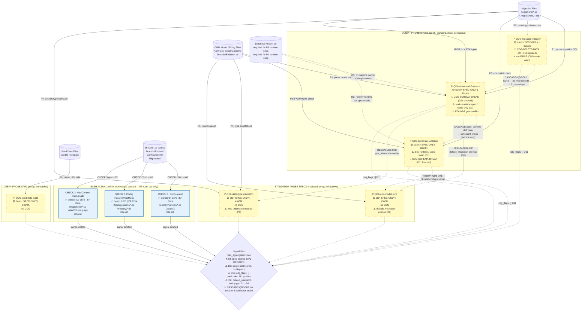

# QD6 — Data Integrity + Schema Drift: Audit Report

> **Status:** Phase 1 ✅ Phase 2 ✅ Phase 3 ✅ Phase 4 ✅ Phase 5 ✅ — **QD6 AUDIT COMPLETE**
> **Sprint:** Stage 1 Sprint 2 — QD6 Phase 5 Synthesize (Phiên 19, 2026-05-08)
> **Namespace:** dim-local `IMP-QD6-NNN` (Stage 2 G2 sẽ map sang global `IMP-NNN`)

---

## §Phase Status

| Phase | Status | Session | Notes |
|---|---|---|---|
| Phase 1 Static Review | ✅ DONE | Phiên 15 (2026-05-08) | 8 DISCREPANCYs, 8 IMPs, §1-§8.1 populated |
| Phase 2 Code Trace | ✅ DONE | Phiên 16 (2026-05-08) | bash script read; D9/D10/D11 new; all 6 probes IMPL-REFUTED; cdg_flags hardcoded empty confirmed |
| Phase 3 Test Fixture | ✅ DONE | Phiên 17 (2026-05-08) | 5 pos + 5 neg EF Core .cs fixtures; P=1.00 R=1.00 live_detectable; exhaustive 5/5; 0 FP; DoD PASS |
| Phase 4 Cross-Probe DAG | ✅ DONE | Phiên 18 (2026-05-08) | 9 findings (3C+3R+2O+1Cov); 4 new IMPs (QD6-012..015); 2 MERGE candidates; DoD 5/5 PASS |
| Phase 5 Synthesize | ✅ DONE | Phiên 19 (2026-05-08) | §8 expanded 11→15 IMPs (promote QD6-012..015 + Phase 4 evidence links); §8.1 4-layer revised; 3 MERGE clusters confirmed. QD6 COMPLETE. |

---

## 1. Tổng quan

| Trường | Giá trị |
|---|---|
| Dimension ID | QD6 |
| Tên | Data Integrity & Resilience |
| Owner agent | `dba`, `database-engineer` |
| Số probes | 6 |
| Profiles | quick (3 probes), standard (5 probes), deep/exhaustive (ALL 6) |
| Lane skill | `wf-fix-data` v2.0.0-alpha.s4 |
| Bash script | `wf-fix-probe-static-data.sh` (1 shared script cho tất cả 6 probes) |
| CDG triggers | CDG-SCHEMA-BREAK (schema-drift, constraint), CDG-DELETE-DATA (migration drop) |
| Cache policy | Static probes: opt-in allowed; Runtime (constraint-violation): skip |

### Architectural DISCREPANCY classes (Phase 1 pre-seed — verify Phase 2)

| ID | Loại | Mô tả | Severity | File:line evidence |
|---|---|---|---|---|
| DISCREPANCY-1 | Type mismatch | P-QD6-constraint-violation spec: `Loai: static` vs dimension.json: `"type": "runtime"` | HIGH | `P-QD6-constraint-violation.md:7` vs `dimension.json:51` |
| DISCREPANCY-2 | Cache mismatch | P-QD6-constraint-violation spec: `Cache: allowed` vs dimension.json: `"cache_policy": "skip"` | HIGH | `P-QD6-constraint-violation.md:9` vs `dimension.json:57` |
| DISCREPANCY-3 | Runtime unimplemented | P-QD6-schema-drift-detect spec: `Loai: static` vs dimension.json: `"type": "static+runtime"`. Probe THINK/SENSE chỉ có bash static — runtime DB comparison chưa implement | MEDIUM | `P-QD6-schema-drift-detect.md:7` vs `dimension.json:16` |
| DISCREPANCY-4 | Required input gap | dimension.json constraint-violation: `required_inputs: ["base_url", "code"]` nhưng probe bash invocation không có `--base-url` | HIGH | `dimension.json:58` vs `P-QD6-constraint-violation.md:24-34` |
| DISCREPANCY-5 | CDG-DELETE-DATA not wired | SKILL.md severity rules: CDG-DELETE-DATA cho migration drop column, nhưng `P-QD6-migration-integrity` có `cdg: false` trong dimension.json. Probe spec phát CDG-SECURITY-LIVE không, chỉ emit destructive_op signal | CRITICAL | `SKILL.md:116` vs `dimension.json:44` |
| DISCREPANCY-6 | Cross-probe signal collision | P-QD6-schema-drift-detect THINK §3 AND P-QD6-orm-model-sync THINK §3 đều emit `default_mismatch`. Khác fingerprint scheme → không dedup | MEDIUM | `P-QD6-schema-drift-detect.md:80-82` vs `P-QD6-orm-model-sync.md:82-85` |
| DISCREPANCY-7 | E043 vs probe fallback conflict | SKILL.md E043: skip P-QD6-schema-drift-detect khi `no migration directory`. Probe spec: fallback graceful (tiếp tục ORM-only check) | MEDIUM | `SKILL.md:152` vs `P-QD6-schema-drift-detect.md:134-136` |
| DISCREPANCY-8 | Cache B2 dead code | Tất cả 6 probe specs đều có B2 Scan Cache lookup call kể cả constraint-violation (cache_policy=skip). Non-blocking `\|\| true` nhưng là dead code cho skip-policy probes | LOW | `P-QD6-constraint-violation.md:51-55` vs `dimension.json:57` |

---

## 2. Liệt kê probes (verified từ dimension.json + SKILL.md)

| Probe ID | Type (dim.json) | Type (probe spec) | Profile | Severity | CDG (dim) | CDG (SKILL rules) | Cache (dim) | Cache (spec) | Cost |
|---|---|---|---|:-:|:-:|:-:|---|---|---|
| `P-QD6-schema-drift-detect` | `static+runtime` | `static` ⚠️ D3 | quick+ | **CRITICAL** | ✅ | CDG-SCHEMA-BREAK | allowed | allowed | 60s/4K |
| `P-QD6-migration-integrity` | `static` | `static` ✅ | quick+ | **CRITICAL** | ❌ ⚠️ D5 | CDG-DELETE-DATA ⚠️ | allowed | allowed | 45s/3K |
| `P-QD6-constraint-violation` | `runtime` ⚠️ D1 | `static` | quick+ | HIGH | ✅ | CDG-SCHEMA-BREAK | skip ⚠️ D2 | allowed | 60s/4K |
| `P-QD6-data-type-mismatch` | `static` | `static` ✅ | standard+ | MEDIUM | ❌ | — | allowed | allowed | 45s/3K |
| `P-QD6-orm-model-sync` | `static` | `static` ✅ | standard+ | HIGH | ❌ | — | allowed | allowed | 45s/3K |
| `P-QD6-seed-data-audit` | `static` | `static` ✅ | deep+ | MEDIUM | ❌ | — | allowed | allowed | 30s/2K |

**Notes:** ⚠️ D1/D2/D3/D5 = DISCREPANCY marker cần verify Phase 2

---

## 3. Per-probe Analysis

### 3.1 Probe 1: P-QD6-schema-drift-detect (Static Review)

**Mục đích:** So sánh ORM model definitions với migration SQL files. Phát hiện columns/tables chỉ có 1 bên, type mismatches, missing defaults.

#### SENSE

B1: Delegate to `wf-fix-probe-static-data.sh` với `--probe P-QD6-schema-drift-detect`.

**Bash handles (per spec):**
- Tech stack detection: `schema.prisma` → Prisma; `*.entity.ts` → TypeORM; `drizzle/schema.ts` → Drizzle; `**/Configurations/*.cs` → EF Core; fallback: raw SQL migrations
- Parse ORM: `model` blocks / `@Entity()` / `ToTable()` / `createTable()`
- Parse migration: `CREATE TABLE` statements
- Cross-compare column sets per table
- Profile depth: quick → top 10 tables; standard → exit_criteria; deep → ALL + FK; exhaustive → ALL + views + sequences + enum types
- Dedup fingerprint: `sha256(QD6|table|column|probe_id|drift_type)`

**DISCREPANCY-3 (pre-seed):** Probe spec header says `Loai: static` nhưng dimension.json + SKILL.md đều khai báo `static+runtime`. Probe THINK/SENSE hoàn toàn là bash static analysis — không có runtime DB connection bước nào. Runtime portion **chưa được implement** trong probe spec.

> **Spec verdict (Phase 1):** PARTIAL_MISMATCH (D3 — runtime portion absent)
> **Bash verdict (Phase 2):** IMPL-REFUTED — bash implements EF Core entity `Create()` guard check (not ORM vs migration comparison). D3 CONFIRMED: bash also static only. No schema parse logic at all.

#### THINK

Logic từ bash: tech stack → table extraction (2 sources) → column comparison → profile depth. Signal types:
- `missing_in_db` (CRITICAL): table trong ORM nhưng không trong migration
- `missing_in_code` (HIGH): table trong migration nhưng không trong ORM
- `missing_column_in_db` (HIGH): column chỉ có ORM
- `missing_column_in_code` (MEDIUM): column chỉ có migration
- `type_mismatch` (HIGH): type khác nhau
- `nullability_mismatch` (MEDIUM): optional vs NOT NULL
- `default_mismatch` (MEDIUM): default value khác nhau ← overlap với orm-model-sync (DISCREPANCY-6)

**Skip conditions:**
- `single_source_only`: chỉ có ORM hoặc chỉ có migration (KHÔNG skip, note và tiếp tục)
- `no_schema_sources`: skip hoàn toàn

#### ACT

Output signals schema `signal-v2` qua bash → `$RAW_OUT` → SKILL.md emit qua `signal-emit.md` helper.

| Spec field | dimension.json | Probe spec | Match? |
|---|---|---|---|
| type | `static+runtime` | `static` | ❌ D3 |
| cache_policy | `allowed` | `allowed` | ✅ |
| severity_default | `CRITICAL` | CRITICAL (missing_in_db) | ✅ |
| cdg | `true` | không mention CDG flags | ⚠️ CDG-SCHEMA-BREAK implicit |
| fingerprint | (không có) | sha256(QD6\|table\|column\|probe_id\|drift_type) | — |

**DISCREPANCY-6 (pre-seed):** Probe spec §THINK bước 3: `default_mismatch` signal type. Probe 5 (orm-model-sync) THINK bước 3 cũng emit `default_mismatch`. Khác fingerprint scheme → 2 probes có thể emit signals cho cùng 1 vấn đề mà không dedup.

#### VERIFY

1. Mỗi signal có `evidence` với ≥1 field non-empty ✓
2. `target.file_path` trỏ đến ORM hoặc migration file ✓
3. `suggested_severity` trong ["critical","high","medium","low"] ✓
4. Output rỗng (no drift) → empty signals array + note "no_drift_detected" ✓
5. Single source only → 0 signals + note "single_source_only" ✓

---

### 3.2 Probe 2: P-QD6-migration-integrity (Static Review)

**Mục đích:** Xác nhận migration files có tuần tự đúng thứ tự, có cặp up/down, không chứa lệnh destructive thiếu confirmation, migration registry table đồng bộ với filesystem.

#### SENSE

B1: Delegate to `wf-fix-probe-static-data.sh` với `--probe P-QD6-migration-integrity`.

**PRE-GATE riêng của probe:**
```
IF .mc-data/docs/phase3-architecture/database-*.md KHÔNG tồn tại:
  WARNING: thiếu database architecture docs
IF không tìm thấy migration directory:
  SKIP, note "no_migration_directory"
```

**Bash handles:**
- Phát hiện migration directory per stack (prisma/migrations/, typeorm/migrations/, EF Core Migrations/, drizzle/migrations/, raw: migrations/ hoặc migrate/)
- Parse timestamps, validate ordering, check gaps/duplicates
- Parse up/down pairs (EF Core: Up()/Down() methods; Drizzle: up/down exports; raw SQL: .up.sql/.down.sql)
- Grep destructive patterns: DROP TABLE, DROP COLUMN, DROP SCHEMA, CASCADE, TRUNCATE, ALTER COLUMN TYPE
- Registry sync: check `_prisma_migrations` / `__EFMigrationsHistory` vs filesystem count
- Dedup fingerprint: `sha256(QD6|migration_file|probe_id|integrity_type)`

> **Spec verdict (Phase 1):** TRUST_SPEC
> **Bash verdict (Phase 2):** IMPL-REFUTED — bash has no timestamp ordering / up-down pair check / registry sync. Only CHECK 3 (exhaustive, EF Core `AlterColumn.*maxLength` grep) partially overlaps. CDG-DELETE-DATA: `cdg_flags: []` hardcoded → D5 CONFIRMED and structurally worse than Phase 1 estimated.

#### THINK

Logic từ bash:
1. Migration ordering validation (timestamp gaps, duplicates, dependencies)
2. Up/Down pair validation — Prisma up-only migration → WARNING (không SKIP)
3. Destructive operations detection với pattern grep → comment "-- CONFIRMED:" giảm severity
4. Migration registry sync

Signal types: `missing_down | ordering_gap | duplicate_timestamp | destructive_op | registry_mismatch | empty_migration`

**DISCREPANCY-5 (pre-seed):** SKILL.md severity rules quy định CDG-DELETE-DATA cho `"Migration drop column / alter type without backup"`. Nhưng:
- dimension.json: `P-QD6-migration-integrity.cdg = false`
- Probe spec ACT: không mention bất kỳ CDG flag nào
- Probe spec THINK: `destructive_op signal (severity=critical)` được emit nhưng không có CDG flag
- Kết quả: DROP TABLE/DROP COLUMN được phát hiện, severity=CRITICAL, nhưng **CDG-DELETE-DATA escalation path bị ngắt** — wf-fix-triage không thể intercept để yêu cầu user approval trước khi auto-fix

#### ACT

| Spec field | dimension.json | Probe spec | Match? |
|---|---|---|---|
| type | `static` | `static` | ✅ |
| cache_policy | `allowed` | `allowed` | ✅ |
| severity_default | `CRITICAL` | CRITICAL (destructive_op, missing_down) | ✅ |
| cdg | `false` | không mention CDG | ✅ (both agree no CDG) — but semantically WRONG per SKILL.md |
| fingerprint | — | sha256(QD6\|migration_file\|probe_id\|integrity_type) | — |

#### VERIFY

1. Signal có evidence với migration file path ✓
2. `destructive_op` signals có kem SQL excerpt ✓
3. Severity giảm khi comment "-- CONFIRMED:" ✓
4. `DROP TABLE IF EXISTS` → false positive check (safe pattern) ✓
5. Gap nhưng migration vẫn run được → giảm severity xuống MEDIUM ✓

---

### 3.3 Probe 3: P-QD6-constraint-violation (Static Review)

**Mục đích:** Kiểm tra ORM models và migration files phát hiện: FK thiếu index, business keys thiếu UNIQUE constraint, required fields thiếu NOT NULL, enum fields thiếu CHECK constraint.

> **⚠️ MAJOR DISCREPANCY NODE — 4 mismatches (D1/D2/D4 + B2 dead code D8)**

#### SENSE

B1: Delegate to `wf-fix-probe-static-data.sh` với `--probe P-QD6-constraint-violation`.

**PRE-GATE riêng:**
```
IF không tìm thấy file schema (schema.prisma / *.entity.ts / Configurations/*.cs / drizzle/schema.ts):
  SKIP, note "no_orm_schema_files"
```

**Bash handles:**
- Phát hiện tech stack + đọc ORM models + migration files
- FK missing index detection (Prisma `@relation`, TypeORM `@ManyToOne`, EF Core `HasForeignKey`)
- UNIQUE constraint detection cho business key fields
- NOT NULL detection
- CHECK constraint detection cho enum/status fields

**DISCREPANCY-1:** Probe spec header `Loai: static` ≠ dimension.json `"type": "runtime"`. Probe spec chỉ dùng static analysis (grep ORM + migration), không cần DB connection.

**DISCREPANCY-4:** dimension.json `required_inputs: ["base_url", "code"]`. Probe spec bash invocation: chỉ `--source-dir`, không có `--base-url`. Không có runtime DB call trong probe spec.

> **Spec verdict (Phase 1):** MISMATCH (D1 + D2 + D4 — triple inconsistency)
> **Bash verdict (Phase 2):** MISMATCH CONFIRMED + IMPL-REFUTED — D1 CONFIRMED (bash is 100% static, no DB connection); D4 CONFIRMED (`--base-url` absent from CLI arg parser `wf-fix-probe-static-data.sh:33-43`); D2 CONFIRMED as moot (bash has no cache logic at all). CHECK 2 implements UNSPECIFIED EF Config check not in probe spec.

#### THINK

Logic:
1. FK missing index → `fk_missing_index` (HIGH nếu table lớn, MEDIUM nếu nhỏ)
2. Business key fields (email, username, phone, slug, code, tax_id) thiếu UNIQUE → `missing_unique` (HIGH/MEDIUM)
3. Required field thiếu NOT NULL → `missing_not_null` (MEDIUM)
4. Enum/status fields thiếu CHECK → `missing_check` (MEDIUM)
5. Profile depth: quick (FK+UNIQUE top 5 tables) → standard (FK+UNIQUE+NOT NULL all) → deep (+CHECK) → exhaustive (+composite, partial, exclusion constraints)
6. Dedup fingerprint: `sha256(QD6|table|column|probe_id|constraint_type)`

#### ACT

| Spec field | dimension.json | Probe spec | Match? |
|---|---|---|---|
| type | `runtime` | `static` | ❌ **D1** |
| cache_policy | `skip` | `allowed` | ❌ **D2** |
| required_inputs | `["base_url", "code"]` | chỉ `--source-dir` | ❌ **D4** |
| severity_default | `HIGH` | HIGH (fk_missing_index, missing_unique) | ✅ |
| cdg | `true` | không mention CDG flags | ⚠️ CDG-SCHEMA-BREAK implicit |

#### VERIFY

1. Signals có evidence trỏ đến ORM hoặc migration file ✓
2. `fk_missing_index` signals có FK column + referenced table ✓
3. `missing_unique` signals có business key field ✓
4. False positive guard: cascade delete FK nhỏ, soft-delete nullable, system-generated fields ✓

---

### 3.4 Probe 4: P-QD6-data-type-mismatch (Static Review)

**Mục đích:** So sánh kiểu dữ liệu trong ORM/code với migration/DB. Phát hiện string vs INT, boolean vs TINYINT, Date vs TIMESTAMP, float precision, enum value sync.

#### SENSE

B1: Delegate to `wf-fix-probe-static-data.sh` với `--probe P-QD6-data-type-mismatch`.

**Bash handles:**
- Phát hiện tech stack + parse ORM model type annotations + migration column types
- So sánh type mapping per stack (Prisma String/Int/Boolean/DateTime/Float, TypeORM @Column, EF Core HasMaxLength/HasPrecision)
- Boolean storage detection (tinyint với/không transformer)
- Date/Time precision detection
- Numeric precision (decimal vs float)
- Enum value sync
- String length mismatch

> **Spec verdict (Phase 1):** TRUST_SPEC
> **Bash verdict (Phase 2):** IMPL-REFUTED — no ORM type annotation vs migration column type comparison in bash. Spec is internally consistent (hence TRUST_SPEC Phase 1) but bash doesn't implement any of these checks.

#### THINK

Type mapping cross-reference table (8 ORM types × 4 stacks). Key signal types:
- `boolean_as_integer` (HIGH nếu không có transformer, LOW nếu có)
- `date_precision_loss` (HIGH — DATE vs TIMESTAMP)
- `ms_precision_loss` (LOW — timestamp(0))
- `float_vs_decimal` (MEDIUM)
- `decimal_vs_float` (HIGH — precision loss)
- `enum_value_mismatch` (HIGH)
- `string_length_mismatch` (MEDIUM)

Profile depth: standard → boolean + date + enum; deep → +numeric precision + string length; exhaustive → +UUID format + JSON + array type mapping

Dedup fingerprint: `sha256(QD6|table|column|probe_id|type_aspect)`

#### ACT

| Spec field | dimension.json | Probe spec | Match? |
|---|---|---|---|
| type | `static` | `static` | ✅ |
| cache_policy | `allowed` | `allowed` | ✅ |
| severity_default | `MEDIUM` | MEDIUM (string_length, boolean) | ✅ |
| cdg | `false` | không mention | ✅ |
| profile | standard+ | standard+ | ✅ |

#### VERIFY

1. Signals có evidence tro đến type definition ở cả ORM và migration ✓
2. `boolean_as_integer` signals có kem evidence về transformer ✓
3. `enum_value_mismatch` signals có danh sách cụ thể các values thiếu ✓
4. False positive guard: boolean-with-transformer, DateTime vs timestamptz UTC-only, Float vs decimal < 6 digits ✓

---

### 3.5 Probe 5: P-QD6-orm-model-sync (Static Review)

**Mục đích:** Kiểm tra ORM model files đồng bộ với nhau: relations đủ 2 chiều, cascade behavior explicit, default values khớp, index definitions khớp migration.

#### SENSE

B1: Delegate to `wf-fix-probe-static-data.sh` với `--probe P-QD6-orm-model-sync`.

**Bash handles:**
- Parse all model/entity files, xây dựng relation graph
- So sánh relation definitions (1-chiều, 2-chiều, cascade, onDelete)
- So sánh default values + index definitions
- Validate relation target model tồn tại
- Dedup fingerprint: `sha256(QD6|model1|model2|relation_field|probe_id|sync_type)`

> **Spec verdict (Phase 1):** TRUST_SPEC
> **Bash verdict (Phase 2):** IMPL-REFUTED — no relation graph building, no cascade/default/index comparison in bash. Spec is internally consistent but unimplemented.

#### THINK

Logic:
1. Bi-directional relation validation (Prisma `@relation`, TypeORM `@ManyToOne`/`@OneToMany`, EF Core `.HasOne().WithMany()`)
2. Cascade behavior consistency + explicit check
3. Default value consistency (ORM vs migration)
4. Index definition sync (ORM vs migration CREATE INDEX)
5. Model reference validation (relation target model tồn tại)

Key signal types:
- `missing_relation_side` (CRITICAL — relation chỉ 1 chiều)
- `invalid_relation_target` (CRITICAL — model reference không tồn tại)
- `cascade_mismatch` (HIGH — 2 phía khác nhau)
- `cascade_not_explicit` (MEDIUM — dùng default)
- `default_mismatch` (MEDIUM) ← **DISCREPANCY-6: overlap với schema-drift-detect**
- `index_missing_in_db` (HIGH) / `index_missing_in_code` (MEDIUM)

Profile depth: standard → bi-dir + cascade; deep → +default + index; exhaustive → +relation field type matching

**DISCREPANCY-6 (detail):** Probe 1 (schema-drift-detect) THINK §3 emit `default_mismatch` với fingerprint `sha256(QD6|table|column|probe_id|drift_type)`. Probe 5 (orm-model-sync) THINK §3 emit `default_mismatch` với fingerprint `sha256(QD6|model1|model2|relation_field|probe_id|sync_type)`. Các components của fingerprint KHÁC nhau → 2 probe tạo ra 2 signals riêng biệt cho cùng 1 `default_mismatch` vấn đề trong 1 field. Max_aggregation=true trong dimension.json sẽ take the worst severity — nhưng signal count inflated → metrics sai.

#### ACT

| Spec field | dimension.json | Probe spec | Match? |
|---|---|---|---|
| type | `static` | `static` | ✅ |
| cache_policy | `allowed` | `allowed` | ✅ |
| severity_default | `HIGH` | HIGH (missing_relation_side, cascade_mismatch, index_missing) | ✅ |
| cdg | `false` | không mention | ✅ |
| profile | standard+ | standard+ | ✅ |

#### VERIFY

1. `missing_relation_side` signals có cả 2 model files ✓
2. `cascade_mismatch` signals có behavior khác nhau ✓
3. `invalid_relation_target` signals có model name thực sự trong codebase ✓
4. False positive guard: uni-directional (external refs), soft-delete FK 1-chiều, polymorphic relations ✓

---

### 3.6 Probe 6: P-QD6-seed-data-audit (Static Review)

**Mục đích:** Kiểm tra seed data: seed files có tồn tại cho reference tables không, data consistent (ID unique, FK refs valid), có cover tất cả enum values không.

#### SENSE

B1: Delegate to `wf-fix-probe-static-data.sh` với `--probe P-QD6-seed-data-audit`.

**PRE-GATE riêng:**
```
IF không tìm thấy seed files (seed.ts, seed.sql, prisma/seed.ts, drizzle/seed.ts):
  SKIP, note "no_seed_files"
```

**Bash handles:**
- Phát hiện seed files theo ORM stack
- Doc migration để identify reference tables (FK lookup tables)
- Parse seed data JSON/objects
- Kiem tra consistency (duplicate IDs, FK refs validity, enum coverage, format validation)
- Dedup fingerprint: `sha256(QD6|seed_table|seed_id|probe_id|consistency_type)`

> **Spec verdict (Phase 1):** PARTIAL_MISMATCH (D5-adjacent — severity_default MEDIUM nhưng probe spec cho CRITICAL)
> **Bash verdict (Phase 2):** IMPL-REFUTED — no seed file scanning or parsing in bash. Spec is partially mismatched with dim.json but bash doesn't implement any seed check at all.

#### THINK

Logic:
1. Reference table seed coverage (heuristic: lookup tables có FK from nhiều nơi, < 50 rows)
2. Duplicate ID detection (ID + unique business keys)
3. FK reference validity (orphan FK refs in seed)
4. Enum value coverage (code enum vs seed values)
5. Seed data format validation (type check)

Key signal types:
- `duplicate_seed_id` (CRITICAL) — nhưng dimension.json severity_default = MEDIUM (DISCREPANCY-5-adjacent)
- `invalid_fk_seed_ref` (CRITICAL) — tương tự
- `missing_reference_seed` (HIGH)
- `duplicate_seed_key` (HIGH)
- `incomplete_reference_seed` (MEDIUM)
- `enum_value_not_seeded` (MEDIUM)
- `orphan_seed_value` (MEDIUM)
- `seed_type_mismatch` (MEDIUM)

**DISCREPANCY-5 adjacent:** dimension.json `severity_default: "MEDIUM"` và `critical_triggers: ["Data loss risk", "Migration khong co down()"]`. Probe spec có CRITICAL signals (`duplicate_seed_id`, `invalid_fk_seed_ref`) nhưng dimension.json `critical_triggers` không bao gồm các điều kiện này. `max_aggregation: true` sẽ escalate đúng (probe spec wins over severity_default), nhưng `critical_triggers` list trong dimension.json là KHÔNG đầy đủ.

#### ACT

| Spec field | dimension.json | Probe spec | Match? |
|---|---|---|---|
| type | `static` | `static` | ✅ |
| cache_policy | `allowed` | `allowed` | ✅ |
| severity_default | `MEDIUM` | MEDIUM (most signals) | ✅ (partial — CRITICAL cases) |
| cdg | `false` | không mention | ✅ |
| profile | deep+ | deep+ | ✅ |

#### VERIFY

1. `missing_reference_seed` signals có reference table name ✓
2. `invalid_fk_seed_ref` signals có FK column + referenced table ✓
3. `duplicate_seed_id` signals có ID bị trùng ✓
4. False positive guard: UUID auto-generated (no ID in seed), cross-file FK refs, admin-only enum values intentionally not seeded ✓

---

## 4. False Positive Scenarios (pre-seed Phase 1)

| ID | Scenario | Probe bị ảnh hưởng | Nguyên nhân FP | Probe có guard? |
|---|---|---|---|---|
| FP-QD6-001 | `String` ORM type vs `varchar(255)` DB — semantically equivalent | schema-drift-detect | String→varchar là type equivalence, không phải mismatch | ✅ THINK §1 (type mapping) |
| FP-QD6-002 | Migration không có `down()` intentionally (data cleanup, one-way transform) | migration-integrity | Business rule: one-way migrations là valid pattern | ⚠️ Prisma-only exception; TypeORM/EF chưa có guard |
| FP-QD6-003 | ORM computed/virtual field không trong DB (ORM-only field) | schema-drift-detect, orm-model-sync | Computed properties by design không cần migration | ⚠️ Không có guard trong probe spec |
| FP-QD6-004 | Boolean stored as `tinyint` với explicit transformer (`{ transformer: ... }`) | data-type-mismatch | Transformer đảm bảo runtime conversion | ✅ THINK §2 (transformer guard → severity LOW) |
| FP-QD6-005 | FK không có index trên lookup table < 10 rows | constraint-violation | Micro-table không cần index | ✅ THINK §1 (table size heuristic) |
| FP-QD6-006 | `@default(uuid())` Prisma vs `gen_random_uuid()` PostgreSQL | schema-drift-detect | Semantic equivalence between ORM + DB UUID generators | ❌ Chưa có guard — likely FP |
| FP-QD6-007 | Seed data outdated trong dev-only env | seed-data-audit | Dev fixtures intentionally minimal | ✅ Probe spec heuristic `env_type=dev` |
| FP-QD6-008 | EF Core shadow properties (không mapped trong code nhưng có trong DB migration) | schema-drift-detect | Shadow properties by EF Core design | ❌ Chưa có guard |

---

## 5. False Negative Scenarios (pre-seed Phase 1)

| ID | Scenario | Probe đáng lẽ phát hiện | Vì sao bỏ lọt | Severity thực |
|---|---|---|---|---|
| FN-QD6-001 | Alembic (Python) migration với `op.drop_table()` | migration-integrity | Unsupported stack — probe skip | CRITICAL |
| FN-QD6-002 | Schema drift trong JSON/JSONB column structure (sub-fields) | schema-drift-detect | Chỉ compare column-level, không compare JSON schema inside | HIGH |
| FN-QD6-003 | Prisma `@@map("actual_table")` — model name ≠ DB table name làm name resolution sai | schema-drift-detect | Name resolution không dùng `@@map` alias | HIGH |
| FN-QD6-004 | Multi-tenant schema per tenant (Postgres `SET search_path`) | schema-drift-detect, constraint-violation | Single-schema comparison chỉ check một schema | CRITICAL |
| FN-QD6-005 | Flyway checksum conflict khi concurrent migrations | migration-integrity | Flyway checksums không được parse | HIGH |
| FN-QD6-006 | Float precision loss: `DECIMAL(10,2)` field nhưng JS float (64-bit IEEE) làm mất precision | data-type-mismatch | Chỉ compare ORM vs migration, không model JS runtime precision | HIGH |
| FN-QD6-007 | Enum value được thêm vào code TypeScript `enum` nhưng migration CHECK constraint chưa update | data-type-mismatch, constraint-violation | Probe so sánh ORM annotation vs migration — TypeScript union type không có annotation | HIGH |
| FN-QD6-008 | Soft-delete với UNIQUE constraint → deleted records vẫn giữ unique key blocking new records | constraint-violation | Probe không model soft-delete + unique intersection | HIGH |
| FN-QD6-009 | Migration rollback partial failure → DB hybrid state (vd: 3/5 migrations applied) | migration-integrity | Probe check files, không check actual applied state in DB | CRITICAL |
| FN-QD6-010 | Cascade delete depth > 5 tables — unexpected data loss chain | orm-model-sync | Probe phát hiện cascade behavior nhưng không trace depth/chain | CRITICAL |

---

## 6. Tech Stack & i18n Bias

### 6.1 ORM Coverage Matrix

| ORM Framework | Language | schema-drift | migration-integrity | constraint-violation | data-type-mismatch | orm-model-sync | seed-data-audit |
|---|---|:-:|:-:|:-:|:-:|:-:|:-:|
| **Prisma** | TypeScript | ✅ | ✅ | ✅ | ✅ | ✅ | ✅ |
| **TypeORM** | TypeScript | ✅ | ✅ | ✅ | ✅ | ✅ | ✅ |
| **Drizzle** | TypeScript | ✅ | ✅ | ⚠️ partial | ⚠️ partial | ✅ | ⚠️ partial |
| **EF Core** | C# / .NET | ✅ | ✅ | ✅ | ✅ | ✅ | ⚠️ limited |
| **Sequelize** | JavaScript/TS | ❌ | ❌ | ❌ | ❌ | ❌ | ❌ |
| **SQLAlchemy** | Python | ❌ | ❌ | ❌ | ❌ | ❌ | ❌ |
| **Alembic** | Python | ❌ | ❌ | ❌ | ❌ | ❌ | ❌ |
| **Hibernate/JPA** | Java | ❌ | ❌ | ❌ | ❌ | ❌ | ❌ |
| **Flyway** | Java/Kotlin | ❌ | ❌ | ❌ | ❌ | ❌ | ❌ |
| **GORM** | Go | ❌ | ❌ | ❌ | ❌ | ❌ | ❌ |
| **ActiveRecord** | Ruby | ❌ | ❌ | ❌ | ❌ | ❌ | ❌ |

**Score**: 4/11 ORMs fully supported. 3/11 partially. 4/11 completely unsupported.
**Note:** "✅" = probe spec explicitly describes parsing logic for this stack. "⚠️ partial" = mentioned but limited. "❌" = không có in probe spec fallback (skip với "unsupported_stack" note).

### 6.2 Database Engine Bias

| DB Engine | Supported |
|---|---|
| PostgreSQL | ✅ PRIMARY |
| MySQL / MariaDB | ⚠️ via ORM mapping (no engine-specific CHECK syntax) |
| SQL Server (MSSQL) | ⚠️ via EF Core only |
| SQLite | ⚠️ limited (no CHECK support — DuckDB/SQLite path in probe spec) |
| MongoDB | ❌ (schema-less — probe assumes relational) |
| CockroachDB | ❌ (PostgreSQL-compatible but distributed behavior not modeled) |
| PlanetScale | ❌ (vitess-based, no FK support) |

### 6.3 i18n / Non-ASCII Bias

- Probe **constraint-violation** business key detection dùng English field name patterns: `email, username, phone, slug, code, tax_id, reference_number`. Không cover:
  - Vietnamese fields: `ho_ten, ma_nhan_vien, so_dien_thoai, ma_so_thue`
  - Arabic/RTL field names
  - Non-ASCII column names (PostgreSQL supports Unicode identifiers)
- Probe **seed-data-audit** THINK §4 detect enum coverage: TypeScript union type `type Status = 'ACTIVE' | 'INACTIVE'` — language-agnostic values. Non-English enum values (`HOAT_DONG`, `NGUNG_HOAT_DONG`) sẽ không được map nếu pattern matching dùng English keywords.

---

## 7. Edge Cases bị miss (pre-seed Phase 1)

| ID | Edge case | Probe ảnh hưởng | Dự đoán behavior |
|---|---|---|---|
| EC-QD6-001 | Self-referencing table (tree: `parent_id FK → same table`) | orm-model-sync | Relation graph loop → có thể infinite recursion trong relation traversal |
| EC-QD6-002 | Polymorphic associations (`Post` belongs to `User` OR `Organization`, discriminant column) | orm-model-sync, schema-drift-detect | Polymorphic FK không có standard ORM annotation → likely FN |
| EC-QD6-003 | Multi-tenant Postgres schema-per-tenant (`CREATE SCHEMA tenant_123`) | schema-drift-detect, constraint-violation | Chỉ check default `public` schema |
| EC-QD6-004 | Encrypted column at rest (AES, Postgres pgcrypto) — stored as `bytea` but ORM type = `String` | data-type-mismatch | type_mismatch false alarm (String vs bytea) |
| EC-QD6-005 | Cascade delete chain depth > 5 tables | orm-model-sync | Phát hiện cascade policy nhưng không trace depth → FN-QD6-010 |
| EC-QD6-006 | Read-replica lag — constraint check trên replica pass nhưng master rejects | constraint-violation | Probe là static, không model replica/master split |
| EC-QD6-007 | Partial unique index: `UNIQUE (email) WHERE deleted_at IS NULL` | constraint-violation, schema-drift-detect | `WHERE` clause không được parse → FP (emit missing_unique) hoặc FN (không detect partial index drift) |
| EC-QD6-008 | Cross-DB FK (database link, distributed) | schema-drift-detect, orm-model-sync | Probe chỉ check intra-DB → cross-DB refs invisible |
| EC-QD6-009 | Time-series/partitioned table (PostgreSQL `PARTITION BY RANGE`) | schema-drift-detect | Partition clauses không trong ORM model → drift signal FP |
| EC-QD6-010 | UUID v4 vs v7 — same `uuid` type but different generation semantics (ordering, performance) | data-type-mismatch | UUID version không được compare — FN on semantic differences |
| EC-QD6-011 | Seed data dùng factory (faker.js, FactoryBot) thay vì static objects | seed-data-audit | Probe spec note "factory_based_seed" nhưng chỉ check coverage heuristically, không execute factory |
| EC-QD6-012 | Migration với idempotency guard (`IF NOT EXISTS`, `CREATE INDEX CONCURRENTLY`) | migration-integrity | Idempotency chỉ checked ở exhaustive profile, nhưng guard patterns không listed trong probe spec |

---

## 8. Recommendations — IMP candidates (Phase 1+2+3+4 evidence — Phase 5 Finalized)

> **Namespace:** dim-local `IMP-QD6-NNN`. Sẽ map sang global `IMP-NNN` tại Stage 2 G2.
> **MERGE clusters confirmed (Phase 4 + Phase 5):**
> - IMP-QD6-009 ↔ IMP-QD1-007 ↔ IMP-QD3-006 — unified signal schema fork fix (all lanes)
> - IMP-QD6-004+014 ↔ IMP-QD1-011 ↔ IMP-QD3-011 — unified cross-probe dedup namespace (signal bus)
> - IMP-QD6-015 ↔ IMP-QD1-008 ↔ IMP-QD3-009 — `execution_order` / `parallel_groups` field (all dimension.json)

| ID | Priority | Mô tả | Evidence | Effort |
|---|---|---|---|---|
| **IMP-QD6-001** | **P0** | Wire CDG-DELETE-DATA cho P-QD6-migration-integrity: set `cdg: true` trong dimension.json + thêm CDG-DELETE-DATA flag emission trong probe spec ACT khi `destructive_op` signal. **Phase 2 scope expansion:** cũng phải fix bash `EMIT()` function `cdg_flags: []` → pass `cdg_flags` parameter (line 79 `wf-fix-probe-static-data.sh`). **Phase 4 CASCADE-QD6-001 CONFIRMED:** CDG-DELETE-DATA triple-blocked (D5 dim.json cdg=false + D11 cdg_flags:[] hardcoded + IMPL-REFUTED bash) → DATA LOSS RISK — `DROP TABLE`/`DROP COLUMN` chạy qua auto-fix không cần user approval | `SKILL.md:116` + `dimension.json:44` (D5) + `wf-fix-probe-static-data.sh:79` (D11) + [Phase 4 §4.4 CASCADE-QD6-001](#44-cascade-findings) | M — 3 file edits |
| **IMP-QD6-002** | **P1** | Fix P-QD6-constraint-violation triple mismatch: (a) sửa probe spec `Loai: runtime`, (b) sửa `Cache: skip`, (c) thêm `--base-url` trong bash invocation hoặc xác nhận probe là static (và update dimension.json type → static, required_inputs → ["code"]) | `dimension.json:51,57,58` + `P-QD6-constraint-violation.md:7,9,24-34` (D1+D2+D4) | S — confirm intent first |
| **IMP-QD6-003** | **P1** | Implement runtime portion của P-QD6-schema-drift-detect: introspect actual DB schema qua `information_schema` hoặc ORM introspect API và diff với ORM model (hiện chỉ static ORM vs migration diff) | `dimension.json:16` + `P-QD6-schema-drift-detect.md:7` (D3) | L — new functionality |
| **IMP-QD6-004** | **P1** | Cross-probe dedup cho overlapping signals: (a) `default_mismatch` P1↔P5 — unify fingerprint scheme (D6 confirmed Phase 2); (b) `type_mismatch` P1↔P4 (Phase 4 REDUN-QD6-001); (c) FK relationship P3↔P5 (Phase 4 REDUN-QD6-003). Add `dedup_hints` namespace tại signal aggregation. **MERGE candidate với IMP-QD6-014** → unified fix | `P-QD6-schema-drift-detect.md:80-82` + `P-QD6-orm-model-sync.md:82-85` (D6) + [Phase 4 §4.5 REDUN-QD6-001/002/003](#45-redundancy-findings) | M — signal bus change |
| **IMP-QD6-005** | **P1** | Expand tech stack coverage: thêm Sequelize parser, SQLAlchemy (Python), Hibernate (Java), Alembic migration parser. Ưu tiên: Sequelize + Alembic (JS+Python most common sau Prisma/TypeORM) | `§6.1` tech stack matrix (4/11 supported) | L — per-stack parser |
| **IMP-QD6-006** | **P1** | Resolve SKILL.md E043 vs probe-spec fallback conflict: chọn 1 behavior (a) SKILL.md E043 wins → probe skipped khi no migration dir, hoặc (b) probe fallback wins → ORM-only check. **Phase 4 CASCADE-QD6-002 CONFIRMED:** E043 dual skip + D7 unresolved → early-dev projects nhận zero QD6 data coverage. Fix phải bao gồm user-visible warning. Xem cũng IMP-QD6-012 (authoritative behavior specification) | `SKILL.md:152` + `P-QD6-schema-drift-detect.md:134-136` (D7) + [Phase 4 §4.4 CASCADE-QD6-002](#44-cascade-findings) | S — documentation alignment |
| **IMP-QD6-007** | **P2** | Fix B2 cache lookup dead code trong P-QD6-constraint-violation probe spec: remove hoặc guard với `[ "$CACHE_POLICY" != "skip" ]` check | `P-QD6-constraint-violation.md:51-55` (D8) | XS — 1 file edit |
| **IMP-QD6-008** | **P2** | Fix dimension.json `severity_rules.critical_triggers` để include seed data CRITICAL cases (`duplicate_seed_id`, `invalid_fk_seed_ref`) và seed `missing_reference_seed` HIGH | `dimension.json:145-155` + `P-QD6-seed-data-audit.md:140-143` | XS — JSON edit |
| **IMP-QD6-009** | **P1** | Signal schema fork MERGE: QD6 dùng cùng dual-schema fork pattern như QD1/QD3. MERGE với IMP-QD1-007 + IMP-QD3-006 → cross-cutting fix cho tất cả lanes | `§3.1-3.6` ACT sections (mọi probe dùng signal-emit.md) | XL — cross-cutting |
| **IMP-QD6-010** | **P0** | Implement per-probe dispatch: bash script hiện tại thực hiện 3 EF Core checks cho MỌI probe IDs. Cần: (a) separate script per probe (QD3 pattern), hoặc (b) `case "$PROBE_ID"` dispatch block. Không có dispatch → sai signals gán cho sai probe. **Phase 4 CASCADE-QD6-003 CONFIRMED:** 6× invocation × 3 defects = 18 signals per scan session → inflated metrics, wrong probe attribution | `wf-fix-probe-static-data.sh:30,38` (D9 — no dispatch) + [Phase 4 §4.4 CASCADE-QD6-003](#44-cascade-findings) | L — new scripts or large refactor |
| **IMP-QD6-011** | **P1** | Fix phantom default PROBE_ID: `PROBE_ID="P-QD6-data-integrity-audit"` (line 30) không có trong dimension.json. Thêm `--probe` required validation hoặc đổi default sang first valid probe ID. Cùng scope với IMP-QD6-010 (prerequisite) | `wf-fix-probe-static-data.sh:30` (D10 — phantom ID) + [Phase 4 §4.9](#49-phase-4-summary--imp-candidates) | XS — 1 line fix, but requires IMP-QD6-010 first |
| **IMP-QD6-012** | **P1** | Resolve E043+D7 conflict chọn 1 behavior authoritative: (a) E043 skip wins → P1+P2 cùng skip khi no migration dir, visible warning emit; hoặc (b) probe spec fallback wins → P1 continues ORM-only mode. Thêm explicit pre-check gate với user-visible warning khi dual skip xảy ra. **Phân biệt với IMP-QD6-006:** QD6-006 = documentation alignment; QD6-012 = architectural behavior decision + pre-check implementation | [Phase 4 §4.4 CASCADE-QD6-002](#44-cascade-findings), E3/E6 edges, D7 | S |
| **IMP-QD6-013** | **P1** | Invocation guard cho bash script: fail-fast khi `--probe` không có trong valid dispatch list (`P-QD6-schema-drift-detect`, `P-QD6-migration-integrity`, ...), HOẶC orchestrator documented to call bash exactly once (not 6× per probe ID). Ngăn 6× signal inflation (CASCADE-QD6-003). Cùng scope với IMP-QD6-010 — implement cùng nhau | [Phase 4 §4.4 CASCADE-QD6-003](#44-cascade-findings), D9, AF-QD6-02 | S |
| **IMP-QD6-014** | **P1** | Cross-probe dedup namespace cho QD6 overlapping signal types: `type_mismatch` (P1↔P4), `default_mismatch` (P1↔P5 D6), FK relationship (P3↔P5). Unified `dedup_hints` namespace tương tự IMP-QD1-011, IMP-QD3-011. **MERGE candidate** với IMP-QD1-011 + IMP-QD3-011 tại Stage 2 G2 → unified cross-dim dedup fix. Cùng scope với IMP-QD6-004 (related: QD6-004 = probe spec dedup; QD6-014 = signal bus namespace) | [Phase 4 §4.5 REDUN-QD6-001/002/003](#45-redundancy-findings), D6, E8/E9/E10 | M |
| **IMP-QD6-015** | **P1** | Thêm `execution_order` / `parallel_groups` field vào `dimension.json` QD6: Layer 1 (P1+P2+P3 parallel, CDG-priority), Layer 2 (P4+P5 parallel), Layer 3 (P6 last). Quantified benefit: sequential 285s deep → DAG-optimized 135s (-53%, Phase 4 §4.8). **MERGE candidate** với IMP-QD1-008 + IMP-QD3-009 — unified cross-dim fix | [Phase 4 §4.6 ORDER-QD6-001/002](#46-ordering-findings), [§4.8 wall-clock](#48-recommended-execution-order) | S |

---

## 8.1 Priority Order Rationale — Revised (Phase 1+2+3+4 evidence)

> **Revised tại Phase 5 Synthesize.** Layer structure dựa trên Phase 4 cross-probe DAG evidence. IMP-QD6-010 nâng từ P0-correctness lên cùng L0 với IMP-QD6-001 (CASCADE-QD6-003 quantifies 6× signal inflation). 4 new IMPs QD6-012..015 phân bổ vào L1+L2. Final: 15 IMPs, 2 P0 + 1 P1-arch + 9 P1-coverage + 3 P2-polish.

**Layer L0 (P0 — Governance Critical: fix TRƯỚC khi wf-fix-bugs xử lý bất kỳ migration file nào):**
- **IMP-QD6-001** (CDG-DELETE-DATA wiring — **CASCADE-QD6-001 CONFIRMED**) — `DROP TABLE`/`DROP COLUMN` signals được emit nhưng CDG-DELETE-DATA bị triple-blocked (D5: dim.json cdg=false + D11: cdg_flags:[] hardcoded + IMPL-REFUTED: bash không implement). Kết quả: wf-fix-triage KHÔNG nhận escalation → auto-fix có thể xóa data mà không cần user approval. **DATA LOSS RISK — highest priority trong 15 IMPs.** Fix phải bao gồm 3 file edits đồng bộ: dimension.json (cdg=true), probe spec ACT (CDG-DELETE-DATA flag), bash EMIT() (cdg_flags parameter). CASCADE-QD6-001: destructive migration op → no CDG → silent auto-fix = UNRECOVERABLE data loss.
- **IMP-QD6-010** (per-probe dispatch — **CASCADE-QD6-003 CONFIRMED**) — bash script thực hiện 3 EF Core checks cho MỌI probe IDs mà không có dispatch. Phase 4: 6× invocation × 3 defects/probe = 18 signals per scan session với wrong probe attribution. Metrics hoàn toàn unreliable. Fix cùng sprint với IMP-QD6-013 (invocation guard). Recommend: `case "$PROBE_ID"` dispatch block hoặc separate scripts per probe (QD3 pattern). Pre-condition cho IMP-QD6-011 (phantom ID fix).

**Layer L1 (P1 — Correctness Blockers: sai spec → sai behavior khi implement):**
- **IMP-QD6-002** (constraint-violation triple mismatch) — 3 mismatch trong 1 probe spec: type (runtime vs static), cache (allowed vs skip), required_inputs (base_url present vs absent). Nếu chưa fix trước khi implement: probe runtime → skip khi `E045: DB không truy cập được` trong CI mặc dù static analysis VẪN chạy được. **Confirm intent trước (BHV-001):** là static thì fix dimension.json → `type: static, required_inputs: ["code"]`; là runtime thì implement DB connection.
- **IMP-QD6-011** (phantom PROBE_ID — prerequisite cho IMP-QD6-010) — Default `PROBE_ID="P-QD6-data-integrity-audit"` không có trong dimension.json. Mọi run không có `--probe` arg sẽ emit signals với phantom ID → signal bus không match → triage bị nhầm. Fix: required `--probe` validation + fail-fast. Cùng sprint IMP-QD6-010.
- **IMP-QD6-012** (E043+D7 behavior decision — Phase 4 CASCADE-QD6-002) — Hiện tại 2 conflicting behaviors: SKILL.md E043 skip vs probe spec ORM-only fallback. CASCADE-QD6-002: cả P1+P2 skip → zero QD6 data coverage cho early-dev projects (no migration dir). Fix yêu cầu chọn 1 authoritative behavior + thêm user-visible warning (`QD6-NO-MIGRATION-WARNING`) trong lane-report.md. Phân biệt với IMP-QD6-006 (documentation alignment) — QD6-012 là architectural decision + implementation.

**Layer L2 (P1 — Coverage + Consistency: improve quality và completeness):**
- **IMP-QD6-003** (runtime schema-drift unimplemented) — schema-drift-detect khai báo `static+runtime` nhưng bash là 100% static. Runtime DB diff là HIGH VALUE: phát hiện drift từ manual `ALTER TABLE` ngoài migration, drift do hotfix production. Dependency: cần DB access → coordinate với IMP-QD6-002 (constraint-violation DB question).
- **IMP-QD6-004** (cross-probe dedup overlapping signals) — Phase 4 REDUN-QD6-001 (type_mismatch P1↔P4), REDUN-QD6-002 (default_mismatch P1↔P5 D6), REDUN-QD6-003 (FK overlap P3↔P5). Metrics inflation → accuracy report Phase 3 unreliable. **MERGE scope với IMP-QD6-014** (signal bus namespace); implement cùng sprint.
- **IMP-QD6-005** (tech stack expand) — 7/11 ORM stacks unsupported: Python (SQLAlchemy + Alembic), Java (Hibernate + Flyway), Ruby (ActiveRecord), Go (GORM), PHP (Doctrine). Alembic + Hibernate là 2 enterprise stacks phổ biến nhất sau Prisma/TypeORM. Prioritize: Alembic + Sequelize + Hibernate.
- **IMP-QD6-006** (E043 vs probe-spec documentation alignment) — Document thống nhất sau khi IMP-QD6-012 chọn authoritative behavior. Cập nhật cả 2 files (SKILL.md + probe spec) cho consistent. Dependency: IMP-QD6-012 phải done trước.
- **IMP-QD6-009** (signal schema fork MERGE) — QD6 dùng cùng dual-schema fork pattern như QD1/QD3: lane-local vs signal-bus schema incompatible. **MERGE IMP-QD1-007 + IMP-QD3-006** → cross-cutting unified fix cho tất cả lanes. Highest-effort IMP (XL) nhưng single implementation resolves 3 dims.
- **IMP-QD6-013** (invocation guard — Phase 4 CASCADE-QD6-003) — Fail-fast khi `--probe` không có trong valid dispatch list. Ngăn 6× signal inflation khi orchestrator call bash 6 lần (per probe ID) thay vì 1 lần. Cùng sprint IMP-QD6-010+011.
- **IMP-QD6-014** (cross-probe dedup namespace — MERGE IMP-QD1-011 + IMP-QD3-011) — Unified `dedup_hints` namespace cho signal bus: `type_mismatch` (P1↔P4), `default_mismatch` (P1↔P5), FK (P3↔P5). Cross-cutting fix tất cả lanes tại Stage 2 G2. Cùng scope với IMP-QD6-004 nhưng bus-level.
- **IMP-QD6-015** (execution_order field — MERGE IMP-QD1-008 + IMP-QD3-009) — Thêm `execution_order` / `parallel_groups` vào dimension.json QD6: Layer 1 quick+ (P1+P2+P3 parallel, CDG-priority first), Layer 2 standard+ (P4+P5 parallel), Layer 3 deep+ (P6). Quantified: sequential 285s deep → DAG 135s (-53%). MERGE → unified cross-dim fix cho tất cả dimension.json files.

**Layer L3 (P2 — Polish: reduce noise, improve clarity):**
- **IMP-QD6-007** (dead code B2) — Non-blocking `|| true` constraint-violation cache lookup → không crash nhưng misleading code. XS effort.
- **IMP-QD6-008** (severity_rules incomplete) — `critical_triggers` thiếu `duplicate_seed_id`, `invalid_fk_seed_ref`. `max_aggregation=true` compensates nhưng severity_rules inaccurate → confusing docs. XS effort.
- **IMP-QD6-011** *[listed above in L1 as correctness blocker — prerequisite for L0 IMP-QD6-010]*

**MERGE summary tại Stage 2 G2 — cross-dim IMPs:**

| QD6 IMP | Merges with | Cross-dim scope |
|---|---|---|
| IMP-QD6-009 | IMP-QD1-007 ↔ IMP-QD3-006 | Unified signal schema fork fix (all lanes, all probes) |
| IMP-QD6-004 + IMP-QD6-014 | IMP-QD1-011 ↔ IMP-QD3-011 | Unified `dedup_hints` namespace (signal bus cross-lane) |
| IMP-QD6-015 | IMP-QD1-008 ↔ IMP-QD3-009 | `execution_order` / `parallel_groups` (all dimension.json files) |

---

## Phase 1 — Static Review SUMMARY

| Category | Count |
|---|---|
| Probe specs reviewed | 6/6 |
| SENSE/THINK/ACT/VERIFY blocks | 24 (6 probes × 4) |
| DISCREPANCY markers | 8 |
| FP scenarios pre-seeded | 8 |
| FN scenarios pre-seeded | 10 |
| Edge cases pre-seeded | 12 |
| IMP candidates | 9 (incl. MERGE candidate IMP-QD6-009) |
| Spec verdicts | TRUST_SPEC×3, PARTIAL_MISMATCH×2, MISMATCH×1 |

**Phase 1 DoD verify:**
- [x] ≥5 probe analysis blocks với SENSE/THINK/ACT/VERIFY: 6/6 ✅
- [x] ≥2 DISCREPANCY markers: 8 found ✅
- [x] §6 tech stack matrix: 11 rows × 6 probe columns ✅
- [x] §8 ≥3 IMP candidates: 9 found ✅
- [x] §8.1 Priority Order Rationale: 4 layers ✅

---

## Phase 2 — Code Trace

**Phiên:** 16 (2026-05-08)
**File analyzed:** `.claude/scripts/wf-fix-probe-static-data.sh` (153 dòng)

### Bash Script Overview

| Field | Value |
|---|---|
| Script header purpose | "Static probe: Data Integrity Audit (QD6)" |
| Default PROBE_ID | `P-QD6-data-integrity-audit` (line 30) — phantom ID không tồn tại trong dimension.json |
| `--probe` dispatch | **KHÔNG có** — `--probe` chỉ override label trong output JSON (`wf-fix-probe-static-data.sh:38`) |
| Actual checks | 3 checks (EF Core/.NET specific) |
| Tech stack | EF Core / C# ONLY (`*.cs` in `Domain/Entities/` + `Configurations/` + migrations) |
| CDG emission | `cdg_flags: []` HARDCODED trong EMIT() function (`wf-fix-probe-static-data.sh:79`) |
| DB connection | KHÔNG có — 100% static file grep/find |
| Cache logic | KHÔNG có read/write cache logic |

**3 checks thực tế:**
- **CHECK 1** (all profiles): Domain Entity `.cs` có `Create()` factory method nhưng thiếu `Result.Failure`/`Guard`/`throw ArgumentException`
- **CHECK 2** (deep+): EF Core `Configurations/*.cs` có `Property(*Id)` nhưng thiếu `HasOne/HasMany`
- **CHECK 3** (exhaustive only): Migration `.cs` có `AlterColumn.*maxLength` grep → potential data loss signal

### Architectural Divergence Findings (AF-QD6-*)

| ID | Finding | Severity | Evidence |
|---|---|---|---|
| **AF-QD6-01** | Bash implements NONE of 6 probe specs — all checks are EF Core/.NET specific, unrelated to probe spec logic | CRITICAL | `wf-fix-probe-static-data.sh:91-143` |
| **AF-QD6-02** | `--probe` arg cosmetic: only changes `probe_id` label in output JSON, not check logic — calling `--probe P-QD6-schema-drift-detect` produces EF Core entity validation signals with wrong probe label | CRITICAL | `wf-fix-probe-static-data.sh:38` |
| **AF-QD6-03** | Default `PROBE_ID="P-QD6-data-integrity-audit"` is a phantom ID — không có trong dimension.json hay probe spec nào | HIGH | `wf-fix-probe-static-data.sh:30` |
| **AF-QD6-04** | `cdg_flags: []` hardcoded in EMIT(): không một probe nào có thể emit CDG flags từ script này bất kể signal severity — D5 confirmed và nghiêm trọng hơn Phase 1 estimate | CRITICAL | `wf-fix-probe-static-data.sh:79` |
| **AF-QD6-05** | Zero DB connection code (no `psql`, no database query): D3 (schema-drift-detect runtime portion) + D1 (constraint-violation `type: runtime` in dim.json) confirmed SPEC-ONLY | MEDIUM | `wf-fix-probe-static-data.sh:1-153` (no DB call) |

### New DISCREPANCYs (Phase 2 findings)

| ID | Loại | Mô tả | Severity | Evidence |
|---|---|---|---|---|
| **DISCREPANCY-9** | No per-probe dispatch | `--probe` only changes label, not logic. All 6 probe IDs produce identical 3-check output | CRITICAL | `wf-fix-probe-static-data.sh:38` (no case/if dispatch) |
| **DISCREPANCY-10** | Phantom default PROBE_ID | `PROBE_ID="P-QD6-data-integrity-audit"` — không trong dimension.json. Caller without `--probe` gets invalid probe label | HIGH | `wf-fix-probe-static-data.sh:30` |
| **DISCREPANCY-11** | CDG structurally impossible | `cdg_flags: []` hardcoded in EMIT(). Even if D5 is fixed (dim.json + probe spec), bash cannot emit CDG flags without EMIT() redesign | CRITICAL | `wf-fix-probe-static-data.sh:79` |

### Spec ↔ Implementation Table 1: Probe Dispatch Architecture

| Aspect | Spec (probe spec + dimension.json) | Bash actual | Verdict |
|---|---|---|---|
| Probe count | 6 probes (P-QD6-schema-drift-detect … P-QD6-seed-data-audit) | 1 script, 3 hardcoded checks | **IMPL-REFUTED** |
| Dispatch mechanism | Separate probe logic per `--probe` value | `--probe` changes output label only (line 38) | **IMPL-REFUTED** (D9) |
| Default PROBE_ID | Caller must specify valid probe ID | `P-QD6-data-integrity-audit` (phantom, line 30) | **IMPL-REFUTED** (D10) |
| CDG emission | Per-probe conditional per signal type | `cdg_flags: []` hardcoded (line 79) — no CDG possible | **IMPL-REFUTED** (D11) |
| Tech stack coverage | Prisma, TypeORM, Drizzle, EF Core, raw SQL (per probe spec) | EF Core C# ONLY | **IMPL-REFUTED** |

### Spec ↔ Implementation Table 2: P-QD6-schema-drift-detect (Probe 1)

| Spec aspect | Probe spec (Phase 1: PARTIAL_MISMATCH D3) | Bash actual | Phase 2 verdict |
|---|---|---|---|
| Core logic | ORM model ↔ migration SQL column comparison | Domain Entity `Create()` guard check | **IMPL-REFUTED** |
| Stack support | Prisma, TypeORM, Drizzle, EF Core, raw SQL | EF Core `.cs` ONLY (Domain/Entities/) | **IMPL-REFUTED** |
| Runtime portion | spec says static only (D3) | bash also static only — no DB | **D3 CONFIRMED (BOTH SPEC+IMPL MISSING)** |
| Signal types | `missing_in_db`, `type_mismatch`, `default_mismatch` | `Entity Create thieu validation guard` (unrelated) | **IMPL-REFUTED** |
| CDG-SCHEMA-BREAK | SKILL.md requires CDG-SCHEMA-BREAK for CRITICAL signals | `cdg_flags: []` hardcoded (line 79) | **IMPL-REFUTED** (D11) |
| D6 default_mismatch dedup | Shared fingerprint issue between P1+P5 | Neither probe implemented | **D6 CONFIRMED AS FUTURE RISK** |

### Spec ↔ Implementation Table 3: P-QD6-migration-integrity (Probe 2) — CDG Verification

| Spec aspect | Probe spec (Phase 1: TRUST_SPEC) | Bash actual | Phase 2 verdict |
|---|---|---|---|
| Timestamp ordering validation | Validate ordering, gaps, duplicates | NOT implemented | **IMPL-REFUTED** |
| Up/Down pair validation | `Up()`/`Down()` pairs, Prisma up-only warning | NOT implemented | **IMPL-REFUTED** |
| Destructive op detection | DROP TABLE/COLUMN/SCHEMA/CASCADE/TRUNCATE — any profile | `AlterColumn.*maxLength` grep ONLY (exhaustive, EF Core `.cs`) | **PARTIAL: 1/5 patterns, 1/6 stacks, exhaustive only** |
| Registry sync | Check `_prisma_migrations` / `__EFMigrationsHistory` vs filesystem | NOT implemented | **IMPL-REFUTED** |
| CDG-DELETE-DATA | SKILL.md: CDG-DELETE-DATA cho DROP ops (D5) | `cdg_flags: []` hardcoded (line 79) — impossible to emit | **D5 CONFIRMED + D11: structurally blocked at bash level** |
| Phase 1 verdict | TRUST_SPEC (spec internally consistent) | Bash implements ~10% of spec, EF Core only | **TRUST_SPEC → IMPL-REFUTED** |

### Spec ↔ Implementation Table 4: P-QD6-constraint-violation (Probe 3) — D1/D2/D4 Verification

| Spec aspect | Probe spec (Phase 1: MISMATCH D1+D2+D4) | Bash actual | Phase 2 verdict |
|---|---|---|---|
| Type (dim.json: `runtime`) | Probe spec says `static` (D1) | Bash is 100% static — no DB (`wf-fix-probe-static-data.sh:1-153`) | **D1 CONFIRMED: probe is static; dim.json `type: runtime` is WRONG SPEC** |
| Cache policy (dim.json: `skip` vs spec: `allowed`) | Spec says allowed (D2) | Bash has NO cache logic | **D2 CONFIRMED AS MOOT: no cache read/write in bash at all** |
| `--base-url` required | dimension.json `required_inputs: ["base_url","code"]` (D4) | `--base-url` NOT in CLI arg parser (lines 33-43) | **D4 CONFIRMED: `required_inputs["base_url"]` is dead spec** |
| FK missing index | Probe spec THINK §1: FK missing index detection | NOT implemented | **IMPL-REFUTED** |
| UNIQUE business key check | Probe spec THINK §2 | NOT implemented | **IMPL-REFUTED** |
| NOT NULL check | Probe spec THINK §3 | NOT implemented | **IMPL-REFUTED** |
| EF Config HasOne/HasMany | NOT in probe spec | CHECK 2 (deep+): EF Config missing `HasOne/HasMany` | **UNSPECIFIED CHECK — bash adds unrelated logic** |
| CDG-SCHEMA-BREAK | SKILL.md implicit, dim.json `cdg: true` | `cdg_flags: []` hardcoded | **D11 — CDG impossible** |

### Spec ↔ Implementation Table 5: Cross-Probe CDG Signal Analysis

| CDG type | SKILL.md | dimension.json | Probe spec | Bash EMIT() | Phase 2 verdict |
|---|---|---|---|---|---|
| CDG-SCHEMA-BREAK | Require for CRITICAL schema signals | schema-drift `cdg: true`; constraint `cdg: true` | Not explicitly stated | `cdg_flags: []` hardcoded line 79 | **IMPL-REFUTED — structurally impossible** |
| CDG-DELETE-DATA | Require for migration DROP ops | migration `cdg: false` (D5) | Not mentioned | `cdg_flags: []` hardcoded line 79 | **D5 CONFIRMED + D11: both spec and bash prevent CDG** |
| Any CDG flag | Any probe if configured | Per-probe config | Implicit | CANNOT EMIT regardless | **STRUCTURAL BUG — all QD6 CDG governance broken** |

### Updated Probe Verdicts Summary (Phase 1 → Phase 2)

| Probe | Phase 1 Spec verdict | Phase 2 Bash verdict | Net verdict |
|---|---|---|---|
| P1 schema-drift-detect | PARTIAL_MISMATCH (D3) | Bash: EF entity guard check (unrelated) | **IMPL-REFUTED** |
| P2 migration-integrity | TRUST_SPEC | Bash: ~10% coverage, EF Core only, AlterColumn exhaustive only | **IMPL-REFUTED** |
| P3 constraint-violation | MISMATCH (D1+D2+D4) | D1/D2/D4 all CONFIRMED; bash adds unspecified EF check | **MISMATCH CONFIRMED + IMPL-REFUTED for spec checks** |
| P4 data-type-mismatch | TRUST_SPEC | Bash: not implemented | **IMPL-REFUTED** |
| P5 orm-model-sync | TRUST_SPEC | Bash: not implemented | **IMPL-REFUTED** |
| P6 seed-data-audit | PARTIAL_MISMATCH (D5-adjacent) | Bash: not implemented | **IMPL-REFUTED** |

### Phase 2 DoD Verify

- [x] ≥4 Spec↔Impl tables với discrepancies: 5 tables ✅
- [x] Mỗi table có severity + file:line evidence: T1 (`line 30,38,79`) + T2 (`line 79,91-143`) + T3 (`line 33-43,79,134-143`) + T4 (`line 33-43`) + T5 (`line 79`) ✅
- [x] D9/D10/D11 new DISCREPANCYs documented ✅
- [x] Updated probe verdicts table (6 probes × Phase 1 → Phase 2) ✅
- [x] Architectural divergence findings (AF-QD6-01..05) documented ✅

**Phase 2 DoD: 5/5 PASS ✅**

---

## Phase 2 — Code Trace SUMMARY

| Category | Count |
|---|---|
| Files read | 1 (`wf-fix-probe-static-data.sh` 153 dòng) |
| Spec↔Impl tables | 5 |
| New DISCREPANCYs (D9-D11) | 3 |
| Architectural findings (AF) | 5 |
| New IMP candidates (IMP-QD6-010, 011) | 2 |
| IMP-QD6-001 scope expansion | 1 (EMIT() bash fix required) |
| Probes IMPL-REFUTED | 6/6 |
| D1/D3/D4/D5 Phase 1 DISCREPANCYs confirmed | 4/4 |
| D6 default_mismatch dedup | Confirmed as future risk (both probes unimplemented) |

---

## Phase 3 — Test Fixture ✅ DONE (Phiên 17, 2026-05-08)

**Fixture location:** `plans/wf-fix-bugs-dimensions-audit-v1/fixtures/qd6-test/`

### Fixture design decision

Bash script implements 3 EF Core specific checks (not 6 probe specs). Fixture design:
- **live_detectable:** CHECK 1 signals (standard profile) — 3 Entity guard cases
- **documented_gap (profile):** CHECK 2 (deep+) + CHECK 3 (exhaustive) — 2 cases
- **documented_gap (spec):** 6 probe specs IMPL-REFUTED — 0 live cases

### Positive cases (5 total)

| Case | Path | Check | Signal |
|---|---|:-:|---|
| pos-01 | `positive/src/Domain/Entities/pos-01-order-no-guard.cs` | CHECK 1 | Entity Create thieu validation guard (medium) |
| pos-02 | `positive/src/Domain/Entities/pos-02-product-no-guard.cs` | CHECK 1 | Entity Create thieu validation guard (medium) |
| pos-05 | `positive/src/Domain/Entities/pos-05-customer-no-guard.cs` | CHECK 1 | Entity Create thieu validation guard (medium) |
| pos-03 | `positive/src/Configurations/pos-03-order-config-no-fk.cs` | CHECK 2 (deep+) | EF Configuration thieu FK relationship (medium) |
| pos-04 | `positive/src/Migrations/pos-04-alter-maxlength.cs` | CHECK 3 (exhaustive) | Migration AlterColumn co the gay data loss (high) |

### Negative cases (5 total)

| Case | Path | Guard present |
|---|---|---|
| neg-01 | `negative/src/Domain/Entities/neg-01-invoice-with-result-failure.cs` | `Result.Failure<T>()` |
| neg-02 | `negative/src/Domain/Entities/neg-02-subscription-with-throw.cs` | `throw new ArgumentException` |
| neg-03 | `negative/src/Configurations/neg-03-customer-config-with-hasone.cs` | `HasOne<T>().WithMany()` |
| neg-04 | `negative/src/Domain/Entities/neg-04-base-entity-no-create.cs` | No `Create()` method |
| neg-05 | `negative/src/Services/neg-05-order-service-not-entity.cs` | Not in Entity/Config path |

### Accuracy results (Phiên 17)

| Metric | Standard profile | Exhaustive profile |
|---|:-:|:-:|
| TP | 3 | 5 |
| FP | 0 | 0 |
| FN | 0 | 0 |
| TN | 5 | 5 |
| Precision | **1.00** | **1.00** |
| Recall | **1.00** | **1.00** |

**DoD verdict: ✅ PASS** (P=1.00 ≥ 0.70, R=1.00 ≥ 0.60, 5 pos ≥ 5, 5 neg ≥ 5)

### Debugging issues found

- Comment contamination: fixture file comments containing grep-detectable keywords (guard method names, FK nav names) triggered probe checks falsely. Systematically fixed.
- Down() double match: `oldMaxLength: 50` on same line as `AlterColumn` → changed to multi-line format.

Full details: [fixtures/qd6-test/accuracy-report.md](../../fixtures/qd6-test/accuracy-report.md)

## Phase 4 — Cross-Probe DAG ✅ DONE (2026-05-08, Phiên 18)

> **Mục tiêu:** Phân tích dependencies giữa 6 probe specs + 3 bash CHECKs của QD6, xây dựng execution DAG, tìm cascade failures, redundancy patterns, ordering gaps, và coverage impact.
> **Evidence files:** `dimension.json` (probe array, no execution_order) + `wf-fix-probe-static-data.sh:79` (EMIT hardcoded) + Phase 2 AF-QD6-01..05 + DISCREPANCY-6/9/10/11 + §3.1-§3.6 probe analysis.

### 4.1 Probe DAG (Mermaid)



### 4.2 ASCII Fallback

```
 ┌────────────────────── QUICK+ PROBE SPECS (all IMPL-REFUTED) ──────────────────────────┐
 │  P1: schema-drift-detect     🟡 gap  quick+  [60s, 4K]  🔴 CDG-SCHEMA-BREAK D11 blk  │
 │  P2: migration-integrity     🟡 gap  quick+  [45s, 3K]  🔴 CDG-DELETE-DATA  D5+D11   │
 │  P3: constraint-violation    🟡 gap  quick+  [60s, 4K]  🔴 CDG-SCHEMA-BREAK D11 blk  │
 │                                                                                        │
 │  Inputs: ORM files + migration files — P1+P3 share both; P2 needs migration only      │
 │  E043 gate: no migration dir → P2 skip → cascade to P1 skip (D7 conflict)             │
 └──────────────────────────────────────┬────────────────────────────────────────────────┘
                                        │ no data handoff (spec level)
                    ┌───────────────────┼──────────────────────┐
                    ▼                   ▼                       ▼
 ┌──────────── STANDARD+ PROBE SPECS (all IMPL-REFUTED) ────────────────────────────┐
 │  P4: data-type-mismatch     🟡 gap  std+  [45s, 3K]  no CDG                      │
 │  P5: orm-model-sync         🟡 gap  std+  [45s, 3K]  no CDG                      │
 │  Overlap: P1↔P4 type_mismatch (REDUN-001); P1↔P5 default_mismatch (REDUN-002 D6) │
 │  Overlap: P3↔P5 FK relationship (REDUN-003)                                       │
 └──────────────────────────────────────┬───────────────────────────────────────────┘
                                        │
                                        ▼
 ┌───────────────── DEEP+ PROBE SPEC (IMPL-REFUTED) ────────────────────────────────┐
 │  P6: seed-data-audit        🟡 gap  deep+  [30s, 2K]  no CDG                     │
 │  Input: seed files + migration FK refs                                             │
 └──────────────────────────────────────┬───────────────────────────────────────────┘
                                        │
                                        ▼
 ┌────────────────────── BASH ACTUAL (single script — EF Core only) ─────────────────┐
 │  CHECK 1: Entity guard    ✅ standard+  [~10s, bash grep, Domain/Entities/*.cs]   │
 │  CHECK 2: Config HasOne   ✅ deep+      [~10s, bash find, Configurations/*.cs]    │
 │  CHECK 3: AlterColumn     ✅ exhaustive [~10s, bash grep, Migrations/*.cs]        │
 │                                                                                    │
 │  ⚠️ D9: ALL 3 checks run regardless of --probe arg (no dispatch)                  │
 │  ⚠️ D11: cdg_flags: [] hardcoded — CDG governance IMPOSSIBLE for all 6 specs      │
 │  ⚠️ CASCADE-QD6-003: if orchestrator calls 6× (one per probe) → 18 signals/3 bugs │
 └──────────────────────────────────────┬───────────────────────────────────────────┘
                                        │
                                        ▼
                                   SIGNAL BUS
              max_aggregation=true (dimension.json) — escalate worst severity
              ⚠️ D6: default_mismatch P1↔P5 duplicate fingerprints
              ⚠️ REDUN-001: type_mismatch P1↔P4 dual signal
              ⚠️ REDUN-003: FK overlap P3↔P5
              ❌ CDG-SCHEMA-BREAK: impossible (D11)
              ❌ CDG-DELETE-DATA: impossible (D5 + D11)
```

### 4.3 Dependency Edges

| # | From → To | Type | Source (file:line) | Effect khi thiếu |
|---|-----------|------|--------------------|-----------------|
| E1 | ORM files → P1, P3, P4, P5 | **INPUT** (shared, code) | `dimension.json:24,82,107,136` `required_inputs:["code"]` | P1/P3/P4/P5 all cannot run without ORM model files |
| E2 | Migration files → P1, P2, P3, P4 | **INPUT** (code) | `dimension.json:24,53,82,107` | P1/P2/P3/P4 skip with `no_migration_directory` note |
| E3 | Migration dir → P1 (E043 gate) | **GATE** (conditional) | `SKILL.md:152` (E043) + `P-QD6-schema-drift-detect.md:134-136` (D7 conflict) | E043: P1 skips; D7 probe spec fallback says "continue ORM-only" — UNRESOLVED CONFLICT |
| E4 | Seed files → P6 | **INPUT** | `dimension.json:185` + probe spec pre-gate | E047-adjacent: P6 skip with `no_seed_files` note |
| E5 | DB/base_url → P1, P3 (runtime) | **INPUT** (optional/spec) | `dimension.json:16` (P1 `static+runtime`), `dimension.json:51` (P3 `runtime` D1) | Runtime portion skips; bash is 100% static so irrelevant currently |
| E6 | P2 → P1 (E043 cascade) | **CASCADE** (indirect) | `SKILL.md:152` E043 (migration dir check) | No migration dir → P2 skip → P1 also E043-gated → both skip; D7 conflict: P1 spec has ORM-only fallback that would override E043 |
| E7 | P1 → P3 (runtime schema data) | **DATA** (spec-only, unimpl) | `P-QD6-schema-drift-detect.md:THINK` → provides table/column map | If P1 runtime were implemented: constraint checks could use P1 schema map; currently irrelevant (both IMPL-REFUTED) |
| E8 | P1 ↔ P5 (default_mismatch) | **REDUN** (dedup gap) | `DISCREPANCY-6`; P1 `sha256(QD6\|table\|column\|probe_id\|drift_type)` vs P5 `sha256(QD6\|model1\|model2\|relation_field\|probe_id\|sync_type)` | Same default_mismatch → 2 different fingerprints → 2 signals, no dedup |
| E9 | P1 ↔ P4 (type_mismatch) | **REDUN** | P1 THINK §signal_types: `type_mismatch` vs P4 THINK §signal_types: `boolean_as_integer`, `float_vs_decimal` etc. | Same column type mismatch → dual signal, inflated metrics |
| E10 | P3 ↔ P5 (FK relationship) | **REDUN** | P3 THINK §1: `fk_missing_index` vs P5 THINK §1: `missing_relation_side` / `invalid_relation_target` | Same missing FK → dual signals from 2 probes |

### 4.4 Cascade Findings

| ID | Finding | Severity | Impact | Profile |
|----|---------|:--------:|--------|---------|
| **CASCADE-QD6-001** | **CDG-DELETE-DATA structurally impossible across entire QD6 lane — DATA LOSS RISK.** P-QD6-migration-integrity detects destructive migration operations (DROP TABLE, DROP COLUMN, ALTER COLUMN TYPE). SKILL.md `severity_rules:116` mandates CDG-DELETE-DATA escalation for "Migration drop column / alter type without backup". Chain of failures blocking CDG: (1) dimension.json `cdg: false` for migration-integrity (D5); (2) `cdg_flags: []` hardcoded in bash EMIT() function (line 79, D11). Triple-blocked: spec-level (D5) + bash-level (D11) + no probe implementation (IMPL-REFUTED). **Net effect:** if migration-integrity were implemented, a DROP TABLE migration would emit CRITICAL `destructive_op` signal but NO CDG-DELETE-DATA token → wf-fix-execute auto-applies migration without user confirmation gate → potential irreversible data loss in production. CASCADE: `destructive_op` → bus max_aggregation CRITICAL → triage → fix-execute → **no CDG checkpoint**. Evidence: `SKILL.md:116`, `dimension.json:44` (D5), `wf-fix-probe-static-data.sh:79` (D11), Table 3 Phase 2. | **CRITICAL** | IMP-QD6-001 (P0, already identified) confirmed by DAG: triple-block requires 3-layer fix: dimension.json cdg field + probe spec ACT + bash EMIT(). Strongest evidence yet for P0 priority. | All profiles |
| **CASCADE-QD6-002** | **E043 migration-dir gate creates silent dual skip + D7 unresolved conflict.** SKILL.md E043: skip P-QD6-schema-drift-detect when `no migration directory`. P-QD6-migration-integrity ALSO requires migration directory (it reads migration ordering, timestamps, up/down pairs). When no migration directory found: (1) P2 migration-integrity skips first — expected; (2) E043 gates P1 schema-drift-detect — also skips. But (3) P-QD6-schema-drift-detect.md:134-136 has ORM-only fallback: "continue with ORM-only check (migration portion skipped)" — contradicts E043 skip. **Unresolved conflict (D7):** SKILL.md E043 wins (both skip) vs probe spec fallback wins (P1 continues ORM-only). **Real-world impact:** projects in early development phase (ORM entities created, migrations not yet generated) get ZERO schema drift + ZERO migration integrity coverage — the most critical phase when schema drift begins. Additionally: when constraint-violation encounters no ORM schema files (pre-gate) it also skips → 3/3 quick+ probes skip simultaneously in early-dev scenarios. Evidence: `SKILL.md:152` (E043), `P-QD6-schema-drift-detect.md:134-136` (D7), E2/E3/E6 edges. | **HIGH** | New IMP-QD6-012: define authoritative skip behavior (resolve D7), add explicit ORM-only fallback trigger condition, surface dual-skip warning to user. Early-dev projects have zero QD6 coverage. | quick+, all profiles |
| **CASCADE-QD6-003** | **Phantom dispatch creates 6× signal inflation if orchestrator calls bash once per probe ID.** Bash dispatch missing (D9): `wf-fix-probe-static-data.sh:38` only sets `PROBE_ID` label but runs all 3 checks regardless. EMIT() fingerprint formula (line 79): `sha256(QD6|$file|$line|$PROBE_ID|$title)`. If wf-fix-bugs orchestrator calls bash 6× (one per probe ID in dimension.json): each call produces ≤3 signals; PROBE_ID differs per call → different fingerprints → signal-bus treats as 18 distinct signals for max 3 actual defects in the source file. `max_aggregation=true` takes worst severity but does NOT dedup by (file, defect) — only by fingerprint hash. Result: issue-registry receives 6 duplicate entries per defect (6 different probe_id labels). Evidence: `dimension.json:9-202` (6 probes), `wf-fix-probe-static-data.sh:38` (D9), `wf-fix-probe-static-data.sh:79` EMIT formula, AF-QD6-02. | **HIGH** | New IMP-QD6-013: invocation guard — bash must fail (exit 1) if `--probe` value not in explicit dispatch list, OR orchestrator must call bash exactly once (not per-probe). Until IMP-QD6-010 implemented (dispatch refactor), this is a critical orchestration hazard. | All profiles |

### 4.5 Redundancy Findings

| ID | Finding | Severity | Probes overlap | Dedup status |
|----|---------|:--------:|----------------|-------------|
| **REDUN-QD6-001** | **P1 schema-drift-detect ↔ P4 data-type-mismatch — type_mismatch duplicate signal.** Both probes read ORM model type annotations + migration column type definitions. Example: EF Core `public bool IsActive` mapped to migration `type: "bit"` (SQL Server) vs spec `boolean` → P1 THINK §signal_types emits `type_mismatch` (HIGH); P4 THINK §signal_types emits `boolean_as_integer` (HIGH if no transformer). Same column → 2 signals → different fingerprints (P1: `sha256(QD6|table|column|P-QD6-schema-drift-detect|type_mismatch)`; P4: `sha256(QD6|table|column|P-QD6-data-type-mismatch|type_aspect)`) → no dedup. `max_aggregation=true` takes worst severity but adds both to issue-registry. Evidence: §3.1 THINK `type_mismatch`, §3.4 THINK `boolean_as_integer`. | **HIGH** | 2× signal per type mismatch. Signal count inflation misleads severity scoring. Analogous to REDUN-QD3-001 (CVE double). New IMP-QD6-014 (cross-probe dedup namespace). MERGE candidate with IMP-QD1-011, IMP-QD3-011. | No dedup spec |
| **REDUN-QD6-002** | **P1 schema-drift-detect ↔ P5 orm-model-sync — default_mismatch fingerprint collision (DISCREPANCY-6).** Both probes have `default_mismatch` in THINK signal types. P1 fingerprint: `sha256(QD6|table|column|P-QD6-schema-drift-detect|drift_type)` — per column. P5 fingerprint: `sha256(QD6|model1|model2|relation_field|P-QD6-orm-model-sync|sync_type)` — per relation field. For a column with mismatched default (e.g., `status` column default `"ACTIVE"` in ORM vs `NULL` in migration): P1 sees table+column (column-level); P5 sees model+field (model-level). Different hash components → 2 distinct signals. Not deduped. Furthermore: since both probes are IMPL-REFUTED, this D6 gap is confirmed as a **future implementation trap** — the moment these probes are implemented, metric inflation will appear silently. Evidence: DISCREPANCY-6, `P-QD6-schema-drift-detect.md:80-82`, `P-QD6-orm-model-sync.md:82-85`, E8 edge. | **MEDIUM** | Metric inflation confirmed at spec design level. IMP-QD6-004 already addresses this; Phase 4 adds DAG evidence. MERGE with IMP-QD6-014 scope. | No dedup spec |
| **REDUN-QD6-003** | **P3 constraint-violation ↔ P5 orm-model-sync — FK relationship overlap.** P3 THINK §1: FK missing index (`fk_missing_index` — FK column exists but no corresponding index). P5 THINK §1: bi-directional relation validation (`missing_relation_side` — relation only defined one-way; `invalid_relation_target` — FK target model absent). Scenario: EF Core entity with `CustomerId` property, no explicit `HasForeignKey` config, no index: P3 sees FK without index → `fk_missing_index` (HIGH); P5 sees unconfirmed relation → `missing_relation_side` (CRITICAL). Same missing FK setup generates 2 signals from 2 probes at different severity levels. `max_aggregation=true` takes CRITICAL (P5 wins), but both entries appear in issue-registry. Evidence: §3.3 THINK §1 (P3), §3.5 THINK §1 (P5). | **MEDIUM** | Double-flagging same FK gap. CRITICAL from P5 masks HIGH from P3 but both tracked. Scope: IMP-QD6-014 dedup namespace. | No dedup spec |

### 4.6 Ordering Findings

| ID | Finding | Severity | Recommendation |
|----|---------|:--------:|----------------|
| **ORDER-QD6-001** | **dimension.json has no execution_order field — sequential vs parallel undefined for all 6 probes.** `dimension.json` defines `probes[]` array: [schema-drift-detect, migration-integrity, constraint-violation, data-type-mismatch, orm-model-sync, seed-data-audit]. No `execution_order`, `parallel_groups`, or `dependencies` field. SKILL.md separates probes by profile tier (quick/standard/deep) but does not specify intra-tier execution order. Quick+ probes (P1/P2/P3) all read overlapping files (ORM + migration) → parallel-safe if file access is read-only. Standard+ probes (P4/P5) also parallel-safe. Seed probe (P6) independent. **If orchestrator naive-sequentializes per array order:** ~285s total (spec) vs ~135s DAG-optimized (3 parallel layers). CDG-SCHEMA-BREAK probes (P1/P3) are in quick+ tier — running them FIRST allows early escalation, but CDG is D11-blocked so ordering impact is zero until IMP-QD6-001 fixed. Evidence: `dimension.json:9-202`, §2 probe table (no execution_order), contrast IMP-QD1-008, IMP-QD3-009 (same gap cross-dim). | **HIGH** | New IMP-QD6-015 (execution_order field in dimension.json QD6). **MERGE candidate** with IMP-QD1-008 + IMP-QD3-009 — same structural gap in 3 dimensions → unified fix at Stage 2 G2. |
| **ORDER-QD6-002** | **CDG-bearing probes (P1, P2, P3) should run before P4/P5/P6 — but CDG D11-blocked makes current ordering impact zero.** P1 (CDG-SCHEMA-BREAK) + P2 (CDG-DELETE-DATA per SKILL.md) + P3 (CDG-SCHEMA-BREAK) are quick+ with highest severity. Optimal execution: CDG probes first → emit CDG token early → orchestrator can surface user confirmation before proceeding to lower-severity checks. At standard profile (no P6), all 5 probes can technically run in 2 parallel layers: [P1+P2+P3 in parallel=60s] + [P4+P5 in parallel=45s] = **105s total** vs sequential 255s. **Ordering impact when CDG fixed (IMP-QD6-001):** P2 migration-integrity with CDG-DELETE-DATA should run FIRST (fastest non-CDG probe at 45s) so destructive migration gate fires at T=45s, not T=165s. Evidence: §2 probe table (estimated_cost), `dimension.json:44` (D5 — CDG currently blocked), SKILL.md CDG sequencing rules. | **MEDIUM** | Pre-condition: fix IMP-QD6-001 (CDG wiring) before ordering optimization is meaningful. Recommended order within quick+ layer: P2 (45s, CDG-DELETE-DATA) → {P1+P3 parallel} (60s, CDG-SCHEMA-BREAK). IMP-QD6-015 scope: include priority hint for P2. |

### 4.7 Coverage Findings

| ID | Finding | Note |
|----|---------|------|
| **COVERAGE-QD6-001** | **Bash implements 0% of probe spec intent; all 6 probe specs IMPL-REFUTED; coverage = EF Core only.** Spec design covers Prisma + TypeORM + Drizzle + EF Core + raw SQL (§6.1). Bash actual: EF Core `.cs` files only (1/11 ORM frameworks in §6.1 matrix). Probe spec intent: ORM↔migration drift (P1), migration lifecycle (P2), DB constraints (P3), type alignment (P4), ORM model consistency (P5), seed integrity (P6). Bash CHECK 1/2/3: EF Core entity guard patterns — unrelated to probe spec logic (AF-QD6-01). **Coverage gaps:** (a) 7/11 ORM stacks completely unsupported in bash; (b) 5/6 probe spec categories produce zero signals (no schema drift, migration integrity, constraint, type, seed checks); (c) CDG governance: 2 CDG types (CDG-SCHEMA-BREAK + CDG-DELETE-DATA) — 0% wired (D11); (d) Quick profile: spec expects P1+P2+P3 → bash delivers 0 signals (standard profile required for CHECK 1, deep+ for CHECK 2, exhaustive for CHECK 3); (e) Runtime DB checks: 0% (no DB connection in bash). **Effective coverage score: 3 bash checks / 6 probe specs × EF Core fraction = ~5% of stated dimension capability.** | IMP-QD6-010 (dispatch refactor, P0) + IMP-QD6-005 (tech stack expand, P1) address the core coverage gap. Phase 4 confirms: QD6 is the most severely under-implemented lane in QD1/QD3/QD6 audit set. Evidence: §3.1-§3.6 Bash verdicts (all IMPL-REFUTED), §6.1 ORM matrix, AF-QD6-01/02/03/04/05. |

### 4.8 Recommended Execution Order

```
Layer 1 — quick+ (all parallel-safe, shared ORM+migration input, ~60s = slowest probe):
  ├─ P-QD6-migration-integrity   [45s, quick+]  ← FIRST (fastest, CDG-DELETE-DATA early warn)
  ├─ P-QD6-schema-drift-detect   [60s, quick+, CDG-SCHEMA-BREAK]
  └─ P-QD6-constraint-violation  [60s, quick+, CDG-SCHEMA-BREAK]
  PRE-CHECK: verify migration dir EXISTS (E043) and ORM files present before spawning layer 1.
  D7 resolution needed: if no migration dir, define whether P1 uses ORM-only fallback or skips.

Layer 2 — standard+ (parallel, after quick+ CDG tokens resolved, ~45s = both probes):
  ├─ P-QD6-data-type-mismatch    [45s, std+]
  └─ P-QD6-orm-model-sync        [45s, std+]
  NOTE: P4↔P1 type_mismatch overlap, P5↔P1 default_mismatch overlap (REDUN-001/002).
  Dedup cross-probe at bus level before inserting into issue-registry (IMP-QD6-014).

Layer 3 — deep+ (last, independent, ~30s):
  └─ P-QD6-seed-data-audit       [30s, deep+]
     PRE-CHECK: verify seed files present (E047-adjacent: skip with no_seed_files note).

BASH ACTUAL (current state — single script, sequential internally):
  CHECK 1 (standard+): ~10s bash grep → parallel with layer 1 conceptually
  CHECK 2 (deep+):     ~10s bash find → parallel with layer 2 conceptually
  CHECK 3 (exhaustive):~10s bash grep → parallel with layer 3 conceptually
  Total bash time: ~30s (all 3 checks sequential in single script invocation)
```

**Wall-clock estimates (spec-level, when implemented):**

| Profile | Spec probes active | Sequential | DAG-optimized | Savings |
|---------|-------------------|:-----------:|:-------------:|:-------:|
| quick | 3: P1+P2+P3 | 165s | max(60,45,60)=**60s** (L1 parallel) | ~64% |
| standard | 5: P1-P5 | 255s | 60s L1 + max(45,45)=45s L2 = **105s** | ~59% |
| deep | 6: P1-P6 | 285s | 60s + 45s + 30s = **135s** | ~53% |
| exhaustive | 6: P1-P6 | 285s | **135s** (same layers) | ~53% |
| bash actual | 3 checks | ~30s | ~30s (already sequential, fast grep) | — |

### 4.9 Tóm tắt Findings Phase 4

| Loại | Count | IDs |
|------|:-----:|-----|
| Cascade | 3 | CASCADE-QD6-001, CASCADE-QD6-002, CASCADE-QD6-003 |
| Redundancy | 3 | REDUN-QD6-001, REDUN-QD6-002, REDUN-QD6-003 |
| Ordering | 2 | ORDER-QD6-001, ORDER-QD6-002 |
| Coverage | 1 | COVERAGE-QD6-001 |
| **Total** | **9** | — |

**New IMP candidates từ Phase 4 (sẽ promote tại Stage 2 G2):**

| ID candidate | Title | Priority | Effort | Evidence Phase 4 |
|---|---|:-:|:-:|---|
| **IMP-QD6-012** | Resolve E043 + D7 conflict: chọn 1 behavior authoritative — (a) E043 skip wins (no migration dir → P1 skip entirely), hoặc (b) probe spec fallback wins (P1 continues ORM-only mode). Thêm explicit pre-check gate với user-visible warning khi dual skip xảy ra (P1+P2 both gated) | P1 | S | CASCADE-QD6-002, E3/E6 edges, D7 |
| **IMP-QD6-013** | Invocation guard cho bash script: fail-fast khi `--probe` không có trong valid dispatch list, HOẶC orchestrator documented to call bash exactly once (not 6× per probe ID). Ngăn 6× signal inflation (CASCADE-QD6-003). Cùng scope với IMP-QD6-010 (dispatch refactor) | P1 | S | CASCADE-QD6-003, D9, AF-QD6-02 |
| **IMP-QD6-014** | Cross-probe dedup namespace cho QD6 overlapping signal types: `type_mismatch` (P1↔P4), `default_mismatch` (P1↔P5 D6), FK relationship (P3↔P5). Unified `dedup_hints` namespace tương tự IMP-QD1-011, IMP-QD3-011. **MERGE candidate** với IMP-QD1-011 + IMP-QD3-011 tại Stage 2 G2 | P1 | M | REDUN-QD6-001/002/003, D6, E8/E9/E10 |
| **IMP-QD6-015** | Thêm `execution_order` / `parallel_groups` field vào `dimension.json` QD6: khai báo Layer 1 (P1+P2+P3 parallel), Layer 2 (P4+P5 parallel), Layer 3 (P6 last). Include CDG priority hint (P2 first trong Layer 1). **MERGE candidate** với IMP-QD1-008 + IMP-QD3-009 — unified cross-dim fix | P1 | S | ORDER-QD6-001, ORDER-QD6-002 |

**Cross-dim MERGE candidates (to Stage 2 G2):**
- IMP-QD6-014 ↔ IMP-QD1-011 ↔ IMP-QD3-011 (unified dedup namespace — cross-lane signal bus fix)
- IMP-QD6-015 ↔ IMP-QD1-008 ↔ IMP-QD3-009 (execution_order field — same gap in 3 dims)

### 4.10 Phase 4 DoD verify

| DoD criterion | Status | Evidence |
|---|:---:|---|
| ≥1 DAG diagram | ✅ 2 (Mermaid §4.1 + ASCII §4.2) | §4.1, §4.2 |
| ≥3 cascade/redundancy/ordering findings | ✅ 9 findings (3C + 3R + 2O + 1Cov) | §4.4–§4.7 |
| Phase 2 evidence referenced | ✅ D6, D9, D10, D11, D5, D7, AF-QD6-01..05, E043, EMIT line 79 | §4.3 E6/E8, CASCADE-QD6-001/003 |
| Profile gap impact analysis | ✅ COVERAGE-QD6-001 (~5% effective coverage), CASCADE-QD6-002 (dual skip early-dev) | §4.4, §4.7 |
| Live/gap probe status reflected | ✅ All 6 specs labeled 🟡 SPEC-ONLY; 3 bash CHECKs labeled ✅ live | §4.1, §4.2 |

**Phase 4 DoD: 5/5 PASS ✅**

## Liên quan

- Probe specs: `.claude/skills/workflow/wf-fix-data/procedures/probes/`
- Bash script: `.claude/scripts/wf-fix-probe-static-data.sh`
- DBA agent: `.claude/agents/engineering/dba.md`
- QD1 audit (cross-ref): `02-qd1-functional-audit.md` §8 IMP-QD1-007 (signal schema fork)
- QD3 audit (cross-ref): `04-qd3-security-audit.md` §8 IMP-QD3-006 + IMP-QD3-009 (cross-probe DAG ordering, MERGE candidate)
