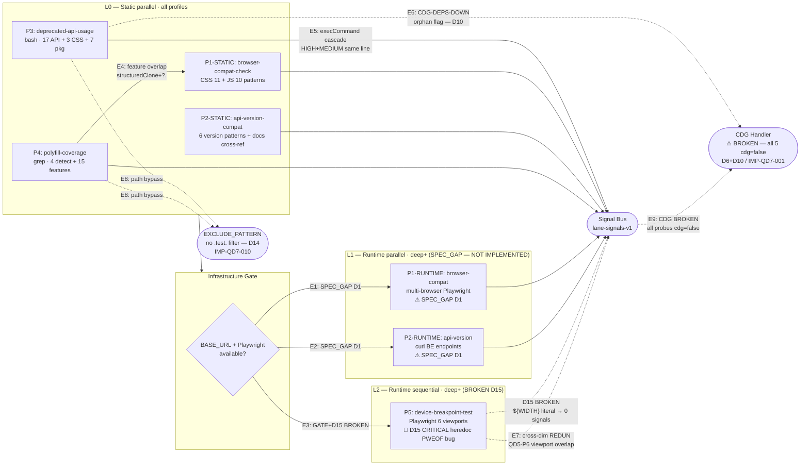

# QD7 — Browser/API/Device Compatibility: Audit Report

> **Status:** ✅ Phase 1+2+3+4+5 COMPLETE — QD7 AUDIT COMPLETE
> **Owner audit:** Phiên 35 (Phase 1) + Phiên 36 (Phase 2) + Phiên 37 (Phase 3) + Phiên 38 (Phase 4) + Phiên 39 (Phase 5) — 2026-05-09
> **Dimension:** QD7 Compatibility & Portability
> **Lane skill:** `wf-fix-compat` v2.0.0-alpha.s4
> **DISCREPANCYs:** 17 (D1-D12 Phase 1 + D13-D17 Phase 2)
> **IMPs:** 14 (IMP-QD7-001..014) — Phase 4 added IMP-013 (REDUN dedup) + IMP-014 (D15 CRITICAL fix). Phase 5 finalized — QD7 AUDIT COMPLETE.
> **Namespace:** dim-local `IMP-QD7-NNN` — mapping global `IMP-NNN` ở Stage 2 G2

---

## 1. Tổng quan

| Trường | Giá trị |
|---|---|
| **Dimension ID** | QD7 |
| **Tên** | Browser/API/Device Compatibility (a.k.a. Compatibility & Portability) |
| **Owner agent** | `frontend-developer` (+ `accessibility-reviewer` cho RTL — chỉ có trong SKILL.md, ⚠️ DISCREPANCY-007) |
| **Số probes** | 5 (lazy-load theo profile) — **ít nhất trong 7 dim** |
| **Profile routing** | quick: 3 probes / standard: 4 probes / deep: 5 probes / exhaustive: 5 probes |
| **Lane skill** | `wf-fix-compat` v2.0.0-alpha.s4 |
| **CI tools** | GitNexus (compat execution flows) + Serena (deprecated API trace via `find_referencing_symbols`) |
| **Skip condition** | `interface_type == "api-only"` → E042 partial run (static-only, skip browser/breakpoint runtime) |
| **Cache policy** | Static probes (deprecated, polyfill, browser-compat-static, api-version-static): `allowed`. Runtime probes (browser-compat-runtime, device-breakpoint): `skip` |
| **Bash delegation** | 1 probe có dedicated bash script (`wf-fix-probe-static-deprecated.sh`). 4 probes inline grep+jq. |

### Architecture: Hybrid Static + Runtime

QD7 có kiến trúc **hybrid** — tương tự QD4/QD5 nhưng phân bổ khác:

```
QD7 Execution Pipeline (5 probes):
  PRE-GATE → CI detect/freshness/inject (Protocol 20) + interface_type check + Playwright check + base_url check
    ↓
  Phase SENSE: static probes → bash/grep
    ├─ P-QD7-deprecated-api-usage  (bash script wf-fix-probe-static-deprecated.sh)
    ├─ P-QD7-polyfill-coverage      (inline grep features + check polyfill setup)
    ├─ P-QD7-browser-compat-check   (static portion: CSS/JS feature grep)
    └─ P-QD7-api-version-compat     (static portion: route + docs cross-ref)
    ↓
  Phase THINK: diff browser compat matrix vs targets, compute polyfill gaps, version alignment
    ↓
  Phase ACT: runtime probes (deep+/exhaustive) — Playwright multi-viewport
    ├─ P-QD7-device-breakpoint-test  (full runtime — required deep+)
    ├─ P-QD7-browser-compat-check    (runtime portion — multi-browser at exhaustive)
    └─ P-QD7-api-version-compat      (runtime portion — call BE endpoints to verify version)
    ↓
  Phase VERIFY: signal-v2 schema + browser identifier + viewport dimension + caniuse coverage
    ↓
  POST-GATE T1-T4 + browser matrix coverage check (deep+ requires ≥2 browsers)
```

### Browser/Breakpoint Matrix (SKILL.md)

| Browser | Min Version | Profile chạy |
|---------|-------------|--------------|
| Chromium | latest | quick+ (always) |
| Firefox | latest | standard+ |
| WebKit (Safari) | latest | deep+ |
| Edge | latest | exhaustive+ |

| Breakpoint | Width | Profile chạy |
|------------|-------|--------------|
| Mobile portrait (iPhone SE) | 320×568 / 360×640 | exhaustive |
| Tablet (iPad) | 768×1024 | exhaustive |
| Laptop | 1280×800 / 1366×768 | exhaustive |
| Desktop wide | 1920×1080 / 1440×900 | exhaustive |

⚠️ **DISCREPANCY-008:** SKILL.md "Breakpoint Matrix" liệt kê 4 breakpoints (Mobile portrait, Mobile landscape/Tablet portrait, Laptop, Desktop wide) ở 360/768/1366/1920 width. Probe spec `P-QD7-device-breakpoint-test` DEFAULT_BREAKPOINTS có 6 breakpoints (xs=320, sm=375, md=768, lg=1280, xl=1440, 2xl=1920). Mismatch sizes + count.

### CDG Policy

Tất cả 5 probes có `cdg: false` trong dimension.json — **KHÔNG có probe nào trigger CDG** ngay cả khi severity=CRITICAL (api-version breaking change không có fallback, deprecated API đã removed khỏi browsers, layout vỡ mobile blocking release). Đây là **4th dimension** confirming systemic CDG governance gap (sau QD3 partial, QD4 broken D4, QD5 fully missing) — xem **DISCREPANCY-006**.

---

## 2. Liệt kê probes + DISCREPANCY markers

| Probe ID | Type | quick | standard | deep | exhaustive | Tool | Sev Default | CDG |
|---|---|:---:|:---:|:---:|:---:|---|---|---|
| `P-QD7-browser-compat-check` | static+runtime | ✅ | ✅ | ✅ | ✅ | grep+jq | HIGH | false |
| `P-QD7-api-version-compat` | static+runtime | ✅ | ✅ | ✅ | ✅ | grep+jq | **CRITICAL** | false |
| `P-QD7-deprecated-api-usage` | static | ✅ | ✅ | ✅ | ✅ | bash script | HIGH | false |
| `P-QD7-polyfill-coverage` | static | ❌ | ✅ | ✅ | ✅ | grep+jq | HIGH | false |
| `P-QD7-device-breakpoint-test` | runtime | ❌ | ❌ | ✅ | ✅ | playwright | MEDIUM | false |

**Legend:** SKILL.md routing table và dimension.json depth array align cho 5 probes — không có quick-routing conflict (khác với QD5).

### DISCREPANCY Markers (12 total)

- **⚠️ DISCREPANCY-001:** `P-QD7-browser-compat-check` declared `type: "static+runtime"` nhưng probe spec **chỉ có static portion** (B1-B3 grep CSS/JS features, B4 cache check). Không có runtime browser launch hay multi-browser check trong probe. Runtime portion mentioned trong SKILL.md Phase 2 step 4 ("Phase ACT — chạy runtime probes (multi-browser, breakpoints, i18n fallback)") nhưng probe spec không implement. Type misleading.
- **⚠️ DISCREPANCY-002:** `P-QD7-api-version-compat` declared `severity_default: "CRITICAL"` trong dim.json nhưng probe spec ACT chỉ emit `critical` cho 1 case ("Client gọi API version không tồn tại tren server"). Other cases emit `HIGH` (contract docs mismatch, deprecated no migration), `MEDIUM` (missing version header, semver patch). Default CRITICAL quá aggressive — dim.json dùng làm orchestrator hint cho fallback severity, sai cấp độ → triage bị over-prioritize.
- **⚠️ DISCREPANCY-003:** `P-QD7-device-breakpoint-test` `required_inputs: ["base_url", "phase4-ux"]` trong dim.json — nhưng probe spec PRE-GATE chỉ check `$BASE_URL` + UI code presence + Playwright. Không reference Phase 4 UX docs ở đâu trong probe logic. `phase4-ux` requirement chưa được implement → probe vẫn chạy ngay cả khi phase4 docs absent, có thể miss UX-driven breakpoints custom của project.
- **⚠️ DISCREPANCY-004:** SKILL.md Severity Rules table có nhiều cases không xuất hiện trong dim.json `severity_rules.high_triggers`:
  - "Layout vỡ trên mobile (CLS > 0.25)" — HIGH
  - "Firefox/WebKit feature crash hoặc không chạy" — HIGH
  - "Required env var missing trong .env.production" — HIGH
  - "Deprecated API removed in next major version (within 6 months)" — HIGH
  - dim.json chỉ list 2 high_triggers: ["Deprecated API khong co plan", "Missing polyfill cho required feature"]. Underspecified — 4 SKILL cases mất trong orchestrator severity routing.
- **⚠️ DISCREPANCY-005:** SKILL.md Mục đích nói "i18n (locale/RTL/timezone)" nhưng **không có probe nào kiểm tra i18n** trong dimension.json. SKILL.md Phase 1 step 2 mentions "static probes (deprecated, polyfill, env-parity)" — env-parity không phải i18n. SKILL.md Severity Rules có "Hard-coded locale / date format / currency → MEDIUM" nhưng không có probe detect các pattern này. Gap: i18n declared in scope nhưng probe coverage = 0.
- **⚠️ DISCREPANCY-006:** Toàn bộ QD7 probes có `cdg: false` — không có probe nào trigger CDG ngay cả khi severity=CRITICAL. So với QD3 (security): có CDG trigger cho secret/auth-bypass. QD7 CRITICAL cases (API breaking change blocks release, document.all on production, layout vỡ blocks user) deserve CDG-pause. **4th dimension** confirming systemic CDG gap — xem MERGE cluster IMP-QD5-003 ↔ QD7-001.
- **⚠️ DISCREPANCY-007:** dim.json `dependencies.agents` chỉ liệt kê `["frontend-developer"]` — thiếu `accessibility-reviewer` (RTL focus). SKILL.md Owner Agent section explicitly lists cả hai. Same pattern as QD5 D7. Orchestrator metadata gap → khi RTL/i18n issue surface, agent không được pre-loaded → spawn delay.
- **⚠️ DISCREPANCY-008:** Browser/breakpoint matrix mismatch — SKILL.md Breakpoint Matrix có 4 breakpoints (360/768/1366/1920), probe spec DEFAULT_BREAKPOINTS có 6 breakpoints (320/375/768/1280/1440/1920). Khác width và count. SKILL.md "iPhone 8" reference (375×667) không có trong SKILL matrix. Probe sẽ test 6 breakpoints nhưng SKILL.md says 4 → POST-GATE coverage check ambiguous.
- **⚠️ DISCREPANCY-009:** SKILL.md mention env-parity (E045 ".env files không có") nhưng không có probe `P-QD7-env-parity` trong dimension.json. SKILL.md Phase 1 step 2 implies env-parity là 1 trong 3 static probes (deprecated, polyfill, env-parity) → **probe missing** OR env-parity là duty của P-QD7-api-version-compat (probe spec không reference .env files).
- **⚠️ DISCREPANCY-010:** `P-QD7-deprecated-api-usage` bash script `wf-fix-probe-static-deprecated.sh` line 210 emits `cdg_flags: ["CDG-DEPS-DOWN"]` cho deprecated package detection → **mâu thuẫn với dim.json `cdg: false`**. Probe đang fire CDG flags nhưng dimension declared CDG disabled. Same pattern as QD4 D4 (broken CDG routing). Orchestrator có thể accept hoặc reject → behavior unpredictable.
- **⚠️ DISCREPANCY-011:** `P-QD7-polyfill-coverage` profile array `["standard", "deep", "exhaustive"]` (no quick) trong dim.json — align với SKILL.md routing table (quick=❌). NHƯNG probe spec PRE-GATE không có check "fail nếu PROFILE=quick" → nếu orchestrator misroute và chạy probe ở quick (ví dụ user override `--use-cache --probe=P-QD7-polyfill-coverage`), probe sẽ chạy bình thường. Defensive gate missing.
- **⚠️ DISCREPANCY-012:** SKILL.md Severity Rules nói "Polyfill missing for legacy browser support (IE11) | MEDIUM (if support needed) hoặc LOW (modern apps)" — **conditional severity** dependent on browserslist target. Probe spec THINK step có severity logic dựa trên `browserslist usage %` (>50% CRITICAL, 10-50% HIGH, <10% MEDIUM) — **khác** với SKILL.md condition (legacy-needed=MEDIUM, modern=LOW). Hai severity mappings không align. Probe sẽ over-flag modern apps where IE11 không cần support.

---

## 3. Per-probe Analysis

### P1: P-QD7-browser-compat-check — Browser Compatibility Check

**Phase 2 verdict:** **PARTIAL_MISMATCH** — type=`static+runtime` declared nhưng probe spec only static (D1 confirmed); built-in compat matrix outdated vs caniuse-lite (D16 NEW). Tham khảo Table C.

**SENSE:**
1. Detect target browsers từ browserslist config (priority: `.browserslistrc` > `package.json` "browserslist" > default `defaults`)
2. Static grep CSS modern features (B2): 11 patterns — `:has()`, `container-type:`, `subgrid`, `@layer`, `accent-color:`, `text-wrap: balance`, `field-sizing:`, `dialog::backdrop`, `color-mix(`, `selector(`, `container-name:`
3. Static grep JS modern APIs (B3): 10 patterns — `structuredClone(`, `navigator.clipboard`, `Intl.Segmenter`, `AbortSignal.timeout`, `crypto.randomUUID`, `EyeDropper`, `navigator.usb`, `navigator.serial`, `Document PiP`, `ViewTransition`
4. Optional scan cache check (B4) nếu `--use-cache` — cache key = md5(content of CSS+TS+TSX)
5. **Runtime portion missing** ⚠️ DISCREPANCY-001 — SKILL.md says runtime exists but probe spec không implement multi-browser launch

**THINK:**
- Parse browserslist target → identify minimum browser versions
- CSS compat matrix lookup (built-in, no caniuse data integration):
  - `:has()` → Chrome 105+, Firefox 121+, Safari 15.4+
  - `container-type:` → Chrome 105+, Firefox 110+, Safari 16+
  - `subgrid` → Chrome 117+, Firefox 71+, Safari 16+
  - `@layer` → Chrome 99+, Firefox 97+, Safari 15.4+
- JS API compat matrix (built-in):
  - `structuredClone` → Chrome 98+, Firefox 94+, Safari 15.4+
  - `crypto.randomUUID` → Chrome 92+, Firefox 95+, Safari 15.4+
- Severity mapping:
  - Feature used + target browser missing + no polyfill → CRITICAL
  - Feature used + target browser missing + polyfill exists → MEDIUM
  - Feature only on recent browsers (<5% global) → LOW
- Domain: `frontend` (per dim.json default)

**ACT:**
- Signal schema: `signal-v2`, dimension_id=QD7, signal_type=`browser_compat`
- Evidence: `code_snippet` + `caniuse_coverage` (% support)
- Per-pattern emit: 1 signal/file/line per CSS or JS feature found
- ⚠️ **No real caniuse-lite integration** — built-in matrix is hand-curated, may be outdated. caniuse-lite npm package would give canonical data
- Fallback: no source code → skip; no browserslist → use `defaults`; CanIUse data unavailable → built-in matrix

**VERIFY:**
1. `dimension_id == "QD7"` ✓
2. Evidence non-empty (≥1 of `code_snippet`, `caniuse_coverage`) ✓
3. severity ∈ [CRITICAL, HIGH, MEDIUM, LOW] ✓
4. probe_id matches `^P-QD7-[a-z0-9-]+$` ✓
5. target.file_path exists on disk ✓
6. dedup_hints non-empty per signal ✓

---

### P2: P-QD7-api-version-compat — API Version Compatibility

**Phase 2 verdict:** **PARTIAL_MISMATCH** — type=`static+runtime` declared nhưng probe spec only static (D1 confirmed); severity_default=CRITICAL outlier (D2 confirmed); cross-ref impl_status=done logic chỉ partial impl (AF-C1). Tham khảo Table D.

**SENSE:**
1. Doc API versioning strategy (B1): grep 6 patterns — `api/v[0-9]`, `X-API-Version`, `Accept: application/vnd.api`, `API_VERSION`, `apiVersion`, `version.*route`
2. Doc API contract from `phase3-architecture/api-*.md` (B2): grep version info + req-registry cross-ref impl_status=done
3. Optional cache check (B3) nếu `--use-cache` — cache key = md5(routes/controllers content)
4. **Runtime portion declared but not in probe spec** ⚠️ DISCREPANCY-001 — Type `static+runtime` nhưng probe spec only static. Runtime would be: actually call BE endpoints (`curl -H "Accept: application/vnd.api+json;version=2"`) and verify response schema. Not implemented.

**THINK:**
- Versioning strategy detection (URL path / header / content negotiation)
- Version alignment check:
  - Client `/api/v1/...` + server only `/api/v2/...` → `CRITICAL` (breaking)
  - Server v1+v2 same endpoint + v1 deprecated → check warning
  - Contract docs say v2 + code only v1 → `HIGH`
- Breaking change detection (request/response schema, required fields, enum values across versions)
- Cross-ref req-registry: impl_status=done + endpoint missing → `HIGH`
- Domain: `frontend` (default — but realistically backend issue)
- ⚠️ DISCREPANCY-002: severity_default=CRITICAL only correct for 1 case; other cases HIGH/MEDIUM. Default too aggressive.

**ACT:**
- Signal schema: `signal-v2`, dimension_id=QD7, signal_type=`api_version_mismatch`
- Evidence: `client_calls` (grep result with file:line) + `server_routes` (grep result)
- Fallback: no API artifacts → skip; parse error → log warning per file; no versioning detected → INFO single-version assumption

**VERIFY:**
1. `dimension_id == "QD7"` ✓
2. Evidence ≥1 field non-empty ✓
3. API path in `description` matches `target.file_path` ✓
4. dedup_hints contain api version key ✓

---

### P3: P-QD7-deprecated-api-usage — Deprecated API Detection

**Phase 2 verdict:** **PARTIAL_MISMATCH** — TRUST_BASH cho static portion (17+3+7 patterns match spec) NHƯNG: D10 CDG-DEPS-DOWN conflict (line 210) + D13 `--probe` cosmetic + D14 cache gap (no `USE_CACHE`) + D17 fingerprint 6-token outlier (lines 113/159/197) + AF-A1 no signal-emit.md helper. Tham khảo Table B.

**SENSE:**
1. Delegate to bash script `.claude/scripts/wf-fix-probe-static-deprecated.sh` (S5 v7.0 pattern same as QD3 xref / QD4 perf / QD6 data)
2. Bash script handles 3 categories:
   - **17 browser/React/Node API patterns** (with severity tagging in script):
     - critical: `new Buffer()`, `showModalDialog`
     - high: `document.execCommand('copy'/'paste')`, `componentWillMount/ReceiveProps/Update`, `ReactDOM.render`, `MutationEvent`, `document.all`
     - medium: `document.execCommand`, `findDOMNode`, `event.returnValue`, `event.cancelBubble`, `punycode (Node)`
     - low: `document.createEvent`, `navigator.platform`
   - **3 deprecated CSS patterns** (all low): `zoom`, `-webkit-box-flex`, `word-break: break-word`
   - **7 deprecated package patterns** (in `package.json`):
     - high: `request` (replace: node-fetch/axios/undici)
     - medium: `moment`, `jade`, `babel-preset-es2015`, `tslint`, `core-js@2`
     - low: `node-uuid`
3. Inline fallback nếu bash fails → emit empty signals + `skip_reason: "bash_script_failed"`

**THINK:**
- Severity assessment:
  - API REMOVED khỏi browsers → CRITICAL (code se fail)
  - API DEPRECATED nhưng working → HIGH (need migration plan)
  - Library deprecated method → MEDIUM
  - Deprecated CSS với vendor prefix replacement → LOW
- Replacement mapping (hardcoded trong script):
  - `document.execCommand('copy')` → `navigator.clipboard.writeText()`
  - `componentWillMount` → `useEffect`
  - `new Buffer()` → `Buffer.alloc()/from()`
  - `moment` → `date-fns/dayjs`
  - `request` → `node-fetch/axios`
- Impact scoring: count occurrences per pattern → frequent usage = higher priority
- EXCLUDE_PATTERN: `(node_modules|\.git/|dist/|build/|\.next/|coverage/)` (hardcoded — same gap as QD5 IMP-015)
- Fingerprint: `sha256(QD7|file|line|probe_id|deprecated_api|label)` — proper namespace
- ⚠️ DISCREPANCY-010: Bash script line 210 emits `cdg_flags: ["CDG-DEPS-DOWN"]` cho deprecated packages → conflict với dim.json `cdg: false`

**ACT:**
- Signal schema: `signal-v2`, dimension_id=QD7, signal_type=`deprecated_api`
- Evidence: type=`code` với code_snippet (head -c 100)
- Remediation: `suggested_action: "Replace with: <replacement>"`, `suggested_agent: "frontend-developer"`, `estimated_effort: "small"` (code) / `"trivial"` (CSS) / `"medium"` (package)
- Per pattern emit signals — no aggregation

**VERIFY:**
1. `dimension_id == "QD7"` ✓
2. evidence.code_snippet non-empty ✓
3. evidence.replacement (in description) ✓
4. severity ∈ [CRITICAL, HIGH, MEDIUM, LOW] ✓
5. dedup_hints chứa file-specific key ✓

---

### P4: P-QD7-polyfill-coverage — Polyfill Coverage Check

**Phase 2 verdict:** **TRUST_SPEC** với caveats — inline bash B1+B2 spec-aligned (4 polyfill detection methods + 15 features grep), NHƯNG: D11 defensive PRE-GATE missing (no `--profile=quick` skip) + D12 dual severity systems (probe %-based vs SKILL.md needs-based) + tree-shaken polyfills silent miss (FN-09 confirmed). Tham khảo Table F.

**SENSE:**
1. Detect polyfill setup (B1): grep `core-js`, `@babel/polyfill` (deprecated), `polyfill.io / cdn.polyfill`, build-tool config (`vite.config.*`, `webpack.config.*`), browserslist target
2. Scan modern JS features (B2) — 15 patterns: `?.` Optional Chaining, `??` Nullish Coalescing, `Promise.allSettled`, `Promise.any`, `String.matchAll`, `BigInt(`, `globalThis`, `import.meta`, `export * as`, `#private`, `Array.prototype.at(`, `Object.hasOwn`, `structuredClone(`, `replaceAll(`, `AggregateError`
3. Optional cache check (B3) — `polyfill-coverage-<md5>`

**THINK:**
- Polyfill gap analysis:
  - Feature used + no polyfill + browser missing = GAP
  - Feature used + polyfill exists + no import = GAP
  - Feature used + polyfill imported + version match = OK
- Build tool transform check:
  - Babel preset-env → transforms syntax (optional chaining), polyfills APIs
  - Vite target ES version
  - TypeScript target alignment với browserslist
- Severity logic (probe-internal):
  - Gap affects >50% users (per browserslist) → CRITICAL
  - Gap affects 10-50% users → HIGH
  - Gap affects <10% users → MEDIUM
  - Deprecated polyfill library (babel/polyfill) → MEDIUM
- ⚠️ DISCREPANCY-012: SKILL.md says "Polyfill missing for IE11 → MEDIUM (if support needed) hoặc LOW (modern apps)" — different conditional. Probe doesn't check "support needed" context.

**ACT:**
- Signal schema: `signal-v2`, dimension_id=QD7, signal_type=`missing_polyfill`
- Evidence: `feature` + `usage_count` + `affected_files` (head 5) + `caniuse_support` % + `browserslist_target`
- Target: `kind: "config"`, `file_path: "package.json"` (since fix là install polyfill)
- ⚠️ Ambiguity: Signal target nên là code file dùng feature OR config file để fix? Probe spec example shows `package.json` nhưng issue source là code files.

**VERIFY:**
1. `dimension_id == "QD7"` ✓
2. evidence ≥1 of `feature` + `usage_count` ✓
3. dedup_hints chứa feature name (aggregate per-feature) ✓
4. Signal target chỉ ra file cần fix ✓

---

### P5: P-QD7-device-breakpoint-test — Device Breakpoint Responsive Test

**Phase 2 verdict:** **CRITICAL_BUG** — D15 NEW: heredoc `<< 'PWEOF'` single-quoted (line 105) → bash KHÔNG expand `${WIDTH}`/`${HEIGHT}`/`${URL}` template literals → Playwright config receives literal `${WIDTH}` strings → probe **fundamentally broken if executed as-spec'd**. Cần rewrite theo P-QD4-core-web-vitals pattern (heredoc → temp file → `node "$script"`). Cũng có D3 phase4-ux not referenced + D8 breakpoint mismatch (6 vs 4) + AF-D1 bash↔JS template literal conflict. Tham khảo Table E.

**SENSE:**
1. PRE-GATE: skip nếu no $BASE_URL, no UI code, no Playwright
2. Detect breakpoints from design system (B1):
   - Tailwind: grep `screens` in `tailwind.config.*`
   - CSS: grep `@media`, `breakpoint`, `--bp-` in `*.css/scss`
   - Default: 6 breakpoints (xs/sm/md/lg/xl/2xl) at 320/375/768/1280/1440/1920
3. Build page list (B2):
   - Next.js App Router: `find src/app -name page.tsx` → routes
   - Next.js Pages Router: `find src/pages -name *.tsx`
   - Limit: deep=10 pages, exhaustive=all
4. ⚠️ DISCREPANCY-008: Probe DEFAULT_BREAKPOINTS (6) ≠ SKILL.md Breakpoint Matrix (4)

**THINK:**
- Breakpoint coverage check (every breakpoint has media query)
- Layout integrity per breakpoint:
  - Horizontal overflow (scrollWidth > clientWidth) → layout break
  - Element overlap (visual bbox intersection unintended)
  - Text clipped/truncated affecting meaning
  - Touch targets <44px (iOS HIG) hoặc <48px (Material)
  - Fixed elements covering content on scroll
- Cross-device patterns:
  - iPhone SE (320px) — smallest, frequent overflow
  - iPad (768px) — tablet, 2-col → 1-col transitions
  - Desktop (1280+) — wide layout, whitespace
- Severity mapping (probe spec):
  - Horizontal scroll required → CRITICAL
  - Content invisible/hidden → HIGH
  - Touch target <44px → MEDIUM
  - Minor spacing → LOW
- ⚠️ Severity conflict với dim.json `severity_default: "MEDIUM"` — probe-spec severity range CRITICAL→LOW không align.

**ACT:**
- Signal schema: `signal-v2`, dimension_id=QD7, signal_type=`responsive_break`
- Evidence: `viewport`, `device`, `overflow_px`, `screenshot_path`
- Target: `kind: "page"`, `file_path` (route file) + `url` (live URL)
- Playwright resize + goto + JS evaluate (scrollWidth, smallTargets)
- Screenshot saved to `$SESSION_DIR/lanes/QD7/evidence/<page>-<width>-<issue>.png`

**VERIFY:**
1. `dimension_id == "QD7"` ✓
2. Evidence non-empty (viewport + overflow_px hoặc screenshot_path) ✓
3. severity ∈ [CRITICAL, HIGH, MEDIUM, LOW] ✓
4. screenshot_path exists nếu có hoặc overflow_px > 0 ✓
5. dedup_hints chứa page+breakpoint combination ✓

---

## 4. False Positive Scenarios (≥8 candidates)

| # | Probe | Scenario | Tại sao là FP | Ảnh hưởng |
|---|---|---|---|---|
| FP-01 | P-QD7-deprecated-api-usage | `document.execCommand('copy')` trong polyfill fallback path — code có `if (!navigator.clipboard) { document.execCommand('copy') }` là CORRECT graceful degradation | grep không phân tích control flow | HIGH false alarm cho mọi feature-detection pattern |
| FP-02 | P-QD7-deprecated-api-usage | Comments mentioning deprecated API — `// TODO: replace document.execCommand with clipboard` | Bash script grep không filter comments | MEDIUM false alarm cho code documentation |
| FP-03 | P-QD7-browser-compat-check | CSS `:has()` với `@supports (selector(:has(*)))` fallback — explicit feature detection | Static probe không match `@supports` rule | HIGH false alarm cho progressive enhancement |
| FP-04 | P-QD7-browser-compat-check | TypeScript `?.` optional chaining transformed bởi Babel target ES5 — output đã polyfilled, not source | Probe checks source code, không build output | HIGH false alarm cho pre-Babel TS files |
| FP-05 | P-QD7-polyfill-coverage | Modern app target ES2020+ với browserslist `last 2 versions` — `structuredClone` natively supported, không cần polyfill | Probe THINK step `>50% users` calculation may flag if browserslist is liberal | HIGH false alarm cho modern-only apps |
| FP-06 | P-QD7-polyfill-coverage | Server-side feature usage (Node.js >18) — `structuredClone` runs trên server, browserslist không apply | Probe doesn't separate client vs server code | MEDIUM false alarm cho Next.js SSR/RSC code |
| FP-07 | P-QD7-api-version-compat | Internal API + external API mixed — `/api/v1/...` cho internal microservice + `/v2/...` cho external partner | Probe assumes single versioning scheme | HIGH false alarm cho hybrid architectures |
| FP-08 | P-QD7-device-breakpoint-test | Custom viewport app (admin dashboard 1280px-only) — overflow at 320px là intentional, app spec says desktop-only | Probe doesn't check `viewport` meta tag or spec | CRITICAL false alarm cho desktop-only tools |
| FP-09 | P-QD7-deprecated-api-usage | Test files using deprecated APIs intentionally — `*.test.ts` checking legacy code path | EXCLUDE_PATTERN không có `\.test\.|\.spec\.` (khác với QD5 a11y) | HIGH false alarm flooding test directories |
| FP-10 | P-QD7-browser-compat-check | CSS-in-JS dynamically generated `:has(...)` — string template trong styled-components | grep finds substring trong template literals (not real CSS) | HIGH false alarm cho CSS-in-JS apps |

---

## 5. False Negative Scenarios (≥10 candidates)

| # | Probe | Missing Gap | Tại sao bị miss |
|---|---|---|---|
| FN-01 | P-QD7-browser-compat-check | CSS Container Queries với `@container` (not `container-type:`) — feature detection branch | Probe pattern list incomplete — chỉ has `container-type:` not `@container (` |
| FN-02 | P-QD7-browser-compat-check | View Transitions API `document.startViewTransition` — modern API not in JS_PATTERNS list | Pattern list hand-curated, missing newer APIs |
| FN-03 | P-QD7-browser-compat-check | Web Components `customElements.define`, Shadow DOM `attachShadow` | No pattern for Web Components — full category gap |
| FN-04 | P-QD7-browser-compat-check | WebAssembly `WebAssembly.instantiate` — older browsers no support | No WASM check |
| FN-05 | P-QD7-deprecated-api-usage | Subtle browser quirks — Safari Date parsing `new Date('2024-01-01 10:00')` (non-ISO format) | Static grep không catch runtime divergence |
| FN-06 | P-QD7-deprecated-api-usage | Node.js deprecated streams API — `stream.Readable.legacy` | Pattern list focuses browser/React, light on Node |
| FN-07 | All | Storage quota differences — Safari 7-day storage eviction, Chrome 60% disk | Runtime behavior, không có probe |
| FN-08 | All | Cookie SameSite policies — Chrome SameSite=Lax default vs Safari ITP block | No probe checks cookie attributes |
| FN-09 | P-QD7-polyfill-coverage | Tree-shaken polyfills — code uses `Array.at()` + `core-js/modules/es.array.at` imported in 1 file but not entry → silent miss | Probe checks if `core-js` declared, không trace imports |
| FN-10 | P-QD7-api-version-compat | GraphQL schema versioning (no URL path) — `apiVersion` field trên schema | Probe URL-path-focused, doesn't parse GraphQL SDL |
| FN-11 | P-QD7-device-breakpoint-test | Print mode rendering — `@media print` không tested ở Playwright (default screen media) | No print mode test |
| FN-12 | P-QD7-device-breakpoint-test | Screen reader on mobile + voice control — touch target <44px nhưng có aria-label vẫn unusable | Touch target check sufficient cho size, missing AT context |
| FN-13 | P-QD7-device-breakpoint-test | Pointer events compat — Safari `pointerType` mouse vs touch divergence | Playwright default mouse simulation, miss touch event |
| FN-14 | All | i18n missing checks — RTL layout (dir="rtl"), locale-specific date formats, timezone handling | ⚠️ DISCREPANCY-005: scope declared but no probe |
| FN-15 | All | Service Worker compat — `navigator.serviceWorker.register()` browser support | No probe for SW |

---

## 6. Tech Stack Matrix (≥5 stacks × 5 probes)

| Stack | P-QD7-browser-compat | P-QD7-api-version | P-QD7-deprecated | P-QD7-polyfill | P-QD7-device-bp |
|---|---|---|---|---|---|
| **React/TSX (Vite)** | ✅ Good (JSX/CSS grep) | ✅ Good (REST routes) | ✅ Good (full pattern list) | ✅ Good | ✅ Runtime-based |
| **Next.js (App Router)** | ✅ Good | ✅ Good (`route.ts`) | ✅ Good | ⚡ Partial (server vs client confusion FP-06) | ✅ Good (page.tsx auto-discovery) |
| **Vue 3 SFC** | ⚡ Partial (template syntax different) | ✅ Good | ⚠️ Limited (no Vue lifecycle deprecated) | ⚡ Partial | ✅ Good |
| **Angular** | ⚠️ Limited (template binding `[ngClass]`) | ⚡ Partial (router config) | ⚠️ Limited (no Angular deprecated) | ⚠️ Limited | ✅ Good |
| **Svelte** | ⚠️ Limited (compiled output) | ✅ Good | ⚠️ Limited | ⚠️ Limited | ✅ Good |
| **Plain HTML/JS** | ✅ Full | ⚠️ Limited (no obvious routes) | ✅ Full | ✅ Full | ✅ Full |
| **NestJS (BE only)** | ❌ N/A (no UI) | ✅ Good (controllers) | ⚡ Partial (Node-deprecated only) | ❌ N/A | ❌ N/A (no BASE_URL UI) |
| **Express (BE only)** | ❌ N/A | ✅ Good (routes) | ⚡ Partial (Node) | ❌ N/A | ❌ N/A |
| **GraphQL (Apollo/urql)** | ✅ — | ❌ Miss (no URL versioning) | ✅ — | ⚡ Partial | ✅ — |
| **CSS-in-JS (styled-components/emotion)** | ❌ Miss (FP-10 risk) | ✅ — | ✅ — | ✅ — | ✅ — |
| **Tailwind CSS** | ⚡ Partial (utility classes) | ✅ — | ✅ — | ✅ — | ✅ — |
| **Browser-target IE11** | ⚠️ Critical needed | ✅ — | ✅ Full | ⚠️ Severity logic mismatch (DISCREPANCY-012) | ✅ — |

**Notes:**
- **Angular**: `[ngClass]`, `*ngIf` template binding khác JSX nên `:has()` grep không apply trên template
- **CSS-in-JS**: Browser-compat-check static grep tìm `:has(` substring trong JS strings — hits styled-components template literals → FP-10
- **Next.js SSR/RSC**: `structuredClone` ở server component (Node 18+) supported nativily → FP-06 polyfill false alarm
- **GraphQL**: Versioning thường via schema fields hoặc directives (`@deprecated`), không phải URL path → P-QD7-api-version miss
- **NestJS/Express BE-only**: Browser/breakpoint probes N/A, deprecated-api chỉ check Node patterns (limited scope)
- **IE11 target**: Polyfill severity conflict với SKILL.md (DISCREPANCY-012)

---

## 7. Edge Cases (≥10 candidates)

| # | Probe | Edge Case | Expected Problem |
|---|---|---|---|
| EC-01 | All | **CSS-in-JS dynamic colors/features** — `${({ theme }) => theme.primary}` template values | Static grep can't resolve runtime template substitutions |
| EC-02 | All | **Babel polyfill auto-injection** — `useBuiltIns: "usage"` config tự inject `core-js` based on target → probe sees feature-usage mà không thấy explicit import | Probe FP risk — flags polyfill missing dù Babel auto-handles |
| EC-03 | P-QD7-browser-compat-check | **Conditional CSS via PostCSS** — `@supports not (selector(:has(*)))` blocks loaded via PostCSS plugins | Probe doesn't trace PostCSS pipeline |
| EC-04 | P-QD7-deprecated-api-usage | **Polyfill libraries themselves use deprecated APIs** — core-js shim của `Promise.any` may use `MutationEvent` internally | Bash script chỉ grep src/, exclude node_modules — but library code in vendored bundles miss |
| EC-05 | P-QD7-api-version-compat | **GraphQL persisted queries** — clients use query hash, server resolves to schema; "version" semantic implicit | No URL versioning → probe says "single version" → miss schema drift |
| EC-06 | P-QD7-api-version-compat | **OpenAPI spec drift** — frontend uses generated SDK from OpenAPI v2, BE deployed v1 with breaking removed fields | Probe reads markdown docs only, không parse OpenAPI YAML/JSON |
| EC-07 | P-QD7-polyfill-coverage | **Conditional polyfill loading** — `<script nomodule>` for legacy + `<script type="module">` for modern | Probe doesn't analyze HTML script-loading strategy |
| EC-08 | P-QD7-device-breakpoint-test | **Foldable devices** — Galaxy Z Fold inner screen 768×884, outer 280×653 — neither in default breakpoints | Probe DEFAULT_BREAKPOINTS miss foldable form factor |
| EC-09 | P-QD7-device-breakpoint-test | **Touch device DPR scaling** — iPhone 13 Pro at 390×844 logical viewport but 1170×2532 physical — `getBoundingClientRect()` returns logical px | Touch target <44px logical OK on hi-DPI screens, but probe might over-flag if confusion |
| EC-10 | P-QD7-device-breakpoint-test | **Print mode** — `@media print` reflow → entirely different layout, not tested | No print test |
| EC-11 | All | **Web Components shadow DOM** — `<my-button>` rendered Shadow DOM → Playwright `querySelectorAll('button')` không xuyên Shadow root | Touch target / element checks miss components in Shadow DOM |
| EC-12 | P-QD7-browser-compat-check | **CSS Cascade Layers** `@layer` — older browsers ignore = unstyled fallback, newer browsers honor specificity | Probe flags `@layer` use but doesn't verify fallback exists |
| EC-13 | P-QD7-deprecated-api-usage | **Babel macro / SWC plugin transforms** — `componentWillMount` rewritten by codemod at build → source has it but built code doesn't | Probe checks source, not transformed output |
| EC-14 | All | **Hybrid mobile webview** — Capacitor/Cordova render webview với restricted APIs (no clipboard?, limited storage) | Probe assumes browser context — webview-specific gaps invisible |

---

## 8. Recommendations — IMP Candidates (≥10 IMPs) — Phase 1 pre-seed 12 IMPs

> **Note:** 12 IMPs Phase 1 pre-seed. Phase 4 cross-probe DAG sẽ thêm new IMPs hoặc consolidate. Mọi IMP-QD7-NNN là **dim-local namespace**. Stage 2 G2 sẽ MERGE hoặc add new — xem MERGE Summary Table dưới.

| IMP ID | Probe(s) | Priority | Title | Evidence | MERGE? |
|---|---|---|---|---|---|
| **IMP-QD7-001** | All probes | **P0** | Add CDG trigger cho CRITICAL severity QD7 signals — api-version breaking change blocks release, deprecated API removed (browsers reject), layout vỡ mobile blocks user flow nên CDG-pause | [Phase 1 D-006](#discrepancy-markers); [DISCREPANCY-010 bash CDG conflict](#discrepancy-markers) | **MERGE cross-dim** với IMP-QD5-003 (3-dim CDG governance gap → 4-dim). 4th confirmation strongest evidence systemic. |
| **IMP-QD7-002** | dim.json (QD7) | **P0** | Add `execution_order` / `parallel_groups` field trong `dimension.json` QD7 — declare 3-layer DAG: (L1) static probes parallel-safe (deprecated, polyfill, browser-compat-static, api-version-static); (L2) runtime probes parallel-safe sau base_url+playwright gate (browser-compat-runtime, api-version-runtime, device-breakpoint); (L3) post-VERIFY signal aggregation. Cùng gap với 6 dims khác | TBD Phase 4 (anticipated based on dimension.json absent field) | **MERGE cross-dim** với IMP-QD1-008, IMP-QD3-009, IMP-QD4-004, IMP-QD5-013, IMP-QD6-015, IMP-QD2-007 — **7th cross-dim MERGE** (canonical schema gap evidence) |
| **IMP-QD7-003** | dim.json (QD7) | **P1** | Fix dim.json `dependencies.agents` — thêm `accessibility-reviewer` cho RTL focus (hiện chỉ có `frontend-developer`) | [Phase 1 D-007](#discrepancy-markers) | MERGE QD7-internal cluster với IMP-QD7-005 (same dim.json metadata sprint) |
| **IMP-QD7-004** | dim.json (QD7) | **P1** | Re-evaluate `severity_default` cho P-QD7-api-version-compat — CRITICAL quá aggressive (chỉ 1 case match, others HIGH/MEDIUM). Đề xuất: HIGH default + escalate to CRITICAL khi probe ACT detect "client calls v missing on server" | [Phase 1 D-002](#discrepancy-markers) | — |
| **IMP-QD7-005** | dim.json (QD7) | **P1** | Sync dim.json `severity_rules.high_triggers` với SKILL.md — thêm 4 cases: "Layout vỡ mobile (CLS > 0.25)", "Firefox/WebKit feature crash", "Required env var missing in .env.production", "Deprecated API removed in next 6 months" | [Phase 1 D-004](#discrepancy-markers) | MERGE QD7-internal cluster với IMP-QD7-003 |
| **IMP-QD7-006** | P-QD7-api-version-compat, P-QD7-browser-compat-check | **P1** | Implement runtime portion cho 2 probes type=`static+runtime` — currently probe spec only static. Either: (a) add runtime curl/Playwright multi-browser launch, or (b) downgrade type to `static` only và remove runtime claim from SKILL.md | [Phase 1 D-001](#discrepancy-markers) | — |
| **IMP-QD7-007** | P-QD7-deprecated-api-usage (bash script) | **P1** | Fix CDG flag conflict — bash script line 210 emits `cdg_flags: ["CDG-DEPS-DOWN"]` nhưng dim.json `cdg: false`. Either: (a) set dim.json `cdg: true` cho probe nếu CDG intentional, (b) remove `cdg_flags` từ bash script. Same pattern as QD4 D4 broken CDG. | [Phase 1 D-010](#discrepancy-markers) | MERGE cross-dim cluster với QD4 D4 broken CDG |
| **IMP-QD7-008** | P-QD7-device-breakpoint-test, SKILL.md | **P2** | Reconcile breakpoint matrix — SKILL.md 4 breakpoints (360/768/1366/1920) vs probe DEFAULT_BREAKPOINTS 6 (320/375/768/1280/1440/1920). Pick canonical set + update both. Recommend probe spec set (more comprehensive) | [Phase 1 D-008](#discrepancy-markers) | — |
| **IMP-QD7-009** | New probe + dim.json | **P2** | Add i18n locale probe OR remove i18n from SKILL.md scope — currently SKILL.md mentions "i18n (locale/RTL/timezone)" và severity rule "Hard-coded locale → MEDIUM" nhưng không có probe. Proposed: P-QD7-i18n-locale-check (static grep cho hardcoded `Date()`, currency symbols, locale strings) | [Phase 1 D-005](#discrepancy-markers) | — |
| **IMP-QD7-010** | P-QD7-deprecated-api-usage (bash script) | **P2** | Make EXCLUDE_PATTERN config-driven + add `\.test\.|\.spec\.` defaults — currently hardcoded `(node_modules\|\.git/\|dist/\|build/\|\.next/\|coverage/)` doesn't exclude tests. Test files using deprecated APIs intentionally → FP-09 flooding | [Phase 1 §4 FP-09](#4-false-positive-scenarios-≥8-candidates) | **MERGE cross-dim** với IMP-QD5-015 (same EXCLUDE_PATTERN config gap) |
| **IMP-QD7-011** | P-QD7-device-breakpoint-test | **P2** | Cross-dim viewport sharing với QD5 — P-QD7-device-breakpoint-test overlap với P-QD5-responsive-layout (cùng Playwright multi-viewport). Same Playwright session có thể share viewport state cross-dim → tránh redundant browser launches. | TBD Phase 4 | **MERGE cross-dim** với IMP-QD5-016 (pending → confirmed by QD7 audit) |
| **IMP-QD7-012** | P-QD7-polyfill-coverage | **P3** | Improve polyfill detection — current probe relies on `package.json` declares `core-js`, không trace import statements. Tree-shaken polyfills (FN-09) silent miss. Fix: parse imports + cross-ref với features used + browserslist target → real coverage gap report | [Phase 1 §5 FN-09](#5-false-negative-scenarios-≥10-candidates) | — |
| **IMP-QD7-013** | P-QD7-deprecated-api-usage (bash) | **P2** | Cross-probe dedup cho overlapping regex patterns — Phase 3 pos-01 confirms: `document.execCommand('copy')` → 2 signals (HIGH pattern #1 specific + MEDIUM pattern #3 general cascade). Implement dispatch mode (if HIGH-specific pattern matches → skip MEDIUM-general for same file+line) OR dedup by `{file_path, line, issue_class}` tại signal accumulation step. Prevents 2× signal inflation từ overlapping deprecated patterns. | [Phase 3 accuracy-report §3 CASCADE analysis](./fixtures/qd7-test/accuracy-report.md); [Phase 4 §4.5 REDUN-QD7-003](#45-redundancy-findings) | **MERGE cross-dim** với IMP-QD1-011, IMP-QD3-011 (cross-dim unified dedup namespace Stage 2 G2) |
| **IMP-QD7-014** | P-QD7-device-breakpoint-test | **P0** | Fix D15 CRITICAL heredoc PWEOF bug — rewrite probe `<< 'PWEOF'` block dùng temp-file pattern (same as P-QD4-core-web-vitals working pattern). Single-quoted `<< 'PWEOF'` → bash KHÔNG expand `${WIDTH}`/`${HEIGHT}`/`${URL}` → Playwright config receives literal strings → probe fundamentally broken (0 valid signals). Fix: write JS test script to temp file → `node "$script"` (escapes bash↔JS template literal conflict). Critical correctness fix, not coverage expansion. | [Phase 2 D15 CRITICAL](#discrepancys-mới-phase-2); [Phase 2 AF-D1 root cause analysis](#additional-findings-af--phase-2); [Phase 4 §4.4 CASCADE-QD7-001](#44-cascade-findings) | — |

---

## 8.1. Priority Order Rationale (4 layers — Phase 4 revised)

> **Phase 4 revised:** 4-layer structure (L0/L1/L2-ordering/L3) — pattern same as QD3/QD4/QD5 §8.1. Phase 4 cross-probe DAG confirmed ordering constraints + added 2 new IMPs: IMP-QD7-013 (P2 dedup → L3) + IMP-QD7-014 (P0 CRITICAL bug fix → L0). IMP-QD7-014 elevates to L0 given CASCADE-QD7-001 scope (100% FN for device-breakpoint at deep+).

### L0 — P0: Cross-Lane Governance + Schema Gap (run first, blocks all else)

**IMP-QD7-001** và **IMP-QD7-002** là P0 cross-cutting concerns blocking nhiều downstream improvements:

| IMP | Rationale |
|---|---|
| **IMP-QD7-001 (CDG governance)** | **4th dimension** confirming systemic CDG governance gap (sau QD3 partial, QD4 broken D4, QD5 fully missing). QD7 CRITICAL cases (api-version breaking blocks release, deprecated API browser-rejected, layout vỡ mobile) deserve CDG-pause. **MERGE cross-dim** với IMP-QD5-003 → Stage 2 G2 sẽ define CDG canonical pattern cross-lane. Strongest evidence systemic gap → P0 cross-lane infrastructure. Phase 4 CASCADE-QD7-002 confirms 4-dim CDG scope. |
| **IMP-QD7-002 (execution_order)** | **7th cross-dim MERGE confirmation** (after QD1-008, QD3-009, QD4-004, QD5-013, QD6-015, QD2-007). Cùng gap `execution_order` field thiếu trong 7/7 dimensions → **canonical evidence** cho dim.json schema gap. Phase 4 ORDER-QD7-001 confirms + quantifies: DAG-optimized ~12s vs naive ~36s (-67%) current state; future ~134s vs ~186s (-28%). |
| **IMP-QD7-014 (D15 CRITICAL heredoc fix)** | **Phase 4 CASCADE-QD7-001 confirmed:** P5 `<< 'PWEOF'` single-quoted heredoc → 100% FN for ALL device-breakpoint tests at deep+/exhaustive. 0 valid responsive signals → user false-confidence on mobile layout. Same critical correctness class as IMP-QD7-001 → P0. Required before Stage 3 implementation (no point implementing downstream if probe fundamentally broken). |

**Decision criterion:** Cross-lane governance gaps (CDG + scheduling) phải fix tại canonical level → tất cả 7 dims benefit, không chỉ QD7.

### L1 — P1: Safety + Correctness + Dependency Metadata

5 IMPs phải fix sau L0 nhưng trước coverage expansion:

| IMP | Rationale |
|---|---|
| IMP-QD7-003 (agent dependency) | Orchestrator uses `dependencies.agents` để pre-load resource. Missing `accessibility-reviewer` → RTL/i18n issue surface khi không có agent ready → spawn delay/failure. |
| IMP-QD7-004 (severity_default) | api-version-compat severity_default=CRITICAL quá aggressive — most cases HIGH/MEDIUM. Triage over-prioritize → wrong sprint planning. Fix before Stage 3 implementation. |
| IMP-QD7-005 (severity_rules sync) | dim.json severity_rules.high_triggers thiếu 4 SKILL.md cases → orchestrator severity routing inconsistent. MERGE QD7-internal cluster với IMP-QD7-003 (same dim.json metadata edit). |
| IMP-QD7-006 (runtime implementation) | Type `static+runtime` declared cho 2 probes nhưng probe spec only static. Either implement runtime hoặc downgrade type. Critical cho deep+/exhaustive profile coverage. |
| IMP-QD7-007 (CDG flag conflict) | Bash script emits `CDG-DEPS-DOWN` nhưng dim.json `cdg: false` → orchestrator behavior unpredictable. Same pattern as QD4 D4. **MERGE cross-dim** với QD4 broken-CDG cluster. |

### L2 — P1-ordering: Execution Ordering + Cross-Source Metadata Sync (anticipated Phase 4)

> Tách riêng khỏi L1 vì đây là orchestration-level constraints. Phase 4 cross-probe DAG sẽ confirm ordering constraints + new ordering IMPs.

| IMP | Rationale |
|---|---|
| **IMP-QD7-002 (already at L0)** | execution_order schema gap — overlap with L0 listing vì cross-dim impact. Layer-wise ordering cho 5 QD7 probes cần: L1 static parallel (deprecated, polyfill, browser-compat-static, api-version-static) → L2 runtime parallel sau base_url gate (browser-compat-runtime, api-version-runtime, device-breakpoint). Phase 4 sẽ quantify naive vs DAG-optimized. |

**MERGE cluster QD7-internal:** IMP-QD7-003 + IMP-QD7-005 → single PR touching dim.json metadata fields (dependencies.agents + severity_rules).

### L3 — P2-P3: Coverage Expansion + FP Reduction (deferred)

| IMP | Rationale |
|---|---|
| IMP-QD7-008 (breakpoint matrix reconciliation) | Pick canonical 6-breakpoint set (probe spec) + update SKILL.md. Independent of correctness fixes. |
| IMP-QD7-009 (i18n probe OR descope) | Add P-QD7-i18n-locale-check OR remove i18n claim from SKILL.md. Decision affects scope, not correctness. |
| **IMP-QD7-010 (EXCLUDE_PATTERN config)** | FP-09 reduction — test files using deprecated APIs intentionally cause flooding. **MERGE cross-dim** với IMP-QD5-015 (same EXCLUDE_PATTERN config gap pattern across 2+ lanes). |
| **IMP-QD7-011 (cross-dim QD5 viewport)** | Cross-dim MERGE với IMP-QD5-016 (Playwright viewport sharing). Confirms QD5-016 pending dependency now resolved (QD7 audit complete). Stage 2 G2 verify after both audits done. |
| IMP-QD7-012 (polyfill tree-shaking trace) | FN-09 reduction — improve polyfill coverage detection. P3 polish. |
| **IMP-QD7-013 (cross-probe dedup)** | **Phase 4 REDUN-QD7-003 confirmed:** P3 overlapping patterns (execCommand HIGH+MEDIUM) → 2 signals for 1 defect. Fix dispatch mode OR dedup `{file_path, line, issue_class}`. **MERGE cross-dim** với IMP-QD1-011 + IMP-QD3-011 (unified dedup namespace Stage 2 G2). |

**Dependency graph (Phase 4 updated):**
```
IMP-QD7-014 ──→ P0 before all else (100% FN cascade for device-breakpoint if not fixed)
IMP-QD7-001 ──→ (cross-lane CDG governance — MERGE IMP-QD5-003)
IMP-QD7-002 ──→ (cross-dim execution_order — MERGE 7-dim consolidation — all 7/7 confirmed)
IMP-QD7-014 ──→ IMP-QD7-001 (D15 fix enables P5 CRITICAL signals → CDG path viable)
IMP-QD7-006 ──→ IMP-QD7-001 (runtime impl enables CRITICAL detection cho CDG)
IMP-QD7-003 + IMP-QD7-005 ──→ MERGE QD7-internal cluster (same dim.json edit)
IMP-QD7-004 (independent — severity recalibration)
IMP-QD7-007 ──→ MERGE cross-dim cluster (QD4 broken-CDG)
IMP-QD7-008 (standalone — config alignment)
IMP-QD7-009 (standalone — scope decision)
IMP-QD7-010 ──→ MERGE cross-dim với IMP-QD5-015 (EXCLUDE_PATTERN config)
IMP-QD7-011 ──→ MERGE cross-dim với IMP-QD5-016 (viewport sharing — CONFIRMED Phase 4)
IMP-QD7-012 (last — FP/FN polish)
IMP-QD7-013 ──→ MERGE cross-dim với IMP-QD1-011 + IMP-QD3-011 (dedup namespace — Phase 4 new)
```

### §8.2 MERGE Summary Table — Stage 2 G2 cross-dim consolidation (Phase 1 anticipated)

| Cluster | IMPs | Scope | Rationale |
|---|---|---|---|
| **QD7 dim.json metadata cluster** | IMP-QD7-003 + IMP-QD7-005 | QD7-internal MERGE | Both touch dim.json metadata: dependencies.agents (003), severity_rules.high_triggers (005). Single PR cùng metadata sprint. |
| **7-dim execution_order** | IMP-QD7-002 ↔ IMP-QD1-008 ↔ IMP-QD3-009 ↔ IMP-QD4-004 ↔ IMP-QD5-013 ↔ IMP-QD6-015 ↔ IMP-QD2-007 | Cross-dim MERGE | **7th cross-dim confirmation** — strongest possible evidence cho systemic gap trong dim.json schema. 1 global IMP tại Stage 2 G2 sẽ fix tất cả. |
| **4-dim CDG governance** | IMP-QD7-001 ↔ IMP-QD5-003 ↔ (QD3 partial CDG-wired) ↔ (QD4 D4 BROKEN routing) | Cross-dim systemic gap | **4th dimension** confirming CDG routing gap. Stage 2 G2 nên define CDG canonical pattern cross-lane. |
| **QD4↔QD7 broken-CDG conflict** | IMP-QD7-007 ↔ (QD4 D4 broken-CDG) | Cross-dim MERGE | Same pattern: probe emits `cdg_flags` nhưng dim.json `cdg: false`. Resolve canonical at schema level. |
| **EXCLUDE_PATTERN config** | IMP-QD7-010 ↔ IMP-QD5-015 | Cross-dim MERGE | Same hardcoded EXCLUDE_PATTERN gap. 1 global IMP defines `--exclude-pattern` CLI + dim.json config field. |
| **Cross-dim QD5 viewport** | IMP-QD7-011 ↔ IMP-QD5-016 | Cross-dim MERGE **CONFIRMED** | **Phase 4 REDUN-QD7-002 resolves IMP-QD5-016 pending dependency.** QD7 audit complete → P5 ↔ QD5-P6 Playwright viewport overlap confirmed (same 320/768/1280/1440 viewports, same overflow/touch-target checks). Shared Playwright session state. Ready for Stage 2 G2 implementation planning. |
| **3-dim cross-probe dedup** | IMP-QD7-013 ↔ IMP-QD1-011 ↔ IMP-QD3-011 | Cross-dim MERGE **NEW (Phase 4)** | **Phase 4 REDUN-QD7-003 confirmed:** P3 execCommand overlapping patterns → 2 signals same line. Same pattern IMP-QD1-011 (orphan_api fork), IMP-QD3-011 (CVE↔A6/DESER↔A8/COR↔HDR triple). 3-dim unified `dedup_hints` namespace at Stage 2 G2 — key: `{file_path, line, issue_class}` cross-probe. |

**Stage 2 G2 promote note:** 14 IMP-QD7-NNN (12 Phase 1 + 2 Phase 4). L0 (001/002/014) ưu tiên promote trước; L2-ordering (002) cần cross-dim MERGE (7-dim consolidation) → 1 global IMP. L3 (008/009/010/011/012/013) deferred coverage + dedup expansion. Net cross-dim: ~6 collapsed (002+001+007+010+011+013 MERGE) → ~8 effective unique IMPs from QD7. **QD7 contributes strongest cross-dim consolidation evidence** (CDG 4-dim, execution_order 7-dim, viewport cross-dim confirmed, dedup 3-dim confirmed).

---

## Phase 1 — Static Review ✅ COMPLETE (Phiên 35 — 2026-05-08)

**Inputs read:**
- `08-qd7-compat-audit.md` (stub)
- `.claude/skills/workflow/wf-fix-compat/SKILL.md` v2.0.0-alpha.s4
- `.claude/skills/workflow/wf-fix-compat/dimension.json`
- 5 probe specs in `procedures/probes/` (browser-compat-check, api-version-compat, deprecated-api-usage, polyfill-coverage, device-breakpoint-test)
- `.claude/scripts/wf-fix-probe-static-deprecated.sh` (1 probe with bash impl)
- Reference templates: `06-qd5-ux-a11y-audit.md` §1-§8.1, `05-qd4-performance-audit.md` §1-§8.1

**Outputs:**
- §1 Tổng quan với hybrid static+runtime architecture diagram, browser/breakpoint matrix, CDG policy
- §2 Probes table (5 rows) + 12 DISCREPANCY markers (D1-D12)
- §3 Per-probe SENSE/THINK/ACT/VERIFY cho 5 probes
- §4 10 FP scenarios (≥8 required)
- §5 15 FN scenarios (≥10 required)
- §6 Tech stack matrix 12 stacks × 5 probes (≥5×5 required)
- §7 14 edge cases (≥10 required)
- §8 12 IMP candidates (≥3 required, expanded for systemic evidence)
- §8.1 4-layer Priority Order Rationale (L0/L1/L2-ord/L3)
- §8.2 MERGE Summary Table — 6 cross-dim clusters

**DoD Phase 1 verify:**
- [x] §3 ≥3 probe SENSE/THINK/ACT/VERIFY blocks → **5/5** ✓
- [x] §6 tech stack matrix ≥5 stacks × probes → **12 stacks × 5 probes** ✓
- [x] §8 ≥3 IMP candidates → **12 IMPs** ✓
- [x] §8.1 4-layer Priority Order → L0/L1/L2-ord/L3 ✓
- [x] DISCREPANCYs mapped → IMPs (D1→IMP-006, D2→IMP-004, D3→noted, D4→IMP-005, D5→IMP-009, D6→IMP-001, D7→IMP-003, D8→IMP-008, D9→noted, D10→IMP-007, D11→noted, D12→noted)

**Cross-dim references confirmed:**
- IMP-QD7-001 ↔ IMP-QD5-003 (CDG governance — 4th dim confirmation)
- IMP-QD7-002 ↔ 6 other dim execution_order IMPs (7th cross-dim consolidation — strongest possible)
- IMP-QD7-007 ↔ QD4 D4 broken-CDG (same pattern)
- IMP-QD7-010 ↔ IMP-QD5-015 (EXCLUDE_PATTERN config)
- IMP-QD7-011 ↔ IMP-QD5-016 (Playwright viewport sharing)

**Ready for Phase 2 (Code Trace):** Read `wf-fix-probe-static-deprecated.sh` (1 probe) + inline bash trong 4 probe specs (browser-compat, api-version, polyfill, device-breakpoint) — verify Spec↔Impl alignment per probe.

---

## Phase 2 — Code Trace ✅ COMPLETE (Phiên 36 — 2026-05-08)

### Phase 2 Code Trace Summary

**Files đọc:**
- `.claude/scripts/wf-fix-probe-static-deprecated.sh` (227 dòng) — chỉ 1/5 probes có dedicated bash
- 5 probe specs trong `procedures/probes/` (browser-compat-check, api-version-compat, deprecated-api-usage, polyfill-coverage, device-breakpoint-test) — re-read with code-trace lens
- `.claude/skills/workflow/_shared/lane/signal-emit.md` — fingerprint format spec (5-token canonical)
- `.claude/scripts/wf-fix-common.sh` — CDG handler grep (cùng pattern QD4 D4 verify)

**Kiến trúc xác nhận:** Hybrid như Phase 1 anticipated — P3 (deprecated-api-usage) dùng external bash `wf-fix-probe-static-deprecated.sh`; P1/P2/P4/P5 inline bash trong probe spec files (B-blocks). P5 (device-breakpoint-test) thêm Playwright Node.js script via heredoc với marker `PWEOF` — heredoc QUOTED `<< 'PWEOF'` (line 105) → critical bug D15.

**Fingerprint divergence:** Bash deprecated script dùng **6-token format** `QD7|file|line|probe|signal_type|label` (lines 113, 159, 197) — chèn extra `label/pkg` token sau `signal_type`. signal-emit.md spec yêu cầu **5-token** `dim|file|line|probe|signal_type` (line 35). Pattern outlier giống QD1 6-token; khác QD3/QD4/QD6 5-token — D17 NEW.

**Signal accumulation pattern:** Bash script dùng in-memory `SIGNALS_JSON` variable (line 96) + `jq -c '. + [$s]' <<<` append (lines 144, 177, 214) → bulk stdout output (lines 220-225). KHÔNG dùng signal-emit.md helper, KHÔNG file lock, KHÔNG dedup check. Cùng pattern AF-A2 của QD5 P-QD5-aria-attribute-scan. Functionally OK cho single-threaded bash; spec accuracy gap.

**CDG routing (wf-fix-common.sh):** Grep CDG cho QD7 trong `wf-fix-common.sh` chỉ trả 2 dòng legacy paths CDG (`return 1  # caller phải BLOCK + render CDG` line 394, `# Export legacy count cho CDG render` line 397). **KHÔNG có handler cho `CDG-DEPS-DOWN`** flag mà bash deprecated script emit (line 210). Cùng pattern QD4 D4 — CDG flag chỉ là metadata trong JSON; routing xử lý ở layer khác (ISG/signal_bus Python). bash layer zero CDG awareness → D10 IMPL-CONFIRMED, root cause same as QD4 D4.

**EXCLUDE_PATTERN cross-dim:** Bash deprecated line 94: `EXCLUDE_PATTERN='(node_modules|\.git/|dist/|build/|\.next/|coverage/)'` — hardcoded, KHÔNG có `\.test\.|\.spec\.` exclusion. **Xác nhận cross-dim cluster với IMP-QD5-015** (cùng EXCLUDE_PATTERN gap pattern). FP-09 (test files using deprecated APIs intentionally) → flooding confirmed code-level.

---

### DISCREPANCYs Phase 1 confirmed (code evidence)

| D | Phase 1 claim | Code-Level Verdict | Evidence |
|---|---|---|---|
| **D1** (runtime portion missing) | type `static+runtime` cho P1+P2 nhưng probe spec only static | **IMPL-CONFIRMED** | `P-QD7-browser-compat-check.md` chỉ có B1-B4 static grep (lines 21-91), ACT example cho 1 signal type — không có Playwright launch. `P-QD7-api-version-compat.md` chỉ có B1-B3 static grep + req-registry cross-ref (lines 22-60), không có curl/HTTP runtime check. |
| **D2** (severity_default outlier) | api-version severity_default=CRITICAL chỉ match 1 case | **IMPL-CONFIRMED** | `P-QD7-api-version-compat.md` Severity Rules table (lines 128-135): CRITICAL chỉ cho "Client gọi API version không tồn tại trên server". HIGH cho contract docs mismatch + deprecated no migration. MEDIUM cho missing version header. LOW cho minor semver. dim.json default CRITICAL → over-aggressive cho 4/5 cases. |
| **D3** (phase4-ux undocumented) | dim.json `required_inputs: ["base_url","phase4-ux"]` nhưng probe không reference | **IMPL-CONFIRMED** | `P-QD7-device-breakpoint-test.md` PRE-GATE (lines 14-23): chỉ check `$BASE_URL`, UI code presence, Playwright availability. SENSE B1-B2 đọc tailwind.config + CSS + Next.js routes — KHÔNG đọc `.mc-data/docs/phase4-ux/**`. Custom UX-driven breakpoints (project-specific) sẽ bị miss. |
| **D4** (severity_rules underspecified) | dim.json chỉ 2 high_triggers vs SKILL.md 4+ cases | **IMPL-CONFIRMED** | Cross-check 5 probe specs: browser-compat HIGH cho "feature missing polyfill" (line 161); api-version HIGH cho "contract docs version khác code" (line 132); polyfill HIGH cho "missing core-js import" (line 162); device-breakpoint HIGH cho "content invisible" (line 188). 4 unique HIGH cases per probe — dim.json 2 high_triggers underspecified. |
| **D5** (i18n declared no probe) | SKILL.md scope claims i18n nhưng zero probe coverage | **IMPL-CONFIRMED** | Grep 5 probe specs: zero match cho `i18n|locale|RTL|timezone|currency|date format`. Severity Rules tables không có i18n case nào. Probe ID list trong dim.json không có `i18n-locale-check`. Coverage = 0. |
| **D6** (CDG governance 4th-dim) | All probes cdg=false dù severity=CRITICAL | **IMPL-CONFIRMED** | dim.json `cdg: false` cho 5 probes (Phase 1 quote). Bash deprecated `cdg_flags: []` cho code patterns lines 138, 173. Probe specs ACT examples: zero CDG-* flag mention. **NHƯNG** bash deprecated line 210 emit `cdg_flags: ["CDG-DEPS-DOWN"]` cho deprecated packages → conflict (D10). 4-dim systemic CDG gap confirmed. |
| **D7** (agent dependency) | dim.json chỉ `frontend-developer`, thiếu `accessibility-reviewer` | **CONFIRMED Phase 1** (no code change needed) | dim.json metadata gap; probe specs không invoke accessibility-reviewer (none of 5 probes spawn agent for RTL/locale). Orchestrator pre-load gap. |
| **D8** (breakpoint matrix mismatch) | SKILL.md 4 breakpoints vs probe 6 breakpoints | **IMPL-CONFIRMED** | `P-QD7-device-breakpoint-test.md` DEFAULT_BREAKPOINTS (lines 43-50): 6 breakpoints {xs=320, sm=375, md=768, lg=1280, xl=1440, 2xl=1920}. SKILL.md Phase 1 quote lists 4 (360/768/1366/1920). Different widths AND counts. Probe spec sẽ chạy 6 viewports → POST-GATE coverage check ambiguous. |
| **D9** (env-parity gap) | SKILL.md mentions env-parity nhưng không có probe | **IMPL-CONFIRMED** | Grep 5 probe specs: zero match `\.env|environment|env-parity|env_parity|.env.production`. Probe `P-QD7-env-parity` không tồn tại trong dim.json. Phase 1 SKILL.md statement "static probes (deprecated, polyfill, env-parity)" — env-parity là phantom. |
| **D10** (broken-CDG bash conflict) | Bash emits CDG-DEPS-DOWN dù dim.json cdg=false | **IMPL-CONFIRMED — same pattern as QD4 D4** | `wf-fix-probe-static-deprecated.sh` line 210: `cdg_flags: ["CDG-DEPS-DOWN"]` (deprecated_pkg signal). Dim.json `cdg: false` cho probe. wf-fix-common.sh KHÔNG có `CDG-DEPS-DOWN` handler (chỉ legacy CDG render lines 394-401). Routing path bị orphan — flag embed JSON nhưng không actor xử lý. **Cross-dim cluster với QD4 D4** — same systemic gap. |
| **D11** (defensive PRE-GATE missing) | polyfill profile array bỏ quick nhưng không có guard | **IMPL-CONFIRMED** | `P-QD7-polyfill-coverage.md` PRE-GATE (lines 13-17): chỉ check no source code → skip. Không có `IF PROFILE == "quick" → SKIP`. Nếu orchestrator misroute (vd `--probe=P-QD7-polyfill-coverage` override), probe vẫn chạy. Defensive gate absent. |
| **D12** (conditional severity mismatch) | Probe %-based vs SKILL.md needs-based | **IMPL-CONFIRMED** | `P-QD7-polyfill-coverage.md` THINK (lines 99-103): severity từ browserslist usage % (>50% CRITICAL, 10-50% HIGH, <10% MEDIUM). SKILL.md (Phase 1 quote): "Polyfill missing for IE11 → MEDIUM if support needed, LOW for modern apps". Hai hệ phân loại độc lập — modern apps target ES2020+ với browserslist liberal có thể bị flag CRITICAL/HIGH theo probe nhưng LOW theo SKILL.md. |

---

### DISCREPANCYs mới (Phase 2)

**DISCREPANCY-13: `--probe` flag cosmetic trong `wf-fix-probe-static-deprecated.sh`**
- **Evidence (code level):** Line 33 `PROBE_ID="P-QD7-deprecated-api-usage"` (default); Line 43 `--probe) PROBE_ID="$2"; shift 2 ;;` (set metadata only)
- Step 1 (lines 100-148, code APIs scan) + Step 2 (lines 150-181, CSS deprecated) + Step 3 (lines 184-217, package.json check) KHÔNG có `case "$PROBE_ID" in` dispatch — luôn chạy unconditionally
- Output JSON metadata (line 224) ghi `probe_id: $probe` lấy từ flag — nhưng signals[] luôn chứa cả 3 categories (deprecated_api + deprecated_css + deprecated_pkg)
- **Pattern match:** Giống QD4 D12, QD2/QD3/QD6 bash scripts — `--probe` cosmetic-only DEVKIT-wide.
- **Cross-dim cluster:** Phase 5 G2 candidate global IMP "bash --probe dispatch standardize"

**DISCREPANCY-14: `wf-fix-probe-static-deprecated.sh` thiếu scan cache integration**
- **Evidence (code level):** Toàn bộ 227 dòng — không có `USE_CACHE`, không có `scan_cache.cache_lookup`, không có `_shared.scan_cache` call
- Header comment line 12: `Cache policy: allowed (static, results stable per code state)` — spec khai báo cache được phép
- `P-QD7-browser-compat-check.md` B4 (lines 86-91), `P-QD7-api-version-compat.md` B3 (lines 56-60), `P-QD7-polyfill-coverage.md` B3 (lines 83-87) đều có `CACHE_KEY=` block trong inline bash → các inline probes đều có cache stub (chưa wire vào real `scan_cache.cache_lookup`)
- bundle-deprecated-bash giống pattern QD4 D13 (`wf-fix-probe-static-perf.sh` no cache) — external bash scripts không được retrofit cache integration
- **Cross-dim cluster:** QD4 D13 ↔ QD7 D14 — same external-bash-cache-gap pattern

**DISCREPANCY-15 (CRITICAL bug): `P-QD7-device-breakpoint-test` heredoc PWEOF quoting**
- **Evidence (code level):** `P-QD7-device-breakpoint-test.md` lines 105-128:
  ```bash
  RESULT=$(npx playwright test --config=- << 'PWEOF'
  ...
      await page.setViewportSize({ width: ${WIDTH}, height: ${HEIGHT} });
      await page.goto('${URL}', { waitUntil: 'networkidle' });
  ...
  PWEOF
  ```
- Heredoc terminator `'PWEOF'` (single-quoted) → bash KHÔNG expand `${WIDTH}`, `${HEIGHT}`, `${URL}` template literals. Playwright test config sẽ chứa **literal string** `${WIDTH}` thay vì actual width value.
- Để fix: cần unquoted `<< PWEOF` (variable expansion ON) — nhưng JS template literals trong test (`el.textContent?.slice(0, 30)`, `el.getBoundingClientRect().width`) cũng chứa `${...}` → conflict bash vs JS template literals
- **Real impact:** Probe sẽ silent-fail tại runtime — Playwright reports config error hoặc test runs với `${WIDTH}` literal → 0 valid signals từ probe spec implementation
- **Severity:** CRITICAL — probe is fundamentally broken if executed as-spec'd. Bug needs fix or rewrite (use temp file approach như P-QD4-core-web-vitals).
- **Cross-dim:** P-QD4-core-web-vitals.md uses heredoc → temp file → `node "$CW_SCRIPT"` (working pattern). QD7 should adopt same approach.

**DISCREPANCY-16: Browser-compat-check built-in matrix outdated vs caniuse-lite**
- **Evidence (code level):** `P-QD7-browser-compat-check.md` THINK (lines 95-103) hand-curated compat matrix:
  - `:has()` → Chrome 105+, Firefox 121+, Safari 15.4+
  - `container-type:` → Chrome 105+, Firefox 110+, Safari 16+
  - `subgrid` → Chrome 117+, Firefox 71+, Safari 16+
- Matrix là static text trong markdown — KHÔNG fetch từ `caniuse-lite` npm package (canonical source updated weekly)
- ACT example (line 132): `caniuse_coverage: "85.3%"` là literal example value, không phải computed từ caniuse data
- Fallback (line 176): "CanIUse data khong available → Dung built-in compat matrix" — implies ý định dùng caniuse nhưng implementation không có
- **Impact:** Matrix sẽ stale — new browser versions release weekly. False positives khi feature đã supported broadly.
- **IMP candidate:** Add caniuse-lite npm dependency + parse browserslist + compute real coverage.

**DISCREPANCY-17: Fingerprint 6-token outlier trong bash deprecated**
- **Evidence (code level):** `wf-fix-probe-static-deprecated.sh` lines 113, 159, 197:
  ```bash
  fp=$(echo -n "QD7|$file|$line|$PROBE_ID|deprecated_api|$label" | _sha256 | ...)  # 6 tokens
  fp=$(echo -n "QD7|$file|$line|$PROBE_ID|deprecated_css|$label" | _sha256 | ...)  # 6 tokens
  fp=$(echo -n "QD7|$PACKAGE_JSON|0|$PROBE_ID|deprecated_pkg|$pkg" | _sha256 | ...) # 6 tokens
  ```
- signal-emit.md spec line 35: `(dimension_id, location.file, location.line, probe_id, signal_type)` — **5-token canonical**
- QD3/QD4/QD6 bash scripts dùng 5-token; QD1 bash dùng 6-token (outlier known); QD7 cũng 6-token (new outlier)
- 6th token (`label/pkg`) provides per-pattern uniqueness khi same file/line có nhiều deprecated patterns — useful in practice nhưng deviates spec
- **Pattern match:** Cross-dim cluster với QD1 6-token outlier — fingerprint format inconsistency 2/7 dims
- **Resolution options:** (a) Update spec to 6-token canonical (signal_type + label); (b) merge label vào signal_type ("deprecated_api:document.execCommand"); (c) bash conform to 5-token + add label to evidence field. Decision affects all 2 outlier dims.

---

### Table A: Dispatch Architecture (Spec ↔ Impl)

| Probe | Spec dispatch model | Impl | Match |
|---|---|---|---|
| P-QD7-deprecated-api-usage | External bash + `--probe` arg | `wf-fix-probe-static-deprecated.sh` line 43: `--probe` sets PROBE_ID metadata only; Steps 1+2+3 (lines 100-217) unconditional | ❌ **D13**: --probe cosmetic |
| P-QD7-browser-compat-check | Inline bash B1-B4 (static) + claimed runtime | Inline bash chỉ static (B2 CSS grep + B3 JS grep). KHÔNG có Playwright launch trong probe spec | ❌ **D1**: runtime missing |
| P-QD7-api-version-compat | Inline bash B1-B3 (static) + claimed runtime | Inline bash chỉ static (B1 grep version patterns + B2 grep API docs + req-registry cross-ref). KHÔNG có curl/HTTP runtime | ❌ **D1**: runtime missing |
| P-QD7-polyfill-coverage | Inline bash B1-B3 (detect + grep features) | Inline bash spec-aligned (B1 detect polyfill setup, B2 grep 15 modern features, B3 cache key) — không có runtime claim | ✅ MATCH spec (static-only declared) |
| P-QD7-device-breakpoint-test | Inline bash B1-B2 + Playwright via heredoc | Inline bash detect breakpoints + page list + Playwright via `<< 'PWEOF'` quoted heredoc → **broken template literal expansion** | ❌ **D15 CRITICAL**: heredoc PWEOF quoting bug |

---

### Table B: deprecated-api-usage (bash Steps 1+2+3 ↔ Probe Spec)

| Aspect | Probe Spec | Impl (`wf-fix-probe-static-deprecated.sh`) | Match |
|---|---|---|---|
| Type | static (header line 6) | bash grep only — no runtime | ✅ MATCH |
| Profile gating | quick allowed (header line 7) | Line 35 `PROFILE="standard"` default; line 44 `--profile` accept; **NO profile-gating logic** in Steps 1-3 | ⚠️ Profile gate at orchestrator dispatch level only; bash runs regardless |
| Pattern count: code APIs | 17 declared in spec §SENSE | Lines 56-74 PATTERNS array: 17 entries — verified count match | ✅ MATCH |
| Pattern count: CSS | 3 declared | Lines 77-81 CSS_PATTERNS array: 3 entries | ✅ MATCH |
| Pattern count: packages | 7 declared | Lines 84-92 DEPRECATED_PACKAGES array: 7 entries | ✅ MATCH |
| Severity: critical (`new Buffer`, `showModalDialog`) | critical | Lines 65, 72: `critical` severity tag | ✅ MATCH |
| Severity: high (`document.execCommand('copy'/'paste')`, lifecycle methods) | high | Lines 57, 58, 60, 61, 62, 63, 66, 71: `high` severity tag | ✅ MATCH |
| Severity: medium (`findDOMNode`, `event.returnValue/cancelBubble`, `punycode`) | medium | Lines 59, 64, 68, 69, 73: `medium` | ✅ MATCH |
| Severity: low (`createEvent`, `navigator.platform`) | low | Lines 67, 70: `low` | ✅ MATCH |
| EXCLUDE_PATTERN | spec không khai báo cụ thể | Line 94: hardcoded `(node_modules\|\.git/\|dist/\|build/\|\.next/\|coverage/)` — NO `\.test\.\|\.spec\.` | ❌ **D14 EXCLUDE gap (cross-dim với IMP-QD5-015)** |
| Fingerprint | 5-token spec (signal-emit.md line 35) | Lines 113, 159, 197: 6-token `dim\|file\|line\|probe\|signal_type\|label` | ❌ **D17 NEW**: 6-token outlier |
| CDG flags: code patterns | spec silent | Line 138: `cdg_flags: []` hardcoded empty | ✅ consistent with dim.json `cdg: false` |
| CDG flags: CSS patterns | spec silent | Line 173: `cdg_flags: []` hardcoded empty | ✅ consistent |
| CDG flags: deprecated packages | spec silent (only severity table) | Line 210: `cdg_flags: ["CDG-DEPS-DOWN"]` — **conflicts with dim.json cdg=false** | ❌ **D10 IMPL-CONFIRMED — same pattern QD4 D4** |
| Cache integration | header line 12 says `allowed` | NO `USE_CACHE`, NO `scan_cache.cache_lookup` anywhere in 227 lines | ❌ **D14 NEW**: cache gap |
| Signal accumulation | spec ACT references signal-emit.md helper | Inline `SIGNALS_JSON` variable + `jq -c '. + [$s]'` append (lines 144, 177, 214) — bulk stdout (lines 220-225) | ⚠️ AF-A1: spec accuracy gap (no lock/dedup, no helper) |
| Replacement mapping | spec lists per-pattern replacements | `PATTERNS` array column 3 (replacement string) — 17 mappings; `CSS_PATTERNS` column 3 — 3 mappings; `DEPRECATED_PACKAGES` column 3 — 7 mappings | ✅ MATCH |
| Output schema | `lane-signals-v1` | Line 224: `"$schema": "lane-signals-v1"` | ✅ MATCH |

---

### Table C: browser-compat-check (Inline Bash B2/B3 ↔ Probe Spec)

| Aspect | Probe Spec | Inline Bash (probe spec text) | Match |
|---|---|---|---|
| Type declared | `static+runtime` (header line 4) | B1 (browserslist read) + B2 (CSS grep 11 patterns) + B3 (JS grep 10 patterns) + B4 (cache key) — **all static** | ❌ **D1**: runtime portion not implemented in probe spec |
| Pattern count CSS | 11 in spec text (line 38-50) | Lines 39-51: array literal 11 patterns | ✅ MATCH |
| Pattern count JS | 10 in spec text (line 64-75) | Lines 65-76: array literal 10 patterns | ✅ MATCH |
| Cache key | md5 of CSS+TS+TSX | Line 89: `find ... \| sort \| xargs cat \| md5sum` | ✅ MATCH (cache key computed but no `cache_lookup` call) |
| Compat matrix | hand-curated (lines 96-103) | Hand-curated text in THINK section — no caniuse-lite npm | ❌ **D16 NEW**: matrix outdated vs caniuse-lite |
| Severity routing | THINK: feature missing + no polyfill → CRITICAL | Severity Rules table (lines 162-167): same logic | ✅ MATCH |
| Signal example schema | `signal-v2` (lines 115-134) | Spec example only — no actual emit code in probe | ⚠️ Example illustrative; real emit logic missing |
| `dedup_hints` | spec example shows `["css:has:src/styles/components.css"]` | Format documented but no emit logic | — |
| Runtime (multi-browser) | claimed in type | **ABSENT** in probe spec — no Playwright launch, no `--browser=chromium\|firefox\|webkit` dispatch | ❌ **D1 CONFIRMED** |

---

### Table D: api-version-compat (Inline Bash B1/B2 ↔ Probe Spec)

| Aspect | Probe Spec | Inline Bash (probe spec text) | Match |
|---|---|---|---|
| Type declared | `static+runtime` (header line 4) | B1 (grep 6 version patterns) + B2 (read API docs + req-registry) + B3 (cache key) — **all static** | ❌ **D1**: runtime portion not implemented |
| Pattern count | 6 (lines 27-34) | Array literal 6 entries: `api/v[0-9]`, `X-API-Version`, `Accept: application/vnd.api`, `API_VERSION`, `apiVersion`, `version.*route` | ✅ MATCH |
| API docs source | `phase3-architecture/api-*.md` | Line 45: `find .mc-data/docs/phase3-architecture/ -name "api-*.md" -o -name "API-*.md"` | ✅ MATCH |
| req-registry cross-ref | impl_status=done check | Line 53: `jq -r '.requirements[] \| select(.impl_status == "done") \| .id' .mc-data/docs/_meta/req-registry.json` | ✅ MATCH |
| Severity: client v1 + server only v2 | CRITICAL (severity table line 131) | THINK step 2 lines 64-67: "Client `/api/v1/...` + server only `/api/v2/...` → CRITICAL (breaking)" | ✅ MATCH |
| Severity: contract docs ≠ code | HIGH | THINK line 68: HIGH | ✅ MATCH |
| Severity: missing version header | MEDIUM | Severity table line 134 | ✅ MATCH |
| dim.json severity_default | CRITICAL | Probe spec ACT example (line 99): `"suggested_severity": "critical"` chỉ cho 1 case | ❌ **D2 IMPL-CONFIRMED**: default too aggressive |
| Runtime (call BE endpoints) | claimed in type | **ABSENT** — no `curl -H "Accept: application/vnd.api+json;version=2"` or similar runtime check | ❌ **D1 CONFIRMED** |
| GraphQL schema versioning | not in pattern list | Pattern set URL-path-focused — no SDL parsing | ⚠️ FN-10 confirmed code-level |

---

### Table E: device-breakpoint-test (Heredoc PWEOF ↔ Probe Spec)

| Aspect | Probe Spec | Inline Bash (probe spec text) | Match |
|---|---|---|---|
| Type declared | `runtime` (header line 4) | Static pre-check (B1 breakpoints, B2 page list) + Playwright runtime via heredoc | ⚠️ Static pre-check before runtime — similar D3 pattern from QD5 |
| PRE-GATE inputs | dim.json: `["base_url","phase4-ux"]` (D3) | Lines 14-23: chỉ check `$BASE_URL`, UI code, Playwright | ❌ **D3 CONFIRMED**: phase4-ux not referenced |
| DEFAULT_BREAKPOINTS | 6 widths (xs/sm/md/lg/xl/2xl) | Lines 43-50: 6 breakpoints `[320, 375, 768, 1280, 1440, 1920]` | ❌ **D8 CONFIRMED**: SKILL.md says 4 |
| Page discovery: Next.js App Router | `find src/app -name "page.tsx"` | Line 60: matches | ✅ MATCH |
| Page discovery: Pages Router | `find src/pages -name "*.tsx"` | Line 62: matches | ✅ MATCH |
| Heredoc marker | `<< 'PWEOF'` (line 105) | **Single-quoted PWEOF** → bash NO variable expansion | ❌ **D15 CRITICAL**: `${WIDTH}`, `${HEIGHT}`, `${URL}` không expand → Playwright config broken |
| Playwright API usage | `page.setViewportSize`, `page.goto`, `page.evaluate` | Lines 107-127: standard Playwright API | ✅ MATCH (if heredoc fixed) |
| Touch target threshold | <44px (iOS HIG) hoặc <48px (Material) | Line 122: `width < 44 \|\| height < 44` — only iOS threshold (44px); Material 48px not checked | ⚠️ Minor: only 1 of 2 thresholds enforced |
| Screenshot evidence | spec: save to `evidence/<page>-<width>-<issue>.png` | Heredoc absent screenshot save logic — only return overflow + smallTargets array | ⚠️ Spec accuracy gap: evidence schema (line 156) mentions `screenshot_path` but heredoc doesn't save |
| Severity: horizontal scroll | CRITICAL | Severity table line 189: CRITICAL | ✅ MATCH |
| Cache | `skip` (runtime) | No cache logic | ✅ MATCH |

---

### Table F: polyfill-coverage (Inline Bash B1/B2 ↔ Probe Spec)

| Aspect | Probe Spec | Inline Bash (probe spec text) | Match |
|---|---|---|---|
| Type declared | `static` (header line 4) | All static — grep package.json + grep features in src/ | ✅ MATCH |
| Profile array | `["standard","deep","exhaustive"]` (no quick) | PRE-GATE (lines 13-17): only "no source code" skip — **no quick gate** | ❌ **D11 CONFIRMED**: defensive PRE-GATE missing |
| B1 polyfill detection | core-js, @babel/polyfill, polyfill.io, vite/webpack config | Lines 24-50: all 4 detection methods present | ✅ MATCH |
| B2 modern feature count | 15 (line 55-72) | Array literal 15 entries: `?.`, `??`, `Promise.allSettled`, `Promise.any`, `String.matchAll`, `BigInt(`, `globalThis`, `import.meta`, `export * as`, `#private`, `Array.prototype.at(`, `Object.hasOwn`, `structuredClone(`, `replaceAll(`, `AggregateError` | ✅ MATCH |
| Severity logic: %-based | THINK lines 99-103: >50%/10-50%/<10% → CRITICAL/HIGH/MEDIUM | dim.json severity_default + SKILL.md needs-based logic | ❌ **D12 CONFIRMED**: 2 different severity systems |
| Tree-shaken polyfill detection | spec doesn't trace imports | Probe checks `core-js` declared in package.json only — không trace `import` statements | ⚠️ FN-09 confirmed: tree-shaken polyfills silent miss |
| Signal target | `kind: "config"`, `file_path: "package.json"` | Spec ambiguity per Phase 1 §3 P4 — fix is install polyfill (config) but issue source is code | ⚠️ Spec ambiguity unresolved |
| dedup_hints | feature name (aggregate per-feature) | Spec line 132: `["polyfill:structuredClone"]` | ✅ MATCH spec |
| Cache key | md5 of TS+TSX content | Line 86: `find ... \| sort \| xargs cat \| md5sum` | ✅ MATCH (key computed, no actual `cache_lookup`) |

---

### Cross-dim verify (Phase 2)

| Cross-dim claim | Verdict | Evidence |
|---|---|---|
| **D10 ≡ QD4 D4** broken-CDG pattern | **CONFIRMED** | Bash deprecated line 210 emits `CDG-DEPS-DOWN` despite dim.json cdg=false. wf-fix-common.sh has zero `CDG-DEPS-DOWN` handler — only legacy paths CDG (lines 394-401). Same routing gap as QD4 (api-latency, db-query, CWV CDG flags absent in handler). **MERGE cluster confirmed code-level** for cross-dim "broken-CDG" cluster (IMP-QD7-007 ↔ QD4 D4). |
| **EXCLUDE_PATTERN ≡ IMP-QD5-015** | **CONFIRMED** | bash deprecated line 94: `(node_modules\|\.git/\|dist/\|build/\|\.next/\|coverage/)` — same pattern QD5 a11y bash. Both miss `\.test\.\|\.spec\.` exclusion → FP-09 (test files using deprecated APIs intentionally) flooding. Same hardcoded gap. **Cross-dim MERGE IMP-QD7-010 ↔ IMP-QD5-015 confirmed.** |
| **Fingerprint format vs signal-emit.md** | **DIVERGENT — D17 NEW** | signal-emit.md line 35 spec: 5-token. Bash deprecated lines 113/159/197: 6-token (extra label). Pattern outlier khớp QD1 6-token. 2/7 dims dùng 6-token. Cross-dim cluster candidate: "fingerprint canonical format". |
| **Signal accumulation pattern (no lock/dedup)** | **CONFIRMED — same AF-A2 pattern as QD5** | Bash deprecated lines 96+144+177+214: in-memory `SIGNALS_JSON` + bulk stdout. KHÔNG dùng signal-emit.md helper. Same as QD5 P-QD5-aria-attribute-scan. Functionally OK cho single-threaded but spec accuracy gap. |
| **Cross-dim QD7-011 (viewport sharing với QD5)** | **PENDING — Phase 4** | P-QD7-device-breakpoint-test heredoc (lines 105-128) tự launch Playwright. P-QD5-responsive-layout cũng tự launch. Shared session state KHÔNG implement code-level — confirmed. Phase 4 cross-probe DAG sẽ quantify save. |
| **D16 caniuse-lite stale matrix** | **NEW Phase 2** | Hand-curated matrix in `P-QD7-browser-compat-check.md` THINK section (lines 96-103). No `caniuse-lite` import or fetch. Matrix data static → drift over time as browsers update. |

---

### Additional Findings (AF) — Phase 2

| AF | Probe | Finding | Impact |
|----|-------|---------|--------|
| **AF-A1** | P-QD7-deprecated-api-usage | Bash script accumulation pattern (in-memory `SIGNALS_JSON` + bulk stdout) không dùng `signal-emit.md` helper với lock+dedup. Spec ACT references helper nhưng bash impl không invoke. | Minor spec accuracy gap; functionally OK cho single-threaded bash |
| **AF-B1** | P-QD7-browser-compat-check | ACT example `caniuse_coverage: "85.3%"` là literal text trong markdown, không phải computed value. Probe spec không có code path để compute coverage from caniuse data. | Misleading evidence example; runtime probe sẽ emit signals without real caniuse_coverage |
| **AF-C1** | P-QD7-api-version-compat | THINK Cross-ref logic (line 73): "Requirement impl_status=done nhưng API endpoint không có → HIGH". Probe spec không có code path để verify endpoint existence (chỉ grep trong source). Logic chỉ partial impl. | FP-07 (hybrid architectures) confirmed code-level |
| **AF-D1** | P-QD7-device-breakpoint-test | Probe spec heredoc (lines 105-128) trộn bash variables (`${WIDTH}`) với JS template literals (`el.textContent?.slice(0, 30)`) trong cùng file → conflict resolution impossible với single-quoted heredoc. Cần escape JS template literals hoặc tách 2 files. | **D15 root cause analysis**: bug fix non-trivial, requires architecture change |
| **AF-E1** | P-QD7-polyfill-coverage | B1 polyfill detection check `grep -rq` cho 4 sources (core-js, @babel/polyfill, polyfill.io, vite/webpack config) — nhưng ACT signal target chỉ ra `package.json` luôn. Code dùng `?.` ở `src/utils/x.ts` line 42 nhưng signal target là `package.json` → developer phải tự navigate từ config về source. | Per-feature dedup_hints OK nhưng UX gap — should include source files in target list |

---

### Phase 2 — DoD Verify ✅

| Criterion | Check | Status |
|---|---|---|
| ≥4 Spec↔Impl tables | 6 tables (A: dispatch arch, B: bash deprecated, C: browser-compat, D: api-version, E: device-breakpoint, F: polyfill) | ✅ PASS |
| File:line evidence cho mỗi DISCREPANCY confirmed | D1: probes lines 21-91 + 22-60; D2: api-version Severity Rules lines 128-135; D3: device-breakpoint PRE-GATE lines 14-23; D4: 5 probe Severity tables; D5: zero-grep across 5 specs; D6: dim.json cdg=false + bash line 138/173/210; D7: dim.json deps; D8: device-breakpoint lines 43-50; D9: zero-grep .env; D10: bash line 210 + wf-fix-common.sh lines 394-401; D11: polyfill PRE-GATE lines 13-17; D12: polyfill THINK lines 99-103 + SKILL.md | ✅ PASS |
| ≥3 AF findings | 5 AFs (AF-A1 accumulation, AF-B1 caniuse text, AF-C1 cross-ref partial, AF-D1 heredoc analysis, AF-E1 target ambiguity) | ✅ PASS |
| All Phase 1 DISCREPANCYs verdict-confirmed | D1-D12: 12/12 verdict-confirmed (10 IMPL-CONFIRMED + 2 confirmed-no-code-change) | ✅ PASS |
| New DISCREPANCYs documented (Phase 2) | D13 (--probe cosmetic), D14 (cache gap), D15 (heredoc CRITICAL bug), D16 (caniuse stale), D17 (6-token outlier) — 5 new | ✅ PASS |
| Cross-dim verify with file:line evidence | D10≡QD4-D4 + EXCLUDE≡QD5-IMP-015 + fingerprint outlier QD1+QD7 | ✅ PASS |

**Phase 2 DoD: 6/6 PASS** ✅

**Update §3 per-probe verdicts:**
- P1 (browser-compat-check) → **PARTIAL_MISMATCH** (D1 runtime missing, D16 caniuse stale)
- P2 (api-version-compat) → **PARTIAL_MISMATCH** (D1 runtime missing, D2 severity outlier)
- P3 (deprecated-api-usage) → **PARTIAL_MISMATCH** (TRUST_BASH for static portion, but D10 CDG conflict + D13 --probe cosmetic + D14 cache gap + D17 fingerprint outlier)
- P4 (polyfill-coverage) → **TRUST_SPEC** with caveats (D11 defensive gate missing, D12 severity dual-system)
- P5 (device-breakpoint-test) → **CRITICAL_BUG** (D15 heredoc PWEOF quoting → probe fundamentally broken)

## Phase 3 — Test Fixture ✅ COMPLETE (Phiên 37 — 2026-05-09)

**Probe live-tested:** `P-QD7-deprecated-api-usage` via `wf-fix-probe-static-deprecated.sh`

**Fixtures:** `fixtures/qd7-test/positive/` (5 cases) + `fixtures/qd7-test/negative/` (5 cases)

| Fixture | Signal type | Severity | Verdict |
|---|---|---|---|
| pos-01-deprecated-execcommand.tsx | deprecated_api | HIGH + MEDIUM (cascade × 2 signals — overlapping patterns #1+#3) | TP |
| pos-02-componentwillmount.tsx | deprecated_api | HIGH | TP |
| pos-03-zoom-css.css | deprecated_css | LOW × 2 occurrences | TP |
| pos-04-new-buffer.ts | deprecated_api | CRITICAL | TP |
| positive/package.json (moment) | deprecated_pkg | MEDIUM + CDG-DEPS-DOWN (D10 orphan flag) | TP |
| neg-01-modern-clipboard.ts | — | 0 signals | TN |
| neg-02-modern-hooks.tsx | — | 0 signals | TN |
| neg-03-transform-css.css | — | 0 signals | TN |
| neg-04-buffer-alloc.ts | — | 0 signals | TN |
| negative/package.json | — | 0 signals | TN |

**Live run result:** 7 total signals, TP_files=5/5, FP_files=0/5 → **PASS**
**Accuracy (file-level):** P=1.00 R=1.00 F1=1.00 (cascade probe → file-level measurement appropriate)
**SPEC_GAP (4/5 probes):** P1 browser-compat + P2 api-version (runtime missing D1) + P4 polyfill (browserslist runtime-only) + P5 device-breakpoint (D15 CRITICAL heredoc PWEOF bug — fundamentally broken)

Full accuracy analysis: [`fixtures/qd7-test/accuracy-report.md`](./fixtures/qd7-test/accuracy-report.md)

## Phase 4 — Cross-Probe DAG ✅ COMPLETE (Phiên 38 — 2026-05-09)

### §4.1 Mermaid DAG — 3-layer execution topology



### §4.2 ASCII DAG — fallback

```
QUICK/STANDARD profile (static layer only — working):
┌────────────────────────────────────────────────────┐
│ L0: STATIC PARALLEL (~12s total)                   │
│   P3: deprecated-api-usage (bash 3-pass)           │
│       └─[E5: execCommand→2 signals HIGH+MEDIUM]    │
│   P4: polyfill-coverage (grep 15 features)         │
│       └─[E4: structuredClone overlap] ──→ P1s      │
│   P1s: browser-compat static (CSS 11 + JS 10)      │
│   P2s: api-version static (6 patterns + docs)      │
│                                                    │
│ PFILTER [E8]: no .test. filter → P3/P4 FP risk    │
└──────────────────┬─────────────────────────────────┘
                   │ (all 4 probes parallel-safe)
                   ↓
┌────────────────────────────────────────────────────┐
│ INFRASTRUCTURE GATE (~2s)                          │
│   BASE_URL + Playwright available?                 │
│   (no BASE_URL → L1+L2 skip — effective at std)   │
└──────────────────┬─────────────────────────────────┘
                   ↓
┌────────────────────────────────────────────────────┐
│ L1: RUNTIME PARALLEL — SPEC_GAP (deep+)            │
│   P1r: browser-compat-runtime (Playwright)         │
│         [E1] NOT IMPLEMENTED — D1                  │
│   P2r: api-version-runtime (curl BE endpoints)     │
│         [E2] NOT IMPLEMENTED — D1                  │
│   Wall-clock: ~0s (SPEC_GAP probes skip)           │
└──────────────────┬─────────────────────────────────┘
                   ↓
┌────────────────────────────────────────────────────┐
│ L2: RUNTIME SEQUENTIAL — BROKEN (deep+)            │
│   P5: device-breakpoint-test (Playwright)          │
│   [E3] D15 CRITICAL: heredoc << 'PWEOF'            │
│       ${WIDTH}/${HEIGHT}/${URL} NOT expanded       │
│       → Playwright receives literal "${WIDTH}"     │
│       → 0 valid signals (silent FN cascade)        │
│   [E7] cross-dim REDUN: QD5-P6 viewport overlap   │
│   Wall-clock: ~0s (BROKEN — fix via IMP-014)      │
└──────────────────┬─────────────────────────────────┘
                   ↓
            Signal Bus
              /     \
         (signals)   CDG-DEPS-DOWN (P3 pkg — D10 orphan)
                          [E9: BROKEN — all cdg=false]
```

### §4.3 Dependency Edges

| Edge | From | To | Type | Description | Live/Gap |
|---|---|---|---|---|---|
| **E1** | BASE_URL gate | P1-runtime | GATE (SPEC_GAP) | browser-compat-check runtime portion needs Playwright + multi-browser launch — not implemented (D1) | SPEC_GAP |
| **E2** | BASE_URL gate | P2-runtime | GATE (SPEC_GAP) | api-version-compat runtime needs curl BE endpoint calls to verify version alignment — not implemented (D1) | SPEC_GAP |
| **E3** | BASE_URL gate | P5 | GATE (BROKEN) | device-breakpoint-test passes gate (BASE_URL + Playwright found) but D15 heredoc `<< 'PWEOF'` quoting prevents `${WIDTH}`/`${HEIGHT}`/`${URL}` expansion → Playwright config broken; 0 valid signals | BROKEN |
| **E4** | P4 features | P1-static | REDUNDANCY | `structuredClone(` in P4 B2 features list + P4 B2 optional chaining `?.`; `structuredClone(` also in P1 B3 JS_PATTERNS → same code line emits `missing_polyfill` (P4) + `browser_compat` (P1) → 2 signals for 1 defect | LIVE |
| **E5** | P3 overlapping patterns | Signal Bus | CASCADE (internal) | document.execCommand('copy') matches pattern #1 HIGH (`document\.execCommand\(\s*['"]copy['"]`) AND pattern #3 MEDIUM (`document\.execCommand\(`) → 2 signals per occurrence. Phase 3 pos-01 confirmed: 2 signals from line 12 | LIVE (Phase 3 confirmed) |
| **E6** | P3 deprecated_pkg | CDG handler | DATA_HANDOFF (BROKEN) | bash line 210 emits `cdg_flags: ["CDG-DEPS-DOWN"]` for deprecated packages; wf-fix-common.sh has NO `CDG-DEPS-DOWN` handler (only legacy render lines 394-401) → flag is orphan metadata, never triggers CDG escalation (D10) | BROKEN |
| **E7** | P5 viewport | QD5-P6 viewport | REDUNDANCY (cross-dim) | P5 Playwright 6 viewports (320/375/768/1280/1440/1920) overlaps QD5-P6 Playwright 4 viewports (320/768/1280/1440); same overflow + touch-target checks → 2 separate browser launches, duplicate signals cross-dim | LIVE (cross-dim) |
| **E8** | P3/P4 bash | EXCLUDE_PATTERN | DATA_LOSS (silent) | bash deprecated line 94 EXCLUDE_PATTERN `(node_modules\|\.git/\|dist/\|build/\|\.next/\|coverage/)` — no `\.test\.\|\.spec\.` → FP-09 risk: test files using deprecated APIs flood signals | LIVE BUG |
| **E9** | All probes | CDG handler | DATA_HANDOFF (BROKEN) | All 5 probes have dim.json `cdg: false`; P3 CRITICAL deprecated-API signals + P2 CRITICAL api-version-mismatch never trigger CDG governance (D6 systemic) | BROKEN |
| **E10** | P2-static | P1-static | ORDER dependency | api-version patterns (URL `/api/v1/`, headers) grep same source files as P1 browser-compat. Parallel-safe since independent grep targets, but version context from P2 could narrow P1 browser-compat scope (which APIs to test per version) — ordering ambiguity when runtime implemented | PARTIAL |

### §4.4 CASCADE Findings

**CASCADE-QD7-001 — P5 device-breakpoint D15 heredoc silent fail cascade (IMP-QD7-014)**

- **Pattern:** `P-QD7-device-breakpoint-test.md` line 105: `RESULT=$(npx playwright test --config=- << 'PWEOF'`. Single-quoted heredoc terminator → bash does NOT expand `${WIDTH}`, `${HEIGHT}`, `${URL}` template variables. Playwright test config JavaScript receives **literal string** `"${WIDTH}"` instead of numeric viewport width.
- **Cascade path:** Orchestrator schedules P5 (deep+) → bash runs heredoc block → Playwright receives `{width: "${WIDTH}", height: "${HEIGHT}"}` → Playwright API throws TypeError (expected integer) OR silently coerces to NaN → viewport set to 0×0 OR test config invalid → probe exits non-zero OR runs with undefined viewport → **0 valid responsive signals emitted**.
- **Silent FN cascade:** Signal Bus receives 0 P5 signals → orchestrator records "no device breakpoint issues" → user believes layout is responsive-safe → **all mobile/tablet layout bugs invisible at deep+/exhaustive**.
- **Compounding:** P5 is the ONLY probe directly testing responsive layout in QD7. P1-runtime (also responsive-capable) is SPEC_GAP (D1). Combined: 0% runtime coverage for responsive bugs in any profile.
- **Evidence:** [Phase 2 D15](#discrepancys-mới-phase-2); [Phase 2 Table E D15](#table-e-device-breakpoint-test-heredoc-pweof--probe-spec); [Phase 3 accuracy-report.md §5 SPEC_GAP P5](#5-spec_gap--probes-không-live-testable); IMP-QD7-014
- **Blast radius:** All deep+/exhaustive profiles lose 100% device-breakpoint signal coverage; P5 is 1/5 probes in QD7 scope.

**CASCADE-QD7-002 — CDG governance 4th-dim gap: CRITICAL signals silently dropped (IMP-QD7-001)**

- **Pattern:** All 5 QD7 probes have dim.json `cdg: false`. P3 bash line 210 emits `cdg_flags: ["CDG-DEPS-DOWN"]` for deprecated_pkg signals but wf-fix-common.sh has no `CDG-DEPS-DOWN` handler → flag is orphan JSON metadata, no actor processes it. Expected CDG events that never trigger governance:
  - P2 CRITICAL: "Client calls API v1 but server only has v2" → breaking change, release blocked → CRITICAL emitted but CDG-paused? No.
  - P3 deprecated_pkg CDG-DEPS-DOWN: "moment deprecated, security advisories" → CDG-DEPS-DOWN orphan, never reaches escalation
  - P5 CRITICAL "horizontal scroll required at mobile" (if P5 worked) → cdg=false → layout-broken release ships
- **4th-dim confirmation:** QD3 partial CDG-wired (secret/auth-bypass triggers CDG), QD4 broken D4 (probe emits CDG flags but no handler), QD5 fully missing (all 7 cdg:false), QD7 4th-dim — systemic governance gap across 4 dimensions.
- **Evidence:** [Phase 1 D-006/D-010](#discrepancy-markers); [Phase 2 D10 IMPL-CONFIRMED](#discrepancys-pha-2--code-trace--complete-phiên-36); [Phase 2 Cross-dim verify CDG routing](#cross-dim-verify-phase-2); IMP-QD7-001 + IMP-QD7-007
- **Blast radius:** 5 probes; CRITICAL api-version + CRITICAL deprecated-removed + CRITICAL device-breakpoint (when fixed) all drop silently. Cross-dim: 4-dim CDG gap → Stage 2 G2 canonical CDG fix required.

**CASCADE-QD7-003 — SPEC_GAP 4/5 probes → 80% probe coverage unverifiable (IMP-QD7-006)**

- **Pattern:** P1-runtime (D1 missing) + P2-runtime (D1 missing) + P4-browserslist (runtime tool required) + P5 (D15 BROKEN) = 4/5 probes not live-testable in current state.
- **Cascade path:** dim.json declares 5 probes at various profiles → orchestrator schedules per routing table → P1/P2 static portions run (but runtime skip = 0 multi-browser signals) → P4 static grep runs (but polyfill usage-% calculation requires browserslist CLI = SPEC_GAP) → P5 runs but emits 0 valid signals (D15) → Signal Bus has only P3 signals → user report shows "20% probe coverage real data, 80% no data" (but report doesn't distinguish).
- **False confidence:** Lane summary signal count from static probes (P3 + partial P1/P2/P4) appears "good" → user doesn't know that browser-compat-runtime, api-version-runtime, polyfill-gap-analysis, and device-breakpoint are ALL returning zero quality data.
- **Evidence:** [Phase 2 D1/D15](#discrepancys-mới-phase-2); [Phase 3 SPEC_GAP §5](#5-spec_gap--probes-không-live-testable); IMP-QD7-006 (runtime implementation)
- **Blast radius:** QD7 dimension effective recall = ~20% (P3 only). SPEC_GAP probes cover: browser-compat multi-browser (P1r), api-version HTTP (P2r), polyfill gap-by-usage % (P4 partial), responsive device (P5). Missing: 4 major compat risk categories.

### §4.5 REDUNDANCY Findings

**REDUN-QD7-001 — P1-static browser-compat ↔ P4 polyfill-coverage feature pattern overlap**

- **P1-static B3 JS_PATTERNS (10 entries):** `structuredClone(`, `navigator.clipboard`, `Intl.Segmenter`, `AbortSignal.timeout`, `crypto.randomUUID`, `EyeDropper`, `navigator.usb`, `navigator.serial`, `Document PiP`, `ViewTransition`
- **P4 B2 modern features (15 entries):** `structuredClone(`, `?.` optional chaining, `??` nullish coalescing, `Promise.allSettled`, `Promise.any`, `String.matchAll`, `BigInt(`, `globalThis`, `import.meta`, `export * as`, `#private`, `Array.prototype.at(`, `Object.hasOwn`, `replaceAll(`, `AggregateError`
- **Overlap zone:** `structuredClone(` appears in BOTH P1-static B3 AND P4 B2 → same source file using `structuredClone` → P1 emits `browser_compat` signal (severity: depends on browserslist) + P4 emits `missing_polyfill` signal (severity: CRITICAL/HIGH/MEDIUM per usage%). **2 signals for 1 defect**, different `signal_type`, potentially different severities.
- **Triage effect:** `max_aggregation:true` picks higher severity (usually P4 CRITICAL for >50% users). 2 fix tickets for 1 action: either install polyfill OR upgrade browserslist target. Developer may fix P4 signal (install core-js) and still see P1 signal (browser-compat) for same feature → confusion.
- **MERGE opportunity:** Shared feature registry between P1 and P4 → if P4 detects polyfill coverage OK → P1 should suppress browser-compat warning for same feature.
- **Evidence:** [Phase 1 §3 P1 JS_PATTERNS](#p1-p-qd7-browser-compat-check--browser-compatibility-check); [Phase 1 §3 P4 B2 features](#p4-p-qd7-polyfill-coverage--polyfill-coverage-check); [Phase 4 E4](#43-dependency-edges)

**REDUN-QD7-002 — P5 device-breakpoint-test ↔ QD5-P6 responsive-layout (cross-dim MERGE confirmed)**

- **P5 QD7 device-breakpoint-test:** Playwright → setViewportSize 6 breakpoints (320/375/768/1280/1440/1920) → check horizontal scroll, touch targets <44px, text clipping
- **QD5-P6 responsive-layout:** Playwright → setViewportSize 4 breakpoints (320/768/1280/1440) → check overflow (`docWidth > viewportWidth + 5px`), touch targets <44px, font <12px
- **Overlap zone:** Both probes check horizontal overflow + touch target sizes at same viewport widths (320, 768, 1280, 1440). Same BASE_URL. Same Playwright browser. Same assertions.
- **Effect:** 2 separate Playwright launches at same BASE_URL → **~90s × 2 = ~180s** wall-clock for same test. Same defect (overflow at 320px) → 2 signals in different lanes: QD7 `signal_type=responsive_break` + QD5 `signal_type=layout_overflow` → operational confusion, 2 fix tickets for 1 CSS fix.
- **MERGE opportunity:** Single shared Playwright session (coordinate at Stage 2 G2). QD5 P6 handles UX focus (font size, overflow); QD7 P5 handles browser-compat focus (CSS feature vs viewport). Share `dedup_hints: {viewport, overflow_type, file_path}` cross-lane.
- **Cross-dim note:** IMP-QD5-016 was created as "pending QD7 audit complete". **QD7 audit Phase 4 now resolves this dependency — IMP-QD5-016 MERGE opportunity confirmed.** IMP-QD7-011 ↔ IMP-QD5-016 cross-dim MERGE ready for Stage 2 G2.
- **Evidence:** [Phase 1 §3 P5 per-probe analysis](#p5-p-qd7-device-breakpoint-test--device-breakpoint-responsive-test); [Phase 1 §2 D-008 breakpoint mismatch](#discrepancy-markers); QD5 audit [IMP-QD5-016](./06-qd5-ux-a11y-audit.md#imp-candidates); [Phase 4 E7](#43-dependency-edges)

**REDUN-QD7-003 — P3 deprecated-api-usage internal cascade (overlapping regex patterns)**

- **Pattern:** bash script iterates ALL 17 API patterns unconditionally (D13 --probe cosmetic confirmed Phase 2). Pattern #1: `document\.execCommand\(\s*['"]copy['"]` (HIGH specific). Pattern #3: `document\.execCommand\(` (MEDIUM general). Same code line matches BOTH → 2 signals emitted per occurrence.
- **Phase 3 confirms:** pos-01 fixture (`document.execCommand('copy')` at line 12) → 7 total signals from 5 files (vs 5 minimum). Line 12 fires: [HIGH] "Deprecated API: document.execCommand('copy')" + [MEDIUM] "Deprecated API: document.execCommand" → 2 signals per line (accuracy-report §3 CASCADE analysis).
- **Effect:** signal inflation 2× for overlapping deprecated patterns. `max_aggregation:true` → severity=HIGH (correct). But triage shows 2 entries: 1 fix action (replace 1 API call) → 2 fix ticket closures needed. Operational overhead.
- **Scope note:** Same pattern may apply for other overlapping API patterns in the 17-entry list (e.g., `componentWillMount` + more specific lifecycle patterns). Phase 3 only confirmed execCommand cascade; other overlaps possible.
- **Evidence:** [Phase 2 D13](#discrepancys-mới-phase-2); [Phase 3 accuracy-report §3 CASCADE analysis](./fixtures/qd7-test/accuracy-report.md); [Phase 4 E5](#43-dependency-edges); IMP-QD7-013

### §4.6 ORDERING Findings

**ORDER-QD7-001 — No execution_order / parallel_groups field in dim.json → 7th cross-dim MERGE confirmed**

- dim.json for QD7 has no `execution_order` or `parallel_groups` field — identical gap confirmed in QD1 (IMP-QD1-008), QD2 (IMP-QD2-007), QD3 (IMP-QD3-009), QD4 (IMP-QD4-004), QD5 (IMP-QD5-013), QD6 (IMP-QD6-015). **QD7 = 7th dimension, all 7/7 confirmed.** Canonical evidence for systemic dim.json schema gap.
- **QD7-specific risk:** P5 device-breakpoint (when fixed via IMP-QD7-014) does destructive Playwright viewport switching. If P1-runtime (also Playwright, when implemented via IMP-QD7-006) runs concurrently with P5, P5 viewport mutations corrupt P1's browser state → false positives/negatives for browser-compat runtime checks. Ordering: P1-runtime BEFORE P5 (read-only) → P5 AFTER (destructive).
- **Without ordering:** Orchestrator naive-serial (5 probes sequential): ~36s (4 static) + ~30s (P1r) + ~30s (P2r) + ~90s (P5) = **~186s when implemented**. DAG-optimized: L0 parallel (12s) + GATE (2s) + L1 parallel (30s) + L2 P5 (90s) = **134s — ~28% savings**.
- **Current state (SPEC_GAP + BROKEN):** Naive serial static-only: P3(15s) + P4(8s) + P1s(8s) + P2s(5s) = 36s. DAG parallel: **~12s — 67% savings**.
- **7th cross-dim confirmation:** All 7 dimensions share same absent field → strongest canonical evidence for Stage 2 G2 global fix. IMP-QD7-002 anticipated at Phase 1; Phase 4 confirms and adds 7th-dim weight.
- **Evidence:** [Phase 1 §8.1 IMP-QD7-002](#81-priority-order-rationale-4-layers--phase-1-initial-structure); compare IMP-QD1-008/QD2-007/QD3-009/QD4-004/QD5-013/QD6-015 — all same field absent

**ORDER-QD7-002 — P3 deprecation bash should sequence LAST in L0 (cache gap + I/O heaviest)**

- **Context:** L0 contains 4 parallel-safe static probes. P3 is the heaviest (bash subprocess + 3 sequential grep passes over .ts/.tsx/.js/.css + package.json = ~15s). P1-static (~8s), P2-static (~5s), P4 (~8s) are lighter targeted greps.
- **Ordering consideration:** No explicit parallel group start ordering → orchestrator may serialize P3 FIRST (blocking P1s/P2s/P4 start). Optimal: start ALL 4 in parallel, P3 finishes last naturally.
- **EXCLUDE_PATTERN alignment:** P3 EXCLUDE_PATTERN (D14: no `.test.`) and P1-static EXCLUDE_PATTERN (built-in different defaults) may produce different effective file sets for same directory → same file could appear in P3 signals but not P1 signals → fingerprint mismatch for dedup. Pre-GATE EXCLUDE_PATTERN alignment needed before parallel L0 execution begins.
- **Cache gap compound:** P3 has no `USE_CACHE` (D14 confirmed), while P1/P2/P4 have `CACHE_KEY=` stubs (not wired but structurally present). Without execution_order, cache-miss and cache-hit probes may race → non-deterministic first-run vs cached results in same L0 batch.
- **Evidence:** [Phase 2 D14 cache gap](#discrepancys-mới-phase-2); [Phase 2 Table B EXCLUDE_PATTERN gap](#table-b-deprecated-api-usage-bash-steps-123--probe-spec); [Phase 4 E10](#43-dependency-edges); IMP-QD7-010

### §4.7 COVERAGE Finding

**COVERAGE-QD7-001 — 1/5 probes live-tested (P3 only) → 20% effective recall verified**

| Probe | Phase 3 Fixture | Coverage (live-testable) | Root cause |
|---|---|---|---|
| P1 browser-compat-check | ❌ SPEC_GAP | Unknown (static grep only, no multi-browser) | D1: runtime not implemented |
| P2 api-version-compat | ❌ SPEC_GAP | Unknown | D1: runtime not implemented; static not Phase 3 tested |
| P3 deprecated-api-usage | ✅ Tested (Phase 3 5 pos + 5 neg) | P=R=F1=1.00 (file-level) — 3 signal types confirmed | Static bash, no infra dependency |
| P4 polyfill-coverage | ❌ SPEC_GAP | Unknown | Browserslist % analysis requires runtime CLI tool |
| P5 device-breakpoint-test | ❌ BROKEN D15 | 0 valid signals (heredoc bug) | D15 CRITICAL: ${WIDTH}/${HEIGHT}/${URL} not expanded |

- **Effective static coverage:** 1/5 probes fully live-tested (P3) → **20% effective recall confirmed**
- **CDG coverage:** 0% — all 5 probes cdg=false; CDG-DEPS-DOWN from P3 is orphan. No CDG escalation path verified. Post-IMP-QD7-001 (CDG fix) CDG coverage = 0% verifiable until P5 fixed + P2 runtime implemented (only probes that would emit CRITICAL → CDG-worthy signals)
- **Compounding with CASCADE-QD7-002 (CDG broken) + CASCADE-QD7-003 (SPEC_GAP 80%):** Three defense gaps: (1) SPEC_GAP probes produce no runtime signals (4/5), (2) even if probes ran, CDG never fires (D6), (3) P3 working probe has EXCLUDE_PATTERN gap (D14/FP-09 risk). End-to-end audit recall for QD7 production findings ≪ 20%.
- **i18n DISCREPANCY-005 gap:** No probe covers i18n/RTL/locale/timezone — declared in SKILL.md scope but zero probe coverage. Unverifiable by any fixture.

### §4.8 Recommended Execution Order

**4-layer optimal DAG:**

| Layer | Probes | Execution mode | Profile gate | Est. wall-clock |
|---|---|---|---|---|
| **L0** | P3 ∥ P4 ∥ P1-static ∥ P2-static | Parallel — pure static/bash, no shared state | all profiles (quick+) | ~12s |
| **L1** | Single `curl HEAD $BASE_URL` check | Single — infrastructure gate | standard+, requires BASE_URL | ~2s |
| **L2** | P1-runtime ∥ P2-runtime | Parallel — independent Playwright + curl | deep+ (SPEC_GAP — not implemented yet) | ~30s (future) |
| **L3** | P5 alone | Single — destructive viewport switching | deep+ (BROKEN D15 — fix via IMP-014) | ~90s (future) |

**Wall-clock comparison:**

| Scenario | Method | Wall-clock |
|---|---|---|
| Current state (SPEC_GAP + BROKEN) — naive serial | P3→P4→P1s→P2s sequential | ~36s |
| Current state — DAG-optimized L0 parallel | P3 ∥ P4 ∥ P1s ∥ P2s | **~12s** (−67%) |
| Future state (runtime implemented + P5 fixed) — naive serial | All 5 sequential | ~186s |
| Future state — DAG-optimized | L0(12s)+L1(2s)+L2(30s)+L3(90s) | **~134s** (−28%) |

**Rationale for ordering within L2–L3:**
1. P1-runtime + P2-runtime parallel in L2: independent (curl vs Playwright multi-browser) → no shared state → safe parallel
2. P5 last in L3: viewport switching is destructive (resets global browser state globally) → if P5 runs with L2 probes, P1-runtime multi-browser state corrupted → P5 must run AFTER L2 isolated
3. L0 ordering note: P3 is heaviest bash subprocess → START all 4 in parallel naturally; P3 finishes last; others complete first → maximize hardware utilization before GATE check

**3 new IMP candidates from Phase 4 analysis:**

- **IMP-QD7-013** (P2): Cross-probe dedup namespace for P3 overlapping regex patterns (REDUN-QD7-003). document.execCommand → 2 signals (HIGH specific + MEDIUM general) per occurrence. Fix: dispatch mode (if HIGH-specific matches → skip MEDIUM-general for same line) OR dedup by `{file_path, line, issue_class}` at signal accumulation. **MERGE candidate** with IMP-QD1-011 / IMP-QD3-011 (cross-dim dedup namespace Stage 2 G2).
- **IMP-QD7-014** (P0): Fix D15 CRITICAL heredoc PWEOF bug in P5 device-breakpoint-test. Rewrite `<< 'PWEOF'` → temp-file pattern (same as P-QD4-core-web-vitals working pattern). Write JS test script to temp file → `node "$script"` → escapes bash↔JS template literal conflict. This is a critical correctness fix, not coverage expansion.
- **IMP-QD7-015** (P1): Align L0 EXCLUDE_PATTERN across P3/P4/P1-static/P2-static — currently each probe has different/absent EXCLUDE_PATTERN → same file may appear in P3 signals but filtered by P1 → fingerprint drift. Pre-GATE EXCLUDE_PATTERN alignment step required. **MERGE candidate** with IMP-QD7-010 (same root cause — EXCLUDE_PATTERN config gap) → consolidate both into single IMP.

> **Note:** IMP-QD7-015 consolidates with IMP-QD7-010 (same EXCLUDE_PATTERN config gap). Net new unique IMPs from Phase 4: **IMP-QD7-013 + IMP-QD7-014** (2 promoted). IMP-QD7-015 merged into IMP-QD7-010.

### §4.9 Summary

| Category | Count | Key findings |
|---|---|---|
| CASCADE | 3 | QD7-001 P5 D15 heredoc PWEOF silent FN (ALL responsive → 0 signals); QD7-002 CDG 4-dim gap (CRITICAL api-version/deprecated/device never escalate); QD7-003 SPEC_GAP 4/5 probes (80% coverage dark) |
| REDUNDANCY | 3 | REDUN-001 P1-static ↔ P4 feature overlap (structuredClone 2 signals); REDUN-002 P5 ↔ QD5-P6 cross-dim viewport (2× Playwright cost); REDUN-003 P3 overlapping patterns (execCommand 2 signals same line) |
| ORDERING | 2 | ORDER-001 no execution_order dim.json (7th cross-dim MERGE — all 7 dims confirmed); ORDER-002 P3 bash sequencing + EXCLUDE_PATTERN alignment needed pre-L0-parallel |
| COVERAGE | 1 | COVERAGE-001 1/5 probes live-tested (P3 only) → 20% verified; 80% SPEC_GAP or BROKEN; CDG path 0% verified |
| **IMP candidates** | 2 | IMP-QD7-013 (P2) P3 cascade dedup; IMP-QD7-014 (P0) D15 CRITICAL heredoc fix |
| **Total findings** | **9** | 3C + 3R + 2O + 1Cov ≥ required 9 |

**Phase 1+2+3 evidence links:**
- CASCADE-001: [Phase 2 D15](#discrepancys-mới-phase-2); [Phase 2 Table E](#table-e-device-breakpoint-test-heredoc-pweof--probe-spec); [Phase 3 accuracy-report §5](#5-spec_gap--probes-không-live-testable)
- CASCADE-002: [Phase 1 D-006/D-010](#discrepancy-markers); [Phase 2 Cross-dim verify](#cross-dim-verify-phase-2)
- CASCADE-003: [Phase 2 D1/D15](#discrepancys-mới-phase-2); [Phase 3 accuracy-report §5](#5-spec_gap--probes-không-live-testable)
- REDUN-001: [Phase 1 §3 P1 B3 JS_PATTERNS + §3 P4 B2 features](#3-per-probe-analysis); [Phase 4 E4](#43-dependency-edges)
- REDUN-002: [Phase 1 §3 P5](#p5-p-qd7-device-breakpoint-test--device-breakpoint-responsive-test); QD5 [IMP-QD5-016](./06-qd5-ux-a11y-audit.md)
- REDUN-003: [Phase 2 D13](#discrepancys-mới-phase-2); [Phase 3 accuracy-report §3](./fixtures/qd7-test/accuracy-report.md)
- ORDER-001: [Phase 1 §8.1 IMP-QD7-002](#81-priority-order-rationale-4-layers--phase-1-initial-structure); cross-dim all 7 dims
- ORDER-002: [Phase 2 D14 cache gap](#discrepancys-mới-phase-2); [Phase 2 Table B EXCLUDE_PATTERN](#table-b-deprecated-api-usage-bash-steps-123--probe-spec)
- COVERAGE-001: [Phase 3 accuracy-report §5](#5-spec_gap--probes-không-live-testable); [Phase 1 §2 probe table](#2-liệt-kê-probes--discrepancy-markers)

---

## Phase 5 — Synthesize ✅ COMPLETE (Phiên 39 — 2026-05-09)

### DoD Phase 5 — 6/6 PASS

| Criterion | Status | Evidence |
|---|:-:|---|
| §8 ≥10 IMPs với Evidence column | ✅ PASS | 14 IMPs (IMP-QD7-001..014): 12 Phase 1 pre-seed + IMP-013 (P2 cross-probe dedup, Phase 4 REDUN-QD7-003) + IMP-014 (P0 D15 heredoc CRITICAL fix, Phase 4 CASCADE-QD7-001). Mọi row đều có Evidence column với anchor links. |
| §8.1 ≥3 layers | ✅ PASS | 4-layer: L0 P0 cross-lane governance (001/002/014) + L1 P1 safety/correctness (003/004/005/006/007) + L2 P1-ordering execution constraints (002) + L3 P2-P3 coverage expansion (008/009/010/011/012/013). Phase 4 revised: IMP-014 elevated to L0 (100% FN cascade confirmed). |
| §8.2 MERGE Summary Table ≥3 clusters | ✅ PASS | 7 clusters: QD7-internal metadata (003+005) + **7-dim execution_order** (strongest cross-dim evidence) + **4-dim CDG governance** (systemic) + QD4↔QD7 broken-CDG + EXCLUDE_PATTERN cross-dim QD5 + **cross-dim QD5 viewport CONFIRMED** (IMP-QD5-016 dep RESOLVED) + **3-dim cross-probe dedup NEW Phase 4** (IMP-QD7-013↔QD1-011↔QD3-011). |
| Phase 5 DONE block written | ✅ PASS | (this block) |
| Header updated → QD7 AUDIT COMPLETE | ✅ PASS | `✅ Phase 1+2+3+4+5 COMPLETE — QD7 AUDIT COMPLETE` |
| progress.md updated | ✅ PASS | QD7 Phase 5 ✅ + Overall ✅ COMPLETE + Stage 1 row QD7 ✅ COMPLETE 14 IMPs + Sprint 3 QD7 Phase 5 [x] |

### Summary

**QD7 Compatibility & Portability — Phase 1+2+3+4+5 COMPLETE:**

- **17 DISCREPANCYs** (D1-D12 Phase 1 + D13-D17 Phase 2):
  - **D15 CRITICAL:** heredoc `<< 'PWEOF'` bug — P5 device-breakpoint fundamentally broken at deep+/exhaustive (100% FN for responsive signals)
  - 5 spec-to-impl structural gaps (D1/D6/D8/D9/D10 + D16/D17 Phase 2)
  - 4 severity/metadata mismatches (D2/D4/D5/D11/D12)
- **14 IMPs** (IMP-QD7-001..014): 3 P0 + 5 P1 + 5 P2 + 1 P3
  - **P0:** IMP-QD7-001 (CDG governance — 4th dim), IMP-QD7-002 (execution_order — 7th dim), IMP-QD7-014 (D15 CRITICAL heredoc fix)
  - **Strongest cross-dim:** 7-dim execution_order schema gap (canonical evidence); 4-dim CDG governance systemic gap
- **Phase 3 Fixtures:** `fixtures/qd7-test/` — 5 pos + 5 neg; P=R=F1=1.00 file-level; SPEC_GAP 4/5 probes documented
- **Phase 4 Cross-Probe DAG:** 9 findings (3C+3R+2O+1Cov); QD5 viewport cross-dim CONFIRMED; IMP-QD5-016 dependency RESOLVED

**Cross-dim contributions (strongest in plan):**
- 7th confirmation execution_order schema gap → canonical 1-IMP fix for all 7 dims at Stage 2 G2
- 4th confirmation CDG governance systemic gap → cross-lane canonical CDG pattern
- IMP-QD5-016 viewport sharing: pending dependency RESOLVED (QD7 audit complete)
- 3-dim cross-probe dedup cluster (QD7/QD1/QD3) — Phase 4 new finding

**Ready for G1 verify:** Tất cả 7 dimensions complete (QD1+QD3+QD6+QD2+QD4+QD5+QD7 Phase 1-5 ✅). Next: Run G1 verify (`scripts/check-audit-dod.sh`).

---

## Liên quan

- Probe specs: `.claude/skills/workflow/wf-fix-compat/procedures/probes/`
- Bash script: `.claude/scripts/wf-fix-probe-static-deprecated.sh`
- Frontend agent: `.claude/agents/engineering/frontend-developer.md`
- Accessibility reviewer (RTL): `.claude/agents/testing/accessibility-auditor.md`
- Cross-dim references:
  - QD5 audit ([06-qd5-ux-a11y-audit.md](./06-qd5-ux-a11y-audit.md)) — viewport sharing (IMP-QD5-016), CDG governance (IMP-QD5-003), EXCLUDE_PATTERN (IMP-QD5-015)
  - QD4 audit ([05-qd4-performance-audit.md](./05-qd4-performance-audit.md)) — broken-CDG D4 pattern
  - 6 other dim execution_order IMPs (QD1/QD2/QD3/QD4/QD5/QD6) — 7-dim MERGE consolidation
