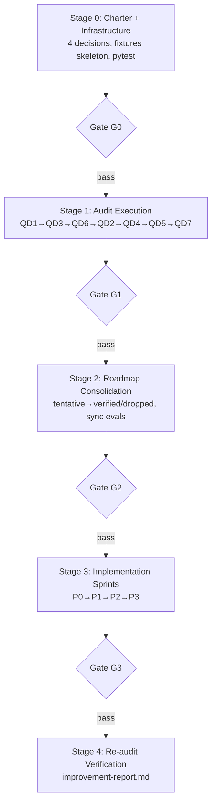

# Plan: Rà soát & Đánh giá 7 Quality Dimensions của `wf-fix-bugs`

> **Phiên bản:** v1.1.0
> **Tạo ngày:** 2026-05-08
> **Skill target:** `wf-fix-bugs` v7.4.0
> **Phương án thực thi:** D — Phased Plan with Evidence Gates (DEC-001)
> **Trạng thái:** 🟢 Plan v1.1 COMPLETE — sẵn sàng vào Stage 0

## Mục tiêu

Rà soát toàn diện cách thực thi (implementation) của 7 quality dimensions trong skill `wf-fix-bugs`, phát hiện điểm yếu, false positive/negative tiềm ẩn, edge cases bị miss, và đề xuất kế hoạch cải thiện có thể action được.

## Tại sao cần plan này

QD1 đã được phân tích sơ bộ và phát hiện **3 hạn chế lớn**:
1. Stack bias (Node/JS-centric, miss .NET/Java/Python backends)
2. MAX_PAGES=20 quá thấp cho module lớn
3. CTA detection EN-only (miss tiếng Việt)

Cần làm tương tự cho QD2-QD7 + tổng hợp cross-cutting issues + roadmap fix có evidence-based.

---

## 🚀 Quick Start

### Triển khai cross-session (recommended)

Plan cần nhiều phiên làm việc → dùng `EXECUTION-PROMPT.md` làm "save game":

```
# Đầu phiên Claude Code, paste:
Continue plan execution: @plans/wf-fix-bugs-dimensions-audit-v1/EXECUTION-PROMPT.md
```

Claude tự đọc state, identify task, execute, update prompt cho phiên sau. Xem [EXECUTION-PROMPT.md](./EXECUTION-PROMPT.md).

### Đọc plan (lần đầu)

```bash
# 1. Đọc tổng quan (15 phút)
cd d:/Working/MCV3/plans/wf-fix-bugs-dimensions-audit-v1
cat README.md                   # File này
cat 00-master-plan.md           # Mục tiêu, scope, deliverables
cat 01-audit-methodology.md     # 5-phase framework

# 2. Hiểu cấu trúc thực thi
cat 11-stages-and-gates.md      # Stage architecture (G0→G1→G2→G3)
cat 12-decisions-log.md         # 6 decisions đã chốt
cat 13-definition-of-done.md    # DoD criteria per gate

# 3. Chuẩn bị fixtures
cat fixtures/README.md          # Test fixture catalog

# 4. Track tiến độ
cat progress.md                 # Stage progress + IMP status
cat EXECUTION-PROMPT.md         # Operational state (current task, next action)
```

---

## Cấu trúc plan (14 files + fixtures/)

### Foundation (3 files — đọc trước)

| File | Mục đích |
|---|---|
| [README.md](./README.md) | Entry point (file này) |
| [00-master-plan.md](./00-master-plan.md) | Scope, mục tiêu, timeline 5 stages |
| [01-audit-methodology.md](./01-audit-methodology.md) | 5-phase audit framework + report template |

### Per-dimension audits (7 files)

| File | Dim | Trạng thái |
|---|---|---|
| [02-qd1-functional-audit.md](./02-qd1-functional-audit.md) | QD1 Functional Correctness | 🟡 Phase 1+5 draft |
| [03-qd2-business-audit.md](./03-qd2-business-audit.md) | QD2 Business Correctness | ⬜ Template với hints |
| [04-qd3-security-audit.md](./04-qd3-security-audit.md) | QD3 Security Vulnerabilities | ⬜ **HIGH PRIORITY** |
| [05-qd4-performance-audit.md](./05-qd4-performance-audit.md) | QD4 Performance | ⬜ Template |
| [06-qd5-ux-a11y-audit.md](./06-qd5-ux-a11y-audit.md) | QD5 UX + Accessibility | ⬜ Template |
| [07-qd6-data-audit.md](./07-qd6-data-audit.md) | QD6 Data Integrity | ⬜ **HIGH PRIORITY** |
| [08-qd7-compat-audit.md](./08-qd7-compat-audit.md) | QD7 Compatibility | ⬜ Template |

### Synthesis (2 files)

| File | Mục đích |
|---|---|
| [09-cross-cutting-findings.md](./09-cross-cutting-findings.md) | Vấn đề xuyên-dim — pre-seeded 7 themes (1 verified + 2 partial + 4 tentative) |
| [10-improvement-roadmap.md](./10-improvement-roadmap.md) | Roadmap với YAML frontmatter — 11 verified (incl. IMP-000 infra) + 10 tentative (21 IMPs) |

### Execution & Quality (3 files + 1 folder)

| File | Mục đích |
|---|---|
| [11-stages-and-gates.md](./11-stages-and-gates.md) | **Stage architecture canonical** — 5 stages × 4 gates (G0→G1→G2→G3) |
| [12-decisions-log.md](./12-decisions-log.md) | **Decisions log** — DEC-001 đến DEC-006 chốt + template future |
| [13-definition-of-done.md](./13-definition-of-done.md) | **DoD** per phase / per IMP / per stage gate + verify scripts |
| [fixtures/README.md](./fixtures/README.md) | **Test fixture catalog** — 7 fixtures, build order, conventions |

### Tracking & Operational (2 files)

| File | Mục đích |
|---|---|
| [progress.md](./progress.md) | **Canonical tracker** — Stage progress, per-dim status, IMP status, findings count, activity log |
| [EXECUTION-PROMPT.md](./EXECUTION-PROMPT.md) | **Stateful session prompt** — Cho cross-session execution. Claude đọc → execute task → update file |

---

## Reading order

### Cho người mới audit
```
README.md (5 phút)
  → 00-master-plan.md (15 phút)
  → 11-stages-and-gates.md (15 phút) ← Stage architecture
  → 01-audit-methodology.md (15 phút)
  → 13-definition-of-done.md (10 phút)
  → 12-decisions-log.md (5 phút)
  → progress.md → Bắt đầu Stage 0 (build infrastructure)
```

### Cho stakeholder (PM/team-lead) review
```
README.md
  → 00-master-plan.md §1-3 (scope + deliverables)
  → 11-stages-and-gates.md (timeline + gates)
  → 10-improvement-roadmap.md (xem priorities + evidence_status)
  → 12-decisions-log.md (decisions đã chốt)
  → progress.md (current status)
```

### Cho skill-author team (sau khi audit done — Stage 3)
```
10-improvement-roadmap.md (Section A Verified IMPs)
  → 02-08 (audit reports cho dim liên quan)
  → 09-cross-cutting-findings.md (root cause)
```

---

## Workflow tóm tắt



> Chi tiết: [11-stages-and-gates.md](./11-stages-and-gates.md)

---

## Deliverables (xem chi tiết DoD trong [13-definition-of-done.md](./13-definition-of-done.md))

### Required outputs
1. ✅ 7 audit reports đầy đủ (1 per dim, ≥ 200 dòng)
2. ✅ Cross-cutting findings document (≥ 7 themes verified)
3. ✅ Improvement roadmap (≥ 20 IMP items với YAML frontmatter, evidence_status verified)
4. ✅ 7 test fixtures với accuracy reports (Precision/Recall/F1)
5. ✅ 4 sprint reports + 1 final report + 1 improvement report (Stage 4)
6. ✅ Decision log với rationale per decision
7. ✅ Pytest harness regression-tests (DEC-004)

### Findings minimum
- 21+ False Positive scenarios
- 21+ False Negative scenarios
- 35+ Edge cases
- 21+ Recommendations
- **Tổng ≥ 100 findings actionable**

### Quality gate
- ≥ 80% findings có file:line + reproduce
- Roadmap: P0 ≤ 20%, P1 ~ 35%, P2 ~ 30%, P3 ≤ 15%
- Tất cả IMPs ∈ {verified, dropped} trước Stage 3 (G2 gate)
- Stage 4 re-audit shows precision/recall improvement

---

## Decisions đã chốt

Xem [12-decisions-log.md](./12-decisions-log.md):

| ID | Title | Choice |
|---|---|---|
| DEC-001 | Phương án thực thi | D — Phased Plan with Evidence Gates |
| DEC-002 | Số owner audit | 1 owner sequential, parallel-ready |
| DEC-003 | Performance benchmark | Selective (≥60s hoặc agent type) |
| DEC-004 | Regression test suite | Yes — pytest |
| DEC-005 | Output format roadmap | MD primary với YAML frontmatter |
| DEC-006 | Sync evals/ | Yes — sync sau G2 |

---

## Risks & Mitigation

| Risk | Likelihood | Impact | Mitigation |
|---|:-:|:-:|---|
| Audit không hoàn thành đúng timeline | TB | TB | Parallel-ready architecture (DEC-002) |
| Test fixture không representative | Cao | Cao | Cả EUREKA real-world + sample |
| Findings quá nhiều → roadmap khổng lồ | Cao | TB | Strict priority filter, drop P3 nếu cần |
| Sửa probe gây regression | TB | Cao | Plan KHÔNG fix ở Stage 1, chỉ roadmap |
| Stack bias không khắc phục được hết | Cao | TB | Adapter framework (IMP-000) ở Stage 0 |
| IMP impl trên evidence chưa đủ | Cao | Cao | G2 gate enforce evidence_status verified |

> Chi tiết: [00-master-plan.md](./00-master-plan.md) §8

---

## Liên quan (External)

- Skill SKILL.md: `.claude/skills/workflow/wf-fix-bugs/SKILL.md` (v7.4.0)
- Lane skills: `.claude/skills/workflow/wf-fix-{functional,business,security,performance,ux-a11y,data,compat}/` (v2.0.0-alpha.s4)
- Profile config: `.claude/skills/workflow/_shared/profiles.json`
- Adapter framework (IMP-000 sẽ build): `.claude/skills/workflow/_shared/adapters/`
- Original plan v7.x: `plans/wf-fix-bugs-v7/`
- Test target: `D:/Working/EUREKA-2026/` (real-world)

---

## Trạng thái hiện tại

Xem [progress.md](./progress.md) để biết:
- Stage progress (G0/G1/G2/G3)
- Audit per-dim status (5 phases × 7 dim)
- IMP status (verified vs tentative)
- Findings count cumulative
- Test fixtures status
- Activity log + next steps

**Tổng quan:** 🟡 Stage 0 in progress. Files structure ready, cần build adapter framework + fixtures skeleton + pytest infra.

---

## Changelog

| Date | Version | Change |
|---|---|---|
| 2026-05-08 | 1.0.0 | Plan ban đầu với 13 files (foundation + audits + synthesis + tracking) |
| 2026-05-08 | 1.1.0 | Phased Plan with Evidence Gates: thêm 11-stages-and-gates, 12-decisions-log, 13-DoD, fixtures/README. Refactor 00, 02, 09, 10, progress. Roadmap dùng YAML frontmatter (DEC-005). |
| 2026-05-08 | 1.2.0 | Thêm EXECUTION-PROMPT.md cho cross-session execution. Claude tự đọc state → execute → update. |
