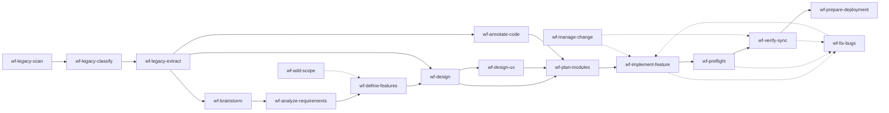

# 02 — Workflow Model: 7 Phases + 3 Paths

> **Mức độ ràng buộc:** Tham khảo (overview)
> **Mục đích:** Mô tả mô hình workflow MCV3 — 7 phases tuyến tính + 3 path nhánh (STANDARD/EXISTING/HYBRID) + skills phụ trợ song hành

---

## 1. Mô hình tổng quát

MCV3 chia chu kỳ phát triển 1 dự án thành **7 phases tuyến tính** (Phase 0 → Phase 6). Mỗi phase:
- Có **đầu vào** rõ ràng (output phase trước)
- Có **đầu ra** rõ ràng (input phase sau)
- Có **skill chính** + agents thực thi
- KHÔNG được skip (CORE-002)

```
Phase 0  →  Phase 1  →  Phase 2  →  Phase 3  →  Phase 4  →  Phase 5  →  Phase 6
Brainstorm  Business    Features   Architecture  UX         Implementation  Deployment
   ↑                                              ↑              ↑              ↑
   │                                              │              │              │
   │           Skill phụ trợ (chạy bất kỳ lúc nào sau Phase 5):                │
   │           /wf-fix-bugs, /wf-preflight, /wf-verify-sync                    │
   │                                                                            │
   └──────────────── 3 Paths: STANDARD / EXISTING / HYBRID ─────────────────────┘
```

---

## 2. Bảy phases — định nghĩa chi tiết

### Phase 0 — Brainstorm

| Mục | Chi tiết |
|-----|----------|
| **Mục tiêu** | Chốt khung dự án từ ý tưởng mơ hồ |
| **Skill chính** | `/wf-brainstorm` |
| **Đầu vào** | Ý tưởng tự do (text), bối cảnh ngành nghề |
| **Đầu ra** | `.mc-data/docs/phase0-brainstorm/` |
| **SSOT seed** | `req-registry.json` được init (rỗng), `project-digest.json` |
| **Đối thoại với user** | CDG-01 (Critical Decision Gate) chốt scope |
| **Skills bổ sung (LEGACY)** | `legacy-decisions.json` tại Phase 0.5.7 |

**Tại sao là Phase đầu tiên:** MCV3 phục vụ người không chuyên — họ không có khung dự án sẵn. Phase 0 biến ý tưởng thành **scope + objectives + constraints** đủ rõ để bắt đầu phân tích.

### Phase 1 — Business Requirements

| Mục | Chi tiết |
|-----|----------|
| **Mục tiêu** | Phân tích nghiệp vụ chi tiết, sinh REQ-IDs |
| **Skill chính** | `/wf-analyze-requirements` |
| **Đầu vào** | `phase0-brainstorm/` + `project-digest.json` |
| **Đầu ra** | `phase1-business/departments/*.md`, `stakeholder-review.md` |
| **Agents** | business-analyst + 1-N domain experts (auto-route theo domain) |
| **Stakeholder review** | Có (Protocol 4) |
| **CDG** | CDG-02 chốt departments + scope nghiệp vụ |

**Mẫu agents huy động:**
- Healthcare project → BA + healthcare-expert + compliance-expert
- E-commerce project → BA + ecommerce-expert + sales-expert + paid-media-expert
- Manufacturing → BA + manufacturing-expert + operations-expert + procurement-expert

### Phase 2 — Features

| Mục | Chi tiết |
|-----|----------|
| **Mục tiêu** | Chuyển requirements thành feature specs chi tiết |
| **Skill chính** | `/wf-define-features` |
| **Đầu vào** | `phase1-business/` + `dept-digests.json` + `phase1-handoff.json` |
| **Đầu ra** | `phase2-features/[sys]/[mod]/[feat].md` (1 feature = 1 file) |
| **SSOT update** | REQ-IDs map → FEAT-IDs trong registry |
| **Agents** | product-expert + business-analyst |
| **Stakeholder review** | Có |

### Phase 3 — Architecture

| Mục | Chi tiết |
|-----|----------|
| **Mục tiêu** | Thiết kế kiến trúc kỹ thuật |
| **Skill chính** | `/wf-design` |
| **Đầu vào** | `phase2-features/` + `feature-briefs.json` |
| **Đầu ra** | `phase3-architecture/` — system arch, API contract, DB schema, integration map, infra spec |
| **Agents** | architect + dba + devops + security + (frontend/mobile theo platform) |
| **SSOT update** | UI-IDs, API-IDs, DB-IDs sinh tự động |
| **Stakeholder review** | Có |

### Phase 4 — UX/UI (Conditional)

| Mục | Chi tiết |
|-----|----------|
| **Mục tiêu** | Thiết kế UX/UI cho dự án có giao diện |
| **Skill chính** | `/wf-design-ux` |
| **Điều kiện chạy** | `interface_type != "api-only"` |
| **Đầu vào** | `phase3-architecture/` + `design-input-digest.json` |
| **Đầu ra** | `phase4-ux/design-system.md`, `phase4-ux/[sys]/Navigation-*.md` |
| **Agents** | ux-designer + ui-designer + ux-architect + brand-guardian + accessibility-auditor |
| **Skip khi** | Project là pure API/backend, microservices, embedded firmware |

**Quy tắc skip phase này:**
- Skip phải explicit trong `req-registry.json.interface_type = "api-only"`
- Skip → đi thẳng Phase 5 (KHÔNG skip Phase 5)

### Phase 5 — Implementation Plans + Code

| Mục | Chi tiết |
|-----|----------|
| **Mục tiêu** | Lập kế hoạch chi tiết + triển khai code thực tế |
| **Skills chính** | `/wf-plan-modules` → `/wf-implement-feature` → `/wf-verify-sync` |
| **Đầu vào** | `phase3-architecture/` + (optional) `phase4-ux/` |
| **Đầu ra** | `phase5-implementation/` — module plan, dependency graph, sprints, tasks per feature + source code |
| **Agents** | architect + developer + dba + qa-lead + code-reviewer |
| **TDD flow** | Write tests → implement → review → verify |
| **SSOT update** | `impl_status` chuyển từ `not_started` → `in_progress` → `done` |

**Phase 5 là phase phức tạp nhất:**
- `wf-plan-modules` phân tích dependency graph
- `wf-implement-feature` TDD theo từng feature
- `wf-verify-sync` đối chiếu code ↔ registry

### Phase 6 — Deployment

| Mục | Chi tiết |
|-----|----------|
| **Mục tiêu** | Tạo tài liệu triển khai + user guide |
| **Skill chính** | `/wf-prepare-deployment` |
| **Đầu vào** | `phase5-implementation/` + `verify-sync.md` |
| **Đầu ra** | `phase6-deployment/` — deployment guide, user guide, ops runbook |
| **Agents** | devops + sre + tech-writer |
| **Pre-go-live** | Stakeholder sign-off |

---

## 3. Ba paths chính

### 3.1. STANDARD PATH — Dự án mới

```
Ý tưởng
   │
   ▼
/wf-brainstorm (P0)
   │
   ▼
/wf-analyze-requirements (P1)
   │
   ▼
/wf-define-features (P2)
   │
   ▼
/wf-design (P3)
   │
   ▼
[có UI?] ─── No ──→ skip ───┐
   │ Yes                     │
   ▼                         ▼
/wf-design-ux (P4)          /wf-plan-modules (P5.1)
   │                         │
   └─────────────────────────▶
                              │
                              ▼
                          /wf-implement-feature (P5.2) ─── iterate per feature
                              │
                              ▼
                          /wf-preflight (Quality)
                              │
                              ▼
                          /wf-verify-sync (P5.3)
                              │
                              ▼
                          /wf-prepare-deployment (P6)

                          /wf-fix-bugs ← bất kỳ lúc nào sau P5.2
```

**Phù hợp khi:** Dự án mới hoàn toàn, không có code có sẵn.

### 3.2. EXISTING PATH — Dự án có code sẵn

```
/wf-legacy-scan (all-in-one)
   │
   ├─ Detect tech stack, modules, dependencies
   ├─ Classify files (core/test/config)
   ├─ Extract requirements + features
   └─ Synthesize project-context.md
   │
   ▼
/wf-brainstorm* (P0)            ← * = shared skills auto-detect LEGACY_MODE
   │
   ▼
/wf-analyze-requirements* (P1)  ← inject legacy context
   │
   ▼
/wf-define-features* (P2)
   │
   ▼
/wf-design* (P3)
   │
   ▼
[annotation gaps?] ─── Yes ──→ /wf-annotate-code (inject REQ-ID vào code)
   │ No
   ▼
[có UI?] ──→ /wf-design-ux* (P4)
   │
   ▼
/wf-plan-modules (P5.1)
   │
   ▼
/wf-implement-feature (P5.2)
   │
   ▼
... tiếp tục như STANDARD path
```

**LEGACY_MODE detection (CORE-021):**
```bash
LEGACY_MODE = test -f .mc-data/work/legacy-scan/project-context.md \
  && [ $(stat -c %s ...project-context.md) -gt 500 ]
```

**Phù hợp khi:** Đã có codebase, cần "hồi sinh" docs + tiếp tục phát triển.

### 3.3. HYBRID PATH — Code có sẵn + idea mới

```
/wf-legacy-scan
   │
   ▼
/wf-brainstorm* ← User nhập IDEA MỚI (bên cạnh legacy)
   │
   ▼
/wf-analyze-requirements* ← phân tích KẾT HỢP legacy + new ideas
   │
   ▼
... tiếp tục như EXISTING path
```

**Phù hợp khi:** Có codebase legacy + muốn thêm modules/features mới đáng kể.

**Phân biệt với EXISTING:** EXISTING chỉ "tái hiện" docs từ code; HYBRID thêm scope mới song song.

---

## 4. Skills phụ trợ (xen ngang)

Không nằm trong 7 phases tuyến tính nhưng có thể trigger bất kỳ lúc nào:

| Skill | Khi chạy | Kết quả |
|-------|----------|---------|
| `/wf-preflight` | Sau Phase 5, trước Phase 6, trước go-live | Health check báo PASS/WARN/FAIL |
| `/wf-fix-bugs` | Bất kỳ lúc nào sau khi có code | Multi-dimension bug detection + auto-fix |
| `/wf-verify-sync` | Sau khi code change | Đối chiếu code ↔ registry, update `impl_status` |
| `/wf-add-scope` | Khi cần thêm modules/features | APPEND-only vào registry, không sửa existing |
| `/wf-manage-change` | Khi requirements thay đổi | Phân tích impact → update docs + code |
| `/wf-scan-target` | Khi cần audit 1 module/URL/path | Standalone, không thuộc pipeline |
| `/wf-diagram` | Khi cần sơ đồ UML/ERD | Standalone, từ source code |
| `/wf-test-business-workflow` | Khi cần test business logic | Multi-step scenarios |

### Skills E2E Testing (9 skills `wf-e2e-*`)

Tạo thành pipeline con cho live testing:

```
/wf-e2e-finding (F0a — phân tích, KHÔNG test)
   │
   ▼
/wf-e2e-credentials (F0 — vault credentials)
   │
   ▼
/wf-e2e-verify (F0→F8 — live test cycle)
   │
   ├─→ /wf-e2e-test, /wf-e2e-browser, /wf-e2e-demo, /wf-e2e-fix...
   └─→ /wf-e2e-batch (orchestrator N feats parallel)
```

Xem [`../06-user-guides/wf-e2e-pipeline-v8-guide.md`](../wf-e2e-pipeline-v8-guide.md) (sẽ migrate ở W4).

### Skills Audit (self-quality DEVKIT)

| Skill | Mục đích |
|-------|----------|
| `/audit-devkit` | Self-audit toàn diện DEVKIT |
| `/audit-devkit-scan` | Scan components, build ground truth |
| `/audit-devkit-verify` | Cross-validate references |
| `/audit-devkit-fix` | Auto-fix với per-fix verification |
| `/audit-skill-output` | So sánh actual output vs SKILL.md design |
| `/audit-agents` | Audit agent + knowledge compliance |

---

## 5. Quy tắc workflow

### 5.1. Không skip phase (CORE-002)

```
❌ User chạy /wf-define-features khi chưa chạy /wf-analyze-requirements
→ PRE-GATE FAIL: phase1-business/ rỗng → block

✅ Phải hoàn thành P1 (PASS POST-GATE T1→T4) trước khi vào P2
```

### 5.2. Phase 4 có thể skip (conditional)

```
Project = api-only → set req-registry.json.interface_type = "api-only"
→ /wf-plan-modules đọc → biết Phase 4 không cần
→ KHÔNG block khi user gọi /wf-plan-modules ngay sau /wf-design

Nhưng nếu interface_type = "web" + Phase 4 thiếu:
→ /wf-plan-modules PRE-GATE WARN → hỏi user xác nhận
```

### 5.3. Phase 5 có thể lặp nhiều lần

```
Iteration 1: implement feat-A → preflight → verify-sync → có lỗi
Iteration 2: fix-bugs → re-implement → preflight → verify-sync → PASS
Iteration N: thêm feat-B → ...
```

`/wf-implement-feature` là **stateful per feature** — track qua `impl_status` trong registry + `impl-status.json` per session.

### 5.4. Stakeholder Review Gate

| Phase | Required SO doc | Skill kiểm tra |
|-------|----------------|----------------|
| P1 | `phase1-business/stakeholder-review.md` | P2 PRE-GATE đọc |
| P2 | (không có) | — |
| P3 | `phase3-architecture/stakeholder-review.md` | P4/P5 PRE-GATE đọc |
| P4 | `phase4-ux/stakeholder-review.md` | P5 PRE-GATE đọc |
| P5 | `phase5-implementation/stakeholder-review.md` | P6 PRE-GATE đọc |

Stakeholder review **không bắt buộc PASS** — chỉ cần tồn tại + có user_response section. Bypass có thể qua CDG.

### 5.5. Critical Decision Gates (CDG)

13 điểm CDG nằm rải rác qua phases. User PHẢI confirm tại các điểm critical:

- CDG-01: Chốt scope dự án (Phase 0)
- CDG-02: Chốt departments + domain experts (Phase 1)
- CDG-03: Chốt MVP feature list (Phase 2)
- CDG-04: Chốt architecture style (Phase 3)
- ... (xem [`../03-design-patterns/10-cdg-gate.md`](../03-design-patterns/10-cdg-gate.md))

---

## 6. Mối quan hệ cross-skill



Chi tiết dependency từng cặp skill: [`09-dependencies-graph.md`](09-dependencies-graph.md).

---

## 7. Quyết định path-routing

```
Bắt đầu — User có gì?
│
├─ Chỉ có ý tưởng (no code) → STANDARD PATH
│
├─ Có code + muốn tài liệu hóa lại
│   │
│   ├─ Không thêm scope mới → EXISTING PATH (pure refactor doc-first)
│   │
│   └─ Có thêm scope mới → HYBRID PATH
│
└─ Có code + muốn thêm 1 feature nhỏ → /feature-addition (skip P0-P1, vào P3+)
```

---

## 8. Anti-patterns workflow

| ❌ Anti-pattern | ✅ Đúng |
|----------------|---------|
| Chạy `/wf-implement-feature` trước `/wf-design` | PRE-GATE block, phải có Phase 3 docs |
| Skip Phase 1 vì "đã rõ requirements" | Vẫn PHẢI có `phase1-business/` (CORE-024) |
| Tự thêm REQ-ID không qua skill | Skill là PRIMARY/SEED owner; manual thêm gây drift |
| Chạy Phase 4 cho project api-only | Skip explicit qua `interface_type` |
| Cancel `/wf-fix-bugs` giữa Phase 4 (Find Bugs) | Dùng `--resume` để tiếp tục, không restart |
| Bypass stakeholder review để tăng tốc | Tạo file SO rỗng + user_response còn hơn không có |
| Modify Phase 3 docs trực tiếp sau Phase 5 | Dùng `/wf-manage-change` để track impact |

---

## 9. Khi nào dùng orchestrator workflows

| Lệnh | Mục đích | Khi nào |
|------|----------|---------|
| `/new-project` | Chạy STANDARD path từ đầu đến cuối | Dự án mới, user không muốn quản lý phase-by-phase |
| `/existing-project` | Onboard legacy + full workflow | Có codebase, muốn migrate sang MCV3 governance |
| `/feature-addition` | Thêm 1 feature vào dự án đã có | Đã có Phase 3 docs + code, chỉ cần extend |

3 orchestrators này **không thay thế skills**, chúng gọi tuần tự các skills + handle handoff.

---

## 10. Liên kết

- **System layers:** [`01-system-layers.md`](01-system-layers.md) — 2 lớp Skills + Agents
- **Skills catalog:** [`07-skills-catalog.md`](07-skills-catalog.md) — Inventory đầy đủ 43 skills
- **Dependencies graph:** [`09-dependencies-graph.md`](09-dependencies-graph.md) — Dependency chi tiết
- **Hooks & Gates:** [`05-hooks-and-gates.md`](05-hooks-and-gates.md) — Gate flow chi tiết
- **CDG pattern:** [`../03-design-patterns/10-cdg-gate.md`](../03-design-patterns/10-cdg-gate.md)
- **Standards:** [`../02-standards/02-skill-standard.md`](../02-standards/02-skill-standard.md), [`../02-standards/05-quality-gates.md`](../02-standards/05-quality-gates.md)
- **Source:** [`docs/project-description.md`](../project-description.md), [`CLAUDE.md`](../../CLAUDE.md)
