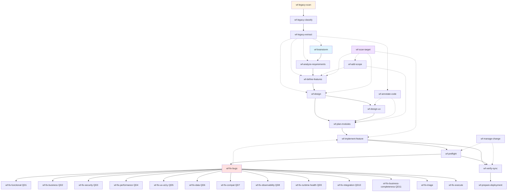
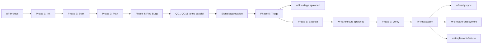

# 09 — Skills Dependencies Graph

> **Mức độ ràng buộc:** Tham khảo (overview) — slim rewrite từ [`docs/skills-dependency-graph.md`](../skills-dependency-graph.md) (legacy, sẽ migrate trong W4)
> **Mục đích:** Mô tả dependency giữa các skills MCV3 — ai sản xuất, ai consume — qua diagram + bảng

---

## 1. Dependency Graph — Diagram tổng



**Ký hiệu:**
- `→` solid arrow: hard dependency (PRE-GATE block nếu thiếu)
- `-.->` dotted arrow: soft/optional dependency (flag `--from-X` để consume)

---

## 2. Phase layers

### Pre-phase0 — Legacy Discovery (optional)

| Skill | Consumes | Produces |
|-------|----------|----------|
| wf-legacy-scan | (entry, có path arg) | inventory, project-context.md, project-profile.json |
| wf-legacy-classify | wf-legacy-scan outputs | classified/, glossary |
| wf-legacy-extract | wf-legacy-classify outputs | extracted/, module-code-mapping.json |

### Phase 0 — Brainstorm

| Skill | Consumes | Produces |
|-------|----------|----------|
| wf-brainstorm | (entry) hoặc legacy-extract (LEGACY) | `phase0-brainstorm/`, init `req-registry.json`, `project-digest.json`, `legacy-decisions.json` (LEGACY) |

### Phase 1 — Business

| Skill | Consumes | Produces |
|-------|----------|----------|
| wf-analyze-requirements | `phase0-brainstorm/`, `project-digest.json` | `phase1-business/`, `dept-digests.json`, `phase1-handoff.json` |

### Phase 2 — Features

| Skill | Consumes | Produces |
|-------|----------|----------|
| wf-define-features | `phase1-business/`, `dept-digests.json`, `phase1-handoff.json` | `phase2-features/[sys]/[mod]/[feat].md`, `feature-briefs.json` |

### Phase 3 — Architecture

| Skill | Consumes | Produces |
|-------|----------|----------|
| wf-design | `phase2-features/`, `feature-briefs.json` | `phase3-architecture/`, `design-input-digest.json` |

### Phase 4 — UX (conditional)

| Skill | Consumes | Produces |
|-------|----------|----------|
| wf-design-ux | `phase3-architecture/`, `design-input-digest.json` | `phase4-ux/design-system.md`, navigation specs, `ux-input-digest.json` |

### Phase 5 — Implementation Plans + Code

| Skill | Consumes | Produces |
|-------|----------|----------|
| wf-plan-modules | `phase3-architecture/`, (optional) `phase4-ux/`, `ux-input-digest.json` | `phase5-implementation/{module-plan.md, dependency-graph.md, sprints/, tasks/}` |
| wf-implement-feature | `phase5-implementation/tasks/[sys]/[mod]/[feat]-impl.md`, registry | Source code, `impl-status.json`, registry update |

### Phase 6 — Deployment

| Skill | Consumes | Produces |
|-------|----------|----------|
| wf-prepare-deployment | `phase5-implementation/`, `verify-sync.md` | `phase6-deployment/` |

---

## 3. Quality gates (cross-phase)

| Skill | Consumes | Produces |
|-------|----------|----------|
| wf-preflight | Code + `req-registry.json` + tests | `preflight-report.md`, `preflight-impact.json` (schema preflight-impact-v1) |
| wf-verify-sync | Code + `req-registry.json` + (optional) preflight-impact.json | `verify-sync.md`, `verify-sync-impact.json` |

---

## 4. Fix Bugs pipeline (cross-phase orchestrator)



### Lane skills (spawned bởi wf-fix-bugs Phase 4)

11 lane skills chạy song song (max 10 concurrent — CORE-025):

| Lane | Skill | SKIP nếu |
|------|-------|---------|
| QD1 | wf-fix-functional | — |
| QD2 | wf-fix-business | — |
| QD3 | wf-fix-security | — |
| QD4 | wf-fix-performance | — |
| QD5 | wf-fix-ux-a11y | api-only |
| QD6 | wf-fix-data | — |
| QD7 | wf-fix-compat | — |
| QD8 | wf-fix-observability | — |
| QD9 | wf-fix-runtime-health | api-only, --no-browser |
| QD10 | wf-fix-integration | không có cross-module deps, profile=quick |
| QD11 | wf-fix-business-completeness | single module, api-only, profile=quick |

---

## 5. Incremental skills (cross-phase, optional)

| Skill | Consumes | Produces | Wired qua flag |
|-------|----------|----------|----------------|
| wf-add-scope | `req-registry.json` + (optional) `wf-scan-target/target-map.json` | registry APPEND, `scope-impact.json` | `--from-add-scope` |
| wf-manage-change | `req-registry.json` + code + (optional) preflight | `change-report.md`, `change-impact.json` (schema change-impact-v1) | `--from-manage-change` (WIRED) |
| wf-migrate-module | source path + registry | registry update, code refactor | — |

---

## 6. Standalone skills (không thuộc main pipeline)

| Skill | Optional consume by |
|-------|---------------------|
| wf-scan-target | wf-add-scope, wf-define-features, wf-design, wf-implement-feature qua `--from-scan` |
| wf-diagram | — (output là docs UML cho human) |
| wf-test-business-workflow | — (run independently) |
| ui-ux-pro-max | — (run independently) |

---

## 7. Cross-skill artifacts table

Artifacts được produce bởi skill này và optional consume bởi skill khác qua flag `--from-{skill}`:

| Artifact | Producer | Consumers (via flag) |
|----------|----------|---------------------|
| `fix-impact.json` (fix-impact-v1) | wf-fix-bugs Phase 7 | wf-verify-sync, wf-prepare-deployment, wf-implement-feature (`--from-fix-bugs` v2.1+) |
| `preflight-impact.json` (preflight-impact-v1) | wf-preflight | wf-fix-bugs, wf-prepare-deployment, wf-verify-sync (`--from-preflight`) |
| `verify-sync-impact.json` | wf-verify-sync | wf-prepare-deployment, wf-fix-bugs, wf-implement-feature (`--from-verify-sync`) |
| `change-impact.json` (change-impact-v1) | wf-manage-change | wf-verify-sync, wf-preflight, wf-implement-feature (`--from-manage-change` v4.1.0+ WIRED) |
| `scope-impact.json` | wf-add-scope | wf-verify-sync, wf-preflight, wf-implement-feature (`--from-add-scope`) |
| `target-map.json` | wf-scan-target | wf-add-scope, wf-define-features, wf-design, wf-implement-feature (`--from-scan`) |

**Quy tắc:**
- Mỗi artifact PHẢI có `$schema` + `audit_chain` (CORE-036)
- Wired = có flag handle code trong consumer
- Một số mới ở giai đoạn OPT-IN — chưa enforce

---

## 8. Bottleneck analysis — Skill nào blocking nhất?

| Skill | Số downstream phụ thuộc | Lý do |
|-------|------------------------|-------|
| wf-brainstorm | 7 (mọi phase) | Init registry — không có → mọi skill block |
| wf-design (Phase 3) | 4 (wf-design-ux, wf-plan-modules, wf-implement-feature gián tiếp) | Architecture là input cho mọi downstream |
| wf-define-features (Phase 2) | 3 (wf-design, wf-implement-feature, wf-fix-execute) | Feature specs cho mọi feature work |
| wf-plan-modules (Phase 5.1) | 1 nhưng critical (wf-implement-feature) | Task files cho TDD |
| wf-implement-feature (Phase 5.2) | 3 (wf-preflight, wf-verify-sync, wf-fix-bugs) | Code là pre-req cho QA |

**Insight:** Phase 0-1-2-3 là backbone — không thể skip. Phase 4 conditional. Phase 5-6 + Fix Bugs có thể lặp.

---

## 9. Resume routing

Khi user chạy `--resume`:

```
1. Skill đọc fix-status.json (hoặc state file tương đương)
   ↓
2. Xác định last completed phase
   ↓
3. Stale check: lock age > 30 min → auto-release
   ↓
4. Route đến next_action
   ↓
5. Re-validate PRE-GATE trước khi tiếp tục
```

Skills hỗ trợ `--resume`: wf-fix-bugs, wf-legacy-scan, wf-implement-feature, wf-define-features, wf-manage-change, wf-scan-target, wf-diagram, wf-add-scope.

---

## 10. Update graph khi thêm skill mới

Khi tạo skill mới:
1. Xác định **produces_for** (skill này output gì cho ai)
2. Xác định **consumes_from** (skill này cần input từ ai)
3. Đăng ký trong `_contract.json.cross_skill_contracts`
4. Update bảng tại §3-§7 file này
5. Update Mermaid diagram tại §1
6. Re-run `./.claude/scripts/validate-schema-sync.sh --all`

---

## 11. Anti-patterns

| ❌ Anti-pattern | ✅ Đúng |
|----------------|---------|
| Skill A consume skill B output mà không declare `consumes_from` | Phải declare để audit detect |
| Hardcode path output skill khác trong skill mới | Đọc canonical từ [`../02-standards/11-output-path-contract.md`](../02-standards/11-output-path-contract.md) |
| Skip Phase trung gian (vd: Phase 1) | KHÔNG được (CORE-002) — chạy đủ tuần tự |
| Skill A và B cùng ghi `requirements[].impl_status` | Chỉ 1 PRIMARY/SAFE-UPDATE — xem [`../02-standards/06-safe-write-protocol.md`](../02-standards/06-safe-write-protocol.md) |
| Circular dependency (A → B → A) | KHÔNG được — graph phải DAG |

---

## 12. Liên kết

- **Workflow model:** [`02-workflow-model.md`](02-workflow-model.md) — 3 paths
- **Skills catalog:** [`07-skills-catalog.md`](07-skills-catalog.md) — Inventory đầy đủ
- **Output Path Contract:** [`../02-standards/11-output-path-contract.md`](../02-standards/11-output-path-contract.md)
- **Cross-Skill Artifacts pattern:** [`../03-design-patterns/03-cross-skill-artifacts.md`](../03-design-patterns/03-cross-skill-artifacts.md)
- **Canonical Protocol 21:** [`.claude/skills/protocols/21-cross-skill-output-path-contract.md`](../../.claude/skills/protocols/21-cross-skill-output-path-contract.md)
- **Source legacy:** [`../skills-dependency-graph.md`](../skills-dependency-graph.md) (sẽ migrate W4)
