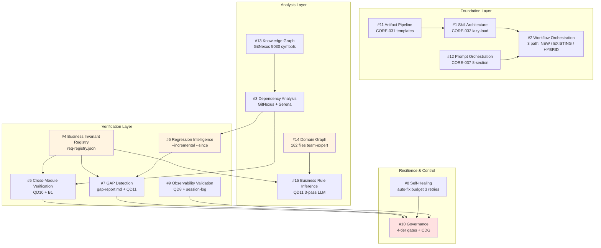

# 10 — MCV3 Engines Overview

> **Mức độ ràng buộc:** Tham khảo (overview) — đọc khi muốn hiểu **kiến trúc tổng** dưới góc nhìn 15 "engine" cross-cutting, **không** phải checklist per-skill
> **Mục đích:** Bản đồ ánh xạ 15 năng lực kiến trúc thường được kỳ vọng ở một AI software factory (skill architecture, dependency engine, knowledge graph, ...) vào skill/rule/file **đã có** trong MCV3 — giúp contributor và reviewer định vị nhanh "engine X nằm ở đâu, ai chịu trách nhiệm".
>
> **Nguyên tắc:** 15 engines này là **cross-cutting concerns** trải khắp 38 skills + 62 agents. Tài liệu này KHÔNG yêu cầu mỗi skill phải có 15 file design — chỉ bảo skill author biết khi nào engine X được kích hoạt và đặc tả ở đâu.

---

## 1. Bản đồ 15 engines

| # | Engine | Trạng thái MCV3 | SSOT chính | Skills liên quan | Rules chốt |
|---|--------|-----------------|------------|------------------|-----------|
| 1 | **Skill architecture** | ✅ Đầy đủ | [`.claude/skills/workflow-skill.md`](../../.claude/skills/workflow-skill.md) v3.0 + [`_template/`](../04-skill-design/_template/) | Tất cả `wf-*` | CORE-032 (lazy-load), CORE-035 (phase output) |
| 2 | **Workflow orchestration** | ✅ Đầy đủ | [`02-workflow-model.md`](02-workflow-model.md) + [`09-dependencies-graph.md`](09-dependencies-graph.md) | `workflows/new-project`, `existing-project`, `feature-addition`; wf-fix-bugs (orchestrator 11 lanes); wf-e2e-batch | CORE-002 (không skip phase), CORE-007 (cross-skill output) |
| 3 | **Dependency analysis engine** | ✅ Qua CI | GitNexus (`impact()`, `query()`, ISG) + Serena (`find_referencing_symbols`) | wf-plan-modules, wf-fix-integration (QD10), wf-implement-feature pre-check | CORE-033 (CI-first), Protocol 20 |
| 4 | **Business invariant registry** | ⚠ Partial | `req-registry.json` (REQ/FEAT/impl_status); business rules nằm rải rác trong `phase1-business/`, `phase2-features/[feat].md` §invariants | wf-analyze-requirements (sinh), wf-define-features (mở rộng), wf-fix-business (QD2), wf-fix-business-completeness (QD11) | CORE-004 (registry SSOT), CORE-006 (Safe-Write) |
| 5 | **Cross-module verification engine** | ✅ Đầy đủ | `cross-module-gaps.md` (wf-e2e-finding F0a) + lane QD10 outputs | wf-fix-integration (QD10), wf-e2e-verify (B1), wf-verify-sync | CORE-018 (cross-validate naming) |
| 6 | **Regression intelligence engine** | ⚠ Basic | GitNexus `detect_changes()` + git `--since=<ref>` | wf-legacy-scan (`--incremental --since`), wf-fix-bugs (changed files priority), wf-scan-target | CORE-007 (output path), không có CORE riêng — leverage Git |
| 7 | **GAP detection engine** | ✅ Phân tán | `gap-report.md` (wf-scan-target `--compare`), `phase{X}-handoff.json` deviation flags, QD11 LLM 3-pass | wf-legacy-scan, wf-scan-target, wf-fix-business-completeness (QD11), wf-verify-sync | CORE-019 (Feature-Level Code Verification) |
| 8 | **Self-healing engine** | ✅ Basic | `$SESSION_DIR/error-ledger.json` + auto-fix loop trong procedures | wf-fix-execute (Phase 3-5 loop), mọi skill có auto-fix budget | CORE-034 (auto-fix budget 3 retries) |
| 9 | **Observability validation** | ✅ Đầy đủ | `session-log.json` (execution trace) + lane QD8 outputs | wf-fix-observability (QD8) | CORE-026 (Execution Trace), Protocol 22 (R/W lock) |
| 10 | **Governance model** | ✅ Rất mạnh | 4-tier gate (PRE→POST→CDG→Hook) + Safe-Write Protocol per-skill + audit_chain checksum | Tất cả skills (universal); CDG có 7 trigger points | CORE-006, CORE-011, CORE-012, CORE-027 (CDG), CORE-029 (Agent Output Spot-Check) |
| 11 | **Artifact generation pipeline** | ✅ Đầy đủ | 40 templates trong [`.claude/doc-framework/`](../../.claude/doc-framework/) + [`.claude/skills/workflow/[skill]/templates/`](../../.claude/skills/workflow/) | Tất cả skills (READ→POPULATE→WRITE) | CORE-031 (Template Usage), Protocol 19 |
| 12 | **Prompt orchestration strategy** | ✅ Đầy đủ | [`_template/agent-prompt.md`](../04-skill-design/_template/agent-prompt.md) (8 sections) + agent procedures (61 dirs) | Mọi skill spawn agent | CORE-037 (Agent Prompt Templates), CORE-025 (parallel concurrency 10) |
| 13 | **Knowledge graph strategy** | ✅ Qua CI | GitNexus knowledge graph (5030 symbols, 5584 relationships, 6 execution flows) + Serena LSP | Toàn bộ skill có code-touch | CORE-033 (CI-first), Protocol 20 |
| 14 | **Domain graph strategy** | ⚠ Partial | [`.claude/references/team-expert/`](../../.claude/references/team-expert/) (162 files, 29 domains) — file-based, **chưa có graph relationship** giữa concepts | 24 domain experts + 06-domain rules | CORE-005 (Vietnamese docs), domain-specific compliance trong [`.claude/rules/06-domain.md`](../../.claude/rules/06-domain.md) |
| 15 | **Business rule inference strategy** | ✅ Đầy đủ | QD11 3-pass LLM (cross-module pattern → domain heuristic → registry gap) → enhancement suggestions qua CDG | wf-fix-business-completeness (QD11), wf-analyze-requirements (domain spawn) | CORE-027 (CDG ACCEPT/REJECT), BHV-001 (Think Before Coding) |

**Tóm tắt:** 12/15 ✅ Đầy đủ, 3/15 ⚠ Partial (#4, #6, #14).

---

## 2. Diagram quan hệ giữa 15 engines

**Ký hiệu:**
- Box vàng nhạt: ⚠ Partial — có gap có thể nâng cấp tương lai (xem §4)
- Box đỏ nhạt: governance layer — bao trùm mọi engine

---

## 3. Định vị engine khi tạo skill mới

Khi skill author tạo skill mới, dùng bảng dưới để xác định engine nào cần đặc tả thêm trong design canon ([`docs/04-skill-design/{skill}/`](../04-skill-design/)).

| Tình huống skill | Engines liên quan | Đặc tả ở file nào trong design canon |
|------------------|-------------------|--------------------------------------|
| Skill có >3 phases | #1, #2, #11 | `03-phase-routing.md` (flow + gates), `07-procedures-structure.md` |
| Skill spawn agent | #12 | `agent-prompt.md` (CORE-037 8-section) |
| Skill đọc/phân tích code | #3, #13 | `04-file-contract.md` §CI context, [Protocol 20](../../.claude/skills/protocols/20-code-intelligence.md) |
| Skill đọc/sửa registry | #4, #10 | `04-file-contract.md` §6 Business invariants (NEW), `05-registry-safe-write.md` Protocol |
| Skill cross-module check | #5, #7 | `02-quality-dimensions.md` (cho lane) hoặc `01-vision-principles.md` §scope |
| Skill incremental/diff-aware | #6 | `03-phase-routing.md` §6 Regression-aware skipping (NEW) |
| Skill chạm domain knowledge | #14, #15 | `01-vision-principles.md` §7 Domain context (NEW) |
| Skill có gate user-quyết | #10 (CDG) | `05-error-codes.md` §E090-E099, [Protocol 16](../../.claude/skills/protocols/16-critical-decision-gate.md) |
| Skill long-running, có resume | #8, #10 | `07-procedures-structure.md` §resume-status.md |
| Skill spawn lanes parallel | #2, #12 | `08-user-scenarios-solutions.md` (orchestrator variant) |

---

## 4. Roadmap nâng cấp 3 engine partial

### 4.1 #4 Business Invariant Registry — tăng độ chi tiết

**Hiện trạng:** `req-registry.json` lưu REQ-ID/FEAT-ID/impl_status nhưng business invariants (rules, constraints, postconditions) trải rác trong `phase1-business/` markdown — khó query, khó cross-validate.

**Đề xuất (chưa cam kết):**
- Thêm trường `invariants[]` vào mỗi requirement trong registry: `{id, kind: precondition|postcondition|invariant, expression, source_doc}`
- Cập nhật wf-analyze-requirements + wf-define-features producer
- Cập nhật wf-fix-business (QD2) consumer

**Cost:** Medium (schema bump v2→v3, migration script, 4 skill update).
**Khi cần:** Khi QD11 cần basis chính xác để detect MISSING_BUSINESS_RULE (hiện đang LLM-infer, có thể có false positive).

### 4.2 #6 Regression Intelligence — từ "diff-aware" sang "predict/prioritize"

**Hiện trạng:** Chỉ check files changed (Git-aware). Không có prediction "thay đổi này sẽ ảnh hưởng probe nào / module nào tiếp theo".

**Đề xuất:**
- Tận dụng GitNexus impact graph + `git log` history → predictive impact scoring
- wf-fix-bugs prioritize lanes dựa trên hot spots
- wf-implement-feature warn nếu touch file >X callers

**Cost:** High (cần ML/heuristic model).
**Khi cần:** Khi codebase >50K LOC và `--profile=exhaustive` quá chậm.

### 4.3 #14 Domain Graph — từ file-based sang relationship graph

**Hiện trạng:** 162 file knowledge text. Không express "domain A depends on domain B" hoặc "concept X conflict concept Y".

**Đề xuất:**
- Tạo `.claude/references/team-expert/_graph/relationships.json` — edges giữa concepts, compliance overlaps
- Domain agent đọc graph khi multi-domain task (vd: healthcare + finance compliance)

**Cost:** Medium (1 person-week để map relationship + script generator).
**Khi cần:** Khi dự án cross-domain >3 (vd: ecommerce + finance + logistics) gây expert conflict.

---

## 5. Anti-patterns — KHÔNG làm

❌ **Bloat `_template/` thành 15 file** — vi phạm BHV-002 (Simplicity First), checklist 10-step phình thành 25-step, contributor fatigue.

❌ **Tạo "Engine X skill" cho mỗi engine** — vi phạm BHV-002 + CORE-032; engines là cross-cutting concerns, đã được phân tán đúng chỗ trong 38 skills hiện có.

❌ **Refactor engines đã ✅ Đầy đủ** — vi phạm BHV-003 (Surgical Changes); 12/15 engines đang chạy production, không gãy gì.

❌ **Quên cập nhật file này khi thêm engine mới** — bảng §1 PHẢI sync với skill thật. Nếu thêm CORE-039 hoặc skill mới đụng engine partial → cập nhật trạng thái.

---

## 6. Liên kết

- Standards skill anatomy: [`../02-standards/02-skill-standard.md`](../02-standards/02-skill-standard.md)
- Design canon template: [`../04-skill-design/_template/`](../04-skill-design/_template/) + [README.md](../04-skill-design/README.md)
- Workflow model: [`02-workflow-model.md`](02-workflow-model.md)
- Skills dependency graph: [`09-dependencies-graph.md`](09-dependencies-graph.md)
- CI integration: [`04-code-intelligence.md`](04-code-intelligence.md)
- Hooks & Gates: [`05-hooks-and-gates.md`](05-hooks-and-gates.md)
- 22 protocols: [`06-protocols-overview.md`](06-protocols-overview.md)
- Skills catalog: [`07-skills-catalog.md`](07-skills-catalog.md)
- Agents catalog: [`08-agents-catalog.md`](08-agents-catalog.md)
- Rules canon: [`../../.claude/rules/00-core.md`](../../.claude/rules/00-core.md) (CORE-032 → CORE-038)
