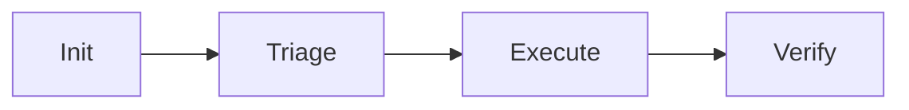

# 02 — Skill Standard (BẮT BUỘC)

> **Mức độ ràng buộc:** BẮT BUỘC (CORE-031, CORE-032, CORE-034, CORE-035, CORE-038, CORE-039)
> **File template gốc:** [`.claude/skills/workflow-skill.md`](../../.claude/skills/workflow-skill.md) (v3.0)
> **Mục đích:** Định nghĩa **anatomy bắt buộc** cho mọi skill MCV3 — vi phạm = audit fail, không merge

---

## 1. Triết lý — tại sao có chuẩn này?

Trước đây, skill MCV3 có 2 dạng:
- **Monolithic** — `SKILL.md` chứa toàn bộ logic ~2000-3000 dòng, mọi session đọc full → context bloat
- **Lazy-load** — `SKILL.md` chỉ là routing hub, logic ở `procedures/phase{N}-*.md`, lazy-load khi tới phase

`wf-fix-bugs` v10.0 và `wf-legacy-scan` v5.0 đã chứng minh **lazy-load giảm 70%+ context** so với monolithic. Từ đó CORE-032 chốt: **lazy-load là chuẩn duy nhất** cho mọi skill MCV3 có >3 bước xử lý.

---

## 2. Cấu trúc bắt buộc của 1 skill

```
.claude/skills/workflow/{skill-name}/
├── SKILL.md                    ◀ ≤500 dòng, lean routing hub
├── _contract.json              ◀ Schema "$schema": "skill-contract-v1"
├── README.md                   ◀ (optional) Overview cho contributors
├── procedures/                 ◀ Lazy-load execution logic
│   ├── _shared.md              ◀ Cross-cutting concerns (state vars, atomic write, error handling, CI detection)
│   ├── phase1-{name}.md        ◀ PRE-GATE → Steps → POST-GATE → Report
│   ├── phase2-{name}.md
│   ├── ...
│   ├── phaseN-{name}.md
│   └── resume-status.md        ◀ --resume + --status handlers
├── templates/                  ◀ File templates (mọi output từ template, CORE-031)
│   ├── output-file-1.md
│   └── ...
├── evals/                      ◀ Test cases ≥3
│   └── evals.json
└── scripts/                    ◀ (optional) Bash/Python helpers (KHÔNG inline trong procedure)
    └── helper-*.sh
```

**Quy tắc cứng:**
- `SKILL.md` ≤500 dòng (đếm bằng `wc -l SKILL.md`)
- KHÔNG nhúng bash script inline trong procedure → delegate sang `scripts/`
- Mỗi procedure file CHỈ đọc khi tới phase tương ứng
- Phase transition qua PRE-GATE verify output phase trước → execute → POST-GATE validate

---

## 3. Cấu trúc `SKILL.md` (≤500 dòng)

`SKILL.md` PHẢI có 7 sections theo thứ tự:

### Section 1: Header + Metadata
```markdown
# {Skill Name} (v{version})

> **Mục đích 1 câu** — what + for whom

**Phiên bản:** v{X.Y.Z}
**Ngày cập nhật:** YYYY-MM-DD
**Owner:** {role/team}
```

### Section 2: Arguments
```markdown
## Arguments

| Arg | Type | Default | Mô tả |
|-----|------|---------|-------|
| `--scope` | string | `all` | Phạm vi scan |
| `--profile` | enum | `standard` | quick/standard/deep/exhaustive |
| `--resume` | flag | — | Resume session đang dở |
| `--status` | flag | — | Xem trạng thái session hiện tại |
```

### Section 3: Phase Routing Map
```markdown
## Phase Routing

| Phase | Tên | Procedure file | Đầu vào | Đầu ra |
|-------|-----|---------------|---------|--------|
| 1 | Init | `procedures/phase1-init.md` | args | `fix-status.json` |
| 2 | Triage | `procedures/phase2-triage.md` | scan results | `fix-plan.md` |
| ... | | | | |

Flow diagram (Mermaid):

```

### Section 4: PRE-GATE / POST-GATE File Contract
```markdown
## File Contract

### PRE-GATE (cần có trước khi chạy)
| File | Yêu cầu | Skill nguồn |
|------|---------|-------------|
| `.mc-data/docs/_meta/req-registry.json` | Tồn tại + `requirements[].length > 0` | wf-brainstorm |

### POST-GATE (sản xuất)
| File | T1 | T2 | T3 | T4 |
|------|----|----|----|----|
| `fix-status.json` | exists | JSON valid | phase != null | session_id match |
```

### Section 5: Error Codes Quick Lookup
```markdown
## Error Codes

| Code | Phase | Ý nghĩa | Auto-fix |
|------|-------|---------|----------|
| E001 | Pipeline | Session lock conflict | Wait + retry |
| E010 | Phase 1 | Args invalid | ESCALATE |
| ... | | | |
```

### Section 6: Context Budget & Checkpoint
```markdown
## Context & Checkpoint

- Threshold: 65% prep, 80% stop, 90% FORCE STOP (E009)
- Checkpoint files: `fix-status.json`, `session-log.json`, `Phase{N}-report.md`
- Resume command: `/wf-{skill} --resume`
```

### Section 7: Cross-Skill Contract
```markdown
## Cross-Skill

- **Orchestrates:** [wf-fix-triage, wf-fix-execute]
- **Produces for:** wf-verify-sync (artifact: `fix-impact.json` schema fix-impact-v1)
- **Consumes from:** wf-preflight (artifact: `preflight-report.json`)
```

---

## 4. Cấu trúc `procedures/phase{N}-{name}.md`

Mỗi phase procedure file có 4 sections theo thứ tự:

### Section A: Header
```markdown
# Phase {N}: {Tên phase}

**Đầu vào:** [file/state cần có]
**Đầu ra:** [file/state sẽ tạo]
**Auto-fix budget:** 3 retries
```

### Section B: PRE-GATE
```markdown
## PRE-GATE

| Check | Cách kiểm tra | Fail action |
|-------|--------------|-------------|
| 1 | `test -f input.json` | E0{N}0 — file missing |
| 2 | `jq '.field' input.json` | E0{N}1 — structure invalid |
| 3 | `jq '.field.length > 0'` | E0{N}2 — content empty |
```

### Section C: Execution Steps
```markdown
## Steps

| # | Mô tả | Tool | Output |
|---|------|------|--------|
| {N}.1 | Đọc template `templates/output-1.md` | Read | content trong memory |
| {N}.2 | Populate template | Edit | tmp file |
| {N}.3 | Validate JSON (jq) | Bash | pass/fail |
| {N}.4 | Atomic write `mv tmp target` | Bash | output file |
```

### Section D: POST-GATE
```markdown
## POST-GATE

| Tier | Check | Fail action |
|------|-------|-------------|
| T1 | `test -f output.json` | AUTO-FIX 1 |
| T2 | `jq '.' output.json` | AUTO-FIX 2 |
| T3 | `jq '.data | length > 0'` | AUTO-FIX 3 |
| T4 | Cross-ref upstream | E0{N}9 → ESCALATE |
```

### Section E: Phase Report (CORE-028)
```markdown
## Phase Report Template

```markdown
## Phase {N}: {Tên} — PASS|FAIL
Thời gian: 2026-05-15T14:32:00+07:00
**Đã làm:** {1-2 câu, tiếng Việt, cho người không chuyên}
**Kết quả:** {Số liệu chính} + {File đầu ra}
**Tiếp theo:** {Phase kế tiếp hoặc hành động user}
```
```

---

## 5. Cấu trúc `_contract.json`

Schema bắt buộc:

```json
{
  "$schema": "skill-contract-v1",
  "skill": "wf-fix-bugs",
  "version": "10.2.1",
  "phase": "fix",
  "description": "Pure orchestrator cho bug fix pipeline",
  "registry_scope": {
    "fields_owned": ["requirements[].impl_status (SAFE-UPDATE)"]
  },
  "outputs": {
    "working": [
      {
        "path": ".mc-data/work/wf-fix-bugs/sessions/{id}/fix-status.json",
        "template": ".claude/skills/workflow/wf-fix-bugs/templates/fix-status.json",
        "schema_version": "fix-status-v1"
      }
    ],
    "docs": []
  },
  "orchestrates": [
    {
      "skill": "wf-fix-triage",
      "trigger": "after Phase 1 Init",
      "passes": ["fix-status.json"]
    }
  ],
  "produces_for": {
    "wf-verify-sync": ["fix-impact.json (fix-impact-v1)"]
  },
  "consumes_from": {
    "wf-preflight": ["preflight-report.json"]
  }
}
```

Chi tiết schema tại [`04-contract-schema.md`](04-contract-schema.md).

---

## 6. Quy tắc bắt buộc khác

### 6.1. Template Usage (CORE-031)

```
Mọi output file PHẢI: READ template → POPULATE → WRITE
KHÔNG tạo output từ đầu (ad-hoc)
_contract.json outputs.working[] PHẢI có field "template"
Template locations:
  - skills/workflow/{skill}/templates/
  - doc-framework/{phase}/
  - doc-framework/_digests/
  - doc-framework/_meta/

METADATA STRIPPING (CORE-031.b):
  - Xóa _template_notes, _schema_notes trước khi WRITE
```

### 6.2. Session Isolation (CORE-030, CORE-035)

```
SESSION_ID = YYYY-MM-DD-{scope}-{slug}-{NN}
$SESSION_DIR = .mc-data/work/{skill}/sessions/{SESSION_ID}/

Mỗi session là 1 directory ISOLATED:
  - fix-status.json (SSOT pipeline state)
  - session-log.json (CORE-026, APPEND-only)
  - error-ledger.json (CORE-034, APPEND-only)
  - .lock + heartbeat
  - phase{N}-{name}/

INDEX: .mc-data/work/{skill}/_index/sessions.jsonl (APPEND-only)
```

### 6.3. Atomic Write Pattern

Mọi JSON state file:
```bash
# 1. Build vào tmp
echo "$new_content" > "$file.tmp.$$"
# 2. Validate
jq '.' "$file.tmp.$$" > /dev/null || { rm "$file.tmp.$$"; exit 1; }
# 3. Atomic move
mv "$file.tmp.$$" "$file"
```

### 6.4. Agent Spawning (CORE-037)

Skill spawn agent → prompt PHẢI có 8 sections (xem [`01-core-rules-index.md`](01-core-rules-index.md) §12).
Template chuẩn tại [`../03-design-patterns/05-agent-prompt-template.md`](../03-design-patterns/05-agent-prompt-template.md).

### 6.5. CI Integration (CORE-033)

Nếu skill cần đọc/analyze code → BẮT BUỘC có CI PRE-GATE 3-step (Na/Nb/Nc).
Pattern + ví dụ tại [`../03-design-patterns/02-ci-first-integration.md`](../03-design-patterns/02-ci-first-integration.md).

### 6.6. Parallelization Strategy (CORE-039 — BẮT BUỘC cho skill mới)

> Đúc kết từ pattern wf-fix-bugs QD1-QD11 + wf-cmi v2.0 26-lane 3-wave. Áp dụng cho mọi skill mới hoặc khi overhaul. Skill cũ grandfathered (trước 2026-05-16).

**Yêu cầu:** SKILL.md PHẢI có section **"Parallelization Strategy"** liệt kê phase-by-phase với bảng:

| Phase/Step | Mode (PARALLEL/SEQUENTIAL/HYBRID) | Owner agent | Write scope (path tách biệt) | Lý do an toàn | Merge checkpoint |
|-----------|-----------------------------------|-------------|-------------------------------|---------------|------------------|

**Triết lý:** Sau khi đảm bảo accuracy + quality, thiết kế phải **chủ động** tối ưu thời gian xử lý — không mặc định sequential.

**Nếu 100% sequential** → ghi rõ một dòng lý do (vd: "linear data dependency", "single atomic write").

**Pattern parallel-safe ưu tiên dùng:**
- Lane parallel — spawn nhiều `Agent()` cùng 1 message → [`../03-design-patterns/04-parallel-lane-dispatch.md`](../03-design-patterns/04-parallel-lane-dispatch.md)
- Wave dispatch — chia theo dependency graph (vd: wf-cmi 3-wave coordinator)
- Read-then-merge — nhiều reader song song + 1 writer hợp nhất (Safe-Write CORE-006)
- Bash parallel — nhiều bash command độc lập trong cùng response

**Điều kiện cứng (CORE-025):** Contract rõ + 1 file = 1 writer + write scope tách biệt + merge checkpoint.

**KHÔNG song song hóa khi:** Lane sau cần kết quả lane trước, cùng ghi 1 file không lock, output không deterministic dưới race.

---

## 7. Checklist khi tạo skill mới

**Trước khi mở PR:**

- [ ] `SKILL.md` ≤500 dòng (`wc -l SKILL.md`)
- [ ] Có đủ 7 sections trong `SKILL.md` (Header, Args, Phase Routing, File Contract, Error Codes, Context Budget, Cross-Skill)
- [ ] `procedures/_shared.md` + `procedures/phase{N}-*.md` cho mỗi phase
- [ ] `procedures/resume-status.md` cho `--resume` và `--status`
- [ ] `_contract.json` có `"$schema": "skill-contract-v1"` + đầy đủ fields
- [ ] `templates/` có template cho mọi output
- [ ] `evals/evals.json` có ≥3 test cases
- [ ] Error codes namespace không trùng với skill khác (xem [`08-error-code-registry.md`](08-error-code-registry.md))
- [ ] Output paths khớp `11-output-path-contract.md`
- [ ] Naming kebab-case, không Vietnamese diacritics trong file names
- [ ] Phase report template (CORE-028) — tiếng Việt, ≤15 dòng
- [ ] Atomic write cho mọi JSON state
- [ ] Context budget tier (CORE-038) — implement 65/80/90%
- [ ] Đã chạy `./.claude/scripts/skill-compliance-audit.sh {skill}` PASS
- [ ] Đã chạy `./.claude/scripts/validate-schema-sync.sh {skill}` PASS
- [ ] **CORE-039:** Có section "Parallelization Strategy" trong SKILL.md với bảng phase-by-phase (mode + owner + write scope + lý do an toàn + merge checkpoint) — hoặc ghi rõ lý do nếu 100% sequential

**Khi PR:**

- [ ] Tạo `docs/04-skill-design/{skill}/` với 9 file từ `_template/`
- [ ] Tạo `docs/05-review-standards/{skill}.md` từ `_template-common.md`
- [ ] Update `docs/01-architecture/07-skills-catalog.md`

---

## 8. Anti-patterns — KHÔNG được làm

| ❌ Anti-pattern | ✅ Đúng |
|----------------|---------|
| `SKILL.md` >500 dòng | Tách logic sang `procedures/` |
| Inline bash 50+ dòng trong procedure | Delegate sang `scripts/{skill}/helper-*.sh` |
| Mỗi run ghi đè session cũ | Session isolation `sessions/{id}/` |
| POST-GATE chỉ check T1 (exists) | Phải đủ T1→T4 |
| `impl_status` downgrade từ `done` → `not_started` | KHÔNG (CORE-008) |
| 2 agents song song cùng ghi 1 file | 1 file = 1 writer (CORE-037 §7) |
| Hardcode "must have GitNexus" | Auto-detect + fallback (CORE-033) |
| Error retry vô hạn | Max 3 retries → ESCALATE (CORE-034) |
| Output file không từ template | READ → POPULATE → WRITE (CORE-031) |
| Skill mới không có folder `docs/04-skill-design/` | Tạo từ `_template/` |
| SKILL.md thiếu section "Parallelization Strategy" (skill mới/overhaul) | Điền bảng phase-by-phase + lý do an toàn (CORE-039) |
| Mặc định mọi phase SEQUENTIAL mà không phân tích cơ hội parallel | Bắt buộc xem xét parallel-safe pattern (lane/wave/read-then-merge) trước (CORE-039) |

---

## 9. Đánh giá tuân thủ

Script `./.claude/scripts/skill-compliance-audit.sh` kiểm tra tự động:

- ✅ `SKILL.md` ≤500 dòng
- ✅ `_contract.json` có `$schema`
- ✅ `procedures/_shared.md` + `phase{N}-*.md` tồn tại
- ✅ `evals/evals.json` có ≥3 cases
- ✅ Output paths trong `_contract.json` khớp `11-output-path-contract.md`
- ✅ Error codes không trùng skill khác

Chạy trước khi merge:
```bash
./.claude/scripts/skill-compliance-audit.sh {skill-name}
./.claude/scripts/validate-schema-sync.sh {skill-name}
```

---

## 10. Liên kết

- **Template gốc:** [`.claude/skills/workflow-skill.md`](../../.claude/skills/workflow-skill.md) v3.0
- **Skill design template:** [`../04-skill-design/_template/`](../04-skill-design/_template/) (9 file)
- **Review checklist:** [`../05-review-standards/_template-common.md`](../05-review-standards/_template-common.md)
- **Pattern liên quan:**
  - [`../03-design-patterns/01-lazy-load-procedures.md`](../03-design-patterns/01-lazy-load-procedures.md)
  - [`../03-design-patterns/02-ci-first-integration.md`](../03-design-patterns/02-ci-first-integration.md)
  - [`../03-design-patterns/05-agent-prompt-template.md`](../03-design-patterns/05-agent-prompt-template.md)
  - [`../03-design-patterns/06-checkpoint-resume.md`](../03-design-patterns/06-checkpoint-resume.md)
- **Case studies:** [`../04-skill-design/wf-fix-bugs/`](../04-skill-design/wf-fix-bugs/), [`../04-skill-design/wf-legacy-scan/`](../04-skill-design/wf-legacy-scan/)
