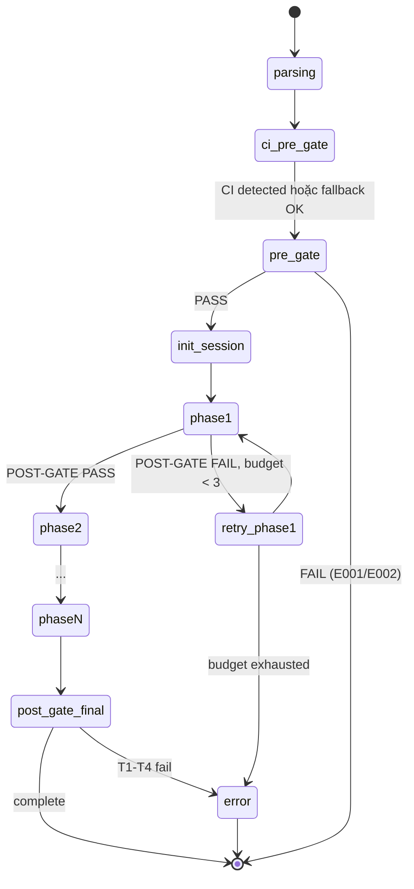

<!--
_template_notes:
  purpose: Mô tả KIẾN TRÚC TỔNG QUAN của skill — components, data flow, control flow, integration points, parallelism.
  scope: KHÁC với 03-phase-routing (chi tiết phases). File này tả "bộ máy" — các block lego cấu thành skill và cách chúng liên kết.
  populate:
    - §1 Bản đồ tổng thể: ASCII art hoặc Mermaid hiển thị mọi components + luồng dữ liệu chính
    - §2 Components: 1 subsection/component — vai trò, input, output, KHÔNG làm gì
    - §3 Sequence diagram: 1 sequence cho happy path (standard profile)
    - §4 Parallelism model: ai song song với ai, điều kiện
    - §5 Data flow chi tiết: producer → consumer per artifact
    - §6 SKILL file layout: tree thực tế trên disk (.claude/skills/workflow/{skill}/)
    - §7 CORE rules tôn trọng: liệt kê CORE-006, CORE-007, CORE-020, CORE-027, CORE-028, CORE-030, CORE-032..038 áp dụng
    - §8 State machine: Mermaid stateDiagram-v2 cho orchestrator/main loop
    - §9 Sai hỏng & fallback: bảng tình huống → hành vi
    - §10 Testability: mỗi component test thế nào (standalone)
  độ dài tham khảo: 300-500 dòng
  KHÔNG nhồi: nếu skill simple (1-2 phases), bỏ §3 §4 §8 (giữ §1 §2 §5 §6 §7 §9 §10)
  Khác biệt với 03-phase-routing.md: file này tả CẤU TRÚC (cái gì có sẵn), 03-phase-routing tả TRÌNH TỰ (chạy theo thứ tự nào)
-->

# 03 — Kiến Trúc Skill

> **Mục đích file:** Tả KIẾN TRÚC TỔNG QUAN của skill `{skill-name}` — components nào cấu thành, dữ liệu chảy ra sao, song song với ai, integration points với MCV3 engines. Đọc tiếp [03-phase-routing] để hiểu TRÌNH TỰ phase.
> **Khác với [03-phase-routing.md](03-phase-routing.md):** File này tả "bộ máy" (static structure). File 03-phase-routing tả "luồng" (dynamic execution order).

---

## 1. Bản Đồ Tổng Thể

```
                        ┌──────────────────────────────────────────┐
  /{skill-name} ──────▶ │             ENTRY / ROUTER               │
  [arguments + flags]   │      (SKILL.md — lazy-load hub)          │
                        │  - Parse args → resolve config           │
                        │  - PRE-GATE (registry, code, state)      │
                        │  - Route to procedure phase{N}-*.md      │
                        └───────────────┬──────────────────────────┘
                                        │
           ┌────────────────────────────┼────────────────────────────┐
           │                            │                            │
           ▼                            ▼                            ▼
  ┌─────────────┐                ┌─────────────┐                ┌─────────────┐
  │  Component  │                │  Component  │                │  Component  │
  │  {C1 name}  │     ...        │  {C2 name}  │     ...        │  {Cn name}  │
  │             │                │             │                │             │
  │  {role}     │                │  {role}     │                │  {role}     │
  └──────┬──────┘                └──────┬──────┘                └──────┬──────┘
         │                              │                              │
         └──────────────┬───────────────┴──────────────┬───────────────┘
                        │                              │
                        ▼                              ▼
              ┌──────────────────┐           ┌──────────────────┐
              │  AGGREGATOR /    │           │  CROSS-CUTTING   │
              │  STATE STORE     │           │  SERVICES        │
              │ (fix-status,     │           │ (CI detect,      │
              │  signals, ...)   │           │  CDG, audit log) │
              └────────┬─────────┘           └────────┬─────────┘
                       │                              │
                       └──────────┬───────────────────┘
                                  │
                                  ▼
                          POST-GATE + Reports
                          (Phase{N}-report.md, ...)
```

> Thay placeholders `{C1 name}`, `{C2 name}`, `{Cn name}` bằng tên thật. Nếu skill đơn giản (1-2 phases), thay diagram trên bằng diagram tuyến tính 3-4 hộp.

---

## 2. Thành Phần (Components)

### 2.1 SKILL.md — Lean Routing Hub

**Vai trò:** Entry point, lean (≤500 dòng — CORE-032). KHÔNG chứa execution logic. Chỉ:

1. Parse arguments → xác định mode/profile.
2. CI PRE-GATE 3-step (Na/Nb/Nc — CORE-033) nếu skill cần đọc code.
3. PRE-GATE (registry exists, dependencies satisfied).
4. Khởi tạo `$SESSION_DIR` + state files (atomic write — CORE-035).
5. Route đến `procedures/phase{N}-{name}.md` phù hợp.
6. POST-GATE tổng hợp khi mọi phase hoàn tất.

**KHÔNG làm:**
- KHÔNG nhúng bash script inline (delegate sang `scripts/`).
- KHÔNG ghi `req-registry.json` (CORE-006 — registry safe-write).
- KHÔNG đọc lại `session-log.json` / `error-ledger.json` làm input (CORE-026, CORE-034).

**File mapping:** `.claude/skills/workflow/{skill-name}/SKILL.md`

### 2.2 Procedures — Phase Implementation

Mỗi `procedures/phase{N}-{name}.md` chứa đầy đủ logic của 1 phase:

| Section | Mục đích |
|---------|----------|
| **PRE-GATE** | Verify output của phase trước (T1 exists → T2 structure → T3 content) |
| **Steps** | Các bước thực thi (đọc input → process → ghi output) |
| **POST-GATE** | T1→T4 validate output của phase này |
| **Phase{N}-report.md** | Báo cáo tiếng Việt ≤15 dòng (CORE-028) cho non-specialist |

**Lazy-load:** Mỗi procedure chỉ được Read khi tới phase tương ứng — giảm 70%+ context so với monolithic.

**Shared:** `procedures/_shared.md` chứa cross-cutting concerns (state variables, atomic write pattern, error handling, CI detection helpers).

### 2.3 {Component đặc thù skill — thay tên}

Ví dụ với skill orchestrator: "Lane Dispatcher", "Signal Bus", "Aggregator", ...
Ví dụ với skill linear: "Static Scanner", "Runtime Verifier", "Report Generator", ...

| Trường | Giá trị |
|--------|---------|
| **Vai trò** | {1 câu mô tả} |
| **Input** | {state files hoặc dependencies} |
| **Output** | {artifacts ghi vào $SESSION_DIR/...} |
| **Stateful?** | Có / Không (nếu Có → mô tả checkpoint file) |
| **Spawn agent?** | Có / Không (nếu Có → kê tên agent + 8-section prompt — CORE-037) |
| **Idempotent?** | Có / Không — quan trọng cho `--resume` |

> Lặp section này cho mỗi component đặc thù. Tối thiểu 3 component cho standard skill, ≥5 cho orchestrator.

### 2.4 Cross-Cutting Services (Utilities)

| Service | Mục đích | File |
|---------|----------|------|
| CI Detect | Auto-detect GitNexus/Serena availability (CORE-033) | `.claude/scripts/ci-detect.sh` |
| CI Freshness Check | Verify index khớp HEAD (4 mức) | `.claude/scripts/ci-freshness-check.sh` |
| CDG Gate | Critical Decision Gate user prompt (CORE-027) | Spawned theo trigger |
| Session Lock + Heartbeat | Cô lập session (CORE-030) | Helper script |
| Atomic Write | Build tmp → validate → mv (CORE-035) | Inline pattern trong _shared.md |

---

## 3. Sequence Diagram — Happy Path (Standard Profile)

```
User ──/{skill-name} {args} ──▶ SKILL.md (Router)
                                  │
                                  │ 1. Parse args → resolve config
                                  │ 2. CI PRE-GATE 3-step (Na/Nb/Nc)
                                  │ 3. PRE-GATE: validate dependencies
                                  │ 4. Init $SESSION_DIR + state files
                                  │
                                  ├──▶ procedures/phase1-init.md
                                  │      ├─ Steps
                                  │      ├─ POST-GATE T1→T4
                                  │      └─ Phase1-report.md
                                  │
                                  ├──▶ procedures/phase2-{name}.md
                                  │      └─ (...)
                                  │
                                  ├──▶ procedures/phase3-{name}.md
                                  │      └─ (...)
                                  │
                                  ├──▶ {Aggregator / Signal Bus / ...}
                                  │      └─ Cross-phase synthesis
                                  │
                                  ├──▶ POST-GATE workflow (final)
                                  │
                                  ▼
                          Output artifacts + final report
                          (orchestrator-summary.md, fix-impact.json, ...)
```

---

## 4. Parallelism Model

> **Bỏ section này nếu skill thuần tuyến tính (không parallel).**

### 4.1 Ai song song với ai?

| Phân lớp | Song song? | Điều kiện |
|----------|-----------|-----------|
| Phase × Phase | **Không** | Phase sau cần output phase trước (CORE-002) |
| Lane × Lane (cùng phase) | Có (nếu orchestrator) | Write scope tách biệt — `$SESSION_DIR/lanes/{X}/` (CORE-025) |
| Probe × Probe trong lane | Có/Không tuỳ lane | Lane tự quản; mặc định tuần tự để giữ context |
| Spawn agent × Spawn agent | Có | Max 10 concurrent (CORE-025); mỗi agent 1 file output |

### 4.2 Giới hạn

- Default max **3** lanes song song (runtime budget + agent token).
- Override: `--max-parallel-lanes=N` (clamp 1-10).
- 7+ lanes → batch thành waves.

### 4.3 Vì sao không "song song hết"?

- Agent (business/security/...) có giới hạn concurrent request.
- Playwright runtime cần browser instance — quá nhiều OOM.
- Debug khó khi N luồng log trộn lẫn.

> Pattern tham khảo: [`../../03-design-patterns/04-parallel-lane-dispatch.md`](../../03-design-patterns/04-parallel-lane-dispatch.md).

---

## 5. Data Flow Chi Tiết

### 5.1 Phase → State Store

```
Phase 1 (Init)
  ▼
$SESSION_DIR/fix-status.json         ← phase=1, state=COMPLETE
$SESSION_DIR/session-log.json        ← APPEND start/complete event
  ▼
Phase 2 ({name})
  ▼
$SESSION_DIR/phase2-{name}/output.json
$SESSION_DIR/phase2-{name}/Phase2-report.md (≤15 dòng tiếng Việt)
$SESSION_DIR/fix-status.json         ← phase=2, state=COMPLETE (atomic write)
  ▼
... (lặp cho mỗi phase)
```

### 5.2 Cross-Skill Artifact

Skill này produce artifact cho downstream qua `_contract.json` (CORE-036):

```json
{
  "produces_for": {
    "{downstream-skill}": ["$SESSION_DIR/{artifact}.json"]
  },
  "consumes_from": {
    "{upstream-skill}": ["$SESSION_DIR/{upstream-artifact}.json"]
  }
}
```

Artifact PHẢI:
- Schema versioned (vd: `fix-impact-v1`)
- `audit_chain.source` + `audit_chain.checksum` (sha256)
- Consumer validate ở PRE-GATE (T1→T3)

### 5.3 Checkpoint & Resume

| Layer | Checkpoint File | Khi nào ghi |
|-------|-----------------|-------------|
| Orchestrator | `fix-status.json` | Sau mỗi POST-GATE PASS |
| Phase-internal | `$SESSION_DIR/phase{N}/checkpoint.json` | Sau mỗi step lớn (>30s work) |
| Spawned agent | `$SESSION_DIR/agents/{name}/progress.json` | Agent tự quản |

**Resume routing:** `fix-status.json.next_action` xác định điểm vào lại (xem [`03-phase-routing.md`](03-phase-routing.md) §5).

---

## 6. File Layouts

Section này tả 2 view đối xứng: **SOURCE** (skill code trên disk, ổn định) và **OUTPUT** (artifacts skill tạo ra trong session, dynamic).

### 6.1 Source Layout — Skill code trên disk

```
.claude/skills/workflow/{skill-name}/
├── SKILL.md                          # Lean routing hub (≤500 dòng — CORE-032)
├── _contract.json                    # Cross-skill contract (CORE-036)
├── procedures/                       # Lazy-load procedures
│   ├── _shared.md                    # Cross-cutting concerns
│   ├── phase1-init.md
│   ├── phase2-{name}.md
│   ├── ...
│   ├── phaseN-report.md
│   └── resume-status.md              # --resume & --status handlers
├── templates/                        # Output templates (CORE-031)
│   ├── fix-status.json
│   ├── PhaseN-report.md
│   └── ...
├── evals/                            # Test cases (≥3)
│   ├── evals.json
│   └── golden/                       # Golden fixtures
└── scripts/                          # Skill-specific bash helpers
    └── {skill-name}-helper.sh
```

> Nếu skill spawn agent → thêm reference đến `.claude/agents/{category}/{agent-name}.md` ở §2.3.
> Nếu skill dùng utility chung → reference `.claude/skills/workflow/_shared/{module}/`.

### 6.2 Session Output Layout — Artifacts skill tạo ra

Khi skill chạy xong, session directory chứa các artifacts sau (tree top-level — chi tiết schema xem [04-file-contract.md](04-file-contract.md)):

```
.mc-data/work/{skill-name}/
├── _index/
│   └── sessions.jsonl                # APPEND-only — index mọi session đã chạy
└── sessions/
    └── {YYYY-MM-DD-{scope}-{slug}-{NN}}/    # 1 session = 1 directory cô lập (CORE-030)
        ├── .lock                              # Session lock + heartbeat daemon
        ├── fix-status.json                    # SSOT pipeline state (atomic write)
        ├── session-log.json                   # Execution trace (APPEND-only — CORE-026)
        ├── error-ledger.json                  # Error tracking (APPEND-only — CORE-034)
        │
        ├── phase1-init/                       # 1 subdirectory per phase (CORE-035)
        │   ├── Phase1-report.md               # Báo cáo tiếng Việt ≤15 dòng (CORE-028)
        │   └── {phase-specific outputs}.{json,md}
        │
        ├── phase2-{name}/
        │   ├── Phase2-report.md
        │   └── ...
        │
        ├── ...
        │
        ├── phaseN-report/                     # Phase cuối — tổng hợp
        │   ├── PhaseN-report.md
        │   ├── orchestrator-summary.md        # User-facing summary
        │   └── {artifact}.json                # Cross-skill artifact (CORE-036, schema versioned)
        │
        └── checkpoints/                       # Resume points (nếu skill hỗ trợ --resume)
            └── phase{N}-checkpoint.json
```

**Quy tắc đọc tree:**

| Block | Mục đích |
|-------|---------|
| `_index/sessions.jsonl` | Tra cứu lịch sử — `--status` đọc file này |
| `sessions/{ID}/.lock` + state files (`fix-status`, `session-log`, `error-ledger`) | Runtime state ở root session — luôn có 4 files này |
| `sessions/{ID}/phase{N}-{name}/` | 1 subdirectory/phase chứa output đặc thù + `Phase{N}-report.md` |
| `sessions/{ID}/{last-phase}/{artifact}.json` | Cross-skill artifact (vd: `fix-impact.json`, `cmi-report.json`) — consume bởi skill downstream |

**Cross-skill artifacts (nếu skill produces_for):**

| Artifact | Path | Consumer |
|----------|------|----------|
| `{artifact-name}.json` | `sessions/{ID}/phase{N}-{name}/{artifact-name}.json` | {downstream-skill} (xem [04-file-contract.md](04-file-contract.md) §3) |

> **Lưu ý:** Tree trên là **structure**. Schema cụ thể của từng file (fields, types, validation rules) ở [04-file-contract.md](04-file-contract.md). KHÔNG lặp lại schema ở đây.

> **Khi nào tree này thay đổi:** Khi thêm/bớt phase, hoặc đổi naming convention session ID. Update đồng thời cả `04-file-contract.md` và section này.

---

## 7. CORE Rules Phải Tôn Trọng

| Rule | Áp dụng ở đâu | Verify thế nào |
|------|---------------|----------------|
| CORE-006 (Safe-Write) | Khi update `req-registry.json` | Chỉ update fields được phân công theo Protocol 05 |
| CORE-007 (Cross-Skill Path Contract) | Output paths phải khớp Protocol 21 | `validate-schema-sync.sh` |
| CORE-020 (Safety Gate) | Trước khi ghi code mới (skill code-modify) | Search code hiện tại trước |
| CORE-027 (CDG) | Khi action không reversible | Spawn AskUserQuestion |
| CORE-028 (Phase Summary) | Sau mỗi POST-GATE PASS | Phase{N}-report.md ≤15 dòng tiếng Việt |
| CORE-030 (Session Isolation) | Mọi runtime data | `$SESSION_DIR/{id}/` lock + heartbeat |
| CORE-032 (Lazy-Load) | SKILL.md ≤500 dòng | `wc -l SKILL.md` |
| CORE-033 (CI-First) | Skill đọc/analyze code | CI PRE-GATE Na/Nb/Nc ở Phase Init |
| CORE-034 (Error Codes) | Mỗi error có namespace E0xx | error-ledger.json APPEND-only |
| CORE-035 (Phase Output Org) | Subdirectories `phase{N}-{name}/` | Atomic write JSON |
| CORE-036 (Cross-Skill Artifact) | Produced artifacts schema versioned | `_contract.json` produces_for/consumes_from |
| CORE-037 (Agent Prompt 8 sections) | Mỗi agent spawn | Xem `agent-prompt.md` template |
| CORE-038 (Context Budget) | Mỗi phase transition | <65% OK, 65-80% prep, 80-90% stop, >90% FORCE STOP E009 |

> **Lưu ý:** Bỏ row nào KHÔNG áp dụng cho skill này. Ví dụ skill linear không spawn agent → bỏ CORE-037.

---

## 8. State Machine — Orchestrator/Main Loop



> Bỏ section này nếu skill đơn giản (linear, không retry, không branching).

---

## 9. Sai Hỏng Và Fallback

| Tình huống | Hành vi |
|------------|---------|
| Phase POST-GATE FAIL | Auto-fix retry (max 3 — CORE-034). Hết → ESCALATE (AskUserQuestion) |
| CI tool unavailable | Graceful degradation → fallback Grep/Glob (Protocol 20) |
| Session lock held (orphan) | Stale check: age > 30 min → auto-release; else WARN, suggest `--resume` |
| Spawned agent timeout | Retry 1 lần → fail thì skip + note "agent_timeout" trong error-ledger |
| Context > 90% | FORCE STOP (E009) — checkpoint bắt buộc, không advance |
| Dependency artifact missing | WARN → check `_contract.json.consumes_from` → suggest run upstream skill |

---

## 10. Testability

Mỗi component độc lập testable:

- **SKILL.md routing:** Chạy với `--dry-run` → verify route đúng phase, không execute steps.
- **Procedure phase{N}:** Standalone — copy state files từ golden fixture → chạy phase isolated → so output với expected.
- **Cross-skill artifact:** Validator script đọc `_contract.json` → verify producer output thoả schema.
- **Spawned agent prompt:** Static check — agent prompt template có đủ 8 sections (CORE-037)?

Golden fixtures: `.claude/skills/workflow/{skill-name}/evals/golden/` (xem [09-evals-test-cases.md](09-evals-test-cases.md)).

---

## 11. Liên Kết

- Phase routing chi tiết: [03-phase-routing.md](03-phase-routing.md)
- File contract chi tiết: [04-file-contract.md](04-file-contract.md)
- Procedures outline: [07-procedures-structure.md](07-procedures-structure.md)
- Tradeoffs ADR: [08-tradeoffs-adr.md](08-tradeoffs-adr.md)
- Pattern catalog: [`../../03-design-patterns/`](../../03-design-patterns/)
- Skill standard anatomy: [`../../02-standards/02-skill-standard.md`](../../02-standards/02-skill-standard.md)
- 15 engines map: [`../../01-architecture/10-mcv3-engines-overview.md`](../../01-architecture/10-mcv3-engines-overview.md)
- Real example (orchestrator phức tạp): [`../wf-fix-bugs/03-architecture.md`](../wf-fix-bugs/03-architecture.md) — Lane Dispatch + Signal Bus + Shared Services
