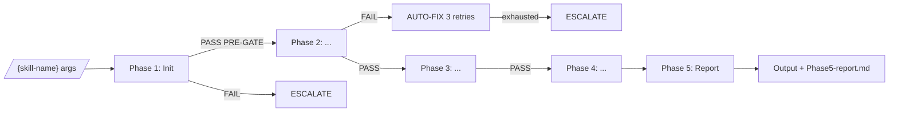

<!--
_template_notes:
  purpose: Mô tả phase routing — luồng từ entry tới hoàn tất, transitions, profile dispatch.
  populate:
    - §1 Bảng phase routing: 1 row/phase với input/output/duration
    - §2 Mermaid flow diagram: vẽ luồng phases
    - §3 Profile dispatch: tích phase nào activate theo profile nào
    - §4 Conditional skipping: rules SKIP phase
    - §5 Cross-phase data: pipeline state file SSOT
    - §6 Regression-aware skipping (OPTIONAL — chỉ điền nếu skill có `--since=<git-ref>`,
        `--incremental`, hoặc consume `detect_changes()` từ GitNexus)
    - §7 Liên kết
  độ dài tham khảo: 200-400 dòng (cộng thêm 40-80 dòng nếu có §6)
  bỏ §6 nếu skill luôn chạy full scan, không hỗ trợ diff-aware
-->

# 03 — Phase Routing

> **Mục đích file:** Chỉ rõ luồng skill — phases, transitions, profile dispatch, conditional skips.

---

## 1. Phase routing map

| Phase | Tên | Procedure file | Đầu vào | Đầu ra | Time (standard) |
|-------|-----|---------------|---------|--------|----------------|
| 1 | Init | `procedures/phase1-init.md` | args, registry | `fix-status.json`, session lock | 30s |
| 2 | {Phase 2 name} | `procedures/phase2-*.md` | Phase 1 output | {output} | {time} |
| 3 | {Phase 3 name} | `procedures/phase3-*.md` | Phase 2 output | {output} | {time} |
| 4 | {Phase 4 name} | `procedures/phase4-*.md` | Phase 3 output | {output} | {time} |
| 5 | Report | `procedures/phase5-report.md` | Tất cả output | `Phase5-report.md` | 1 min |

---

## 2. Flow diagram



---

## 3. Profile dispatch (nếu skill có `--profile`)

| Phase | quick | standard | deep | exhaustive |
|-------|-------|----------|------|-----------|
| 1 — Init | ✅ | ✅ | ✅ | ✅ |
| 2 — Static scan | ✅ | ✅ | ✅ | ✅ |
| 3 — Runtime scan | ❌ | ✅ | ✅ | ✅ |
| 4 — LLM analysis | ❌ | ❌ | ✅ | ✅ |
| 5 — Cross-validate | ❌ | ❌ | ❌ | ✅ |
| 6 — Report | ✅ | ✅ | ✅ | ✅ |

---

## 4. Conditional skipping

| Phase | Skip nếu | Reason |
|-------|---------|--------|
| Phase 3 (runtime) | `interface_type=api-only` | Không có UI để runtime check |
| Phase 4 (LLM) | `--profile=quick` | LLM tốn token |
| Phase 5 (cross-validate) | Single module | Không có cross-module signal |

---

## 5. Cross-phase data — Pipeline state (SSOT)

File `$SESSION_DIR/fix-status.json` lưu state:

```json
{
  "session_id": "2026-05-15-{scope}-{slug}-01",
  "current_phase": 3,
  "phases_completed": [1, 2],
  "next_action": "phase3-{name}",
  "context_budget_used_pct": 45,
  "checkpoint_at": "2026-05-15T14:32:00+07:00"
}
```

**Update rule:** atomic write sau mỗi POST-GATE PASS. Pattern xem [11-output-path-contract.md](../../02-standards/11-output-path-contract.md).

---

## 6. Regression-aware skipping (OPTIONAL — bỏ section này nếu skill không có `--since` / `--incremental`)

> **Khi nào điền:** Skill hỗ trợ một trong:
> - Arg `--since=<git-ref>` hoặc `--incremental`
> - Consume `GitNexus.detect_changes()` để biết file nào đã đổi
> - Có cache layer per-file/per-module với TTL Git-aware
>
> **Engine ánh xạ:** #6 Regression Intelligence — xem [`docs/01-architecture/10-mcv3-engines-overview.md`](../../01-architecture/10-mcv3-engines-overview.md) §1, §4.2.

### 6.1 Semantics của `--since=<git-ref>`

| Mode | Behavior |
|------|----------|
| `--since=HEAD~1` | Chỉ scan files đổi từ commit trước → HEAD |
| `--since=main` | Scan files đổi so với nhánh main (typical PR review) |
| `--since=v1.2.0` | Scan files đổi từ tag (typical release audit) |
| `--since=<sha>` | Scan files đổi từ commit cụ thể |
| `--incremental` (no ref) | Auto-detect: dùng cache last successful run timestamp |

### 6.2 Phase skipping matrix khi `--since` set

| Phase | Skip điều kiện | Re-run trigger | Note |
|-------|---------------|----------------|------|
| 1. Init | Không skip | Always | Đọc args, validate ref hợp lệ |
| 2. Static scan | Skip nếu 0 files trong scope đổi | Bất kỳ file scope đổi | Granular per-module |
| 3. Probe dispatch | Skip probe cụ thể nếu probe-input files không đổi | Probe-input file đổi | Per-probe granularity |
| 4. LLM analysis | Skip nếu Phase 3 không có new finding | Phase 3 có finding mới | LLM expensive |
| 5. Runtime/Playwright | Skip nếu UI files không đổi | UI files đổi | Runtime expensive |
| 6. Cross-validate | Skip nếu single module changed + no cross-ref | Multi-module change | Cross-validation expensive |
| 7. Triage | Không skip | Always | Aggregate cũ + mới |
| 8. Report | Không skip | Always | Generate diff report |

### 6.3 Validation rule trước khi skip

Trước khi skip phase, BẮT BUỘC check:

```bash
# Pseudo-code
files_changed=$(git diff --name-only "$SINCE_REF"...HEAD -- "$SCOPE_PATTERN")

if [ -z "$files_changed" ]; then
  log_phase_skip "Phase $N: no files in scope changed since $SINCE_REF"
  cp last_successful_session/phase${N}-*/output.json $SESSION_DIR/phase${N}-*/
  echo "PHASE_${N}_STATUS=SKIPPED (regression-aware)"
else
  log_phase_start "Phase $N: $(echo "$files_changed" | wc -l) files changed"
  # ... normal execution
fi
```

### 6.4 Cache & invalidation rules

| Cache item | TTL | Invalidate khi |
|-----------|-----|----------------|
| Probe output per-file | 24h | File mtime đổi OR `git log <file>` có commit mới |
| LLM inference result | 7 days | Source file changed OR registry schema bumped |
| Cross-module graph | 4h | Bất kỳ file `src/**/*.{ts,py,...}` đổi |
| GitNexus index | (managed bởi GitNexus) | `git push` hoặc manual `npx gitnexus analyze` |

### 6.5 Quy tắc khi `--since` xung đột `--scope`

| Combo | Behavior |
|-------|----------|
| `--since=main --scope=all` | OK — scan all files đổi vs main |
| `--since=main --scope=module:X` | OK — chỉ files trong module X đổi vs main |
| `--since=main --scope=file:Y` | Chỉ check file Y có đổi không; nếu không → skip toàn skill |
| `--since=main` + 0 files đổi | EXIT 0 với report "no changes detected" — không spawn phases |

### 6.6 Cross-skill regression contract

Nếu skill này produce artifact cross-skill (xem [04-file-contract.md](04-file-contract.md) §3):

| Quy tắc | Lý do |
|---------|-------|
| Artifact PHẢI ghi `audit_chain.scanned_files[]` | Consumer biết phạm vi đã quét |
| Artifact PHẢI ghi `since_ref` nếu skill chạy regression-aware | Consumer biết đây là partial scan |
| Consumer KHÔNG được giả định partial scan = full scan PASS | Tránh false confidence |

### 6.7 Anti-patterns

❌ Skip phase mà KHÔNG copy output cũ vào session mới → consumer skill thiếu artifact
❌ `--since` không validate ref hợp lệ (vd: `--since=typo` → `git diff` empty → false skip toàn bộ)
❌ Cache không invalidate khi GitNexus index bumped → stale impact analysis
❌ Trade chất lượng lấy tốc độ (vi phạm CORE-023): skill regression-aware PHẢI rõ ràng "đây là partial scan", không claim full PASS

---

## 7. Liên kết

- Procedures structure: [07-procedures-structure.md](07-procedures-structure.md)
- File contract: [04-file-contract.md](04-file-contract.md)
- Pattern: [`../../03-design-patterns/01-lazy-load-procedures.md`](../../03-design-patterns/01-lazy-load-procedures.md)
- Pattern: [`../../03-design-patterns/06-checkpoint-resume.md`](../../03-design-patterns/06-checkpoint-resume.md)
- Engines overview: [`../../01-architecture/10-mcv3-engines-overview.md`](../../01-architecture/10-mcv3-engines-overview.md) (#3, #6, #13)
- Real example: [`../wf-legacy-scan/`](../wf-legacy-scan/) (v5.0 incremental + 4-level checkpoint), GitNexus [Code Intelligence](../../01-architecture/04-code-intelligence.md)
