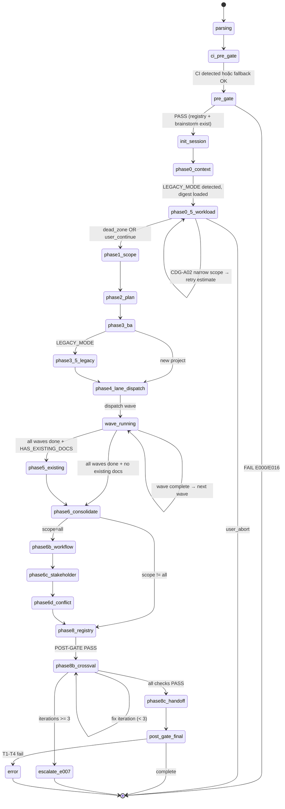

# 03 — Kiến Trúc Skill

> **Mục đích file:** Tả KIẾN TRÚC TỔNG QUAN của skill `wf-analyze-requirements` — components nào cấu thành, dữ liệu chảy ra sao, song song với ai, integration points với MCV3 engines. Đọc tiếp [03-phase-routing.md](03-phase-routing.md) để hiểu TRÌNH TỰ phase.
> **Khác với [03-phase-routing.md](03-phase-routing.md):** File này tả "bộ máy" (static structure — components, data flow, state machine, parallelism model). File 03-phase-routing tả "luồng" (dynamic execution order — 14 phases, conditional skip, profile dispatch).

---

## 1. Bản Đồ Tổng Thể

```
                        ┌──────────────────────────────────────────────────┐
  /wf-analyze-req ────▶ │              LEAN ROUTING HUB                    │
  [scope + flags]        │      (SKILL.md ~420 dòng — CORE-032)            │
                         │  - Parse args → scope/mode/session               │
                         │  - CI PRE-GATE 3-step (Na/Nb/Nc — CORE-033)     │
                         │  - PRE-GATE: registry + brainstorm exist         │
                         │  - Init SESSION_DIR + session-state.json         │
                         │  - Route to procedure phase files (lazy-load)    │
                         └──────────────┬───────────────────────────────────┘
                                        │
               ┌────────────────────────┼─────────────────────────────┐
               │                        │                             │
               ▼                        ▼                             ▼
  ┌─────────────────────┐  ┌────────────────────────┐  ┌─────────────────────────┐
  │  BA COORDINATOR     │  │  WORKLOAD GATE          │  │  LEGACY BRIDGE          │
  │  (Phase 3)          │  │  (Phase 0.5)            │  │  (Phase 3.5 + 5)        │
  │                     │  │                         │  │                         │
  │  Spawn business-    │  │  EST_MINUTES compute    │  │  Naming normalization   │
  │  analyst → Part A   │  │  3-zone decision tree   │  │  Existing docs merge    │
  │  per dept           │  │  CDG-A02 override       │  │  (LEGACY_MODE only)     │
  └────────┬────────────┘  └──────────┬─────────────┘  └────────────┬────────────┘
           │                          │                              │
           ▼                          │                              │
  ┌─────────────────────────────────────────────────────────────────────────────┐
  │                    DOMAIN EXPERT DISPATCHER (Phase 4)                        │
  │                    (_shared/lane/dispatcher.py — ADR-OPT-01)                │
  │                                                                              │
  │  ┌──────────────┐  ┌──────────────┐  ┌──────────────┐  ┌──────────────┐    │
  │  │ Lane: sales  │  │Lane: marketing│  │ Lane: finance│  │Lane: logistics│   │
  │  │ sales-expert │  │mktg-expert   │  │finance-expert│  │logistics-exp  │   │
  │  │ signals.json │  │ signals.json │  │ signals.json │  │ signals.json │    │
  │  └──────────────┘  └──────────────┘  └──────────────┘  └──────────────┘    │
  │        ... (max 3 concurrent — token bucket backpressure)                    │
  └────────────────────────────────────┬────────────────────────────────────────┘
                                        │ lanes/*/signals.json
                                        ▼
  ┌──────────────────────────────────────────────────────────────────────────────┐
  │                      SIGNAL AGGREGATOR (Phase 6)                              │
  │                      (_shared/aggregate/aggregator.py — ADR-OPT-04)          │
  │                                                                               │
  │  Read all lanes → Merge signals → Dedup REQ-IDs → Flag CONFLICT              │
  │  Output: aggregation-result.json                                              │
  └────────────────────┬──────────────────────────────────────────────────────────┘
                        │ aggregation-result.json
                        ▼
  ┌──────────────────────────────────────────────────────────────────────────────┐
  │                    OUTPUT COMPOSER (Phase 8 → 8b → 8c)                        │
  │                                                                               │
  │  Phase 8:  Registry DIRECT safe-write (no agent, narrow jq — CORE-006)       │
  │  Phase 8b: Cross-validation loop max 3 iterations → auto-correct             │
  │  Phase 8c: Generate digests + Template Strip (ADR-OPT-05) → canonical _meta/ │
  └────────────────────┬──────────────────────────────────────────────────────────┘
                        │
                        ▼
              Phase 1 business docs + registry requirements[] + handoff digests
```

---

## 2. Thành Phần (Components)

### 2.1 SKILL.md — Lean Routing Hub

**Vai trò:** Entry point, lean ~420 dòng (CORE-032). KHÔNG chứa execution logic. Chỉ:

1. Parse arguments — scope (`all | business | module-name`), `--status`, `--resume`, `--session=<id>`.
2. CI PRE-GATE 3-step (Na/Nb/Nc — CORE-033): detect GitNexus/Serena, freshness check, inject `$CI_CONTEXT`.
3. PRE-GATE: verify `req-registry.json` tồn tại + `phase0-brainstorm/` tồn tại (T1→T4).
4. Khởi tạo `$SESSION_DIR` + `session-state.json` (atomic write — CORE-035).
5. Route đến `procedures/phase0-context.md` (entry) → phased loading.
6. POST-GATE tổng hợp sau Phase 8c.

**KHÔNG làm:**
- KHÔNG spawn agent trực tiếp — delegate sang procedure files.
- KHÔNG ghi `req-registry.json` inline — delegate sang `phase8-registry.md`.
- KHÔNG đọc lại `session-state.json` làm input context sau khi ghi (CORE-026, output-only).

**File mapping:** `.claude/skills/workflow/wf-analyze-requirements/SKILL.md`

---

### 2.2 BA Coordinator

| Trường | Giá trị |
|--------|---------|
| **Vai trò** | Spawn `business-analyst` agent để phân tích stakeholders, scope, và domain requirements TRƯỚC khi expert lanes chạy |
| **Input** | `phase0-brainstorm/P0-01-brainstorm.md`, `phase0-brainstorm/P0-02-systems-users.md`, `req-registry.json` seed, LEGACY context (nếu có) |
| **Output** | Dept docs `phase1-business/departments/{dept}/*.md`, `analyze-plan.md` (expert mapping) |
| **Stateful?** | Có — `session-state.json.P3.depts_completed`, `session-state.json.P3.status` |
| **Spawn agent?** | Có — `business-analyst` với 8-section prompt (CORE-037): role → task → session context → CI context → output contract → ownership → completion criteria |
| **Idempotent?** | Có — resume check `P3.status == completed` → skip nếu done |

**Nguyên tắc BA-first (ADR-OPT-06):** BA Coordinator PHẢI hoàn tất TRƯỚC khi Domain Expert Dispatcher chạy. BA xác định danh sách departments + REQ-ID range assignment → Experts mới biết scope của mình. Không spawn parallel ngay từ đầu.

**File:** `procedures/phase3-ba-parta.md`

---

### 2.3 Workload Gate

| Trường | Giá trị |
|--------|---------|
| **Vai trò** | Ước tính thời gian chạy (`EST_MINUTES`) và quyết định có nên tiến hành hay không, trước khi commit run dài |
| **Input** | Số departments, scope, `$LEGACY_MODE`, `$COMPLEXITY_FACTOR` |
| **Output** | `workload-report.md` (Session dir), gate_decision vào `session-state.json.P0_5` |
| **Stateful?** | Có — gate_decision lưu trong `session-state.json` |
| **Spawn agent?** | Không — tính trực tiếp, AskUserQuestion nếu cần |
| **Idempotent?** | Có |

**3 zones:**
- `dead_zone` (ratio < 0.8): Silent continue.
- `warn` (0.8 ≤ ratio ≤ 1.5): AskUserQuestion — continue/abort.
- `block` (ratio > 1.5): CDG-A02 — Plan A (narrow scope) / Plan B (override) / Cancel.

**Module:** `_shared/partition/check_workload_gate()` (ADR-OPT-03).

**File:** `procedures/phase0.5-workload-gate.md`

---

### 2.4 Domain Expert Dispatcher

| Trường | Giá trị |
|--------|---------|
| **Vai trò** | Parallel spawn domain experts per department — mỗi expert = 1 lane = 1 isolated subdir |
| **Input** | `analyze-plan.md` (expert mapping từ Phase 2), BA dept docs từ Phase 3 |
| **Output** | `sessions/{id}/lanes/{dept-key}/signals.json` per lane (schema `lane-signal-v1`) |
| **Stateful?** | Có — `session-state.json.P4.lanes_completed[]` track per-lane completion |
| **Spawn agent?** | Có — 28 domain experts: `sales-expert`, `marketing-expert`, `customer-expert`, `finance-expert`, `logistics-expert`, `manufacturing-expert`, `procurement-expert`, `operations-expert`, `healthcare-expert`, v.v. |
| **Idempotent?** | Có — resume skip lanes đã completed theo `P4.lanes_completed[]` |

**Write isolation:** Mỗi lane ghi vào `sessions/{id}/lanes/{dept-key}/` riêng — 0 race condition (CORE-025).

**Max concurrency:** 3 lanes song song — token bucket backpressure từ `_shared/lane/dispatcher.py`.

**File:** `procedures/phase4-experts-partb.md`

---

### 2.5 Signal Aggregator

| Trường | Giá trị |
|--------|---------|
| **Vai trò** | Merge + dedup REQ-IDs cross-department sau khi tất cả lanes hoàn tất |
| **Input** | Tất cả `sessions/{id}/lanes/*/signals.json` |
| **Output** | `sessions/{id}/aggregation-result.json` (schema `aggregation-result-v1`) |
| **Stateful?** | Có — `session-state.json.P6.aggregation` lưu stats (input/output/duplicates/conflicts) |
| **Spawn agent?** | Không — utility module Python |
| **Idempotent?** | Có |

**Logic dedup:**
1. Normalize REQ-ID (lowercase, hyphen-consistent).
2. Merge signals từ tất cả lanes vào unified list.
3. Duplicate cùng REQ-ID, cùng nội dung → giữ 1.
4. Duplicate cùng REQ-ID, nội dung khác → flag `CONFLICT`, route Phase 6d.

**Module:** `_shared/aggregate/aggregator.py` — `aggregate_lane_signals()`, `dedup_by_id()` (ADR-OPT-04).

**File:** `procedures/phase6-consolidate.md`

---

### 2.6 Output Composer (Phase 8 → 8b → 8c)

**Vai trò:** 3-stage pipeline tạo canonical output — registry update, cross-validation, handoff digests.

| Stage | Vai trò | Spawn agent? |
|-------|---------|-------------|
| **Phase 8 — Registry Update** | DIRECT safe-write `requirements[]` + enriched fields vào `req-registry.json`. KHÔNG spawn agent — main conversation đọc/ghi trực tiếp. Narrow jq per-field (CORE-006) | Không |
| **Phase 8b — Cross-Validation** | 8 validation checks (REQ-ID format, source files, registry entries, cross-ref consistency). Auto-fix loop max 3 iterations (CORE-034). Sau 3 lần fail → ESCALATE E007 | Không (direct) |
| **Phase 8c — Handoff** | Generate `dept-digests.json` + `phase1-handoff.json`. Template Strip recursive `_*` keys (ADR-OPT-05). Copy sang `_meta/` canonical path | Không |

**Tại sao Phase 8 KHÔNG spawn agent:** Registry safe-write phức tạp, narrow jq update, cần atomic guarantee — main conversation có đủ tool (Read/Write/Bash). Agent thêm latency và complexity không cần thiết.

**Files:** `procedures/phase8-registry.md`, `procedures/phase8b-crossval.md`, `procedures/phase8c-handoff.md`

---

### 2.7 Legacy Bridge (Conditional)

| Trường | Giá trị |
|--------|---------|
| **Vai trò** | Normalize legacy module names + merge existing dept docs khi `$LEGACY_MODE = true` |
| **Input** | `work/legacy-scan/project-context.md`, `work/wf-brainstorm/legacy-decisions.json`, existing `phase1-business/departments/` |
| **Output** | Normalized dept doc paths, merge log trong session |
| **Stateful?** | Có — `session-state.json.P3_5.status`, `P5.status` |
| **Spawn agent?** | Không — rule-based normalization (CORE-015, CORE-017) |
| **Idempotent?** | Có |

**Kích hoạt:** CORE-021 LEGACY_MODE detect — `project-context.md > 500 bytes`. File không tồn tại → graceful, `$LEGACY_MODE = false`.

**Files:** `procedures/phase3.5-legacy.md` (naming norm), `procedures/phase5-existing-docs.md` (merge).

---

### 2.8 Cross-Cutting Services

| Service | Mục đích | File / Module |
|---------|----------|---------------|
| CI Detect | Auto-detect GitNexus/Serena availability (CORE-033, Na) | `.claude/scripts/ci-detect.sh` |
| CI Freshness Check | Verify index khớp HEAD — 4 mức (CORE-033, Nb) | `.claude/scripts/ci-freshness-check.sh` |
| CDG Gate | CDG-A01 (domain ambiguity), CDG-A02 (workload override) | `_shared/cdg/` + CDG helpers |
| Token Bucket | Backpressure concurrency ≤3 lanes (CORE-025) | `_shared/lane/dispatcher.py` |
| Cache | Content-addressable check Phase 0.5 workload (không Phase 0) | `_shared/cache/` |
| Atomic Write | Build tmp → strip → validate JSON → mv (CORE-035) | `_shared/_shared.md §2` |
| Template Strip | Remove `_*` keys recursive trước canonical write (ADR-OPT-05) | `_shared/_shared.md §2` |
| Session Lock | `.lock` file + heartbeat daemon (CORE-030) | Inline pattern `phase0-context.md` |
| DUAL-WRITE | Ghi vào `sessions/{id}/` canonical VÀ flat path backward-compat | `_shared/_shared.md §2` |

---

## 3. Sequence Diagram — Happy Path (Scope = all, New Project)

```
User ──/wf-analyze-requirements all ──▶ SKILL.md (Lean Routing Hub)
                                          │
                                          │ 1. Parse args: scope=all, mode=fresh
                                          │ 2. CI PRE-GATE 3-step (Na/Nb/Nc)
                                          │ 3. PRE-GATE: registry + brainstorm exist
                                          │ 4. Init SESSION_DIR + session-state.json
                                          │
                                          ├──▶ procedures/phase0-context.md
                                          │       ├─ LEGACY_MODE detect (CORE-021) → false
                                          │       ├─ Load brainstorm digest + registry seed
                                          │       └─ POST-GATE → P0.status = completed
                                          │
                                          ├──▶ procedures/phase0.5-workload-gate.md
                                          │       ├─ EST_MINUTES = 5 depts × 3 min = 15 min
                                          │       ├─ ratio = 15/45 = 0.33 → dead_zone → silent continue
                                          │       └─ POST-GATE → P0_5.gate_decision = dead_zone_auto_continue
                                          │
                                          ├──▶ procedures/phase1-scope.md
                                          │       └─ Set $SCOPE=all, enable P6b/P6c/P6d
                                          │
                                          ├──▶ procedures/phase2-plan.md
                                          │       └─ Build analyze-plan.md: 5 depts → expert mapping
                                          │
                                          ├──▶ procedures/phase3-ba-parta.md
                                          │       ├─ Spawn business-analyst (8-section prompt)
                                          │       ├─ BA → dept docs phase1-business/departments/
                                          │       └─ POST-GATE: dept docs exist + content valid
                                          │
                                          ├──▶ procedures/phase4-experts-partb.md
                                          │       ├─ Lane Dispatch (dispatcher.py, max 3 concurrent)
                                          │       │   ├─ [parallel] sales-expert → lanes/sales/signals.json
                                          │       │   ├─ [parallel] marketing-expert → lanes/marketing/signals.json
                                          │       │   ├─ [parallel] finance-expert → lanes/finance/signals.json
                                          │       │   [wave 2] customer-expert + logistics-expert
                                          │       └─ POST-GATE: all lanes completed
                                          │
                                          ├──▶ procedures/phase6-consolidate.md
                                          │       ├─ Aggregator: read 5 lanes/*/signals.json
                                          │       ├─ Dedup REQ-IDs (47 in → 42 out, 5 dup, 2 conflict)
                                          │       └─ aggregation-result.json
                                          │
                                          ├──▶ procedures/phase6b-workflow.md (scope=all)
                                          ├──▶ procedures/phase6c-stakeholder.md (scope=all)
                                          ├──▶ procedures/phase6d-conflict.md (scope=all)
                                          │       └─ Resolve 2 cross-dept conflicts
                                          │
                                          ├──▶ procedures/phase8-registry.md
                                          │       ├─ DIRECT: narrow jq → append requirements[] (42 items)
                                          │       └─ POST-GATE T1→T4
                                          │
                                          ├──▶ procedures/phase8b-crossval.md
                                          │       └─ 8 validation checks → PASS (2 iterations)
                                          │
                                          ├──▶ procedures/phase8c-handoff.md
                                          │       ├─ Generate dept-digests.json + phase1-handoff.json
                                          │       ├─ Template Strip (_* keys)
                                          │       └─ Copy to _meta/ canonical
                                          │
                                          ▼
                                  analyze-report.md + phase-summary.md
                                  (Phase 1 business docs + registry updated)
```

---

## 4. Parallelism Model

### 4.1 Ai Song Song Với Ai?

| Phân lớp | Song song? | Điều kiện |
|----------|-----------|-----------|
| Phase × Phase | **Không** | Phase sau cần output phase trước — BA trước Experts (ADR-OPT-06, CORE-002) |
| Lane × Lane trong Phase 4 | **Có** | Write scope tách biệt `lanes/{dept-key}/` — 0 race condition (CORE-025) |
| BA agent × Expert agents | **Không** | BA phải hoàn tất trước, Experts mới biết scope mình phụ trách |
| Expert × Expert trong cùng wave | **Có** | Max 3 concurrent — token bucket backpressure `_shared/lane/dispatcher.py` |
| Phase 6b/6c/6d | **Không** | Tuần tự — 6b workflow trước, 6c stakeholder review sau, 6d conflict cuối |
| Phase 8 / 8b / 8c | **Không** | Registry write → validate → digest — phải sequential để đảm bảo consistency |

### 4.2 Lane Dispatch Chi Tiết

Khi Phase 4 chạy với N departments:
1. `dispatcher.py` nhận list `(dept-key, expert-agent)` pairs.
2. Chia thành waves: mỗi wave tối đa 3 lanes.
3. Wave 1: spawn 3 lanes song song → chờ tất cả complete → Wave 2: spawn 2 lanes tiếp.
4. Mỗi lane ghi `sessions/{id}/lanes/{dept-key}/signals.json` riêng.
5. Lane fail → `P4.lanes_failed[]` track → các lanes khác không bị ảnh hưởng.

**Ví dụ 5 depts:**
```
Wave 1 (parallel): sales-expert | marketing-expert | finance-expert
  → Tất cả complete
Wave 2 (parallel): customer-expert | logistics-expert
  → Tất cả complete
→ Phase 6 Aggregator: merge 5 lanes
```

### 4.3 Giới Hạn Concurrency

- Default max **3** lanes concurrent (token budget + agent request limit).
- Không có override flag cho user — skill tự quản budget.
- N depts > 3 → batch thành waves tự động.
- Lý do giới hạn: agent concurrent request limit, debug dễ hơn khi log rõ per-lane.

> Pattern tham khảo: [`../../03-design-patterns/04-parallel-lane-dispatch.md`](../../03-design-patterns/04-parallel-lane-dispatch.md).

---

## 5. Data Flow Chi Tiết

### 5.1 Input → Session State → Output

```
wf-brainstorm output (consumed):
  .mc-data/docs/phase0-brainstorm/
    P0-01-brainstorm.md
    P0-02-systems-users.md
    policies/
  .mc-data/docs/_meta/
    req-registry.json (seed)
    project-digest.json
  .mc-data/work/wf-brainstorm/
    legacy-decisions.json  (LEGACY_MODE only — CORE-022)
    ↓
Phase 0: Load + session init
    ↓
$SESSION_DIR/session-state.json  ← pipeline SSOT (atomic write per phase)
    ↓
Phase 3: BA Coordinator
    ↓
.mc-data/docs/phase1-business/departments/{dept}/*.md  (canonical output)
$SESSION_DIR/analyze-plan.md
    ↓
Phase 4: Lane Dispatch
    ↓
$SESSION_DIR/lanes/{dept-key}/signals.json  (per-lane, schema lane-signal-v1)
    ↓
Phase 6: Signal Aggregator
    ↓
$SESSION_DIR/aggregation-result.json  (schema aggregation-result-v1)
    ↓
Phase 8: Registry Update DIRECT
    ↓
.mc-data/docs/_meta/req-registry.json  (requirements[] appended — atomic write)
    ↓
Phase 8c: Output Composer
    ↓
.mc-data/docs/_meta/dept-digests.json    (schema dept-digests-v1)
.mc-data/docs/_meta/phase1-handoff.json  (schema phase1-handoff-v1)
```

### 5.2 Cross-Skill Artifact

Skill này produce cho `wf-define-features` (consumer chính):

| Artifact | Schema | Path | Validate ở |
|---------|--------|------|-----------|
| `dept-digests.json` | `dept-digests-v1` | `docs/_meta/dept-digests.json` | PRE-GATE wf-define-features T1→T3 |
| `phase1-handoff.json` | `phase1-handoff-v1` | `docs/_meta/phase1-handoff.json` | PRE-GATE wf-define-features T1→T3 |
| `req-registry.json` (requirements[]) | `req-registry-v1` | `docs/_meta/req-registry.json` | SSOT chung |
| `stakeholder-review.md` | (markdown) | `docs/phase1-business/stakeholder-review.md` | Read by wf-define-features |

Skill này consume từ `wf-brainstorm` (producer):

| Artifact | Schema | Path |
|---------|--------|------|
| `P0-01-brainstorm.md` | (markdown) | `docs/phase0-brainstorm/` |
| `req-registry.json` (seed) | `req-registry-v1` | `docs/_meta/req-registry.json` |
| `project-digest.json` | `project-digest-v1` | `docs/_meta/project-digest.json` |
| `legacy-decisions.json` | `legacy-decisions-v1` | `work/wf-brainstorm/legacy-decisions.json` |

### 5.3 Checkpoint & Resume

| Layer | Checkpoint File | Khi nào ghi |
|-------|-----------------|-------------|
| Orchestrator | `$SESSION_DIR/session-state.json` | Sau mỗi phase complete (atomic write) |
| Lane | `$SESSION_DIR/lanes/{dept}/signals.json` status field | Lane tự quản (completed/failed) |
| Session index | `.mc-data/work/wf-analyze-requirements/_index/sessions.jsonl` | Khi tạo session mới (APPEND-only) |
| Legacy compat | `$SESSION_DIR/checkpoint.json` | Backward-compat write cùng với session-state.json |

**Resume routing:** `session-state.json.next_action` xác định điểm vào lại. Lane resume: `P4.lanes_completed[]` — skip lanes đã done. Xem [`03-phase-routing.md §7`](03-phase-routing.md) và [`procedures/phase0-context.md`](.claude/skills/workflow/wf-analyze-requirements/procedures/phase0-context.md).

---

## 6. File Layouts

Section này tả 2 view đối xứng: **SOURCE** (skill code trên disk, ổn định) và **OUTPUT** (artifacts skill tạo ra trong session, dynamic per run).

### 6.1 Source Layout — Skill code trên disk

```
.claude/skills/workflow/wf-analyze-requirements/
├── SKILL.md                                  # Lean routing hub (~420 dòng — CORE-032)
├── _contract.json                            # Cross-skill contract (CORE-036)
│                                             #   orchestrates: []
│                                             #   produces_for: {wf-define-features, wf-add-scope}
│                                             #   consumes_from: {wf-brainstorm, wf-legacy-extract}
├── procedures/
│   ├── _shared.md                            # Cross-cutting: state vars, atomic write, agent templates, fix rules
│   ├── phase0-context.md                     # Entry: LEGACY_MODE detect, session init, --resume/--status
│   ├── phase0.5-workload-gate.md             # Workload estimation + 3-zone gate (ADR-OPT-03)
│   ├── phase1-scope.md                       # Parse scope arg, set $SCOPE
│   ├── phase2-plan.md                        # Expert mapping → analyze-plan.md
│   ├── phase3-ba-parta.md                    # Spawn business-analyst → dept docs Part A
│   ├── phase3.5-legacy.md                    # LEGACY_MODE naming normalization (CORE-015)
│   ├── phase4-experts-partb.md               # Lane Dispatch parallel experts (ADR-OPT-01)
│   ├── phase5-existing-docs.md               # Merge existing docs (HAS_EXISTING_DOCS)
│   ├── phase6-consolidate.md                 # Signal Aggregation dedup (ADR-OPT-04)
│   ├── phase6b-workflow.md                   # Cross-dept workflow (scope=all)
│   ├── phase6c-stakeholder.md                # Stakeholder review (scope=all)
│   ├── phase6d-conflict.md                   # Conflict resolution → AUTO/EXPERT/DEFER
│   ├── phase8-registry.md                    # Registry update DIRECT (no agent)
│   ├── phase8b-crossval.md                   # 8-check cross-validation loop max 3
│   └── phase8c-handoff.md                    # Digests + Template Strip → _meta/
│
├── templates/                                # Output templates (CORE-031)
│   ├── analyze-status.json
│   ├── analyze-plan.md
│   ├── session-state.json
│   ├── workload-report.md
│   ├── aggregation-result.json
│   ├── lane-signal.json
│   ├── dept-digests.json
│   ├── phase1-handoff.json
│   └── phase-summary.md
│
└── evals/
    ├── evals.json                            # 20 eval cases (ERP, CRM, Healthcare, Logistics, Legacy, ...)
    └── golden/                               # Golden fixtures per scenario

# Shared modules (dùng chung toàn wf-fix-* ecosystem):
.claude/skills/workflow/_shared/
├── lane/
│   └── dispatcher.py                         # Lane dispatch + token bucket (ADR-OPT-01)
├── partition/
│   └── estimator.py (check_workload_gate)    # Workload estimation (ADR-OPT-03)
├── aggregate/
│   └── aggregator.py                         # REQ-ID dedup aggregation (ADR-OPT-04)
├── cache/
│   └── cache_lookup.py, cache_store.py       # Content-addressable cache (Phase 0.5)
└── cdg/
    └── cdg.py                                # CDG-A01/A02 gate helpers

# Agent definitions (spawned by BA Coordinator + Lane Dispatcher):
.claude/agents/business/
├── business-analyst.md
├── sales-expert.md
├── marketing-expert.md
├── finance-expert.md
├── logistics-expert.md
├── customer-expert.md
├── manufacturing-expert.md
├── procurement-expert.md
├── operations-expert.md
├── healthcare-expert.md
└── ... (28 domain experts total)
```

### 6.2 Session Output Layout — Artifacts skill tạo ra

Khi skill chạy xong, session directory chứa các artifacts sau. Chi tiết schema từng file xem [04-file-contract.md](04-file-contract.md).

```
.mc-data/work/wf-analyze-requirements/
├── _index/
│   └── sessions.jsonl                  # APPEND-only — index mọi session đã chạy (CORE-035)
├── latest                              # Symlink/pointer → session dir mới nhất (backward-compat)
│
└── sessions/
    └── {YYYYMMDD-HHMMSS}-{hash4}/     # 1 session = 1 directory cô lập (CORE-030, ADR-OPT-02)
        ├── .lock                       # Session lock + heartbeat daemon
        ├── session-state.json          # SSOT pipeline state (atomic write, CORE-035)
        ├── session-log.json            # Execution trace (APPEND-only — CORE-026)
        ├── error-ledger.json           # Error tracking (APPEND-only — CORE-034)
        │
        ├── analyze-status.json         # Trạng thái chi tiết từng phase (template → populated)
        ├── analyze-plan.md             # Expert-to-department mapping (Phase 2)
        ├── execution-plan.md           # Execution plan (Protocol 9)
        ├── workload-report.md          # Workload gate estimate (Phase 0.5, ADR-OPT-03)
        ├── aggregation-result.json     # REQ-ID dedup merged result (Phase 6, ADR-OPT-04)
        ├── checkpoint.json             # Backward-compat checkpoint (legacy format)
        ├── phase-summary.md            # CORE-028 phase summary (APPEND-only, tiếng Việt)
        ├── analyze-report-{date}.md    # Báo cáo tổng kết toàn session
        │
        ├── department-digests.json     # Digest per department → copy sang _meta/ (Phase 8c)
        ├── phase1-handoff.json         # Handoff chốt cho wf-define-features (Phase 8c)
        │
        └── lanes/                      # Per-department lane isolation (CORE-025, ADR-OPT-01)
            ├── sales/
            │   └── signals.json        # Lane output (schema lane-signal-v1)
            ├── marketing/
            │   └── signals.json
            ├── finance/
            │   └── signals.json
            └── {dept-key}/             # 1 subdirectory per department expert lane
                └── signals.json

# Side effects ngoài session directory (skill cũng ghi):
.mc-data/docs/phase1-business/
├── P1-01-project-overview.md                  # BA output — tổng quan dự án (updated)
├── P1-02-business-workflow.md                 # Cross-dept workflow (scope=all)
├── stakeholder-review.md                      # Stakeholder review (scope=all)
└── departments/
    └── {dept}/
        └── {dept}.md                          # BA Part A + Expert Part B per department

.mc-data/docs/_meta/
├── req-registry.json                          # SAFE-UPDATE: requirements[] appended (narrow jq, CORE-006)
├── dept-digests.json                          # Copy từ session (schema dept-digests-v1)
└── phase1-handoff.json                        # Copy từ session (schema phase1-handoff-v1)

.mc-data/work/wf-analyze-requirements/
├── analyze-plan.md                            # DUAL-WRITE: backward-compat flat copy (ADR-OPT-02)
├── department-digests.json                    # DUAL-WRITE: flat copy
├── phase1-handoff.json                        # DUAL-WRITE: flat copy
└── deferred-issues.md                         # Issues defer sang Phase 2/3 (scope=all)
```

**Quy tắc đọc tree:**

| Block | Mục đích |
|-------|---------|
| `_index/sessions.jsonl` + `latest` | Tra cứu lịch sử — `--status` đọc 2 file này; `latest` pointer backward-compat |
| Root session: `.lock`, `session-state`, `session-log`, `error-ledger` | Runtime state — 4 file luôn có tại root session (CORE-030, CORE-034) |
| `sessions/{id}/lanes/{dept-key}/signals.json` | 1 subdirectory/department — output riêng biệt per expert lane, không race condition (CORE-025) |
| `sessions/{id}/department-digests.json` + `phase1-handoff.json` | Cross-skill artifacts được copy sang `_meta/` sau Phase 8c — consumer downstream đọc từ `_meta/` |
| Side effects `phase1-business/` + `_meta/` | Ghi NGOÀI session — docs canonical vào project, registry update qua narrow jq |

**Cross-skill artifacts (consumers đọc):**

| Artifact | Path | Consumer | Schema |
|----------|------|----------|--------|
| `dept-digests.json` | `.mc-data/docs/_meta/dept-digests.json` | wf-define-features, wf-add-scope | `dept-digests-v1` |
| `phase1-handoff.json` | `.mc-data/docs/_meta/phase1-handoff.json` | wf-define-features, wf-add-scope | `phase1-handoff-v1` |
| `req-registry.json` (requirements[]) | `.mc-data/docs/_meta/req-registry.json` | wf-define-features, wf-design, wf-plan-modules | `req-registry-v1` |
| `stakeholder-review.md` | `.mc-data/docs/phase1-business/stakeholder-review.md` | wf-define-features | (markdown) |

> Schema chi tiết per file ở [04-file-contract.md](04-file-contract.md) §3.

---

## 7. CORE Rules Phải Tôn Trọng

| Rule | Áp dụng ở đâu | Verify thế nào |
|------|---------------|----------------|
| CORE-006 (Safe-Write) | Phase 8 registry update — narrow jq per-field | Chỉ update `systems[]`, `modules[]`, `departments[]`, `requirements[]`, `interface_type` — không touch `features[]` |
| CORE-007 (Cross-Skill Path Contract) | Output paths `_meta/` phải khớp với consumer PRE-GATE | `validate-schema-sync.sh` + `_contract.json` |
| CORE-015 (Naming Norm) | Phase 3.5 LEGACY_MODE — normalize module names lowercase-kebab | CORE-017 compliance |
| CORE-021 (LEGACY_MODE Detect) | Phase 0 — dùng `project-context.md > 500 bytes` | KHÔNG dùng ledger.json |
| CORE-022 (Legacy Decisions Bridge) | Phase 0 PRE-GATE — đọc `legacy-decisions.json` nếu có | Graceful nếu không tồn tại |
| CORE-025 (Parallelism Safety) | Phase 4 Lane Dispatch — write scope tách biệt per lane | Mỗi lane chỉ ghi `lanes/{dept}/signals.json` |
| CORE-027 (CDG) | Phase 0.5 CDG-A02 (workload override), Phase 6d CDG-A01 (domain ambiguity) | `_shared/cdg/` helpers, CDG tokens logged |
| CORE-028 (Phase Summary) | Sau mỗi major phase complete | `phase-summary.md` ≤15 dòng tiếng Việt, cho non-specialist |
| CORE-030 (Session Isolation) | Mọi runtime data | `sessions/{YYYYMMDD-HHMMSS-hash4}/` + lock + heartbeat, giữ 5 sessions |
| CORE-031 (Template Usage) | Mọi output file tạo từ template | READ template → POPULATE → WRITE; strip `_template_notes` |
| CORE-032 (Lazy-Load) | SKILL.md ~420 dòng, procedures lazy-load | Load-on-demand, tiết kiệm ~85-90% tokens |
| CORE-033 (CI-First) | Phase 0 CI PRE-GATE Na/Nb/Nc | Auto-detect GitNexus/Serena, graceful fallback Grep |
| CORE-034 (Error Codes) | E000-E060 + CDG-A01/A02 | Auto-fix budget 3 retries/phase; Phase 8b max 3 iterations → E007 |
| CORE-035 (Phase Output Org) | Session subdirectories, atomic write JSON | `session-state.json` SSOT, Phase reports tiếng Việt |
| CORE-036 (Cross-Skill Artifact) | `dept-digests.json`, `phase1-handoff.json` | Schema versioned, consumer validate T1→T3 |
| CORE-037 (Agent Prompt 8 sections) | Spawn business-analyst + 28 domain experts | Xem `procedures/_shared.md §Agent Templates` |
| CORE-038 (Context Budget) | Mỗi phase transition | <65% OK, 65-80% prep checkpoint, 80-90% stop, >90% FORCE STOP E009 |

---

## 8. State Machine — Orchestrator Main Loop



---

## 9. Sai Hỏng Và Fallback

| Tình huống | Hành vi |
|------------|---------|
| Phase 3 BA agent timeout | Retry 1 lần → nếu vẫn fail, WARN + `P3.status = failed`, STOP → hướng dẫn `--resume` |
| Lane expert fail (Phase 4) | Lane ghi `status=failed` vào `signals.json`, track vào `P4.lanes_failed[]`. Các lanes khác tiếp tục. Aggregator note "lane partial" |
| Signal conflict cross-dept | Aggregator flag `CONFLICT`, không tự resolve — route Phase 6d. Nếu 6d skip (scope != all) → auto-classify `DEFER-TO-DESIGN` |
| Phase 8b cross-validation fail | Auto-fix tối đa 3 iterations (CORE-034). Hết → ESCALATE E007 (AskUserQuestion) |
| Registry atomic write fail | Restore from backup copy (`req-registry.json.bak` tạo trước write), WARN, retry |
| CI tool unavailable | Graceful degradation → fallback Grep/Glob (Protocol 20, CORE-033) |
| Session lock held (orphan) | Stale check: age > 30 min → auto-release; else WARN + suggest `--resume` |
| Context > 90% | FORCE STOP E009 — ghi checkpoint bắt buộc `session-state.json`, không advance phase (CORE-038) |
| `legacy-decisions.json` không tồn tại | Graceful: WARN + tiếp tục với `DEPRECATED_MODULES=[]` (CORE-022) |
| Workload ratio > 1.5, user cancel | Graceful exit — không tạo output, session dir cleaned |

---

## 10. Testability

Mỗi component độc lập testable:

- **SKILL.md routing:** Chạy với `--status` (không execute) → verify session detection đúng. Với fixture `session-state.json` → verify `--resume` route đúng phase.
- **BA Coordinator (Phase 3):** Dùng golden brainstorm fixture → chạy phase3 isolated → so dept docs output với expected.
- **Lane Dispatcher (Phase 4):** Inject `analyze-plan.md` fixture + mock expert responses → verify `lanes/*/signals.json` đúng schema `lane-signal-v1`. Test max-concurrency: N > 3 depts → verify waves.
- **Signal Aggregator (Phase 6):** Inject 3 `signals.json` với 2 duplicate REQ-IDs + 1 conflict → verify `aggregation-result.json` dedup stats.
- **Phase 8 Registry:** Inject pre-aggregation state → chạy phase8 → verify jq narrow update (chỉ `requirements[]` thay đổi, `features[]` nguyên vẹn).
- **Phase 8b Cross-Validation:** Inject registry với intentional errors (invalid REQ-ID format, missing source file) → verify auto-fix loop chạy đúng số iterations.
- **Phase 8c Template Strip:** Inject `dept-digests.json` với `_template_notes` keys → verify output không còn `_*` keys.
- **Agent prompt completeness:** Static check `_shared.md §Agent Templates` — mỗi expert prompt có đủ 8 sections (CORE-037).

Golden fixtures: `.claude/skills/workflow/wf-analyze-requirements/evals/golden/` (xem [09-evals-test-cases.md](09-evals-test-cases.md)).

---

## 11. Liên Kết

- Phase routing chi tiết (14 phases, Mermaid, conditional skip): [03-phase-routing.md](03-phase-routing.md)
- File contract (session layout, schemas, cross-skill produces/consumes): [04-file-contract.md](04-file-contract.md)
- Procedures outline (16 files, lazy-load structure, _shared imports): [07-procedures-structure.md](07-procedures-structure.md)
- Tradeoffs ADR (6 ADR-OPT: Lane, Session, Workload, Aggregator, Template Strip, BA-first): [08-tradeoffs-adr.md](08-tradeoffs-adr.md)
- Pattern: Lazy-load procedures — [`../../03-design-patterns/01-lazy-load-procedures.md`](../../03-design-patterns/01-lazy-load-procedures.md)
- Pattern: Parallel lane dispatch — [`../../03-design-patterns/04-parallel-lane-dispatch.md`](../../03-design-patterns/04-parallel-lane-dispatch.md)
- Pattern: Agent prompt template (8 sections) — [`../../03-design-patterns/05-agent-prompt-template.md`](../../03-design-patterns/05-agent-prompt-template.md)
- Pattern: Checkpoint & resume — [`../../03-design-patterns/06-checkpoint-resume.md`](../../03-design-patterns/06-checkpoint-resume.md)
- Pattern: CDG gate — [`../../03-design-patterns/10-cdg-gate.md`](../../03-design-patterns/10-cdg-gate.md)
- Skill standard anatomy: [`../../02-standards/02-skill-standard.md`](../../02-standards/02-skill-standard.md)
- 15 engines map: [`../../01-architecture/10-mcv3-engines-overview.md`](../../01-architecture/10-mcv3-engines-overview.md)
- Ví dụ orchestrator phức tạp hơn (lane + signal bus + shared services): [`../wf-fix-bugs/03-architecture.md`](../wf-fix-bugs/03-architecture.md)
