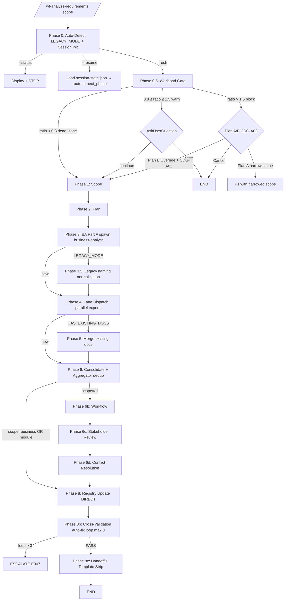

# 03 — Phase Routing

> **Mục đích file:** 14 phases routing + Mermaid + Lane Dispatch + Workload Gate + LEGACY_MODE branching.

---

## 1. Phase routing map (14 phase files)

| Phase | Procedure file | Load khi | Time (standard) |
|-------|---------------|----------|----------------|
| 0 | `phase0-context.md` | Always (entry) | 30s-2min (digest load) |
| 0.5 | `phase0.5-workload-gate.md` | Always | 30s estimation |
| 1 | `phase1-scope.md` | Always | 1 min |
| 2 | `phase2-plan.md` | Always | 1-2 min |
| 3 | `phase3-ba-parta.md` | Always (BA Part A) | 5-15 min |
| 3.5 | `phase3.5-legacy.md` | `$LEGACY_MODE == true` | 2-5 min (legacy naming normalization) |
| 4 | `phase4-experts-partb.md` | Always (Lane Dispatch) | 10-30 min parallel |
| 5 | `phase5-existing-docs.md` | `$HAS_EXISTING_DOCS == true` | 3-10 min (merge logic) |
| 6 | `phase6-consolidate.md` | Always | 2-5 min |
| 6b | `phase6b-workflow.md` | `scope=all` | 3-5 min |
| 6c | `phase6c-stakeholder.md` | `scope=all` | 3-5 min |
| 6d | `phase6d-conflict.md` | `scope=all` | 5-10 min |
| 8 | `phase8-registry.md` | Always | 1-2 min (NO AGENT, direct) |
| 8b | `phase8b-crossval.md` | Always | 2-5 min (auto-correct loop max 3) |
| 8c | `phase8c-handoff.md` | Always | 1 min (digest generation + strip) |

**`_shared.md`** không load standalone — chỉ tham chiếu section.

---

## 2. Flow diagram



---

## 3. Phase 0.5 Workload Gate (ADR-OPT-03)

3 zones based on `ratio = EST_MINUTES / 45`:

| Zone | Ratio | Behavior |
|------|-------|----------|
| `dead_zone` | < 0.8 | Silent continue (không hiển thị) |
| `warn` | 0.8 ≤ ratio ≤ 1.5 | Hiển thị estimate, AskUserQuestion continue/abort |
| `block` | > 1.5 | Plan A/B menu (narrow scope hoặc CDG-A02 Override) |

Estimation: `EST_MINUTES = departments × avg_time_per_dept × complexity_factor`
- `avg_time_per_dept = 3 min` (standard), `1.5 min` (quick), `5 min` (deep)
- `complexity_factor = 1.0` (normal), `1.5` (LEGACY_MODE), `2.0` (multi-system + compliance)

---

## 4. Phase 4 Lane Dispatch (ADR-OPT-01)

Parallel spawn per `(department, expert)` pair:

| Aspect | Detail |
|--------|--------|
| Module | `_shared/lane/dispatcher.py` |
| Max concurrent | 3 (token bucket backpressure) |
| Lane output path | `sessions/{id}/lanes/{dept-key}/signals.json` (schema `lane-signal-v1`) |
| Write isolation | Mỗi lane chỉ write vào subdir của mình — 0 race condition |
| Expert agent mapping | `sales-expert` (Sales/Kinh doanh), `marketing-expert`, `customer-expert` (CSKH), `finance-expert` (Kế toán), `logistics-expert` (Vận chuyển), `manufacturing-expert`, `procurement-expert`, `operations-expert` (Kho/Warehouse), `healthcare-expert` (Lâm sàng/Y tế), v.v. (28 domain experts) |

---

## 5. Phase 6 Signal Aggregation (ADR-OPT-04)

```
Aggregator (module _shared/aggregate/aggregator.py):
  1. Read tất cả sessions/{id}/lanes/*/signals.json
  2. Merge signals[] from all lanes
  3. Dedup theo REQ-ID normalized (lowercase, normalize hyphens)
  4. Flag CONFLICT cho cross-dept duplicates có content khác
  5. Output: sessions/{id}/aggregation-result.json (schema aggregation-result-v1)
     {
       total_input: integer,
       total_output: integer (sau dedup),
       duplicates: integer,
       conflicts: [{req_id, dept_a, dept_b, ...}]
     }
  6. Conflicts route Phase 6d resolve
```

---

## 6. Conditional skipping

| Phase | Skip nếu | Reason |
|-------|---------|--------|
| 3.5 | `$LEGACY_MODE == false` | New project không cần legacy normalization |
| 5 | `$HAS_EXISTING_DOCS == false` | Không có existing docs để merge |
| 6b/6c/6d | `scope != all` | Targeted scope không cần cross-dept review |
| 0 phase nào | `--status` mode | Display only |

---

## 7. Cross-phase data — Pipeline state SSOT

File `sessions/{id}/session-state.json` (ADR-OPT-02):

```json
{
  "$schema": "session-state-v1",
  "session_id": "20260515-143000-a1b2",
  "project_type": "NEW | LEGACY",
  "scope": "all | business | MOD-XXX",
  "phases": {
    "P0": { "status": "completed", "completed_at": "..." },
    "P0_5": { "status": "completed", "gate_decision": "dead_zone_auto_continue | warn_user_continue | block_override_CDG_A02 | block_narrow_scope" },
    "P1": { "status": "completed" },
    "P2": { "status": "completed" },
    "P3": { "status": "completed", "depts_completed": 5 },
    "P3_5": { "status": "skipped|completed" },
    "P4": { "status": "completed", "lanes_completed": ["sales", "marketing", "customer", "finance", "logistics"] },
    "P5": { "status": "skipped|completed" },
    "P6": { "status": "completed", "aggregation": { "input": 47, "output": 42, "duplicates": 5, "conflicts": 2 } },
    "P6b": { "status": "skipped|completed" },
    "P6c": { "status": "skipped|completed" },
    "P6d": { "status": "skipped|completed" },
    "P8": { "status": "completed" },
    "P8b": { "status": "completed", "iterations": 2 },
    "P8c": { "status": "completed" }
  },
  "next_action": "phase_name"
}
```

**Update rule:** atomic write sau mỗi phase complete. `latest` pointer trỏ session dir mới nhất.

---

## 8. Liên kết

- Procedures structure: [07-procedures-structure.md](07-procedures-structure.md)
- File contract: [04-file-contract.md](04-file-contract.md)
- ADR-OPT-01 Lane Dispatch: [08-tradeoffs-adr.md](08-tradeoffs-adr.md)
- Pattern: [`../../03-design-patterns/04-parallel-lane-dispatch.md`](../../03-design-patterns/04-parallel-lane-dispatch.md)
- Pattern: [`../../03-design-patterns/06-checkpoint-resume.md`](../../03-design-patterns/06-checkpoint-resume.md)
