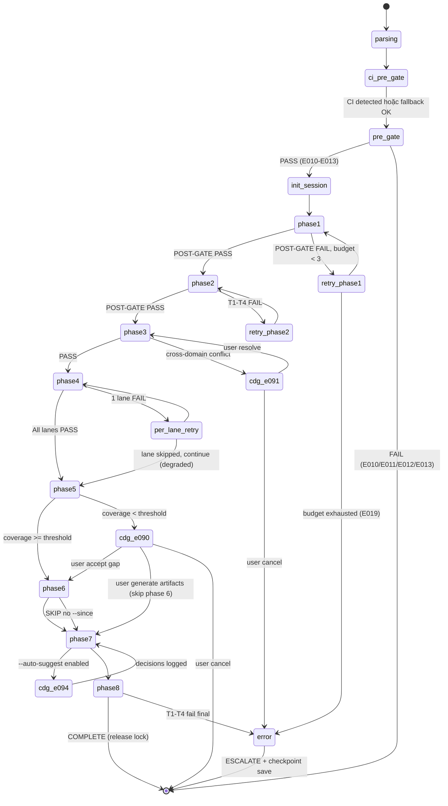

# 03 — Kiến Trúc Skill (wf-cmi)

> **Mục đích file:** Tả KIẾN TRÚC TỔNG QUAN của skill `wf-cmi` — components nào cấu thành, dữ liệu chảy ra sao, song song với ai, integration points với MCV3 engines. Đọc tiếp [03-phase-routing.md](03-phase-routing.md) để hiểu TRÌNH TỰ phase.
> **Khác với [03-phase-routing.md](03-phase-routing.md):** File này tả "bộ máy" (static structure). File 03-phase-routing tả "luồng" (dynamic execution order).

---

## 1. Bản Đồ Tổng Thể

```
                        ┌──────────────────────────────────────────┐
  /wf-cmi ────────────▶ │             ENTRY / ROUTER               │
  [--scope --profile    │     (SKILL.md — lean routing hub ≤500)   │
   --dims --since       │  - Parse args → resolve profile/scope    │
   --from-* --ci        │  - PRE-GATE registry + phase docs        │
   --auto-suggest ...]  │  - CI PRE-GATE 3-step (Na/Nb/Nc)         │
                        │  - Init $SESSION_DIR + acquire R/W lock  │
                        │  - Route to procedures/phase{N}-*.md     │
                        └───────────────┬──────────────────────────┘
                                        │
        ┌───────────────────────────────┼────────────────────────────────┐
        │                               │                                │
        ▼                               ▼                                ▼
 ┌─────────────────┐         ┌──────────────────────┐         ┌────────────────────┐
 │ Graph Builders  │         │ Invariant Inference  │         │ Lane Dispatcher    │
 │  (Phase 2)      │         │ Engine (Phase 3)     │         │  (Phase 4)         │
 │                 │         │                      │         │                    │
 │ • Entity Graph  │         │ Pass 1: cross-module │         │ Spawn 10 lane      │
 │ • Module Graph  │ ──────▶ │ Pass 2: domain LLM   │ ──────▶ │ agents PARALLEL    │
 │ • Workflow Graph│         │ Pass 3: registry gap │         │ (CD1..CD10, max 10 │
 │ • API Graph     │         │ + cross-domain conf  │         │  concurrency)      │
 │ • Event Graph   │         │   detection (CDG)    │         │ Per-lane retry x1  │
 │ • RBAC Matrix   │         │                      │         │                    │
 └────────┬────────┘         └──────────┬───────────┘         └──────────┬─────────┘
          │                             │                                │
          │  6 graphs                   │ business-invariants.json       │ signals.json
          │  JSON files                 │ (sidecar — Engine #4)          │ × 10 lanes
          ▼                             ▼                                ▼
 ┌─────────────────────────────────────────────────────────────────────────────────┐
 │                            SIGNAL AGGREGATOR (Phase 5)                          │
 │  - Load signals.json from all active lanes                                      │
 │  - Dedup cross-lane (fingerprint hash)                                          │
 │  - Compute coverage_pct per dim → coverage-matrix.json                          │
 │  - Apply threshold per profile (60/80/95/100%)                                  │
 │  - CDG E090 nếu dim below threshold                                            │
 └────────────────────────────────────┬────────────────────────────────────────────┘
                                      │
                       ┌──────────────┴──────────────┐
                       ▼                             ▼
            ┌────────────────────┐       ┌────────────────────┐
            │ Regression         │       │ GAP Detector       │
            │ Predictor          │       │ + CDG (Phase 7)    │
            │ (Phase 6)          │       │                    │
            │                    │       │ • Detect gaps      │
            │ • GitNexus impact  │       │ • Suggest artifacts│
            │ • Confidence score │       │ • CDG E094 prompt  │
            │ • Test plan gen    │       │ • Apply via Safe-W │
            └─────────┬──────────┘       └─────────┬──────────┘
                      │                            │
                      │ regression-map.json        │ gap-suggestions.json
                      └──────────────┬─────────────┘
                                     ▼
                       ┌──────────────────────────┐
                       │   REPORT GENERATOR       │
                       │      (Phase 8)           │
                       │                          │
                       │ • integrity-report.md    │
                       │   (≤30 dòng tiếng Việt) │
                       │ • integrity-impact.json  │
                       │   (cross-skill artifact) │
                       │ • audit_chain checksum   │
                       └────────────┬─────────────┘
                                    │
                                    ▼
                  ┌──────────────────────────────────────┐
                  │  CROSS-CUTTING SERVICES (xuyên suốt) │
                  │  • R/W Lock (Protocol 22)            │
                  │  • Session Lock + Heartbeat          │
                  │  • CI Detect + Freshness Check       │
                  │  • Atomic Write (build tmp → mv)     │
                  │  • Error Ledger (E0xx — CORE-034)    │
                  │  • Context Budget Monitor (CORE-038) │
                  │  • Author info (git config)          │
                  └──────────────────────────────────────┘
```

---

## 2. Thành Phần (Components)

### 2.1 SKILL.md — Lean Routing Hub

**Vai trò:** Entry point, lean (≤500 dòng — CORE-032). KHÔNG chứa execution logic. Chỉ:

1. Parse 14 arguments → xác định `$PROFILE`, `$SCOPE`, `$DIMS_ACTIVE`, `$SINCE_REF`, `$AUTO_SUGGEST`, `$CI_MODE`, `$DRY_RUN`.
2. CI PRE-GATE 3-step (Na/Nb/Nc — CORE-033) — bắt buộc vì skill cần đọc code system-wide.
3. PRE-GATE (registry exists + content valid, phase1-business/phase3-architecture docs đủ).
4. Khởi tạo `$SESSION_DIR` + `integrity-status.json` (atomic write — CORE-035) + acquire session lock + spawn heartbeat daemon.
5. Route đến `procedures/phase{N}-*.md` phù hợp.
6. POST-GATE tổng hợp khi Phase 8 hoàn tất.

**KHÔNG làm:**

- KHÔNG nhúng bash script inline (delegate sang `scripts/wf-cmi/`).
- KHÔNG ghi `req-registry.json` (CORE-006 — registry safe-write; wf-cmi ghi sidecar `business-invariants.json` chứ KHÔNG ghi vào registry per ADR-cmi-002).
- KHÔNG đọc lại `session-log.json` / `error-ledger.json` làm input (CORE-026, CORE-034).
- KHÔNG tự generate code `.cs/.ts` — chỉ generate `.md` artifact suggestions (xem Non-goal §5 trong [01-vision-principles.md](01-vision-principles.md)).

**File mapping:** `.claude/skills/workflow/wf-cmi/SKILL.md`

### 2.2 Procedures — Phase Implementation (Lazy-Load)

10 procedure files (xem [07-procedures-structure.md](07-procedures-structure.md)):

| File | Mục đích | Lazy-load khi |
|------|---------|---------------|
| `_shared.md` | Cross-cutting helpers (atomic write, error handling, CI detect, R/W lock) | Mỗi phase Read 1 lần đầu phase |
| `phase1-init.md` | Init + CI PRE-GATE 3-step | Entry sau routing |
| `phase2-discovery.md` | Build 6 graphs system-wide | Sau Phase 1 PASS |
| `phase3-invariant-registry.md` | 3-pass LLM inference + spawn domain experts | Sau Phase 2 PASS |
| `phase4-coverage-dispatch.md` | Spawn 10 lane agents parallel | Sau Phase 3 PASS |
| `phase5-aggregate.md` | Signals → coverage matrix | Sau Phase 4 PASS |
| `phase6-regression.md` | GitNexus impact predictive | Sau Phase 5 PASS (skip nếu no `--since`) |
| `phase7-gap-cdg.md` | GAP detection + CDG decisions | Sau Phase 6 PASS (hoặc Phase 5 nếu skip 6) |
| `phase8-report.md` | Final report + cross-skill artifact | Sau Phase 7 PASS |
| `resume-status.md` | `--resume` + `--status` handlers | Khi flag set |

**Lợi ích lazy-load:** Mỗi procedure chỉ được Read khi tới phase tương ứng — giảm 70%+ context so với monolithic (theo CORE-032).

### 2.3 Graph Builders (Phase 2)

| Trường | Giá trị |
|--------|---------|
| **Vai trò** | Build 6 system-wide graphs từ code + docs + CI index (entity, module, workflow, API, event, RBAC) |
| **Input** | `req-registry.json` + `phase1-business/`, `phase2-features/`, `phase3-architecture/`, code (qua CI tool hoặc Grep fallback) |
| **Output** | 6 JSON files trong `$SESSION_DIR/phase2-discovery/`: `entity-graph.json`, `module-graph.json`, `workflow-graph.json`, `api-graph.json`, `event-graph.json`, `rbac-matrix.json` |
| **Stateful?** | Không (build-from-source mỗi lần; cache TTL 4h-24h tuỳ profile) |
| **Spawn agent?** | Optional (LLM-assisted parse với `architect` agent khi profile=deep+; mặc định Grep/Serena parse) |
| **Idempotent?** | Có — cùng source code → cùng graphs |

**Bỏ qua:** CD5 event graph bỏ khi `--profile=quick` HOẶC project không có RabbitMQ/SignalR (xem [03-phase-routing.md](03-phase-routing.md) §4).

### 2.4 Invariant Inference Engine (Phase 3)

| Trường | Giá trị |
|--------|---------|
| **Vai trò** | Infer business invariants liên module qua 3-pass LLM + domain experts; là **producer chính** của Engine #4 (Business Invariant Registry) |
| **Input** | 6 graphs từ Phase 2 + `team-expert/{domain}/*.md` + `phase1-business/*.md` |
| **Output** | Sidecar `business-invariants.json` (schema `business-invariants-v1`, **KHÔNG bump req-registry** per ADR-cmi-002 Revised) |
| **Stateful?** | Có — checkpoint sau mỗi pass (Pass 1 / Pass 2 / Pass 3) để `--resume` được |
| **Spawn agent?** | ✅ — `architect` (Pass 1 cross-module pattern) + `{domain}-experts` (Pass 2, max 5 concurrent để chừa budget Phase 4) + `business-analyst` (Pass 3 aggregate). Spawn theo `requirements[].department` từ registry (xem [01-vision-principles.md](01-vision-principles.md) §7) |
| **Idempotent?** | Không hoàn toàn — LLM có temperature, nhưng cache LLM result 7 days (quick=N/A, standard/deep) → resume re-use kết quả |

**CDG E091:** Cross-domain conflict (vd: `logistics-expert` + `finance-expert` opinion lệch về Customs declaration) → CDG batch ESCALATE trước khi commit invariant.

### 2.5 Lane Dispatcher (Phase 4 — Orchestrator core)

| Trường | Giá trị |
|--------|---------|
| **Vai trò** | Spawn 10 lane agents (CD1..CD10) parallel để probe coverage 10 chiều; max concurrency 10 (CORE-025) |
| **Input** | 6 graphs (Phase 2) + `business-invariants.json` (Phase 3) + `$CI_CONTEXT` |
| **Output** | `$SESSION_DIR/phase4-coverage/lanes/CD{N}/signals.json` × 10 + `Phase4-report.md` × 10 |
| **Stateful?** | Có — `integrity-status.json.lane_status{}` cập nhật mỗi lane PASS/FAIL/RUNNING (atomic write) |
| **Spawn agent?** | ✅ — 10 lane agents (xem [agent-prompt.md](agent-prompt.md)) với prompt 8-section (CORE-037). Mỗi lane có agent đặc thù: CD1 business-analyst, CD2 dba, CD3 architect, CD4 architect, CD5 architect, CD6 security, CD7 dba, CD8 sre, CD9 architect, CD10 tech-writer |
| **Idempotent?** | Per-lane retry x1 (CORE-034 budget) — nếu lane fail vẫn record và aggregate |

**Lane activation matrix:** quick=5 / standard=7 / deep=10 / exhaustive=10 (xem [05-execution-profiles.md](05-execution-profiles.md) §3).

### 2.6 Signal Aggregator (Phase 5)

| Trường | Giá trị |
|--------|---------|
| **Vai trò** | Aggregate signals từ 10 lanes → compute coverage_pct per dim → coverage-matrix.json |
| **Input** | `lanes/CD{N}/signals.json` × N (N = số lane active theo profile) |
| **Output** | `coverage-matrix.json` (schema `coverage-matrix-v1`), `signals-aggregated.jsonl`, `coverage-report.md` (≤15 dòng tiếng Việt) |
| **Stateful?** | Không (pure aggregation từ Phase 4 outputs) |
| **Spawn agent?** | ❌ — pure compute (Python script `coverage-compute.py`) |
| **Idempotent?** | Có |

**Threshold gate:** Coverage < threshold → CDG E090 (user choose accept/generate artifacts/cancel). Exhaustive profile yêu cầu 100% mọi dim, không cho skip qua CDG.

### 2.7 Regression Predictor (Phase 6 — Optional)

| Trường | Giá trị |
|--------|---------|
| **Vai trò** | Predictive impact analysis qua GitNexus impact graph hoặc diff-aware `git log` fallback |
| **Input** | `$SINCE_REF`, GitNexus index (Engine #6 + #3), module-graph từ Phase 2 |
| **Output** | `regression-map.json` (predicted_modules[], confidence_scores[], test_plan[]) + `regression-report.md` |
| **Stateful?** | Không |
| **Spawn agent?** | Optional — `data-engineer` cho ML confidence scoring (chỉ profile=exhaustive) |
| **Idempotent?** | Có (cùng git ref → cùng diff) |

**SKIP nếu:** `--since` không set HOẶC `--profile=quick` HOẶC GitNexus không available (downgrade từ predictive → diff-aware, WARN E062).

### 2.8 GAP Detector + CDG (Phase 7)

| Trường | Giá trị |
|--------|---------|
| **Vai trò** | Phát hiện gap (dim below threshold, missing invariant, orphan FK) + generate suggestions (test/contract/invariant) + CDG decision flow |
| **Input** | coverage-matrix, business-invariants, signals-aggregated, regression-map |
| **Output** | `gap-suggestions.json`, `gap-report.md`, CDG decisions log |
| **Stateful?** | Có — CDG decisions stored với `cdg_decision_at` timestamp để audit |
| **Spawn agent?** | ✅ — `business-analyst` + `{domain}-experts` cho generate suggestion content (max 3 concurrent) |
| **Idempotent?** | Không — CDG là user-driven, mỗi run có thể ra quyết định khác |

**Self-healing nguyên tắc (v1):** KHÔNG tự apply fix code. CHỈ đề xuất artifact bổ sung qua CDG (user ACCEPT/REJECT/DEFER per item). Nếu ACCEPT → APPEND invariant vào `business-invariants.json` qua Safe-Write (KHÔNG ghi req-registry).

### 2.9 Report Generator (Phase 8)

| Trường | Giá trị |
|--------|---------|
| **Vai trò** | Generate `integrity-report.md` (≤30 dòng tiếng Việt cho non-coder) + `integrity-impact.json` (cross-skill artifact, schema `integrity-impact-v1`, CORE-036) |
| **Input** | All phase outputs |
| **Output** | `integrity-report.md`, `integrity-impact.json` với `audit_chain.checksum` (sha256), git_commit, git_branch, author |
| **Stateful?** | Không |
| **Spawn agent?** | ❌ — template-based generation |
| **Idempotent?** | Có |

**`--ci` mode:** Format JSON output + post comment lên PR (GitHub API call). `--show-graphs` render Mermaid diagrams inline.

### 2.10 Cross-Cutting Services

| Service | Mục đích | File / Pattern |
|---------|---------|---------------|
| CI Detect | Auto-detect GitNexus/Serena availability (CORE-033) | `.claude/scripts/ci-detect.sh` |
| CI Freshness Check | Verify index khớp HEAD (4 mức: ok/light/strong/severe) | `.claude/scripts/ci-freshness-check.sh` |
| CI Context Injection | Build `$CI_CONTEXT` cho agent prompt | `.claude/scripts/ci-inject-context.sh` |
| Session Lock + Heartbeat | Cô lập session (CORE-030), stale check 30 min auto-release | `.claude/scripts/wf-cmi/lock-manager.sh` |
| R/W Lock (Protocol 22) | Multi-session safe — N session đọc song song, write lock chỉ khi update registry/CDG approve | `.claude/scripts/_shared/rw-lock.sh` |
| Atomic Write | Build tmp → validate JSON → mv tmp → target (CORE-035) | Inline pattern trong `_shared.md` |
| CDG Gate | Critical Decision Gate user prompt (CORE-027) — E090..E099 ranges | `cdg_prompt()` trong `error-handlers.sh` |
| Author Info | git config user.email + user.name → audit_chain | `get_git_author()` inline |
| Graph Utilities | merge/traverse/centrality computation | `.claude/scripts/wf-cmi/graph-utils.py` |
| Coverage Compute | coverage_pct + threshold apply | `.claude/scripts/wf-cmi/coverage-compute.py` |

---

## 3. Sequence Diagram — Happy Path (Standard Profile, EUREKA 17 modules)

```
User ──/wf-cmi --scope=system --profile=standard ──▶ SKILL.md (Router)
                                  │
                                  │ 1. Parse args → PROFILE=standard, SCOPE=system, DIMS=CD1..CD9 (skip CD8,CD10)
                                  │ 2. CI PRE-GATE 3-step (Na: detect, Nb: freshness, Nc: inject context)
                                  │ 3. PRE-GATE: registry exists, phase docs ≥ Phase 3
                                  │ 4. Init $SESSION_DIR + acquire R/W lock + heartbeat daemon
                                  │
                                  ├──▶ procedures/phase1-init.md
                                  │      └─ integrity-status.json (phase=1, lane_status=PENDING × 7)
                                  │
                                  ├──▶ procedures/phase2-discovery.md
                                  │      ├─ Graph Builders × 6 (parallel scan; CD5 event included for standard)
                                  │      └─ POST-GATE: 6 JSON files exist, cross-ref consistent
                                  │
                                  ├──▶ procedures/phase3-invariant-registry.md
                                  │      ├─ Pass 1 LLM (architect, cross-module pattern)
                                  │      ├─ Pass 2 LLM (5 domain experts concurrent: logistics, finance, sales, hr, customer)
                                  │      ├─ Pass 3 LLM (business-analyst aggregate)
                                  │      └─ business-invariants.json (50+ invariants)
                                  │
                                  ├──▶ procedures/phase4-coverage-dispatch.md
                                  │      ├─ Spawn 7 lane agents PARALLEL (CD1..CD7, CD9)
                                  │      ├─ Monitor: each lane 1-3 min, max concurrency 10
                                  │      └─ POST-GATE: 7 signals.json + 7 Phase4-report.md
                                  │
                                  ├──▶ procedures/phase5-aggregate.md
                                  │      ├─ Load 7 signals.json → dedup → compute coverage_pct/dim
                                  │      ├─ Apply threshold 80% (standard) → CDG E090 nếu vi phạm
                                  │      └─ coverage-matrix.json + coverage-report.md
                                  │
                                  ├──▶ procedures/phase6-regression.md
                                  │      └─ SKIP (no --since set trong example này)
                                  │
                                  ├──▶ procedures/phase7-gap-cdg.md
                                  │      ├─ Detect gaps (CD3 workflow coverage 75% < 80%)
                                  │      ├─ Generate suggestions (3 test cases + 2 invariant rules)
                                  │      └─ CDG E094: user ACCEPT 2 invariants, REJECT 3 tests
                                  │
                                  ├──▶ procedures/phase8-report.md
                                  │      ├─ integrity-report.md (≤30 dòng tiếng Việt)
                                  │      ├─ integrity-impact.json + audit_chain.checksum
                                  │      └─ Mark session COMPLETED trong _index/sessions.jsonl
                                  │
                                  ▼
                          Release lock + kill heartbeat daemon
                          Output: 4 cross-skill artifacts ready cho wf-verify-sync, wf-fix-bugs,
                                  wf-implement-feature, wf-prepare-deployment consume
```

---

## 4. Parallelism Model

### 4.1 Ai song song với ai?

| Phân lớp | Song song? | Điều kiện |
|----------|-----------|-----------|
| Phase × Phase | **Không** | Phase sau cần output phase trước (CORE-002) |
| Graph Builder × Graph Builder (Phase 2) | Có | 6 graphs build từ source độc lập; write scope tách biệt (`entity-graph.json` ≠ `module-graph.json`) |
| Domain Expert × Domain Expert (Phase 3 Pass 2) | Có | Max 5 concurrent (chừa 5 budget cho Phase 4 retry) |
| Lane × Lane (Phase 4) | Có | Write scope tách biệt — `$SESSION_DIR/phase4-coverage/lanes/CD{X}/` (CORE-025) |
| Probe × Probe trong lane | Tuần tự | Lane tự quản; mặc định tuần tự để giữ context |
| GAP Suggestion Agent × Agent (Phase 7) | Có | Max 3 concurrent |

### 4.2 Giới hạn

- **Default max 10 concurrent agents** (CORE-025) — Phase 4 chiếm full budget khi profile=deep/exhaustive (10 lanes).
- **Phase 3 Pass 2:** max 5 domain experts (chừa 5 budget phòng Phase 4 retry chồng lên).
- **Auto-downgrade `--ci` mode:** Nếu CI runner timeout < 30 min → bump deep → standard (E108).

### 4.3 Multi-session parallelism (Protocol 22 R/W Lock)

- **Read lock:** N session đồng thời được đọc registry + cache (graphs, LLM results) — không block.
- **Write lock:** Chỉ acquire khi update sidecar `business-invariants.json` (vài giây qua CDG approve trong Phase 7).
- **Max sessions/máy:** quick/standard = 5, deep/exhaustive = 2 (xem [05-execution-profiles.md](05-execution-profiles.md) §1).

### 4.4 Vì sao không "song song hết"?

- Agent (architect/business-analyst/...) có giới hạn concurrent token budget.
- Phase 3 Pass 2 chạy 24 domain expert sẽ overkill — chỉ spawn theo `requirements[].department` từ registry.
- Phase 4 lane 10 cần GitNexus query budget — quá nhiều concurrent gây rate limit.
- Debug khó khi N agent log trộn lẫn.

> Pattern tham khảo: [`../../03-design-patterns/04-parallel-lane-dispatch.md`](../../03-design-patterns/04-parallel-lane-dispatch.md).

---

## 5. Data Flow Chi Tiết

### 5.1 Phase → State Store

```
Phase 1 (Init)
  ▼
$SESSION_DIR/integrity-status.json        ← phase=1, lane_status={CD1..CD7: PENDING, CD9: PENDING}
$SESSION_DIR/session-log.json             ← APPEND start event
  ▼
Phase 2 (Discovery)
  ▼
$SESSION_DIR/phase2-discovery/
  ├─ entity-graph.json                    ← Atomic write từ template
  ├─ module-graph.json
  ├─ workflow-graph.json
  ├─ api-graph.json
  ├─ event-graph.json (skip nếu quick)
  ├─ rbac-matrix.json
  └─ Phase2-report.md (≤15 dòng tiếng Việt)
$SESSION_DIR/integrity-status.json        ← phase=2, current_phase update atomic
  ▼
Phase 3 (Invariant Registry)
  ▼
$SESSION_DIR/phase3-invariants/
  ├─ business-invariants.json             ← Sidecar artifact (Engine #4)
  └─ Phase3-report.md
  ▼
Phase 4 (Coverage Dispatch — PARALLEL)
  ▼
$SESSION_DIR/phase4-coverage/lanes/
  ├─ CD1/signals.json + Phase4-report.md  ← Atomic write per lane
  ├─ CD2/signals.json + Phase4-report.md
  ├─ ...
  └─ CD9/signals.json + Phase4-report.md
$SESSION_DIR/integrity-status.json        ← lane_status atomic update
  ▼
Phase 5 (Aggregate)
  ▼
$SESSION_DIR/phase5-aggregate/
  ├─ coverage-matrix.json                 ← Schema coverage-matrix-v1
  ├─ signals-aggregated.jsonl
  └─ coverage-report.md
  ▼
Phase 6 (Regression — Optional skip)
  ▼
$SESSION_DIR/phase6-regression/
  ├─ regression-map.json                  ← Schema regression-map-v1
  └─ regression-report.md
  ▼
Phase 7 (GAP + CDG)
  ▼
$SESSION_DIR/phase7-gap-cdg/
  ├─ gap-suggestions.json                 ← Schema gap-suggestions-v1
  ├─ gap-report.md
  └─ cdg-decisions.log                    ← Audit trail
  ▼
Phase 8 (Report)
  ▼
$SESSION_DIR/phase8-report/
  ├─ integrity-report.md                  ← ≤30 dòng tiếng Việt cho PO/BA
  └─ integrity-impact.json                ← Cross-skill artifact (schema integrity-impact-v1)
$SESSION_DIR/integrity-status.json        ← status=COMPLETED
.mc-data/work/wf-cmi/_index/sessions.jsonl ← APPEND COMPLETED entry
```

### 5.2 Cross-Skill Artifacts (Producer-Consumer Contract — CORE-036)

Skill này produce 2 artifacts chính cho downstream qua `_contract.json`:

```json
{
  "produces_for": {
    "wf-verify-sync": ["$SESSION_DIR/phase8-report/integrity-impact.json"],
    "wf-fix-bugs": ["$SESSION_DIR/phase8-report/integrity-impact.json"],
    "wf-implement-feature": ["$SESSION_DIR/phase8-report/integrity-impact.json"],
    "wf-prepare-deployment": ["$SESSION_DIR/phase8-report/integrity-impact.json"],
    "wf-design": ["$SESSION_DIR/phase3-invariants/business-invariants.json"],
    "wf-add-scope": ["$SESSION_DIR/phase3-invariants/business-invariants.json"]
  },
  "consumes_from": {
    "wf-brainstorm": [".mc-data/docs/_meta/req-registry.json"],
    "wf-analyze-requirements": [".mc-data/docs/phase1-business/*.md"],
    "wf-define-features": [".mc-data/docs/phase2-features/**/*.md"],
    "wf-design": [".mc-data/docs/phase3-architecture/*.md"],
    "wf-implement-feature": [".mc-data/work/wf-implement-feature/**/impl-status.json"],
    "wf-fix-bugs": [".mc-data/work/wf-fix-bugs/sessions/*/phase7-verify/fix-impact.json"],
    "wf-verify-sync": [".mc-data/work/wf-verify-sync/sessions/*/verify-sync-impact.json"],
    "wf-e2e-finding": [".mc-data/work/wf-e2e-verify/sessions/*/cross-module-gaps.md"],
    "wf-legacy-scan": [".mc-data/work/legacy-scan/module-code-mapping.json"]
  }
}
```

**Artifact requirements:**

- **Schema versioned:** `integrity-impact-v1`, `business-invariants-v1`, `coverage-matrix-v1`, `regression-map-v1`, `gap-suggestions-v1`.
- **`audit_chain.source` + `audit_chain.checksum`** (sha256) cho mọi cross-skill artifact.
- **`git_commit`, `git_branch`, `author.{email,name}`** trong audit_chain cho multi-user collab.
- Consumer validate ở PRE-GATE (T1 exists → T2 structure → T3 content) — graceful degradation nếu artifact thiếu/version mismatch (WARN, không block).

> Chi tiết schema từng artifact: xem [04-file-contract.md](04-file-contract.md) §4.

### 5.3 Checkpoint & Resume

| Layer | Checkpoint File | Khi nào ghi |
|-------|-----------------|-------------|
| Orchestrator | `integrity-status.json` | Sau mỗi POST-GATE PASS + heartbeat mỗi 30s |
| Phase 3 Pass-internal | `$SESSION_DIR/phase3-invariants/pass{N}-checkpoint.json` | Sau mỗi pass (Pass 1/2/3) |
| Phase 4 Lane-internal | `$SESSION_DIR/phase4-coverage/lanes/CD{N}/checkpoint.json` | Sau mỗi probe lớn (>30s work) |
| Spawned agent | `$SESSION_DIR/agents/{name}/progress.json` | Agent tự quản |
| Session index | `.mc-data/work/wf-cmi/_index/sessions.jsonl` | START + COMPLETE event (APPEND-only) |

**Resume routing:** `integrity-status.json.next_action` xác định điểm vào lại (xem [03-phase-routing.md](03-phase-routing.md) §5 + [07-procedures-structure.md](07-procedures-structure.md) §5).

---

## 6. File Layouts

Section này tả 2 view đối xứng: **SOURCE** (skill code trên disk, ổn định) và **OUTPUT** (artifacts skill tạo ra trong session, dynamic).

### 6.1 Source Layout — Skill code trên disk

```
.claude/skills/workflow/wf-cmi/
├── SKILL.md                              # Lean routing hub (≤500 dòng — CORE-032)
├── _contract.json                        # Cross-skill contract (CORE-036)
├── procedures/                           # 10 lazy-load procedures
│   ├── _shared.md                        # Cross-cutting concerns
│   ├── phase1-init.md
│   ├── phase2-discovery.md
│   ├── phase3-invariant-registry.md
│   ├── phase4-coverage-dispatch.md
│   ├── phase5-aggregate.md
│   ├── phase6-regression.md
│   ├── phase7-gap-cdg.md
│   ├── phase8-report.md
│   └── resume-status.md                  # --resume & --status handlers
├── templates/                            # 12+ output templates (CORE-031)
│   ├── integrity-status.json
│   ├── business-invariants.json
│   ├── coverage-matrix.json
│   ├── regression-map.json
│   ├── gap-suggestions.json
│   ├── integrity-impact.json
│   ├── Phase1-report.md ... Phase8-report.md
│   └── (12 templates — xem 06-templates-list.md)
├── evals/                                # 5 test cases (CORE 9-evals)
│   ├── evals.json
│   └── golden/                           # Golden fixtures: minimal/realistic/corrupt/concurrent
└── scripts/                              # Skill-specific helpers
    ├── atomic-write.sh
    ├── error-handlers.sh
    ├── logging.sh
    ├── lock-manager.sh
    ├── graph-utils.py
    └── coverage-compute.py
```

**Cross-references:**
- Skill spawn 10 lane agents + domain experts → `.claude/agents/business/`, `.claude/agents/engineering/`, `.claude/agents/orchestrator.md`.
- Domain knowledge → `.claude/references/team-expert/{logistics,finance,sales,hr,customer,compliance,...}/`.
- Shared CI helpers → `.claude/scripts/{ci-detect,ci-freshness-check,ci-inject-context}.sh`.
- Shared R/W lock → `.claude/scripts/_shared/rw-lock.sh`.

### 6.2 Session Output Layout — Artifacts skill tạo ra

Khi wf-cmi chạy xong, session directory chứa các artifacts sau (tree top-level — chi tiết schema xem [04-file-contract.md](04-file-contract.md)):

```
.mc-data/work/wf-cmi/
├── _index/
│   └── sessions.jsonl                    # APPEND-only — index mọi session đã chạy
└── sessions/
    └── {YYYY-MM-DD-{scope}-{slug}-{NN}}/  # 1 session = 1 directory cô lập (CORE-030)
        │                                  # vd: 2026-05-15-system-eureka-erp-01
        ├── .lock                          # Session lock + heartbeat daemon
        ├── integrity-status.json          # SSOT pipeline state (atomic write)
        ├── session-log.json               # Execution trace (APPEND-only — CORE-026)
        ├── error-ledger.json              # Error tracking (APPEND-only — CORE-034)
        │
        ├── phase1-init/                   # CORE-035 — subdirectory per phase
        │   └── Phase1-report.md           # ≤15 dòng tiếng Việt (CORE-028)
        │
        ├── phase2-discovery/
        │   ├── Phase2-report.md
        │   ├── entity-graph.json
        │   ├── module-graph.json
        │   ├── workflow-graph.json
        │   ├── api-graph.json
        │   ├── event-graph.json           # SKIP nếu profile=quick
        │   └── rbac-matrix.json
        │
        ├── phase3-invariants/
        │   ├── Phase3-report.md
        │   ├── business-invariants.json   # Sidecar artifact (Engine #4)
        │   └── pass{1,2,3}-checkpoint.json
        │
        ├── phase4-coverage/
        │   └── lanes/
        │       ├── CD1/
        │       │   ├── signals.json
        │       │   └── Phase4-report.md
        │       ├── CD2/...
        │       └── CD9/...               # 5/7/10 lanes tuỳ profile
        │
        ├── phase5-aggregate/
        │   ├── Phase5-report.md
        │   ├── coverage-matrix.json
        │   ├── signals-aggregated.jsonl
        │   └── coverage-report.md
        │
        ├── phase6-regression/             # SKIP nếu no --since hoặc quick
        │   ├── Phase6-report.md
        │   ├── regression-map.json
        │   └── regression-report.md
        │
        ├── phase7-gap-cdg/
        │   ├── Phase7-report.md
        │   ├── gap-suggestions.json
        │   ├── gap-report.md
        │   ├── cdg-decisions.log
        │   └── suggestions/                # Generated artifact files per suggestion
        │       └── CMI-V-001-fix.md
        │
        └── phase8-report/
            ├── Phase8-report.md
            ├── integrity-report.md         # ≤30 dòng tiếng Việt cho PO/BA
            └── integrity-impact.json       # Cross-skill artifact (schema integrity-impact-v1)
```

**Quy tắc đọc tree:**

| Block | Mục đích |
|-------|---------|
| `_index/sessions.jsonl` | Tra cứu lịch sử — `--status` đọc file này |
| `sessions/{ID}/.lock` + state files (`integrity-status`, `session-log`, `error-ledger`) | Runtime state ở root session — luôn có 4 files này |
| `sessions/{ID}/phase{N}-{name}/` | 1 subdirectory/phase chứa output đặc thù + `Phase{N}-report.md` (CORE-028) |
| `sessions/{ID}/phase8-report/integrity-impact.json` | Cross-skill artifact chính (CORE-036) — consume bởi wf-verify-sync, wf-fix-bugs, wf-implement-feature, wf-prepare-deployment |
| `sessions/{ID}/phase3-invariants/business-invariants.json` | Sidecar Engine #4 — consume bởi wf-design, wf-add-scope (implicit, luôn đọc) |

**Cross-skill artifacts produced:**

| Artifact | Path | Consumer |
|----------|------|----------|
| `integrity-impact.json` | `sessions/{ID}/phase8-report/integrity-impact.json` | wf-verify-sync, wf-fix-bugs, wf-implement-feature, wf-prepare-deployment (xem [04-file-contract.md](04-file-contract.md) §3) |
| `business-invariants.json` | `sessions/{ID}/phase3-invariants/business-invariants.json` | wf-design, wf-add-scope (read-only sidecar) |

> **Lưu ý:** Tree trên là **structure**. Schema cụ thể của từng file (fields, types, validation rules) ở [04-file-contract.md](04-file-contract.md). KHÔNG lặp lại schema ở đây.

> **Khi nào tree này thay đổi:** Khi thêm/bớt phase (vd v2 thêm Phase 9 auto-apply), hoặc đổi naming convention session ID. Update đồng thời cả [04-file-contract.md](04-file-contract.md) và section này.

---

## 7. CORE Rules Phải Tôn Trọng

| Rule | Áp dụng ở đâu | Verify thế nào |
|------|---------------|----------------|
| CORE-006 (Safe-Write Registry) | wf-cmi **KHÔNG** ghi `req-registry.json` (ADR-cmi-002 Revised) — chỉ ghi sidecar `business-invariants.json` | Audit `_contract.json.registry_scope.fields_owned[]` rỗng cho registry; chỉ có sidecar |
| CORE-007 (Cross-Skill Path Contract) | 2 cross-skill artifacts paths theo Protocol 21 §3.14 (mới) | `validate-schema-sync.sh wf-cmi` |
| CORE-020 (Safety Gate) | Không áp dụng — wf-cmi chỉ đọc code, KHÔNG modify code | — |
| CORE-025 (Parallelization) | Phase 4 max 10 lanes; Phase 3 Pass 2 max 5 experts | Code check trong `phase4-coverage-dispatch.md` |
| CORE-026 (Execution Trace) | `session-log.json` APPEND-only mỗi phase START/COMPLETE/FAIL | Output-only, không Read làm input |
| CORE-027 (CDG) | Phase 3 conflict (E091), Phase 5 threshold violation (E090), Phase 7 suggestion (E094), auto-upgrade profile (E096) | Spawn AskUserQuestion qua `cdg_prompt()` |
| CORE-028 (Phase Summary) | Sau mỗi POST-GATE PASS | `Phase{N}-report.md` ≤15 dòng tiếng Việt; `integrity-report.md` ≤30 dòng |
| CORE-030 (Session Isolation) | Mọi runtime data trong `.mc-data/work/wf-cmi/sessions/{id}/` | `.lock` + heartbeat daemon |
| CORE-032 (Lazy-Load) | SKILL.md ≤500 dòng; 10 procedure files | `wc -l SKILL.md` ≤ 500 |
| CORE-033 (CI-First) | Skill đọc code system-wide → CI PRE-GATE bắt buộc | CI PRE-GATE Na/Nb/Nc ở Phase 1 |
| CORE-034 (Error Codes) | Namespace E010-E099 (Phase 1: E010-E019, ..., CDG: E090-E099) | error-ledger.json APPEND-only |
| CORE-035 (Phase Output Org) | 8 subdirectories `phase{N}-{name}/` | Atomic write JSON |
| CORE-036 (Cross-Skill Artifact) | `integrity-impact.json` + `business-invariants.json` schema versioned + audit_chain | `_contract.json.produces_for{}` map 6 consumer |
| CORE-037 (Agent Prompt 8 sections) | 10 lane agents (Phase 4) + domain experts (Phase 3) + triage (Phase 7) | Xem [agent-prompt.md](agent-prompt.md) template |
| CORE-038 (Context Budget) | Phase 3 + Phase 4 tốn nhiều token (3-pass LLM + 10 lanes) | <65% OK, 65-80% prep checkpoint, 80-90% stop sau phase hiện tại, >90% FORCE STOP E009 |

**Behavioral principles bổ sung:**
- **BHV-001** (Think Before Coding cho LLM): 3-pass inference KHÔNG silent assume — Pass 1 generate hypothesis, Pass 3 validate qua business-analyst aggregate.
- **BHV-002** (Simplicity v1): KHÔNG auto-apply fix code; chỉ suggest qua CDG. v2 mới thêm `--auto-apply` cho non-code artifact.
- **BHV-003** (Surgical Changes): Sidecar `business-invariants.json` KHÔNG đụng `req-registry.json` (per ADR-cmi-002 Revised).
- **BHV-004** (Goal-Driven): Mỗi profile có threshold rõ ràng (60/80/95/100%), DONE-criteria = `coverage_pct ≥ threshold OR user accept gap qua CDG`.

---

## 8. State Machine — Orchestrator Main Loop



**Resume entry points:**
- `--resume`: Đọc `integrity-status.json.next_action` → route đến phase tương ứng → re-validate PRE-GATE → continue.
- `--status`: Đọc `integrity-status.json` → in summary → exit 0 (không thay đổi state).

---

## 9. Sai Hỏng Và Fallback

| Tình huống | Hành vi |
|------------|---------|
| Phase 1 PRE-GATE FAIL (registry missing/empty) | ESCALATE: gợi ý `/wf-brainstorm` hoặc `/existing-project` (E010-E012) |
| Phase 2 graph builder fail 1/6 graphs | Auto-fix retry x3 (CORE-034). Hết → SKIP graph đó với WARN, các lane phụ thuộc graph đó SKIP downstream |
| Phase 3 LLM pass fail | Per-pass retry x1. Hết → fallback heuristic only, mark `inferred_by.confidence` thấp hơn |
| Phase 3 cross-domain conflict (E091) | CDG batch prompt user — phải resolve trước Phase 4 |
| Phase 4 lane agent timeout (3 min) | Per-lane retry x1 (E041). Hết → mark lane FAILED, aggregate vẫn tiếp tục với degraded coverage |
| Phase 5 coverage < threshold | CDG E090: user choose accept gap / generate artifacts / cancel. Exhaustive profile = mandatory cancel nếu < 100% |
| Phase 6 GitNexus unavailable | Downgrade từ predictive → diff-aware (`git log` fallback) với WARN E062 |
| Phase 7 user REJECT all suggestions | Log audit, không trigger lại trong session sau (trừ `--force`) |
| Phase 8 cross-skill artifact write fail | Auto-fix retry x3. Hết → ABORT (E083) — downstream skills sẽ không có artifact để consume |
| Session lock held (orphan) | Stale check: age > 30 min → auto-release (E008); else WARN, suggest `--resume --session-id=<ID>` |
| CI tool unavailable (cả GitNexus + Serena) | Graceful degradation → Grep/Glob fallback toàn skill (Protocol 20, zero regression nhưng chậm hơn) |
| Spawned agent timeout (Phase 3 hoặc Phase 4) | Retry 1 lần → fail thì skip + note "agent_timeout" trong error-ledger |
| Context > 90% | FORCE STOP (E009) — checkpoint bắt buộc, hướng dẫn `--resume` (CORE-038) |
| Multi-session conflict trên cùng sidecar `business-invariants.json` | Protocol 22 R/W lock — write lock acquired khi CDG approve; session khác block tới khi release |
| `--since=<invalid-ref>` | E014 — abort trước Phase 1 (validate qua `git rev-parse --verify`) |

---

## 10. Testability

Mỗi component độc lập testable:

- **SKILL.md routing:** Chạy `--dry-run` → verify route đúng phase, không execute steps. Test case TC-cmi-001 smoke profile=quick.
- **Procedure phase{N}:** Standalone — copy state files từ golden fixture → chạy phase isolated → so output với expected. Test case TC-cmi-002 integration profile=standard.
- **Graph Builders (Phase 2):** Unit test cho mỗi builder qua fixture code (`evals/golden/minimal/`, `evals/golden/realistic/`).
- **Invariant Inference (Phase 3):** Mock LLM responses qua fixture → verify aggregate logic correct.
- **Lane Dispatcher (Phase 4):** Mock agent spawn → verify max concurrency 10 + per-lane retry x1 logic.
- **Signal Aggregator (Phase 5):** Pure Python function → unit test với fixture signals.json.
- **Cross-skill artifact:** Validator script đọc `_contract.json` → verify producer output thoả schema `integrity-impact-v1`.
- **Spawned agent prompt:** Static check — agent prompt template có đủ 8 sections (CORE-037)?
- **Resume flow:** TC-cmi-004 — interrupt at Phase 4 lane dispatch → resume verify lane_status restored correctly.
- **Concurrent sessions:** TC-cmi-005 — 2 sessions cùng máy, verify R/W lock không corrupt sidecar.

**Golden fixtures:** `.claude/skills/workflow/wf-cmi/evals/golden/` (4 fixtures: minimal/realistic/corrupt/concurrent) — xem [09-evals-test-cases.md](09-evals-test-cases.md).

---

## 11. Liên Kết

- Phase routing chi tiết: [03-phase-routing.md](03-phase-routing.md)
- File contract chi tiết: [04-file-contract.md](04-file-contract.md)
- Execution profiles: [05-execution-profiles.md](05-execution-profiles.md)
- Procedures outline: [07-procedures-structure.md](07-procedures-structure.md)
- Tradeoffs ADR: [08-tradeoffs-adr.md](08-tradeoffs-adr.md) (đặc biệt ADR-cmi-002 Revised về sidecar)
- User scenarios: [08-user-scenarios-solutions.md](08-user-scenarios-solutions.md)
- Agent prompt template: [agent-prompt.md](agent-prompt.md) (10 lane agents + Phase 3 domain experts + Phase 7 triage)
- Pattern catalog: [`../../03-design-patterns/`](../../03-design-patterns/) (01-lazy-load, 02-ci-first, 03-cross-skill, 04-parallel-lane, 05-agent-prompt, 06-checkpoint-resume)
- Skill standard anatomy: [`../../02-standards/02-skill-standard.md`](../../02-standards/02-skill-standard.md)
- 15 engines map: [`../../01-architecture/10-mcv3-engines-overview.md`](../../01-architecture/10-mcv3-engines-overview.md) (#2, #3, #4, #5, #6, #7, #8, #10, #14, #15)
- Real example (orchestrator phức tạp): [`../wf-fix-bugs/03-architecture.md`](../wf-fix-bugs/03-architecture.md) — Lane Dispatch + Signal Bus + Shared Services
