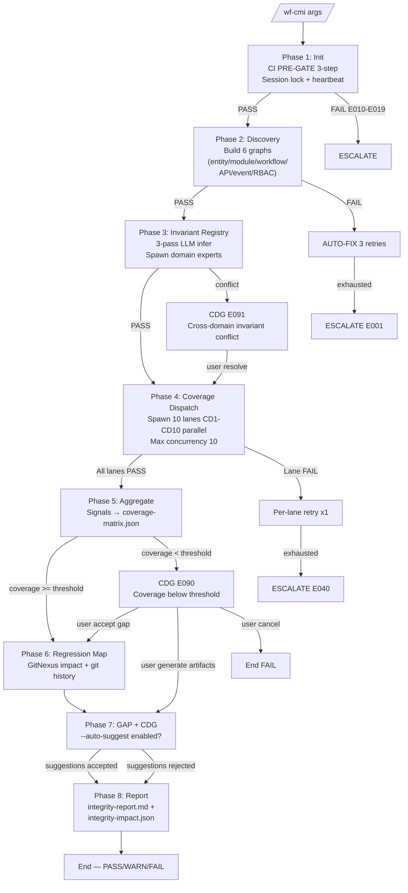

# 03 — Phase Routing

> **Mục đích file:** Chỉ rõ luồng skill `wf-cmi` — 8 phases, transitions, profile dispatch, conditional skips, regression-aware.

---

## 1. Phase routing map

| Phase | Tên | Procedure file | Đầu vào chính | Đầu ra chính | Time (standard, EUREKA) |
|-------|-----|---------------|--------------|--------------|------------------------|
| 1 | Init + CI PRE-GATE | `procedures/phase1-init.md` | args, registry, CI tools | `integrity-status.json`, `.lock` + heartbeat, `$CI_CONTEXT` | 30-60s |
| 2 | Discovery (6 graphs) | `procedures/phase2-discovery.md` | code + docs + CI index | `entity-graph.json`, `module-graph.json`, `workflow-graph.json`, `api-graph.json`, `event-graph.json`, `rbac-matrix.json` | 3-6 min |
| 3 | Business Invariant Registry | `procedures/phase3-invariant-registry.md` | Phase 2 outputs + LLM infer (3-pass) + domain experts | `business-invariants.json`, sidecar artifact candidate | 2-5 min |
| 4 | Coverage Dispatch (10 lanes parallel) | `procedures/phase4-coverage-dispatch.md` | Phase 2-3 outputs | `lanes/CD{N}/signals.json` × 10 + `lanes/CD{N}/Phase4-report.md` × 10 | 5-12 min |
| 5 | Aggregate + Coverage Matrix | `procedures/phase5-aggregate.md` | Phase 4 signals | `coverage-matrix.json`, `coverage-report.md`, `signals-aggregated.jsonl` | 1-2 min |
| 6 | Regression Map | `procedures/phase6-regression.md` | GitNexus impact + git history + Phase 2 graphs | `regression-map.json`, `regression-report.md` | 1-3 min |
| 7 | GAP Detection + CDG | `procedures/phase7-gap-cdg.md` | matrix + signals + invariants | `gap-report.md`, `gap-suggestions.json`, CDG decisions log | 2-5 min (CDG block) |
| 8 | Final Report + Cross-Skill Artifact | `procedures/phase8-report.md` | All outputs | `integrity-report.md` (tiếng Việt), `integrity-impact.json` (schema `integrity-impact-v1`) | 30s |

**Tổng standard:** ~15-30 min cho EUREKA 17 modules.

---

## 2. Flow diagram



---

## 3. Profile dispatch

| Phase | quick | standard | deep | exhaustive |
|-------|:-----:|:--------:|:----:|:----------:|
| 1. Init + CI PRE-GATE | ✅ | ✅ | ✅ | ✅ |
| 2. Discovery (6 graphs) | ✅ (skip CD5 event graph nếu profile=quick) | ✅ | ✅ | ✅ |
| 3. Invariant Registry | ✅ (heuristic only) | ✅ (1-pass LLM) | ✅ (3-pass LLM) | ✅ (3-pass + cross-domain conflict resolution) |
| 4. Coverage Dispatch | ✅ (5 lanes: CD1,2,3,4,7) | ✅ (7 lanes: + CD5,6,9) | ✅ (10 lanes all) | ✅ (10 lanes + LLM enhance per signal) |
| 5. Aggregate | ✅ | ✅ | ✅ | ✅ |
| 6. Regression Map | ❌ (skip) | ✅ (diff-aware) | ✅ (predictive) | ✅ (predictive + ML scoring) |
| 7. GAP + CDG | ✅ (basic) | ✅ | ✅ (with --auto-suggest) | ✅ (with --auto-suggest + cross-domain) |
| 8. Report | ✅ | ✅ | ✅ | ✅ |

> **Coverage threshold per profile:** xem [05-execution-profiles.md](05-execution-profiles.md) §1.

---

## 4. Conditional skipping

| Phase | Skip nếu | Reason |
|-------|---------|--------|
| Phase 2 — CD5 event graph build | `--profile=quick` HOẶC project không có RabbitMQ/SignalR | Quick không cover event; nếu không có event infra, skip |
| Phase 3 — LLM 3-pass invariant | `--profile=quick` | Tốn token; quick dùng heuristic + pattern-match từ Phase 2 |
| Phase 4 — Lane CD5 (Event) | `--profile=quick` HOẶC CD5 graph rỗng | Không có data để probe |
| Phase 4 — Lane CD6 (RBAC) | `--profile=quick` HOẶC project không có auth/permission | Skip nếu interface_type=internal-tool không auth |
| Phase 4 — Lane CD8 (Observability) | `--profile=quick` HOẶC `--profile=standard` | Chỉ deep/exhaustive cần observability deep-dive |
| Phase 4 — Lane CD10 (Documentation) | `--profile=quick` HOẶC `--profile=standard` | Doc coverage check tốn time, skip cho daily work |
| Phase 6 — Regression Map | `--profile=quick` HOẶC không có `--since` HOẶC không có GitNexus | Cần baseline ref để diff |
| Phase 6 — Predictive scoring | `--profile=standard` (chỉ diff-aware, không predictive) | Predictive cần GitNexus impact graph |
| Phase 7 — Auto-suggest artifacts | `--auto-suggest` không set | Default chỉ detect gap, không suggest |

---

## 5. Cross-phase data — Pipeline state (SSOT)

File `$SESSION_DIR/integrity-status.json` lưu state:

```json
{
  "$schema": "integrity-status-v1",
  "session_id": "2026-05-15-system-eureka-erp-01",
  "scope": {"type": "system", "modules": ["crm", "orders", "finance", "..."]},
  "profile": "standard",
  "dims_active": ["CD1", "CD2", "CD3", "CD4", "CD5", "CD6", "CD7", "CD9"],
  "current_phase": 4,
  "phases_completed": [1, 2, 3],
  "next_action": "phase4-coverage-dispatch",
  "context_budget_used_pct": 45,
  "lane_status": {
    "CD1": "PASS", "CD2": "PASS", "CD3": "RUNNING",
    "CD4": "PENDING", "CD5": "PENDING", "CD6": "PENDING",
    "CD7": "PENDING", "CD9": "PENDING"
  },
  "ci_context": {
    "gitnexus_available": true,
    "serena_available": true,
    "index_freshness": "ok",
    "fallback_tool": null
  },
  "checkpoint_at": "2026-05-15T14:32:00+07:00",
  "lock_owner_pid": 12345,
  "lock_heartbeat_at": "2026-05-15T14:34:30+07:00",
  "author": {
    "git_user_email": "dev.a@erktransport.com",
    "git_user_name": "Developer A"
  }
}
```

**Update rule:**
- Atomic write sau mỗi POST-GATE PASS (CORE-035 Atomic Write Pattern)
- Heartbeat update mỗi 30s khi phase đang chạy (`lock_heartbeat_at`)
- `lane_status` update khi lane PASS/FAIL (trong Phase 4)

---

## 6. Regression-aware skipping (Engine #6 — `--since=<git-ref>`)

> **Khi nào áp dụng:** User chạy `--since=main` hoặc `--since=v1.2.0` hoặc `--incremental`. Engine #6 từ Partial → Predictive (xem 10-mcv3-engines-overview §4.2).

### 6.1 Semantics của `--since=<git-ref>`

| Mode | Behavior wf-cmi |
|------|----------------|
| `--since=HEAD~1` | Chỉ phân tích files đổi từ commit trước → HEAD (tiny incremental) |
| `--since=main` | Files đổi vs main branch (typical PR review) |
| `--since=v1.2.0` | Files đổi từ tag (typical release audit) |
| `--since=<sha>` | Files đổi từ commit cụ thể |
| `--incremental` (no ref) | Auto-detect: dùng `git log --since=<last_session_completed_at>` từ session sau cùng PASS |

### 6.2 Phase skipping matrix khi `--since` set

| Phase | Skip điều kiện | Re-run trigger | Note |
|-------|---------------|----------------|------|
| 1. Init | Không skip | Always | Validate ref hợp lệ qua `git rev-parse --verify` |
| 2. Discovery (6 graphs) | Skip module-level nếu 0 files trong module đổi | Bất kỳ file module đổi | Per-module granularity (vd: chỉ rebuild graph cho 3/17 modules đổi) |
| 3. Invariant Registry | Skip 3-pass LLM cho domain không có module thay đổi | Module thuộc domain đổi | Per-domain granularity (vd: chỉ re-infer cho Finance nếu CRM unchanged) |
| 4. Coverage Dispatch | Skip lane nếu lane-input files không đổi | Lane-input file đổi | Per-lane granularity (vd: chỉ chạy CD2 + CD7 nếu chỉ schema migration đổi) |
| 5. Aggregate | Không skip — phải reload + merge với cached signals | Always | Cached signals từ session trước được copy vào session mới nếu lane skipped |
| 6. Regression Map | Không skip (đây là phase core của regression-aware mode) | Always | Predictive mode chỉ active khi `--since` set |
| 7. GAP + CDG | Không skip | Always | GAP detection có thể phát hiện rule mới với context changes |
| 8. Report | Không skip | Always | Generate diff report — so sánh với baseline session |

### 6.3 Validation rule trước khi skip

```bash
# Pseudo-code phase {N}
files_changed=$(git diff --name-only "$SINCE_REF"...HEAD -- "$SCOPE_PATTERN")

if [ -z "$files_changed" ]; then
  log_phase_skip "Phase $N: no files in scope changed since $SINCE_REF"
  # Copy artifact từ last successful session
  cp -r "$LAST_SUCCESS_SESSION/phase${N}-*/" "$SESSION_DIR/phase${N}-*/"
  echo "PHASE_${N}_STATUS=SKIPPED (regression-aware, files=0)"
else
  log_phase_start "Phase $N: $(echo "$files_changed" | wc -l) files changed"
  # ... normal execution
fi
```

### 6.4 Cache & invalidation rules

| Cache item | TTL | Invalidate khi |
|-----------|-----|----------------|
| Lane CD2 entity graph per-module | 24h | File `**/Domain/Entities/*.cs` đổi OR `**/Persistence/Configurations/*.cs` đổi |
| Lane CD4 API contract per-endpoint | 24h | File `Endpoints/*.cs` đổi |
| Lane CD5 event graph | 4h | File `**/Events/*.cs` đổi OR RabbitMQ config đổi |
| Lane CD6 RBAC matrix | 24h | File `Eureka.Api/Authorization/*.cs` đổi OR `UserSeeder.cs` đổi |
| LLM Phase 3 invariant inference | 7 days | Source file changed OR registry schema bumped v2→v3 |
| Cross-module graph (module-graph.json) | 4h | Bất kỳ file `**/*.cs` hoặc `**/*.ts` đổi |
| GitNexus index | (managed bởi GitNexus) | `git push` hoặc manual `npx gitnexus analyze` |
| Serena LSP index | (managed bởi Serena) | File save trong VSCode triggers Serena reindex |

### 6.5 Quy tắc khi `--since` xung đột `--scope`

| Combo | Behavior |
|-------|----------|
| `--since=main --scope=system` | OK — scan all files đổi vs main toàn system |
| `--since=main --scope=module=crm` | OK — chỉ files trong module CRM đổi vs main |
| `--since=main --scope=feat=FEAT-CRM-001` | Chỉ check FEAT có touch files đổi không; nếu không → skip toàn skill, exit 0 |
| `--since=main` + 0 files đổi | EXIT 0 với `integrity-report.md` "no changes detected — last baseline still valid" |
| `--since=<invalid-ref>` | E014 — abort trước Phase 1 |

### 6.6 Cross-skill regression contract

| Quy tắc | Lý do |
|---------|-------|
| `integrity-impact.json` PHẢI ghi `audit_chain.scanned_files[]` | Consumer (wf-verify-sync, wf-fix-bugs) biết phạm vi đã quét |
| `integrity-impact.json` PHẢI ghi `since_ref` nếu chạy regression-aware | Consumer biết đây là partial scan |
| `coverage-matrix.json` đánh dấu `coverage_kind: full|partial` | Consumer KHÔNG giả định partial scan = full PASS |
| `audit_chain.skipped_phases[]` ghi rõ phase nào skip + lý do | Audit trail xuyên session |

### 6.7 Anti-patterns

❌ **Skip phase mà KHÔNG copy output cũ vào session mới** → consumer skill thiếu artifact, PRE-GATE T1 fail
❌ **`--since` không validate ref hợp lệ** → `git diff` empty với typo (vd `--since=mian` thay vì `main`) → false skip toàn bộ
❌ **Cache không invalidate khi GitNexus index bumped** → stale impact analysis → Regression Map sai
❌ **Trade chất lượng lấy tốc độ** (vi phạm CORE-023): skill regression-aware PHẢI ghi rõ `coverage_kind: partial`, không claim full PASS
❌ **Predictive scoring không có confidence interval** → user không biết "predicted_affected_modules" có chắc chắn hay không

---

## 7. Liên kết

- Procedures structure: [07-procedures-structure.md](07-procedures-structure.md)
- File contract: [04-file-contract.md](04-file-contract.md)
- Execution profiles: [05-execution-profiles.md](05-execution-profiles.md)
- Pattern: [`../../03-design-patterns/01-lazy-load-procedures.md`](../../03-design-patterns/01-lazy-load-procedures.md)
- Pattern: [`../../03-design-patterns/06-checkpoint-resume.md`](../../03-design-patterns/06-checkpoint-resume.md)
- Engines overview: [`../../01-architecture/10-mcv3-engines-overview.md`](../../01-architecture/10-mcv3-engines-overview.md) (#3, #6, #13)
- Real example: [`../wf-legacy-scan/`](../wf-legacy-scan/) (v5.0 incremental + 4-level checkpoint)
