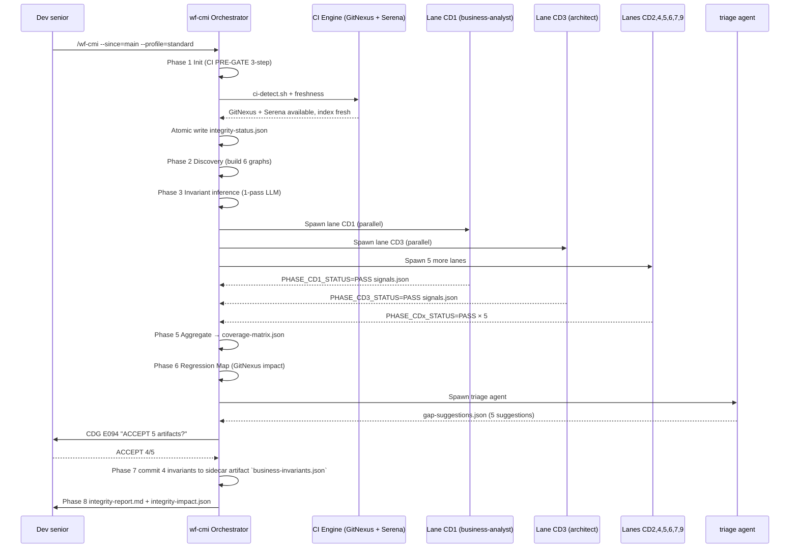
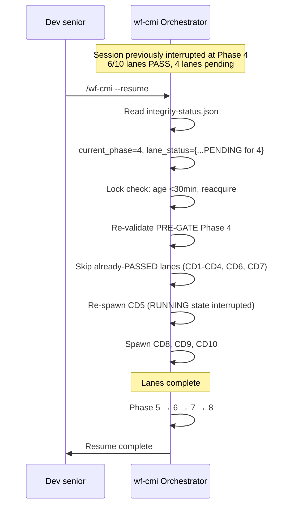
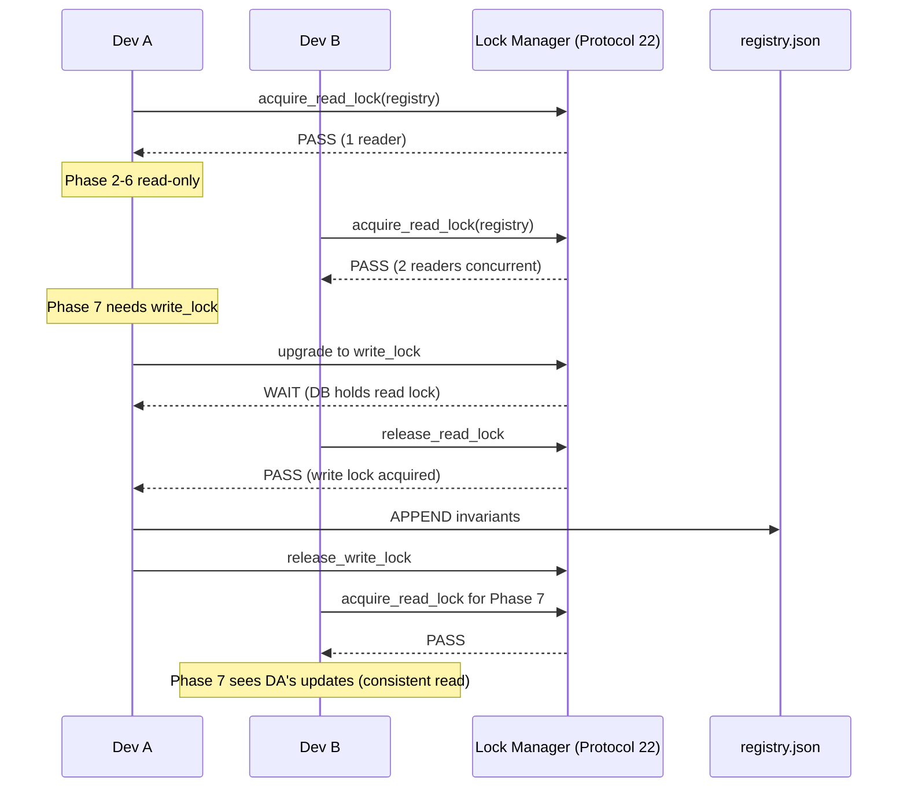

# 08 — User Scenarios & Solutions (wf-cmi — Orchestrator Variant)

> **Mục đích file:** Đặc tả user scenarios + UX flows cho orchestrator skill wf-cmi. Reviewer dùng để verify UX quality, contributor dùng để hiểu trải nghiệm người dùng cuối. **BỔ SUNG** cho [08-tradeoffs-adr.md](08-tradeoffs-adr.md).

---

## 1. Personas

| Persona | Skill level | Pain point chính | Cần skill cung cấp |
|---------|------------|-----------------|---------------------|
| **PO/BA non-coder (EUREKA business owner)** | Beginner | Không hiểu code, lo nghiệp vụ liên module vỡ ngầm | Tiếng Việt báo cáo, severity rõ, business impact |
| **Dev junior (mới onboard EUREKA)** | Intermediate | Chưa nắm 17 modules, lo miss cross-module dependency khi code | Auto-suggest invariant + test case |
| **Dev senior (kiến trúc sư EUREKA)** | Expert | Cần audit toàn hệ thống định kỳ; cần control + speed | Profile flexible, dry-run, resume, predictive regression |
| **DevOps/SRE (release engineer)** | Expert | Cần CI gate trước release; muốn nightly audit | `--ci` mode, JSON output, exit code chuẩn |
| **CISO/Compliance officer** | Domain expert | Cần audit chain xuyên người dùng cho GDPR/Vietnam compliance | audit_chain.checksum + approver chain + immutable history |

---

## 2. Top scenarios

### S1 — Quick check trước commit 1 module (Dev junior)

**Goal:** Sau khi code feature mới trong `Eureka.Modules.Orders`, check cross-module impact trước commit, dưới 10 phút.

**Steps:**
1. User chạy: `/wf-cmi --scope=module=orders --profile=quick`
2. Skill: Phase 1 PASS (60s) → Phase 2 PASS (60s build 5 graphs cho module orders) → Phase 3 SKIP (quick = heuristic only, fast) → Phase 4 PASS (5 lanes CD1,2,3,4,7) → Phase 5 PASS → Phase 7 PASS (basic GAP detection) → Phase 8 Report
3. Output: `integrity-report.md` với 0 CRITICAL, 2 MEDIUM (gợi ý thêm invariant cho Order.QuotationId FK)

**Expected outcome:**
- Total time: 5-10 min
- User thấy ngay top vi phạm + suggested fix
- KHÔNG block commit nếu chỉ MEDIUM/LOW (warn-only)
- Exit code 0
- KHÔNG ghi registry (quick mode chỉ detect, không enforce)

### S2 — Pre-PR review system-wide (Dev senior)

**Goal:** Sau khi merge nhiều feature vào branch `feature/order-redesign`, audit toàn hệ thống trước PR.

**Steps:**
1. `/wf-cmi --since=main --profile=standard`
2. Skill regression-aware mode: chỉ scan files đổi vs main (~30 files)
3. Phase 1 PASS → Phase 2 PASS (chỉ rebuild graphs cho 3 modules đổi: Orders, Finance, CRM) → Phase 3 PASS (1-pass LLM cross-module pattern) → Phase 4 PASS (7 lanes) → Phase 5 coverage 82% (PASS standard threshold 80%) → Phase 6 Regression Map (predict 8 modules ảnh hưởng) → Phase 7 PASS → Phase 8 Report
4. Phase 7 đề xuất 5 artifacts: 3 test case, 1 invariant rule, 1 contract — user CHỌN ACCEPT 4/5

**Expected outcome:**
- Total: 15-25 min
- Auto-fix-able: skill ask user "ACCEPT 4 artifact suggestions? [Y/n]" qua CDG E094
- Fail-fast nếu CRITICAL invariant violation
- Exit code 0 (PASS) / 1 (WARN) / 2 (FAIL)
- `integrity-impact.json` produce → wf-verify-sync consume qua `--from-cmi`

### S3 — Resume sau interrupt (Dev senior)

**Goal:** Đang chạy `--profile=deep` trên EUREKA (~70 min), bị Ctrl+C ở Phase 4 (sau khi 6/10 lanes PASS).

**Steps:**
1. Original: `/wf-cmi --profile=deep` → interrupted at Phase 4 (4 lanes pending: CD8,9,10 + CD5 retry)
2. Resume: `/wf-cmi --resume`
3. Skill đọc `integrity-status.json` → `current_phase=4`, `lane_status={CD1:PASS, CD2:PASS, CD3:PASS, CD4:PASS, CD6:PASS, CD7:PASS, CD5:RUNNING, CD8:PENDING, CD9:PENDING, CD10:PENDING}`
4. Lock check: age <30 min → reacquire ngay
5. Re-validate PRE-GATE Phase 4 → continue: chỉ spawn 4 lanes còn lại
6. Phase 5-8 chạy bình thường

**Expected outcome:**
- KHÔNG redo Phase 1-3 (đã PASS)
- KHÔNG redo 6 lanes CD1-CD4, CD6, CD7 (đã có signals.json)
- Lane CD5 chạy lại từ đầu (vì interrupted RUNNING state)
- 3 lanes CD8,9,10 spawn fresh
- Lock auto-release nếu original session age >30 min (cross-machine resume — Dev B pull branch Dev A)

### S4 — Concurrent 2 sessions (Multi-session same machine)

**Goal:** Dev A đang chạy `--scope=system deep` (1h), Dev B trên cùng máy chạy `--scope=module=crm quick` (10 min) song song.

**Steps:**
1. Dev A: `/wf-cmi --scope=system --profile=deep` (acquired lock cho global registry write trong Phase 7; nhưng Phase 2-4 chỉ read)
2. Dev B (10 min sau): `/wf-cmi --scope=module=crm --profile=quick`
3. Protocol 22 R/W lock:
   - Dev A đang Phase 4 (read-only) → Dev B's Phase 2-4 (read-only) chạy song song OK
   - Khi cả 2 cùng tới Phase 7 (CDG có thể write registry) → first-come-first-served write lock; second waits với CDG E090b (parallel session conflict)
4. Dev B: Phase 7 nhận E090b CDG: "Phiên Dev A đang Phase 7. Wait 5 min / Cancel / Force?"
5. Dev B chọn Wait → skill block, retry mỗi 30s đến khi Dev A release lock
6. Dev B Phase 7 PASS → Phase 8 → Done

**Expected outcome:**
- 2 sessions song song không corrupt registry
- Read-heavy phases (1-6) không block
- Write-heavy phase (7) serialize qua CDG
- Heartbeat check 30s: nếu Dev A's session stale >30 min → auto-release (E008)

### S5 — CI nightly audit (DevOps/SRE)

**Goal:** GitHub Action chạy `exhaustive` mỗi đêm trên main branch, mở issue nếu coverage giảm.

**Steps:**
1. Cron 2AM: `/wf-cmi --ci --profile=exhaustive --since=v1.2.0`
2. Skill: `--ci` mode → auto-downgrade `exhaustive` → `standard` qua E108 (CI runner timeout 30 min)
3. Hoặc nếu CI runner đủ time → run exhaustive (~3h)
4. Output: `integrity-report.md` + `integrity-impact.json` (machine-readable JSON)
5. Action parse JSON → format Slack message + create GitHub issue nếu `overall_status=FAIL`
6. KHÔNG update registry (CI mode read-only)
7. KHÔNG invoke CDG (auto-decision: fail nếu coverage <threshold)

**Expected outcome:**
- Idempotent (chạy lại cùng commit = cùng kết quả nếu cache không đổi)
- JSON output có schema versioned `integrity-impact-v1`
- Exit code 0 (PASS) / 1 (WARN coverage <threshold but not critical) / 2 (FAIL critical violation)
- Audit chain ghi `author.email = github-actions-bot@erktransport.com`

### S6 — Multi-user collaboration qua Git (Dev A + Dev B + PR review)

**Goal:** Dev A propose 10 new invariants cho module CRM trong branch `feature/crm-invariants`; Dev B review PR.

**Steps:**
1. Dev A: `/wf-cmi --scope=module=crm --profile=deep --auto-suggest`
2. Dev A nhận CDG E094: "Sẽ APPEND 10 invariants vào sidecar artifact `business-invariants.json`. Confirm?"
3. Dev A ACCEPT 7/10, REJECT 3 (lý do: duplicate hoặc context không đúng)
4. Skill update sidecar artifact `business-invariants.json` → `requirements[REQ-CRM-001].invariants[]` APPEND 7 entries với `inferred_by.session_id=Dev-A-session`, `approver=dev.a@erktransport.com`
5. Dev A commit + push: `git add .mc-data/work/wf-cmi/sessions/*/integrity-report.md` + `.mc-data/docs/_meta/req-registry.json`
6. Dev A mở PR: `integrity-report.md` render trong PR description (bot post comment qua `--ci` mode trong GitHub Action)
7. Dev B review PR: thấy `integrity-impact.json` đầy đủ violations + suggestions; xem audit chain
8. Dev B chạy local `/wf-cmi --scope=module=crm --profile=quick --from-fix-bugs` để verify (consume Dev A's artifact)
9. Dev B approve PR → merge

**Expected outcome:**
- Audit chain xuyên người dùng: registry có `inferred_by` (Dev A) + `approver` (Dev A) + later `verified_by_approver_chain` (Dev B via PR)
- Conflict resolution: nếu Dev B chạy local cùng module → CDG E095 (dual-approval required)
- Artifacts commit-friendly (text deterministic, gắn `{author_slug}` ngoài SESSION_ID — vd `integrity-report-dev-a-2026-05-15.md`)

---

## 3. Flow diagrams

### Sequence: Standard happy path (S2 — Pre-PR review)

### Sequence: Resume after interrupt (S3)

### Sequence: Concurrent 2 sessions (S4)

---

## 4. Error recovery scenarios

| Scenario | Detection | Recovery flow |
|----------|-----------|---------------|
| Lock stale (>30 min) | Lock heartbeat check trong Phase 1 hoặc Resume | Auto-release E008 → reacquire current PID |
| Disk full mid-write `integrity-impact.json` | Atomic write fail | Retry x3 → ESCALATE E083 |
| Lane agent timeout (>3 min) | Orchestrator timer Phase 4 | Mark lane TIMEOUT E041 → per-lane retry x1 → if exhausted: continue other lanes, lane status=TIMEOUT |
| Context budget >90% | Budget check after each phase | FORCE STOP E009 → checkpoint → user `--resume` |
| Registry corruption (v3 migration fail) | jq parse fail at Phase 7 PRE-GATE | ESCALATE E039 — ask user manual migration |
| Cross-skill artifact missing (consumer fail) | Consumer PRE-GATE T1 fail | wf-verify-sync emits WARN, continue without `--from-cmi` benefits |
| LLM API timeout (Phase 3) | Phase 3 timer | Retry x1, downgrade single-pass nếu retry fail E034 |
| GitNexus index stale severe (>50 commits behind) | CI freshness check Phase 1 | Fallback Grep, WARN E016, continue |
| 2 dev cùng push sidecar artifact `business-invariants.json` conflict | Git merge conflict | CORE-006 Safe-Write protocol đã giảm vùng conflict; nếu vẫn conflict → CDG E095 dual-approval |
| CDG E090 coverage <threshold, user cancel | User choose Cancel | Skill checkpoint, exit code 2 — KHÔNG commit registry |

---

## 5. UX heuristics

### Output format quy tắc (CORE-028)

| Element | Quy tắc |
|---------|--------|
| Phase report (8 reports) | Tiếng Việt, ≤15 dòng, cho người không chuyên |
| `integrity-report.md` (final) | Tiếng Việt, ≤30 dòng, có markdown links đến chi tiết |
| Progress inline | `[Phase X/8] {phase_name} — {action}` mỗi 30s nếu phase >2 min |
| Severity màu | CRITICAL=đỏ, HIGH=vàng đậm, MEDIUM=vàng, LOW=xanh dương, INFO=xám |
| Exit code | 0=PASS, 1=WARN (coverage <threshold but no critical), 2=FAIL (critical violation), >2=infrastructure error |
| File paths | Relative từ project root, có markdown link |
| Confidence score | Hiển thị as % với 2 decimal (vd 92.50%) |
| Module list | Lowercase-kebab-case (CORE-016/017) |

### CDG presentation rules

- Tiếng Việt, có context cụ thể (vd `Coverage CD3 = 75% < threshold deep 95%`)
- Mọi CDG option có **default action** rõ (vd: `default ABORT`)
- Approver chain ghi rõ ai approve khi nào (multi-user)
- Reason field bắt buộc cho REJECT (audit trail)

### Anti-patterns (KHÔNG làm)

❌ **Silent long-running** — phase >2 min không có progress update
❌ **Stack trace cho user** — convert sang tiếng Việt friendly message (vd "Lane CD3 vượt thời gian" thay vì "ProbeTimeoutException at Lane.cs:L42")
❌ **Block lockup** — không ESCALATE khi auto-fix exhausted; phải có AskUserQuestion
❌ **Vague error** — "Something went wrong" → cụ thể "Phase 4 Lane CD3: agent timeout sau 3 min trên module Orders (50 workflow paths quá phức tạp)"
❌ **Force overwrite** — sidecar artifact (no registry bump) existing fields → CDG E099 destructive op confirmation bắt buộc
❌ **Hardcode English** trong user-facing output — vi phạm CORE-005

---

## 6. UX trade-offs đã chốt

| Trade-off | Quyết định | Lý do |
|----------|-----------|-------|
| Performance vs. Comprehensiveness | Profile-driven (quick → exhaustive) | User tự chọn balance |
| Auto-apply vs. Manual approval | v1 manual approval (CDG); v2 add `--auto-apply` | An toàn, build trust (ADR-cmi-006) |
| Detail vs. Summary | Report tiếng Việt ≤30 dòng (summary) + JSON detail (full) | Dual audience: PO + DevOps |
| Block vs. Warn | Critical = block (exit 2); Threshold = CDG (user choose); Warning = continue | Match severity levels |
| Single vs. Multiple artifacts | Bundle `integrity-impact.json` (ADR-cmi-007) | Consumer simplicity |

---

## 7. Liên kết

- ADR cho UX decisions: [`08-tradeoffs-adr.md`](08-tradeoffs-adr.md) (ADR-cmi-006, ADR-cmi-007)
- Phase reporting standard: [`../../02-standards/02-skill-standard.md`](../../02-standards/02-skill-standard.md) §6
- CDG protocol: [`.claude/skills/protocols/16-critical-decision-gate.md`](../../../.claude/skills/protocols/16-critical-decision-gate.md)
- Protocol 22 R/W lock: [`.claude/skills/protocols/22-r-w-lock.md`](../../../.claude/skills/protocols/22-r-w-lock.md)
- Real example: [`../wf-fix-bugs/08-user-scenarios-solutions.md`](../wf-fix-bugs/08-user-scenarios-solutions.md), [`../wf-implement-feature/08-user-scenarios-solutions.md`](../wf-implement-feature/08-user-scenarios-solutions.md)
