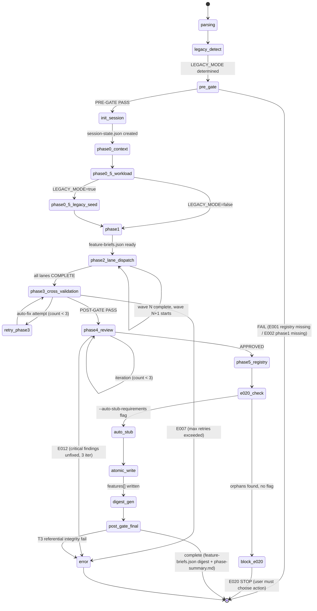

# 03 — Kiến Trúc Skill

> **Mục đích file:** Tả KIẾN TRÚC TỔNG QUAN của skill `wf-define-features` — components nào cấu thành, dữ liệu chảy ra sao, agent nào được spawn, integration points với MCV3 engines. Đọc tiếp [03-phase-routing.md](03-phase-routing.md) để hiểu TRÌNH TỰ phase.
> **Khác với [03-phase-routing.md](03-phase-routing.md):** File này tả "bộ máy" (static structure) — các block lego cấu thành skill và cách chúng liên kết. File 03-phase-routing tả "luồng" (dynamic execution order) — phase nào chạy theo thứ tự nào, conditional skip.

---

## 1. Bản Đồ Tổng Thể

```
                        ┌────────────────────────────────────────────────┐
  /wf-define-features ─▶│              ENTRY / ROUTER                    │
  [scope] [flags]        │     (SKILL.md ~430 dòng — lazy-load hub)      │
                         │  - Parse args → scope, flags                  │
                         │  - LEGACY_MODE detect (CORE-021)              │
                         │  - PRE-GATE: req-registry exists + phase1 ok  │
                         │  - Route đến procedure phase0-context.md      │
                         └──────────────────┬─────────────────────────────┘
                                            │
              ┌─────────────────────────────┼───────────────────────────┐
              │                             │                           │
              ▼                             ▼                           ▼
   ┌──────────────────────┐    ┌──────────────────────────┐  ┌─────────────────────┐
   │  WORKLOAD GATE       │    │  SCOPE MAPPING &         │  │  LANE DISPATCHER    │
   │  (phase0.5)          │    │  FEATURE BRIEF BUILDER   │  │  (phase2)           │
   │                      │    │  (phase1)                │  │                     │
   │  - Estimate workload │    │  - Scope + FEAT-ID assign│  │  - 1 lane/module    │
   │  - CDG override if   │    │  - Working feature-briefs│  │  - Spawn BA agent   │
   │    too large         │    │  - define-features-plan  │  │  - Max 3 concurrent │
   └──────────────────────┘    └──────────────────────────┘  └──────────┬──────────┘
                                                                         │ specs-signals.json
                                                                         ▼
                                                             ┌─────────────────────┐
                                                             │  FEATURE SPEC       │
                                                             │  AGGREGATOR         │
                                                             │  (phase3)           │
                                                             │                     │
                                                             │  - 7 checks + W4.7  │
                                                             │  - CF6 detection    │
                                                             │  - Auto-fix ≤3 iter │
                                                             └──────────┬──────────┘
                                                                        │
                                        ┌───────────────────────────────┤
                                        │                               │
                                        ▼                               ▼
                           ┌───────────────────────┐       ┌───────────────────────┐
                           │  STAKEHOLDER REVIEW   │       │  REGISTRY UPDATER     │
                           │  (phase4)             │       │  (phase5)             │
                           │                       │       │                       │
                           │  - product-expert PO  │       │  - Referential Int.   │
                           │  - product-expert USER│       │  - Append features[]  │
                           │  - BA consolidation   │──────▶│  - Digest generation  │
                           └───────────────────────┘       └───────────────────────┘
                                                                        │
                                                                        ▼
                                                         POST-GATE + Digest Artifacts
                                                   (feature-briefs.json digest, phase-summary.md)
```

---

## 2. Thành Phần (Components)

### 2.1 SKILL.md — Lean Routing Hub

**Vai trò:** Entry point, ~430 dòng (CORE-032). KHÔNG chứa execution logic. Chỉ:

1. Parse arguments (`scope`, `--status`, `--resume`, `--from-scan`, `--auto-stub-requirements`).
2. Detect `$LEGACY_MODE` theo CORE-021 (check `project-context.md > 500 bytes`).
3. PRE-GATE: verify `req-registry.json` tồn tại + có `requirements[]` + `phase1-business/` có docs.
4. Khởi tạo `$SESSION_DIR` + `session-state.json` (atomic write — CORE-035).
5. Route đến `procedures/phase0-context.md`.
6. Phase transition theo mode: NEW (7 phases) hoặc LEGACY (10-11 phases).

**Không làm:**
- KHÔNG nhúng bash script inline (delegate sang `scripts/` hoặc `_shared/`).
- KHÔNG ghi `req-registry.json` trực tiếp (chỉ phase5-registry-update làm điều này).
- KHÔNG load toàn bộ procedures/ cùng lúc — lazy-load per phase (tiết kiệm ~85-90% token).

**File:** `.claude/skills/workflow/wf-define-features/SKILL.md`

### 2.2 Procedures — Phase Implementation (Lazy-Load)

Mỗi `procedures/phase{N}-{name}.md` chứa đầy đủ logic của 1 phase:

| Section | Mục đích |
|---------|----------|
| **PRE-GATE** | Verify output phase trước (T1 exists → T2 structure → T3 content) |
| **Steps** | Các bước thực thi — đọc input, process, ghi output |
| **POST-GATE** | T1→T4 validate output của phase này |
| **Phase{N}-report.md** | Báo cáo tiếng Việt ≤15 dòng (CORE-028) |

**Lazy-load:** Phase file chỉ được Read khi tới phase đó — KHÔNG load tất cả từ đầu.

**Shared:** `procedures/_shared.md` chứa: state variables (`$LEGACY_MODE`, `$HAS_SCREENS`, `$SCOPE`, `$AUTO_STUB_REQUIREMENTS`, `$FROM_SCAN_SESSION_ID`, `$SESSION_DIR`, `$CI_CONTEXT`), phase ordering per mode, agent context templates, fix rules, error code reference, registry safe-write protocol.

### 2.3 Workload Gate (Phase 0.5)

| Trường | Giá trị |
|--------|---------|
| **Vai trò** | Ước lượng khối lượng công việc trước khi chạy (ADR-OPT-03) — cảnh báo nếu scope quá lớn |
| **Input** | `req-registry.json` (số lượng requirements) + `$SCOPE` arg |
| **Output** | `$SESSION_DIR/workload-report.md`, `$SESSION_DIR/session-state.json` (trường workload) |
| **Stateful?** | Không — chạy 1 lần tại đầu session |
| **Spawn agent?** | Không |
| **Idempotent?** | Có — ước lượng lại từ registry hiện tại |

**CDG trigger:** Nếu workload > ngưỡng (vd: >50 features) → AskUserQuestion gợi ý scope hẹp hơn (CORE-027).

### 2.4 Legacy Impl Seed (Phase 0.5 — LEGACY only)

| Trường | Giá trị |
|--------|---------|
| **Vai trò** | Đọc extracted data từ wf-legacy-extract, seed `impl_status` cho features đã có code |
| **Input** | `.mc-data/work/wf-legacy-extract/extracted/{module}.json` + `legacy-decisions.json` |
| **Output** | `$SESSION_DIR/impl-status-seed.json` (map FEAT-ID → impl_status pre-populated) |
| **Stateful?** | Có — kết quả được đọc lại bởi BA agent ở Phase 2 |
| **Spawn agent?** | Không |
| **Idempotent?** | Có |

**Skip nếu:** `$LEGACY_MODE == false`.

### 2.5 Scope Mapping & Feature Brief Builder (Phase 1)

| Trường | Giá trị |
|--------|---------|
| **Vai trò** | Phân tích requirements → xác định modules cần tạo feature → sinh FEAT-IDs + working feature-briefs.json |
| **Input** | `req-registry.json` (requirements[]) + `phase1-business/` + `--from-scan` (nếu có) |
| **Output** | `define-features-plan.md`, working `feature-briefs.json`, `session-state.json` (phases.P1=completed) |
| **Stateful?** | Có — `feature-briefs.json` được dùng làm input cho Lane Dispatcher |
| **Spawn agent?** | Không — chạy inline |
| **Idempotent?** | Có (nếu `--resume`) |

**`--from-scan` integration:** Đọc `feature-inventory.md` từ wf-scan-target session → suggest thêm features chưa có trong registry. User accept/reject từng suggestion.

### 2.6 Lane Dispatcher — BA Feature Spec Writer (Phase 2)

| Trường | Giá trị |
|--------|---------|
| **Vai trò** | Spawn BA agent song song per module — mỗi agent tạo feature spec cho 1 FEAT-ID |
| **Input** | `feature-briefs.json` (working schema) + `req-registry.json` + `phase1-business/*.md` |
| **Output** | `$SESSION_DIR/lanes/{module-slug}/specs-signals.json` + `$SESSION_DIR/features/{sys}/{mod}/{FEAT_ID}.md` |
| **Stateful?** | Có — lane state per module, checkpointable |
| **Spawn agent?** | **Có — `business-analyst`** (max 10 concurrent — CORE-025; batch theo wave nếu >10) |
| **Idempotent?** | Có — skip FEAT-ID nếu spec đã tồn tại (resume-safe) |

**Parallelism:** 1 BA agent = 1 FEAT-ID. Nhiều agents chạy song song trong cùng module-wave. Write scope tách biệt: mỗi agent ghi riêng vào `$SESSION_DIR/features/{sys}/{mod}/{FEAT_ID}.md`.

**Stub Detection (v1.8+):** BA agent detect frontmatter `status: stub` từ files sinh bởi `/wf-fix-bugs --deep` → flesh-out content thay vì tạo mới.

### 2.7 Feature Spec Aggregator — Cross-Validation (Phase 3)

| Trường | Giá trị |
|--------|---------|
| **Vai trò** | Tổng hợp tất cả specs từ lanes, chạy 7 validation checks, phát hiện cross-module + cross-FEAT issues |
| **Input** | `$SESSION_DIR/lanes/{module-slug}/specs-signals.json` (từ tất cả lanes) + `req-registry.json` |
| **Output** | `cross-validation-report.md`, `deferred-findings.md` (W4.7 non-blocking), updated `session-state.json` |
| **Stateful?** | Có — auto-fix loop counter (max 3), W4.7 findings |
| **Spawn agent?** | Không — chạy inline |
| **Idempotent?** | Có (với --resume) |

**7 checks:** FEAT-REQ mapping coverage, file existence, schema valid, duplicate FEAT-ID, acceptance criteria present, dependency declare, naming convention.

**W4.7 Cross-Module Entity Detection (v3.2):** Scan feature specs tìm `MOD-[A-Z0-9-]+` refs từ module khác → AskUserQuestion (Có/Không/Deferred). KHÔNG block POST-GATE — suggest only.

**CF6 Cross-FEAT Ref Detection (v3.3):** Scan feature specs tìm `FEAT-XXX` hoặc `REQ-XXX` mention → auto-suggest `cross_feat_refs[]` entries. User accept/reject từng suggestion.

### 2.8 Product Expert Prioritizer — Stakeholder Review (Phase 4)

| Trường | Giá trị |
|--------|---------|
| **Vai trò** | Stakeholder review từ 2 góc nhìn: PO (business value) + USER (user experience) → BA consolidation |
| **Input** | `phase2-features/{sys}/{mod}/*.md` (tất cả feature specs đã generate) |
| **Output** | `$SESSION_DIR/stakeholder-review/PO-feedback.md`, `USER-feedback.md`, `D-ba-consolidation.md`, `stakeholder-review.md` |
| **Stateful?** | Có — kết quả review ảnh hưởng tới Phase 5 safe-write |
| **Spawn agent?** | **Có — `product-expert` (PO) + `product-expert` (USER) + `business-analyst` (BA consolidation)** — sequential |
| **Idempotent?** | Có (nếu `--resume` sau khi checkpoint) |

**Concurrency:** 3 agent spawn sequential (PO → USER → BA) vì có dependency theo thứ tự.

**CDG:** Nếu critical findings chưa fix sau 3 iterations → E012 → STOP.

### 2.9 Registry Updater — Referential Integrity + Safe-Write (Phase 5)

| Trường | Giá trị |
|--------|---------|
| **Vai trò** | Kiểm tra referential integrity → safe-write `features[]` vào registry → generate digest artifact |
| **Input** | Feature specs từ `phase2-features/` + `req-registry.json` + accepted CF6 suggestions |
| **Output** | `req-registry.json` (features[] appended) + `_meta/feature-briefs.json` (digest schema) + `referential-integrity-violations.json` (debug, nếu có) |
| **Stateful?** | Có — atomic write với backup |
| **Spawn agent?** | Không |
| **Idempotent?** | Không hoàn toàn — append-only; chạy lại có thể tạo duplicate nếu không check |

**Referential Integrity Check (v3.1 — step 5.3c):** Compute orphan REQ-IDs = `features[].req_ids[]` − `requirements[].req_id`. Nếu có orphan → BLOCK E020 hoặc `--auto-stub-requirements` APPEND stubs.

**POST-GATE T3:** `jq -e '[.features[] | .req_ids[]] - [.requirements[].req_id] | length == 0'` — BẮT BUỘC pass trước khi END.

### 2.10 Cross-Cutting Services

| Service | Mục đích | File |
|---------|----------|------|
| Session Lock + Heartbeat | Session isolation (CORE-030) | `.mc-data/work/wf-define-features/sessions/{id}/.lock` |
| Atomic Write | Build tmp → validate JSON → mv (CORE-035) | Pattern inline trong `_shared.md` |
| CI Detect | Auto-detect GitNexus/Serena (CORE-033) | `.claude/scripts/ci-detect.sh` |
| CDG Gate | Critical Decision Gate (CORE-027) — Workload, W4.7, Referential Integrity | Spawned tại phase0.5, phase3, phase5 |
| Error Ledger | APPEND-only JSONL (CORE-034) | `$SESSION_DIR/error-ledger.json` |
| LEGACY Context Injection | Inject `project-context.md` + `legacy-decisions.json` vào BA/expert prompts | `_shared.md §LEGACY Context Injection` |

---

## 3. Sequence Diagram — Happy Path (NEW mode, standard scope)

```
User ──/wf-define-features all ──▶ SKILL.md (Router)
                                     │
                                     │ 1. Parse args → scope=all, LEGACY_MODE=false
                                     │ 2. PRE-GATE: req-registry ok, phase1-business ok
                                     │ 3. Init $SESSION_DIR + session-state.json
                                     │
                                     ├──▶ procedures/phase0-context.md
                                     │      ├─ LEGACY detect → PROJECT_TYPE=NEW
                                     │      ├─ Session init
                                     │      └─ POST-GATE → session-state P0=completed
                                     │
                                     ├──▶ procedures/phase0.5-workload-gate.md
                                     │      ├─ Estimate: Nreqs × complexity
                                     │      ├─ workload-report.md
                                     │      └─ POST-GATE → P0_5_workload=completed
                                     │
                                     ├──▶ procedures/phase1-scope-mapping.md
                                     │      ├─ Assign FEAT-IDs per REQ
                                     │      ├─ feature-briefs.json (working schema)
                                     │      ├─ define-features-plan.md
                                     │      └─ POST-GATE → P1=completed
                                     │
                                     ├──▶ procedures/phase2-create-specs.md (Lane Dispatch)
                                     │      ├─ Spawn BA per FEAT-ID (parallel, max 10)
                                     │      │    ├─ BA: read REQs + phase1-business
                                     │      │    ├─ BA: write {FEAT_ID}.md + brief.json
                                     │      │    └─ BA: write Phase2-{FEAT_ID}-report.md
                                     │      ├─ Wait all FEAT_IDs complete
                                     │      └─ POST-GATE → P2=completed (lanes_completed=[...])
                                     │
                                     ├──▶ procedures/phase3-cross-validation.md
                                     │      ├─ 7 standard checks
                                     │      ├─ Auto-fix loop (max 3 iter)
                                     │      ├─ W4.7 non-blocking → deferred-findings.md
                                     │      ├─ CF6 non-blocking → cross_feat_refs[] suggestions
                                     │      └─ POST-GATE → P3=completed
                                     │
                                     ├──▶ procedures/phase4-stakeholder-review.md
                                     │      ├─ Spawn product-expert (PO)
                                     │      ├─ Spawn product-expert (USER)
                                     │      ├─ Spawn business-analyst (consolidation)
                                     │      ├─ stakeholder-review.md (Phần A/B/C/D)
                                     │      └─ POST-GATE → P4=completed
                                     │
                                     ├──▶ procedures/phase5-registry-update.md
                                     │      ├─ Step 5.3c: Referential Integrity Check
                                     │      ├─ Atomic safe-write features[] → req-registry.json
                                     │      ├─ POST-GATE T3: jq referential integrity check
                                     │      ├─ Phase 6 Digest: feature-briefs.json (digest schema)
                                     │      └─ POST-GATE final → P5=completed
                                     │
                                     ▼
                             phase-summary.md + define-features-report.md
                             (_meta/feature-briefs.json digest cho downstream)
```

---

## 4. Parallelism Model

### 4.1 Ai Song Song Với Ai?

| Phân lớp | Song song? | Điều kiện |
|----------|-----------|-----------|
| Phase × Phase | **Không** | Phase sau cần output phase trước (CORE-002) |
| FEAT-ID × FEAT-ID trong Phase 2 | **Có** | Mỗi BA agent ghi riêng vào `$SESSION_DIR/features/{sys}/{mod}/{FEAT_ID}.md` |
| Module lane × Module lane | **Có** | `$SESSION_DIR/lanes/{module-slug}/` isolated per module |
| Phase 4 agents (PO × USER × BA) | **Không** | Sequential: PO → USER → BA (dependency theo thứ tự) |
| Workload Gate × Scope Mapping | **Không** | Phase 0.5 phải complete trước Phase 1 |

### 4.2 Giới Hạn Parallelism

- **Phase 2:** Max **10 BA agents** concurrent (CORE-025). Vượt → batch theo wave.
- **Phase 2 token bucket:** Module `_shared/lane/dispatcher.py` enforce max 3 concurrent lanes theo token bucket (tương tự wf-fix-bugs).
- **Phase 4:** Bắt buộc sequential — user review PO findings trước khi USER review chạy có context đầy đủ.

### 4.3 Vì Sao Không Parallel Hết?

- Phase 3 cross-validation cần tổng hợp output từ tất cả lanes Phase 2 — phải đợi.
- Phase 4 stakeholder review: PO và USER reviews cần đọc cùng 1 feature spec set — nếu song song dễ conflict.
- Phase 5 registry write: 1 atomic write duy nhất — không thể parallel.

> Pattern tham khảo: [`../../03-design-patterns/04-parallel-lane-dispatch.md`](../../03-design-patterns/04-parallel-lane-dispatch.md).

---

## 5. Data Flow Chi Tiết

### 5.1 Phase → State Store

```
Phase 0 (Context + Session Init)
  ▼
$SESSION_DIR/session-state.json      ← {phases: {P0: "completed"}, project_type: "NEW"}
  ▼
Phase 0.5 (Workload Gate)
  ▼
$SESSION_DIR/workload-report.md
$SESSION_DIR/session-state.json      ← phases.P0_5_workload = "completed"
  ▼
Phase 1 (Scope Mapping)
  ▼
.mc-data/work/wf-define-features/feature-briefs.json   ← working schema (feature-briefs-working-v1)
.mc-data/work/wf-define-features/define-features-plan.md
$SESSION_DIR/session-state.json      ← phases.P1 = "completed"
  ▼
Phase 2 (Lane Dispatch — BA agents per FEAT-ID)
  ▼
$SESSION_DIR/lanes/{module-slug}/specs-signals.json    ← per lane
$SESSION_DIR/features/{sys}/{mod}/{FEAT_ID}.md         ← feature specs
$SESSION_DIR/features/{sys}/{mod}/{FEAT_ID}-brief.json ← brief per feat
.mc-data/docs/phase2-features/{sys}/{mod}/{FEAT_ID}.md ← canonical docs (after validation)
$SESSION_DIR/session-state.json      ← phases.P2 = {status: "completed", lanes_completed: [...]}
  ▼
Phase 3 (Cross-Validation)
  ▼
.mc-data/work/wf-define-features/cross-validation-report.md
.mc-data/work/wf-define-features/deferred-findings.md ← W4.7 + CF6 suggestions
$SESSION_DIR/session-state.json      ← phases.P3 = {status: "completed", w4_7_findings: N, cf6_suggestions: M}
  ▼
Phase 4 (Stakeholder Review)
  ▼
$SESSION_DIR/stakeholder-review/PO-feedback.md
$SESSION_DIR/stakeholder-review/USER-feedback.md
$SESSION_DIR/stakeholder-review/D-ba-consolidation.md
.mc-data/docs/phase2-features/stakeholder-review.md    ← canonical final review
  ▼
Phase 5 (Registry Update)
  ▼
.mc-data/docs/_meta/req-registry.json              ← features[] appended (append-only)
.mc-data/docs/_meta/feature-briefs.json            ← DIGEST schema (feature-briefs-digest-v1)
$SESSION_DIR/referential-integrity-violations.json  ← debug (chỉ khi có orphan REQ-IDs)
```

### 5.2 Cross-Skill Artifact Flow

Skill này consume từ upstream và produce cho downstream theo `_contract.json` (CORE-036):

```
CONSUME (từ upstream skills):
  wf-analyze-requirements:
    .mc-data/docs/phase1-business/           ← business docs (BR, NFR, workflows)
    .mc-data/docs/_meta/req-registry.json    ← requirements[] là input chính
    .mc-data/docs/_meta/dept-digests.json    ← department summary
    .mc-data/docs/_meta/phase1-handoff.json  ← handoff context

  wf-brainstorm (LEGACY):
    .mc-data/docs/_meta/legacy-decisions.json ← DEPRECATED module list

  wf-legacy-extract (LEGACY):
    .mc-data/work/wf-legacy-extract/extracted/{module}.json
    .mc-data/work/wf-legacy-extract/ui-manifest.json

  wf-scan-target (--from-scan):
    .mc-data/work/wf-scan-target/feature-inventory.md
    .mc-data/work/wf-scan-target/target-map.json

PRODUCE (cho downstream skills):
  wf-design:
    .mc-data/docs/phase2-features/{sys}/{mod}/*.md  ← feature specs
    .mc-data/docs/_meta/feature-briefs.json          ← digest schema (feature-briefs-digest-v1)
    .mc-data/docs/_meta/req-registry.json            ← features[] updated
    .mc-data/work/wf-define-features/deferred-findings.md ← W4.7 findings

  wf-implement-feature:
    .mc-data/docs/_meta/req-registry.json            ← features[] + cross_feat_refs[] (CF6)
    .mc-data/docs/_meta/feature-briefs.json          ← digest schema

  wf-verify-sync:
    features[].cross_feat_refs[] (CF6 v3.3)         ← registry field
```

Artifact schema versioned:
- Working: `"$schema": "feature-briefs-working-v1"` (Phase 1 output)
- Digest: `"$schema": "feature-briefs-digest-v1"` (Phase 5 → Phase 6 output)

### 5.3 Checkpoint & Resume

| Layer | Checkpoint File | Khi nào ghi |
|-------|-----------------|-------------|
| Orchestrator | `session-state.json` | Sau mỗi POST-GATE PASS |
| Phase 2 lanes | `$SESSION_DIR/lanes/{module-slug}/checkpoint.json` | Sau mỗi FEAT-ID complete |
| Phase 4 review | `$SESSION_DIR/stakeholder-review/checkpoint.json` | Sau mỗi perspective complete |
| Toàn bộ session | `.mc-data/work/wf-define-features/checkpoint.json` | Cuối session hoặc trước STOP |

**Resume routing:** `session-state.json.phases` xác định phase đã hoàn thành → route vào next_action. Xem `procedures/phase0-context.md §Resume Flow`.

---

## 6. File Layouts

Section này tả 2 view đối xứng: **SOURCE** (skill code trên disk, ổn định) và **OUTPUT** (artifacts skill tạo ra trong session, dynamic per run).

### 6.1 Source Layout — Skill code trên disk

```
.claude/skills/workflow/wf-define-features/
├── SKILL.md                                   # Lean routing hub (~430 dòng — CORE-032)
├── _contract.json                             # Cross-skill contract v3.0 (CORE-036)
│
├── procedures/                                # Lazy-load procedure files (11 files)
│   ├── _shared.md                             # Cross-cutting: state vars, agent templates, fix rules
│   ├── phase0-context.md                      # Entry: LEGACY detect, session init, --resume/--status
│   ├── phase0.5-workload-gate.md              # Workload estimation + CDG (ADR-OPT-03)
│   ├── phase0.5-legacy-impl-seed.md           # LEGACY only: seed impl_status từ extracted data
│   ├── phase1-scope-mapping.md                # Scope mapping + FEAT-ID assign + feature-briefs
│   ├── phase2-create-specs.md                 # Lane Dispatch: BA per FEAT-ID (parallel)
│   ├── phase2.5-feat-mapping.md               # LEGACY only: feat-mapping.json
│   ├── phase2.7-ui-coverage.md                # LEGACY + UI: UI coverage cross-check
│   ├── phase3-cross-validation.md             # 7 checks + W4.7 + CF6 non-blocking
│   ├── phase4-stakeholder-review.md           # Stakeholder review PO + USER + BA consolidation
│   └── phase5-registry-update.md             # Referential Integrity v3.1 + Safe-Write + Digest
│
├── templates/                                 # Output templates (CORE-031)
│   ├── define-features-status.json            # Session status template
│   ├── define-features-plan.md                # Feature plan template
│   ├── feature-briefs.json                    # Working schema template (≠ digest schema)
│   ├── checkpoint.json                        # Checkpoint template
│   └── ui-coverage-gaps.json                  # LEGACY UI coverage gaps template
│
└── evals/                                     # Test cases (CORE-037 eval)
    └── evals.json                             # ≥3 eval scenarios
```

**Agent definitions** (referenced từ Phase 2 + Phase 4 spawns):
- `.claude/agents/business/business-analyst.md` — BA Phase 2 (spec gen) + Phase 4D (consolidation)
- `.claude/agents/business/product-expert.md` — Phase 4 PO + USER review

**Shared Python utilities** (Phase 2 lane dispatch):
- `.claude/skills/workflow/_shared/lane/` — Lane dispatcher module (token bucket, concurrency)

### 6.2 Session Output Layout — Artifacts skill tạo ra

Khi skill chạy xong, session directory chứa các artifacts sau (tree top-level — chi tiết schema xem [04-file-contract.md](04-file-contract.md)):

```
.mc-data/work/wf-define-features/
├── _index/
│   └── sessions.jsonl                          # APPEND-only — index mọi session đã chạy
├── feature-briefs.json                         # Working schema (Phase 1 output, dùng lại cross-session)
├── define-features-plan.md                     # Feature plan (Phase 1 output)
├── cross-validation-report.md                  # Cross-validation kết quả (Phase 3 output)
├── deferred-findings.md                        # W4.7 + CF6 non-blocking findings (Phase 3)
└── sessions/
    └── {YYYY-MM-DD-{scope}-{slug}-{NN}}/       # 1 session = 1 directory cô lập (CORE-030)
        ├── .lock                                # Session lock + heartbeat daemon
        ├── session-state.json                   # SSOT pipeline state (atomic write — CORE-035)
        ├── session-log.json                     # Execution trace (APPEND-only — CORE-026)
        ├── error-ledger.json                    # Error tracking (APPEND-only — CORE-034)
        ├── workload-report.md                   # Workload estimate (Phase 0.5)
        │
        ├── phase0-context/                      # Phase 0 — Session init + LEGACY detect
        │   └── Phase0-report.md
        ├── phase0.5-workload-gate/              # Phase 0.5 — Workload gate + CDG
        │   └── Phase0-5-report.md
        ├── phase0.5-legacy-impl-seed/           # Phase 0.5 LEGACY — impl_status seed
        │   ├── impl-status-seed.json
        │   └── Phase0-5-legacy-report.md
        ├── phase1-scope-mapping/                # Phase 1 — Scope mapping + FEAT-ID assign
        │   └── Phase1-report.md
        ├── phase2-create-specs/                 # Phase 2 — BA Lane Dispatch (parallel per FEAT-ID)
        │   ├── lanes/
        │   │   └── {module-slug}/
        │   │       ├── specs-signals.json       # BA agent output per lane
        │   │       └── checkpoint.json          # Resume point per lane
        │   ├── features/
        │   │   └── {sys}/{mod}/
        │   │       ├── {FEAT_ID}.md             # Feature spec (draft — before validation)
        │   │       └── {FEAT_ID}-brief.json     # Brief per feature
        │   └── Phase2-report.md
        ├── phase2.5-feat-mapping/               # Phase 2.5 LEGACY — feat-mapping.json
        │   └── Phase2-5-report.md
        ├── phase2.7-ui-coverage/                # Phase 2.7 LEGACY+UI — UI coverage gaps
        │   ├── ui-coverage-gaps.json
        │   └── Phase2-7-report.md
        ├── phase3-cross-validation/             # Phase 3 — 7 checks + W4.7 + CF6
        │   └── Phase3-report.md
        ├── phase4-stakeholder-review/           # Phase 4 — PO + USER + BA consolidation
        │   ├── PO-feedback.md
        │   ├── USER-feedback.md
        │   ├── D-ba-consolidation.md
        │   ├── stakeholder-review.md            # canonical final review
        │   └── Phase4-report.md
        └── phase5-registry-update/              # Phase 5 — Registry write + digest generation
            ├── referential-integrity-violations.json  # Debug (chỉ khi có orphan REQ-IDs)
            └── Phase5-report.md

# Side effects ngoài session directory (skill cũng ghi):
.mc-data/docs/phase2-features/{sys}/{mod}/*.md          # Feature specs canonical (sau Phase 3 validation)
.mc-data/docs/phase2-features/stakeholder-review.md    # Canonical stakeholder review (Phase 4)
.mc-data/docs/_meta/req-registry.json                  # SAFE-UPDATE: features[] appended (Phase 5, CORE-006 narrow exception)
.mc-data/docs/_meta/feature-briefs.json                # Digest schema feature-briefs-digest-v1 (Phase 5→6)
```

**Quy tắc đọc tree:**

| Block | Mục đích |
|-------|---------|
| `_index/sessions.jsonl` | Tra cứu lịch sử — `--status` đọc file này |
| Root session: `.lock`, `session-state`, `session-log`, `error-ledger` | Runtime state — 4 files luôn có, đọc để debug |
| `phase2-create-specs/lanes/{module-slug}/specs-signals.json` | BA agent output per module — Phase 3 aggregator đọc tất cả files này |
| `phase2-create-specs/features/{sys}/{mod}/{FEAT_ID}.md` | Draft feature specs — chưa canonical; canonical chỉ sau Phase 3 pass |
| Side effects: `phase2-features/` + `req-registry.json` + `feature-briefs.json` | Ghi NGOÀI session — đây là output user thực sự dùng downstream |

**Cross-skill artifacts (consumers đọc):**

| Artifact | Path | Consumer | Schema |
|----------|------|----------|--------|
| Feature specs | `.mc-data/docs/phase2-features/{sys}/{mod}/*.md` | wf-design, wf-plan-modules, wf-implement-feature | Markdown + frontmatter |
| `feature-briefs.json` (digest) | `.mc-data/docs/_meta/feature-briefs.json` | wf-design, wf-implement-feature | `feature-briefs-digest-v1` |
| `req-registry.json` (features[]) | `.mc-data/docs/_meta/req-registry.json` | wf-design, wf-implement-feature, wf-verify-sync | `req-registry-v1` |

> Chi tiết schema per file (fields, validation rules) ở [04-file-contract.md](04-file-contract.md). KHÔNG lặp lại schema ở đây.

---

## 7. CORE Rules Phải Tôn Trọng

| Rule | Áp dụng ở đâu | Verify thế nào |
|------|---------------|----------------|
| CORE-006 (Safe-Write) | Phase 5: chỉ append `features[]` + narrow exception `requirements[]` khi `--auto-stub-requirements` | Chỉ update fields `features[]`, không touch `requirements[]` (trừ flag), `systems[]`, `modules[]` |
| CORE-007 (Cross-Skill Path Contract) | Output paths cố định — downstream skills (wf-design, wf-implement-feature) consume theo đúng path | `validate-schema-sync.sh` + `_contract.json` |
| CORE-021 (LEGACY_MODE Detection) | Phase 0 entry: detect bằng `project-context.md > 500 bytes` | KHÔNG dùng ledger.json — false positive |
| CORE-027 (CDG) | Phase 0.5 Workload quá lớn; Phase 3 W4.7 AskUserQuestion; Phase 5 E020 orphan REQ-IDs | 3 CDG trigger points với AskUserQuestion |
| CORE-028 (Phase Summary) | Sau mỗi POST-GATE PASS | Phase{N}-report.md ≤15 dòng tiếng Việt |
| CORE-030 (Session Isolation) | Mọi runtime data → `$SESSION_DIR/{id}/` | Lock + heartbeat daemon |
| CORE-031 (Template Usage) | Mọi output file: READ template → POPULATE → WRITE | Feature spec từ `doc-framework/phase2-features/` template |
| CORE-032 (Lazy-Load) | SKILL.md ~430 dòng, procedures per-phase file | Phase file chỉ Read khi tới phase đó |
| CORE-034 (Error Codes) | E001-E009 pipeline; E010-E019 Phase 0; E020 Referential Integrity | `error-ledger.json` APPEND-only |
| CORE-035 (Phase Output Org) | Session subdirectories `sessions/{id}/` + `lanes/{module-slug}/` | Atomic write JSON (tmp → validate → mv) |
| CORE-036 (Cross-Skill Artifact) | `_contract.json`: `produces_for` (wf-design, wf-implement-feature, wf-verify-sync) + `consumes_from` (wf-analyze-requirements, wf-brainstorm, wf-legacy-extract, wf-scan-target) | Schema versioned: `feature-briefs-working-v1`, `feature-briefs-digest-v1` |
| CORE-037 (Agent Prompt 8 Sections) | Mỗi BA spawn (Phase 2) + product-expert spawn (Phase 4) | Xem `agent-prompt.md` — 8 sections đầy đủ |
| CORE-038 (Context Budget) | Mỗi phase transition, đặc biệt Phase 2 khi N FEAT lớn | <65% OK, 65-80% prep checkpoint, >80% STOP |

**Lưu ý đặc biệt CORE-006:** `wf-define-features` có 2 narrow exception so với safe-write thông thường:
1. `requirements[]` APPEND-ONLY khi `--auto-stub-requirements` (tracking: `auto_generated_by`, `needs_user_review`).
2. `features[].cross_feat_refs[]` append khi CF6 user accept suggestion (v3.3).

---

## 8. State Machine — Orchestrator Loop



---

## 9. Sai Hỏng Và Fallback

| Tình huống | Hành vi |
|------------|---------|
| Phase POST-GATE FAIL (T1-T4) | Auto-fix retry (max 3 — CORE-034). Hết → ESCALATE AskUserQuestion |
| BA agent timeout (Phase 2) | Retry 1 lần → fail thì skip FEAT-ID + note "agent_timeout" trong error-ledger; tiếp tục lane |
| Registry missing khi PRE-GATE | STOP E001 — yêu cầu chạy `/wf-analyze-requirements` trước |
| Phase 1 business docs missing | STOP E002 — yêu cầu output phase1-business/ |
| Orphan REQ-IDs (Phase 5.3c) | E020 STOP với 3 lựa chọn: `--auto-stub-requirements` / re-run wf-analyze-requirements / wf-manage-change |
| `--auto-stub-requirements` nhưng orphan > 10 | CDG AskUserQuestion thêm — xác nhận trước khi stub lớn |
| W4.7 cross-module ref detected | AskUserQuestion (3 options). Headless mode → append deferred-findings.md. Không block |
| CF6 scan không tìm thấy FEAT mention | Bỏ qua gracefully (non-blocking) |
| wf-legacy-extract artifacts missing (LEGACY) | Skip phase0.5-legacy-impl-seed với WARNING; tiếp tục không có impl_status seed |
| Session lock held (orphan) | Stale check: age > 30 min → auto-release; else WARN + suggest `--resume` |
| Context > 90% | FORCE STOP E009 — checkpoint bắt buộc vào `checkpoint.json` + `session-state.json` |
| `--from-scan` session ID không hợp lệ | WARN + skip scan baseline; tiếp tục không có scan suggestions |

---

## 10. Testability

Mỗi component độc lập testable:

- **SKILL.md routing:** Chạy với `--dry-run` (nếu implement) → verify route đúng phase theo `$LEGACY_MODE` và `$HAS_SCREENS`, không execute steps.
- **Phase 2 Lane Dispatch:** Cung cấp `feature-briefs.json` fake + stub `req-registry.json` → verify BA agents spawn đúng FEAT-IDs, output đúng paths.
- **Phase 3 Cross-Validation:** Cung cấp folder `$SESSION_DIR/lanes/` với `specs-signals.json` fake → chạy 7 checks → compare với expected `cross-validation-report.md`.
- **Phase 5 Referential Integrity:** Cung cấp feature specs có orphan REQ-IDs cố ý → verify E020 trigger; verify `--auto-stub-requirements` tạo đúng stubs với tracking fields.
- **Cross-skill artifact:** Đọc `_contract.json` → verify `feature-briefs-digest-v1` output pass schema validator downstream.
- **Agent prompt:** Static check — BA prompt và product-expert prompt có đủ 8 sections (CORE-037)?

Golden fixtures: `.claude/skills/workflow/wf-define-features/evals/` (xem [09-evals-test-cases.md](09-evals-test-cases.md)).

---

## 11. Liên Kết

- Phase routing chi tiết: [03-phase-routing.md](03-phase-routing.md) — 11 phases + conditional skip + W4.7/CF6 flow
- File contract chi tiết: [04-file-contract.md](04-file-contract.md) — dual-schema feature-briefs, PRE/POST-GATE, cross-skill
- Procedures outline: [07-procedures-structure.md](07-procedures-structure.md) — 11 procedure files + _shared.md sections
- Agent prompts: [agent-prompt.md](agent-prompt.md) — BA Phase 2 + product-expert Phase 4 (8-section CORE-037)
- Tradeoffs ADR: [08-tradeoffs-adr.md](08-tradeoffs-adr.md) — W4.7 suggest-only, dual-schema decision, referential integrity
- Vision & goals: [01-vision-principles.md](01-vision-principles.md) — SMART goals, design principles, non-goals
- Pattern catalog: [`../../03-design-patterns/`](../../03-design-patterns/) — lazy-load, parallel-lane, checkpoint-resume, cdg-gate
- Skill standard anatomy: [`../../02-standards/02-skill-standard.md`](../../02-standards/02-skill-standard.md)
- 15 engines map: [`../../01-architecture/10-mcv3-engines-overview.md`](../../01-architecture/10-mcv3-engines-overview.md)
- wf-fix-bugs architecture (orchestrator phức tạp): [`../wf-fix-bugs/03-architecture.md`](../wf-fix-bugs/03-architecture.md) — Lane Dispatch + Signal Bus pattern
