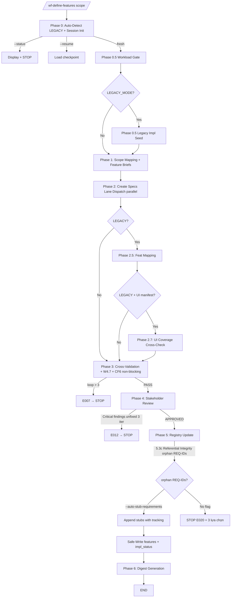

# 03 — Phase Routing

> **Mục đích file:** 11 phases (NEW: 7-8 phases, LEGACY: 10-11 phases) + W4.7/CF6 non-blocking checks + Phase 2.7 UI Coverage LEGACY-only.

---

## 1. Phase routing map

| Phase | Procedure file | Load khi | Time |
|-------|---------------|----------|------|
| 0 | `phase0-context.md` | Always (entry) | 1-2 min |
| 0.5 (Workload) | `phase0.5-workload-gate.md` | Always | 30s |
| 0.5 (Legacy Impl Seed) | `phase0.5-legacy-impl-seed.md` | `$LEGACY_MODE == true` | 1-2 min |
| 1 | `phase1-scope-mapping.md` | Always | 2-5 min |
| 2 | `phase2-create-specs.md` | Always (Lane Dispatch parallel) | 10-30 min |
| 2.5 | `phase2.5-feat-mapping.md` | `$LEGACY_MODE == true` | 1-2 min |
| 2.7 | `phase2.7-ui-coverage.md` | `$LEGACY_MODE == true AND ui-manifest.json EXISTS AND total_screens > 0` | 2-5 min |
| 3 | `phase3-cross-validation.md` | Always (auto-fix loop max 3 + W4.7 + CF6 non-blocking) | 2-5 min |
| 4 | `phase4-stakeholder-review.md` | Always | 5-10 min |
| 5 | `phase5-registry-update.md` | Always (Referential Integrity v3.1 + Safe-Write append-only features[]) | 1-3 min |

---

## 2. Flow diagram



---

## 3. Phase 2 Lane Dispatch parallel

```
Phase 2 Create Specs:
  Module: _shared/lane/dispatcher.py
  Each module = 1 lane (BA or product-expert agent)
  Output: sessions/{id}/lanes/{module-slug}/specs-signals.json
  Max concurrent: 3 (token bucket)
```

---

## 4. Phase 3 Cross-Validation + non-blocking checks

```
Phase 3 Steps:
  3.1-3.7: 7 validation checks (FEAT-REQ mapping, file existence, schema, duplicate, ...)
  3.8 W4.7 (Non-blocking, SAU POST-GATE): Cross-Module Entity Detection
    - Scan feature specs tìm `MOD-[A-Z0-9-]+` refs từ module khác
    - Check `cross_module_dependencies[]` trong registry
    - Interactive: AskUserQuestion 3 options (Có/Không/Deferred)
    - Headless: append vào deferred-findings.md
    - Graceful skip khi registry chưa có field
  CF6 (Non-blocking, v3.3.0+): Cross-FEAT Ref Detection
    - Scan mention "FEAT-XXX" hoặc "REQ-XXX" trong description/business_rules/dependencies
    - Auto-suggest `cross_feat_refs[]` entries
    - User accept/reject từng suggestion
    - Accepted → append vào features[].cross_feat_refs[] khi Safe-Write Phase 5
  Auto-fix loop: max 3 iterations cho 3.1-3.7
```

---

## 5. Phase 5 Referential Integrity (v3.1)

```
Phase 5 Steps:
  5.1: Read feature specs từ phase2-features/
  5.2: Build features[] entries
  5.3: Prepare Safe-Write
  5.3c (v3.1 MỚI — TRƯỚC atomic write):
    Compute orphan REQ-IDs = features[].req_ids[] − requirements[].req_id
    IF orphan_count > 0:
      Write debug: $SESSION_DIR/referential-integrity-violations.json
      IF --auto-stub-requirements flag:
        APPEND stub entries vào requirements[] với tracking:
          - auto_generated_by
          - needs_user_review
          - source: "feature_reference"
          - referenced_by: [FEAT-XXX]
      ELSE:
        BLOCK với E020 + 3 lựa chọn:
          1. Pass --auto-stub-requirements flag
          2. Re-run /wf-analyze-requirements
          3. Use /wf-manage-change
        STOP
  5.4: Atomic write registry (features[] append-only)
  POST-GATE: jq referential integrity check (BẮT BUỘC pass)
```

---

## 6. Conditional skipping

| Phase | Skip nếu | Reason |
|-------|---------|--------|
| 0.5 Legacy Impl Seed | `$LEGACY_MODE == false` | Chỉ áp dụng legacy |
| 2.5 Feat Mapping | `$LEGACY_MODE == false` | Chỉ áp dụng legacy |
| 2.7 UI Coverage | `$LEGACY_MODE == false OR ui-manifest.json missing OR total_screens == 0` | Cần UI manifest + screens |

---

## 7. Cross-phase data — Pipeline state SSOT

`sessions/{id}/session-state.json`:

```json
{
  "$schema": "session-state-v1",
  "session_id": "20260515-143000-a1b2",
  "scope": "all | system | module",
  "project_type": "NEW | LEGACY",
  "phases": {
    "P0": "completed",
    "P0_5_workload": "completed",
    "P0_5_legacy_impl_seed": "skipped|completed",
    "P1": "completed",
    "P2": { "status": "completed", "lanes_completed": ["crm", "smarttax", "..."] },
    "P2_5": "skipped|completed",
    "P2_7": "skipped|completed",
    "P3": { "status": "completed", "w4_7_findings": 2, "cf6_suggestions": 5 },
    "P4": "completed",
    "P5": { "status": "completed", "orphan_reqs_count": 0, "auto_stubs_appended": 0 }
  },
  "flags": { "auto_stub_requirements": false, "from_scan_session_id": null }
}
```

---

## 8. Liên kết

- Procedures: [07-procedures-structure.md](07-procedures-structure.md)
- File contract: [04-file-contract.md](04-file-contract.md) §dual-schema feature-briefs
- Phase 3 W4.7 details: [`procedures/phase3-cross-validation.md`](../../../.claude/skills/workflow/wf-define-features/procedures/phase3-cross-validation.md)
- Phase 5 Referential Integrity: [`procedures/phase5-registry-update.md`](../../../.claude/skills/workflow/wf-define-features/procedures/phase5-registry-update.md) §5.3c
