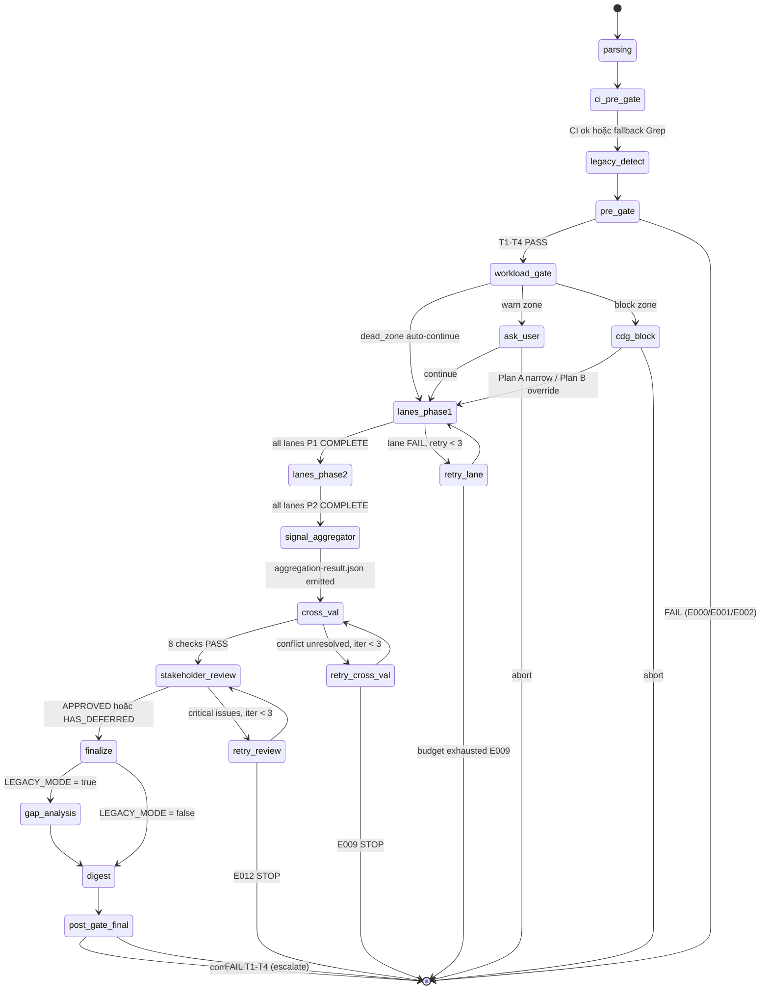

# 03 — Kiến Trúc Skill

> **Mục đích file:** Tả KIẾN TRÚC TỔNG QUAN của skill `wf-design` — components nào cấu thành, dữ liệu chảy ra sao, hai cấp độ song song (system × agent), integration points với MCV3 engines. Đọc tiếp [03-phase-routing.md](03-phase-routing.md) để hiểu TRÌNH TỰ 11 phase.
> **Khác với [03-phase-routing.md](03-phase-routing.md):** File này tả "bộ máy" (static structure) — có những component nào, chúng nối với nhau thế nào. File 03-phase-routing tả "luồng" (dynamic execution) — phase chạy theo thứ tự nào, điều kiện skip/branch.

---

## 1. Bản Đồ Tổng Thể

```
                        ┌──────────────────────────────────────────────────────┐
  /wf-design ─────────▶ │              ORCHESTRATOR                            │
  [target + flags]      │      (SKILL.md — lean routing hub, ~370 dòng)        │
                        │  - Parse target + flags → resolve scope              │
                        │  - CI PRE-GATE 3-step (Na/Nb/Nc)                    │
                        │  - LEGACY detect (CORE-021)                          │
                        │  - Workload Gate (Phase 0.5 — 3 zones)               │
                        │  - Session init $SESSION_DIR                         │
                        │  - Route đến 11 procedure files (lazy-load)          │
                        └──────────────────┬───────────────────────────────────┘
                                           │
                    Phase 1+2: Lane Dispatch per system
                                           │
           ┌───────────────────────────────┼───────────────────────────────┐
           │                               │                               │
           ▼                               ▼                               ▼
  ┌──────────────────┐           ┌──────────────────┐           ┌──────────────────┐
  │   System Lane    │           │   System Lane    │           │   System Lane    │
  │    crm           │  (...)    │   smarttax       │  (...)    │   eureka         │
  │                  │           │                  │           │                  │
  │ architect        │           │ architect        │           │ architect        │
  │ dba              │           │ dba              │           │ dba              │
  │ devops           │           │ devops           │           │ devops           │
  │ security         │           │ security         │           │ security         │
  │ [ai-engineer?]   │           │ [ai-engineer?]   │           │ [data-engineer?] │
  │                  │           │                  │           │                  │
  │ → signals.json   │           │ → signals.json   │           │ → signals.json   │
  │ → specs-signals  │           │ → specs-signals  │           │ → specs-signals  │
  └────────┬─────────┘           └────────┬─────────┘           └────────┬─────────┘
           │                              │                               │
           └──────────────────┬───────────┴───────────────────────────────┘
                              │
                              ▼
                  ┌──────────────────────────────────────────┐
                  │          SIGNAL AGGREGATOR               │
                  │  (Phase 3 — dual-dedup)                  │
                  │  - Collect signals.json + specs-signals  │
                  │  - Dedup component_id (architecture)     │
                  │  - Dedup api_id (API endpoints)          │
                  │  - Flag conflicts cross-system           │
                  │  - Output: aggregation-result.json       │
                  └──────────────────┬───────────────────────┘
                                     │
                  ┌──────────────────┼──────────────────────────────────────┐
                  │                  │                                       │
                  ▼                  ▼                                       ▼
        ┌─────────────┐    ┌──────────────────┐                  ┌──────────────────┐
        │ Phase 4     │    │   Phase 5        │                  │  Phase 6+7+8     │
        │ Cross-Val   │    │   Stakeholder    │                  │  Finalize        │
        │ auto-fix ≤3 │    │   Review         │                  │  Gap Analysis    │
        │             │    │   PARALLEL       │                  │  Digest + Strip  │
        │             │    │   architect +    │                  │                  │
        │             │    │   security       │                  │                  │
        └─────────────┘    └──────────────────┘                  └──────────────────┘
                                     │
                                     ▼
                          ┌──────────────────────────────────────────┐
                          │   CANONICAL OUTPUT + POST-GATE           │
                          │  - phase3-architecture/ docs             │
                          │  - design-summary.json                   │
                          │  - design-input-digest.json (STRIPPED)   │
                          │  - Registry design_status updated        │
                          │  - phase-summary.md (CORE-028)          │
                          └──────────────────────────────────────────┘
```

---

## 2. Thành Phần (Components)

### 2.1 SKILL.md — Lean Routing Hub

**Vai trò:** Entry point duy nhất. Lazy-load routing — không chứa execution logic (CORE-032).

Thực hiện:
1. Parse `target` + `--status` / `--resume` / `--from-scan`.
2. CI PRE-GATE 3-step (Na/Nb/Nc — CORE-033): detect GitNexus/Serena → freshness → inject `$CI_CONTEXT`.
3. LEGACY detect (CORE-021): `project-context.md > 500 bytes` → set `$LEGACY_MODE`.
4. PRE-GATE (T1→T4): `req-registry.json` exists + `.features[] length > 0` + `phase2-features/` tồn tại + forensic check.
5. Khởi tạo `$SESSION_DIR = .mc-data/work/wf-design/sessions/{YYYYMMDD-HHMMSS-hash4}/`.
6. Route đến 11 procedure files theo thứ tự (lazy-load per phase).

**Không làm:**
- Không nhúng bash script inline.
- Không ghi `req-registry.json` — chỉ Phase 6 main thread ghi `design_status`.
- Không spawn agent trực tiếp — delegate sang procedure files.

**File:** `.claude/skills/workflow/wf-design/SKILL.md` (~370 dòng)

---

### 2.2 Workload Gate (Phase 0.5)

**Vai trò:** Phát hiện project quy mô lớn (LPM) trước khi commit resources. Ba zones:

| Zone | Điều kiện | Hành vi |
|------|-----------|---------|
| `dead_zone` | systems < 3 AND features < 20 | Auto-continue |
| `warn` | systems 3-5 OR features 20-40 | AskUserQuestion continue/abort |
| `block` | systems ≥ 5 OR departments ≥ 10 OR requirements ≥ 50 OR features ≥ 40 | CDG Plan A (narrow target) / Plan B (override) |

**LPM params khi block-override:** `max_parallel_agents=3`, `skeleton_first=true`, `checkpoint_per_phase=true`.

| Trường | Giá trị |
|--------|---------|
| **Input** | `req-registry.json` (count systems, features, requirements) |
| **Output** | `sessions/{id}/workload-report.md` |
| **Stateful?** | Không — single pass |
| **Spawn agent?** | Không |
| **Idempotent?** | Có |

**Procedure:** `procedures/phase0.5-workload-gate.md`

---

### 2.3 System Router — Lane Dispatch per System

**Vai trò:** Core orchestration engine của Phase 1 và Phase 2. Với mỗi `system` trong `registry.systems[]` (hoặc single system nếu `target` khác `platform`), tạo 1 lane độc lập và dispatch agent set phù hợp.

**Phase 1 — Architecture per system:**

```
For each system in scope:
  Lane = (system_slug, agents=[architect + conditional agents])
  Spawn parallel (max: $LPM_PARAMS.max_parallel_agents)
    - architect       ← ALWAYS
    - ai-engineer     ← $HAS_AI_ML == true
    - data-engineer   ← $HAS_DATA_PIPELINE == true
    - automation-architect ← $HAS_AUTOMATION == true
  LPM override: IF conditionals ≥ 3 → SEQUENTIAL trong lane
```

**Phase 2 — Technical Specs per system (Option A: 3 specs trong cùng lane):**

```
For each system lane (reuse lane từ Phase 1):
  Spawn parallel trong cùng lane:
    - architect    ← api-contract.md
    - dba          ← database-schema.md + erd.dbml
    - devops       ← infra-spec.md + cicd-pipeline.md
    - security     ← security-design.md + threat-model.md
```

| Trường | Giá trị |
|--------|---------|
| **Input** | `registry.systems[]` + `phase2-features/{system}/**/*.md` |
| **Output** | `sessions/{id}/lanes/{system-slug}/signals.json` (Phase 1) + `specs-signals.json` (Phase 2) |
| **Stateful?** | Có — L2 lane checkpoint trong `session-state.json` |
| **Spawn agent?** | Có — 4-7 agents per lane (architect bắt buộc, còn lại conditional) |
| **Idempotent?** | Có per lane (resume detect lane đã complete) |

**Write isolation (CORE-025):** Mỗi lane ghi vào `sessions/{id}/lanes/{system-slug}/` — không lane nào đọc/ghi vào namespace của lane khác.

**Procedure:** `procedures/phase1-architecture.md`, `procedures/phase2-specs-parallel.md`

---

### 2.4 Signal Aggregator — Dual-Dedup (Phase 3)

**Vai trò:** Thu thập toàn bộ signals từ các lanes, dedup, phát hiện conflict cross-system. Chạy SEQUENTIAL (không lane-ify Phase 3).

**Logic dual-dedup:**

```
1. Read sessions/{id}/lanes/*/signals.json (Phase 1)
   Read sessions/{id}/lanes/*/specs-signals.json (Phase 2)

2. Dedup component_id (architecture components):
   normalize → sha256(component_id, system) → group trùng
   → CONFLICT nếu 2 systems định nghĩa cùng component khác schema

3. Dedup api_id (API endpoints):
   normalize URL + method → group trùng
   → CONFLICT nếu 2 systems có cùng endpoint khác contract

4. Output: sessions/{id}/aggregation-result.json
   Conflicts route → Phase 4 cross-validation resolve
```

| Trường | Giá trị |
|--------|---------|
| **Input** | `sessions/{id}/lanes/*/signals.json` + `*/specs-signals.json` |
| **Output** | `sessions/{id}/aggregation-result.json` |
| **Stateful?** | Có — checkpoint sau mỗi system batch |
| **Spawn agent?** | Có — automation-architect (integration design + workflow automation) |
| **Idempotent?** | Có (re-run đọc lại signals hiện có) |

**Procedure:** `procedures/phase3-integration.md`

---

### 2.5 Cross-Validation Loop (Phase 4)

**Vai trò:** Resolve conflicts từ aggregation-result. Chạy 8 checks + auto-fix loop max 3 iterations.

| Trường | Giá trị |
|--------|---------|
| **Input** | `sessions/{id}/aggregation-result.json` |
| **Output** | Updated lane signals (resolved conflicts) |
| **Stateful?** | Có — retry count per conflict trong `session-state.json` |
| **Spawn agent?** | Có — architect (resolution) |
| **Idempotent?** | Có sau khi conflicts resolved |

Khi loop > 3 iterations → E009 STOP (CORE-034).

**Procedure:** `procedures/phase4-crossval.md`

---

### 2.6 Stakeholder Review (Phase 5)

**Vai trò:** Review toàn bộ design theo 3 góc nhìn (Phần B Business impact / C Technical soundness / D Risk assessment). Chạy PARALLEL: `architect` + `security`.

| Trường | Giá trị |
|--------|---------|
| **Input** | `phase3-architecture/*.md` (canonical docs generated by Phases 1-4) |
| **Output** | `sessions/{id}/stakeholder-review.md` (APPROVED hoặc HAS_DEFERRED) |
| **Stateful?** | Có — iteration count |
| **Spawn agent?** | Có — 2 agents parallel: `architect` (multi-perspective) + `security` |
| **Idempotent?** | Có |

Critical issues unfixed sau 3 iterations → E012 STOP.

**Procedure:** `procedures/phase5-review.md`

---

### 2.7 Finalize + Registry Safe-Write (Phase 6)

**Vai trò:** Ghi canonical Phase 3 docs, cập nhật registry `design_status`, sinh `design-summary.json`, `deferred-findings.md` (nếu có HAS_DEFERRED).

**Registry safe-write (CORE-006):**
- **write_role:** PRIMARY
- **fields_owned:** `["design_status"]`
- Narrow jq update per feature — không ghi đè fields khác.

| Trường | Giá trị |
|--------|---------|
| **Input** | `sessions/{id}/lanes/*/signals.json + specs-signals.json` (merged) |
| **Output** | `.mc-data/docs/phase3-architecture/P3-01-architecture.md`, `technical-specs/*.md`, `stakeholder-review.md`, `design-summary.json` |
| **Spawn agent?** | Không — main thread ghi trực tiếp |
| **Idempotent?** | Có (atomic write) |

**Procedure:** `procedures/phase6-finalize.md`

---

### 2.8 Gap Analysis (Phase 7 — LEGACY-only)

**Vai trò:** Cross-reference design mới với code thực tế trong legacy codebase. Chạy SEQUENTIAL (KHÔNG lane-ify — CORE-013 module-code alignment cần consistent context).

**Trigger:** `$LEGACY_MODE == true` (phát hiện từ Phase 0 — CORE-021).

| Trường | Giá trị |
|--------|---------|
| **Input** | `phase3-architecture/*.md` + `module-code-mapping.json` (từ `wf-legacy-extract`) |
| **Output** | `.mc-data/work/legacy-scan/gap-report.md`, `gap-categories.json`, `action-items.json` (STRIPPED) |
| **Spawn agent?** | Không — inline analysis |
| **Idempotent?** | Có |

**Procedure:** `procedures/phase7-gap.md`

---

### 2.9 Digest + Template Strip (Phase 8)

**Vai trò:** Sinh `design-input-digest.json` (compressed context cho downstream skills), `phase-summary.md` (CORE-028, tiếng Việt). Strip `_*` keys trước khi ghi canonical vào `_meta/`.

```bash
# Template Strip (ADR-OPT-05)
jq 'walk(if type == "object" then with_entries(select(.key | startswith("_") | not)) else . end)' \
   sessions/{id}/design-input-digest.json > _meta/design-input-digest.json.tmp \
  && mv _meta/design-input-digest.json.tmp _meta/design-input-digest.json
```

**Procedure:** `procedures/phase8-digest-summary.md`

---

### 2.10 Cross-Cutting Services (Shared Utilities)

| Service | Mục đích | File |
|---------|----------|------|
| CI Detect | Auto-detect GitNexus/Serena availability (CORE-033) | `.claude/scripts/ci-detect.sh` |
| CI Freshness Check | Verify index khớp HEAD | `.claude/scripts/ci-freshness-check.sh` |
| CDG Gate | Workload block CDG, Phase 5 critical issues CDG (CORE-027) | Spawned tại Phase 0.5, Phase 5 |
| Session Lock + Heartbeat | Cô lập session (CORE-030) | Inline trong `procedures/_shared.md` |
| Atomic Write | Build tmp → validate JSON → mv (CORE-035) | `procedures/_shared.md` §Atomic Write |
| LEGACY Context Inject | Đọc `project-context.md` + `legacy-decisions.json` vào agent prompts | `procedures/_shared.md` §LEGACY Context |
| --from-scan Loader | Đọc `target-map.json` từ `wf-scan-target` session (Sprint 5) | `procedures/_shared.md` §from-scan |

---

## 3. Sequence Diagram — Happy Path (Multi-system, Standard Profile)

```
User ──/wf-design platform ──▶ SKILL.md (Orchestrator)
                                │
                                │ 1. Parse args → target=platform
                                │ 2. CI PRE-GATE 3-step (Na/Nb/Nc)
                                │ 3. LEGACY detect (project-context.md check)
                                │ 4. PRE-GATE T1→T4 (registry + phase2-features/)
                                │ 5. Init $SESSION_DIR + session-state.json
                                │
                                ├──▶ procedures/phase0-context.md → return
                                ├──▶ procedures/phase0.5-workload-gate.md → return
                                │
                                │ Phase 1: Lane Dispatch per system
                                ├──▶ Spawn Lane crm (architect + dba + devops + security)
                                ├──▶ Spawn Lane smarttax (parallel)
                                ├──▶ Spawn Lane eureka (parallel)
                                │       [max $LPM_PARAMS.max_parallel_agents concurrent]
                                │       [L2 checkpoint: session-state.json.phases.P1.lanes]
                                │       → lanes/{system}/signals.json per lane
                                │
                                │ Phase 2: Specs per system (reuse lanes)
                                ├──▶ Lane crm: architect + dba + devops + security (parallel)
                                ├──▶ Lane smarttax: ... (parallel)
                                ├──▶ Lane eureka: ... (parallel)
                                │       → lanes/{system}/specs-signals.json per lane
                                │
                                ├──▶ procedures/phase3-integration.md
                                │       → Signal Aggregation dual-dedup
                                │       → Spawn automation-architect
                                │       → aggregation-result.json + integration-map.md
                                │
                                ├──▶ procedures/phase4-crossval.md
                                │       → 8 checks + auto-fix loop (max 3)
                                │
                                ├──▶ procedures/phase5-review.md
                                │       → PARALLEL: architect + security
                                │       → stakeholder-review.md (APPROVED)
                                │
                                ├──▶ procedures/phase6-finalize.md
                                │       → Write canonical phase3-architecture/ docs
                                │       → Registry safe-write design_status
                                │       → design-summary.json
                                │
                                │ [Phase 7 skip — NEW project, không LEGACY]
                                │
                                ├──▶ procedures/phase8-digest-summary.md
                                │       → design-input-digest.json (Template Strip)
                                │       → phase-summary.md (≤15 dòng tiếng Việt)
                                │
                                ▼
                        POST-GATE final (T1→T4)
                        phase3-architecture/ docs + design-input-digest.json + registry updated
```

---

## 4. Parallelism Model

### 4.1 Hai Cấp Độ Song Song

`wf-design` có kiến trúc song song 2 cấp độ lồng nhau:

**Cấp 1 — System × System (Lane level):**

| Phân lớp | Song song? | Điều kiện |
|----------|-----------|-----------|
| Lane CRM × Lane SmartTax × Lane Eureka | **Có** | Write scope tách biệt: `lanes/{system-slug}/` (CORE-025) |
| Số lane song song tối đa | Standard: 5 / LPM: 3 | `$LPM_PARAMS.max_parallel_agents` |
| Phase 3 (Aggregator) | **Không** | Cần kết quả đầy đủ từ tất cả lanes trước khi dedup |
| Phase 4 (Cross-Val) | **Không** | Cần context toàn bộ aggregation |
| Phase 5 (Review) | Có (2 agents) | architect + security, write scope tách biệt |
| Phase 7 (Gap Analysis) | **Không** | SEQUENTIAL — CORE-013 module-code alignment cần consistent context |

**Cấp 2 — Agent × Agent (Intra-lane level):**

| Phân lớp | Song song? | Điều kiện |
|----------|-----------|-----------|
| Phase 1: architect × ai-engineer × data-engineer | Có | Conditional — chỉ nếu conditionals < 3 |
| Phase 2: architect × dba × devops × security | **Có** | Write scope tách biệt trong lane (architect→api-contract, dba→database-schema, devops→infra-spec, security→security-design) |
| Conditional Phase 2: architect × ai-engineer × data-engineer × automation-architect | Sequential nếu tổng ≥ 3 | LPM override — CORE-025 token budget |

### 4.2 LPM Override Logic

Khi `$HAS_AI_ML + $HAS_DATA_PIPELINE + $HAS_AUTOMATION ≥ 3` (tổng conditional agents ≥ 3 trong lane):

```
Thay vì PARALLEL architect + dba + devops + security + ai-engineer + data-engineer + automation-architect
→ SEQUENTIAL:
  Wave 1: architect + dba + devops + security (4 agents)
  Wave 2: ai-engineer + data-engineer + automation-architect (sau Wave 1)
```

Lý do: 7+ agents cùng lúc vượt max 10 concurrent (CORE-025) khi multi-system.

### 4.3 Max Concurrency

| Scenario | Max concurrent agents |
|----------|-----------------------|
| Standard: 2 systems × 4 agents | 8 (safe) |
| Standard: 3 systems × 4 agents | 12 → batch thành 2 waves (Wave 1: 10, Wave 2: 2) |
| LPM: 5 systems × 4 agents | 20 → batch 3-per-wave với max_parallel_agents=3 |

**Pattern tham khảo:** [`../../03-design-patterns/04-parallel-lane-dispatch.md`](../../03-design-patterns/04-parallel-lane-dispatch.md)

---

## 5. Data Flow Chi Tiết

### 5.1 Input → Lane Output

```
phase2-features/{system}/**/*.md     ← Feature specs per system
req-registry.json (features[])       ← Scope + NFR
  ▼
Phase 1 Lane per system:
  sessions/{id}/lanes/crm/
    signals.json                     ← Architecture signals (component_id-keyed)
    architecture.md                  ← Architect Phase 1 output
    integration-points.json          ← Các điểm tích hợp với system khác
  sessions/{id}/lanes/smarttax/
    signals.json
    ...
  ▼
Phase 2 Lane per system:
  sessions/{id}/lanes/crm/
    specs-signals.json               ← Specs signals (api_id + entity_id keyed)
    database-schema.md               ← DBA output
    erd.dbml                         ← ERD DBML format
    infra-spec.md                    ← DevOps output
    security-design.md               ← Security output
    [ai-design.md]                   ← AI Engineer (conditional)
    [data-pipeline-design.md]        ← Data Engineer (conditional)
```

### 5.2 Aggregation → Canonical Output

```
sessions/{id}/lanes/*/signals.json
sessions/{id}/lanes/*/specs-signals.json
  ▼
Phase 3 Signal Aggregator:
  sessions/{id}/aggregation-result.json   ← Deduped + conflict-flagged
  sessions/{id}/integration-design.md    ← automation-architect output
  ▼
Phase 4 Cross-Validation:
  Conflicts resolved → lanes updated
  ▼
Phase 5 Stakeholder Review:
  sessions/{id}/stakeholder-review.md
  ▼
Phase 6 Finalize:
  .mc-data/docs/phase3-architecture/
    P3-01-architecture.md
    technical-specs/
      api-contract.md
      database-design.md
      infra-spec.md
      integration-map.md
    stakeholder-review.md
  sessions/{id}/design-summary.json
  req-registry.json (design_status="completed" per feature)
  ▼
Phase 8 Digest + Strip:
  sessions/{id}/design-input-digest.json  ← Working (có _* keys)
    ↓ Template Strip (ADR-OPT-05)
  .mc-data/docs/_meta/design-input-digest.json  ← Canonical (không _* keys)
```

### 5.3 Cross-Skill Data Flow

```
CONSUMES FROM:
  wf-define-features  → phase2-features/**/*.md + feature-briefs.json
  wf-analyze-requirements → req-registry.json (features[] populated)
  wf-brainstorm       → legacy-decisions.json (LEGACY)
  wf-legacy-extract   → module-code-mapping.json (LEGACY Phase 7)
  wf-scan-target      → target-map.json (--from-scan Sprint 5)

PRODUCES FOR:
  wf-design-ux        → phase3-architecture/P3-01-architecture.md + technical-specs/*.md
  wf-plan-modules     → phase3-architecture/ + design-summary.json + action-items.json (LEGACY)
  wf-implement-feature → design-input-digest.json (schema: design-input-digest-v1)
```

### 5.4 Checkpoint & Resume (3-level)

| Layer | Checkpoint File | Khi nào ghi |
|-------|-----------------|-------------|
| L1 Orchestrator | `sessions/{id}/session-state.json.phases.{PN}.status` | Sau mỗi phase POST-GATE PASS |
| L2 Lane | `sessions/{id}/session-state.json.phases.P1.lanes.{system}` | Sau mỗi agent COMPLETE trong lane |
| L3 Agent | `sessions/{id}/lanes/{system}/Phase{N}-{agent}-report.md` | Agent tự ghi khi hoàn tất |

**Resume routing:** `session-state.json.next_action` → xác định phase tiếp theo (xem [03-phase-routing.md §6](03-phase-routing.md)).

**Backward-compat:** DUAL-WRITE — session-scoped paths (primary) + flat `.mc-data/work/wf-design/` paths (backward-compat, ADR-OPT-02).

---

## 6. File Layouts

Section này tả 2 view đối xứng: **SOURCE** (skill code trên disk, ổn định) và **OUTPUT** (artifacts skill tạo ra trong session, dynamic per run).

### 6.1 Source Layout — Skill code trên disk

```
.claude/skills/workflow/wf-design/
├── SKILL.md                              # Lean routing hub (~370 dòng — CORE-032)
├── _contract.json                        # Cross-skill contract (CORE-036)
├── procedures/                           # Lazy-load procedures (11 files + _shared)
│   ├── _shared.md                        # Cross-cutting: state vars, checkpoint, LEGACY inject,
│   │                                     # atomic write, registry safe-write, template strip
│   ├── phase0-context.md                 # Entry: registry, LEGACY detect, LPM, session init
│   ├── phase0.5-workload-gate.md         # Workload Gate: 3 zones, CDG override
│   ├── phase1-architecture.md            # Lane Dispatch per system (ADR-OPT-01)
│   ├── phase2-specs-parallel.md          # Specs Lane per system (Option A)
│   ├── phase3-integration.md             # Signal Aggregation dual-dedup (ADR-OPT-04)
│   ├── phase4-crossval.md                # Conflict resolution + 8 checks + auto-fix ≤3
│   ├── phase5-review.md                  # Stakeholder Review PARALLEL architect + security
│   ├── phase6-finalize.md                # Registry safe-write + Canonical docs
│   ├── phase7-gap.md                     # LEGACY Gap Analysis SEQUENTIAL
│   └── phase8-digest-summary.md          # Digest + Template Strip + phase-summary
├── templates/                            # Output templates (CORE-031)
│   ├── design-status.json                # design_status field template
│   ├── design-plan.md                    # Execution plan template
│   └── checkpoint.json                   # Checkpoint backward-compat template
├── evals/                                # Test cases (≥6)
│   └── evals.json                        # 6 eval scenarios (TC-1 → TC-6)
```

**Agent definitions tham chiếu (spawned):**

```
.claude/agents/engineering/
├── architect.md          ← Phase 1, 3, 5 (always)
├── dba.md                ← Phase 2 (always)
├── devops.md             ← Phase 2 (always)
├── security.md           ← Phase 2 + 5 (always)
├── ai-engineer.md        ← Phase 2 (conditional: $HAS_AI_ML)
├── data-engineer.md      ← Phase 2 (conditional: $HAS_DATA_PIPELINE)
└── automation-architect.md ← Phase 3 (conditional: $HAS_AUTOMATION, integration design)
```

### 6.2 Session Output Layout — Artifacts skill tạo ra

Khi skill chạy xong, session directory chứa các artifacts sau. Tree này phản ánh kiến trúc 2-level isolation đặc thù của `wf-design`: **system lane** (cấp 1) chứa **agent output** (cấp 2). Chi tiết schema từng file xem [04-file-contract.md](04-file-contract.md).

```
.mc-data/work/wf-design/
├── _index/
│   └── sessions.jsonl                        # APPEND-only — index mọi session đã chạy
│
├── latest                                    # Pointer tới session ID gần nhất (Phase 0)
├── design-status.json                        # Canonical sync từ session (backward-compat)
├── design-plan.md                            # Execution plan (backward-compat)
├── execution-plan.md                         # Protocol 9 plan (backward-compat)
├── checkpoint.json                           # Backward-compat mirror (pre-v4.0 consumers)
├── design-report.md                          # Cross-validation + completion log (Phase 4, 6)
├── design-summary.json                       # Compressed spec — canonical sync từ session
├── deferred-findings.md                      # Conditional — DEFERRED items (Phase 6)
│
└── sessions/
    └── {YYYYMMDD-HHMMSS-hash4}/              # 1 session = 1 directory cô lập (CORE-030)
        ├── .lock                              # Session lock + heartbeat daemon
        ├── session-state.json                 # PRIMARY checkpoint 3-level (L1/L2/L3)
        ├── error-ledger.json                  # Error tracking (APPEND-only — CORE-034)
        │
        ├── workload-report.md                 # Phase 0.5 — Workload Gate output
        ├── feature-digest.md                  # Phase 0 conditional (LPM compression)
        ├── design-status.json                 # Working copy (synced → parent at Phase 8)
        ├── design-summary.json                # Working copy (synced → parent at Phase 8)
        ├── design-input-digest.json           # Working copy (synced → _meta/ at Phase 8)
        ├── aggregation-result.json            # Phase 3 Signal Aggregation (dual-dedup output)
        ├── checkpoint.json                    # Backward-compat mirror
        ├── stakeholder-review.md              # Phase 5 review output
        ├── phase-summary.md                   # CORE-028 (Phase 8, tiếng Việt ≤15 dòng)
        │
        └── lanes/                             # Cấp 1 isolation: 1 lane/system
            ├── {system-slug}/                 # Ví dụ: crm/, smarttax/, eureka/
            │   ├── signals.json               # Phase 1 — architecture signals (component_id-keyed)
            │   ├── specs-signals.json         # Phase 2 — specs signals (api_id + entity_id keyed)
            │   ├── integration-points.json    # Phase 1 — điểm tích hợp với system khác
            │   │
            │   └── agents/                    # Cấp 2 isolation: 1 directory/agent
            │       ├── architect/             # Phase 1: architecture.md
            │       │   └── architecture.md    #          Phase 2: api-contract.md
            │       ├── dba/                   # Phase 2: database-schema.md + erd.dbml
            │       │   ├── database-schema.md
            │       │   └── erd.dbml
            │       ├── devops/                # Phase 2: infra-spec.md + cicd-pipeline.md
            │       │   ├── infra-spec.md
            │       │   └── cicd-pipeline.md
            │       ├── security/              # Phase 2: security-design.md + threat-model.md
            │       │   ├── security-design.md
            │       │   └── threat-model.md
            │       ├── ai-engineer/           # Conditional ($HAS_AI_ML = true)
            │       │   └── ai-design.md
            │       ├── data-engineer/         # Conditional ($HAS_DATA_PIPELINE = true)
            │       │   └── data-pipeline-design.md
            │       └── automation-architect/  # Conditional ($HAS_AUTOMATION = true)
            │           └── automation-design.md
            │
            └── {system-slug-2}/              # Lane thứ 2 (parallel, write scope tách biệt)
                └── ...                        # Cấu trúc giống hệt lane đầu tiên

# Side effects ngoài session directory (skill cũng ghi):
.mc-data/docs/phase3-architecture/
    P3-01-architecture.md                     # Canonical architecture doc (Phase 6)
    technical-specs/
        api-contract.md                       # Merged từ lanes (Phase 6)
        database-design.md
        infra-spec.md
        integration-map.md
    stakeholder-review.md
.mc-data/docs/_meta/
    design-input-digest.json                  # Template-stripped canonical (Phase 8)
    req-registry.json                         # SAFE-UPDATE: design_status=completed per feature

# LEGACY_MODE (Phase 7 — chỉ khi $LEGACY_MODE = true):
.mc-data/work/legacy-scan/
    gap-report.md
    gap-categories.json
    action-items.json
    final-report.md
```

**Quy tắc đọc tree — 2-level isolation:**

| Block | Mục đích |
|-------|---------|
| `_index/sessions.jsonl` | Tra cứu lịch sử — `--status` đọc file này đầu tiên |
| Root session: `.lock`, `session-state.json`, `error-ledger.json` | Runtime state — 3 file luôn có; `session-state.json` là SSOT checkpoint 3-level (L1/L2/L3) |
| `sessions/{ID}/lanes/{system-slug}/` | **Cấp 1 isolation**: 1 directory/system — Phase 1+2 ghi song song, KHÔNG lane nào đọc vào namespace của lane khác |
| `sessions/{ID}/lanes/{system-slug}/agents/{agent-name}/` | **Cấp 2 isolation**: 1 directory/agent trong lane — mỗi agent có write scope riêng biệt, 0 race condition |
| `sessions/{ID}/aggregation-result.json` | Phase 3 output — thu thập từ tất cả `lanes/*/signals.json` + `specs-signals.json` sau khi mọi lanes hoàn tất |
| Side effects: `phase3-architecture/` docs | Canonical output cho user — ghi ở Phase 6 sau khi aggregation + review hoàn tất |

**Cross-skill artifacts (produces_for):**

| Artifact | Path | Consumer | Schema |
|----------|------|----------|--------|
| `design-input-digest.json` | `.mc-data/docs/_meta/design-input-digest.json` | `wf-implement-feature` | `design-input-digest-v1` |
| `phase3-architecture/P3-01-architecture.md` + `technical-specs/*.md` | `.mc-data/docs/phase3-architecture/` | `wf-design-ux`, `wf-plan-modules` | Markdown docs |
| `design-summary.json` | `.mc-data/work/wf-design/design-summary.json` | `wf-plan-modules` | `design-summary-v1` |
| `action-items.json` (LEGACY) | `.mc-data/work/legacy-scan/action-items.json` | `wf-plan-modules` | `action-items-v1` |
| `req-registry.json` (design_status) | `.mc-data/docs/_meta/req-registry.json` | `wf-plan-modules`, `wf-implement-feature` | `req-registry-v1` |

> Schema chi tiết per file (fields, validation rules, version history) ở [04-file-contract.md](04-file-contract.md) §3. KHÔNG lặp lại schema ở đây.

> **Khi nào tree này thay đổi:** Khi thêm/bớt phase, thêm conditional agent type mới, hoặc thay đổi session ID format. Update đồng thời cả `04-file-contract.md` và section này.

---

## 7. CORE Rules Phải Tôn Trọng

| Rule | Áp dụng ở đâu | Verify thế nào |
|------|---------------|----------------|
| CORE-004 (Registry SSOT) | KHÔNG design module ngoài registry | Phase 0 PRE-GATE T2 |
| CORE-006 (Safe-Write) | Chỉ write `design_status` — không ghi fields khác | Narrow jq update per feature |
| CORE-007 (Cross-Skill Path Contract) | Output paths phải khớp Protocol 21 | `validate-schema-sync.sh` |
| CORE-013 (Module-code alignment) | Phase 7 Gap Analysis cần `module-code-mapping.json` | LEGACY only — Phase 7 PRE-GATE |
| CORE-021 (LEGACY detect) | `project-context.md > 500 bytes` — set `$LEGACY_MODE` | Phase 0 LEGACY detect |
| CORE-022 (legacy-decisions.json) | Phase 0 đọc + enforce — modules DEPRECATED loại khỏi scope | Phase 0 PRE-GATE |
| CORE-025 (Parallel Safety) | Lane × lane + agent × agent — write scope tách biệt | `lanes/{system-slug}/` isolation |
| CORE-027 (CDG) | Workload block, Phase 5 critical issues, LPM override | AskUserQuestion tại Phase 0.5, 5 |
| CORE-028 (Phase Summary) | `phase-summary.md` ≤15 dòng tiếng Việt sau Phase 8 | Phase 8 POST-GATE T1 |
| CORE-030 (Session Isolation) | `sessions/{YYYYMMDD-HHMMSS-hash4}/` + lock | Phase 0 session init |
| CORE-032 (Lazy-Load) | SKILL.md ~370 dòng — không chứa logic | `wc -l SKILL.md` ≤ 500 |
| CORE-033 (CI-First) | Phase 0 CI PRE-GATE Na/Nb/Nc (LEGACY đặc biệt cần GitNexus) | ci-detect.sh output |
| CORE-034 (Error Codes) | E000-E016 namespaced per phase | error-ledger.json APPEND-only |
| CORE-035 (Phase Output Org) | Subdirectories `lanes/{system}/`, atomic write JSON | Atomic write pattern |
| CORE-036 (Cross-Skill Artifact) | `design-input-digest-v1` schema versioned | `_contract.json` produces_for |
| CORE-037 (Agent Prompt 8 sections) | 7 agent types × 8 sections (xem `agent-prompt.md`) | Static check per prompt |
| CORE-038 (Context Budget) | Phase transition check — đặc biệt Phase 1+2 nhiều agent | < 65% OK → > 90% FORCE STOP |

---

## 8. State Machine — Orchestrator



---

## 9. Sai Hỏng Và Fallback

| Tình huống | Hành vi |
|------------|---------|
| Phase PRE-GATE T1-T4 FAIL | Auto-fix retry (max 3 — CORE-034). Hết → ESCALATE AskUserQuestion |
| 1 system lane FAIL | Các lane khác tiếp tục; lane FAIL note vào `session-state.json`; Phase 3 aggregate dữ liệu sẵn có; final report note "system partial" |
| Agent timeout trong lane | Retry 1 lần → nếu tiếp fail thì skip agent + note "agent_timeout" trong `error-ledger.json` |
| Signal Aggregator conflict | Conflict route Phase 4 auto-fix; sau 3 lần → ESCALATE architect decision |
| CI tool unavailable | Graceful degradation → fallback Grep/Glob (Protocol 20); LEGACY đặc biệt warn (GitNexus thực sự cần cho code navigation) |
| Context > 90% | FORCE STOP (E009) — checkpoint bắt buộc → hướng dẫn `--resume` (CORE-038) |
| `--from-scan` session không tồn tại | Warning (không block) — tiếp tục không có scan baseline |
| `module-code-mapping.json` thiếu (Phase 7) | Warning → Phase 7 skip với note "gap_analysis_skipped: no module-code-mapping" |
| Workload block zone, user chọn Plan A (narrow) | Re-scope target → 1 system thay vì platform |
| Session lock held (orphan > 30 min) | Auto-release stale lock; else WARN + suggest `--resume` |

---

## 10. Testability

Mỗi component có thể test độc lập:

- **SKILL.md routing:** Chạy `/wf-design --status` với session fixture → verify route đúng phase, không execute steps.
- **Workload Gate (Phase 0.5):** Inject registry fixture với N systems → verify zone classification đúng + CDG trigger đúng.
- **Lane dispatch:** Isolate `procedures/phase1-architecture.md` với 1 system fixture → verify đúng agents spawn, output tại `lanes/{system}/`.
- **Signal Aggregator:** Feed `lanes/*/signals.json` fake (2 systems có cùng component_id) → verify dedup + conflict flag đúng.
- **Cross-skill artifact:** `design-input-digest.json` validate schema `design-input-digest-v1` + verify `_*` keys đã stripped.
- **Agent prompt:** Static check — mỗi trong 7 agent prompt templates có đủ 8 sections (CORE-037)?

Golden fixtures: `.claude/skills/workflow/wf-design/evals/golden/` (xem [09-evals-test-cases.md](09-evals-test-cases.md)).

---

## 11. Liên Kết

- Phase routing chi tiết (11 phases, Mermaid, profile dispatch): [03-phase-routing.md](03-phase-routing.md)
- File contract chi tiết (session layout, canonical paths, PRE/POST-GATE): [04-file-contract.md](04-file-contract.md)
- Procedures outline (11 file, _shared.md, 5 sections per phase): [07-procedures-structure.md](07-procedures-structure.md)
- Agent prompt templates (7 types, 8 sections CORE-037): [agent-prompt.md](agent-prompt.md)
- Tradeoffs ADR (5 ADR-OPT — Lane per system, Session, Workload, Dual-dedup, Strip): [08-tradeoffs-adr.md](08-tradeoffs-adr.md)
- Pattern — Lazy-Load Procedures: [`../../03-design-patterns/01-lazy-load-procedures.md`](../../03-design-patterns/01-lazy-load-procedures.md)
- Pattern — CI-First Integration: [`../../03-design-patterns/02-ci-first-integration.md`](../../03-design-patterns/02-ci-first-integration.md)
- Pattern — Cross-Skill Artifacts: [`../../03-design-patterns/03-cross-skill-artifacts.md`](../../03-design-patterns/03-cross-skill-artifacts.md)
- Pattern — Parallel Lane Dispatch: [`../../03-design-patterns/04-parallel-lane-dispatch.md`](../../03-design-patterns/04-parallel-lane-dispatch.md)
- Pattern — Checkpoint Resume: [`../../03-design-patterns/06-checkpoint-resume.md`](../../03-design-patterns/06-checkpoint-resume.md)
- Standards: [`../../02-standards/02-skill-standard.md`](../../02-standards/02-skill-standard.md), [`../../02-standards/06-safe-write-protocol.md`](../../02-standards/06-safe-write-protocol.md)
- 15 engines map: [`../../01-architecture/10-mcv3-engines-overview.md`](../../01-architecture/10-mcv3-engines-overview.md)
- Ví dụ orchestrator phức tạp: [`../wf-fix-bugs/03-architecture.md`](../wf-fix-bugs/03-architecture.md)
- Skill source: [`.claude/skills/workflow/wf-design/SKILL.md`](../../../.claude/skills/workflow/wf-design/SKILL.md)
