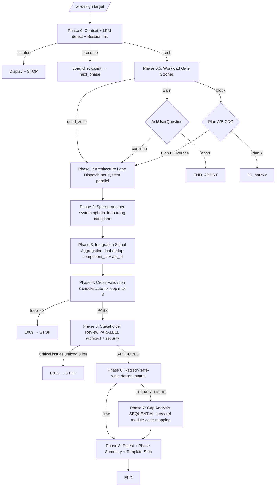

# 03 — Phase Routing

> **Mục đích file:** 11 phases routing + Mermaid + Lane Dispatch per system + Phase 7 LEGACY branching.

---

## 1. Phase routing map (11 phase files)

| Phase | Procedure file | Load khi | Time (standard) |
|-------|---------------|----------|----------------|
| 0 | `phase0-context.md` | Always (entry) | 1-2 min |
| 0.5 | `phase0.5-workload-gate.md` | Always | 30s |
| 1 | `phase1-architecture.md` | Always (Lane per system) | 5-15 min parallel |
| 2 | `phase2-specs-parallel.md` | Always (Lane per system, Option A 3 specs trong cùng lane) | 10-25 min parallel |
| 3 | `phase3-integration.md` | Always (Signal Aggregation dual-dedup) | 3-5 min |
| 4 | `phase4-crossval.md` | Always (auto-fix loop max 3) | 2-5 min |
| 5 | `phase5-review.md` | Always (PARALLEL architect + security) | 5-10 min |
| 6 | `phase6-finalize.md` | Always (registry safe-write design_status) | 1-2 min |
| 7 | `phase7-gap.md` | `$LEGACY_MODE == true` | 5-15 min SEQUENTIAL (KHÔNG lane) |
| 8 | `phase8-digest-summary.md` | Always | 1-2 min (Template Strip) |

---

## 2. Flow diagram



---

## 3. Phase 1+2 Lane Dispatch per system (ADR-OPT-01)

```
Phase 1: Architecture per system
  For each system in registry.systems[]:
    Spawn 1 lane = (system, architect)
    Conditional agents trong cùng lane:
      - ai-engineer (if $HAS_AI_ML)
      - data-engineer (if $HAS_DATA_PIPELINE)
      - automation-architect (if $HAS_AUTOMATION)
  Max concurrent: $LPM_PARAMS.max_parallel_agents (Standard: 5, LPM: 3)
  Output: sessions/{id}/lanes/{system-slug}/signals.json

Phase 2: Technical Specs per system (Option A — 3 specs trong cùng lane)
  For each system lane:
    Parallel: api-contract + database-design + infra-spec
    Agents: architect + dba (DB) + devops (infra)
  Output: sessions/{id}/lanes/{system-slug}/specs-signals.json
```

**LPM override:** Nếu tổng conditional agents ≥ 3 (HAS_AI_ML + HAS_DATA_PIPELINE + HAS_AUTOMATION) → SEQUENTIAL trong lane.

---

## 4. Phase 3 Signal Aggregation dual-dedup (ADR-OPT-04)

```
Aggregator:
  1. Read all sessions/{id}/lanes/*/signals.json (Phase 1) + */specs-signals.json (Phase 2)
  2. Dual-dedup:
     - component_id (architecture components): normalize → group
     - api_id (API endpoints): normalize URL + method → group
  3. Flag CONFLICT khi 2 lanes có cùng id nhưng schema/contract khác
  4. Output: sessions/{id}/aggregation-result.json
  5. Conflicts route Phase 4 cross-validation resolve
```

---

## 5. Conditional skipping

| Phase | Skip nếu | Reason |
|-------|---------|--------|
| 7 | `$LEGACY_MODE == false` | Gap analysis chỉ áp dụng cho legacy |
| 0 phase nào trong main flow | `--status` mode | Display only |

---

## 6. Cross-phase data — Pipeline state SSOT

File `sessions/{id}/session-state.json` (3-level checkpoint L1 phase / L2 lane / L3 agent):

```json
{
  "$schema": "session-state-v1",
  "session_id": "20260515-143000-a1b2",
  "project_type": "NEW | LEGACY",
  "target": "platform | system | module-name",
  "lpm_mode": false,
  "phases": {
    "P0": { "status": "completed" },
    "P0_5": { "status": "completed", "gate_decision": "dead_zone_auto_continue" },
    "P1": {
      "status": "in_progress",
      "lanes": {
        "crm": "completed",
        "smarttax": "running",
        "eureka": "pending"
      }
    },
    ...
    "P7": { "status": "skipped|completed", "reason": "not legacy mode" }
  },
  "next_action": "phase_name"
}
```

---

## 7. Procedure routing (CORE-032)

```
SKILL.md Phase 0 → Read procedures/phase0-context.md → execute (Session Init) → return
   ↓
Read procedures/phase0.5-workload-gate.md → execute (Workload Gate) → return
   ↓
Read procedures/phase1-architecture.md → execute (Lane Dispatch) → return
   ↓
Read procedures/phase2-specs-parallel.md → execute (Lane Dispatch per system) → return
   ↓
Read procedures/phase3-integration.md → execute (Signal Aggregation + Integration Map) → return
   ↓
Read procedures/phase4-crossval.md → execute (Conflict resolution + Cross-Validation) → return
   ↓
Read procedures/phase5-review.md → execute → return
   ↓
Read procedures/phase6-finalize.md → execute → return
   ↓ (nếu $LEGACY_MODE = true)
Read procedures/phase7-gap.md → execute (sequential gap analysis) → return
   ↓
Read procedures/phase8-digest-summary.md → execute → return → STOP
```

---

## 8. Liên kết

- Procedures: [07-procedures-structure.md](07-procedures-structure.md)
- File contract: [04-file-contract.md](04-file-contract.md)
- ADR-OPT-01 Lane: [08-tradeoffs-adr.md](08-tradeoffs-adr.md)
- Pattern: [`../../03-design-patterns/04-parallel-lane-dispatch.md`](../../03-design-patterns/04-parallel-lane-dispatch.md)
