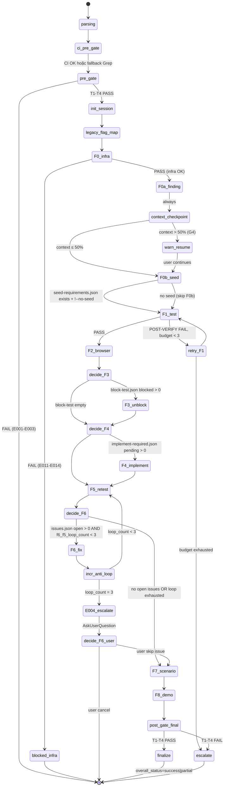

# 03 — Kiến Trúc Skill

> **Mục đích file:** Tả KIẾN TRÚC TỔNG QUAN của skill `wf-e2e-verify` — components nào cấu thành bộ máy orchestrator 11 sub-skills, dữ liệu chảy qua SSOT JSONs ra sao, anti-loop hoạt động thế nào, integration points với MCV3 engines. Đọc tiếp [03-phase-routing.md](03-phase-routing.md) để hiểu TRÌNH TỰ thực thi.
> **Khác với [03-phase-routing.md](03-phase-routing.md):** File này tả "bộ máy" (static structure) — components, state machine, parallelism model, data ownership. File 03-phase-routing tả "luồng" (dynamic execution order) — F0→F0a→…→F8, skip rules, anti-loop counters per step.

---

## 1. Bản Đồ Tổng Thể

```
                    ┌─────────────────────────────────────────────────────────┐
/wf-e2e-verify ───▶ │                  ORCHESTRATOR HUB                       │
<FEAT-ID> [flags]   │          (SKILL.md — lean routing hub ~450 dòng)        │
                    │  1. Parse args: FEAT-ID + flags + legacy flag mapping    │
                    │  2. CI PRE-GATE 3-step (Na/Nb/Nc — CORE-033)            │
                    │  3. PRE-GATE: registry, feature spec ≥500 bytes,         │
                    │     11 sub-skill dirs tồn tại (T1→T4)                   │
                    │  4. Init SESSION_DIR + e2e-status.json + .lock           │
                    │  5. Route procedure files (CORE-032 lazy-load)           │
                    └──────────────────────┬──────────────────────────────────┘
                                           │
              ┌────────────────────────────┼────────────────────────────┐
              │                            │                            │
              ▼                            ▼                            ▼
  ┌───────────────────┐       ┌────────────────────┐       ┌────────────────────┐
  │  TIER 0 — FOUND.  │       │  MAIN PIPELINE      │       │  ANTI-LOOP + CDG   │
  │                   │       │                    │       │                    │
  │  F0 Infra Check   │       │  F1 Live Test      │       │  f6_f5_loop_count  │
  │  F0a Finding      │──────▶│  F2 Browser        │       │  f3_f2_loop_count  │
  │  F0b Seed (cond.) │       │  F3 Unblock (cond.)│       │  Threshold check   │
  │                   │       │  F4 Implement(cond)│       │  → ESCALATE E004   │
  │  [Always run]     │       │  F5 Retest         │       │  → AskUserQuestion │
  └───────────────────┘       │  F6 Fix (cond.)    │       └────────────────────┘
                               │  F7 Scenario       │
                               │  F8 Demo           │
                               └────────┬───────────┘
                                        │ APPEND/UPDATE
                                        ▼
                    ┌─────────────────────────────────────────────────────────┐
                    │              SSOT JSONs (session root)                   │
                    │  issues.json · block-test.json                          │
                    │  implement-required.json · manual.json                  │
                    │  [Multiple writers — ownership rules per file per step] │
                    └──────────────────────┬──────────────────────────────────┘
                                           │ READ (orchestrator + sub-skills)
                                           ▼
                    ┌─────────────────────────────────────────────────────────┐
                    │              PIPELINE SSOT                               │
                    │  e2e-status.json (CHỈ orchestrator WRITE)               │
                    │  Tracks: current_step, steps{}.status, anti_loop,       │
                    │          legacy_flags_used, summary                     │
                    └──────────────────────┬──────────────────────────────────┘
                                           │
                                           ▼
                             POST-GATE + Finalize
                             orchestrator-summary.md
                             phase-summary.md (CORE-028, tiếng Việt ≤15 dòng)
```

---

## 2. Thành Phần (Components)

### 2.1 SKILL.md — Lean Routing Hub

**Vai trò:** Entry point ~450 dòng (CORE-032). KHÔNG chứa execution logic. Làm 5 việc:

1. Parse `$ARGUMENTS`: FEAT-ID, flags mới (`--skip`, `--from-step`, `--auto`, `--no-seed`, `--show-browser`, `--mobile`, `--strict-evidence`) + legacy flags (nhận diện, track WARN).
2. CI PRE-GATE 3-step (Na/Nb/Nc — CORE-033): detect GitNexus/Serena, freshness check, inject CI_CONTEXT.
3. PRE-GATE forensic (CORE-011): validate registry schema, feature spec ≥500 bytes, 11 sub-skill dirs.
4. Init SESSION_DIR + `e2e-status.json` (atomic write từ template) + acquire `.lock`.
5. Route đến procedure files theo bảng lazy-load.

**KHÔNG làm:**
- KHÔNG tự test hay tự spawn browser.
- KHÔNG ghi `req-registry.json` — write_role: NONE.
- KHÔNG đọc lại `error-ledger.json` làm input (output-only CORE-034).
- KHÔNG chứa sub-skill spawn logic — delegate sang `procedures/orchestrate.md`.

**File:** `.claude/skills/workflow/wf-e2e-verify/SKILL.md`

---

### 2.2 Tier 0 — Foundation Layer (F0, F0a, F0b)

Tier 0 chạy TRƯỚC main pipeline. Mục đích: tách FIND (mapping business) khỏi LIVE TEST, tránh context fail khi mapping lớn.

| Component | Sub-skill | Mandatory? | Mục đích |
|-----------|-----------|-----------|----------|
| **F0 Infra Check** | `wf-e2e-infra-check` | YES — không thể skip | Kiểm tra backend/frontend/DB health, Playwright MCP available. Output: `infra-blockers.json`. Fail → STOP E011-E014 |
| **F0a Finding** | `wf-e2e-finding` | YES — không thể skip | FIND ONLY: phân tích business rules, DB schema, API contracts, UI flows, cross-module gaps, seed requirements, test scenarios, edge cases. Output: `findings/` (8 files) + 4 SSOT JSONs rỗng |
| **F0b Seed Manifest** | `wf-e2e-seed-manifest` | CONDITIONAL | Chỉ chạy khi `seed-requirements.json` tồn tại VÀ `!--no-seed`. Spawn sub-skill tạo seed data manifest |

**Context checkpoint G4:** Sau F0a, nếu context > 50% → orchestrator WARN + suggest `/clear + --resume` trước F1. Lý do: F0a phân tích nghiệp vụ có thể dùng 30-50% context window; F1-F8 cần context sạch.

**Procedure files:** `procedures/phase0-infra-check.md`, `procedures/phase1.5-seed-manifest.md`

---

### 2.3 Main Pipeline (F1–F8) — Sequential với Conditional Skip

8 sub-skills chạy TUẦN TỰ, orchestrator quyết định skip/run dựa trên signal từ SSOT JSONs.

| Sub-skill | Vai trò | Input chính | Output chính | Loại |
|-----------|---------|------------|-------------|------|
| **F1 `wf-e2e-test`** | Live test code-based: DB+API+UI+Integration (consume F0a findings) | `findings/` 8 files | Test reports × 4 loại; SSOT JSONs APPEND | Mandatory |
| **F2 `wf-e2e-browser`** | Browser pre-scan + execute Playwright | F1 reports | `screenshots/browser-*.png`, `browser-test-report.md`; SSOT JSONs APPEND | Default ON |
| **F3 `wf-e2e-unblock`** | Unblock blocked tests — Groups 1 (data), 2 (infra), 4 (manual) | `block-test.json` blocked > 0 | `unblock-report.md`; `block-test.json` UPDATE | Conditional |
| **F4 `wf-e2e-implement`** | Delegate `wf-implement-feature` — implement missing features (Group 3 blocked → impl) | `implement-required.json` pending > 0 | `impl-log.json`; `implement-required.json` UPDATE | Conditional |
| **F5 `wf-e2e-retest`** | Retest sau fix/implement — Playwright bắt buộc cho UI | Sau F4 hoặc PENDING markers | `retest-log.md` | Mandatory |
| **F6 `wf-e2e-fix`** | Fix bugs còn open — loop với F5, max 3 vòng | `issues.json` open > 0 | `fix-log.json`; `issues.json` UPDATE | Conditional |
| **F7 `wf-e2e-scenario`** | Playwright execute `test-scenario.md` | `outputs/test-scenario.md` | `scenario-test-report.md` | Default ON |
| **F8 `wf-e2e-demo`** | Playwright demo `user-guide.md` | `outputs/user-guide.md` | `demo-report.md` | Default ON |

**Procedure file chính:** `procedures/orchestrate.md` — spawn sub-skill loop (F0b→F1→…→F8) + POST-VERIFY sau mỗi step.

---

### 2.4 SSOT JSONs — Shared Data Layer

4 file JSON ở session root, pattern **multiple writers / defined ownership per step**:

| File | Writer (APPEND) | Writer (UPDATE) | Ý nghĩa entries |
|------|----------------|----------------|----------------|
| `issues.json` | F1, F2, F5, F7, F8 | F6 | Bugs/issues — `status: open|in_progress|fixed|still_fail` |
| `block-test.json` | F1, F2 | F3 (giải block), F5 (retest update) | Tests bị block — 4 groups: 1 data / 2 infra / 3 impl / 4 manual |
| `implement-required.json` | F1, F2 | F4 (mark done) | Features còn thiếu — signal kích hoạt F4 |
| `manual.json` | F1, F2, F3 | — (report-only) | Manual verification items (Group 4) |

**Write pattern — APPEND:** atomic `jq --argjson new ... '.signals += [$new]'` + mv tmp.

**Write pattern — UPDATE:** atomic `jq --arg id ... --arg status ... '(.signals[] | select(.id == $id) | .status) = $status'` + mv tmp.

**e2e-status.json:** CHỈ orchestrator write — sub-skills READ-only. Tracks toàn bộ pipeline state (current_step, steps{}.status, anti_loop counters, legacy_flags_used).

---

### 2.5 Anti-Loop Engine

Ngăn infinite loop khi một issue không thể fix surgical.

| Counter | Tracking | Threshold | Hành vi khi đạt |
|---------|----------|-----------|----------------|
| `f6_f5_loop_count` | `e2e-status.json.anti_loop.f6_f5_loop_count` | 3 | ESCALATE E004 → AskUserQuestion (Continue/Skip issue/Cancel). Issue marked `status=still_fail` |
| `f3_f2_loop_count` | `e2e-status.json.anti_loop.f3_f2_loop_count` | 2 | ESCALATE — F3 không unblock được sau 2 vòng |

**Vị trí logic:** `procedures/_shared.md §Anti-loop counters` — `incr_anti_loop()`, `check_anti_loop_threshold()`.

---

### 2.6 Playwright Integration — 3 Modes (G2 Degrade)

| Mode | Khi nào | Hành vi F2/F5/F7/F8 |
|------|---------|---------------------|
| `full` | Default — Playwright MCP available (F0 verify) | Auto-start browser, screenshot bắt buộc (--strict-evidence ON) |
| `assisted` | `--show-browser` | User điều hướng browser, skill observe |
| `none` (`degraded_no_browser`) | Playwright MCP không available (G2) | F2/F7/F8 chuyển sang static analysis; status ghi `degraded`, không skip hoàn toàn |

**Lưu ý v7.1.0:** `--no-playwright` DEPRECATED — IGNORED. Nếu CI không có browser → dùng `--skip=F2,F5,F7,F8` explicit.

**Pattern tham chiếu:** [`../../03-design-patterns/07-playwright-3-modes.md`](../../03-design-patterns/07-playwright-3-modes.md)

---

### 2.7 Legacy Flag Mapper

Đảm bảo backward-compat 100% với flags từ v6.5.0.

| Legacy flag | Hành vi | Tracked |
|-------------|---------|---------|
| `--parallel-safe` | no-op (always enabled) | WARN + `legacy_flags_used[]` |
| `--cross-module` | no-op (always enabled) | WARN + `legacy_flags_used[]` |
| `--playwright-mcp` | no-op | WARN + `legacy_flags_used[]` |
| `--phase=N` (0-6) | map sang `--from-step=F1` | WARN + `legacy_flags_used[]` |
| `--phase=7` | map sang `--from-step=F7` | WARN + `legacy_flags_used[]` |
| `--fix=<path>` | map sang `--from-step=F6` + standalone mode | WARN + `legacy_flags_used[]` |
| `--retest` | map sang `--from-step=F5` + standalone | WARN + `legacy_flags_used[]` |
| `--unblock-test` | map sang `--from-step=F3` + standalone | WARN + `legacy_flags_used[]` |
| `--no-playwright` | IGNORED (v7.1.0+) | WARN + `legacy_flags_used[]` |

**Procedure file:** `procedures/legacy-flags.md`

---

### 2.8 POST-VERIFY Engine (per step)

Sau mỗi sub-skill complete, orchestrator chạy POST-VERIFY 4-tier:

| Tier | Check | Tool |
|------|-------|------|
| T1 | `e2e-status.json.steps.F{N}.status = "completed"` | jq |
| T2 | Outputs declared trong sub-skill `_contract.json` tồn tại | `bash test -f` |
| T3 | Schema validate JSON outputs | `jq -e` |
| T4 | Cross-ref (vd: F1 produces 8 findings, F0a seed-requirements → F0b) | bash |

Fail → re-spawn sub-skill (max 3 retries — CORE-034) → escalate AskUserQuestion.

**Helper:** `procedures/_shared.md §POST-VERIFY` — `postverify_step()`.

---

### 2.9 Cross-Cutting Services

| Service | Mục đích | File |
|---------|----------|------|
| CI Detect | Auto-detect GitNexus/Serena (CORE-033) | `.claude/scripts/ci-detect.sh` |
| CI Freshness Check | Verify index khớp HEAD | `.claude/scripts/ci-freshness-check.sh` |
| CI Context Inject | Pass CI_CONTEXT vào agent prompts | `.claude/scripts/ci-inject-context.sh` |
| Session Lock + Heartbeat | Cô lập session + Protocol 22 cross-session R/W lock | `_locks/` + heartbeat daemon |
| Atomic Write | Build tmp → validate JSON → mv (CORE-035) | Inline pattern trong `_shared.md` |
| Error Ledger | APPEND-only JSONL per error event (CORE-034) | `error-ledger.json` |

---

## 3. Sequence Diagram — Happy Path (Full pipeline, không skip)

```
User ──/wf-e2e-verify FEAT-EW-CRM-001 ──▶ SKILL.md (Router)
                                            │
                                            │ 1. Parse args + legacy flag map
                                            │ 2. CI PRE-GATE Na/Nb/Nc
                                            │ 3. PRE-GATE T1→T4
                                            │ 4. Init $SESSION_DIR + e2e-status.json + .lock
                                            │
                                            │── procedures/phase0-infra-check.md
                                            │   F0 wf-e2e-infra-check ──▶ infra-blockers.json
                                            │   POST-VERIFY T1→T4
                                            │
                                            │── F0a wf-e2e-finding (FIND ONLY)
                                            │   ──▶ findings/ (8 files) + 4 SSOT JSONs rỗng
                                            │   G4 context check → WARN nếu > 50%
                                            │
                                            │── [F0b] wf-e2e-seed-manifest (conditional)
                                            │   ──▶ seed manifest
                                            │
                                            │── procedures/orchestrate.md
                                            │   │
                                            │   ├── F1 wf-e2e-test (mandatory)
                                            │   │   ──▶ 4 test reports + SSOT JSONs APPEND
                                            │   │
                                            │   ├── F2 wf-e2e-browser (default ON)
                                            │   │   ──▶ screenshots + browser-test-report.md
                                            │   │   Anti-loop f3_f2_loop_count++
                                            │   │
                                            │   ├── [F3 skip: block-test empty] (skip)
                                            │   │
                                            │   ├── [F4 skip: implement-required empty] (skip)
                                            │   │
                                            │   ├── F5 wf-e2e-retest (mandatory)
                                            │   │   ──▶ retest-log.md
                                            │   │
                                            │   ├── [F6 skip: issues.json open == 0] (skip)
                                            │   │
                                            │   ├── F7 wf-e2e-scenario (default ON)
                                            │   │   ──▶ scenario-test-report.md
                                            │   │
                                            │   └── F8 wf-e2e-demo (default ON)
                                            │       ──▶ demo-report.md
                                            │
                                            │── POST-GATE orchestrator T1→T4
                                            │── Finalize: orchestrator-summary.md
                                            │── phase-summary.md (CORE-028, ≤15 dòng tiếng Việt)
                                            │── Release .lock
                                            │
                                            ▼
                                    END — overall_status: success
```

---

## 4. Parallelism Model

### 4.1 Ai song song với ai?

`wf-e2e-verify` là **sequential orchestrator** — không có lane parallel ở cấp pipeline. Lý do thiết kế: mỗi F-step consume output của step trước (F1 consume F0a, F2 consume F1, v.v.).

| Phân lớp | Song song? | Giải thích |
|----------|-----------|-----------|
| F-step × F-step (orchestrator level) | **KHÔNG** | Phụ thuộc dữ liệu: F3 cần biết block-test sau F1+F2; F6 cần issues sau F5 |
| Sub-skill nội bộ (trong F1/F2/F7/F8) | Có (nội bộ sub-skill) | F1 có thể chạy DB test và API test song song nội bộ — sub-skill tự quản |
| Playwright sessions (F2, F5, F7, F8) | **KHÔNG** | Sequential vì Protocol 22 browser-mcp.lock: F2→F5→F7→F8 acquire lock tuần tự |
| `wf-e2e-batch` calls | Có (cross-feature) | `/wf-e2e-batch` orchestrator wrapper: nhiều FEAT-ID chạy song song ở cấp feature, mỗi feature có session riêng biệt |

### 4.2 Anti-concurrency: Protocol 22 R/W Lock

Sub-skills cần browser (F2, F5, F7, F8) acquire `_locks/browser-mcp.lock` tuần tự. Sub-skills cần edit source (F4, F6) acquire `_locks/source-{hash}.lock`. Cơ chế: `wf-e2e-shared/global-rw-lock.sh`.

### 4.3 Tại sao không parallel F-steps?

- **Data dependency cứng:** `issues.json` sau F1+F2 mới có đủ dữ liệu để F6 quyết định. F3 cần biết `block-test.json` mới có thể unblock đúng group.
- **Anti-loop state:** `f6_f5_loop_count` phải đọc-tăng-ghi tuần tự — race condition nếu parallel.
- **Context coherence:** Orchestrator theo dõi `e2e-status.json.current_step` để resume; parallel update sẽ phá vỡ checkpoint.

---

## 5. Data Flow Chi Tiết

### 5.1 F0a → F1 — Findings handoff

```
F0a wf-e2e-finding
  ▼
$SESSION_DIR/findings/
  ├── business-rules.md          ← F1 đọc để generate test cases
  ├── db-schema.md               ← F1 đọc để test DB constraints
  ├── api-contracts.md           ← F1 đọc để test API
  ├── ui-flows.md                ← F1+F2 đọc để test UI
  ├── cross-module-gaps.md       ← F1 đọc (B1 Cross-Module Gap Detection)
  ├── seed-requirements.json     ← F0b conditional input
  ├── test-scenarios.md          ← F1 đọc để generate test plans
  └── edge-cases.md              ← F1 đọc để generate edge case tests

F0a cũng khởi tạo 4 SSOT JSONs (rỗng, schema versioned):
  ├── issues.json (rỗng)
  ├── block-test.json (rỗng)
  ├── implement-required.json (rỗng)
  └── manual.json (rỗng)
```

### 5.2 SSOT JSONs — Multi-writer flow

```
F1 wf-e2e-test (live test)
  ├── APPEND → issues.json          (bugs phát hiện qua code test)
  ├── APPEND → block-test.json      (tests bị block)
  ├── APPEND → implement-required.json (missing features)
  └── APPEND → manual.json          (manual items)

F2 wf-e2e-browser (live browser)
  ├── APPEND → issues.json          (bugs phát hiện qua browser)
  ├── APPEND → block-test.json      (tests bị block browser-level)
  ├── APPEND → implement-required.json
  └── APPEND → manual.json

Orchestrator reads signal:
  block-test.json.blocked_count > 0 → spawn F3
  implement-required.json.pending_count > 0 → spawn F4

F3 wf-e2e-unblock → UPDATE block-test.json (mark resolved)
F4 wf-e2e-implement → UPDATE implement-required.json (mark done)
F6 wf-e2e-fix → UPDATE issues.json (mark fixed/still_fail)
```

### 5.3 e2e-status.json — Pipeline SSOT

```
Init (orchestrator):
  e2e-status.json = { steps: {F0:"pending", F0a:"pending", ..., F8:"pending"}, anti_loop: {f6_f5:0, f3_f2:0} }

Sau mỗi F-step complete (orchestrator atomic write):
  e2e-status.json.steps.F{N}.status = "completed|skipped|failed"
  e2e-status.json.current_step = "F{N+1}"

Sau anti-loop increment (orchestrator):
  e2e-status.json.anti_loop.f6_f5_loop_count += 1

Finalize:
  e2e-status.json.overall_status = "success|partial|failed"
  e2e-status.json.summary = { total_issues_found, issues_fixed, issues_open, tests_passed, tests_failed }
```

### 5.4 Cross-Skill Artifact

`wf-e2e-verify` dùng pattern `orchestrates[]` thay vì `produces_for/consumes_from` truyền thống (ADR — orchestrator không produce artifact cho downstream skill khác ngoài E2E pipeline):

```json
{
  "orchestrates": [
    { "step": "F4", "skill": "wf-e2e-implement",
      "trigger": "implement-required.json pending > 0",
      "passes": ["<FEAT-ID>", "--session=<id>"],
      "validation": "impl-log.json + registry impl_status updated" }
  ]
}
```

F4 (`wf-e2e-implement`) delegate tiếp sang `wf-implement-feature` — skill đó mới có write role `impl_status` trên registry.

### 5.5 Checkpoint & Resume

| Layer | Checkpoint File | Khi nào ghi |
|-------|-----------------|-------------|
| Orchestrator | `e2e-status.json` | Sau mỗi POST-VERIFY PASS (atomic write) |
| Sub-skill nội bộ | `$SESSION_DIR/F{N}-*/checkpoint.json` | Sub-skill tự quản — nếu internal phases |
| Session lock | `.lock` + heartbeat | Heartbeat daemon cập nhật liên tục |

**Resume routing:** `e2e-status.json.current_step` xác định điểm vào lại. Procedure: `procedures/resume-status.md`.

---

## 6. File Layouts

Section này tả 2 view đối xứng: **SOURCE** (skill code trên disk, ổn định) và **OUTPUT** (artifacts skill tạo ra trong session, dynamic per run).

### 6.1 Source Layout — Skill code trên disk

```
.claude/skills/workflow/
│
├── wf-e2e-verify/                          # ORCHESTRATOR — entry point
│   ├── SKILL.md                            # Lean routing hub ~450 dòng (CORE-032)
│   ├── _contract.json                      # orchestrates[] + 11 sub-skills (CORE-036)
│   ├── GUIDE.md                            # Quick-start cho user
│   ├── procedures/                         # 7 procedure files (CORE-032 lazy-load)
│   │   ├── _shared.md                      # Cross-cutting: spawn helpers, SSOT helpers,
│   │   │                                   # anti-loop, POST-VERIFY, error handling, CI
│   │   ├── orchestrate.md                  # Main loop: spawn F1-F8 sequential + skip check
│   │   ├── skip-rules.md                   # Conditional skip logic F0b/F2/F3/F4/F6/F7/F8
│   │   ├── legacy-flags.md                 # Legacy flag detect + map + WARN
│   │   ├── resume-status.md                # --resume + --status handlers
│   │   ├── phase0-infra-check.md           # F0 inline orchestration (inline, không spawn)
│   │   └── phase1.5-seed-manifest.md       # F0b inline orchestration (conditional)
│   ├── templates/                          # 20 output templates
│   │   ├── e2e-status.template.json        # Pipeline SSOT template
│   │   ├── issues.template.json
│   │   ├── block-test.template.json
│   │   ├── implement-required.template.json
│   │   ├── infra-blockers.template.json
│   │   ├── orchestrator-summary.template.md
│   │   ├── decision-required.template.md
│   │   ├── seed-requirements.template.json
│   │   ├── seed-report.template.json
│   │   ├── status.template.json
│   │   ├── test-scenario.template.md
│   │   ├── user-guide.template.md
│   │   ├── state-machine.template.md
│   │   ├── ui-mapping.template.md
│   │   ├── api-mapping.template.md
│   │   ├── db-mapping.template.md
│   │   ├── business-understanding.template.md
│   │   ├── business-rule-catalog.template.md
│   │   ├── cross-module-map.template.md
│   │   ├── db-seed-data.template.md
│   │   ├── db-test-report.template.md
│   │   ├── api-test-report.template.md
│   │   ├── ui-test-report.template.md
│   │   ├── integration-test-report.template.md
│   │   └── unblock-report.template.md
│   └── evals/
│       └── evals.json                      # 9 eval test cases
│
├── wf-e2e-finding/                         # F0a — FIND ONLY (no live test)
├── wf-e2e-infra-check/                     # F0 — Infra health validation
├── wf-e2e-seed-manifest/                   # F0b — Seed data manifest (conditional)
├── wf-e2e-test/                            # F1 — Live code-based test (DB+API+UI+Integration)
├── wf-e2e-browser/                         # F2 — Browser Playwright test
├── wf-e2e-unblock/                         # F3 — Unblock tests (Groups 1+2+4)
├── wf-e2e-implement/                       # F4 — Delegate wf-implement-feature
├── wf-e2e-retest/                          # F5 — Retest sau fix/implement
├── wf-e2e-fix/                             # F6 — Fix bugs loop
├── wf-e2e-scenario/                        # F7 — Playwright test-scenario.md
├── wf-e2e-demo/                            # F8 — Playwright user-guide.md demo
│
└── wf-e2e-batch/                           # BATCH ORCHESTRATOR — nhiều FEAT-ID song song
    └── SKILL.md                            # Topo-sort → parallel dispatch per level

.claude/scripts/wf-e2e-shared/              # E2E shared infrastructure scripts
├── ensure-infra.sh                         # Infra bootstrap helper
├── global-rw-lock.sh                       # Protocol 22 cross-session R/W lock
├── lock-daemon.sh                          # Heartbeat daemon cho .lock
└── version-snapshot.sh                     # Version snapshot trước test run
```

### 6.2 Session Output Layout — Artifacts skill tạo ra

Khi skill chạy, toàn bộ 9 actors (orchestrator + F0/F0a/F0b + F1–F8) đều ghi vào cùng 1 session directory. Chi tiết schema từng file xem [04-file-contract.md](04-file-contract.md).

```
.mc-data/work/wf-e2e-verify/
├── _index/
│   └── sessions.jsonl                           # APPEND-only — index mọi session đã chạy
│
└── sessions/
    └── {FEAT-ID}-{YYYYMMDD-HHmm}/               # 1 session = 1 FEAT-ID (CORE-030)
        │
        ├── .lock                                 # Session-level lock + heartbeat daemon
        ├── e2e-status.json                       # ORCHESTRATOR SSOT 8-step (chỉ orchestrator write, atomic)
        ├── session-log.json                      # Execution trace APPEND-only (CORE-026)
        ├── error-ledger.json                     # Error tracking APPEND-only (CORE-034, E001-E099)
        ├── prompt-context.md                     # Input user verbatim
        │
        │   ─── SSOT JSONs — multi-writer (khởi tạo rỗng bởi F0a) ──────────────────
        ├── issues.json                           # F1,F2,F5,F7,F8 APPEND; F6 UPDATE
        ├── block-test.json                       # F1,F2 APPEND; F3 UPDATE; F5 UPDATE
        ├── implement-required.json               # F1,F2 APPEND; F4 UPDATE
        ├── manual.json                           # F1,F2,F3 APPEND; report-only
        │
        │   ─── F-stage subdirectories (CORE-035) ─────────────────────────────────
        ├── F0-infra/                             # F0 — Infra health check
        │   ├── infra-blockers.json               # Backend/frontend/DB/Playwright status
        │   └── Phase-F0-report.md               # Báo cáo tiếng Việt ≤15 dòng
        │
        ├── F0a-finding/                          # F0a — FIND ONLY (wf-e2e-finding)
        │   ├── findings/                         # 8 finding files (đầu ra chính của F0a)
        │   │   ├── business-rules.md             # Quy tắc nghiệp vụ đã phân tích
        │   │   ├── db-schema.md                  # Schema DB hiện tại + constraints
        │   │   ├── api-contracts.md              # API endpoints + request/response contracts
        │   │   ├── ui-flows.md                   # User flows + screen mapping
        │   │   ├── cross-module-gaps.md          # B1 — Gaps giữa modules (orphan refs, drift)
        │   │   ├── seed-requirements.json        # Dữ liệu seed cần thiết → input F0b
        │   │   ├── test-scenarios.md             # Kịch bản test → F1 generate plans
        │   │   └── edge-cases.md                 # Edge cases → F1 generate tests
        │   └── Phase-F0a-report.md              # Báo cáo tiếng Việt ≤15 dòng
        │
        ├── F0b-seed/                             # F0b — Seed manifest (CONDITIONAL)
        │   ├── seed-manifest.json                # Seed data plan + execution status
        │   └── Phase-F0b-report.md              # Báo cáo tiếng Việt ≤15 dòng
        │
        ├── F1-test/                              # F1 — Live code-based test
        │   ├── db-test-report.md                 # DB constraints + migration tests
        │   ├── api-test-report.md                # API endpoint tests
        │   ├── ui-test-report.md                 # UI component tests
        │   ├── integration-test-report.md        # Cross-module integration tests
        │   └── Phase-F1-report.md
        │
        ├── F2-browser/                           # F2 — Browser Playwright test
        │   ├── browser-test-report.md            # Kết quả test browser
        │   ├── screenshots/                      # ⚠️ CÓ THỂ NẶNG (prefix: browser-*)
        │   │   └── browser-{step}-{ts}.png
        │   ├── videos/                           # ⚠️ RẤT NẶNG — chỉ khi recording ON
        │   │   └── browser-{step}-{ts}.webm
        │   ├── traces/                           # Playwright trace files
        │   │   └── browser-{step}.zip
        │   ├── console-logs/                     # Browser console output
        │   │   └── browser-{step}-console.txt
        │   ├── network-logs/                     # HTTP request/response logs
        │   │   └── browser-{step}-network.har
        │   └── Phase-F2-report.md
        │
        ├── F3-unblock/                           # F3 — Unblock tests (CONDITIONAL)
        │   ├── unblock-report.md                 # Groups 1+2+4 unblock results
        │   └── Phase-F3-report.md
        │
        ├── F4-implement/                         # F4 — Delegate wf-implement-feature (CONDITIONAL)
        │   ├── impl-log.json                     # Delegation log + impl session refs
        │   └── Phase-F4-report.md
        │
        ├── F5-retest/                            # F5 — Retest sau fix/implement
        │   ├── retest-log.md                     # Retest results per issue/block
        │   ├── screenshots/                      # ⚠️ CÓ THỂ NẶNG (prefix: retest-*)
        │   │   └── retest-{step}-{ts}.png
        │   ├── traces/
        │   │   └── retest-{step}.zip
        │   └── Phase-F5-report.md
        │
        ├── F6-fix/                               # F6 — Fix bugs loop (CONDITIONAL, max 3 vòng)
        │   ├── fix-log.json                      # Fix attempts per issue + loop count
        │   └── Phase-F6-report.md
        │
        ├── F7-scenario/                          # F7 — Playwright test-scenario.md
        │   ├── scenario-test-report.md           # Kết quả từng kịch bản
        │   ├── screenshots/                      # ⚠️ CÓ THỂ NẶNG (prefix: scenario-*)
        │   │   └── scenario-{name}-{ts}.png
        │   ├── videos/                           # ⚠️ RẤT NẶNG — nếu recording ON
        │   ├── traces/
        │   └── Phase-F7-report.md
        │
        ├── F8-demo/                              # F8 — Playwright user-guide.md demo
        │   ├── demo-report.md                    # Demo walk-through results
        │   ├── screenshots/                      # ⚠️ CÓ THỂ NẶNG (prefix: demo-*)
        │   │   └── demo-{step}-{ts}.png
        │   ├── videos/                           # ⚠️ RẤT NẶNG — nếu recording ON
        │   ├── traces/
        │   └── Phase-F8-report.md
        │
        │   ─── Shared Playwright outputs (cross-stage) ────────────────────────────
        ├── screenshots/                          # Pool chung: browser-*, retest-*, scenario-*, demo-*
        ├── outputs/                              # F1 init; F2,F7,F8 UPDATE
        │   ├── test-scenario.md                  # Skeleton → F7 input
        │   └── user-guide.md                     # Skeleton → F8 input
        │
        │   ─── Lock files (Protocol 22 cross-session) ────────────────────────────
        ├── _locks/
        │   ├── browser-mcp.lock                  # F2, F5, F7, F8 acquire tuần tự (Protocol 22)
        │   ├── source-{hash}.lock                # F4, F6 acquire khi edit source
        │   ├── migration.lock                    # F1 DB migrate
        │   └── module-{id}.lock                  # Cross-session safety
        │
        │   ─── Finalize outputs ───────────────────────────────────────────────────
        ├── orchestrator-summary.md               # User-facing tổng kết toàn pipeline
        └── phase-summary.md                      # CORE-028 tiếng Việt ≤15 dòng
```

> **Ghi chú quan trọng về disk usage:** Playwright outputs (screenshots, videos, traces) có thể chiếm nhiều dung lượng — đặc biệt `videos/` (`.webm`). Mặc định chỉ screenshots được bật (`--strict-evidence ON`). Videos chỉ tạo khi cấu hình recorder explicit. Nên định kỳ dọn sessions cũ sau khi pipeline hoàn tất.

> **Sub-skill `wf-e2e-finding` (F0a):** Skill này được spawn bởi orchestrator tại F0a và GHI VÀO CÙNG SESSION DIR (`F0a-finding/` + 4 SSOT JSONs). Khi debug, phân biệt rõ artifacts của orchestrator (session root) và artifacts của F0a (subdirectory `F0a-finding/`). Sub-skill `wf-e2e-finding` KHÔNG tạo session riêng.

> **Credential Vault (B3):** Credentials test (username, password, tokens) được lưu trong **OS keychain** (thông qua `wf-e2e-credentials` sub-skill) — KHÔNG ghi vào bất kỳ file nào trong session directory. Session dir KHÔNG chứa credentials ở dạng plaintext.

**Quy tắc đọc tree:**

| Block | Mục đích |
|-------|---------|
| `_index/sessions.jsonl` | Tra cứu lịch sử — `--status` đọc file này để list sessions |
| Session root: `.lock`, `e2e-status.json`, `session-log`, `error-ledger` | Runtime state — 4 files luôn có; `e2e-status.json` là SSOT toàn pipeline |
| Root SSOT JSONs: `issues.json`, `block-test.json`, `implement-required.json`, `manual.json` | Dữ liệu chia sẻ giữa F-stages — nhiều writers, ownership rõ ràng per file per operation |
| `F{N}-{name}/` subdirectories | 1 directory/stage — chứa output đặc thù + `Phase-F{N}-report.md` tiếng Việt |
| `F2-browser/`, `F5-retest/`, `F7-scenario/`, `F8-demo/` + nested `screenshots/traces/videos/` | Playwright artifacts — có thể nặng; disk cleanup cần sau khi verify xong |
| `_locks/` | Protocol 22 lock files — KHÔNG đọc trực tiếp, managed bởi `global-rw-lock.sh` |
| `orchestrator-summary.md` + `phase-summary.md` | Đọc đây để nắm kết quả toàn pipeline — không cần đọc từng F-stage report |

**Degraded mode (G2 — `--no-playwright`):** Khi Playwright không available, F2/F7/F8 chạy ở `degraded_no_browser` mode — subdirectories `F2-browser/`, `F7-scenario/`, `F8-demo/` vẫn được tạo nhưng KHÔNG có `screenshots/`, `videos/`, `traces/`. `e2e-status.json.steps.F{N}.status = "degraded"` thay vì `"completed"`.

**Cross-skill artifacts (produces_for):**

| Artifact | Path | Consumer | Ghi chú |
|----------|------|----------|---------|
| `e2e-findings/` (8 files) | `sessions/{ID}/F0a-finding/findings/` | `wf-fix-bugs` (khi cần E2E context) | wf-e2e-verify dùng `orchestrates[]` pattern thay vì `produces_for` truyền thống — xem §5.4 |
| `issues.json` (open items) | `sessions/{ID}/issues.json` | `wf-fix-bugs` (optional — bug context) | Consumer validate schema tại PRE-GATE |
| `orchestrator-summary.md` | `sessions/{ID}/orchestrator-summary.md` | Người dùng / CI pipeline | Human-readable; không schema versioned |

---

## 7. CORE Rules Phải Tôn Trọng

| Rule | Áp dụng ở đâu trong wf-e2e-verify | Verify thế nào |
|------|-----------------------------------|----------------|
| CORE-006 (Safe-Write) | write_role=NONE — orchestrator KHÔNG ghi registry | `_contract.json.registry_scope.write_role` |
| CORE-007 (Cross-Skill Path Contract) | Session path canonical: `.mc-data/work/wf-e2e-verify/sessions/{FEAT-ID}-{YYYYMMDD-HHmm}/` | `validate-schema-sync.sh` |
| CORE-011 (Forensic PRE-GATE) | PRE-GATE kiểm tra registry schema + feature spec content ≥500 bytes | jq + stat |
| CORE-012 (POST-GATE) | POST-GATE orchestrator T1→T4 sau all steps | `postverify_step()` + final POST-GATE |
| CORE-025 (Parallelism) | Không parallel F-steps; Protocol 22 lock ngăn concurrent browser | `_locks/browser-mcp.lock` |
| CORE-026 (Execution Trace) | session-log.json APPEND-only — sub-skills cũng append | output-only, không đọc lại |
| CORE-027 (CDG) | Anti-loop trigger → AskUserQuestion (E004); F0 infra fail → confirm trước cancel | AskUserQuestion prompt |
| CORE-028 (Phase Summary) | phase-summary.md ≤15 dòng tiếng Việt sau finalize | Template check |
| CORE-030 (Session Isolation) | `.lock` + heartbeat; Protocol 22 global R/W lock | `lock-daemon.sh` |
| CORE-032 (Lazy-Load) | SKILL.md ~450 dòng; 7 procedure files separate | `wc -l SKILL.md` |
| CORE-033 (CI-First) | CI PRE-GATE Na/Nb/Nc trước F0a (code analysis) | `ci-detect.sh` + `ci-freshness-check.sh` |
| CORE-034 (Error Codes) | Namespace: E001-E009 orchestrator, E010-E019 Tier 0, E020-E089 sub-skills | `error-ledger.json` APPEND-only |
| CORE-035 (Phase Output Org) | Per-step workspace: `F0-infra/`, `F0a-finding/`, ..., `F8-demo/` | Session dir structure |
| CORE-036 (Cross-Skill Artifact) | `orchestrates[]` schema trong `_contract.json` | `validate-schema-sync.sh` |
| CORE-037 (Agent Prompt 8 sections) | Mỗi sub-skill spawn qua `spawn_subskill()` có 8-section prompt | Xem `_shared.md §Spawn helpers` |
| CORE-038 (Context Budget) | G4 checkpoint sau F0a (>50% WARN); <65% OK, 65-80% prep, >90% FORCE STOP E009 | Inline check sau F0a |

---

## 8. State Machine — Orchestrator Main Loop



---

## 9. Sai Hỏng Và Fallback

| Tình huống | Mã lỗi | Hành vi |
|------------|--------|---------|
| F0 infra fail (backend/frontend/DB/Playwright down) | E011-E014 | STOP toàn pipeline. `infra-blockers.json` ghi chi tiết. Hướng dẫn user fix infra trước |
| F0a context > 50% sau finding | — (G4) | WARN + suggest `/clear + --resume`. User tiếp tục nếu muốn — không force stop |
| Sub-skill POST-VERIFY fail | E020-E089 | Auto-retry tối đa 3 lần (CORE-034). Hết budget → AskUserQuestion (re-run/skip/cancel) |
| Anti-loop F6↔F5 đạt ngưỡng 3 | E004 | ESCALATE → AskUserQuestion. Issue marked `still_fail`. Pipeline tiếp tục F7/F8 |
| Anti-loop F3↔F2 đạt ngưỡng 2 | E004 | ESCALATE → AskUserQuestion. Block-test không thể unblock → manual action |
| Playwright MCP không available (G2) | — (degraded) | F2/F7/F8 switch sang `degraded_no_browser` mode (static analysis). Không skip hoàn toàn. `e2e-status` ghi `degraded` |
| Session lock orphan (>30 phút) | E001 | Auto-release lock. Resume từ `e2e-status.json.current_step` |
| CI tool stale index (>20 commits) | — (CORE-033) | WARN + fallback Grep/Glob. Tiếp tục pipeline |
| Context > 90% mid-pipeline | E009 | FORCE STOP (CORE-038). Checkpoint ghi `e2e-status.json`. Hướng dẫn `--resume` |
| F4 delegate fail (wf-implement-feature error) | E040-E049 | F4 báo cáo fail. `implement-required.json` mark items `status=impl_failed`. Pipeline tiếp tục F5 (retest sẽ phát hiện) |
| `--skip=F0` hoặc `--skip=F0a` | E006 | Từ chối — F0/F0a mandatory, không thể skip |

---

## 10. Testability

Mỗi component độc lập testable:

- **Orchestrator routing (SKILL.md):** Chạy với `--dry-run` → verify route đúng procedure files, không execute steps. Kiểm tra legacy flag mapping qua `--parallel-safe --fix=path` → confirm WARN + standalone mode.

- **Anti-loop engine:** Inject fixture `e2e-status.json` với `f6_f5_loop_count=2` → spawn F6 → verify counter tăng lên 3 → verify E004 ESCALATE + AskUserQuestion trigger.

- **SSOT JSONs APPEND/UPDATE:** Unit test với golden `issues.json` + fake signal → verify atomic append không duplicate entry + concurrent-safe (jq tmp/mv pattern).

- **POST-VERIFY T1-T4:** Standalone `postverify_step.sh F1` với missing output → verify T2 fail + retry trigger.

- **Legacy flag mapper:** Input `--phase=7 --no-playwright --fix=path/to/issues.json` → verify map sang `--from-step=F7`, `--skip=F2...` IGNORED, `standalone_step=F6` + `legacy_flags_used[]` populated.

- **Playwright mode dispatch:** Fixture Playwright MCP unavailable → verify F2 status=`degraded_no_browser`, không status=`skipped`.

- **Resume handler:** Inject `e2e-status.json` với `F1=completed, F2=running, F3..F8=pending` → verify resume từ F2, không re-run F1.

Golden fixtures: `.claude/skills/workflow/wf-e2e-verify/evals/` — xem [09-evals-test-cases.md](09-evals-test-cases.md) cho 9 eval scenarios (TC-ORCH-001 → TC-ORCH-009).

---

## 11. Liên Kết

- Phase routing chi tiết (F0→F8, skip rules, anti-loop per step): [03-phase-routing.md](03-phase-routing.md)
- File contract + SSOT JSONs ownership + e2e-status schema: [04-file-contract.md](04-file-contract.md)
- Error codes namespaced E001-E089: [05-error-codes.md](05-error-codes.md)
- Templates list (20 templates): [06-templates-list.md](06-templates-list.md)
- Procedures outline (7 files): [07-procedures-structure.md](07-procedures-structure.md)
- Tradeoffs ADR (6 ADR — monolithic→orchestrator, anti-loop, backward-compat, F0a FIND-only): [08-tradeoffs-adr.md](08-tradeoffs-adr.md)
- Eval test cases (9 scenarios): [09-evals-test-cases.md](09-evals-test-cases.md)
- Pattern — Lazy-load procedures: [`../../03-design-patterns/01-lazy-load-procedures.md`](../../03-design-patterns/01-lazy-load-procedures.md)
- Pattern — CI-first integration: [`../../03-design-patterns/02-ci-first-integration.md`](../../03-design-patterns/02-ci-first-integration.md)
- Pattern — Cross-skill artifacts (orchestrates[]): [`../../03-design-patterns/03-cross-skill-artifacts.md`](../../03-design-patterns/03-cross-skill-artifacts.md)
- Pattern — Checkpoint & resume: [`../../03-design-patterns/06-checkpoint-resume.md`](../../03-design-patterns/06-checkpoint-resume.md)
- Pattern — Playwright 3 modes: [`../../03-design-patterns/07-playwright-3-modes.md`](../../03-design-patterns/07-playwright-3-modes.md)
- Pattern — Multi-session locking (Protocol 22): [`../../03-design-patterns/09-multi-session-locking.md`](../../03-design-patterns/09-multi-session-locking.md)
- Pattern — CDG gate (AskUserQuestion): [`../../03-design-patterns/10-cdg-gate.md`](../../03-design-patterns/10-cdg-gate.md)
- Skill source: [`.claude/skills/workflow/wf-e2e-verify/SKILL.md`](../../../.claude/skills/workflow/wf-e2e-verify/SKILL.md)
- Ví dụ architecture orchestrator phức tạp khác: [`../wf-fix-bugs/03-architecture.md`](../wf-fix-bugs/03-architecture.md)
- Skill standard (Orchestrator pattern): [`../../02-standards/02-skill-standard.md`](../../02-standards/02-skill-standard.md)
- 15 engines cross-cutting map: [`../../01-architecture/10-mcv3-engines-overview.md`](../../01-architecture/10-mcv3-engines-overview.md)
