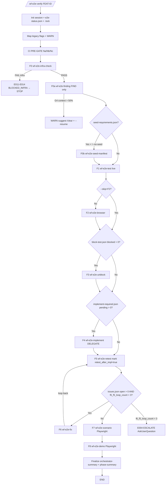

# 03 — Phase Routing

> **Mục đích file:** 11-step pipeline (F0/F0a/F0b/F1-F8) + Mermaid flow + conditional skip rules + anti-loop counters + sub-skill spawn pattern.

---

## 1. Pipeline 11 steps

| Step | Sub-skill | Mandatory? | Phase mapping | Output |
|------|-----------|-----------|---------------|--------|
| **F0** | `wf-e2e-infra-check` | YES (never skip) | Infra validation trước pipeline | `infra-blockers.json` |
| **F0a** | `wf-e2e-finding` | YES (never skip) | FIND only: Business+DB+API+UI mapping | `findings/` 8 files + 4 SSOT JSONs rỗng |
| **F0b** | `wf-e2e-seed-manifest` | Conditional (`seed-requirements.json` tồn tại AND `!--no-seed`) | Seed data manifest | seed manifest |
| **F1** | `wf-e2e-test` | YES | Live test code-based: DB+API+UI+Integration | db/api/ui/integration test reports, SSOT JSONs |
| **F2** | `wf-e2e-browser` | Default ON (skip với `--skip=F2`) | Browser pre-scan + execute | `screenshots/browser-*.png`, `browser-test-report.md` |
| **F3** | `wf-e2e-unblock` | Conditional (`block-test.json` có blocked entries) | Unblock blocked tests (Groups 1+2+4) | `unblock-report.md` |
| **F4** | `wf-e2e-implement` | Conditional (`implement-required.json` có pending) | Delegate `wf-implement-feature` | `impl-log.json` |
| **F5** | `wf-e2e-retest` | YES (sau F4 hoặc PENDING markers) | Retest sau fix/implement | `retest-log.md` |
| **F6** | `wf-e2e-fix` | Conditional (`issues.json` có open + `f6_f5_loop_count < 3`) | Fix loop (continuous, max 3 retry/issue) | `fix-log.json` |
| **F7** | `wf-e2e-scenario` | Default ON | Playwright `test-scenario.md` execute | `scenario-test-report.md` |
| **F8** | `wf-e2e-demo` | Default ON | Playwright `user-guide.md` demo | `demo-report.md` |

---

## 2. Flow diagram



---

## 3. Conditional skip rules

```
After F1+F2:
  IF block-test.json blocked > 0 → run F3
  ELSE skip F3 (skip_reason='block-test empty')

After F3:
  IF implement-required.json pending > 0 → run F4
  ELSE skip F4 (skip_reason='implement-required empty')

After F4:
  MUST run F5 (mark retest_after_impl=true)

After F5:
  IF issues.json open > 0 AND f6_f5_loop_count < 3 → run F6 → loop back to F5
  ELSE proceed F7

F7 mandatory (live browser BẮT BUỘC, auto-start)
F8 mandatory (live browser BẮT BUỘC, auto-start)
```

**Explicit skip:** `--skip=F2,F3,F4,F6,F7,F8` user opt-out per step. `--skip=F0` hoặc `--skip=F0a` → ERROR E006.

---

## 4. Anti-loop counters

| Counter | Threshold | Action khi đạt threshold |
|---------|-----------|--------------------------|
| `f6_f5_loop_count` | 3 | ESCALATE E004 + AskUserQuestion (Continue/Skip/Cancel). Mark issue `status=still_fail` |
| `f3_f2_loop_count` | 2 | ESCALATE — F3 không fix được block sau 2 vòng |

Counters tracked trong `e2e-status.json.anti_loop.{counter}`.

---

## 5. Sub-skill spawn pattern (orchestrator)

Mỗi sub-skill spawn theo pattern (delegate trong `procedures/orchestrate.md`):

```bash
# Spawn F1 wf-e2e-test
Agent(
  description="Run F1 wf-e2e-test for $FEAT_ID",
  subagent_type="claude",  # generic skill executor
  prompt="""
Bạn là sub-skill executor cho wf-e2e-verify orchestrator.

Task: Read .claude/skills/workflow/wf-e2e-test/SKILL.md và thực thi đầy đủ.

Session context:
  - SESSION_DIR=$SESSION_DIR
  - FEAT_ID=$FEAT_ID
  - --auto=${AUTO_FLAG}

CI context: $CI_CONTEXT

Output contract:
  - findings/ 8 files (consume F0a)
  - outputs/ (test-scenario.md, user-guide.md skeleton)
  - 4 SSOT JSONs APPEND (issues, block-test, implement-required, manual)

Ownership: F1 KHÔNG ghi vào e2e-status.json (orchestrator owns).

Completion: POST-VERIFY db/api/ui/integration test reports tồn tại.
"""
)

# POST-VERIFY
RESULT=$(bash .claude/scripts/wf-e2e-verify/postverify-step.sh F1)
IF RESULT == "FAIL":
  RETRY (max 3, CORE-034)
  → escalate AskUserQuestion
```

---

## 6. POST-VERIFY per step

Sau mỗi sub-skill complete, orchestrator chạy POST-VERIFY (4 tier):

| Tier | Check | Tool |
|------|-------|------|
| T1 | `e2e-status.json.steps.F{N}.status = "completed"` | jq |
| T2 | Outputs declared trong sub-skill `_contract.json` tồn tại | bash test -f |
| T3 | Schema validate (jq) cho JSON outputs | jq -e |
| T4 | Cross-ref (vd F1 produces 12 findings, F2 verifies test-scenario.md format) | bash |

Fail → re-spawn sub-skill x1 (max 3 retries CORE-034) → escalate AskUserQuestion.

---

## 7. Cross-phase data — Pipeline state SSOT

File `$SESSION_DIR/e2e-status.json` (chỉ orchestrator write, sub-skills READ-only):

```json
{
  "$schema": "e2e-status-v1",
  "session_id": "FEAT-EW-CRM-001-20260513-1200",
  "feat_id": "FEAT-EW-CRM-001",
  "started_at": "2026-05-13T12:00:00+07:00",
  "current_step": "F4",
  "overall_status": "running | success | partial | failed",
  "steps": {
    "F0": { "status": "completed", "duration_ms": 5000, "outputs": ["infra-blockers.json"] },
    "F0a": { "status": "completed", "duration_ms": 180000, "outputs": ["findings/", "..."] },
    "F0b": { "status": "skipped", "skip_reason": "no seed-requirements.json" },
    "F1": { "status": "completed", "duration_ms": 1500000 },
    "F2": { "status": "completed", "duration_ms": 720000 },
    "F3": { "status": "completed", "duration_ms": 300000 },
    "F4": { "status": "running", "started_at": "..." },
    "F5": { "status": "pending" },
    "F6": { "status": "pending" },
    "F7": { "status": "pending" },
    "F8": { "status": "pending" }
  },
  "anti_loop": { "f6_f5_loop_count": 0, "f3_f2_loop_count": 0 },
  "legacy_flags_used": [
    "--parallel-safe deprecated, always enabled",
    "--cross-module deprecated, always enabled"
  ],
  "summary": null
}
```

**Update rule:** atomic write tmp + mv. Chỉ orchestrator write. Sub-skills READ-only.

---

## 8. Procedure file routing (CORE-032)

| Step | Procedure | Description |
|------|-----------|-------------|
| **Init** | `_shared.md` §init | Resolve session, create e2e-status.json, acquire .lock, parse flags |
| **Legacy Flag Mapping** | `legacy-flags.md` | Detect + map legacy flags + WARN |
| **F0** | `phase0-infra-check.md` | Inline orchestration F0 (infra validation) |
| **F0b** | `phase1.5-seed-manifest.md` | Inline orchestration F0b (conditional seed) |
| **Main Orchestration** | `orchestrate.md` | Spawn F1-F8 sequential với skip-rules |
| **Skip Rules** | `skip-rules.md` | Conditional logic cho F3/F4/F6 |
| **Resume/Status** | `resume-status.md` | --resume + --status handlers |

`_shared.md` KHÔNG load standalone — chỉ tham chiếu section khi cần.

---

## 9. Liên kết

- Procedures structure: [07-procedures-structure.md](07-procedures-structure.md)
- File contract: [04-file-contract.md](04-file-contract.md)
- Pattern: [`../../03-design-patterns/01-lazy-load-procedures.md`](../../03-design-patterns/01-lazy-load-procedures.md)
- Pattern: [`../../03-design-patterns/07-playwright-3-modes.md`](../../03-design-patterns/07-playwright-3-modes.md) — F2/F5/F7/F8 mode dispatch
- Pattern: [`../../03-design-patterns/09-multi-session-locking.md`](../../03-design-patterns/09-multi-session-locking.md) — Protocol 22 cross-session lock
