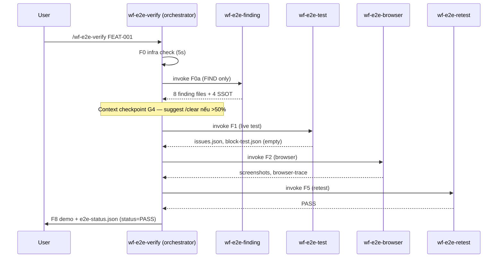
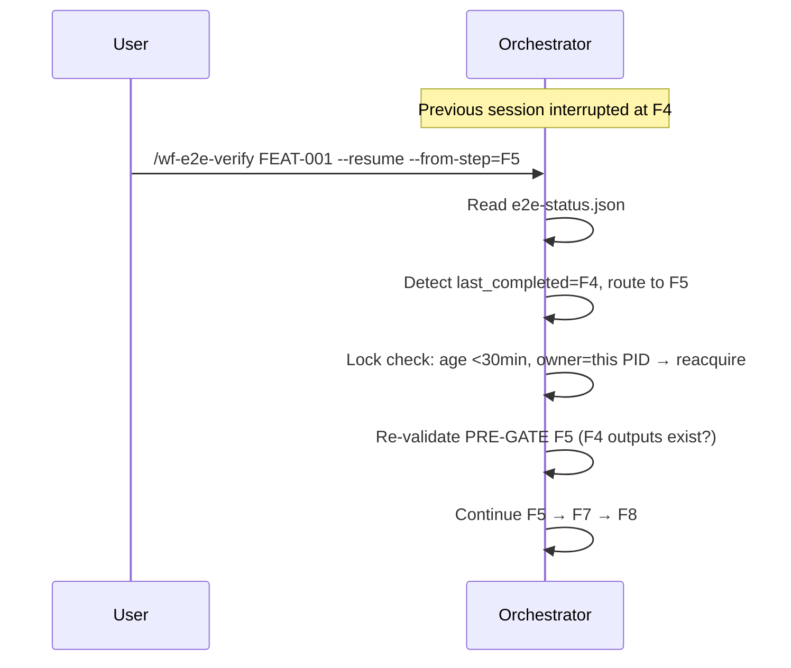

# 08 — User Scenarios & Solutions

> **Mục đích file:** Đặc tả user scenarios + UX flows cho orchestrator skill `wf-e2e-verify`. Reviewer dùng để verify UX quality, contributor dùng để hiểu trải nghiệm người dùng cuối.

---

## 1. Personas

| Persona | Skill level | Pain point chính | Cần skill cung cấp |
|---------|------------|-----------------|---------------------|
| **PO/BA non-coder** | Beginner | Cần demo feature cho khách hàng | F8 demo output dễ hiểu, screenshot đầy đủ |
| **Dev junior** | Intermediate | Lo sợ regression khi merge | Auto detect block-test, suggest fix |
| **Dev senior** | Expert | Cần debug nhanh khi E2E fail | F2 browser trace + network log + console errors |
| **QA Lead** | Expert | Cần baseline test scenarios | F7 scenarios reuse được |
| **DevOps/SRE** | Expert | Cần CI integration | `--no-playwright` degrade mode, exit code chuẩn |

---

## 2. Top scenarios

### S1 — E2E test 1 feature mới merge (Dev junior)

**Goal:** Verify feature `FEAT-CRM-CUST-001` hoạt động end-to-end sau khi merge code.

**Steps:**
1. User: `/wf-e2e-verify FEAT-CRM-CUST-001`
2. Skill F0 infra check (5s) → F0a finding (60s) → F0b seed (30s) → F1 test (3-5 min) → F2 browser (5-8 min) → F5 retest (2 min) → F7 scenario (1 min) → F8 demo (1 min)
3. Output: `e2e-status.json` PASS, screenshots, demo file

**Expected outcome:**
- Total time: 12-18 min
- Tất cả 8 steps PASS
- Screenshots cho từng key UI state
- F8 demo file viết tiếng Việt

### S2 — Retest sau fix bug (Dev senior)

**Goal:** Sau khi fix bug từ E2E session trước, chỉ cần re-run F2-F5.

**Steps:**
1. Original session ID: `2026-05-15-FEAT-CRM-CUST-001-01`
2. Fix code → commit
3. `/wf-e2e-verify FEAT-CRM-CUST-001 --resume --from-step=F5`
4. Skill skip F0-F4, chỉ chạy F5 retest

**Expected outcome:**
- Total time: 3-5 min (vs 15+ min full run)
- F5 retest pass → done
- Nếu F5 vẫn fail → suggest F6 fix loop

### S3 — Cross-module dependency detection (Dev senior + Architect)

**Goal:** Test feature có dependency với module khác — verify không break cross-module flows.

**Steps:**
1. `/wf-e2e-verify FEAT-CRM-CUST-001` (cross-module ON by default)
2. F0a finding detect REQ-INVOICING-005 reference từ FEAT-CRM-CUST-001
3. F1 test cross-module flow Customer → Invoice
4. F2 browser test full Customer-Create → Invoice-Generate happy path

**Expected outcome:**
- `cross-module-gaps.json` non-empty
- F2 browser test cover cross-module workflow
- Nếu cross-module break → CRITICAL severity, escalate

### S4 — CI cron job (DevOps/SRE)

**Goal:** Cron weekly chạy E2E cho top 10 critical features, gửi Slack report.

**Steps:**
1. CI: `for FEAT in $(jq -r '.features[] | select(.priority=="must-have") | .id' registry.json | head -10); do
     /wf-e2e-verify $FEAT --no-playwright --strict-evidence
   done`
2. Skill chạy degrade mode (no Playwright, dùng infrastructure check + API contract validation)
3. Output: per-feature `e2e-status.json` parse → Slack message

**Expected outcome:**
- Total: 30-60 min cho 10 features (parallel via wf-e2e-batch)
- Status="degraded" thay vì "skipped" cho F2 (v8.0.0 spec)
- Exit code 0 (PASS) / 1 (DEGRADED) / 2 (FAIL)

### S5 — Auto fix loop (--auto flag)

**Goal:** Trial run với expert dispatch tự động khi block-test detected.

**Steps:**
1. `/wf-e2e-verify FEAT-NEW-001 --auto`
2. F1 produces `block-test.json` → F3 unblock dispatch expert (frontend-developer / backend / devops tự detect)
3. Expert agent fix block → F5 retest
4. Loop max 3 iterations (anti-loop per severity: CRITICAL=5, HIGH=4, MEDIUM=3, LOW=2)

**Expected outcome:**
- Auto-fix pass → continue F7-F8
- Hết budget → ESCALATE AskUserQuestion
- Mọi auto-fix log đầy đủ trong `auto-fix-ledger.json`

### S6 — Concurrent 2 sessions same FEAT (Dev A + Dev B)

**Goal:** 2 dev test cùng FEAT-ID — phát hiện và xử lý conflict.

**Steps:**
1. Dev A: `/wf-e2e-verify FEAT-001` → lock acquired
2. Dev B: `/wf-e2e-verify FEAT-001` → detect lock conflict
3. Skill (Dev B) ESCALATE: "Session đang chạy bởi Dev A từ {timestamp}. Wait/Cancel/Force?"
4. Dev B chọn Cancel

**Expected outcome:**
- KHÔNG crash, KHÔNG corruption
- Lock heartbeat check: nếu Dev A's session stale >30 min → auto-release
- Force option có CDG (yêu cầu user xác nhận)

---

## 3. Flow diagrams

### Sequence: Standard happy path (S1)

### Sequence: Resume after interrupt (S2)

---

## 4. Error recovery scenarios

| Scenario | Detection | Recovery flow |
|----------|-----------|---------------|
| Lock stale (>30 min) | Heartbeat check ở F0 | Auto-release + reacquire |
| F2 browser session crash | Playwright timeout 5 min | Retry x2, sau đó DEGRADE |
| F1 produces block-test.json | F1 POST-GATE detect | Spawn F3 unblock (auto if `--auto`) |
| F4 implement không pass review | wf-implement-feature Phase 4 fail | ESCALATE — quay về F1 hoặc cancel |
| Context budget >90% | Budget check sau mỗi F-step | FORCE STOP → suggest /clear + --resume |
| Cross-module sub-skill missing | F0a check skill exists | WARN, skip cross-module check |
| `--no-playwright` flag | F2 PRE-GATE detect | DEGRADE mode (status="degraded"), không skip |

---

## 5. UX heuristics

### Output format quy tắc

| Element | Quy tắc |
|---------|--------|
| Phase report (F{x}-report.md) | Tiếng Việt, ≤15 dòng (CORE-028) |
| Progress | Inline `[F{x}/F8] {sub-skill name} running...` mỗi 60s |
| Severity | CRITICAL=block, HIGH=warn, MEDIUM=note, LOW=info |
| Exit code | 0=PASS, 1=DEGRADED (degraded mode), 2=FAIL, 3=BLOCKED |
| Screenshots | Auto save vào `$SESSION_DIR/F2/screenshots/{step}-{state}.png` |
| User guide | F8 demo viết tiếng Việt cho non-tech, screenshot inline |

### Anti-patterns (KHÔNG làm)

❌ **Skip F0a vì lười** — F1 consume F0a output, skip → E0xx fail
❌ **F-step modify orchestrator state** — chỉ orchestrator ghi `e2e-status.json`
❌ **Silent long-running** — F2 browser >2 min không có progress → log inline
❌ **Force overwrite session** — `--force` phải qua CDG xác nhận
❌ **Stack trace cho user** — convert sang tiếng Việt friendly với ID lookup

---

## 6. Liên kết

- ADR cho orchestrator decisions: [`08-tradeoffs-adr.md`](08-tradeoffs-adr.md)
- Sub-skill registry: [`agent-prompt.md`](agent-prompt.md) §1
- CDG protocol: [`../../03-design-patterns/10-cdg-gate.md`](../../03-design-patterns/10-cdg-gate.md)
- Phase reporting standard: [`../../02-standards/02-skill-standard.md`](../../02-standards/02-skill-standard.md) §6
- Canonical template: [`../_template/08-user-scenarios.alt.md`](../_template/08-user-scenarios.alt.md)
