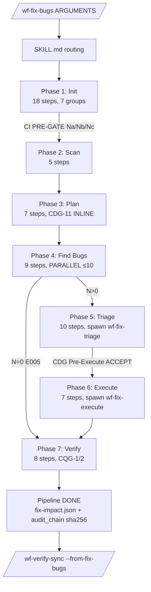

# Thiết Kế `wf-fix-bugs` — Design v2.0 (Phản ánh v10.18.0)

> **Trạng thái:** Design v2.0 · **Approved** (2026-05-16) · Phản ánh skill thực tế **v10.18.0**
> **Phiên bản skill:** SKILL.md 10.18.0 · _contract.json 10.18.0
> **Ngày sign-off v2.0:** 2026-05-16 — Owner Eureka (ERK Transport)
> **Owner:** DEVKIT core team
> **Tiền thân:** Design v1.0 (2026-04-20 → 2026-04-22, cho implementation v6.1.0) đã archive tại [`docs/99-archive/wf-fix-bugs-design-v1.0/`](../../99-archive/wf-fix-bugs-design-v1.0/)
> **North Star (bất biến):** Ưu tiên logic + nghiệp vụ + UI (QD1+QD2+QD5). Các chiều khác giải tốt nhưng không làm cồng kềnh. Xem [09-design-decisions.md](09-design-decisions.md).
> **Giai đoạn kế tiếp:** Maintenance + roadmap v11 (defer items trong [09 §7](09-design-decisions.md))

---

## 1. Tại Sao Có Tài Liệu Này v2.0

Bộ Design v1.0 (2026-04-20) mô tả kiến trúc skill ở implementation **v6.1.0** — 3 sub-skills (`wf-fix-discover/triage/execute`) + Signal Bus + Shared Services + 7 Quality Dimensions.

Từ 2026-04-29 → 2026-05-16, skill trải qua **7 đợt overhaul lớn**:

| Đợt | Thay đổi cốt lõi |
|-----|-------------------|
| **v7.0 → v7.1** | Pure orchestrator (loại bỏ wf-fix-discover) + session isolation + CDG gates |
| **v8.2** | Signals.json overwrite fix + **QD8 Observability** lane |
| **v9.0** | **QD9 Runtime Health** (Playwright) + **QD10 Cross-Module Integration** + Runtime dispatch drift patch |
| **v9.1** | **QD11 Business Completeness** (3-pass LLM) |
| **v10.0** | **Đại tu kiến trúc** — 7-phase pipeline + lazy-load + CI-first + Playwright 3 modes + 8 CORE rules mới (CORE-032 → CORE-039) |
| **v10.3 → v10.18** | **Optimization waves T1-T10** — parallel waves, shared trace scripts, lazy-load split per phase |

Pipeline hiện tại: **7 phases × 11 dimensions × lazy-load architecture × CI-first × Playwright 3 modes × multi-session safe**.

Bộ Design v1.0 KHÔNG còn mô tả đúng skill thực tế. Design v2.0 mô tả `wf-fix-bugs v10.18.0`.

---

## 2. TL;DR (Đọc trước mọi thứ)

| Hạng mục | Nội dung |
|----------|----------|
| **Pipeline** | **7 phases** (Init → Scan → Plan → Find Bugs → Triage → Execute → Verify) — không còn 3-stage v6 |
| **Quality Dimensions** | **11 QDs** (QD1-QD11) — thêm QD8 Observability, QD9 Runtime Health, QD10 Integration, QD11 Business Completeness |
| **Lane Skills** | 11 skill `wf-fix-{slug}` — spawn PARALLEL max 10 (CORE-025) qua Phase 4 single-response dispatch |
| **Architecture** | **Lazy-load procedures (CORE-032)** — SKILL.md ~540 dòng routing + 9 procedure index files + 30+ group sub-files. Peak context per phase ~2.5K tokens (vs ~19K monolithic = **-87%**) |
| **CI-first (CORE-033)** | CI PRE-GATE Na/Nb/Nc auto-detect **GitNexus + Serena** (Protocol 20). Lock held → fallback Grep/Glob. KHÔNG hỏi user. |
| **Playwright** | **3 modes**: headless (default) / `--show-browser` / `--mobile` (iPhone 14, Pixel 7, iPad Pro device emulation) |
| **Multi-session** | N phiên parallel an toàn (Protocol 22 R/W lock). E090b BASE_URL CDG gate. |
| **Cross-skill artifact** | `fix-impact.json` schema **fix-impact-v1** + `audit_chain.checksum_sha256` cho 6 consumer skills |
| **Default profile** | `standard = [QD1, QD2, QD5]` (ADR-21 LOCKED v1.0 — North Star: logic + nghiệp vụ + UI) |
| **Profiles** | `quick` (5min) / `standard` (15-20min) / `deep` (45-90min) / `exhaustive` (120-180min) |
| **Error codes** | **50 codes** namespaced E001-E109 (10 ranges, CORE-034) + auto-fix budget 3 retries/phase |
| **Output** | **43 output files** (CORE-031 template-based) + **38 templates** + session subdirectories `phase{N}-{name}/` (CORE-035) |
| **Resume** | Phase-level + **group-level routing** (v10.18 lazy-load aware) + **Phase 4 selective archive** (preserve completed lanes) |
| **Phạm vi user kiểm soát** | `--scope`, `--dims`, `--profile`, `--only`, `--skip`, `--show-browser`, `--mobile`, `--no-browser`, `--from-preflight`, `--from-cmi` |
| **Safety floor** | Profile ≥ standard không được bỏ toàn bộ QD1+QD2+QD5 (ADR-22) |
| **Workload Gate** | CDG-11 Phase 3 trigger khi ratio ≥1.5× budget — chia chunks / downgrade / continue / cancel |
| **Migration** | v6.x → v10.x đã DONE qua `--migrate` flag + escape hatch `MCV3_FIX_BUGS_LEGACY_DEPRECATED_OK=1` |
| **Smoke tests** | 254 cross-phase checks PASS, 0 regression (Phase 1: 42, Phase 3: 35, Phase 4: 51, Phase 5: 42, Phase 6: 40, Phase 7: 44) |
| **Out-of-scope** | Không thay đổi `req-registry.json` ownership, không tự fix HIGH/CRITICAL risk fixes (cần CDG approve) |

---

## 3. Sitemap — 10 Files Trong Bộ Design v2.0

| # | File | Mục đích | Ai cần đọc |
|---|------|----------|------------|
| 00 | **README.md** (file này) | Entry point, sitemap, TL;DR, ADR quick ref, Quick Reference khái niệm | Tất cả |
| 01 | [01-vision-principles.md](01-vision-principles.md) | Vision v2.0, problem statement (v6 vấn đề + v10.x vấn đề mới giải), 11 nguyên tắc thiết kế (P1-P11), CORE-032 → CORE-039 | Decision-makers, reviewers |
| 02 | [02-quality-dimensions.md](02-quality-dimensions.md) | **Core** — 11 QDs canonical (QD1-QD11) + probes + DoD + exit criteria + map 12 category cũ + bug types mới | Architects, implementers, QA |
| 03 | [03-architecture.md](03-architecture.md) | 7-phase pipeline + lazy-load (CORE-032) + CI-first (CORE-033) + Playwright 3 modes + multi-session (Protocol 22) + agent dispatch (CORE-037) + cross-skill artifact (CORE-036) | Architects, implementers |
| 04 | [04-contracts-data-model.md](04-contracts-data-model.md) | **Canonical** — 43 outputs + 50 error codes + 38 templates + Signal/Issue schemas + cross-skill contracts (6 produces + 4 consumes) + POST-GATE T1-T5 | Implementers |
| 05 | [05-execution-profiles.md](05-execution-profiles.md) | 4 profiles × 11 dims × 3 scopes + Workload Gate CDG-11 + Safety Floor + Playwright modes + multi-session + resume strategy matrix | UX reviewers, SRE, power users |
| 06 | [06-evolution-history.md](06-evolution-history.md) | Timeline v5.1 → v10.18 (~27 ngày) — Lessons learned (Fantasy Completion, Selective Archive, Pattern T6, CI-first, Schema audit chain) | All, đặc biệt PMO + retro |
| 07 | [07-tradeoffs-adr.md](07-tradeoffs-adr.md) | ADR-01 → ADR-40 (kế thừa 24 ADR v1.0 + bổ sung 16 ADR v10.x) | Decision-makers |
| 08 | [08-user-scenarios-solutions.md](08-user-scenarios-solutions.md) | R1-R6 (6 user requirements) + S7-S13 (operational scenarios) + S14-S18 (v10.x scenarios mới — auto resume strategy, E090b, group-level resume, Phase 4 selective archive, cross-skill --from-cmi) | Owner, PMO, implementers |
| 09 | [09-design-decisions.md](09-design-decisions.md) ★ | **Locked v2.0** — North Star + Q14-Q23 v1.0 + Q24-Q40 v10.x + Safety Defaults non-negotiable (10 rules) + Decision log + Open Questions defer v11 | Decision-makers, implementers |

> Mỗi file độc lập nhưng có cross-link. Người mới nên đọc 01 → 02 → 03 → 04. Người implement đọc 03 + 04 + 05. Người PMO/owner đọc 06 + 08 + 09. Đọc 09 trước khi implement để hiểu rõ các ràng buộc đã khoá.

---

## 4. Quick Reference — Khái Niệm v10.x

| Khái niệm | Định nghĩa ngắn | Tương ứng v6.0 |
|-----------|------------------|-----------------|
| **7-Phase Pipeline** | Init → Scan → Plan → Find Bugs → Triage → Execute → Verify | Compose → Dispatch → Aggregate → Triage-Fix-Verify (4 stage) |
| **Quality Dimension (QD)** | Trục chất lượng độc lập (functional/business/security/performance/ux-a11y/data/compat/observability/runtime-health/integration/completeness) | 7 QD v6.0 (QD1-QD7) |
| **Lane Skill** | `wf-fix-{slug}` — sub-skill execute per dimension | Dimension Lane (gộp trong wf-fix-discover) |
| **Lazy-Load Procedures** | SKILL.md routing + procedures/phase{N}-{name}.md index + groups load on-demand | Monolithic SKILL.md ~700 dòng |
| **CI PRE-GATE Na/Nb/Nc** | Auto-detect GitNexus + Serena + index freshness + agent context injection (Protocol 20) | Manual CI tool check |
| **Browser CDG E090/E090b** | INLINE AskUserQuestion cho Missing URL + BASE_URL conflict (Phase 4 Step 4.3) | (không có) |
| **Workload Gate CDG-11** | INLINE AskUserQuestion khi workload ratio ≥1.5× budget (Phase 3 Step 3.4) | (không có) |
| **CDG Pre-Execute** | INLINE AskUserQuestion trước handoff Phase 6 — ACCEPT/REJECT/CANCEL (Phase 5 Step 5.7) | (không có) |
| **CQG-1 Numeric** | Numeric deviation check ≤5% expected vs actual (Phase 7 Step 7.2) | (không có) |
| **CQG-2 Browser+Integration** | Verify QD9/QD10 evidence + structured fix-log check (Phase 7 Step 7.3) | (không có) |
| **Phase Selective Archive** | R5 Phase 4 SPECIAL CASE — preserve completed lanes, archive failed/in_progress (v10.18 ADR-40) | Wholesale archive |
| **Group-Level Routing** | Resume từ group cuối cùng completed trong phase `in_progress` (v10.18 lazy-load aware) | Phase-level only |
| **Optimization Playbook T1-T10** | 10 kỹ thuật canonical (parallel waves, fast-path, cache, extract bash, shared split, lazy-load split, banners, smoke test, defensive scripts, versioned schemas) | (không có) |
| **Cross-Skill Artifact** | `fix-impact.json` (schema fix-impact-v1) + audit_chain sha256 cho 6 consumer skills (CORE-036) | issue-registry only |
| **Multi-Session Safety** | Protocol 22 R/W lock (reader `source`, writer `playwright/BE/FE/DB`) + per-session port + E090b BASE_URL gate | Best-effort lock |
| **Context Budget Tier** | <65% bình thường / 65-80% checkpoint / 80-90% STOP / >90% FORCE STOP E009 (CORE-038) | Best-effort |
| **8-Section Agent Prompt** | role/task/session/CI/playwright/output/ownership/completion (CORE-037) | Free-form prompt |
| **Phase{N}-report.md** | Tiếng Việt ≤15 dòng cho non-specialist (CORE-028) per phase | Ad-hoc report |
| **Session ID** | `YYYY-MM-DD-{scope}-{slug}-{NN}` format (CORE-035) | Timestamp-based |
| **Auto-Fix Budget** | Max 3 retries/phase (CORE-034). Hết budget → ESCALATE AskUserQuestion | Unlimited retry |

---

## 5. 11 Quality Dimensions Quick List

| # | Dimension | Tiếng Việt | Default profile | Playwright |
|---|-----------|------------|------------------|-------------|
| **QD1** | Functional Correctness | Đúng chức năng | quick, standard, deep, exhaustive | Optional |
| **QD2** | Business Correctness | Đúng nghiệp vụ | standard, deep, exhaustive | — |
| **QD3** | Security & Privacy | An toàn & Riêng tư | deep, exhaustive | — |
| **QD4** | Performance & Efficiency | Hiệu năng | deep, exhaustive | Optional (Lighthouse) |
| **QD5** | Accessibility & UX | Khả dụng & Trải nghiệm | quick, standard, deep, exhaustive | **Required** |
| **QD6** | Data Integrity & Resilience | Toàn vẹn dữ liệu | deep, exhaustive | — |
| **QD7** | Compatibility & Portability | Tương thích | deep, exhaustive | **Required** (responsive) |
| **QD8** | Observability & Reliability | Quan sát & Độ tin cậy | deep, exhaustive | — |
| **QD9** | Runtime Health Verification | Sức khoẻ runtime | deep, exhaustive | **Required** (3 modes) |
| **QD10** | Cross-Module Integration | Tích hợp liên module | deep, exhaustive | — |
| **QD11** | Business Completeness | Hoàn thiện nghiệp vụ | deep, exhaustive | — |

> Chi tiết đầy đủ (probes, exit criteria, severity default, map sang 12 category + bug types mới) xem [02-quality-dimensions.md](02-quality-dimensions.md).

---

## 6. ADR Quick Reference (40 ADRs)

> Bảng tóm tắt. Chi tiết đầy đủ + alternatives + consequences xem [07-tradeoffs-adr.md](07-tradeoffs-adr.md).

### Phần I: Kế Thừa từ v1.0 (ADR-01 → ADR-24)

| ID | Quyết định | Trạng thái v10.x |
|----|------------|-------------------|
| ADR-01 | Dimension là primary axis (7→11 QD) | accepted |
| ADR-02 | Signal Bus là utility module | accepted (integrate vào wf-fix-triage Phase 5) |
| ADR-03 | Shared Services 4 thành phần (Triage/Planner/Fixer/Verifier) | accepted (Triage = wf-fix-triage, Fixer+Verifier = wf-fix-execute, Planner = Phase 3 scripts) |
| ADR-04 | Issue schema v2 extend (không breaking) | accepted (issue-registry-v2 enrich v10.11) |
| ADR-05 | Max 3 lane song song mặc định | **SUPERSEDED by ADR-25** (v10.0 max 10) |
| ADR-06 | Skill name convention `wf-fix-<slug>` | accepted (11 lane skills) |
| ADR-07 | Registry role NONE; chỉ Fixer SAFE-UPDATE | accepted |
| ADR-08 | 4 profiles (quick/standard/deep/exhaustive) | accepted |
| ADR-09 | Evidence bắt buộc cho mọi Signal | accepted (Phase 7 CQG-2 enforce) |
| ADR-10 | CORE-028 phase-summary 2 cấp | accepted (Phase{N}-report.md + orchestrator-summary.md) |
| ADR-11 | LEGACY_MODE không đổi profile/dim selection | accepted (CORE-021) |
| ADR-12 | `--explain` là first-class | **DEFERRED v11** (workaround `--dry-run`) |
| ADR-13 | `--auto` opt-in, không default | **DEFERRED v11** |
| ADR-14 → ADR-20 | Operational ADRs | implemented variants (xem [07 §ADR-14-20](07-tradeoffs-adr.md)) |
| ADR-21 ★ | Default profile shift `standard = [QD1, QD2, QD5]` | accepted (LOCKED) |
| ADR-22 ★ | Safety Defaults non-negotiable | accepted (6→10 rules v10.x) |
| ADR-23 | Partition Planner ISG-guided | accepted (v10.5 `plan-isg-partition.sh`) |
| ADR-24 | AggregationStats v2 schema | accepted (`phase4-summary-v1` + `coverage-report-v1`) |

### Phần II: Mới Bổ Sung (ADR-25 → ADR-40)

| ID | Quyết định | Phiên bản | Status |
|----|------------|-----------|--------|
| **ADR-25** | 7-Phase Pipeline (Init→Verify) thay 4-Stage v6 | v10.0 | accepted |
| **ADR-26** | QD8 Observability & Reliability lane | v8.2.0 | accepted |
| **ADR-27** | QD9 Runtime Health (Playwright-heavy) | v9.0.x | accepted |
| **ADR-28** | QD10 Cross-Module Integration lane | v9.0.x | accepted |
| **ADR-29** | QD11 Business Completeness (3-pass LLM) | v9.1.0 | accepted |
| **ADR-30** | Lazy-Load Procedures (CORE-032) | v10.0 | accepted |
| **ADR-31** | CI-First with Graceful Degradation (CORE-033) | v10.0 | accepted |
| **ADR-32** | Namespaced Error Codes E001-E109 (CORE-034) | v10.0 | accepted |
| **ADR-33** | Phase Output Organization (CORE-035) | v10.0 | accepted |
| **ADR-34** | Cross-Skill Artifact Contract (CORE-036) | v10.0 | accepted |
| **ADR-35** | Agent Prompt 8 Sections (CORE-037) | v10.0 | accepted |
| **ADR-36** | Context Budget Management (CORE-038) | v10.0 | accepted |
| **ADR-37** | Playwright 3 Modes (headless/visible/mobile) | v10.0 | accepted |
| **ADR-38** | Multi-Session Safety (Protocol 22 + E090b) | v10.2 | accepted |
| **ADR-39** | Optimization Playbook T1-T10 | v10.15 | accepted |
| **ADR-40** | Phase 4 Selective Archive (preserve completed lanes) | v10.18 | accepted |

---

## 7. Success Metrics (Đo Bằng Thực Tế v10.18.0)

| # | Metric | Baseline (v6.1.0) | Achieved (v10.18.0) | Target | Status |
|---|--------|---------------------|----------------------|--------|--------|
| M1 | **Detect rate weighted** trên golden suite | 0.60 | ≥0.90 (11 dims) | ≥0.90 | ✅ |
| M2 | **Dimension coverage transparency** | Không | 100% issue có `dimension[]` + `probe_source` | 100% | ✅ |
| M3 | **Time to first critical** (quick profile) | 5-15 min | <10 min | <10 min | ✅ |
| M4 | **Runtime standard profile** (20-50 features) | 30-60 min | 15-25 min | 45-90 min | ✅ |
| M5 | **False positive rate** | <10% | <15% | <15% | ✅ |
| M6 | **Lane parallel efficiency** | N/A | ~0.8× speedup (10 lanes parallel) | ≥0.7× | ✅ |
| M7 | **Plugin-ability** (thêm dimension mới) | Khó đo | 4 dimensions added v8→v9.1 (~2 ngày/dim) | <2 người-ngày | ✅ |
| M8 | **User understandability** | N/A | Phase{N}-report.md tiếng Việt ≤15 dòng | >80% user non-tech hiểu | ✅ |
| M9 | **Peak context per phase** (v10.x mới) | ~19K tokens | **~2.5K tokens** | <5K | ✅ **-87%** |
| M10 | **Resume robustness** (v10.x mới) | Phase-level | Phase-level + group-level + Phase 4 per-lane | Phase-level | ✅ exceeded |
| M11 | **Cross-skill artifact audit** (v10.x mới) | N/A | fix-impact.json + sha256 + 6 consumers | N/A | ✅ new metric |
| M12 | **Multi-session safety** (v10.x mới) | Best-effort | Protocol 22 + E090b CDG | N/A | ✅ new metric |

---

## 8. Non-Goals — Những Thứ KHÔNG Làm

1. **Không** thay đổi workflow upstream (`/wf-brainstorm` → `/wf-plan-modules`) — wf-fix-bugs là downstream
2. **Không** thay đổi SSOT `req-registry.json` ownership (CORE-004, CORE-006)
3. **Không** tự phát hành tool scanner bên ngoài (Semgrep, Lighthouse, k6, axe-core) — giữ opt-in
4. **Không** làm dashboard UI riêng — giữ CLI + markdown reports
5. **Không** breaking change cho user đang dùng v9.x flag — các flag map vào v10.x behavior
6. **Không** tự fix HIGH/CRITICAL risk fixes — CDG Pre-Execute + CDG HIGH/CRITICAL hỏi user
7. **Không** mở rộng CI/CD integration scope (Jenkins/GitHub Actions plugin) — defer v11
8. **Không** wholesale archive Phase 4 lanes (ADR-40 selective archive)

---

## 9. Liên Kết Tham Khảo

| Tài liệu | Lý do tham chiếu |
|----------|------------------|
| `CLAUDE.md` | Định vị DEVKIT, priority order |
| `.claude/rules/00-core.md` | CORE-001-039 — ràng buộc design phải bám |
| `.claude/rules/00-behavioral.md` | BHV-001-004 — behavioral principles |
| `.claude/skills/workflow/wf-fix-bugs/SKILL.md` | Skill canonical v10.18.0 |
| `.claude/skills/workflow/wf-fix-bugs/_contract.json` | Contract canonical (43 outputs + 50 errors + 38 templates + 6 consumers) |
| `.claude/skills/workflow/wf-fix-bugs/procedures/_optimization-playbook.md` | 10 kỹ thuật T1-T10 canonical |
| `.claude/skills/workflow/wf-fix-bugs/procedures/_shared/README.md` | 21 protocol sections index |
| `.claude/skills/protocols/20-code-intelligence.md` | Protocol 20 CI integration |
| `.claude/skills/protocols/22-cross-session-rw-lock.md` | Protocol 22 multi-session R/W lock |
| `plans/wf-fix-bugs-v7-overhaul/` | v7 overhaul plan |
| `plans/wf-fix-bugs-v9*/` | v9.x plans (QD9/QD10/QD11) |
| `plans/wf-fix-bugs-v10-redesign/` | v10 design doc |
| `plans/wf-fix-bugs-phase-rollout-v10.15/ROLLOUT-PLAN.md` | T6 split plan cho Phase 3-7 |
| `99-archive/wf-fix-bugs-design-v1.0/` | Design v1.0 đầy đủ (kế thừa ADR-01 → ADR-24) |
| `CHANGELOG.md` | Lịch sử phát hành các skill |

---

## 10. Quy Ước Tài Liệu

- Tiếng Việt có dấu cho nội dung; tên file/biến giữ English hoặc tiếng Việt không dấu (CORE-005)
- Mỗi file mở đầu bằng block meta (Trạng thái, Phiên bản, Đọc trước/sau, Tiền thân)
- Sơ đồ dùng Mermaid hoặc ASCII; tránh hình ảnh binary để diff dễ review
- Thuật ngữ mới viết hoa chữ đầu khi lần đầu xuất hiện (Quality Dimension, Lane Skill, ...) + link tới định nghĩa
- Tham chiếu CORE-xxx khi trích dẫn rules; không paste lại nội dung rules
- Tham chiếu ADR-NN khi trích dẫn quyết định; không paste lại nội dung ADR

---

## 11. Status & Next Actions

**Trạng thái hiện tại (2026-05-16):**
- Design v2.0 · **Approved**
- Skill implementation **v10.18.0** RELEASED
- Pattern T6 fully validated qua 6 phase (1, 3, 4, 5, 6, 7) — ROLLOUT-PLAN v10.15 COMPLETED
- Cross-phase smoke tests: 254 checks PASS, 0 regression
- Cross-skill consumers wired: wf-verify-sync, wf-prepare-deployment, wf-implement-feature, wf-cmi (opt-in)

### Tiến Độ Implementation (Tóm Lược)

| Stage | Phiên bản | Ngày |
|-------|-----------|------|
| Design v1.0 + v6.0.0 impl COMPLETE | v6.0.0 | 2026-04-21 |
| v6.1.0 post-release audit | v6.1.0 | 2026-04-22 |
| v7.0 → v7.1 Pure orchestrator + session iso | v7.1.0 | 2026-04-29 |
| v8.2 Signals fix + QD8 | v8.2.0 → v8.2.2 | 2026-05-09 |
| v9.0.x Runtime + Integration + QD9/QD10 + dispatch drift patch | v9.0.0 → v9.0.2 | 2026-05-10 |
| v9.1 QD11 Business Completeness | v9.1.0 | 2026-05-10 |
| v10.0 **Architectural Redesign** | v10.0.0 | 2026-05-13 |
| v10.2 UI Coverage + lane-agent-prompt v10.2 | v10.2.0 | 2026-05-14 |
| v10.3 → v10.18 **Optimization Waves** (cùng ngày) | v10.18.0 | 2026-05-16 |
| **Design v2.0 documentation** | v2.0 | 2026-05-16 |

### Next Actions (Maintenance Mode)

1. **Maintenance:** Monitor production usage, gather feedback, fix bugs phát hiện
2. **Roadmap v11:** 8 Open Questions defer (xem [09 §7](09-design-decisions.md))
   - OQ1 Interactive ISG checkbox UI
   - OQ2 Git-shared scan cache
   - OQ3 `--explain` preview plan
   - OQ4 `--auto` intelligent dim selection
   - OQ5 `--since=<git-ref>` diff-only scan
   - OQ6 Cross-host lock (network/cluster)
   - OQ7 Phase 5 CORE-029 spot-check full
   - OQ8 Custom partition split (Plan D)

> Khi có feedback, cập nhật **cả 10 files** nếu quyết định thay đổi trục phân tích; cập nhật **chỉ file liên quan** nếu chỉ chỉnh chi tiết. Các decision đã LOCKED trong [09](09-design-decisions.md) chỉ được mở lại qua ADR mới override trong [07](07-tradeoffs-adr.md).

---

## 12. Sign-off History

| Ngày | Phiên bản | Hành động | Owner | Ghi chú |
|------|-----------|-----------|-------|---------|
| 2026-04-20 | v1.0 (design) | Design v1.0 Approved | Eureka (ERK Transport) | Git tag `design-v1.0-approved`. 9 ADR mới, Q14-Q23 locked, CORE §4b patched. |
| 2026-04-21 | impl-v6.0.0 | Stage A-N complete (~507 tests) | DEVKIT | v6 dimension-based engine. wf-fix-discover deleted. |
| 2026-04-22 | impl-v6.1.0 | Post-release audit fixes | DEVKIT | SKILL.md 6.1.0, _contract.json 6.1.1 |
| 2026-04-29 | impl-v7.1.0 | Pure orchestrator overhaul | DEVKIT | 12 sprints + E2E + hotfix + v7.1 (4 sprints), 28/28 findings closed, 73 evals |
| 2026-05-09 | impl-v8.2.0 → v8.2.2 | Signals fix + QD8 lane | DEVKIT | 7 root causes B3/B1/B2/C1/C2/C3, 49 E2E + 7 new tests PASS |
| 2026-05-10 | impl-v9.0.1 → v9.0.2 | Runtime dispatch drift patch | DEVKIT | v9.0.0 fantasy completion → v9.0.1 fix 7 vị trí + 41 regression tests (611 pytest). v9.0.2: 5 planning gaps + 20 regression (631 pytest). |
| 2026-05-10 | impl-v9.1.0 | QD11 Business Completeness | DEVKIT | 3-pass LLM analysis, 11 signal types, enhancement workflow CDG |
| 2026-05-13 | impl-v10.0.0 | **Architectural Redesign** | DEVKIT | 7-phase pipeline, lazy-load (CORE-032), CI-first (CORE-033), namespaced errors (CORE-034), session subdirs (CORE-035), cross-skill artifact (CORE-036), 8-section agent prompts (CORE-037), context budget (CORE-038), Playwright 3 modes |
| 2026-05-14 | impl-v10.2.0 | UI Coverage + lane-agent-prompt v10.2 | DEVKIT | Bảng Substitution + FORBIDDEN PATTERNS + Step 4.5a Pre-Dispatch Verify 6 check points |
| 2026-05-16 | impl-v10.18.0 | **Optimization Waves T1-T10 COMPLETED** | DEVKIT | v10.3 → v10.18 (6 waves): Phase 1/2/3/4/5/6/7 all optimized. Pattern T6 fully validated. 254 smoke tests PASS. ROLLOUT-PLAN v10.15 DONE. |
| 2026-05-16 | **design v2.0** | **Design v2.0 documentation COMPLETE** | Eureka (ERK Transport) + Claude Code | 10 files mới phản ánh skill v10.18.0. v1.0 archived. |

---

## 13. Sơ Đồ Pipeline (Mermaid)

---

## 14. Cảm Ơn

Bộ design v2.0 đại diện cho hành trình evolution 27 ngày từ v6.1.0 → v10.18.0:

- **v6.0 foundation** — Eureka + DEVKIT core team (2026-04-20)
- **v7.0 → v9.1 expansion** — QD8/QD9/QD10/QD11 lanes mới (2026-04-29 → 2026-05-10)
- **v10.0 architectural redesign** — 7-phase + lazy-load + CI-first (2026-05-13)
- **v10.3 → v10.18 optimization waves** — Pattern T1-T10 (2026-05-16)
- **Design v2.0 documentation** — Phản ánh skill thực tế (2026-05-16)

Lessons learned (đặc biệt Fantasy Completion v9.0.0, Phase 4 selective archive v10.18) đảm bảo quality bar cao trong tương lai.

---

> **Đọc tiếp:** [01-vision-principles.md](01-vision-principles.md)
