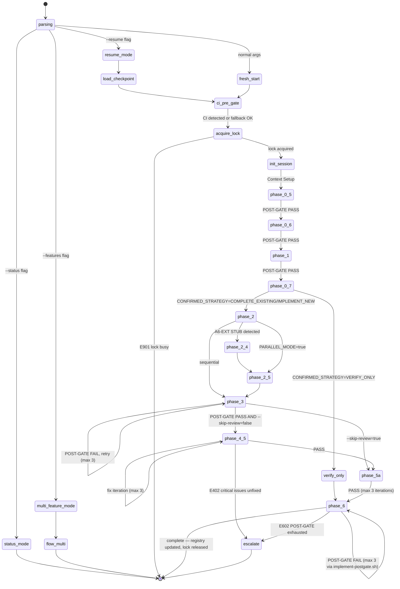

# 03 — Kiến Trúc Skill

> **Mục đích file:** Tả KIẾN TRÚC TỔNG QUAN của skill `wf-implement-feature` — các components cấu thành, dữ liệu chảy ra sao, parallelism ở tầng review, integration points với CI tools và cross-skill artifact. Đọc tiếp [03-phase-routing.md](03-phase-routing.md) để hiểu TRÌNH TỰ phase.
> **Khác với [03-phase-routing.md](03-phase-routing.md):** File này tả "bộ máy" (static structure — components là gì, vai trò gì, dữ liệu đi đâu). File 03-phase-routing tả "luồng" (dynamic execution order — phase nào chạy khi nào, skip điều kiện gì).

---

## 1. Bản Đồ Tổng Thể

```
                        ┌──────────────────────────────────────────────────┐
  /wf-implement-feature │             SKILL.md — LEAN ROUTING HUB          │
  [FEAT-ID | REQ-ID]   │  - Parse args → resolve SCENARIO + PROFILE       │
  [flags]     ────────▶ │  - CI PRE-GATE Na/Nb/Nc (GitNexus/Serena detect) │
                        │  - Acquire per-feature lock                       │
                        │  - Init $SESSION_DIR (system-grouped v5)          │
                        │  - Route → procedure phase{N}-*.md (lazy-load)   │
                        └───────────────┬──────────────────────────────────┘
                                        │
              ┌─────────────────────────┼───────────────────────────────┐
              │                         │                               │
              ▼                         ▼                               ▼
  ┌───────────────────┐     ┌─────────────────────────┐     ┌──────────────────────┐
  │ DETECTION &       │     │  TDD PIPELINE            │     │ REVIEW DISPATCH      │
  │ SAFETY LAYER      │     │  (Phase 3)               │     │ (Phase 4-5)          │
  │                   │     │                          │     │                      │
  │ Phase 0a: Pattern │     │ Developer agent          │     │ code-reviewer        │
  │   scan (patterns  │     │  ↓ Test file FIRST       │     │ qa-lead              │
  │   cache 24h)      │     │  ↓ Source file           │     │ security (nếu        │
  │ Phase 0.5: Legacy │     │  ↓ GATE-13 (tests pass)  │     │   auth/data)         │
  │   mode detect     │     │  ↓ Checkpoint 3.4        │     │ frontend-developer   │
  │ Phase 0.7: Safety │     │  ↓ Decision detect 3.5   │     │   (UI features)      │
  │   gate CORE-020   │     │                          │     │                      │
  └─────────┬─────────┘     └───────────┬─────────────┘     └──────────┬───────────┘
            │                           │                               │
            └───────────────────────────┼───────────────────────────────┘
                                        │
                                        ▼
                        ┌──────────────────────────────────┐
                        │  CROSS-VALIDATION & FINALIZATION │
                        │                                  │
                        │ Phase 5a: Cross-val auto-correct │
                        │  (REQ-ID check, test check,      │
                        │   no placeholders, ≤3 iter)      │
                        │                                  │
                        │ Phase 6: Finalize                │
                        │  (Registry update impl_status,   │
                        │   consumer_hints, phase-summary) │
                        └────────────────┬─────────────────┘
                                         │
                              ┌──────────▼──────────┐
                              │  OUTPUT ARTIFACTS    │
                              │                      │
                              │ Source code + tests  │
                              │ impl-status.json     │
                              │ impl-report.md       │
                              │ phase-summary.md     │
                              │ req-registry.json    │
                              │   (impl_status=done) │
                              └──────────────────────┘
```

---

## 2. Thành Phần (Components)

### 2.1 SKILL.md — Lean Routing Hub

**Vai trò:** Entry point, lean (~600 dòng — CORE-032). KHÔNG chứa execution logic. Chỉ:

1. Parse arguments → xác định `$SCENARIO` (NEW/EXTEND/MODIFY), `$PROFILE` (quick/standard/deep/exhaustive), flags (`--resume`, `--features`, `--parallel`, `--from-fix-bugs`...).
2. Handle inline modes: `--status` → render summary, exit; `--features` → load `flow-multi.md`, exit single flow; `--resume` → load checkpoint.
3. CI PRE-GATE 3-step (Na/Nb/Nc — CORE-033): detect GitNexus/Serena → check index freshness → inject `$CI_CONTEXT`.
4. Acquire per-feature lock (`implement-acquire-lock.sh`) → tránh conflict multi-dev.
5. Khởi tạo `$SESSION_DIR` (system-grouped: `$SYSTEM_SLUG/$FEATURE_SLUG/sessions/{id}/`).
6. Route đến `procedures/phase{N}-*.md` theo thứ tự (lazy-load, mỗi file chỉ đọc khi tới phase).
7. POST-GATE tổng hợp qua `implement-postgate.sh` khi phase 6 hoàn tất.

**KHÔNG làm:**
- KHÔNG nhúng bash script inline (delegate sang `.claude/scripts/wf-implement-feature/`).
- KHÔNG ghi `req-registry.json` trực tiếp (CORE-006 — narrow jq update trong Phase 6).
- KHÔNG đọc lại `error-ledger.json` làm input context (CORE-034 — output-only).
- KHÔNG thực hiện search code, review, hay TDD — tất cả trong procedures.

**File mapping:** `.claude/skills/workflow/wf-implement-feature/SKILL.md`

---

### 2.2 Detection & Safety Layer (Phases 0a / 0.5 / 0.6 / 0.7)

Nhóm 4 procedure file chạy trước khi viết bất kỳ dòng code nào:

| Component | Procedure file | Vai trò chính |
|-----------|----------------|---------------|
| Pattern Scanner | `phase0-existing-analysis.md` | Scan existing code patterns (naming, file_structure, code_style, entity/service/test patterns) → `existing-patterns.json`. Pattern cache per-module per-commit (TTL 24h + git SHA). Chỉ chạy khi `$SCENARIO != "new"` |
| Context Setup | `phase0-5-context-setup.md` | LEGACY_MODE detect (CORE-021: `project-context.md > 500 bytes`) + Decision Registry load (Protocol 12) + constraints list |
| Env Profile Detector | `phase0-6-env-profile.md` | Detect env profile (dev/staging/prod) từ env vars + config files → `$ENV_PROFILE` (v5.1+) |
| Safety Gate | `phase0-7-safety-gate.md` | **CORE-020**: search code hiện tại → AskUserQuestion (VERIFY_ONLY / COMPLETE_EXISTING / IMPLEMENT_NEW). Env Safety Scan 5 patterns E1-E5. LEGACY_MODE → route theo `implementation_strategy` từ task file |

| Trường | Giá trị |
|--------|---------|
| **Input** | `req-registry.json`, task files, `project-context.md`, git index |
| **Output** | `existing-patterns.json`, `$CONFIRMED_STRATEGY`, `$ENV_PROFILE`, `$LEGACY_MODE` |
| **Stateful?** | Có — `impl-status.json` cập nhật sau mỗi sub-phase |
| **Spawn agent?** | Không (Safety Gate chỉ AskUserQuestion) |
| **Idempotent?** | Có — Pattern cache (`existing-patterns.$GIT_SHA.json`) tránh re-scan khi resume |

---

### 2.3 Feature Context Loader (Phase 1)

| Trường | Giá trị |
|--------|---------|
| **Vai trò** | Đọc feature spec từ `phase2-features/[sys]/[mod]/<feat>.md` + digest từ `feature-briefs.json`. Bước 1.10/1.11: consume `fix-impact.json` khi `--from-fix-bugs` để prioritize features có `code_files_modified` trùng `$FEATURE_SLUG` |
| **Input** | `phase2-features/[sys]/[mod]/*.md`, `feature-briefs.json`, `design-input-digest.json`, `fix-impact.json` (conditional) |
| **Output** | `$EXECUTABLE_SPEC` (in-memory digest), `impl-status.json` updated, A6-EXT detect flag |
| **Stateful?** | Có — `$EXECUTABLE_SPEC` được truyền xuống Phase 2 + 3 |
| **Spawn agent?** | Không (Phase 1 multi-feature case spawn 1 feature-orchestrator) |
| **Idempotent?** | Có |

---

### 2.4 TDD Pipeline (Phase 2 / 2.4 / 2.5 / 3)

Nhóm component thực hiện việc lập kế hoạch và viết code theo TDD:

| Component | Procedure file | Vai trò |
|-----------|----------------|---------|
| Task Planner | `phase2-planning.md` | Task breakdown từ A1-A6 sections + complexity derivation + batch plan → `impl-plan.md`, `$TASK_LIST`, `$BATCHES`. Profile resolver (Step 2.0b) |
| Spec Populator | `phase2-4-populate-spec.md` | Spawn architect agent populate A6-EXT khi STUB detected → re-read spec sau populate. Conditional |
| Contract Generator | `phase2-5-contracts.md` | Contract-first generation (parallel mode): shared types/interfaces/DTOs → `contracts.json`. Spawn architect agent. Conditional (`$PARALLEL_MODE == true`) |
| TDD Implementer | `phase3-tdd.md` | **Core của skill**: developer agent viết test file TRƯỚC source file (TDD order check — mtime). Test gate GATE-13 BẮT BUỘC pass. Sequential (quick/standard) hoặc parallel waves (deep/exhaustive). Checkpoint tại 3.4 (per batch). Decision detect tại 3.5 → append `decision-registry.json` |

| Trường | Giá trị |
|--------|---------|
| **Input** | `$EXECUTABLE_SPEC`, `$TASK_LIST`, `$BATCHES`, `existing-patterns.json` (optional), `contracts.json` (parallel mode) |
| **Output** | Source code files, test files, `impl-plan.md`, `checkpoint.json`, `decision-registry.json` (per-feature) |
| **Stateful?** | Có — `checkpoint.json` (per-batch) + `impl-status.json` (per-phase) |
| **Spawn agent?** | Có — `developer` agent (TDD), `architect` agent (populate/contracts). 8-section prompt (CORE-037) |
| **Idempotent?** | Có — checkpoint.json + `--resume` route về `checkpoint.next_action` |

---

### 2.5 Review Dispatcher (Phase 4-5)

Đây là component duy nhất trong skill có **parallelism** thực sự — spawn nhiều review agents đồng thời, mỗi agent có write scope độc lập.

| Trường | Giá trị |
|--------|---------|
| **Vai trò** | Spawn parallel review agents theo profile. Fix iterations max 3 (sequential — tránh conflict). Agent Output Spot-Check (CORE-029) |
| **Input** | Source code + test files từ Phase 3, `profile.txt`, batch metadata |
| **Output** | `code-review.md`, `code-findings.json`, `security-review.md`, `security-findings.json`, `qa-review.md`, `qa-findings.json`, `qa-review-attempt-[N].md` |
| **Stateful?** | Có — review status track trong `impl-status.json.reviews` |
| **Spawn agent?** | Có — xem §4 (bảng agents) |
| **Idempotent?** | Có — attempt counter cho từng agent type, skip nếu review file đã tồn tại |

**Agents spawn per profile:**

| Profile | Agents spawn |
|---------|-------------|
| quick | `code-reviewer` only |
| standard | `code-reviewer` + `qa-lead` |
| deep | `code-reviewer` + `qa-lead` + `security` |
| exhaustive | `code-reviewer` + `qa-lead` + `security` + `a11y-auditor` + `performance-benchmarker` |

**BẮT BUỘC không phụ thuộc profile:** `security` agent tự động spawn khi feature touch `auth/`, `login/`, `payment/`, `kyc/` hoặc pattern code `bcrypt`, `jwt.sign`, `crypto.create*`.

---

### 2.6 Cross-Validation Engine (Phase 5a)

| Trường | Giá trị |
|--------|---------|
| **Vai trò** | Auto-correction loop max 3 iterations. Kiểm tra: REQ-ID comment trong mọi source file, test files tồn tại, tests pass, không còn critical issues chưa fix, không có placeholders (`TODO:`, `FIXME:`, `placeholder`), `impl_status` consistent |
| **Input** | Source code, test files, review findings, `impl-status.json` |
| **Output** | Auto-corrected source files (REQ-ID inject, stub removal), `impl-status.json` updated |
| **Stateful?** | Không (correction idempotent per iteration) |
| **Spawn agent?** | Không (orchestrator tự apply corrections) |
| **Idempotent?** | Có — mỗi iteration verify lại từ đầu |

---

### 2.7 Finalizer (Phase 6)

| Trường | Giá trị |
|--------|---------|
| **Vai trò** | POST-GATE T1→T4 via `implement-postgate.sh`. Registry update `impl_status=done` per REQ-ID (narrow jq — CORE-006). Append `decision-registry.global.json`. Write `phase-summary.md` (CORE-028). Append `implementations-index.jsonl`. Release per-feature lock |
| **Input** | Tất cả outputs từ Phase 0-5a, `impl-status.json` (consumer_hints populated) |
| **Output** | `impl-report.md`, `phase-summary.md` (tiếng Việt), `req-registry.json` (impl_status=done), `decision-registry.global.json` (APPEND), `.history/implementations-index.jsonl` (APPEND), lock released |
| **Stateful?** | Có — cuối cùng update `impl-status.json.status = "completed"` |
| **Spawn agent?** | Không |
| **Idempotent?** | Có — `implement-postgate.sh` check T1→T4 trước khi update registry |

---

### 2.8 Multi-Feature Orchestrator (`flow-multi.md`)

Kích hoạt khi `--features=FEAT-A,FEAT-B,...`. Thay thế single-feature flow, không chạy song song với nó.

| Trường | Giá trị |
|--------|---------|
| **Vai trò** | Build dependency graph từ A7-EXT sections → topo-sort levels → spawn parallel per level (Protocol 7 PAR-09) → aggregate per-feature impl-status → multi-feature report |
| **Input** | Feature IDs, dependency graph từ A7-EXT |
| **Output** | Nhiều `$SYSTEM_SLUG/$FEATURE_SLUG/sessions/{id}/` độc lập, multi-feature report |
| **Stateful?** | Có — mỗi feature có session isolation riêng → 0 race condition |
| **Spawn agent?** | Có — 1 developer pipeline per feature (max 10 concurrent — CORE-025) |
| **Idempotent?** | Có — per-feature lock + system-grouped layout |

---

### 2.9 Cross-Cutting Services (Utilities)

| Service | Mục đích | File |
|---------|----------|------|
| CI Detect | Auto-detect GitNexus/Serena (CORE-033) | `.claude/scripts/ci-detect.sh` |
| CI Freshness Check | Verify index khớp HEAD (4 mức cảnh báo) | `.claude/scripts/ci-freshness-check.sh` |
| Lock Manager | Per-feature lock (PID + heartbeat + stale detect 60min) | `.claude/scripts/wf-implement-feature/implement-acquire-lock.sh` |
| Pattern Cache Resolver | Pattern cache validate + read/write (git SHA invalidation) | `.claude/scripts/wf-implement-feature/implement-cache-resolver.sh` |
| Profile Resolver | Auto-resolve profile từ scope file count | `.claude/scripts/wf-implement-feature/implement-resolve-profile.sh` |
| Atomic Write | Build tmp → validate JSON → mv (CORE-035) | `implement-common.sh` |
| History Index | APPEND-only JSONL audit trail (multi-dev safe) | `.claude/scripts/wf-implement-feature/implement-history-index.sh` |
| POST-GATE Validator | Phase 6 T1→T4 delegated logic | `.claude/scripts/wf-implement-feature/implement-postgate.sh` |
| Migration Chain | v3→v4→v5 idempotent migration | `implement-migrate-v3-to-v4.sh`, `implement-migrate-v4-to-v5.sh` |

---

## 3. Sequence Diagram — Happy Path (Standard Profile, IMPLEMENT_NEW)

```
User ──/wf-implement-feature FEAT-CRM-CUST-001 ──▶ SKILL.md
                                                      │
                                  1. Parse args → SCENARIO=NEW, PROFILE=standard
                                  2. CI PRE-GATE Na (detect) → Nb (freshness) → Nc (inject CI_CONTEXT)
                                  3. Acquire per-feature lock (.locks/crm/customer-management.lock)
                                  4. Init $SESSION_DIR (.mc-data/work/wf-implement-feature/crm/customer-management/sessions/2026-05-16-100000-host1/)
                                  5. Khởi tạo impl-status.json (template → atomic write)
                                      │
                                      ├──▶ [Phase 0.5] Context Setup
                                      │      LEGACY_MODE detect → Decision Registry load
                                      │      POST-GATE → impl-status.json (phase=0.5, COMPLETE)
                                      │
                                      ├──▶ [Phase 0.6] Env Profile
                                      │      ENV_PROFILE=dev
                                      │
                                      ├──▶ [Phase 1] Feature Context
                                      │      Đọc phase2-features/crm/mod-crm/customer-management.md
                                      │      Load feature-briefs.json digest → $EXECUTABLE_SPEC
                                      │      POST-GATE: T1→T4 pass → Phase1-report.md
                                      │
                                      ├──▶ [Phase 0.7] Safety Gate
                                      │      CI-ROUTE: GitNexus impact() search existing code
                                      │      → Không tìm thấy code liên quan
                                      │      → $CONFIRMED_STRATEGY = "IMPLEMENT_NEW"
                                      │
                                      ├──▶ [Phase 2] Planning
                                      │      Profile resolver → profile=standard confirmed
                                      │      Task breakdown từ A1-A6 → impl-plan.md, $BATCHES=[batch-1, batch-2]
                                      │
                                      ├──▶ [Phase 3] TDD (sequential - standard)
                                      │      batch-1:
                                      │        Developer agent → test file TRƯỚC source file
                                      │        GATE-13: tests pass ✅
                                      │        Checkpoint 3.4 → checkpoint.json
                                      │      batch-2:
                                      │        Developer agent → test + source
                                      │        GATE-13: tests pass ✅
                                      │        Decision detect → decision-registry.json
                                      │
                                      ├──▶ [Phase 4-5] Parallel Review
                                      │      ┌──────────────────────────────────────────┐
                                      │      │ code-reviewer agent  │ qa-lead agent     │
                                      │      │ → code-review.md     │ → qa-review.md    │
                                      │      │ → code-findings.json │ → qa-findings.json│
                                      │      └──────────────────────────────────────────┘
                                      │      Aggregate findings → Fix loop max 3 (sequential)
                                      │
                                      ├──▶ [Phase 5a] Cross-Validation
                                      │      REQ-ID check + test check + placeholder check (auto-fix)
                                      │
                                      ├──▶ [Phase 6] Finalize
                                      │      implement-postgate.sh T1→T4
                                      │      Registry update: impl_status=done per REQ-CRM-CUST-001
                                      │      Append decision-registry.global.json
                                      │      Write phase-summary.md (tiếng Việt)
                                      │      Append implementations-index.jsonl
                                      │      Release lock
                                      │
                                      ▼
                              impl-report.md + phase-summary.md
                              + Source code + Tests (tracked trong registry)
```

---

## 4. Parallelism Model

### 4.1 Ai Song Song Với Ai?

| Phân lớp | Song song? | Điều kiện |
|----------|-----------|-----------|
| Phase × Phase (single-feature) | **Không** | Phase sau cần output phase trước (CORE-002) |
| TDD batch × TDD batch (Phase 3) | Có (deep/exhaustive profile) | Write scope tách biệt — mỗi batch viết file riêng (parallel waves) |
| Review agent × Review agent (Phase 4) | **Có** | code-reviewer / qa-lead / security mỗi cái ghi file riêng — 0 conflict |
| Fix iteration × Fix iteration (Phase 5) | **Không** | Fix code cần tuần tự tránh 2 agent ghi đè cùng file |
| Feature × Feature (multi-feature mode) | Có (per dependency level) | Mỗi feature có `$SESSION_DIR` riêng + per-feature lock |
| CI context injection | Một lần | Na/Nb/Nc tại Phase Init, không lặp lại |

### 4.2 Giới Hạn Parallelism

- Phase 4 review: tối đa 3-5 agents/feature (theo profile). Write scope cô lập hoàn toàn — mỗi agent ghi vào `review/code-review.md`, `review/security-review.md`, `review/qa-review.md` (3 path khác nhau).
- Multi-feature: max 10 concurrent per level (CORE-025). Nếu nhiều feature hơn → batch thành waves.
- Phase 3 parallel waves (deep/exhaustive): batches độc lập về file scope, merge sau khi tất cả GATE-13 pass.

### 4.3 Vì Sao Fix Iteration Không Song Song?

- Code fix chạm cùng source file → 2 agent sửa đồng thời gây merge conflict.
- Fix lần 2 cần đọc kết quả fix lần 1 làm input → sequential dependency.
- Max 3 retries là safety budget — sequential dễ trace error hơn parallel.

> Pattern tham khảo: [`../../03-design-patterns/04-parallel-lane-dispatch.md`](../../03-design-patterns/04-parallel-lane-dispatch.md).

---

## 5. Data Flow Chi Tiết

### 5.1 Phase → State Store

```
Phase 0.5 (Context Setup)
  ▼
$SESSION_DIR/impl-status.json         ← phase=0.5, LEGACY_MODE, constraints
  ▼
Phase 1 (Feature Context)
  ▼
$SESSION_DIR/impl-status.json         ← $EXECUTABLE_SPEC digest, cache_hits
  ▼
Phase 0.7 (Safety Gate)
  ▼
$SESSION_DIR/impl-status.json         ← $CONFIRMED_STRATEGY, env safety flags
  ▼
Phase 2 (Planning)
  ▼
$SESSION_DIR/impl-plan.md             ← Task breakdown + batches
$SESSION_DIR/impl-status.json         ← phase=2, $BATCHES, $TASK_LIST
  ▼
Phase 3 (TDD)
  ▼
[source code files]                   ← Ghi thẳng vào project source dir
[test files]                          ← Ghi thẳng vào project test dir
$SESSION_DIR/checkpoint.json          ← Per-batch (3.4)
$SESSION_DIR/decision-registry.json   ← Per-feature decisions
$SESSION_DIR/impl-status.json         ← current_batch, phases_completed
  ▼
Phase 4-5 (Review-Fix)
  ▼
$SESSION_DIR/review/code-review.md
$SESSION_DIR/review/code-findings.json
$SESSION_DIR/review/security-review.md   ← Nếu auth/data feature
$SESSION_DIR/review/qa-review.md
$SESSION_DIR/qa-review-attempt-[N].md
$SESSION_DIR/impl-status.json         ← reviews.code_review=done, etc.
  ▼
Phase 5a (Cross-Validation)
  ▼
[source code files]                   ← REQ-ID inject auto-fix
$SESSION_DIR/impl-status.json         ← crossval_iterations
  ▼
Phase 6 (Finalize)
  ▼
$SESSION_DIR/impl-report.md
$SESSION_DIR/phase-summary.md         ← CORE-028, tiếng Việt, ≤15 dòng
$SESSION_DIR/impl-status.json         ← status=completed, consumer_hints populated
.mc-data/docs/_meta/req-registry.json ← impl_status=done (narrow jq)
.mc-data/docs/_meta/decision-registry.global.json ← APPEND
.mc-data/work/wf-implement-feature/.history/implementations-index.jsonl ← APPEND
```

### 5.2 Cross-Skill Artifacts

Skill này produce artifacts cho downstream qua `_contract.json` (CORE-036):

**Produces for:**

| Skill consumer | Artifact | Schema | Path |
|---------------|---------|--------|------|
| `wf-preflight` | `req-registry.json` (impl_status=done) | `req-registry-v1` | `.mc-data/docs/_meta/req-registry.json` |
| `wf-verify-sync` | `req-registry.json` (impl_status=done) | `req-registry-v1` | `.mc-data/docs/_meta/req-registry.json` |
| `wf-prepare-deployment` | `impl-status.json` (consumer_hints.for_prepare_deployment) | `impl-status-v2` | `$SESSION_DIR/impl-status.json` |
| `wf-fix-bugs` | `impl-status.json` (consumer_hints.for_fix_bugs) | `impl-status-v2` | `$SESSION_DIR/impl-status.json` |
| Future implementations | `decision-registry.global.json` | `decision-registry-v1` | `.mc-data/docs/_meta/decision-registry.global.json` |

**Consumes from:**

| Skill producer | Artifact | Path |
|---------------|---------|------|
| `wf-plan-modules` | Task impl files, dependency graph | `.mc-data/docs/phase5-implementation/tasks/[sys]/[mod]/*-impl.md` |
| `wf-define-features` | Feature spec, briefs | `.mc-data/docs/phase2-features/[sys]/[mod]/*.md`, `feature-briefs.json` |
| `wf-design` | Design digest | `.mc-data/docs/_meta/design-input-digest.json` |
| `wf-brainstorm` | Legacy decisions (CORE-022) | `.mc-data/work/wf-brainstorm/legacy-decisions.json` |
| `wf-legacy-scan` | LEGACY_MODE detect | `.mc-data/work/legacy-scan/project-context.md` |
| `wf-fix-bugs` | Fix impact (v5.2+ `--from-fix-bugs`) | `.mc-data/work/wf-fix-bugs/sessions/$ID/fix-impact.json` |

Artifact `impl-status.json` PHẢI:
- Schema versioned (`impl-status-v2`)
- `audit_chain.source` + `audit_chain.checksum` (sha256 của `req-registry.json` tại thời điểm Phase 6)
- Consumer validate ở PRE-GATE (T1 exists → T2 JSON valid → T3 schema_version)

### 5.3 Checkpoint & Resume

| Layer | Checkpoint File | Khi nào ghi |
|-------|-----------------|-------------|
| Orchestrator | `impl-status.json` | Sau mỗi POST-GATE PASS (atomic write) |
| Phase 3 (TDD) | `checkpoint.json` | Sau mỗi batch hoàn tất (Step 3.4) |
| Review agents | `review/*.json` | Agent tự ghi sau khi hoàn tất |
| Error tracking | `error-ledger.json` | APPEND-only, lazy-init khi có error đầu tiên |

**Resume routing:** `impl-status.json.next_action` xác định điểm vào lại. `checkpoint.json.next_action` xác định batch tiếp theo trong Phase 3.

Stale check: lock age > 60 min → auto-release qua `implement-acquire-lock.sh`.

---

## 6. File Layouts

Section này tả 2 view đối xứng: **SOURCE** (skill code trên disk, ổn định) và **OUTPUT** (artifacts skill tạo ra trong session, dynamic per run).

### 6.1 Source Layout — Skill code trên disk

```
.claude/skills/workflow/wf-implement-feature/
├── SKILL.md                               # Lean routing hub (~600 dòng — CORE-032)
├── _contract.json                         # Cross-skill contract v5.2.0 (CORE-036)
├── RELEASE-NOTES-v4.0.md                  # Release notes v4 (tham khảo)
│
├── procedures/                            # Lazy-load procedures (CORE-032)
│   ├── _shared.md                         # Cross-cutting (state vars, helpers, error codes, protocols refs)
│   ├── phase0-existing-analysis.md        # Phase 0a — Pattern scan (EXTEND/MODIFY)
│   ├── phase0-5-context-setup.md          # Phase 0.5 — LEGACY_MODE + Decision Registry
│   ├── phase0-6-env-profile.md            # Phase 0.6 — Env profile detection (v5.1+)
│   ├── phase1-feature-context.md          # Phase 1 — Feature context + digest
│   ├── phase0-7-safety-gate.md            # Phase 0.7 — Safety gate CORE-020 + env scan
│   ├── phase2-planning.md                 # Phase 2 — Task breakdown + batch plan
│   ├── phase2-4-populate-spec.md          # Phase 2.4 — A6-EXT populate (conditional)
│   ├── phase2-5-contracts.md              # Phase 2.5 — Contract-first (conditional --parallel)
│   ├── phase3-tdd.md                      # Phase 3 — TDD implementation + checkpoint
│   ├── phase4-5-review-fix.md             # Phase 4-5 — Parallel review + fix loop max 3
│   ├── phase5a-crossval.md                # Phase 5a — Cross-validation auto-correction
│   ├── phase6-finalize.md                 # Phase 6 — Registry update + reports + summary
│   └── flow-multi.md                      # Multi-feature orchestration (--features)
│
├── templates/                             # Output templates (CORE-031)
│   ├── impl-status.json                   # Pipeline state SSOT (schema v2.0)
│   ├── impl-plan.md
│   ├── impl-report.md
│   ├── checkpoint.json
│   ├── qa-review-report.md
│   ├── decision-registry.json             # Per-feature decisions
│   ├── decision-registry-global.json      # Global cross-feature decisions
│   ├── existing-patterns.json
│   ├── phase-summary.md                   # CORE-028 (tiếng Việt)
│   ├── error-ledger.json
│   └── cdg-tokens.json                    # CDG decision log (lazy-init)
│
└── evals/                                 # Test cases (≥19 evals)
    └── evals.json                         # Smoke, resume, extend, profile, cache, safety...
```

**Bash scripts** tại `.claude/scripts/wf-implement-feature/`:
```
implement-acquire-lock.sh       # Per-feature lock (PID + heartbeat)
implement-cache-resolver.sh     # Pattern cache validate + r/w
implement-common.sh             # Source-able functions (slug, session, atomic write, trace)
implement-detect-stack.sh       # Tech stack detection
implement-history-index.sh      # Append-only JSONL audit trail
implement-migrate-v3-to-v4.sh  # Idempotent v3→v4 migration
implement-migrate-v4-to-v5.sh  # Idempotent v4→v5 (system-grouped layout)
implement-postgate.sh           # Phase 6 POST-GATE T1→T4 delegated logic
implement-resolve-profile.sh    # Auto-resolve profile từ scope
implement-safety-gate.sh        # CORE-020 search code existing
implement-snapshot.sh           # Snapshot state cho --status
```

### 6.2 Session Output Layout — Artifacts skill tạo ra

Khi skill chạy xong, session directory chứa (tree top-level — chi tiết schema xem [04-file-contract.md](04-file-contract.md)):

```
.mc-data/work/wf-implement-feature/
├── _index/
│   └── sessions.jsonl                       # APPEND-only — index mọi session
├── .history/
│   └── implementations-index.jsonl          # APPEND-only — audit trail cross-session
└── sessions/
    └── {YYYY-MM-DD-{system}-{feature-slug}-{NN}}/   # 1 session = 1 feature (CORE-030)
        ├── .lock                                      # PID + heartbeat
        ├── impl-status.json                           # SSOT pipeline state (atomic write, schema v2)
        ├── session-log.json                           # Execution trace (APPEND, CORE-026)
        ├── error-ledger.json                          # Lazy-init khi có error đầu tiên (CORE-034)
        ├── cdg-tokens.json                            # CDG decision log (lazy-init)
        │
        ├── phase0-existing-analysis/                  # Phase 0a — Pattern scan
        │   ├── existing-patterns.json
        │   └── Phase0a-report.md
        ├── phase0-5-context-setup/                    # Phase 0.5 — LEGACY_MODE detect
        │   ├── decision-registry.json                 # Per-feature decisions
        │   └── Phase0-5-report.md
        ├── phase0-6-env-profile/                      # Phase 0.6 — Env detect (v5.1+)
        │   └── Phase0-6-report.md
        ├── phase0-7-safety-gate/                      # Phase 0.7 — CORE-020 + env scan
        │   └── Phase0-7-report.md
        ├── phase1-feature-context/                    # Phase 1 — Executable spec digest
        │   └── Phase1-report.md
        ├── phase2-planning/                           # Phase 2 — Task breakdown
        │   ├── impl-plan.md                           # Task batches
        │   └── Phase2-report.md
        ├── phase2-4-populate-spec/                    # Conditional A6-EXT
        │   └── Phase2-4-report.md
        ├── phase2-5-contracts/                        # Conditional --parallel
        │   └── Phase2-5-report.md
        ├── phase3-tdd/                                # Phase 3 — TDD implementation
        │   ├── checkpoint.json                        # Per-batch checkpoint
        │   └── Phase3-report.md
        ├── phase4-5-review-fix/                       # Phase 4-5 — Review + fix max 3
        │   ├── review/
        │   │   ├── code-review.md
        │   │   ├── code-findings.json
        │   │   ├── security-review.md                 # Conditional (auth/data feature)
        │   │   └── qa-review.md
        │   ├── qa-review-attempt-{N}.md
        │   └── Phase4-5-report.md
        ├── phase5a-crossval/                          # Phase 5a — Cross-validation auto-correct
        │   └── Phase5a-report.md
        └── phase6-finalize/                           # Phase cuối — Reports + cross-skill artifact
            ├── impl-report.md                         # User-facing implementation report
            ├── phase-summary.md                       # CORE-028 (tiếng Việt, ≤15 dòng)
            └── Phase6-report.md

# Side effects ngoài session directory (skill cũng ghi):
[project source/test files]                           # TDD ghi thẳng code + tests vào project
.mc-data/docs/_meta/req-registry.json                 # SAFE-UPDATE: impl_status=done (narrow jq)
.mc-data/docs/_meta/decision-registry.global.json     # APPEND: cross-feature decisions
```

**Quy tắc đọc tree:**

| Block | Mục đích |
|-------|---------|
| `_index/sessions.jsonl` + `.history/implementations-index.jsonl` | Tra cứu lịch sử — `--status` đọc 2 file này |
| Root session: `.lock`, `impl-status`, `session-log`, `error-ledger`, `cdg-tokens` | Runtime state — 5 file luôn có |
| `phase{N}-{name}/` subdirectories | 1 directory/phase chứa output đặc thù + `Phase{N}-report.md` |
| `phase6-finalize/impl-report.md` + `phase-summary.md` | User-facing reports — đọc cuối cùng để hiểu kết quả |
| Side effects: source code + registry | Ghi NGOÀI session — code vào project, status vào `req-registry.json` |

**Cross-skill artifacts (consumers đọc):**

| Artifact | Path | Consumer | Schema |
|----------|------|----------|--------|
| `impl-status.json` (consumer_hints) | `sessions/{ID}/impl-status.json` | wf-preflight, wf-verify-sync, wf-prepare-deployment, wf-fix-bugs | `impl-status-v2` |
| `req-registry.json` (impl_status=done) | `.mc-data/docs/_meta/req-registry.json` | wf-preflight, wf-verify-sync | `req-registry-v1` |
| `decision-registry.global.json` | `.mc-data/docs/_meta/decision-registry.global.json` | Future implementations (same feature area) | `decision-registry-v1` |

> Schema chi tiết per file (fields, validation) ở [04-file-contract.md](04-file-contract.md) §3.

---

## 7. CORE Rules Phải Tôn Trọng

| Rule | Áp dụng ở đâu trong skill | Verify thế nào |
|------|---------------------------|----------------|
| CORE-006 (Safe-Write) | Phase 6 registry update `impl_status` | Narrow jq update, chỉ update field `impl_status` per REQ-ID; không replace toàn bộ `.requirements[]` |
| CORE-007 (Cross-Skill Path Contract) | Output paths `impl-status.json`, `req-registry.json` | Paths khớp `_contract.json.produces_for` + Protocol 21 |
| CORE-008 (No downgrade impl_status) | Phase 6 + Phase 5a cross-val | KHÔNG set `done` → giá trị khác; cross-val phát hiện → WARNING + hỏi user |
| CORE-019 (Feature-Level Code Verification) | Phase 0.7 Safety Gate | `implementation_strategy` từ task file trong LEGACY_MODE |
| CORE-020 (Pre-Implementation Safety Gate) | Phase 0.7 | BẮT BUỘC search code hiện tại (CI-ROUTE: GitNexus / Serena / Grep) trước khi viết code mới |
| CORE-022 (Legacy Decisions Bridge) | Phase 0.5 | Đọc `legacy-decisions.json` ở PRE-GATE; modules `action=DEPRECATE` loại khỏi output |
| CORE-025 (Song song hóa an toàn) | Phase 4 (review agents), Phase 3 (parallel waves), flow-multi | Owner rõ, write scope tách biệt, max 10 concurrent |
| CORE-028 (Phase Summary tiếng Việt) | Phase 6 | `phase-summary.md` ≤15 dòng tiếng Việt, có "Cho skill kế tiếp" section |
| CORE-029 (Agent Output Spot-Check) | Phase 4-5 | Kiểm tra agent output tuân thủ schema trước khi ghi vào impl-status |
| CORE-031 (Template Usage) | Mọi output file | READ template → POPULATE → WRITE; không tạo ad-hoc |
| CORE-032 (Lazy-Load Procedures) | SKILL.md | SKILL.md routing hub ≤600 dòng; logic trong 14 procedure files |
| CORE-033 (CI-First Integration) | Phase Init (Na/Nb/Nc) | ci-detect.sh → ci-freshness-check.sh → ci-inject-context.sh; fallback Grep/Glob |
| CORE-034 (Namespaced Error Codes) | Mọi error trong pipeline | E1xx-E9xx namespace + alias map E001-E014; error-ledger.json APPEND-only |
| CORE-035 (Phase Output Organization) | Tất cả output | `$SESSION_DIR/` system-grouped; atomic write JSON (tmp → validate → mv) |
| CORE-036 (Cross-Skill Artifact Contract) | `impl-status.json` → wf-prepare-deployment, wf-fix-bugs, wf-verify-sync | Schema `impl-status-v2` + `audit_chain.checksum`; consumer validate T1→T3 |
| CORE-037 (Agent Prompt 8 sections) | Phase 3 (developer), Phase 4 (reviewers), Phase 2.4/2.5 (architect), flow-multi | Xem [agent-prompt.md](agent-prompt.md) templates |
| CORE-038 (Context Budget) | Mỗi phase transition | <65% OK; 65-80% prep checkpoint; 80-90% STOP sau phase hiện tại; >90% FORCE STOP E009 |

---

## 8. State Machine — Orchestrator



---

## 9. Sai Hỏng Và Fallback

| Tình huống | Hành vi |
|------------|---------|
| Per-feature lock busy (E901) | WARN "Feature đang được implement ở session khác". Gợi ý `--status` hoặc chờ. KHÔNG force override |
| CI tool unavailable | Graceful degradation → fallback Grep/Glob (Protocol 20). WARN "GitNexus không khả dụng, dùng Grep thay thế" |
| Pattern cache stale (git SHA mismatch) | Invalidate cache → re-scan. Không block, chỉ chậm hơn |
| GATE-13 fail (tests không pass) | Retry max 3 (developer agent debug + fix). Hết → ESCALATE với error context |
| Review agent timeout | Retry 1 lần → fail thì skip agent type + ghi "agent_timeout" vào error-ledger |
| Security agent BẮT BUỘC mà skip | KHÔNG được skip — feature touch auth/data → security agent tự động spawn dù `--skip-review` |
| Phase 6 POST-GATE FAIL (T1-T4) | Auto-fix max 3 (`implement-postgate.sh` retry logic). Hết → ESCALATE E602 |
| `fix-impact.json` missing (`--from-fix-bugs`) | WARN "fix-impact.json không tìm thấy, bỏ qua prioritization". Tiếp tục bình thường (zero regression) |
| Context > 90% | FORCE STOP E009 → lưu checkpoint bắt buộc → hướng dẫn `--resume` |
| Migration fail (v3/v4→v5) | E901 migration failed → user phải resolve thủ công (KHÔNG auto-override) |

---

## 10. Testability

Mỗi component độc lập testable:

- **SKILL.md routing:** Chạy với `--dry-run` (nếu có) hoặc inspect `impl-status.json.current_phase` sau từng phase — verify route đúng.
- **Detection & Safety Layer:** Golden fixture với `project-context.md` > 500 bytes → verify `$LEGACY_MODE=true`; fixture code patterns → verify `existing-patterns.json` format.
- **Phase 3 TDD:** Standalone từ `checkpoint.json` golden → chạy phase3 isolated → so output source/test files với expected.
- **Review Dispatcher:** Mock `impl-plan.md` + source code sample → spawn reviewer agents → verify output schema `review-findings-v1`.
- **Cross-Validation Engine:** Source file không có REQ-ID comment → Phase 5a → verify REQ-ID được inject.
- **Finalizer (Phase 6):** `implement-postgate.sh --session-dir=<golden> --req-ids=REQ-XXX` → verify T1→T4 pass.
- **Cross-skill artifact:** `jq -e '."$schema" == "impl-status-v2"'` + `audit_chain.checksum` verify.

Golden fixtures: `.claude/skills/workflow/wf-implement-feature/evals/` (xem [09-evals-test-cases.md](09-evals-test-cases.md) — 19 evals: smoke/resume/extend/profile/cache/safety...).

---

## 11. Liên Kết

- Phase routing chi tiết: [03-phase-routing.md](03-phase-routing.md)
- File contract chi tiết: [04-file-contract.md](04-file-contract.md)
- Procedures outline: [07-procedures-structure.md](07-procedures-structure.md)
- Tradeoffs ADR: [08-tradeoffs-adr.md](08-tradeoffs-adr.md)
- Agent prompt templates: [agent-prompt.md](agent-prompt.md)
- Pattern catalog: [`../../03-design-patterns/`](../../03-design-patterns/)
- Lazy-load pattern: [`../../03-design-patterns/01-lazy-load-procedures.md`](../../03-design-patterns/01-lazy-load-procedures.md)
- Parallel lane pattern: [`../../03-design-patterns/04-parallel-lane-dispatch.md`](../../03-design-patterns/04-parallel-lane-dispatch.md)
- Checkpoint-resume pattern: [`../../03-design-patterns/06-checkpoint-resume.md`](../../03-design-patterns/06-checkpoint-resume.md)
- Skill standard anatomy: [`../../02-standards/02-skill-standard.md`](../../02-standards/02-skill-standard.md)
- 15 engines map: [`../../01-architecture/10-mcv3-engines-overview.md`](../../01-architecture/10-mcv3-engines-overview.md)
- Ví dụ orchestrator phức tạp: [`../wf-fix-bugs/03-architecture.md`](../wf-fix-bugs/03-architecture.md)
