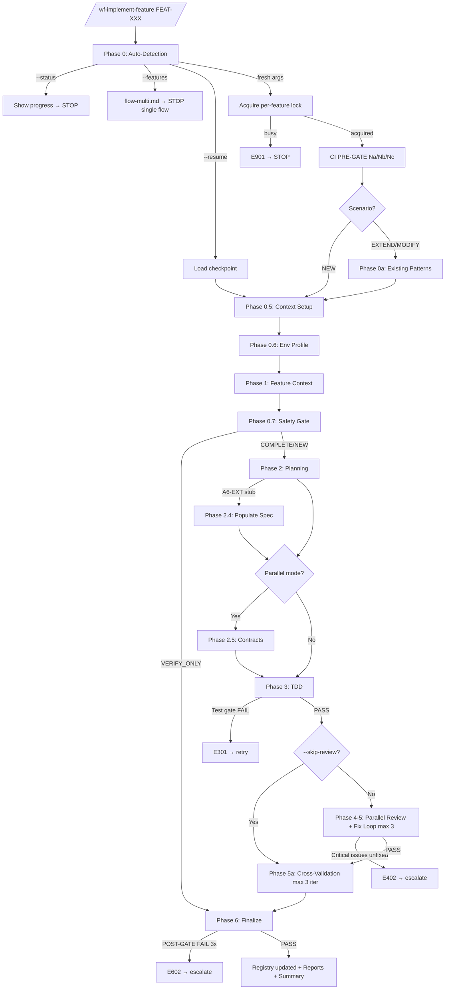
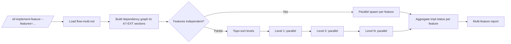

# 03 — Phase Routing

> **Mục đích file:** Luồng skill — 14 procedure files, Mermaid flow, profile dispatch, conditional skipping, single-feature vs multi-feature flow.

---

## 1. Phase routing map (single-feature)

| Phase | Tên | Procedure file | Load khi | Time (standard) |
|-------|-----|---------------|----------|----------------|
| 0 | Auto-Detection & Routing | (inline trong SKILL.md) | Always (entry) | 5-10s |
| 0a | Existing Code Analysis | `procedures/phase0-existing-analysis.md` | `$SCENARIO != "new"` | 1-3 min |
| 0.5 | Context Setup (LEGACY_MODE + Decision Registry) | `procedures/phase0-5-context-setup.md` | Always | 30s |
| 0.6 | Environment Profile Detection (v5.1+) | `procedures/phase0-6-env-profile.md` | Always | 20s |
| 1 | Feature Context + Digest Loading | `procedures/phase1-feature-context.md` | Always | 1-2 min |
| 0.7 | Safety Gate (CORE-020) + Env Scan + Mode Routing | `procedures/phase0-7-safety-gate.md` | Always (sau Phase 1) | 1-2 min |
| 2 | Task Breakdown + Batch Plan | `procedures/phase2-planning.md` | `$CONFIRMED_STRATEGY != "VERIFY_ONLY"` | 2-5 min |
| 2.4 | A6-EXT Populate (Architect) | `procedures/phase2-4-populate-spec.md` | `$A6_EXT_NEEDS_POPULATE == true` | 3-8 min |
| 2.5 | Contract-First Generation | `procedures/phase2-5-contracts.md` | `$PARALLEL_MODE == true` | 2-5 min |
| 3 | TDD Implementation | `procedures/phase3-tdd.md` | `$CONFIRMED_STRATEGY != "VERIFY_ONLY"` | 10-60 min |
| 4-5 | Review-Fix Loop (max 3 attempts) | `procedures/phase4-5-review-fix.md` | `--skip-review != true` | 5-20 min |
| 5a | Cross-Validation Auto-Correction | `procedures/phase5a-crossval.md` | Always | 2-5 min |
| 6 | Finalize (Registry + Reports + Summary) | `procedures/phase6-finalize.md` | Always | 1-3 min |

**Multi-feature mode:** `--features=FEAT-A,FEAT-B,...` → bypass phase0-X..phase6, load **`procedures/flow-multi.md`** thay vào (dependency graph + parallel/sequential dispatch).

**Shared reference:** `procedures/_shared.md` KHÔNG load standalone — chỉ tham chiếu section khi cần (agent contexts, protocols refs, error codes table, common helpers).

---

## 2. Flow diagram (single-feature)



---

## 3. Profile dispatch

| Phase | quick | standard | deep | exhaustive |
|-------|-------|----------|------|-----------|
| 0 — Auto-Detection | ✅ | ✅ | ✅ | ✅ |
| 0a — Existing Analysis | ✅ (cache) | ✅ | ✅ | ✅ (no-cache nếu set) |
| 0.5 — Context Setup | ✅ | ✅ | ✅ | ✅ |
| 0.6 — Env Profile | ✅ | ✅ | ✅ | ✅ |
| 1 — Feature Context | ✅ | ✅ | ✅ | ✅ |
| 0.7 — Safety Gate | ✅ (lightweight) | ✅ | ✅ (+ impact analysis) | ✅ (+ deep impact) |
| 2 — Planning | ✅ | ✅ | ✅ | ✅ |
| 2.5 — Contracts | ❌ (force sequential) | ❌ | ✅ (parallel) | ✅ (parallel) |
| 3 — TDD | sequential | sequential | parallel waves | parallel waves + e2e |
| 4-5 — Review (agents) | code-reviewer only | code-reviewer + qa-lead | + security | + a11y-auditor + performance-benchmarker |
| 5a — Cross-validation | ✅ | ✅ | ✅ | ✅ |
| 6 — Finalize | ✅ | ✅ | ✅ | ✅ |

---

## 4. Conditional skipping

| Phase | Skip nếu | Reason |
|-------|---------|--------|
| 0a (Existing Analysis) | `$SCENARIO == "new"` | Không có existing code để phân tích |
| 2 (Planning) | `$CONFIRMED_STRATEGY == "VERIFY_ONLY"` | Verify only mode → jump thẳng phase 6 |
| 2.4 (Populate Spec) | `$A6_EXT_NEEDS_POPULATE == false` | A6-EXT đã đủ context |
| 2.5 (Contracts) | `$PARALLEL_MODE == false` | Sequential mode không cần contract-first |
| 3 (TDD) | `$CONFIRMED_STRATEGY == "VERIFY_ONLY"` | Verify only, không viết code mới |
| 4-5 (Review) | `--skip-review` flag | User opt-out (chỉ hotfix khẩn) |
| 5a (Cross-validation) | KHÔNG SKIP | Luôn chạy để auto-fix REQ-ID missing, test stub, etc. |

---

## 5. Multi-feature flow (`procedures/flow-multi.md`)

Khi `--features=FEAT-A,FEAT-B,FEAT-C`:



Mỗi feature có riêng `$SYSTEM_SLUG/$FEATURE_SLUG/sessions/{id}/` isolation. Không cùng path → 0 race condition.

---

## 6. Cross-phase data — Pipeline state (SSOT)

File `$SESSION_DIR/impl-status.json` (schema v2.0) lưu state:

```json
{
  "schema_version": "2.0",
  "session_id": "2026-05-15-100000-host1",
  "feature_id": "FEAT-CRM-CUST-001",
  "feature_slug": "customer-management",
  "system_slug": "crm",
  "profile": "standard",
  "current_phase": "phase_3_tdd",
  "phases_completed": ["phase_0", "phase_0_5", "phase_0_6", "phase_1", "phase_0_7", "phase_2"],
  "next_action": "phase_3_tdd_batch_2",
  "cache_hits": { "existing_patterns": true, "saved_tokens_estimated": 5200 },
  "flags": { "skip_tests": false, "skip_review": false, "fresh": false },
  "reviews": { "code_review": "pending", "qa_review": "pending", "security_review": "pending" },
  "consumer_hints": {
    "for_prepare_deployment": { "files_for_changelog": [], "breaking_changes": [] },
    "for_fix_bugs": { "scope_modules": ["crm"], "recently_modified_files": [] },
    "for_verify_sync": { "req_ids_completed": [], "session_dir": "..." }
  }
}
```

**Update rule:** atomic write sau mỗi POST-GATE PASS. Pattern xem [`../../02-standards/11-output-path-contract.md`](../../02-standards/11-output-path-contract.md).

`checkpoint.json` chỉ tạo từ Phase 3 trở đi (batches granularity).

---

## 7. Liên kết

- Procedures structure: [07-procedures-structure.md](07-procedures-structure.md)
- File contract: [04-file-contract.md](04-file-contract.md)
- Pattern: [`../../03-design-patterns/01-lazy-load-procedures.md`](../../03-design-patterns/01-lazy-load-procedures.md)
- Pattern: [`../../03-design-patterns/06-checkpoint-resume.md`](../../03-design-patterns/06-checkpoint-resume.md)
- Pattern: [`../../03-design-patterns/04-parallel-lane-dispatch.md`](../../03-design-patterns/04-parallel-lane-dispatch.md) — Phase 4 parallel review
