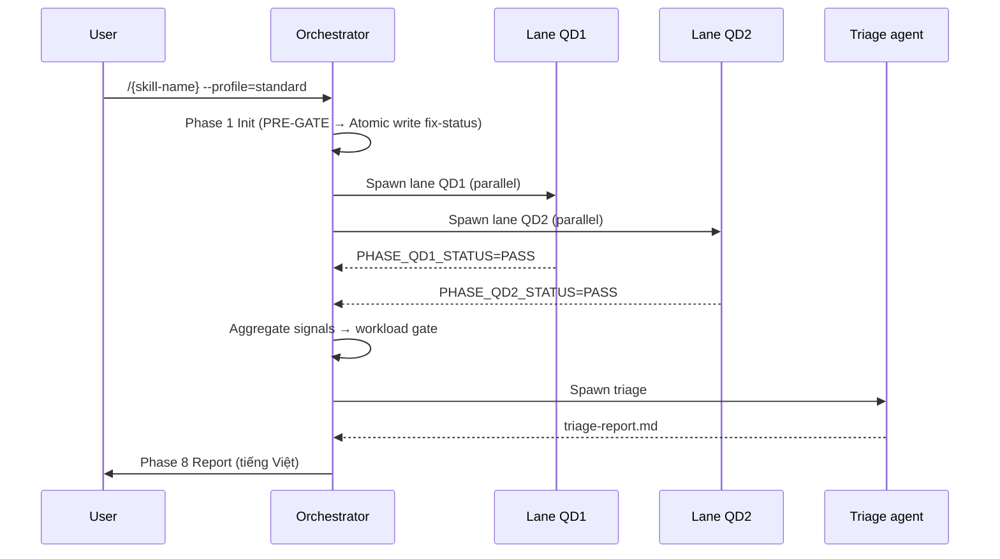
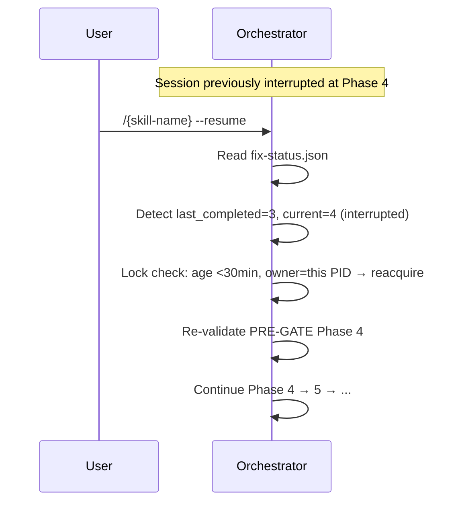

<!--
_template_notes:
  purpose: VARIANT cho Orchestrator skill — đặc tả user scenarios + UX flows.
           Bổ sung CHO 08-tradeoffs-adr.md (không thay thế — orchestrator skill có CẢ 2).
  populate:
    - §1 Personas + skill levels
    - §2 Top 5-10 scenarios (S1, S2, ...) với user goal + steps + expected outcome
    - §3 Flow diagrams (Mermaid sequence diagram)
    - §4 Error recovery scenarios (interrupt, lock conflict, ESCALATE)
    - §5 UX heuristics (output format, progress reporting, fail messages)
  Áp dụng: Orchestrator skills (wf-fix-bugs, wf-implement-feature, wf-e2e-verify, wf-manage-change)
  KHÔNG dùng cho: lane skills, quick skills
  độ dài tham khảo: 300-500 dòng
  Khi dùng file này, ĐỔI TÊN thành 08-user-scenarios-solutions.md (xóa .alt)
-->

# 08 — User Scenarios & Solutions (Orchestrator Variant)

> **Mục đích file:** Đặc tả user scenarios + UX flows cho orchestrator skill `{skill-name}`. Reviewer dùng để verify UX quality, contributor dùng để hiểu trải nghiệm người dùng cuối.

---

## 1. Personas

| Persona | Skill level | Pain point chính | Cần skill cung cấp |
|---------|------------|-----------------|---------------------|
| **PO/BA non-coder** | Beginner | Không hiểu bug technical | Output tiếng Việt, severity rõ ràng |
| **Dev junior** | Intermediate | Lo missing edge case | Auto-fix gợi ý + checklist |
| **Dev senior** | Expert | Cần control + speed | Profile flexible + dry-run + resume |
| **DevOps/SRE** | Expert | Cần CI integration | Exit code chuẩn + JSON report |

---

## 2. Top scenarios

### S1 — Quick check trước commit (Dev junior)

**Goal:** Check 1 file vừa edit có lỗi không, dưới 5 phút.

**Steps:**
1. User: `/{skill-name} --scope=file:src/auth/login.ts --profile=quick`
2. Skill: Phase 1 PASS (5s) → Phase 2 PASS (30s) → Phase 7 Triage → Phase 8 Report (5s)
3. Output: `Phase8-report.md` với 0 CRITICAL, 1 MEDIUM (suggest)

**Expected outcome:**
- Total time: 2-4 min
- User thấy ngay severity + fix hint
- KHÔNG block nếu chỉ MEDIUM/LOW
- Exit code 0

### S2 — Pre-PR full audit (Dev senior)

**Goal:** Đảm bảo PR clean trước review.

**Steps:**
1. `/{skill-name} --profile=standard`
2. Skill spawn 8 lanes parallel (5-10 phút)
3. Phase 7 Triage cross-lane: aggregate findings
4. Phase 8 Report: tổng quan + per-file detail

**Expected outcome:**
- Total: 10-20 min
- Auto-fix-able findings: skill ask user "Auto-fix 5 findings? [Y/n]"
- Fail-fast nếu CRITICAL detected (không chạy hết phases)
- Exit code 0 (PASS) / 1 (WARN) / 2 (FAIL)

### S3 — Resume sau interrupt (Dev senior)

**Goal:** Tiếp tục session bị Ctrl+C ở Phase 4.

**Steps:**
1. Original: `/{skill-name} --profile=deep` → interrupted at Phase 4
2. Resume: `/{skill-name} --resume`
3. Skill: đọc `fix-status.json` → detect last completed = Phase 3 → re-validate PRE-GATE Phase 4 → continue

**Expected outcome:**
- KHÔNG redo Phase 1-3
- Phase 4 chạy lại từ đầu (vì interrupted)
- Lock auto-release nếu age >30 min

### S4 — Conflict 2 sessions (Dev junior + Dev senior cùng repo)

**Goal:** Dev A đang chạy `/{skill-name}`, dev B chạy lệnh tương tự.

**Steps:**
1. Dev A: `/{skill-name} --profile=deep` (running, lock acquired)
2. Dev B: `/{skill-name}` → detect lock conflict (E001)
3. Skill (Dev B's session) ESCALATE: "Session đang chạy bởi Dev A. Wait? Cancel?"
4. Dev B: chọn Cancel → exit gracefully

**Expected outcome:**
- KHÔNG crash
- Message tiếng Việt rõ "ai đang chạy", "từ khi nào"
- Heartbeat check: nếu Dev A's session stale >30 min → auto-release

### S5 — Audit định kỳ qua CI (DevOps/SRE)

**Goal:** Cron job chạy `exhaustive` mỗi cuối tuần, gửi report Slack.

**Steps:**
1. CI: `/{skill-name} --profile=exhaustive --output=json`
2. Skill: chạy 60-180 min, tất cả lanes + LLM + Playwright
3. Output: `report.json` (machine-readable) + `report.md` (human)
4. CI parse report.json → format Slack message

**Expected outcome:**
- Idempotent (chạy lại cùng commit = cùng kết quả)
- JSON output có schema versioned
- Exit code chuẩn cho CI gate

### S6-S{N} — {Tên scenario}

{... lặp cho các scenario quan trọng khác ...}

---

## 3. Flow diagrams

### Sequence: Standard happy path (S2)

### Sequence: Resume after interrupt (S3)

---

## 4. Error recovery scenarios

| Scenario | Detection | Recovery flow |
|----------|-----------|---------------|
| Lock stale (>30 min) | Lock heartbeat check | Auto-release + reacquire |
| Disk full mid-write | Atomic write fail | Retry x3 → ESCALATE |
| Agent timeout (>5 min) | Orchestrator timer | Kill agent → mark phase FAIL → ESCALATE |
| Context budget >90% | Budget check after each step | FORCE STOP (E009) → checkpoint |
| Registry corruption | jq parse fail at PRE-GATE | ESCALATE — ask user re-run upstream skill |
| Cross-skill artifact missing | Consumer PRE-GATE T1 fail | WARN + graceful degradation |

---

## 5. UX heuristics

### Output format quy tắc

| Element | Quy tắc |
|---------|--------|
| Phase report | Tiếng Việt, ≤15 dòng, cho người không chuyên (CORE-028) |
| Progress | Inline `[Phase X/N] ...` mỗi 30s nếu phase >2 min |
| Severity màu | CRITICAL=đỏ, HIGH=vàng đậm, MEDIUM=vàng, LOW=xanh dương, OK=xanh lá |
| Exit code | 0=PASS, 1=WARN, 2=FAIL, >2=infrastructure error |
| File paths | Relative từ project root, có markdown link |

### Anti-patterns (KHÔNG làm)

❌ **Silent long-running** — phase >2 min không có progress
❌ **Stack trace cho user** — convert sang tiếng Việt friendly message
❌ **Block lockup** — không ESCALATE khi auto-fix exhausted
❌ **Vague error** — "Something went wrong" → cụ thể "Phase 3 fail: registry thiếu requirement REQ-XXX"
❌ **Force overwrite** — file existed without --force flag

---

## 6. Liên kết

- ADR cho UX decisions: [`08-tradeoffs-adr.md`](08-tradeoffs-adr.md) §UX-related ADRs
- Phase reporting standard: [`../../02-standards/02-skill-standard.md`](../../02-standards/02-skill-standard.md) §6
- CDG (Critical Decision Gate) protocol: [`../../03-design-patterns/10-cdg-gate.md`](../../03-design-patterns/10-cdg-gate.md)
- Real example: [`../wf-fix-bugs/08-user-scenarios-solutions.md`](../wf-fix-bugs/08-user-scenarios-solutions.md)
