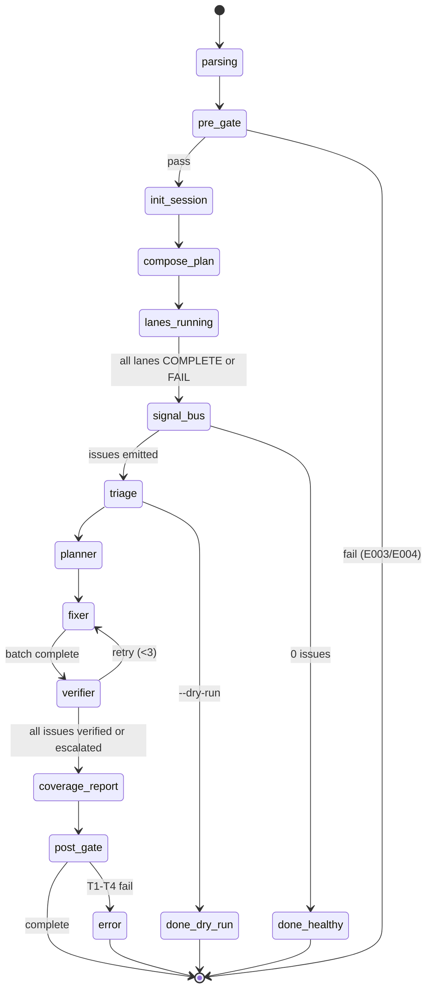

# 03 — Kiến Trúc Dimension-Based

> **Đọc trước:** [02-quality-dimensions.md](02-quality-dimensions.md)
> **Đọc tiếp:** [04-contracts-data-model.md](04-contracts-data-model.md)

---

## 1. Bản Đồ Tổng Thể

```
                        ┌──────────────────────────────────────────┐
  /wf-fix-bugs ───────▶ │              ORCHESTRATOR                │
  [arguments + flags]   │      (wf-fix-bugs v6 — pure)             │
                        │  - Parse args → Profile + Dim Selection  │
                        │  - Init session + SESSION_DIR            │
                        │  - Config lane runtime budget            │
                        │  - Compose lane plan                     │
                        └───────────────┬──────────────────────────┘
                                        │
           ┌────────────────────────────┼────────────────────────────┐
           │                            │                            │
           ▼                            ▼                            ▼
  ┌─────────────┐                ┌─────────────┐                ┌─────────────┐
  │ Dim Lane    │     ...        │ Dim Lane    │     ...        │ Dim Lane    │
  │  QD1        │                │  QDn        │                │  QD7        │
  │             │                │             │                │             │
  │  Sense      │                │  Sense      │                │  Sense      │
  │    ↓        │                │    ↓        │                │    ↓        │
  │  Think      │                │  Think      │                │  Think      │
  │    ↓        │                │    ↓        │                │    ↓        │
  │  Act        │                │  Act        │                │  Act        │
  │    ↓        │                │    ↓        │                │    ↓        │
  │  Verify     │                │  Verify     │                │  Verify     │
  └──────┬──────┘                └──────┬──────┘                └──────┬──────┘
         │                              │                              │
         │ Signals (lane-local)         │                              │
         ▼                              ▼                              ▼
  ┌────────────────────────────────────────────────────────────────────────┐
  │                         SIGNAL BUS                                     │
  │  - Ingest signals from all lanes                                       │
  │  - Dedup across dimensions (hash + semantic)                           │
  │  - Normalize to unified schema                                         │
  │  - Tag dimension[] + confidence                                        │
  │  - Emit Issues (stateful, checkpointable)                              │
  └────────────┬───────────────────────────────────────────────────────────┘
               │
               │ Issues → shared services
               ▼
  ┌────────────────────────────────────────────────────────────────────────┐
  │              SHARED SERVICES (cross-dimensional)                       │
  │                                                                        │
  │  ┌─────────┐   ┌─────────┐   ┌─────────┐   ┌─────────┐                 │
  │  │ Triage  │──▶│ Planner │──▶│ Fixer   │──▶│ Verifier│                 │
  │  └─────────┘   └─────────┘   └─────────┘   └─────────┘                 │
  │                                                                        │
  └────────────┬───────────────────────────────────────────────────────────┘
               │
               ▼
       Reports + Summary + History (SESSION_DIR outputs)
```

---

## 2. Thành Phần (Components)

### 2.1 Orchestrator — `wf-fix-bugs` (v6 — renamed internally)

**Vai trò:** Entry point, không thay đổi slash command. Chịu trách nhiệm:

1. Parse arguments → xác định Profile + Dimension Selection.
2. PRE-GATE (registry exists, code exists, runtime reachable nếu cần).
3. Khởi tạo SESSION_DIR + `fix-status.json`.
4. Compose plan: chọn lane nào chạy, budget (thời gian, token, probe depth).
5. Spawn lane (song song hoặc tuần tự tuỳ config).
6. Chờ lane emit signals → Signal Bus.
7. Trigger shared services (Triage → Planner → Fixer → Verifier).
8. Tổng hợp reports + POST-GATE.

**Không làm:**

- Không tự phát hiện bug (deleg cho lane).
- Không tự fix (deleg cho Fixer).
- Không ghi `req-registry.json` (CORE-006).

**File mapping:** `.claude/skills/workflow/wf-fix-bugs/SKILL.md` — giữ tên file; version bump v6.0.0.

### 2.2 Dimension Lane (7 lane)

Mỗi lane là 1 skill con trong `.claude/skills/workflow/wf-fix-<dim>/` với nội bộ 4 phase:

| Phase nội bộ | Trách nhiệm | Ví dụ ở QD3 Security |
|--------------|-------------|----------------------|
| **Sense** | Chạy các probe static + khởi tạo runtime setup | P3.01, P3.02, P3.08 |
| **Think** | Phân tích kết quả probe, gán confidence, tính impact | Dedup giữa regex secret + Semgrep rule tương tự |
| **Act** | Runtime probe bổ sung nếu cần (deep mode) | P3.06 auth bypass test |
| **Verify** | Self-check: probe chạy đủ chưa, evidence đầy đủ chưa, emit `lane-report.md` | Verify mỗi Signal có `code_ref` hoặc `http_trace` |

**Isolation:** Mỗi lane ghi vào `$SESSION_DIR/lanes/<dim>/` — write scope tách biệt (CORE-025).

**Skill tên:** `wf-fix-functional`, `wf-fix-business`, `wf-fix-security`, `wf-fix-performance`, `wf-fix-ux-a11y`, `wf-fix-data`, `wf-fix-compat`.

**Plug-in:** Thêm lane mới = tạo folder `wf-fix-<newdim>/` + register trong `config/dimensions.json`.

### 2.3 Signal Bus

**Trạng thái:** Stateful service, có checkpoint.

**Input:** `$SESSION_DIR/lanes/<dim>/signals.json` từ mỗi lane (append-only per lane).

**Output:** `$SESSION_DIR/issue-registry.json` (unified).

**Logic:**

1. **Schema validate** mỗi Signal mới.
2. **Dedup hash-based**: `sha256(dimension, probe_id, normalized_location, symptom_summary)` — Signal trùng hash → merge.
3. **Dedup semantic** (khi needed): 2 Signal khác dim nhưng cùng root cause (ví dụ: `/admin/reset-password` không check authz → emit từ P1.02 (missing route spec) và P3.02 (missing authz)). Semantic dedup dùng **location + reasoning agent** (chỉ chạy khi nhiều hơn 1 Signal cùng location).
4. **Normalize severity**: theo rule `MAX(severity)` across dimension (xem [02 §Severity Aggregation](02-quality-dimensions.md)).
5. **Emit Issue**: append vào `issue-registry.json` với dimension[] array.

**Checkpoint:** Sau mỗi batch ingest (mặc định 50 signals), Signal Bus ghi `signal-bus-checkpoint.json` để resume.

**File mapping:** Ở **ADR-02** (xem [07](07-tradeoffs-adr.md)) — decision là Signal Bus là **utility module** (không phải skill con), gọi từ orchestrator, không có slash command. Lý do: Signal Bus không cần user-facing, luôn chạy inline sau lane.

### 2.4 Shared Services

4 service chạy tuần tự sau khi Signal Bus emit Issues:

#### 2.4.1 Triage Service

- **Input:** `issue-registry.json` (raw issues, chưa tính `fixability`).
- **Logic:** Gán `fixability ∈ {AUTO_FIX, AGENT_FIX, ESCALATE}` theo rule:

  | Dimension | AUTO_FIX được phép khi | ESCALATE khi |
  |-----------|-------------------------|--------------|
  | QD1 | Lỗi config route, missing import, typo | Breaking API contract |
  | QD2 | Hard-coded value thuộc whitelist | Business logic cần SME |
  | QD3 | **Không bao giờ AUTO_FIX** — CORE-027 CDG | Luôn AGENT_FIX tối thiểu; secrets = ESCALATE |
  | QD4 | Memoization, lazy import | Schema change |
  | QD5 | Missing aria-label, alt, form label | UX flow rework |
  | QD6 | Validation missing theo contract | Schema migration |
  | QD7 | Env var missing template | Multi-browser bug gốc |

- **Output:** `issue-registry.json` (enriched) + `bug-triage.md` (tiếng Việt, user-facing) + `fix-plan.md`.
- **Skill mapping:** Đổi tên nội bộ từ `wf-fix-triage` → giữ tên cho backward-compat; logic mở rộng.

#### 2.4.2 Planner Service

- **Input:** `fix-plan.md` + dependency graph giữa issues.
- **Logic:** Sort issues theo:
  1. Severity desc.
  2. Dependency (issue A cần fix trước B nếu B reference A).
  3. Dimension group (fix cùng dim batch cùng nhau để avoid context switch).
- **Output:** `fix-batches.json` — danh sách batch execution.

#### 2.4.3 Fixer Service

- **Input:** `fix-batches.json`.
- **Logic:**
  - AUTO_FIX: apply patch theo template (dim-specific templates trong `.claude/skills/workflow/wf-fix-<dim>/templates/fix-patterns/`).
  - AGENT_FIX: spawn agent tương ứng (security → `security-engineer`; a11y → `ux-designer`; ...).
  - ESCALATE: không fix, ghi vào `escalations.md` với action hint.
- **Output:** Code patches applied + `fix-log.json` (append per fix).

**Safety gate (CORE-020):** Trước mỗi fix, search code hiện tại — không silent overwrite.

#### 2.4.4 Verifier Service

- **Input:** Issues đã fix.
- **Logic:**
  - Re-run probe gốc của Issue → check symptom đã biến mất.
  - Regression check: chạy probe liên quan (cùng lane) để detect side effect.
  - Evidence: capture after-state (screenshot, HTTP trace, log).
- **Output:** `issue-registry.json` (final: `verify_status`) + `fix-report.md` + `phase-summary.md`.

**Retry:** Nếu verify fail → gọi Fixer lại (max 3 lần). Sau 3 lần → ESCALATE.

### 2.5 Coverage Reporter (utility)

- Input: `coverage-report.md` template + lane reports + tool availability.
- Output: `coverage-report.md` (xem format ở [02 §Exit Criteria Tổng](02-quality-dimensions.md)).
- Chạy POST-GATE, sau Verifier.

---

## 3. Sequence Diagram (Chạy standard profile, 3 lane ss)

```
User ──/wf-fix-bugs ──▶ Orchestrator
                         │
                         │ 1. Parse args → profile=standard, dims=[QD1,QD2,QD5] (★ default v1.0 — logic + nghiệp vụ + UI)
                         │ 2. PRE-GATE (registry, code, runtime probe)
                         │ 3. Init SESSION_DIR
                         │
                         ├──▶ Spawn Lane QD1 (parallel)
                         ├──▶ Spawn Lane QD2 (parallel)
                         ├──▶ Spawn Lane QD5 (parallel)
                         │
             [Lanes chạy song song, mỗi lane Sense→Think→Act→Verify]
                         │
                         │ Lane-level signals.json per dim
                         │
                         │ 4. Wait all lanes COMPLETE
                         │
                         ├──▶ Signal Bus ingest + dedup → issue-registry.json
                         │
                         │ 5. POST-GATE Signal Bus
                         │
                         ├──▶ Triage → bug-triage.md + fix-plan.md
                         │
                         │ 6. User confirm (hoặc --dry-run skip)
                         │
                         ├──▶ Planner → fix-batches.json
                         │
                         ├──▶ Fixer (batch loop) → code patches + fix-log.json
                         │
                         ├──▶ Verifier → re-probe per fix → fix-report.md
                         │
                         ├──▶ Coverage Reporter → coverage-report.md
                         │
                         │ 7. POST-GATE workflow
                         │
                         ▼
                  phase-summary.md + orchestrator-summary.md + history update
```

---

## 4. Parallelism Model

### 4.1 Ai Được Song Song?

| Phân lớp | Song song? | Điều kiện |
|----------|-----------|-----------|
| Lane × Lane | **Có** | Write scope tách biệt (CORE-025); Signal Bus đảm nhận merge |
| Probe × Probe trong cùng lane | Có, tuỳ lane | Lane tự quản; mặc định tuần tự để giữ ngữ cảnh |
| Fixer batch × Fixer batch | **Không** | Fix code cần lock để tránh conflict |
| Verifier × Verifier | Có | Mỗi Issue độc lập |

### 4.2 Giới Hạn Lane Song Song

- Default tối đa **3 lane** chạy song song (runtime budget + agent token limit).
- User có thể override bằng `--max-parallel-lanes=N`.
- Nếu user chọn nhiều hơn khả năng → orchestrator batch thành "waves" 3 lane/wave.

### 4.3 Tại Sao Không Chạy Hết 7 Lane Song Song?

- Agent (business/security/ux/performance engineer) có thể bị giới hạn concurrent request.
- Playwright runtime test cần browser instance — quá nhiều sẽ OOM.
- Debug khó khi 7 luồng log trộn lẫn.

> Chi tiết budget tính toán xem [05-execution-profiles.md §Runtime Budget](05-execution-profiles.md).

---

## 5. Data Flow Chi Tiết

### 5.1 Lane → Signal Bus

```
Lane QD3 Sense (static probes)
  ▼
$SESSION_DIR/lanes/QD3/raw/P3.01-secrets.json   ← từng probe ghi riêng
$SESSION_DIR/lanes/QD3/raw/P3.02-authz.json
$SESSION_DIR/lanes/QD3/raw/P3.05-semgrep.json
  ▼
Lane QD3 Think (normalize + dedup nội bộ)
  ▼
$SESSION_DIR/lanes/QD3/signals.json              ← chuẩn hoá, sẵn sàng emit

Signal Bus ingest:
  Read signals.json từ tất cả lane
  ▼
  Dedup hash-based
  ▼
  Semantic dedup (nếu cần — trigger khi cùng location)
  ▼
  Severity aggregate (MAX across dim)
  ▼
$SESSION_DIR/issue-registry.json
```

### 5.2 Issue → Fix

```
issue-registry.json (post-triage)
  ▼
Planner → fix-batches.json
  ▼
Fixer loop:
  for batch in batches:
    for issue in batch:
      if AUTO_FIX: apply template patch
      elif AGENT_FIX: spawn domain agent
      else: ESCALATE
    Verifier: re-probe
    if verify_fail: retry (≤3) → else ESCALATE
  ▼
Final: issue-registry.json + fix-report.md + escalations.md
```

### 5.3 Checkpoint & Resume

| Layer | Checkpoint File | Khi nào ghi |
|-------|-----------------|-------------|
| Orchestrator | `fix-status.json` | Sau mỗi phase transition |
| Lane | `$SESSION_DIR/lanes/<dim>/checkpoint.json` | Sau mỗi probe complete |
| Signal Bus | `$SESSION_DIR/signal-bus-checkpoint.json` | Sau mỗi batch ingest (50 signals) |
| Shared services | Append vào `fix-log.json` per step |

**Resume routing:** `fix-status.json.active_phase` xác định điểm vào (orchestrator_init / lanes_running / signal_bus / triage / planner / fixer / verifier / done).

---

## 6. SKILL File Layout (Đề Xuất)

```
.claude/skills/workflow/
├── wf-fix-bugs/                     # Orchestrator (giữ tên)
│   ├── SKILL.md                     # v6.1.0 — dimension-based
│   ├── _contract.json               # v6.1.1
│   └── evals/
│       └── evals.json
│
├── wf-fix-functional/               # ★ Lane QD1
│   ├── SKILL.md
│   ├── _contract.json
│   ├── dimension.json               # ★ Manifest (probes, exit, severity)
│   ├── probes/                      # Code cho static/runtime probes
│   │   ├── P1.01-req-coverage.md
│   │   ├── P1.02-route-spec.md
│   │   ├── ...
│   ├── templates/
│   │   ├── signals.json
│   │   └── fix-patterns/
│   └── evals/
│
├── wf-fix-business/                 # ★ Lane QD2 (skeleton, in phase sau)
├── wf-fix-security/                 # ★ Lane QD3
├── wf-fix-performance/              # ★ Lane QD4
├── wf-fix-ux-a11y/                  # ★ Lane QD5
├── wf-fix-data/                     # ★ Lane QD6
├── wf-fix-compat/                   # ★ Lane QD7
│
├── wf-fix-triage/                   # Shared service (giữ tên, logic mở rộng)
├── wf-fix-execute/                  # Deprecated — logic chia nhỏ sang Planner+Fixer+Verifier
│
└── _shared/
    ├── pyproject.toml                  # pytest + coverage config (fail_under=80)
    ├── run-tests.sh                    # CI entry point (full/fast/module/cov-xml)
    ├── read_trace.py                   # CLI đọc session-log.json (CORE-026)
    │
    │   # --- Core modules (package-based) ---
    ├── concurrency/                    # ADR-22 rule 3 — 3-tier token bucket
    │   ├── token_bucket.py            # Global 12 / Lane 4 / Intra-probe 6
    │   └── backpressure.py            # Semaphore backpressure
    ├── impact_graph/                   # ADR-18 — Cross-module impact analysis
    │   ├── builder.py                 # Xây dựng graph từ import references
    │   ├── ripple.py                  # Verify Ripple (ADR-22 rule 2: depth=1, strength≥0.5)
    │   └── schemas/impact-graph.v1.schema.json
    ├── isg/                            # ADR-14 — Interactive Selection Gate
    │   └── isg_recommender.py         # Recommend QD + safety floor (ADR-22 rule 1)
    ├── scan_cache/                     # ADR-19 — Content-addressable scan cache
    │   ├── fingerprint.py             # SHA-256 chaining (5 components)
    │   ├── cache_lookup.py            # Lookup + TTL check + auto-prune corrupt
    │   ├── cache_store.py             # Set entry + QD3 guard (ADR-22 rule 6)
    │   └── housekeep.sh               # Cron-friendly prune script
    ├── signal_bus/                     # ADR-02 — Signal → Issue normalization
    │   └── signal_bus.py              # Ingest + dedup + POST-GATE T1-T4
    ├── workload_estimator/            # ADR-14/15 — Workload Gate
    │   └── estimator.py              # Estimate + partition + emit fix-workload.json
    │
    │   # --- Additional modules (added during implementation) ---
    ├── aggregate/                      # Signal aggregation logic
    ├── cache/                          # General caching utilities
    ├── cdg/                            # Critical Decision Gate logic
    ├── ips/                            # Intelligent Pre-Scan (shared with wf-legacy-scan)
    ├── lane/                           # Lane dispatch logic
    ├── partition/                      # Partition planning logic
    ├── profiles/                       # Profile resolution + profiles.json
    │   └── profiles.json              # ★ Profile → dim × depth mapping
    ├── templates/                      # Shared templates (fix-status.json, etc.)
    │   └── fix-status.json
    │
    │   # --- Top-level Python modules ---
    ├── dimension_registry.py           # Registry 7 dimensions
    ├── lane_dispatch.py                # Lane dispatch orchestration
    ├── partition_planner.py            # ADR-23 — ISG-guided + priority-based partition
    ├── profile_resolver.py             # Profile → dimension resolution
    ├── report_generator.py             # AggregationStats v2 (ADR-24) + reports
    ├── signal_aggregator.py            # Cross-lane signal aggregation
    └── tests/                          # Test suite (~507 tests)
        ├── conftest.py                # Shared fixtures
        ├── test_*.py                  # Unit + integration per module
        └── test_e2e_fix_bugs.py       # E2E scenarios (full v6 pipeline)
```

> `_shared/` là folder utility — không phải skill, không có SKILL.md. Chứa production modules + test suite (~507 tests).
> Triển khai qua B1 (scaffold) → B2 (business logic) → B3 (integration + impact_graph mới) → B4 (CI/CD + observability) → J/K/L (ISG integration, contract sync, multi-workload tests).
> Tham chiếu trong lane SKILL.md qua protocol reference. Tất cả module role=NONE với req-registry.json.

---

## 7. Ràng Buộc CORE Cần Tôn Trọng Khi Implement

### 7.1 CORE-007 Cross-Skill Output Path Contract

Bắt buộc thêm các dòng mới vào `.claude/rules/00-core.md §4b`:

| Producer | Path | Consumer |
|----------|------|----------|
| `/wf-fix-bugs` Orchestrator | `$SESSION_DIR/fix-status.json` | All lanes + services |
| Lane `/wf-fix-<dim>` | `$SESSION_DIR/lanes/<dim>/signals.json` | Signal Bus |
| Lane `/wf-fix-<dim>` | `$SESSION_DIR/lanes/<dim>/lane-report.md` | Coverage Reporter |
| Signal Bus | `$SESSION_DIR/issue-registry.json` | Triage, Planner, Fixer, Verifier |
| Triage | `$SESSION_DIR/bug-triage.md` + `fix-plan.md` + `issue-registry.json` (enrich) | Planner, user |
| Planner | `$SESSION_DIR/fix-batches.json` | Fixer |
| Fixer | `$SESSION_DIR/fix-log.json` (APPEND) + code patches | Verifier |
| Verifier | `$SESSION_DIR/issue-registry.json` (final) + `fix-report.md` | Coverage Reporter, user |
| Coverage Reporter | `$SESSION_DIR/coverage-report.md` | user |

Chi tiết schema mỗi file xem [04-contracts-data-model.md](04-contracts-data-model.md).

### 7.2 CORE-020 Pre-Implementation Safety Gate

Áp dụng cho Fixer — trước mỗi fix, search code hiện tại. Không chỉ áp cho wf-implement-feature.

### 7.3 CORE-027 Critical Decision Gate

Các điểm CDG trong pipeline mới:

1. **QD3 Auto-fix secrets** — không được, luôn ESCALATE.
2. **Fixer xoá/downgrade dependency major** — ESCALATE.
3. **Fixer chỉnh schema DB** — ESCALATE (phải qua migration flow).
4. **Verifier retry lần 3 fail** — ESCALATE.
5. **User từ chối tiếp tục sau Triage** — graceful exit.

### 7.4 CORE-028 Phase Summary

Extended: `phase-summary.md` phải có section "Coverage by dimension" (5-7 dòng).

### 7.5 CORE-030 Session Isolation

SESSION_DIR layout mới bắt buộc isolation per lane. Resume phải detect partial lane completion.

---

## 8. Sai Hỏng Và Fallback

| Tình huống | Hành vi |
|------------|---------|
| 1 lane crash | Lane emit `lane-report.md` status=FAIL; các lane khác tiếp tục; Signal Bus dedup với dữ liệu sẵn có; final report note "QDx partial" |
| Signal Bus dedup conflict | Chọn Signal có `confidence` cao nhất làm đại diện; ghi conflict log |
| Fixer apply patch fail | Rollback patch, mark issue `fix_status=failed`, không verify; report với hint |
| Verifier retry ≥3 lần fail | ESCALATE, mark issue `verify_status=failed`; không block workflow |
| Tool ngoài missing (Semgrep, Lighthouse, ...) | Probe skip + ghi coverage report; không fail lane |
| Agent timeout | Probe retry 1 lần → nếu tiếp fail thì skip probe + note "agent_timeout" |
| Context > 90% | Force checkpoint; user resume bằng `--resume` trong session mới |

---

## 9. Testability

Mỗi component độc lập testable:

- **Lane**: chạy standalone bằng `/wf-fix-<dim> --golden=<fixture>` (skip orchestrator).
- **Signal Bus**: đầu vào là folder `lanes/<dim>/signals.json` fake; output so với expected `issue-registry.json`.
- **Fixer**: đầu vào là `fix-batches.json` fake + code sample; verify patch áp đúng.
- **Verifier**: đầu vào là code sample fixed + Issue gốc; verify re-probe đúng.

Golden fixtures per dimension đặt trong `.claude/skills/workflow/wf-fix-<dim>/evals/golden/`.

---

## 10. Mermaid — State Machine của Orchestrator



---

## 11. Mapping Orchestrator v5 → v6

| v5.1.0 | v6.0.0 (new) | Ghi chú |
|--------|--------------|---------|
| Bước 1 Discover (monolithic) | Lane QD1-7 Sense + Think + Act (parallel) | Chia theo dimension thay vì Layer |
| 5-Layer trong wf-fix-discover | Probes trong từng lane | Semantics rõ hơn |
| Bước 2 Triage | Signal Bus + Triage Service | Signal Bus mới; Triage tập trung vào fixability |
| Bước 3 Execute (fix + docs + verify + report) | Planner + Fixer + Verifier + Coverage Reporter | Chia nhỏ 4 service |
| `issue-registry.json` schema cũ | Extended schema với `dimension[]`, `probe_source`, `confidence` | Backward-compat: field mới có default |
| `--deep`, `--full-test`, `--responsive` | Map sang profile + dim selection | Xem [05-execution-profiles.md §Flag Compat](05-execution-profiles.md) |
| `--dry-run` | Giữ nguyên — Verifier + Fixer skip | — |
| `--resume` | Mở rộng — resume per lane | — |
| `--scope=all\|system\|module` | Giữ nguyên | — |

---

## 12. Câu Hỏi Mở Đến Phần Implement

Trước khi implement, làm rõ:

1. Signal Bus là library hay skill (đã chốt ADR-02: utility module/library) — nhưng cần PoC để confirm không chạm giới hạn Task tool.
2. Tất cả 7 lane có cần tạo đủ v1 không, hay làm QD1 + QD3 trước làm bellweather?
3. Shared `_shared/` có cần cross-compile template để reuse, hay mỗi lane tự copy?

Các câu hỏi này mở trong [07-tradeoffs-adr.md §Open Questions](07-tradeoffs-adr.md).
