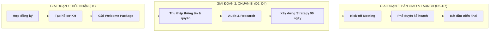
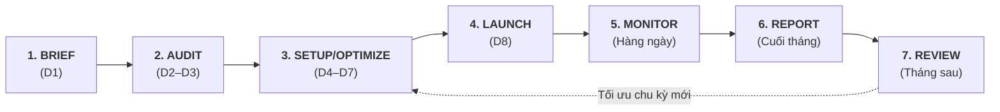
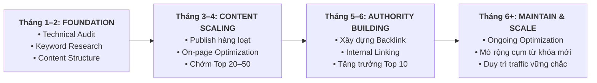
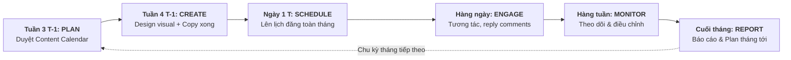
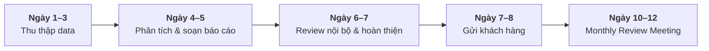

# BC VIỆT NAM – BỘ SOP CHI TIẾT
## Standard Operating Procedures – Hệ thống quy trình vận hành chuẩn
**Phiên bản:** 1.0 | **Ngày ban hành:** Tháng 9/2026 | **Áp dụng:** Toàn bộ bộ phận Agency Services

---

> **Mục đích tài liệu:** Chuẩn hóa toàn bộ quy trình vận hành dịch vụ của BC Việt Nam, đảm bảo chất lượng đồng nhất, trách nhiệm rõ ràng và trải nghiệm khách hàng xuất sắc ở mọi điểm chạm.

---

## MỤC LỤC

| Mã SOP | Quy trình | Áp dụng |
|--------|-----------|---------|
| SOP-01 | Onboarding Khách Hàng Mới | Tất cả dịch vụ |
| SOP-02 | Vận hành gói Performance Ads | BC Performance Ads™ |
| SOP-03 | Vận hành gói SEO & Content | BC SEO & Content™ |
| SOP-04 | Vận hành gói Social Media | BC Social Media™ |
| SOP-05 | Vận hành gói TikTok & Commerce | BC TikTok & Social Commerce™ |
| SOP-06 | Báo cáo hàng tháng toàn agency | Tất cả dịch vụ |
| SOP-07 | Xử lý khiếu nại & vấn đề phát sinh | Tất cả dịch vụ |
| SOP-08 | Offboarding Khách Hàng | Tất cả dịch vụ |

---

## QUY ƯỚC CHUNG

### Ký hiệu vai trò
| Ký hiệu | Vai trò |
|---------|---------|
| **AM** | Account Manager – quản lý mối quan hệ khách hàng |
| **PM** | Project Manager – điều phối dự án nội bộ |
| **SPEC** | Specialist – chuyên viên kỹ thuật (Ads/SEO/Social/TikTok) |
| **DESIGN** | Designer – thiết kế creative |
| **COPY** | Copywriter – viết nội dung |
| **TECH** | Tech/Dev – hỗ trợ kỹ thuật |
| **BM** | Board/Management – cấp Giám đốc |

### Thang ưu tiên
| Mức | Nhãn | Thời gian phản hồi |
|-----|------|-------------------|
| P0 | 🔴 Khẩn cấp | ≤ 2 giờ |
| P1 | 🟠 Cao | ≤ 4 giờ làm việc |
| P2 | 🟡 Trung bình | ≤ 1 ngày làm việc |
| P3 | 🟢 Thấp | ≤ 3 ngày làm việc |

### Công cụ quản lý
- **Task management:** ClickUp (board Kanban, Gantt, Docs)
- **Communication:** Slack (nội bộ) + Zalo/Email (với KH)
- **Cloud storage:** Google Drive (theo cấu trúc chuẩn)
- **Reporting:** Looker Studio + Google Sheets
- **CRM:** HubSpot

---

---

# SOP-01: QUY TRÌNH ONBOARDING KHÁCH HÀNG MỚI

**Mã:** SOP-01 | **Phạm vi:** Tất cả gói dịch vụ | **Thời gian chuẩn:** 5–7 ngày làm việc

---

## Mục tiêu
Đảm bảo khách hàng mới được tiếp nhận đúng quy trình, có đủ thông tin để triển khai và cảm nhận được sự chuyên nghiệp của BC Việt Nam ngay từ ngày đầu tiên.

---

## Sơ đồ tổng thể



---

## Chi tiết các bước

### GIAI ĐOẠN 1: TIẾP NHẬN (Ngày 1)

**Bước 1.1 – Xác nhận hợp đồng & thanh toán**
- **Thực hiện:** AM
- **Thao tác:**
  - Nhận xác nhận ký hợp đồng từ bộ phận Sales
  - Kiểm tra hóa đơn/biên lai thanh toán tháng đầu
  - Cập nhật CRM (HubSpot): chuyển deal sang stage "Active Client"
  - Tạo thư mục Google Drive theo cấu trúc chuẩn: `/BC Agency/Clients/[Tên KH]/`
- **Output:** Hồ sơ KH trên CRM hoàn chỉnh
- **Thời gian:** Trong ngày ký hợp đồng

**Bước 1.2 – Tạo Workspace nội bộ**
- **Thực hiện:** AM + PM
- **Thao tác:**
  - Tạo project mới trên ClickUp theo template có sẵn
  - Add team members liên quan (SPEC, DESIGN, COPY phù hợp với gói dịch vụ)
  - Tạo kênh Slack nội bộ: `#kh-[tên viết tắt]`
  - Tạo kênh liên lạc với KH (Zalo Group hoặc email thread)
- **Output:** Workspace ClickUp, kênh Slack, kênh liên lạc KH
- **Thời gian:** Trong ngày ký hợp đồng

**Bước 1.3 – Gửi Welcome Package**
- **Thực hiện:** AM
- **Thao tác:**
  - Soạn email chào mừng theo template (xem P1 Templates)
  - Đính kèm: Onboarding Checklist, Client Intake Form, thông tin liên hệ đội ngũ
  - Gửi qua email + Zalo (nếu KH đã có nhóm Zalo)
  - Đặt follow-up reminder sau 24h nếu KH chưa phản hồi
- **Output:** Email Welcome đã gửi, xác nhận đã nhận từ KH
- **Thời gian:** Muộn nhất cuối ngày làm việc đầu tiên

---

### GIAI ĐOẠN 2: THU THẬP THÔNG TIN (Ngày 2–3)

**Bước 2.1 – Thu thập Client Intake Form**
- **Thực hiện:** AM + KH
- **Nội dung cần thu thập:**
  - Thông tin doanh nghiệp (ngành hàng, sản phẩm/dịch vụ chính, USP)
  - Đối tượng mục tiêu (nhân khẩu học, hành vi, pain points)
  - Lịch sử marketing (đã chạy gì, kết quả ra sao, bài học rút ra)
  - Mục tiêu KPIs cụ thể (doanh số, lead, traffic, followers…)
  - Budget phân bổ theo tháng (ngân sách ads, nội dung, thiết kế)
  - Tone of voice, brand guidelines (nếu có)
  - Đối thủ cạnh tranh chính (3–5 tên)
  - Các kênh đang sở hữu (website, fanpage, Zalo OA, TikTok Shop…)
  - Lịch ra sản phẩm/promotion dự kiến (3 tháng tới)
- **Output:** Client Intake Form đã điền đầy đủ
- **Deadline:** Ngày D+2

**Bước 2.2 – Thu thập quyền truy cập tài khoản**
- **Thực hiện:** AM + TECH
- **Tài khoản cần thu thập (theo gói dịch vụ):**

| Tài khoản | Performance Ads | SEO | Social | TikTok |
|-----------|:-:|:-:|:-:|:-:|
| Meta Business Manager | ✅ | - | ✅ | - |
| Google Ads | ✅ | - | - | - |
| Google Analytics 4 | ✅ | ✅ | ✅ | ✅ |
| Google Search Console | - | ✅ | - | - |
| Website (WordPress/Haravan/Shopify) | - | ✅ | - | - |
| Facebook Page | - | - | ✅ | - |
| Instagram Business | - | - | ✅ | - |
| TikTok Ads Manager | - | - | - | ✅ |
| TikTok Shop | - | - | - | ✅ |

- **Quy trình bàn giao quyền truy cập:** Dùng Access Handover Form (P1 Templates)
- **Mức quyền tối thiểu:** Admin (với Ads account), Editor (với content pages)
- **Bảo mật:** Không nhận mật khẩu trực tiếp – KH cấp quyền qua Business Manager/Partner Access
- **Output:** Access Handover Form ký xác nhận, team đã vào được tất cả tài khoản
- **Deadline:** Ngày D+3

---

### GIAI ĐOẠN 3: RESEARCH & AUDIT (Ngày 3–5)

**Bước 3.1 – Audit tài khoản hiện tại**
- **Thực hiện:** SPEC (theo chuyên môn)
- **Nội dung audit:**

*Ads Audit (nếu có lịch sử):*
- Cấu trúc campaign (Campaign/AdSet/Ad level)
- Performance lịch sử 3–6 tháng (CTR, CPC, CPM, CPA, ROAS)
- Đối tượng target đang dùng
- Creative assets (format, nội dung, hiệu quả)
- Cài đặt Pixel/Conversion Tracking
- Phát hiện vấn đề: budget drain, audiences overlap, ad fatigue

*SEO Audit (nếu có website):*
- Technical SEO: Core Web Vitals, crawl errors, sitemap
- On-page: Title tags, meta descriptions, heading structure
- Off-page: Domain authority, backlink profile
- Keyword rankings hiện tại (top 20)
- Competitor analysis (traffic, keywords, content gaps)

*Social Audit:*
- Engagement rate trung bình
- Posting frequency & content mix
- Best-performing content
- Audience demographics
- Brand voice consistency

- **Output:** Báo cáo Audit (file .docx hoặc Google Doc, upload lên Drive KH)
- **Deadline:** Ngày D+5

**Bước 3.2 – Competitor & Market Research**
- **Thực hiện:** SPEC
- **Nội dung:**
  - Phân tích 3–5 đối thủ trên các kênh KH đang chạy
  - Đánh giá: ad strategy, content approach, keyword targeting, share of voice
  - Xác định opportunities và gaps
- **Output:** Competitor Research Document (lưu Drive KH)
- **Deadline:** Đồng thời với Bước 3.1

---

### GIAI ĐOẠN 4: XÂY DỰNG STRATEGY & PHÊ DUYỆT (Ngày 5–7)

**Bước 4.1 – Soạn thảo Strategy 90 ngày đầu**
- **Thực hiện:** SPEC + AM
- **Nội dung:**
  - Mục tiêu KPI theo tháng (tháng 1: foundation, tháng 2: growth, tháng 3: optimize)
  - Plan triển khai cụ thể (campaign structure/content plan/SEO roadmap)
  - Budget allocation đề xuất
  - Key milestones và review points
- **Output:** Tài liệu Strategy 90 ngày (Presentation Slides + Written Plan)
- **Deadline:** Ngày D+6

**Bước 4.2 – Kick-off Meeting với KH**
- **Thực hiện:** AM + SPEC (lead) + BM (nếu cần)
- **Agenda (60–90 phút):**
  1. Giới thiệu đội ngũ phụ trách (10 phút)
  2. Tóm tắt kết quả Audit & Research (20 phút)
  3. Trình bày Strategy 90 ngày (25 phút)
  4. Thống nhất KPIs & milestones (15 phút)
  5. Quy trình làm việc & communication protocol (10 phút)
  6. Q&A (10 phút)
- **Preparation checklist:**
  - ☐ Deck presentation chuẩn bị xong trước 24h
  - ☐ Số liệu audit cross-check lần cuối
  - ☐ Action items list chuẩn bị sẵn
  - ☐ Test link meeting trước 15 phút
- **Output:** Meeting notes, KPI đã thống nhất, Action items với deadline
- **Deadline:** Ngày D+7

**Bước 4.3 – Phê duyệt & bắt đầu triển khai**
- **Thực hiện:** AM
- **Thao tác:**
  - Gửi summary meeting qua email trong 24h sau Kick-off
  - Xác nhận KPI targets và deliverables bằng văn bản (email hoặc biên bản họp)
  - Cập nhật ClickUp: move sang status "Active – Triển khai"
  - Thông báo nội bộ: "KH [tên] đã sẵn sàng – Bắt đầu triển khai từ ngày [X]"
- **Output:** Email confirmation, ClickUp updated, team được thông báo

---

### CHECKLIST ONBOARDING HOÀN TẤT

```
☐ Hợp đồng & hóa đơn đã hoàn tất
☐ CRM (HubSpot) đã cập nhật đầy đủ
☐ Google Drive folder đã tạo theo cấu trúc chuẩn
☐ ClickUp project đã khởi tạo và assign đúng người
☐ Welcome Package đã gửi và KH đã xác nhận nhận
☐ Client Intake Form đã điền đầy đủ
☐ Tất cả tài khoản cần thiết đã được cấp quyền
☐ Access Handover Form đã ký xác nhận
☐ Audit đã hoàn thành và lưu Drive
☐ Strategy 90 ngày đã soạn
☐ Kick-off Meeting đã diễn ra
☐ KPIs đã thống nhất bằng văn bản
☐ Team nội bộ đã được bàn giao đầy đủ thông tin
```

---

---

# SOP-02: QUY TRÌNH VẬN HÀNH GÓI PERFORMANCE ADS

**Mã:** SOP-02 | **Áp dụng:** BC Performance Ads™ (Meta, Google, TikTok Ads)

---

## Chu kỳ vận hành tháng



---

## Chi tiết quy trình

### BƯỚC 1: NHẬN BRIEF & LẬP KẾ HOẠCH THÁNG (Ngày 1–3 đầu tháng)

**1.1 – Monthly Brief Meeting**
- **Thực hiện:** AM + KH + SPEC
- **Thời điểm:** Tuần cuối tháng trước hoặc ngày 1–3 tháng mới
- **Nội dung thảo luận:**
  - Review kết quả tháng trước (performance vs KPI)
  - Mục tiêu, promotion, sản phẩm focus tháng này
  - Budget tháng này (tổng, chia theo platform)
  - Thay đổi sản phẩm/dịch vụ, giá, ưu đãi cần cập nhật
  - Yêu cầu creative mới (nếu có)
- **Output:** Monthly Brief Document (lưu Drive)

**1.2 – Lập Campaign Plan**
- **Thực hiện:** SPEC
- **Nội dung:**
  - Phân bổ budget theo platform (ví dụ: Meta 60%, Google 30%, TikTok 10%)
  - Campaign structure: Campaign → Ad Set → Ad (cấu trúc chi tiết)
  - Audiences strategy: cold, warm, retargeting
  - Creative brief: số lượng, format, thông điệp chính
  - KPI targets tháng: CPA, ROAS, CTR, impression share
- **Output:** Campaign Plan document (Campaign Structure Sheet – xem P1 Templates)

**1.3 – Yêu cầu Creative**
- **Thực hiện:** SPEC → DESIGN + COPY
- **Thao tác:**
  - Điền Creative Brief Form (mô tả yêu cầu, format, deadline)
  - Submit vào ClickUp task với due date cụ thể
  - Đảm bảo deadline creative ≥ 3 ngày trước ngày dự kiến launch
- **SLA creative:**
  - Static banner (1–3 sizes): 2 ngày làm việc
  - Video creative (15–30s): 3–5 ngày làm việc
  - Collection of 5+ creatives: 5–7 ngày làm việc

---

### BƯỚC 2: SETUP & OPTIMIZATION (Ngày 4–7)

**2.1 – Audit tài khoản trước khi chạy**
- **Thực hiện:** SPEC
- **Kiểm tra:**
  - Pixel/Conversion API hoạt động đúng (test Events Manager)
  - Audience lists cập nhật (Custom Audiences, Lookalike)
  - Payment method & spending limit còn hợp lệ
  - Tài khoản không có cảnh báo vi phạm chính sách
  - Budget caps đặt đúng để tránh overspend

**2.2 – Setup Campaign mới**
- **Thực hiện:** SPEC
- **Quy trình Meta Ads:**
  1. Chọn Campaign Objective phù hợp (Conversion, Traffic, Awareness…)
  2. Setup Campaign budget (CBO hoặc ABO theo strategy)
  3. Tạo Ad Sets: target audience, placement, schedule, bid strategy
  4. Upload Ads: creative + copy + UTM parameters
  5. Double-check: preview on all placements, UTM test, pixel fire test
  6. Submit for Review (thường 24h)

- **Quy trình Google Ads:**
  1. Xác định campaign type: Search, Performance Max, Display, Shopping
  2. Setup Campaign: bidding strategy (Target CPA/ROAS), budget, network
  3. Setup Ad Groups: keywords (broad/phrase/exact), negative keywords
  4. Tạo Ads: RSA headlines (15), descriptions (4), extensions đầy đủ
  5. Link Google Analytics 4 + conversion tracking
  6. Submit & review

- **Checklist trước khi launch:**
  - ☐ UTM parameters chuẩn và nhất quán
  - ☐ Landing page load time < 3 giây
  - ☐ Pixel/conversion tracking hoạt động
  - ☐ Budget caps đặt đúng
  - ☐ Creative preview trên mobile OK
  - ☐ All copy đúng chính tả, không vi phạm policy
  - ☐ A/B test setup (nếu có)

**2.3 – Tối ưu ongoing**
- **Thực hiện:** SPEC
- **Tần suất tối ưu:**

| Hoạt động | Tần suất | Platform |
|-----------|----------|----------|
| Check spend & performance | Hàng ngày (sáng 9h) | Tất cả |
| Điều chỉnh bid/budget | 2–3 lần/tuần | Tất cả |
| Pause ad underperforming | Khi CPC > 2x benchmark | Tất cả |
| Test creative mới | 2 tuần/lần | Tất cả |
| Mở rộng audience | Khi campaign stable (2 tuần) | Meta |
| Review search terms | Hàng tuần | Google Search |
| Thêm negative keywords | Hàng tuần | Google Search |
| Refresh retargeting | Hàng tháng | Tất cả |

---

### BƯỚC 3: MONITORING & ALERT (Hàng ngày)

**3.1 – Daily Performance Check**
- **Thực hiện:** SPEC
- **Thời điểm:** 9:00–9:30 mỗi sáng làm việc
- **Kiểm tra:**
  - Spend hôm qua vs projected (nếu lệch > 20% → điều tra ngay)
  - Top performing ads (scale up nếu ROAS > target 20%)
  - Underperforming ads (pause nếu CPA > 2x target sau 3 ngày)
  - Tài khoản có cảnh báo hoặc bị disable không
  - CTR trends (nếu giảm liên tục 3 ngày → refresh creative)

**3.2 – Alert Protocol**
| Tình huống | Hành động | Thông báo |
|------------|-----------|-----------|
| Tài khoản bị disable | Pause toàn bộ → điều tra ngay → báo AM | AM → KH trong 2h |
| Budget hết giữa tháng | Báo AM → họp khẩn với KH về việc nạp thêm | Ngay lập tức |
| CPA > 3x target sau 5 ngày | Review toàn bộ campaign → đề xuất plan B | Weekly review |
| Landing page bị lỗi 404 | Pause ads → báo KH sửa → resume sau khi fixed | Ngay lập tức |
| Policy violation | Pause → đọc lý do → fix creative → appeal | AM → KH trong 4h |

---

### BƯỚC 4: WEEKLY STANDUP (Mỗi thứ Hai hoặc Thứ Sáu)

**Thực hiện:** AM + SPEC (có thể mời KH tham gia)
- **Thời gian:** 30 phút
- **Agenda:**
  - Numbers tuần qua: Spend, Impressions, Clicks, Conversions, CPA/ROAS
  - Top 3 wins & Top 3 issues
  - Plan tuần tới
  - Yêu cầu từ KH (creative mới, ưu đãi mới, sản phẩm mới)
- **Output:** Weekly update email/Slack gửi KH trong ngày

---

### BƯỚC 5: END-OF-MONTH WRAP-UP

- Xem chi tiết tại **SOP-06: Báo cáo hàng tháng**

---

### KPI BENCHMARKS THAM KHẢO

| Platform | CTR | CPC (VND) | CPM (VND) | CPA target |
|----------|-----|-----------|-----------|-----------|
| Meta Ads (Conversion) | > 1.5% | < 1,500 | < 80,000 | Theo ngành |
| Meta Ads (Traffic) | > 2% | < 800 | - | - |
| Google Search | > 5% | < 3,000 | - | Theo ngành |
| Google PMax | > 8% (overall) | < 2,000 | - | Theo ngành |
| TikTok Ads | > 1% | < 1,200 | < 50,000 | Theo ngành |

*Lưu ý: CPA target do KH đặt ra trong Kick-off Meeting – đây chỉ là benchmarks tham khảo chung*

---

---

# SOP-03: QUY TRÌNH VẬN HÀNH GÓI SEO & CONTENT

**Mã:** SOP-03 | **Áp dụng:** BC SEO & Content™ (tối thiểu 6 tháng)

---

## Tổng quan chu kỳ SEO



---

## Chi tiết quy trình theo tháng

### THÁNG ĐẦU TIÊN: FOUNDATION

**Bước 1.1 – Technical SEO Audit & Fix**
- **Thực hiện:** SPEC (SEO)
- **Thao tác:**
  - Crawl toàn website bằng Screaming Frog/Sitebulb
  - Kiểm tra: 404 errors, redirect chains, duplicate content, canonical tags
  - Kiểm tra Core Web Vitals (Google PageSpeed Insights + Search Console)
  - Kiểm tra sitemap.xml và robots.txt
  - Setup/verify Google Search Console nếu chưa có
  - Liệt kê danh sách issues theo mức ưu tiên (Critical/Important/Nice-to-have)
- **Giao cho TECH fix:** Critical issues trong 2 tuần đầu
- **Output:** Technical SEO Report + Fix List

**Bước 1.2 – Keyword Research & Mapping**
- **Thực hiện:** SPEC (SEO)
- **Thao tác:**
  - Brainstorm từ khóa seed từ thông tin KH (sản phẩm, dịch vụ, USP)
  - Research mở rộng: Google Suggest, Ahrefs/Semrush, Keyword Planner
  - Phân loại từ khóa theo:
    - Search intent: Informational / Commercial / Transactional / Navigational
    - Funnel stage: TOFU / MOFU / BOFU
    - Độ khó: Easy (<20 KD) / Medium / Hard (>50 KD)
    - Volume: monthly search volume
  - Keyword mapping: assign mỗi URL target 1 primary keyword + 3–5 secondary
  - Xác định content gaps (KW có volume cao nhưng KH chưa có content)
- **Output:** Keyword Master List (Google Sheets), Content Gap Analysis

**Bước 1.3 – Content Strategy & Calendar**
- **Thực hiện:** SPEC (SEO) + COPY
- **Thao tác:**
  - Xây dựng Topic Cluster model: 1 Pillar Page + 5–10 Cluster Articles
  - Lập Content Calendar tháng 1 (số bài theo gói: Basic=8/tháng, Standard=16/tháng, Premium=30/tháng)
  - Brief từng bài: title, primary KW, secondary KWs, word count, outline, reference URLs
  - Trình KH phê duyệt content calendar trước khi bắt đầu viết
- **Output:** Content Calendar phê duyệt, Article Briefs

---

### HÀNG THÁNG: QUY TRÌNH CONTENT PRODUCTION

**Bước 2.1 – Viết Content**
- **Thực hiện:** COPY (theo brief của SPEC)
- **Tiêu chuẩn content SEO:**
  - Độ dài: tối thiểu 1,200 words (TOFU), 800 words (MOFU/BOFU)
  - Keyword density: 0.5–1.5% primary keyword
  - Internal links: tối thiểu 2–3 links/bài
  - External links: 1–2 links nguồn uy tín
  - Featured snippet optimization (nếu KW có featured snippet)
  - Heading structure: H1 (1) → H2 (3–5) → H3 (theo nhu cầu)
- **SLA viết bài:** 2–3 ngày/bài (tùy độ phức tạp)
- **Quy trình review:** COPY → SPEC (SEO check) → AM (brand voice check) → KH (nếu cần)

**Bước 2.2 – On-page Optimization khi đăng bài**
- **Thực hiện:** SPEC (SEO)
- **Checklist:**
  - ☐ Đăng bài trên CMS (WordPress/Haravan) đúng format
  - ☐ Title tag tối ưu (50–60 ký tự, có primary keyword)
  - ☐ Meta description hấp dẫn (120–155 ký tự, có CTA)
  - ☐ URL slug ngắn gọn, có primary keyword
  - ☐ Alt text cho tất cả images
  - ☐ Schema markup (Article, FAQ, Breadcrumb)
  - ☐ Internal linking với anchor text phù hợp
  - ☐ Featured image chuẩn (1200×630px)
  - ☐ Submit URL lên Google Search Console để index nhanh

**Bước 2.3 – Backlink Building (từ tháng 3 trở đi)**
- **Thực hiện:** SPEC (SEO)
- **Phương pháp đề xuất (white-hat):**
  - Guest posting: tiếp cận các website liên quan để đăng bài
  - Digital PR: pitching stories cho báo/tạp chí online trong ngành
  - Resource link building: tạo nội dung đáng được link đến (infographic, research)
  - Broken link building: tìm link hỏng trên các site uy tín và propose thay bằng content của KH
- **Target:** 2–5 backlinks chất lượng/tháng (DA > 30)
- **KHÔNG làm:** Mua link, link farms, PBN (rủi ro penalty)

---

### HÀNG TUẦN: MONITORING

**Bước 3.1 – Weekly SEO Check**
- **Thực hiện:** SPEC (SEO)
- **Kiểm tra:**
  - Keyword rankings (dùng Ahrefs/Semrush hoặc Google Search Console)
  - Crawl errors mới trong Search Console
  - Core Web Vitals (nếu có thay đổi kỹ thuật)
  - Index coverage (pages indexed vs submitted)
  - Any manual actions/security issues

**Bước 3.2 – Tracking & Báo cáo**
- **Công cụ:** Google Search Console + GA4 + Ahrefs/Semrush + Looker Studio
- **Metrics theo dõi:**

| Metric | Công cụ | Tần suất |
|--------|---------|----------|
| Keyword rankings | Ahrefs/GSC | Hàng tuần |
| Organic sessions | GA4 | Hàng tuần |
| Impressions & CTR | GSC | Hàng tuần |
| Backlinks acquired | Ahrefs | Hàng tháng |
| Domain Authority | Ahrefs | Hàng tháng |
| Core Web Vitals | PageSpeed/GSC | Hàng tháng |

---

### TIÊU CHUẨN KPI SEO (Tham khảo)

| Timeline | Kỳ vọng hợp lý |
|----------|----------------|
| Tháng 1–2 | Technical fixes, content published, baseline keywords tracked |
| Tháng 3–4 | Top 20–30 for target keywords, organic traffic tăng 15–30% |
| Tháng 5–6 | Top 10 for easy keywords, organic traffic tăng 40–80% |
| Tháng 7–12 | Top 3–5 for medium keywords, organic becoming significant traffic source |

*Lưu ý quan trọng: Phải set expectation với KH từ đầu – SEO cần ít nhất 3–6 tháng để thấy kết quả rõ ràng. Không cam kết thứ hạng cụ thể.*

---

---

# SOP-04: QUY TRÌNH VẬN HÀNH GÓI SOCIAL MEDIA

**Mã:** SOP-04 | **Áp dụng:** BC Social Media™ (Facebook, Instagram, Zalo OA)

---

## Chu kỳ vận hành tháng



---

## Chi tiết quy trình

### BƯỚC 1: LẬP KẾ HOẠCH NỘI DUNG (Tuần 3 tháng trước)

**1.1 – Monthly Content Planning Meeting**
- **Thực hiện:** AM + SPEC (Social) + COPY
- **Thảo luận:**
  - Campaign/promotion tháng tới của KH
  - Sản phẩm/dịch vụ cần focus
  - Ngày lễ/sự kiện liên quan (xem Content Calendar chuẩn)
  - Kết quả tháng trước: loại content nào performance tốt
  - Feedback từ KH (nếu có)
- **Output:** Monthly Content Brief

**1.2 – Xây dựng Content Calendar**
- **Thực hiện:** SPEC (Social) + COPY
- **Content mix đề xuất (theo tỷ lệ 80/20):**

| Loại content | Tỷ lệ | Ví dụ |
|-------------|-------|-------|
| Value/Educational | 30% | Tips, How-to, Behind the scenes |
| Product/Service | 20% | Feature highlight, testimonial, case study |
| Entertainment/Trending | 20% | Meme, trending sound, viral format |
| Promotion/Offer | 15% | Sale, discount, limited time offer |
| User Generated/Community | 15% | Review KH, Q&A, poll |

- **Tần suất đăng bài (theo gói):**

| Gói | Facebook | Instagram | Zalo OA |
|-----|----------|-----------|---------|
| Basic | 3 posts/tuần | 3 posts/tuần | 2 posts/tuần |
| Standard | 5 posts/tuần | 5 posts/tuần | 3 posts/tuần |
| Premium | 7 posts/tuần | 7 posts/tuần + 5 Stories | 5 posts/tuần |

- **Format mix:**
  - Image posts: 40%
  - Carousel: 25%
  - Reels/Short video: 25%
  - Stories: 10%

**1.3 – Phê duyệt Content Calendar**
- **Thực hiện:** AM → KH
- **Quy trình:**
  - Gửi Content Calendar cho KH review trước ngày 20 tháng trước
  - KH phê duyệt hoặc đề nghị sửa trong 3 ngày làm việc
  - Sau khi phê duyệt, bắt đầu sản xuất content
  - Mọi thay đổi sau khi phê duyệt phải báo trước 3 ngày

---

### BƯỚC 2: SẢN XUẤT CONTENT (Tuần 4 tháng trước)

**2.1 – Viết Caption/Copy**
- **Thực hiện:** COPY
- **Tiêu chuẩn:**
  - Đúng tone of voice của brand (định nghĩa trong Brand Guidelines)
  - Hook mạnh trong 2 dòng đầu (140 ký tự)
  - Call-to-action rõ ràng (comment/share/click link)
  - Hashtags phù hợp: 5–10 hashtags (Facebook), 15–30 (Instagram)
  - Emoji hỗ trợ readability (không lạm dụng)
  - Tránh: spam keywords, excessive caps, misleading claims

**2.2 – Thiết kế Visual**
- **Thực hiện:** DESIGN
- **Tiêu chuẩn visual:**

| Platform | Post image | Story | Cover video |
|----------|-----------|-------|-------------|
| Facebook | 1200×628px hoặc 1080×1080px | 1080×1920px | 820×312px |
| Instagram | 1080×1080px (feed), 1080×1350px (portrait) | 1080×1920px | - |
| Zalo OA | 1200×628px | - | 1920×1080px |

- **Brand consistency:**
  - Dùng màu sắc, font, logo theo Brand Guidelines của KH
  - Maintain design consistency trong toàn bộ feed
  - Watermark/logo position nhất quán

**2.3 – Review & Phê duyệt nội bộ**
- **Quy trình:** DESIGN/COPY → SPEC (Quality check) → AM (Brand & strategy check)
- **SLA nội bộ:** SPEC review trong 4h, AM review trong 8h làm việc
- **Nếu cần sửa:** Maximum 2 lần revision nội bộ trước khi gửi KH

**2.4 – Gửi KH phê duyệt**
- **Phương thức:** Google Drive link (folder content tháng) + email/Zalo thông báo
- **Gửi trước:** Ít nhất 5 ngày làm việc trước ngày đăng đầu tiên
- **Thời gian KH review:** 2 ngày làm việc
- **Emergency revision:** Nếu KH yêu cầu sửa nhiều → họp để align rõ hơn

---

### BƯỚC 3: LỊCH ĐĂNG & ENGAGEMENT (Trong tháng)

**3.1 – Lên lịch đăng**
- **Thực hiện:** SPEC (Social)
- **Công cụ:** Buffer hoặc Meta Business Suite
- **Thời điểm đăng tối ưu (tham khảo):**

| Ngày | Giờ tối ưu |
|------|-----------|
| Thứ Hai–Thứ Tư | 8:00–9:00 và 11:30–12:30 |
| Thứ Năm–Thứ Sáu | 11:30–12:30 và 17:00–18:30 |
| Thứ Bảy–Chủ Nhật | 9:00–11:00 |

*Lưu ý: Điều chỉnh theo data audience của từng KH cụ thể*

**3.2 – Community Management (Hàng ngày)**
- **Thực hiện:** SPEC (Social)
- **SLA reply comments/messages:**
  - Trong giờ hành chính (8:00–17:30): ≤ 2 giờ
  - Ngoài giờ (17:30–22:00): ≤ 4 giờ
  - Đêm/cuối tuần: Sáng hôm sau làm việc
- **Quy tắc reply:**
  - Luôn lịch sự, dùng tên KH (nếu biết)
  - Trả lời thực chất, không copy-paste template máy móc
  - Xử lý comments tiêu cực: cảm ơn → xin lỗi → giải thích → mời liên hệ trực tiếp
  - Comments spam/offensive → ẩn hoặc xóa (theo quy định của KH)
  - Comments về sản phẩm/giá → chuyển sang inbox hoặc cung cấp link

**3.3 – Xử lý khủng hoảng mạng xã hội (nếu phát sinh)**
- **Định nghĩa:** Comments tiêu cực lan rộng, review 1* hàng loạt, vấn đề nhạy cảm
- **Quy trình:**
  1. Alert ngay cho AM trong 30 phút phát hiện (🔴 P0)
  2. Không reply vội – tham khảo ý kiến AM/KH trước
  3. Tạo draft response, trình KH phê duyệt
  4. Cân nhắc reply công khai hay xử lý inbox
  5. Theo dõi sentiment 24–48h sau
  6. Báo cáo tóm tắt sau khi xử lý xong

---

### BƯỚC 4: MONITORING & WEEKLY REPORT

**4.1 – Metrics theo dõi hàng tuần**
- Reach & Impressions
- Engagement Rate (likes + comments + shares / reach)
- Follower growth (net new)
- Best performing post (reach + engagement)
- Inbox response rate
- Link clicks (nếu có)

**4.2 – Điều chỉnh strategy giữa tháng**
- Nếu engagement rate giảm > 20% so với tháng trước → review content mix
- Nếu reach giảm → thử boosting posts hoặc adjust posting time
- Nếu follower tăng chậm → tăng Reels/short video ratio

---

---

# SOP-05: QUY TRÌNH VẬN HÀNH GÓI TIKTOK & COMMERCE

**Mã:** SOP-05 | **Áp dụng:** BC TikTok & Social Commerce™

---

## Đặc thù của gói TikTok

- **Vòng đời content ngắn:** Video TikTok trung bình có shelf-life 24–72h → cần sản xuất liên tục
- **Tốc độ trend nhanh:** Phải react với trending sounds/challenges trong 24h hoặc bỏ qua
- **Commerce tích hợp:** Quản lý cả organic content + TikTok Ads + TikTok Shop (nếu có)
- **Livestream:** Đòi hỏi chuẩn bị kỹ và ứng biến real-time

---

## Quy trình vận hành

### BƯỚC 1: PLANNING HÀNG TUẦN

**1.1 – Weekly TikTok Planning Meeting (Mỗi thứ Hai)**
- **Thực hiện:** SPEC (TikTok) + COPY + AM
- **Agenda:**
  - Review performance tuần trước (views, engagement, followers, shop orders nếu có)
  - Trending sounds/challenges đang hot (sẽ hết trend trong 3–5 ngày)
  - Content plan tuần tới: chủ đề, format, script
  - Lịch Livestream (nếu có trong gói)
  - Yêu cầu creative từ KH
- **Output:** Weekly TikTok Plan (số videos + chủ đề + lịch đăng)

**1.2 – Trend Monitoring (Hàng ngày)**
- **Thực hiện:** SPEC (TikTok)
- **Thao tác:**
  - Check TikTok Creative Center (trends.tiktok.com)
  - Check TikTok Discover page
  - Check TikTok Business Center: trending hashtags, sounds
  - Identify trends phù hợp với brand của KH
  - Quyết định trong 24h: adopt hay bỏ qua

---

### BƯỚC 2: SẢN XUẤT VIDEO

**2.1 – Script Writing**
- **Thực hiện:** COPY + SPEC (TikTok)
- **Dùng TikTok Script Template (P1 Templates)**
- **Hook framework (0–3 giây đầu):**
  - Gây tò mò: "Bạn có biết [surprising fact]?"
  - Gây shock: "Đây là lý do [common belief] là SAI"
  - Pain point: "Nếu bạn đang gặp [problem], đây là giải pháp"
  - Bold claim: "[Sản phẩm] này giúp tôi [result] trong X ngày"
- **Độ dài video:**
  - 15–30s: Brand awareness, trend participation
  - 30–60s: Product demo, tips
  - 60–90s: Tutorial, storytelling, review in-depth
- **Script format:** Cột thời gian + Action + Speech (theo template)

**2.2 – Filming & Editing**
- **Thực hiện:** KH (nếu KH tự quay) hoặc BC team
- **Tiêu chuẩn filming:**
  - Quay dọc 9:16, độ phân giải tối thiểu 1080p
  - Ánh sáng đủ sáng (tránh quay ngược sáng)
  - Âm thanh rõ (ưu tiên mic rời hoặc điện thoại cầm gần)
  - Background gọn gàng và consistent với brand
- **Editing checklist:**
  - ☐ Hook < 3 giây phải grabbing
  - ☐ Subtitles/captions đầy đủ (80% user xem không có tiếng)
  - ☐ Trending sound (nếu dùng) volume balanced
  - ☐ Transitions mượt mà
  - ☐ CTA rõ ràng ở cuối (follow, like, shop now, link in bio)
  - ☐ Video không bị crop quan trọng bởi UI TikTok (safe zone: top 10% và bottom 20%)

**2.3 – Đăng video & Caption**
- **Caption tiêu chuẩn:**
  - 100–200 ký tự (phần hiển thị trước "see more")
  - 3–5 hashtags liên quan (không spam)
  - 1 hashtag brand của KH
  - Tag sản phẩm nếu là TikTok Shop content
- **Thời điểm đăng tối ưu:** 11:00–12:00, 18:00–20:00, 20:00–22:00

---

### BƯỚC 3: TIKTOK ADS (Nếu gói có ads)

**3.1 – Campaign Setup**
- **Thực hiện:** SPEC (TikTok Ads)
- **TikTok Ads Structure:**
  - Campaign level: Objective (Reach/Traffic/Conversion/App/Shop)
  - Ad Group: Targeting + Placement + Budget + Schedule
  - Ad level: Creative + Caption + CTA

- **Targeting options:**
  - Interest & Behavior targeting
  - Custom Audience (Pixel/App events)
  - Lookalike Audience
  - Creator Audience (followers của creators cụ thể)

**3.2 – Creative Strategy cho TikTok Ads**
- **Native-first approach:** Ads phải trông như organic TikTok, không như traditional banner
- **Spark Ads:** Boost organic posts tốt nhất thay vì tạo Dark Post
- **Creative rotation:** Thay creative mỗi 7–14 ngày để tránh ad fatigue

---

### BƯỚC 4: TIKTOK SHOP (Nếu có)

**4.1 – Quản lý TikTok Shop hàng ngày**
- **Thực hiện:** SPEC (TikTok Commerce)
- **Tasks hàng ngày:**
  - Kiểm tra đơn hàng mới (confirm, process, ship)
  - Kiểm tra và trả lời reviews
  - Check stock levels (alert khi hàng gần hết)
  - Monitor conversion metrics (view → cart → purchase)

**4.2 – Product Listing Optimization**
- **Thực hiện:** SPEC + COPY
- **Checklist:**
  - ☐ Tiêu đề sản phẩm có keywords tìm kiếm (50–80 ký tự)
  - ☐ Mô tả đầy đủ, highlight benefits
  - ☐ Hình ảnh sản phẩm: ≥ 5 ảnh, 1:1 ratio, nền trắng + lifestyle
  - ☐ Video sản phẩm (ưu tiên có)
  - ☐ Giá cạnh tranh (check đối thủ hàng tuần)
  - ☐ Voucher/Flash sale setup đúng thời điểm

---

### BƯỚC 5: LIVESTREAM (Nếu trong gói)

**5.1 – Chuẩn bị trước Livestream (trước 3 ngày)**
- **Thực hiện:** SPEC + AM + KH
- **Dùng Livestream Planning Template (P1 Templates)**
- **Checklist chuẩn bị:**
  - ☐ Kịch bản livestream đã duyệt
  - ☐ Danh sách sản phẩm, giá, voucher đã confirm
  - ☐ Thiết bị: điện thoại/camera, mic, đèn ring, backdrop
  - ☐ Test stream trước 1 tiếng
  - ☐ Trả lời nhanh: các câu hỏi thường gặp (Q&A sheet)
  - ☐ Thông báo lịch live trên post/story trước 24h

**5.2 – Trong khi Livestream**
- Host chính: dẫn chương trình, giới thiệu sản phẩm
- Co-host/assistant (nếu có): đọc comments, pin comments quan trọng
- **Kịch bản 2h livestream (ví dụ):**

| Thời gian | Nội dung |
|-----------|----------|
| 0:00–0:10 | Chào hỏi, giới thiệu, hype |
| 0:10–0:40 | Sản phẩm bestseller (3 sản phẩm) |
| 0:40–0:50 | Flash sale / Deal sốc #1 |
| 0:50–1:20 | Sản phẩm mới / featured |
| 1:20–1:30 | Mini game / giveaway |
| 1:30–2:00 | Encore bestsellers + đẩy đơn cuối |

**5.3 – Sau Livestream (trong 24h)**
- **Thực hiện:** SPEC
- **Tasks:**
  - Kiểm tra tất cả đơn hàng phát sinh trong live
  - Xuất báo cáo livestream: viewers, peak concurrent, orders, revenue
  - Upload highlights lên TikTok (clip 60–90s)
  - Ghi nhận điều tốt/chưa tốt để cải thiện buổi sau

---

---

# SOP-06: QUY TRÌNH BÁO CÁO HÀNG THÁNG

**Mã:** SOP-06 | **Áp dụng:** Tất cả gói dịch vụ

---

## Lịch báo cáo hàng tháng



---

## Chi tiết quy trình

### BƯỚC 1: THU THẬP DATA (Ngày 1–3 đầu tháng)

**1.1 – Data sources theo gói dịch vụ**

| Gói | Data source | Metric cần lấy |
|-----|------------|----------------|
| Performance Ads | Meta Ads Manager, Google Ads, TikTok Ads | Spend, Impressions, Clicks, CTR, Conversions, CPA, ROAS |
| SEO & Content | GSC, GA4, Ahrefs | Organic clicks, Impressions, CTR, Keyword rankings, Backlinks |
| Social Media | Meta Insights, Instagram Insights, Zalo | Reach, Impressions, Engagement, Followers, Best posts |
| TikTok | TikTok Analytics, TikTok Shop | Views, Followers, Engagement, Revenue, Orders |

**1.2 – Chuẩn bị dashboard Looker Studio**
- **Thực hiện:** SPEC
- **Dashboard phải tự động pull data từ các nguồn (setup 1 lần, dùng mãi)**
- Đảm bảo data đã refresh cho tháng vừa qua trước khi chụp/export

---

### BƯỚC 2: PHÂN TÍCH & SOẠN BÁO CÁO (Ngày 4–5)

**2.1 – Cấu trúc báo cáo chuẩn**
Mỗi báo cáo tháng phải bao gồm:

**Phần 1: Executive Summary (1 trang)**
- Tóm tắt ngắn gọn: đạt/không đạt KPI
- 3 điểm nổi bật (wins)
- 3 vấn đề cần cải thiện
- Recommendation tháng sau

**Phần 2: KPI Dashboard**
- So sánh: Tháng này vs Tháng trước vs Target
- Trend chart theo ngày/tuần
- Highlight số liệu quan trọng nhất

**Phần 3: Performance Chi tiết (theo từng kênh)**
- Số liệu chi tiết theo từng campaign/channel
- Phân tích nguyên nhân tăng/giảm
- Top performing và underperforming elements

**Phần 4: Insight & Action Plan**
- Insight quan trọng rút ra từ data
- Action items tháng tới (có người phụ trách + deadline)

**2.2 – Quy tắc phân tích**
- Luôn so sánh MoM (tháng này vs tháng trước) VÀ vs Target
- Giải thích nguyên nhân (không chỉ đưa số)
- Đề xuất action cụ thể, không chung chung
- Nếu không đạt target: trình bày honest với kế hoạch khắc phục

---

### BƯỚC 3: REVIEW NỘI BỘ (Ngày 6–7)

**3.1 – SPEC tự review lần 1**
- Kiểm tra số liệu chính xác (cross-check 2 nguồn độc lập)
- Đảm bảo không có typo trong số liệu
- Insights có logic và có cơ sở từ data

**3.2 – AM review lần 2**
- Tone phù hợp với KH (báo cáo tốt hay xấu đều phải present chuyên nghiệp)
- Không thiếu thông tin mà KH đã request
- Recommendation thực tế và align với ngân sách KH

---

### BƯỚC 4: GỬI KH (Ngày 7–8)

**4.1 – Format gửi báo cáo**
- PDF báo cáo (visual report)
- Link Looker Studio dashboard (tự cập nhật real-time)
- Email tóm tắt ngắn gọn (không quá 200 chữ, bullet points)

**4.2 – Email báo cáo tháng**
```
Subject: [BC Việt Nam] Báo cáo tháng [X] | [Tên KH]

Kính gửi Anh/Chị [Tên],

Báo cáo tháng [X] của [Tên KH] đã hoàn tất. Tóm tắt:

✅ Đạt: [3 điểm]
⚠️ Cần cải thiện: [2–3 điểm]
📊 Dashboard real-time: [link]
📄 Báo cáo chi tiết: [file đính kèm]

Chúng tôi đề xuất họp review vào [ngày] để thảo luận kế hoạch tháng [X+1].

Trân trọng,
[AM Name] | BC Việt Nam
```

---

### BƯỚC 5: MONTHLY REVIEW MEETING (Ngày 10–12)

**5.1 – Agenda cuộc họp (45–60 phút)**
1. Walk-through báo cáo: KPI đạt/chưa đạt (15 phút)
2. Phân tích nguyên nhân và bài học (10 phút)
3. Trình bày plan tháng tới (20 phút)
4. Thống nhất budget, target, creative needs (10 phút)
5. Q&A (5 phút)

**5.2 – Output của meeting**
- Meeting notes gửi KH trong 24h
- Action items với người phụ trách và deadline cụ thể
- Budget approval cho tháng tiếp theo (bằng văn bản)

---

---

# SOP-07: QUY TRÌNH XỬ LÝ KHIẾU NẠI & VẤN ĐỀ PHÁT SINH

**Mã:** SOP-07 | **Áp dụng:** Tất cả gói dịch vụ

---

## Phân loại vấn đề

### Loại A: Vấn đề kỹ thuật/vận hành
*Ví dụ: Tài khoản ads bị tắt, website bị lỗi, data tracking sai*
- **Xử lý:** SPEC + TECH
- **Escalate:** AM nếu ảnh hưởng > 24h hoặc thiệt hại > 5M VND

### Loại B: Vấn đề về kết quả/KPI
*Ví dụ: KH không hài lòng với kết quả, không đạt target*
- **Xử lý:** AM + SPEC cùng phân tích
- **Escalate:** BM nếu KH đề nghị hủy hợp đồng

### Loại C: Khiếu nại về dịch vụ/thái độ
*Ví dụ: KH phàn nàn về response time, thái độ nhân viên, thiếu thông tin*
- **Xử lý:** AM (primary)
- **Escalate:** BM ngay lập tức

### Loại D: Tranh chấp hợp đồng/tài chính
*Ví dụ: Tranh chấp về phí, yêu cầu hoàn tiền, vi phạm điều khoản*
- **Xử lý:** BM + Legal (nếu cần)
- **Escalate:** Ngay lập tức lên BM

---

## Quy trình xử lý chuẩn

### BƯỚC 1: TIẾP NHẬN & PHÂN LOẠI (≤ 2 giờ)

**Thực hiện:** AM (là đầu mối tiếp nhận mọi khiếu nại)
- Tiếp nhận qua bất kỳ kênh nào (Zalo, email, điện thoại)
- Ghi nhận vào ClickUp với tag "Khiếu nại – [Loại A/B/C/D]"
- Phản hồi KH xác nhận đã nhận trong **≤ 2 giờ làm việc**

**Script phản hồi đầu tiên:**
```
"Kính gửi Anh/Chị [Tên],

Cảm ơn Anh/Chị đã phản ánh. Chúng tôi đã nhận được thông tin và đang
xem xét ngay lập tức. Chúng tôi sẽ cập nhật kết quả trong [X giờ/ngày].

Trân trọng,
[AM Name] | BC Việt Nam"
```

---

### BƯỚC 2: ĐIỀU TRA & PHÂN TÍCH (≤ 8 giờ làm việc)

**Thực hiện:** AM + SPEC liên quan
- Thu thập đầy đủ bằng chứng (screenshot, data, timeline)
- Xác định: Lỗi của BC / Lỗi của KH / Lỗi bên thứ 3 / Kỳ vọng không thực tế
- Đánh giá mức độ thiệt hại (nếu có)
- Họp nội bộ ra quyết định xử lý

---

### BƯỚC 3: ĐỀ XUẤT GIẢI PHÁP (≤ 24 giờ)

**Thực hiện:** AM (sau khi có input từ team)
- Soạn email/gặp mặt với KH để giải thích và đề xuất giải pháp
- Giải pháp cần cụ thể: Sẽ làm gì? Trong bao lâu? Ai phụ trách?

**Ma trận giải pháp:**

| Nguyên nhân | Giải pháp đề xuất |
|-------------|------------------|
| Lỗi hoàn toàn từ BC | Xin lỗi + Khắc phục ngay + Đền bù phù hợp |
| Lỗi một phần từ BC | Xin lỗi + Khắc phục + Explain rõ ràng |
| Lỗi từ KH/bên thứ 3 | Explain nhẹ nhàng + Support khắc phục |
| Kỳ vọng không thực tế | Giải thích cơ sở + Re-set expectations + Education |
| Tranh chấp nghiêm trọng | Escalate BM + Legal review |

---

### BƯỚC 4: THỰC HIỆN GIẢI PHÁP & THEO DÕI

**Thực hiện:** SPEC (giải pháp kỹ thuật) + AM (follow-up KH)
- Thực hiện theo đúng cam kết
- Update KH sau mỗi bước quan trọng
- Sau khi hoàn tất: Confirm với KH rằng vấn đề đã được giải quyết

---

### BƯỚC 5: POST-MORTEM & CẢI THIỆN QUY TRÌNH

**Thực hiện:** AM + PM (sau khi xử lý xong)
- Viết Post-mortem Report (5 Whys) trong 3 ngày
- Identify: Điều gì cần thay đổi để không lặp lại?
- Cập nhật SOP hoặc training nếu cần
- Lưu case study (ẩn danh) vào knowledge base nội bộ

---

### NGUYÊN TẮC VÀNG KHI XỬ LÝ KHIẾU NẠI

1. **Không phòng thủ** – Lắng nghe trước, giải thích sau
2. **Không hứa khi chưa chắc** – Thà báo sau còn hơn thất hứa
3. **Không để KH "kêu vào khoảng không"** – Luôn có người tiếp nhận và phản hồi
4. **Không giấu sự cố** – Proactive báo KH nếu có vấn đề trước khi họ phát hiện
5. **Luôn tài liệu hóa** – Mọi trao đổi quan trọng phải có bằng văn bản

---

---

# SOP-08: QUY TRÌNH OFFBOARDING KHÁCH HÀNG

**Mã:** SOP-08 | **Áp dụng:** Tất cả gói dịch vụ

---

## Các tình huống offboarding

| Tình huống | Xử lý |
|------------|-------|
| KH không gia hạn (hết hợp đồng) | Quy trình offboarding chuẩn |
| KH chủ động hủy trước hạn | Xem xét điều khoản HĐ + quy trình offboarding |
| BC chủ động chấm dứt (vi phạm điều khoản) | BM quyết định + quy trình offboarding |
| KH upgrade/downgrade sang gói khác | Không cần offboarding đầy đủ – chỉ update contract |

---

## Quy trình offboarding chuẩn

### BƯỚC 1: XÁC NHẬN OFFBOARDING (Trước ngày kết thúc HĐ ≥ 30 ngày)

**Thực hiện:** AM
- Nhận thông báo không gia hạn từ KH (hoặc chủ động hỏi 30 ngày trước)
- Xác nhận ngày kết thúc chính xác
- Kiểm tra điều khoản hợp đồng (có notice period không?)
- Gửi email xác nhận ngày kết thúc
- Thông báo nội bộ và cập nhật CRM

---

### BƯỚC 2: TẠO KẾ HOẠCH OFFBOARDING

**Thực hiện:** AM + PM
- Lập checklist tất cả việc cần bàn giao
- Assign tasks cho từng member với deadline cụ thể
- Tạo folder "Offboarding – [Tên KH] – [Tháng/Năm]" trên Drive

---

### BƯỚC 3: HOÀN TẤT CÔNG VIỆC ĐANG LÀM (2 tuần cuối)

**3.1 – Đối với Ads campaigns:**
- Không khởi động campaign mới
- Tối ưu các campaign đang chạy đến ngày cuối
- Báo cáo cuối kỳ hoàn chỉnh

**3.2 – Đối với SEO:**
- Nộp báo cáo SEO cuối kỳ
- Bàn giao keyword tracker và ranking snapshot
- Không bắt đầu link-building mới

**3.3 – Đối với Social/TikTok:**
- Hoàn thành content calendar đã commit
- Không lên kế hoạch tháng mới

---

### BƯỚC 4: BÀN GIAO TÀI SẢN KỸ THUẬT SỐ

**Thực hiện:** SPEC + AM
- **Checklist bàn giao:**

| Hạng mục | Bàn giao cho KH | Ghi chú |
|----------|----------------|---------|
| Quyền Admin ads accounts | ✅ KH tự sở hữu | BC rút quyền sau khi confirm |
| Custom Audiences & Pixel data | ✅ Thuộc về KH | Không được xóa |
| Google Analytics 4 | ✅ Rút editor access | KH vẫn là owner |
| GSC access | ✅ Rút access | KH vẫn là owner |
| Content files (designs, copy) | ✅ Download và giao file | Lưu Drive |
| Tài khoản social (login info) | ✅ Đổi password nếu BC đang giữ | Security hygiene |
| Báo cáo tổng kết toàn kỳ | ✅ Giao bản PDF | |
| Keyword tracker sheet | ✅ Giao Google Sheets | |
| Brand assets đã tạo | ✅ Giao full files | |

**KHÔNG bàn giao:**
- Tài khoản BC Việt Nam sở hữu (ad accounts của BC, không phải của KH)
- Quy trình nội bộ/SOP của BC
- Data của các KH khác

---

### BƯỚC 5: THANH TOÁN CUỐI KỲ

**Thực hiện:** AM + Finance
- Kiểm tra invoice cuối cùng
- Thu hết số tiền còn nợ (nếu có)
- Hoàn tiền nếu KH đã thanh toán trước và còn dư (theo điều khoản HĐ)
- Xuất hóa đơn cuối cùng

---

### BƯỚC 6: OFFBOARDING MEETING

**Thực hiện:** AM + BM (nếu KH quan trọng)
- Meeting 30–45 phút cuối kỳ
- **Agenda:**
  1. Tổng kết kết quả toàn hành trình hợp tác
  2. Điểm mạnh đã đạt được
  3. Bàn giao checklist (xác nhận KH đã nhận đủ)
  4. Exit feedback: Hỏi KH về trải nghiệm (honest feedback)
  5. Cánh cửa để ngỏ cho tương lai

**Exit Survey (gửi sau meeting, không bắt buộc điền ngay):**
- Đánh giá: Chất lượng dịch vụ / Kết quả đạt được / Sự chuyên nghiệp / Giá trị đồng tiền
- Câu hỏi mở: "Nếu có 1 điều BC có thể làm tốt hơn, đó là gì?"
- Khả năng giới thiệu: "Bạn có sẵn sàng giới thiệu BC cho đối tác không?"

---

### BƯỚC 7: INTERNAL WRAP-UP

**Thực hiện:** AM + PM
- Cập nhật CRM: chuyển sang stage "Churned" + ghi rõ lý do
- Lưu toàn bộ file vào archive folder
- Remove team members khỏi project ClickUp
- Lưu case study thành công (nếu được phép) vào knowledge base
- Retrospective nội bộ: Rút ra bài học gì?
- Nếu KH hài lòng: Request testimonial/review (sau 2 tuần)
- Nếu KH rời do kết quả: Phân tích và improve quy trình

---

### BƯỚC 8: WIN-BACK STRATEGY (Sau 2–3 tháng)

**Thực hiện:** AM (phối hợp với Sales)
- Theo dõi KH cũ qua social media/website (có dấu hiệu đang gặp khó không?)
- Sau 3 tháng: Gửi "Check-in" email thân thiện (không sales)
- Chia sẻ case study hoặc insight có giá trị
- Nếu có gói mới phù hợp → mời demo

---

---

## PHỤ LỤC: ESCALATION MATRIX

| Tình huống | Level 1 | Level 2 | Level 3 |
|------------|---------|---------|---------|
| Tài khoản ads bị tắt | SPEC | AM | BM |
| KH không trả lời (> 3 ngày) | AM email/Zalo | AM gọi điện | BM reach out |
| KH không hài lòng với kết quả | AM + SPEC họp | BM họp với KH | Điều chỉnh hợp đồng |
| KH yêu cầu hủy hợp đồng | AM | BM | Legal (nếu tranh chấp) |
| Sự cố data leak | AM + TECH | BM | Legal + Thông báo KH |
| Nhân viên vi phạm cam kết bảo mật | AM | BM | HR |

---

## PHỤ LỤC: THÔNG TIN LIÊN HỆ NỘI BỘ

*(Cập nhật thực tế khi triển khai)*

| Vai trò | Người phụ trách | Liên hệ |
|---------|----------------|---------|
| Giám đốc (BM) | [Tên] | [Email/Phone] |
| Trưởng nhóm AM | [Tên] | [Email/Phone] |
| Lead Ads Specialist | [Tên] | [Email/Phone] |
| Lead SEO Specialist | [Tên] | [Email/Phone] |
| Lead Social Specialist | [Tên] | [Email/Phone] |
| Lead TikTok Specialist | [Tên] | [Email/Phone] |
| Tech Support | [Tên] | [Email/Phone] |

---

*Tài liệu này thuộc quyền sở hữu của BC Việt Nam. Nội dung mang tính bảo mật nội bộ.*
*Để cập nhật SOP, liên hệ: [PM/Operations Lead]. Mọi thay đổi phải được BM phê duyệt trước khi áp dụng.*

---
**BC VIỆT NAM – The Performance-First Growth Agency**
*Hệ thống SOP v1.0 | Tháng 9/2026*
