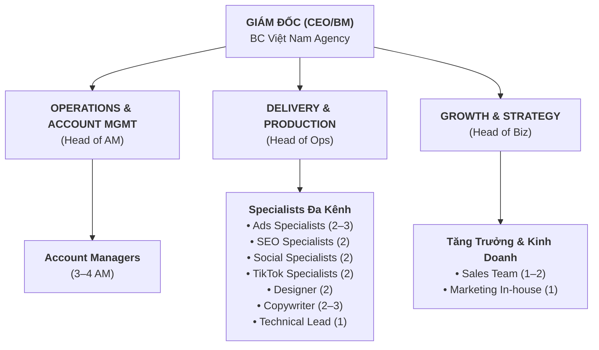
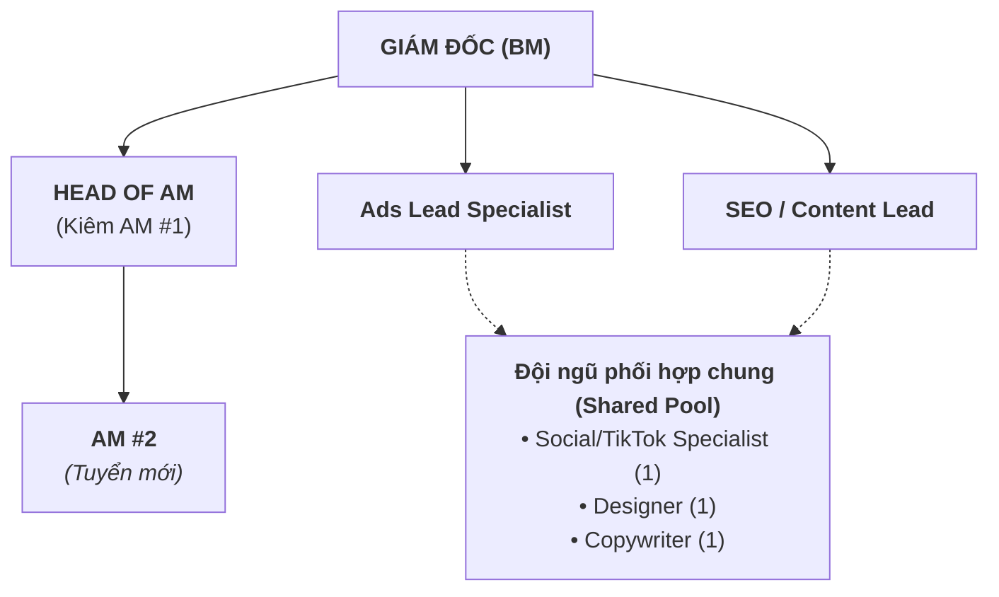
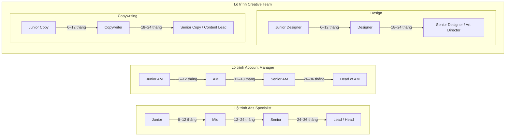

# BC VIỆT NAM – KẾ HOẠCH TUYỂN DỤNG & CƠ CẤU NHÂN SỰ
## Lộ trình xây dựng đội ngũ cho mô hình Full-Service Digital Marketing Agency
**Phiên bản:** 1.0 | **Ngày ban hành:** Tháng 9/2026 | **Kế hoạch:** 12 tháng (Q4/2026 – Q3/2027)

---

> **Mục tiêu tài liệu:** Cung cấp lộ trình chi tiết để BC Việt Nam xây dựng đội ngũ agency chuyên nghiệp, có khả năng vận hành đa dịch vụ, phục vụ 50+ khách hàng agency trong vòng 12 tháng đầu.

---

## PHẦN 1: SƠ ĐỒ TỔ CHỨC

---

### 1.1 Sơ đồ tổ chức mục tiêu (Tháng 12 – Sau 12 tháng)



**Tổng nhân sự mục tiêu (sau 12 tháng):** 18–22 người (không tính Giám đốc và nhân sự hiện có liên quan đến mảng accounts)

---

### 1.2 Sơ đồ tổ chức giai đoạn khởi đầu (Tháng 1–3)



**Nhân sự giai đoạn 1:** 6–7 người cốt lõi

---

## PHẦN 2: MÔ TẢ VỊ TRÍ & TIÊU CHÍ TUYỂN DỤNG

---

### VỊ TRÍ 01: HEAD OF ACCOUNT MANAGEMENT

**Cấp độ:** Senior / Team Lead
**Báo cáo cho:** Giám đốc
**Kiêm nhiệm giai đoạn đầu:** AM phụ trách 5–8 khách hàng đầu tiên

#### Mô tả công việc
- Xây dựng và duy trì mối quan hệ chiến lược với khách hàng (C-level contacts)
- Quản lý danh mục khách hàng của toàn bộ đội AM
- Đảm bảo KPI retention: duy trì tỷ lệ gia hạn hợp đồng ≥ 85%
- Điều phối giữa các bộ phận để đảm bảo delivery đúng hạn và đúng chất lượng
- Phát triển upsell/cross-sell opportunities trong danh mục khách hàng hiện có
- Xây dựng và chuẩn hóa quy trình Account Management
- Đào tạo và mentor AM cấp dưới
- Tham gia pitch/proposal cho các deal lớn (trị giá > 30M/tháng)

#### Yêu cầu
**Kỹ năng & Kinh nghiệm:**
- Tối thiểu 4–5 năm kinh nghiệm trong Digital Marketing / Agency
- Đã quản lý portfolio khách hàng ≥ 500M VND/năm
- Hiểu biết sâu về ít nhất 2 trong 4 lĩnh vực: Paid Ads, SEO, Social Media, TikTok
- Kỹ năng trình bày và thuyết phục ở cấp độ Director/CMO
- Tiếng Anh: đủ để giao tiếp với khách hàng quốc tế (B2+)
- Kỹ năng phân tích báo cáo và rút insight từ data

**Phẩm chất:**
- Ownership mindset – tự coi danh mục KH như "doanh nghiệp của mình"
- Proactive problem-solving thay vì đợi chỉ đạo
- Khả năng xử lý áp lực và deadlines đồng thời

**Ưu tiên thêm:**
- Đã làm tại các agency digital có tiếng (Dentsu, GroupM, PMAX, Novaon, Mango, Haravan Agency…)
- Có network trong cộng đồng marketing Việt Nam
- Có kinh nghiệm xây dựng team từ đầu

#### Quyền lợi
- **Lương cứng:** 25–40 triệu VND/tháng (thỏa thuận theo năng lực)
- **Thưởng:** 5–10% doanh thu gia tăng từ portfolio (upsell/cross-sell)
- **Performance bonus:** Quý, năm theo KPI
- Laptop + điện thoại công tác
- Ngân sách đào tạo 5 triệu/năm
- Review lương 2 lần/năm

---

### VỊ TRÍ 02: ACCOUNT MANAGER

**Cấp độ:** Junior / Mid-level
**Báo cáo cho:** Head of AM
**Phụ trách:** 8–15 khách hàng/AM (tùy scale gói dịch vụ)

#### Mô tả công việc
- Là đầu mối liên lạc chính giữa khách hàng và team BC
- Tiếp nhận brief, truyền đạt yêu cầu chính xác đến các Specialist
- Theo dõi tiến độ công việc, đảm bảo delivery đúng deadline
- Chuẩn bị và present báo cáo tháng cho khách hàng
- Xử lý yêu cầu và khiếu nại cấp độ 1
- Duy trì lịch meetings định kỳ với khách hàng
- Phối hợp onboarding khách hàng mới

#### Yêu cầu
**Kỹ năng & Kinh nghiệm:**
- 2–3 năm kinh nghiệm trong Digital Marketing hoặc Client Services
- Hiểu cơ bản về Paid Ads, SEO, Social Media (không cần chuyên sâu)
- Kỹ năng giao tiếp xuất sắc – nói và viết rõ ràng, súc tích
- Thành thạo: Google Workspace, ClickUp/Trello, Zalo Business
- Kỹ năng quản lý thời gian và multi-tasking
- Tiếng Anh: đọc hiểu tài liệu kỹ thuật (B1+)

**Phẩm chất:**
- Kiên nhẫn và khéo léo trong giao tiếp với khách hàng khó tính
- Trung thực, đặc biệt khi kết quả không như kỳ vọng
- Ham học hỏi – muốn hiểu sâu hơn về chuyên môn kỹ thuật

#### Quyền lợi
- **Lương cứng:** 12–20 triệu VND/tháng
- **KPI bonus:** 3–5 triệu/tháng khi đạt target retention
- 13 tháng lương cố định
- Cơ hội thăng tiến lên Senior AM / Head of AM

---

### VỊ TRÍ 03: PERFORMANCE ADS SPECIALIST (Meta & Google)

**Cấp độ:** Mid-level / Senior
**Báo cáo cho:** Head of Operations
**Phụ trách:** 8–12 tài khoản ads/người

#### Mô tả công việc
- Setup, vận hành và tối ưu campaigns trên Meta Ads và Google Ads
- Đề xuất strategy và cấu trúc campaign phù hợp với từng KH
- Phân tích data, rút insight và ra quyết định tối ưu hàng ngày
- Chuẩn bị báo cáo ads chi tiết tháng
- A/B test creatives và audiences liên tục
- Cập nhật kiến thức về các thay đổi chính sách & thuật toán của platform
- Phối hợp với AM để trình bày kết quả với KH

#### Yêu cầu
**Kỹ năng & Kinh nghiệm:**
- Tối thiểu 2–3 năm kinh nghiệm chạy Meta Ads và/hoặc Google Ads
- **Bắt buộc:** Đã quản lý budget ≥ 50M VND/tháng
- Hiểu sâu về: Pixel setup, CAPI, GA4, conversion tracking
- Thành thạo: Ads Manager, Google Ads, Google Analytics 4
- Khả năng đọc và phân tích data (biết dùng Google Sheets/Excel nâng cao)
- Có chứng chỉ Meta Blueprint hoặc Google Skillshop là lợi thế

**Ưu tiên thêm:**
- Có kinh nghiệm với Performance Max campaigns
- Biết cơ bản về Landing Page và CRO
- Đã làm việc với multiple clients đồng thời (agency experience)

#### Quyền lợi
- **Lương cứng:** 15–28 triệu VND/tháng (Senior: 25–35M)
- **Performance bonus:** Dựa trên ROAS improvement vs baseline
- Ngân sách test ads riêng (cho học hỏi) theo quarter

---

### VỊ TRÍ 04: TikTok ADS SPECIALIST

**Cấp độ:** Mid-level
**Báo cáo cho:** Head of Operations
**Phụ trách:** 6–10 tài khoản TikTok / accounts

#### Mô tả công việc
- Setup và vận hành TikTok Ads campaigns (Traffic, Conversion, Shop, Lead Gen)
- Quản lý TikTok Shop: product listing, order tracking, optimization
- Phối hợp với Content team để tạo ad creatives phù hợp với TikTok format
- Lập kế hoạch và hỗ trợ Livestream commerce
- Trend monitoring hàng ngày trên TikTok
- Báo cáo performance TikTok hàng tháng
- Nghiên cứu và đề xuất TikTok Creator Partnerships nếu phù hợp

#### Yêu cầu
- 1–3 năm kinh nghiệm TikTok Ads
- Sử dụng thành thạo TikTok Ads Manager, TikTok Shop Seller Center
- Hiểu TikTok algorithm và best practices content
- Biết edit video cơ bản (CapCut, Premiere) là lợi thế lớn
- Có account TikTok cá nhân với > 1,000 followers (preferred – thể hiện hiểu platform)
- Năng động, bắt kịp trend nhanh

#### Quyền lợi
- **Lương cứng:** 12–22 triệu VND/tháng
- Môi trường sáng tạo, năng động
- Cơ hội làm việc với TikTok Shop brands đang tăng trưởng mạnh

---

### VỊ TRÍ 05: SEO SPECIALIST

**Cấp độ:** Mid-level / Senior
**Báo cáo cho:** Head of Operations
**Phụ trách:** 5–8 websites/người

#### Mô tả công việc
- Technical SEO audit và on-page optimization
- Keyword research, content strategy và content calendar planning
- Backlink building (white-hat methods)
- Theo dõi và báo cáo keyword rankings hàng tuần
- Phối hợp với Copywriter để đảm bảo content SEO-friendly
- Tư vấn cho TECH về technical issues ảnh hưởng SEO
- Cập nhật kiến thức về Google algorithm updates

#### Yêu cầu
- 2–4 năm kinh nghiệm SEO
- Thành thạo: Google Search Console, GA4, Ahrefs hoặc Semrush, Screaming Frog
- Kiến thức HTML/CSS cơ bản (đủ để giao tiếp với developer)
- Có kinh nghiệm SEO cho website thương mại điện tử là lợi thế
- Biết viết content SEO cơ bản (hoặc brief copywriter hiệu quả)
- Portfolio: ít nhất 2–3 case studies SEO có kết quả rõ ràng

#### Quyền lợi
- **Lương cứng:** 13–25 triệu VND/tháng (Senior: 22–32M)
- Môi trường nghiên cứu và test nhiều
- Subscription tools (Ahrefs/Semrush) do công ty cung cấp

---

### VỊ TRÍ 06: SOCIAL MEDIA SPECIALIST

**Cấp độ:** Junior / Mid-level
**Báo cáo cho:** Head of Operations
**Phụ trách:** 8–12 fanpages / accounts

#### Mô tả công việc
- Lập kế hoạch và lịch đăng content hàng tháng
- Viết caption và quản lý lịch đăng bài (Buffer/Meta Business Suite)
- Community management: reply comments, messages hàng ngày
- Phân tích insights và điều chỉnh strategy
- Coordinate với Design/Copy team để sản xuất content đúng deadline
- Báo cáo social performance tháng

#### Yêu cầu
- 1–3 năm kinh nghiệm Social Media (ưu tiên agency experience)
- Hiểu sâu về Facebook và Instagram algorithms
- Kỹ năng viết caption sáng tạo, đúng tone of voice
- Nhạy bén với trend và thẩm mỹ tốt
- Chăm chỉ và có khả năng xử lý nhiều tài khoản song song

#### Quyền lợi
- **Lương cứng:** 10–18 triệu VND/tháng

---

### VỊ TRÍ 07: GRAPHIC DESIGNER

**Cấp độ:** Mid-level
**Báo cáo cho:** Head of Operations
**Phụ trách:** Toàn bộ creative cho portfolio KH

#### Mô tả công việc
- Thiết kế creatives cho ads (Facebook, Google Display, TikTok)
- Thiết kế content social media (static, carousel, stories)
- Thiết kế brand assets (logo phụ, banner, email template, profile picture)
- Phối hợp chặt chẽ với Copywriter và Specialist
- Maintain brand consistency cho từng KH
- Thực hiện chỉnh sửa theo feedback nhanh chóng

#### Yêu cầu
- 2–4 năm kinh nghiệm Graphic Design (ưu tiên Digital/Ads)
- Thành thạo: Adobe Photoshop, Illustrator; biết Canva, Figma
- Portfolio mạnh, đặc biệt về digital ads creatives
- Hiểu biết về digital marketing để thiết kế phù hợp với objective
- Nhanh nhẹn, chịu được deadline ngắn và nhiều revision

**Ưu tiên thêm:**
- Biết motion design / After Effects cơ bản
- Biết edit video ngắn (CapCut, Premiere)
- Có kinh nghiệm design cho ngành FMCG, thương mại điện tử

#### Quyền lợi
- **Lương cứng:** 12–22 triệu VND/tháng
- Được trang bị phần mềm Adobe Creative Suite
- Cơ hội build portfolio đa dạng ngành hàng

---

### VỊ TRÍ 08: COPYWRITER / CONTENT WRITER

**Cấp độ:** Junior / Mid-level
**Báo cáo cho:** Head of Operations
**Phụ trách:** Content cho SEO, Social Ads, Email Marketing

#### Mô tả công việc
- Viết bài SEO theo brief từ SEO Specialist (1,000–3,000 words/bài)
- Viết caption Social Media cho nhiều ngành hàng khác nhau
- Viết scripts video (TikTok, YouTube)
- Viết email marketing (newsletter, nurture sequences)
- Viết landing page copy (headline, body, CTA)
- Research và fact-checking nội dung trước khi submit

#### Yêu cầu
- 1–3 năm kinh nghiệm Copywriting / Content Marketing
- Viết tiếng Việt xuất sắc (rõ ràng, hấp dẫn, không lỗi chính tả)
- Khả năng thích nghi tone of voice theo từng brand
- Hiểu cơ bản về SEO content (keyword density, heading structure)
- Viết nhanh – target 1,500–2,500 từ có chất lượng/ngày
- Tiếng Anh: đủ để research tài liệu tiếng Anh

**Ưu tiên thêm:**
- Có kinh nghiệm viết trong nhiều ngành (không chỉ 1 niche)
- Biết dùng AI writing tools (ChatGPT, Claude) để tăng tốc (nhưng phải edit kỹ)

#### Quyền lợi
- **Lương cứng:** 9–16 triệu VND/tháng
- Môi trường học hỏi đa ngành
- Tài khoản Grammarly và AI tools công ty hỗ trợ

---

### VỊ TRÍ 09: TECH SUPPORT / MARKETING TECHNOLOGIST

**Cấp độ:** Mid-level
**Báo cáo cho:** Head of Operations (dotted line: Head of AM)
**Phụ trách:** Kỹ thuật hỗ trợ toàn bộ dịch vụ

#### Mô tả công việc
- Setup và bảo trì pixel tracking (Meta Pixel, GA4, Google Tag Manager)
- Cài đặt và configure Conversion API (CAPI)
- Hỗ trợ technical SEO fixes (do WordPress/Shopify admin)
- Setup Landing Pages (Unbounce/WordPress/Haravan)
- Tích hợp các công cụ (HubSpot CRM, Email marketing, Zalo OA)
- Hỗ trợ setup Marketing Automation workflows
- Troubleshoot các vấn đề kỹ thuật phát sinh

#### Yêu cầu
- 2+ năm kinh nghiệm Marketing Technology hoặc Web Developer
- Thành thạo: Google Tag Manager, GA4, Meta Pixel/CAPI
- Biết HTML/CSS/JavaScript cơ bản
- Có kinh nghiệm với WordPress (cài plugin, chỉnh code cơ bản)
- Hiểu biết về tracking attribution và data pipeline

**Ưu tiên thêm:**
- Kinh nghiệm với HubSpot, ActiveCampaign, hoặc GetResponse
- Biết Python/Google Apps Script cho automation
- Kinh nghiệm với Shopify/Haravan

#### Quyền lợi
- **Lương cứng:** 15–25 triệu VND/tháng

---

### VỊ TRÍ 10: BUSINESS DEVELOPMENT EXECUTIVE (BDE)

**Cấp độ:** Mid-level
**Báo cáo cho:** Giám đốc
**Mục tiêu:** Phát triển khách hàng mới cho mảng Agency Services

#### Mô tả công việc
- Phát triển và thực thi kế hoạch bán hàng B2B
- Tìm kiếm và tiếp cận khách hàng tiềm năng (outbound + inbound)
- Thực hiện demo dịch vụ và gửi proposals
- Đàm phán và chốt hợp đồng
- Phối hợp bàn giao KH mới cho đội AM
- Tham gia các sự kiện marketing/business để network
- Báo cáo pipeline hàng tuần

#### Yêu cầu
- 2–4 năm kinh nghiệm B2B Sales (ưu tiên trong ngành Digital Marketing)
- Hiểu đủ về dịch vụ digital để tư vấn thuyết phục (không cần chuyên sâu)
- Kỹ năng trình bày và đàm phán tốt
- Mạng lưới quan hệ trong cộng đồng doanh nghiệp Hà Nội/TP.HCM
- Chịu được target và áp lực doanh số

#### Quyền lợi
- **Lương cứng:** 10–18 triệu VND/tháng
- **Commission:** 3–8% doanh thu hợp đồng ký được (tháng đầu tiên)
- OTE (On-Target Earnings): 25–40 triệu/tháng

---

## PHẦN 3: LỘ TRÌNH TUYỂN DỤNG THEO GIAI ĐOẠN

---

### GIAI ĐOẠN 1: KHỞi ĐỘNG (Tháng 1–3)
**Mục tiêu:** Có đội lõi đủ để phục vụ 10–15 KH đầu tiên

| Vị trí | Số lượng | Ưu tiên | Timeline |
|--------|----------|---------|----------|
| Head of AM | 1 | 🔴 Cao nhất | Tháng 1 |
| Performance Ads Specialist | 1–2 | 🔴 Cao nhất | Tháng 1 |
| Social/TikTok Specialist | 1 | 🔴 Cao | Tháng 1–2 |
| Graphic Designer | 1 | 🔴 Cao | Tháng 1–2 |
| Copywriter | 1 | 🟠 Trung bình | Tháng 2 |
| SEO Specialist | 1 | 🟠 Trung bình | Tháng 2–3 |

**Tổng headcount Giai đoạn 1:** 6–7 người (chưa tính BM và các AM hiện có nếu có)
**Chi phí nhân sự ước tính:** 100–140 triệu VND/tháng (gross salary)

---

### GIAI ĐOẠN 2: MỞ RỘNG (Tháng 4–6)
**Mục tiêu:** Phục vụ 20–35 KH, bắt đầu chuyên môn hóa theo service line

| Vị trí | Số lượng | Trigger | Timeline |
|--------|----------|---------|----------|
| Account Manager (Junior) | 1–2 | Khi Head AM quá tải (> 12 KH) | Tháng 4 |
| Performance Ads Specialist | 1 thêm | Khi portfolio ads > 25 tài khoản | Tháng 4–5 |
| SEO Specialist | 1 thêm | Khi portfolio SEO > 8 websites | Tháng 5 |
| Graphic Designer | 1 thêm | Khi backlog design > 3 ngày | Tháng 5–6 |
| Business Dev Executive | 1 | Khi inbound không đủ để scale | Tháng 4 |

**Tổng headcount Giai đoạn 2:** 11–13 người
**Chi phí nhân sự ước tính:** 180–240 triệu VND/tháng

---

### GIAI ĐOẠN 3: CHUYÊN MÔN HÓA (Tháng 7–12)
**Mục tiêu:** Phục vụ 40–60 KH, team có chuyên môn sâu từng mảng

| Vị trí | Số lượng | Trigger | Timeline |
|--------|----------|---------|----------|
| Account Manager | 1–2 thêm | Mỗi 10 KH mới | Q3 |
| TikTok Specialist riêng | 1 | Khi TikTok > 10 accounts | Q3 |
| Tech Support / MarTech | 1 | Khi cần Marketing Automation | Q3 |
| Copywriter thêm | 1 | Khi SEO scale lên 15+ sites | Q4 |
| Head of Operations | 1 (nội bộ hoặc tuyển ngoài) | Khi team > 15 người | Q4 |

**Tổng headcount Giai đoạn 3:** 18–22 người
**Chi phí nhân sự ước tính:** 300–420 triệu VND/tháng

---

## PHẦN 4: BẢNG LƯƠNG THAM KHẢO THỊ TRƯỜNG HÀ NỘI

*(Số liệu tham khảo thị trường Q3/2026 – Digital Marketing sector, Hà Nội)*

| Vị trí | Junior (0–2 năm) | Mid-level (2–4 năm) | Senior (4+ năm) |
|--------|-----------------|--------------------|-----------------| 
| Account Manager | 10–14M | 14–22M | 22–35M |
| Head of AM | - | 25–35M | 35–55M |
| Ads Specialist (Meta/Google) | 10–15M | 15–25M | 25–40M |
| TikTok Specialist | 9–14M | 14–20M | 20–30M |
| SEO Specialist | 9–15M | 15–22M | 22–35M |
| Social Media Specialist | 8–12M | 12–18M | 18–25M |
| Graphic Designer | 9–14M | 14–22M | 20–30M |
| Copywriter | 8–12M | 12–18M | 18–25M |
| Tech/MarTech | 12–18M | 18–28M | 28–40M |
| BDE/Sales | 10–16M | 16–25M + comm | 25M+ + comm |

*Đơn vị: Triệu VND/tháng (lương gross)*
*Lưu ý: Hà Nội có mức lương cao hơn địa phương 15–25% và thấp hơn TP.HCM khoảng 10–20%*

---

## PHẦN 5: QUY TRÌNH TUYỂN DỤNG CHUẨN

---

### 5.1 Quy trình tuyển dụng (3–4 tuần)

```
Week 1: JD đăng + Thu hồ sơ
Week 2: Sàng lọc CV + Phone screen
Week 3: Interview vòng 1 + Bài test thực tế
Week 4: Interview vòng 2 (BM/Head) + Offer
```

### 5.2 Chi tiết từng bước

**Bước 1: Đăng tin tuyển dụng**
- **Kênh đăng:**
  - LinkedIn (bắt buộc cho Senior positions)
  - TopCV / VietnamWorks
  - Fanpage BC Việt Nam
  - Cộng đồng Facebook: Group Digital Marketing Vietnam, Ads Vietnam, SEO Vietnam
  - Giới thiệu nội bộ (referral bonus: 1–3 triệu/người được tuyển thành công)
- **Thời gian đăng tin:** 7–14 ngày

**Bước 2: Sàng lọc CV**
- **Thực hiện:** Head of AM (cho non-technical roles) / Lead Specialist (cho technical)
- **Tiêu chí loại nhanh:**
  - CV thiếu số liệu cụ thể (budget đã quản lý, kết quả đã đạt)
  - Job-hopping liên tục (< 6 tháng/job liên tiếp, không có lý do)
  - Không có portfolio / work samples
  - Yêu cầu lương vượt quá 20% budget
- **Target:** Giữ lại 10–15% CV để interview

**Bước 3: Phone Screen (15–20 phút)**
- **Thực hiện:** Head of AM
- **Câu hỏi cơ bản:**
  - Lý do tìm việc mới / lý do quan tâm đến BC?
  - Hiểu biết về BC Việt Nam (test: họ có research trước không?)
  - Budget quảng cáo lớn nhất từng quản lý? KPI lớn nhất đã đạt?
  - Expectation về môi trường làm việc và phát triển?
  - Salary expectation?
- **Quyết định:** Pass / Fail / Hold

**Bước 4: Bài test thực tế**
- **Thời gian hoàn thành:** 2–3 ngày
- **Paid test:** BC Việt Nam có thể trả 500K–1M cho ứng viên Senior hoàn thành test (policy tự quyết định)

| Vị trí | Nội dung bài test |
|--------|------------------|
| AM | Phân tích case study KH, đề xuất kế hoạch, chuẩn bị present |
| Ads Specialist | Audit tài khoản ads mẫu, đề xuất cải thiện có số liệu cụ thể |
| SEO Specialist | Audit website mẫu, lập keyword plan + content calendar |
| Social Specialist | Lập content calendar 1 tháng cho brand mẫu |
| Designer | Thiết kế 3–5 creatives theo brief cho brand mẫu |
| Copywriter | Viết 1 bài SEO (800 chữ) + 5 captions Facebook theo brief |

**Bước 5: Interview vòng 1 (60 phút)**
- **Người interview:** Head AM hoặc Lead Specialist
- **Format:**
  - 15 phút: Walk-through portfolio/kinh nghiệm
  - 25 phút: Review bài test + deep dive
  - 15 phút: Culture fit, values, career goals
  - 5 phút: Q&A từ ứng viên

**Bước 6: Interview vòng 2 (30–45 phút)**
- **Người interview:** Giám đốc (BM)
- **Focus:**
  - Alignment với vision và giá trị BC Việt Nam
  - Long-term commitment và career development
  - Negotiation và offer

**Bước 7: Offer & Onboarding**
- Gửi offer letter bằng văn bản trong 24h sau quyết định
- Offer có hiệu lực 3 ngày làm việc
- Notice period tôn trọng tối đa 30 ngày
- Bắt đầu Internal Onboarding (xem SOP-01 cho internal version)

---

## PHẦN 6: KHU VỰC KHÓ TUYỂN & GIẢI PHÁP

---

### Vị trí khó tuyển nhất: Senior Ads Specialist & Head of AM

**Lý do khó:**
- Senior Ads giỏi thường ở agency lớn hoặc in-house với mức lương cao
- Head of AM cần vừa kỹ năng technical vừa client management – rare combo

**Giải pháp:**
1. **Tuyển từ cấp dưới và đào tạo:** Tuyển Mid-level giỏi, đặt lộ trình rõ ràng để promote sau 12–18 tháng
2. **Employer Branding:** Đầu tư vào content "Làm việc tại BC Việt Nam" – LinkedIn posts về culture, growth stories, team events
3. **Referral Network:** Head of AM và Giám đốc chủ động network trong cộng đồng agency
4. **Linh hoạt về remote/hybrid:** Cho phép làm việc remote 2–3 ngày/tuần để mở rộng pool ứng viên
5. **Freelancer trước, full-time sau:** Thử nghiệm với senior freelancers trong 1–3 tháng trước khi offer full-time

---

### Chiến lược Employer Branding

**Giai đoạn 1 (Tháng 1–3):**
- Cập nhật LinkedIn Company Page BC Việt Nam với đầy đủ thông tin
- Đăng 2–4 posts/tháng về văn hóa công ty, dự án thú vị, team members
- Tạo trang Tuyển dụng trên website với JDs rõ ràng và hình ảnh team thực tế

**Giai đoạn 2 (Tháng 4–6):**
- Chia sẻ case studies dịch vụ thành công (với sự đồng ý của KH)
- Tạo "Day in the life" content về các vị trí trong agency
- Tham gia các events marketing: Digital Marketing Vietnam Summit, ads conferences…

---

## PHẦN 7: CHƯƠNG TRÌNH ĐÀO TẠO & PHÁT TRIỂN NỘI BỘ

---

### 7.1 Onboarding mới (30 ngày đầu)

**Tuần 1: Orientation**
- Giới thiệu về BC Việt Nam: lịch sử, sứ mệnh, dịch vụ, văn hóa
- Giới thiệu toàn bộ team và cơ cấu tổ chức
- Setup công cụ: ClickUp, Slack, Google Workspace, Drive
- Đọc và ký: SOP tài liệu, NDA, quy định bảo mật

**Tuần 2–3: Shadowing**
- Theo dõi senior team member thực hiện công việc thực tế
- Tham gia ít nhất 2 cuộc họp KH (observer)
- Làm quen với 2–3 portfolio KH hiện tại

**Tuần 4: Thực hành có giám sát**
- Tự thực hiện task với senior review
- Nhận 1–2 KH đầu tiên (dưới sự giám sát)
- Feedback session cuối tuần với Head/Manager

### 7.2 Đào tạo liên tục

| Loại | Tần suất | Hình thức |
|------|----------|-----------|
| Platform Updates (Meta, Google, TikTok) | Khi có thay đổi lớn | Internal briefing 30 phút |
| Tool Training | Hàng quý | Workshop nội bộ 2h |
| Case Study Review | Hàng tháng | Team meeting 1h |
| External Courses | Tự đăng ký, công ty hỗ trợ | Budget 2–5M/người/năm |
| Conference/Summit | Khi có cơ hội | Company sponsor 1–2 người |

### 7.3 Lộ trình thăng tiến rõ ràng



---

## PHẦN 8: KPI ĐO LƯỜNG NHÂN SỰ

---

### 8.1 KPIs theo vị trí

| Vị trí | KPI chính | Target |
|--------|-----------|--------|
| AM | Client retention rate | ≥ 85%/năm |
| AM | NPS (Net Promoter Score) từ KH | ≥ 8/10 |
| AM | Upsell revenue | ≥ 15% revenue portfolio/năm |
| Ads Specialist | ROAS improvement vs baseline | ≥ +20% after 3 months |
| Ads Specialist | CPA reduction vs baseline | ≥ -15% after 3 months |
| SEO Specialist | Organic traffic growth | ≥ +40% after 6 months |
| Social Specialist | Engagement rate trend | ≥ +10% MoM |
| Designer | Revision rounds/project | ≤ 2 rounds average |
| Copywriter | SEO content performance | ≥ 30% articles rank top 20 (3 months) |
| BDE | Monthly new client revenue | Target theo quý |

### 8.2 Performance Review

- **Review định kỳ:** Tháng 3 (6 tháng sau join), sau đó mỗi 6 tháng
- **Review đột xuất:** Khi có vấn đề nghiêm trọng hoặc cần đánh giá cho promotion
- **Format review:** Self-assessment + Manager assessment + Peer feedback (360°)
- **Link với lương thưởng:** Review kết quả quyết định % tăng lương và bonus

---

## PHẦN 9: NGÂN SÁCH NHÂN SỰ DỰ KIẾN

---

### 9.1 Tổng chi phí nhân sự theo giai đoạn

*(Ước tính chi phí tổng – bao gồm gross salary + BHXH + thuế + phúc lợi)*

| Giai đoạn | Headcount | Chi phí/tháng | Chi phí/quý |
|-----------|-----------|--------------|-------------|
| Giai đoạn 1 (T1–3) | 6–7 người | 130–170 triệu | 390–510 triệu |
| Giai đoạn 2 (T4–6) | 11–13 người | 220–290 triệu | 660–870 triệu |
| Giai đoạn 3 (T7–12) | 18–22 người | 380–500 triệu | 1.14–1.5 tỷ |

*Lưu ý: Chưa tính lương Ban Giám đốc và nhân sự hiện có của BC Việt Nam*

### 9.2 Chi phí tuyển dụng ước tính

| Hạng mục | Chi phí/người | Ghi chú |
|----------|--------------|---------|
| Đăng tin (TopCV/LinkedIn) | 0–3 triệu/vị trí | Gói cơ bản vs premium |
| Test materials/screening | 0.5–1 triệu/vị trí | Bài test, công cụ |
| Onboarding cost | 2–5 triệu/người | Training, setup tools |
| **Tổng trung bình** | **3–9 triệu/vị trí** | |

---

## PHẦN 10: VĂN HÓA CÔNG TY & GIÁ TRỊ CỐT LÕI

---

### 10.1 Giá trị cốt lõi BC Việt Nam Agency

**1. PERFORMANCE-FIRST**
Mọi quyết định đều dựa trên data và kết quả đo được. Không làm việc đẹp trên giấy tờ – chỉ theo đuổi hiệu quả thực tế.

**2. HONEST & TRANSPARENT**
Trung thực với khách hàng về kết quả, dù tốt hay xấu. Trung thực với nhau trong nội bộ. Không "đánh bóng" sự thật.

**3. OWNERSHIP**
Tự coi công việc của mình là "doanh nghiệp nhỏ" – chủ động, sáng tạo giải pháp và chịu trách nhiệm đến cùng.

**4. NEVER STOP LEARNING**
Ngành digital thay đổi mỗi tháng – người giỏi nhất là người luôn học. Thử nghiệm, fail nhanh, học nhanh.

**5. CLIENT OBSESSION**
Khách hàng thành công → BC thành công. Luôn đặt lợi ích khách hàng làm trung tâm trong mọi quyết định.

### 10.2 Môi trường làm việc

- **Hybrid flexible:** Core hours 9:00–17:00, cho phép remote 2 ngày/tuần (sau probation)
- **Flat hierarchy:** Ý kiến mọi cấp đều được lắng nghe – không có "silo"
- **Transparent:** P&L và roadmap chia sẻ với toàn team hàng quý
- **No-blame culture:** Khi có vấn đề, tập trung giải quyết và học hỏi – không tìm người để đổ lỗi
- **Celebration:** Ăn mừng wins dù nhỏ – team lunch, shoutout trên Slack, bonus nhỏ

---

*Tài liệu này thuộc quyền sở hữu của BC Việt Nam. Nội dung mang tính bảo mật nội bộ.*
*Cập nhật lần gần nhất: Tháng 9/2026 | Phiên bản tiếp theo: Review sau 6 tháng triển khai*

---
**BC VIỆT NAM – The Performance-First Growth Agency**
*Kế hoạch Nhân sự v1.0 | 2026–2027*
