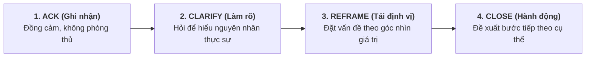
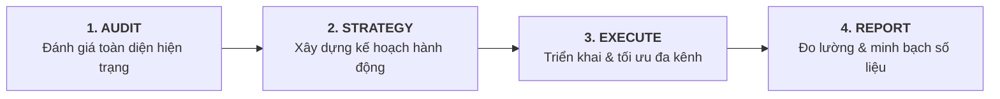

# BC VIỆT NAM – BỘ TÀI LIỆU BÁN HÀNG (SALES KIT)
## Công cụ bán hàng toàn diện cho mô hình Full-Service Agency
**Phiên bản:** 1.0 | **Ngày ban hành:** Tháng 9/2026 | **Áp dụng:** Đội Sales & AM

---

> **Mục tiêu tài liệu:** Trang bị cho đội ngũ Sales và Account Manager bộ công cụ đầy đủ để chuyển đổi lead thành khách hàng ký hợp đồng – từ câu chuyện thương hiệu, kịch bản gọi điện, xử lý phản đối đến template proposal và email nurturing.

---

## MỤC LỤC

| Phần | Nội dung |
|------|----------|
| Phần 1 | Câu chuyện thương hiệu & Elevator Pitch |
| Phần 2 | Kịch bản Sales Call (Discovery Call) |
| Phần 3 | Template Proposal / Báo giá |
| Phần 4 | Xử lý phản đối (Objection Handling) |
| Phần 5 | Email Templates (Nurturing & Follow-up) |
| Phần 6 | Pitch Deck Script (Presentation Guide) |
| Phần 7 | Tài liệu hỗ trợ bán hàng |

---

---

# PHẦN 1: CÂU CHUYỆN THƯƠNG HIỆU & ELEVATOR PITCH

---

## 1.1 Định vị thương hiệu cốt lõi

**BC Việt Nam là ai?**

> "BC Việt Nam là Full-Service Digital Marketing Agency đầu tiên tại Việt Nam kết hợp lợi thế độc quyền về hạ tầng quảng cáo quốc tế (2,600+ tài khoản ads chất lượng cao trên 12 nền tảng) với dịch vụ Marketing được thực thi bởi đội chuyên gia performance – giúp doanh nghiệp SME tăng trưởng doanh thu đo được, không phải chỉ đẹp trên báo cáo."

**Tagline chính:** *"The Performance-First Growth Agency"*

**3 điều BC khác biệt so với mọi agency khác:**
1. **AdAccess Advantage™** – Bạn không cần lo về tài khoản quảng cáo bị khoá, bị vá, hay bị hạn chế. BC cung cấp cả tài khoản + dịch vụ trong một gói.
2. **SME Obsession** – Trong khi các agency lớn chạy theo enterprise, BC tập trung 100% vào SME – hiểu sâu hơn, chăm hơn, kết quả phù hợp hơn.
3. **International Experience** – 8 năm, 1,000+ khách hàng quốc tế, 12 nền tảng. Kiến thức global, thực thi local.

---

## 1.2 Elevator Pitch (Theo từng tình huống)

### Tình huống 1: Gặp gỡ ngắn tại sự kiện (30 giây)

> "BC Việt Nam là agency performance marketing. Chúng tôi giúp các doanh nghiệp SME chạy quảng cáo hiệu quả hơn và tăng doanh thu thực tế – không phải chỉ tăng likes hay impressions. Điểm đặc biệt là chúng tôi cung cấp cả tài khoản quảng cáo chuẩn quốc tế lẫn dịch vụ thực thi trong một gói, nên khách hàng không cần phải lo lắng về chuyện tài khoản bị khoá giữa chừng. Anh/chị đang chạy ads trên kênh nào?"

### Tình huống 2: Trả lời "Bạn làm gì?" (60 giây)

> "Tôi làm ở BC Việt Nam – chúng tôi là Full-Service Digital Marketing Agency. Thay vì chỉ nhận tiền và chạy ads, chúng tôi đồng hành với khách hàng từ đầu đến cuối: từ strategy, ads, SEO, social media, đến TikTok Shop và báo cáo kết quả minh bạch hàng tháng.
>
> Điều làm chúng tôi khác là chúng tôi có 2,600+ tài khoản quảng cáo ổn định trên 12 platform – Meta, Google, TikTok, thậm chí Pinterest và Kwai. Nhiều doanh nghiệp khi tự chạy ads bị khoá tài khoản liên tục, với chúng tôi điều đó không xảy ra.
>
> Chúng tôi phục vụ từ startup đến doanh nghiệp vừa với ngân sách từ 30 triệu đến vài trăm triệu mỗi tháng. Anh/chị đang kinh doanh ngành gì?"

### Tình huống 3: Cold Email / LinkedIn Message (3 dòng)

> "BC Việt Nam giúp doanh nghiệp [ngành của họ] tăng doanh số từ kênh digital – với cam kết rõ ràng về kết quả và báo cáo minh bạch.
>
> Chúng tôi vừa giúp một khách hàng [ngành tương tự] tăng ROAS từ 2x lên 5x trong 3 tháng bằng cách tái cấu trúc toàn bộ chiến dịch ads.
>
> Anh/chị có 15 phút để tôi chia sẻ cách chúng tôi có thể làm được điều tương tự không?"

---

## 1.3 Chân dung khách hàng lý tưởng (ICP)

### ICP 1: SME đang chạy ads tự túc

**Profile:**
- Doanh nghiệp 5–200 nhân viên
- Doanh thu 2–50 tỷ/năm
- Đang tự chạy Meta/Google Ads hoặc thuê freelancer
- Ngân sách ads 30–150 triệu/tháng
- **Pain points:** ROAS thấp, tài khoản bị khoá thường xuyên, không có thời gian tối ưu, kết quả không ổn định

**Trigger mua hàng:** Tài khoản vừa bị khoá / Không đạt target / Freelancer nghỉ / Muốn scale nhưng không biết cách

---

### ICP 2: Doanh nghiệp chuẩn bị launch hoặc scale

**Profile:**
- Startup Series A hoặc doanh nghiệp mở thêm ngành hàng mới
- Chưa có đội marketing in-house mạnh
- Budget: 50–200 triệu/tháng (sẵn sàng đầu tư)
- **Pain points:** Không biết bắt đầu từ đâu, sợ lãng phí, cần đối tác đáng tin cậy

---

### ICP 3: Agency hoặc Brand đang tìm White-label Partner

**Profile:**
- Agency nhỏ không có chuyên môn ads/SEO/TikTok
- Brand team nhỏ cần outsource một phần công việc
- **Pain points:** Thiếu chuyên môn, không muốn tuyển thêm người, cần partner discreet và professional

---

---

# PHẦN 2: KỊCH BẢN SALES CALL (DISCOVERY CALL)

**Thời gian:** 30–45 phút
**Mục tiêu:** Hiểu vấn đề của prospect, qualify, và tạo cơ hội present solution

---

## 2.1 Chuẩn bị trước cuộc gọi (15 phút)

**Checklist:**
- ☐ Research website của prospect (tốc độ, chất lượng content, SEO)
- ☐ Check Facebook Ads Library – họ đang chạy ads không? Chạy gì?
- ☐ Check fanpage/TikTok – engagement thế nào?
- ☐ Google tên brand – có xuất hiện top không?
- ☐ Hiểu ngành của họ (đối thủ chính là ai?)
- ☐ Chuẩn bị 2–3 insight hoặc câu hỏi thông minh liên quan đến ngành của họ
- ☐ Mở sẵn: template ghi chú, link lịch demo nếu cần

---

## 2.2 Kịch bản Discovery Call chi tiết

### MỞ ĐẦU (3–5 phút)

**[Sau câu chào hỏi cơ bản]**

*"Cảm ơn anh/chị đã dành thời gian. Tôi biết thời gian của mình và anh/chị đều quý, nên tôi muốn đảm bảo cuộc trò chuyện này thực sự có giá trị cho hai bên.*

*Tôi có 3 câu hỏi nhanh để hiểu hơn về tình hình hiện tại của anh/chị – sau đó nếu phù hợp, tôi sẽ chia sẻ cụ thể cách BC Việt Nam có thể giúp được. Được không ạ?"*

**[Chờ xác nhận. Nếu họ nói "được" → tiếp tục]**

---

### PHẦN 1: DISCOVERY – HIỂU VẤN ĐỀ (15–20 phút)

**Câu hỏi 1 – Tình hình hiện tại:**

*"Anh/chị đang triển khai marketing online như thế nào? Đang tự làm, thuê freelancer, hay có agency đang làm?"*

→ *Lắng nghe, ghi chú. Hỏi sâu hơn: "Với cách làm hiện tại, anh/chị thấy kết quả như thế nào?"*

**Câu hỏi 2 – Pain Point:**

*"Nếu có 1 thứ trong marketing hiện tại anh/chị muốn thay đổi ngay bây giờ, đó là gì?"*

→ *Đây là câu quan trọng nhất. Lắng nghe kỹ, đừng ngắt lời. Ghi nguyên văn pain point của họ để dùng sau.*

**Câu hỏi 3 – Target & Budget:**

*"Về phía kết quả, anh/chị đang target khoảng bao nhiêu leads/đơn hàng/doanh số mỗi tháng từ kênh digital?"*

→ Sau đó: *"Ngân sách marketing hàng tháng anh/chị đang đầu tư vào khoảng bao nhiêu?"*

**Câu hỏi 4 – Timeline & Decision:**

*"Nếu chúng tôi có giải pháp phù hợp, anh/chị muốn triển khai trong khoảng thời gian nào? Và trong việc quyết định hợp tác với agency mới, thường ai là người quyết định chính?"*

---

### PHẦN 2: PRESENT SOLUTION (10–15 phút)

**[Transition sau khi đã hiểu pain points]**

*"Cảm ơn anh/chị đã chia sẻ. Để tôi tóm tắt lại những gì tôi nghe: [TÓM TẮT 2–3 VẤN ĐỀ CHÍNH HỌ NÊU] – có đúng không ạ?"*

**[Chờ xác nhận → Tiếp tục]**

*"Đây là vấn đề mà chúng tôi gặp thường xuyên với nhiều khách hàng cùng ngành. Để giải quyết cụ thể tình huống của anh/chị, tôi nghĩ [TÊN GÓI DỊCH VỤ] sẽ phù hợp nhất. Để tôi giải thích nhanh tại sao…"*

**[Trình bày 3–4 điểm về solution – LIÊN HỆ TRỰC TIẾP với pain point họ vừa nêu]**

---

### PHẦN 3: OBJECTION HANDLING & NEXT STEPS (5–10 phút)

*"Anh/chị có câu hỏi gì về những gì tôi vừa chia sẻ không?"*

→ Xử lý objections (xem Phần 4)

**Close:**

*"Tôi muốn đề xuất bước tiếp theo là tôi chuẩn bị một proposal cụ thể cho trường hợp của anh/chị – bao gồm plan triển khai và mức đầu tư. Thường tôi cần 2–3 ngày làm việc. Anh/chị có muốn gặp lại vào thứ [X] để tôi trình bày không?"*

*Hoặc nếu họ đã sẵn sàng:*

*"Nếu anh/chị muốn bắt đầu ngay, chúng tôi có thể kickoff trong tuần tới. Bước đầu tiên là tôi gửi anh/chị hợp đồng và checklist thông tin cần cung cấp. Anh/chị có muốn tôi gửi hôm nay không?"*

---

## 2.3 Red Flags – Dấu hiệu không phải KH lý tưởng

| Dấu hiệu | Hành động |
|----------|-----------|
| Budget < 20 triệu/tháng | Giới thiệu gói nhỏ nhất hoặc từ chối lịch sự |
| "Tôi muốn thấy kết quả trong 2 tuần" (cho SEO) | Educate về timeline thực tế, nếu vẫn không chấp nhận → từ chối |
| "Agency cũ toàn thất hứa" (3+ agency) | Explore kỹ hơn: do kỳ vọng không thực tế hay do agency kém? |
| Không thể/không muốn cung cấp quyền truy cập tài khoản | Non-starter – không thể tối ưu mà không có quyền truy cập |
| Muốn thanh toán hoàn toàn theo performance (% doanh thu) | Không phù hợp với mô hình BC – giải thích rõ và từ chối |
| Người ra quyết định không tham dự buổi call/demo | Yêu cầu schedule lại khi có decision maker |

---

---

# PHẦN 3: TEMPLATE PROPOSAL / BÁO GIÁ

---

## 3.1 Cấu trúc Proposal chuẩn

Một Proposal chuyên nghiệp của BC Việt Nam gồm **6 phần**:

---

**[TRANG BÌA]**
```
BC VIỆT NAM
Proposal dịch vụ Digital Marketing
Dành cho: [Tên Công ty KH]
Ngày: [DD/MM/YYYY]
Chuẩn bị bởi: [Tên AM] | BC Việt Nam
Hiệu lực đến: [DD/MM/YYYY – thường 14 ngày]
```

---

**PHẦN 1: HiỂU VỀ DOANH NGHIỆP CỦA ANH/CHỊ**

*Mục tiêu: Thể hiện rằng BC đã lắng nghe và hiểu thực sự*

```
Dựa trên cuộc trao đổi của chúng ta vào ngày [X], chúng tôi hiểu rằng:

THỰC TRẠNG HIỆN TẠI:
• [Tóm tắt tình hình marketing hiện tại của KH – nguyên văn từ discovery call]
• [Vấn đề 1 họ đang gặp]
• [Vấn đề 2 họ đang gặp]

MỤC TIÊU:
• [Target KPI cụ thể họ muốn đạt]
• [Timeline họ mong muốn]
• [Budget họ sẵn sàng đầu tư]
```

---

**PHẦN 2: GIẢI PHÁP ĐỀ XUẤT**

```
GÓI DỊCH VỤ ĐỀ XUẤT: [Tên gói]

Dựa trên vấn đề của [Tên KH], chúng tôi đề xuất:

1. [Dịch vụ 1] – [Mô tả ngắn lý do tại sao phù hợp]
2. [Dịch vụ 2] – [Mô tả ngắn]
3. [Dịch vụ 3] – [Mô tả ngắn]

DELIVERABLES HÀNG THÁNG:
☑ [Deliverable cụ thể 1]
☑ [Deliverable cụ thể 2]
☑ [Deliverable cụ thể 3]
☑ Báo cáo hiệu quả hàng tháng kèm cuộc họp review
☑ Đầu mối liên hệ chuyên trách – phản hồi trong vòng 4h
```

---

**PHẦN 3: KẾT QUẢ KỲ VỌNG (KPI TARGETS)**

```
DỰA TRÊN KINH NGHIỆM VỚI KHÁCH HÀNG CÙNG NGÀNH:

Tháng 1–2 (Foundation):
• [KPI 1]: [Baseline → Target]
• [KPI 2]: [Baseline → Target]

Tháng 3–6 (Growth):
• [KPI 1]: [Target nâng cao]
• [KPI 2]: [Target nâng cao]

LƯU Ý QUAN TRỌNG: Kết quả thực tế phụ thuộc vào ngân sách, chất lượng sản phẩm/
dịch vụ và tốc độ phê duyệt nội dung. Các con số trên là kỳ vọng hợp lý dựa trên benchmark
ngành – không phải cam kết tuyệt đối.
```

---

**PHẦN 4: VỀ BC VIỆT NAM**

```
TẠI SAO CHỌN BC VIỆT NAM?

✅ 8+ năm kinh nghiệm | 1,000+ khách hàng quốc tế | 2,600+ tài khoản ads
✅ Team chuyên gia chuyên sâu từng dịch vụ, không làm "kiểu agency đại trà"
✅ Báo cáo minh bạch hàng tháng – bạn hiểu từng đồng đang đi đâu
✅ Cam kết phản hồi trong 4h làm việc, không mất liên lạc sau khi ký hợp đồng
✅ Lợi thế AdAccess™ – tài khoản quảng cáo ổn định, không lo bị khoá giữa chừng

[CASE STUDY – Khách hàng cùng ngành, nếu có]
"[Tên brand/ngành] – Tăng ROAS từ X lên Y trong Z tháng"
[2–3 dòng mô tả ngắn về vấn đề, giải pháp, kết quả]
```

---

**PHẦN 5: GÓI DỊCH VỤ & ĐẦU TƯ**

```
GÓI [TÊN GÓI] – [MỨC GIÁ]/THÁNG

Bao gồm:
✅ [Dịch vụ/deliverable 1]
✅ [Dịch vụ/deliverable 2]
✅ [Dịch vụ/deliverable 3]
✅ Báo cáo Looker Studio real-time
✅ Monthly review meeting
✅ Dedicated AM

Không bao gồm:
❌ Ngân sách quảng cáo (Ad spend – KH tự nộp vào tài khoản)
❌ [Dịch vụ ngoài scope]

ĐIỀU KHOẢN:
• Hợp đồng tối thiểu: [X] tháng (đối với SEO: tối thiểu 6 tháng)
• Thanh toán: Đầu tháng (ngày 1–5 hàng tháng)
• Hình thức: Chuyển khoản ngân hàng
• Tăng giảm scope: Thông báo trước 30 ngày

GÓI PHÙ HỢP KHI SCALE:
[Tên gói cao hơn]: [Mức giá]/tháng → Bổ sung thêm [dịch vụ extra]
```

---

**PHẦN 6: BƯỚC TIẾP THEO**

```
ĐỂ BẮT ĐẦU HỢP TÁC:

Bước 1: Anh/chị xác nhận đồng ý với proposal này
Bước 2: Ký hợp đồng dịch vụ (BC sẽ gửi trong vòng 24h)
Bước 3: Thanh toán tháng đầu tiên
Bước 4: Kick-off onboarding (trong vòng 3 ngày làm việc)
Bước 5: Bắt đầu triển khai!

Anh/chị có câu hỏi gì về proposal này không?
Chúng tôi rất mong được đồng hành cùng [Tên KH].

[Tên AM] | BC Việt Nam
📞 [Số điện thoại]
📧 [Email]
🌐 bcagency.vn
```

---

## 3.2 Bảng Estimate Sheet nhanh

*(Dùng khi KH hỏi giá ngay trong cuộc gọi – trước khi làm proposal chính thức)*

```
GÓI               | MỨC ĐẦU TƯ    | PHÙ HỢP KHI
------------------|---------------|---------------------------
Performance Ads   | 8–50M/tháng   | Budget ads > 30M/tháng
SEO & Content     | 8–55M/tháng   | Muốn traffic organic dài hạn
Social Media      | 6–40M/tháng   | Cần xây dựng brand & community
TikTok Commerce   | 8–65M/tháng   | Có sản phẩm phù hợp TikTok Shop
Total Growth™     | 35–200M/tháng | Muốn đa kênh, toàn diện
```

---

---

# PHẦN 4: XỬ LÝ PHẢN ĐỐI (OBJECTION HANDLING)

---

## Nguyên tắc xử lý phản đối

**Framework: ACK → CLARIFY → REFRAME → CLOSE**



1. **ACK (Ghi nhận):** Đồng cảm, không phòng thủ
2. **CLARIFY (Làm rõ):** Hỏi để hiểu phản đối thực sự là gì
3. **REFRAME (Tái định vị):** Đặt vấn đề theo góc nhìn khác
4. **CLOSE (Đề xuất bước tiếp theo):** Dẫn dắt về phía hành động

---

## Phản đối 1: "GIÁ QUÁ CAO"

**Script xử lý:**

*"Cảm ơn anh/chị đã thẳng thắn. Tôi muốn hỏi thêm một chút: khi anh/chị nói 'giá cao', anh/chị đang so sánh với budget hiện tại, hay với một offer khác cụ thể?"*

**[Lắng nghe – thường sẽ là 1 trong 2 trường hợp:]**

**Trường hợp A: So với freelancer/tự làm**

*"Tôi hiểu. Freelancer thường charge ít hơn vì chi phí vận hành thấp hơn. Nhưng hãy để tôi hỏi: với cách làm hiện tại, kết quả đang như thế nào? Nếu freelancer đang mang lại ROAS 3x, chúng tôi không cần nói chuyện. Nhưng nếu kết quả đang không như kỳ vọng, thì 'tiết kiệm' phí agency mà mất doanh thu thực ra đắt hơn nhiều."*

**Trường hợp B: So với agency khác offer thấp hơn**

*"Nếu có chỗ charge rẻ hơn nhưng offer tương đương, anh/chị nên đi chỗ đó. Nhưng thường thì mức phí phản ánh mức dịch vụ. Tôi muốn hỏi cụ thể: họ offer những gì trong mức giá đó? Thường các điểm khác nhau sẽ ở: kinh nghiệm team, số tài khoản quản lý cùng lúc, tốc độ phản hồi và chất lượng báo cáo."*

**Close:**

*"Nếu budget thực sự là rào cản, chúng tôi có gói nhỏ hơn để bắt đầu – sau đó mình có thể scale khi anh/chị thấy kết quả. Anh/chị muốn tôi show gói phù hợp với budget hiện tại không?"*

---

## Phản đối 2: "TÔI ĐÃ THỬ AGENCY RỒI, KHÔNG HIỆU QUẢ"

**Script xử lý:**

*"Tôi hoàn toàn hiểu sự thất vọng đó. Thật ra rất nhiều khách hàng của chúng tôi từng có trải nghiệm tương tự trước khi đến với BC. Tôi muốn hỏi: agency trước của anh/chị đã gặp vấn đề gì cụ thể?"*

**[Lắng nghe kỹ – identify root cause]**

| Root cause thường gặp | Cách reframe |
|----------------------|-------------|
| Không có báo cáo rõ ràng | "Ở BC, mỗi tháng anh/chị nhận dashboard real-time + báo cáo chi tiết + họp review. Không có con số nào bị giấu." |
| Người phụ trách thay đổi liên tục | "Anh/chị sẽ có 1 AM chuyên trách duy nhất + số điện thoại direct. Nếu AM có việc, có người backup ngay." |
| Kết quả không cải thiện | "Chúng tôi làm monthly audit và điều chỉnh strategy – không phải setup 1 lần rồi để đó chạy mãi." |
| Agency không hiểu ngành | "Trước khi onboard, chúng tôi dành 1 tuần research ngành và audit toàn bộ tài khoản của anh/chị." |

**Close:**

*"Đây là lý do chúng tôi muốn đề xuất: Thay vì cam kết ngay 6 tháng, anh/chị thử với chúng tôi 3 tháng. Cuối tháng 3, nếu kết quả không theo hướng đúng, chúng tôi sẽ hoàn toàn hiểu nếu anh/chị không muốn gia hạn. Fair enough không?"*

---

## Phản đối 3: "TÔI CẦN NGHĨ THÊM / HỎI Ý KIẾN"

**Script xử lý:**

*"Tất nhiên, đây là quyết định quan trọng. Tôi muốn đảm bảo anh/chị có đủ thông tin để quyết định. Có điều gì cụ thể mà anh/chị chưa rõ, hoặc còn băn khoăn không?"*

**[Lắng nghe – thường sẽ có underlying objection khác]**

Nếu họ cần hỏi ý kiến người khác:

*"Hoàn toàn hợp lý. Tôi có thể chuẩn bị một tóm tắt ngắn để anh/chị chia sẻ với [chồng/vợ/đối tác] không? Và nếu có thể sắp xếp một buổi ngắn để tôi trực tiếp trình bày cho cả hai bên, sẽ tiết kiệm thời gian hơn nhiều."*

**Close:**

*"Để không kéo dài, tôi sẽ follow up vào [ngày cụ thể]. Thường thì cần bao nhiêu thời gian để anh/chị có thể ra quyết định?"*

---

## Phản đối 4: "TÔI MUỐN ĐỢI ĐẾN [QUÝ SAU / SAU TẾT / SAU DỰ ÁN NÀY]"

**Script xử lý:**

*"Tôi hiểu, timing quan trọng. Tôi muốn chia sẻ một góc nhìn: thường thì SEO và ads cần 2–3 tháng để warm up và cho thấy kết quả rõ. Nếu anh/chị muốn thấy kết quả vào [thời điểm họ đề cập], thì thực ra mình cần bắt đầu từ bây giờ."*

*Hoặc:* *"Khi chờ đến quý sau, anh/chị đang để đối thủ có thêm 3 tháng để xây dựng vị thế trên các kênh đó. Câu hỏi không phải là 'có nên làm không' mà là 'bắt đầu khi nào sẽ thiệt thòi ít nhất'."*

---

## Phản đối 5: "CÔNG TY TÔI ĐÃ CÓ NGƯỜI LÀM MARKETING IN-HOUSE"

**Script xử lý:**

*"Tuyệt vời – thực ra nhiều khách hàng tốt nhất của chúng tôi có đội marketing in-house. Họ dùng BC như một arm mở rộng – để làm các phần đòi hỏi chuyên môn sâu (như Performance Max, technical SEO, TikTok Shop) mà in-house thường không có đủ bandwidth hoặc expertise."*

*"Đội in-house của anh/chị hiện đang phụ trách gì? Và phần nào họ muốn có support thêm?"*

---

## Phản đối 6: "TÔI KHÔNG CHẮC DIGITAL MARKETING CÓ HIỆU QUẢ VỚI NGÀNH CỦA TÔI"

**Script xử lý:**

*"Đây là quan điểm tôi gặp khá thường trong [ngành của họ]. Anh/chị có thể cho tôi biết lý do anh/chị nghĩ vậy? Đã thử chưa, hay là chưa thử bao giờ?"*

**[Nếu đã thử và không hiệu quả:]** → Quay lại framework Phản đối 2

**[Nếu chưa thử:]**

*"Hãy để tôi chia sẻ nhanh 1–2 case study trong ngành tương tự. Thường khi nói 'ngành này không làm digital được', thực ra là 'chúng tôi chưa tìm được cách làm phù hợp với ngành.' Đây là những gì đã work với [ngành tương tự]..."*

---

---

# PHẦN 5: EMAIL TEMPLATES (NURTURING & FOLLOW-UP)

---

## Email 1: Sau buổi Discovery Call

**Gửi trong: 2 giờ sau cuộc gọi**

```
Subject: Tóm tắt buổi trò chuyện & Bước tiếp theo | BC Việt Nam

Kính gửi Anh/Chị [Tên],

Cảm ơn anh/chị đã dành thời gian trao đổi hôm nay – rất vui được
lắng nghe về [Tên công ty].

Để tóm tắt những gì chúng ta đã thảo luận:

📌 Vấn đề anh/chị đang gặp:
• [Vấn đề 1 – nguyên văn từ ghi chú]
• [Vấn đề 2]

🎯 Mục tiêu:
• [KPI họ muốn đạt]

💡 Hướng giải quyết BC đề xuất:
• [Giải pháp ngắn gọn]

BƯỚC TIẾP THEO:
Tôi sẽ chuẩn bị proposal chi tiết và gửi anh/chị vào [ngày cụ thể].
Sau đó, chúng ta có thể gặp lại vào [ngày] để tôi trình bày và
giải đáp thắc mắc.

Nếu anh/chị có câu hỏi gì trước đó, cứ thoải mái nhắn tin/gọi cho tôi:
📞 [Số điện thoại]

Trân trọng,
[Tên]
Account Manager | BC Việt Nam
🌐 bcagency.vn
```

---

## Email 2: Gửi Proposal

**Gửi cùng với file Proposal đính kèm**

```
Subject: [BC Việt Nam] Proposal dịch vụ cho [Tên Công ty] | Hiệu lực đến [Ngày]

Kính gửi Anh/Chị [Tên],

Như đã trao đổi, tôi gửi anh/chị Proposal dịch vụ Digital Marketing
được thiết kế riêng cho [Tên Công ty].

📎 Proposal đính kèm bao gồm:
✅ Phân tích tình hình & vấn đề hiện tại
✅ Giải pháp đề xuất chi tiết
✅ KPI kỳ vọng theo từng giai đoạn
✅ Mức đầu tư & điều khoản

⏰ Proposal có hiệu lực đến ngày [DD/MM/YYYY].

Tôi đề xuất chúng ta gặp nhau vào [Thứ X, ngày X] để tôi walk-through
proposal và trả lời trực tiếp các câu hỏi của anh/chị. Anh/chị có
rảnh không?

Trân trọng,
[Tên] | BC Việt Nam
```

---

## Email 3: Follow-up sau khi gửi Proposal (sau 3 ngày chưa có phản hồi)

```
Subject: RE: Proposal [Tên Công ty] – Anh/Chị đã xem qua chưa?

Kính gửi Anh/Chị [Tên],

Tôi muốn check-in nhanh về proposal tôi đã gửi ngày [X].

Anh/chị đã có cơ hội xem qua chưa? Nếu có bất kỳ câu hỏi nào hoặc
muốn điều chỉnh scope/budget, tôi rất sẵn lòng thảo luận.

Nếu timing hiện tại chưa phù hợp, cũng không sao – chỉ cần cho tôi
biết để tôi follow up sau.

Trân trọng,
[Tên] | BC Việt Nam
📞 [Số điện thoại]
```

---

## Email 4: Follow-up lần 2 (sau 7 ngày tổng cộng)

```
Subject: [Tên Công ty] – Một insight tôi muốn chia sẻ

Kính gửi Anh/Chị [Tên],

Tôi vừa xem qua [website/fanpage/ads của KH] và nhận thấy một cơ hội
mà tôi nghĩ anh/chị sẽ thấy thú vị:

[1–2 câu insight cụ thể – ví dụ: "Landing page hiện tại của anh/chị
load mất 6.2 giây trên mobile – theo Google, mỗi giây delay giảm
~7% conversion rate. Đây là một quick win mà chúng tôi có thể fix
trong tuần đầu onboarding."]

Nếu anh/chị muốn trao đổi thêm, tôi sẵn sàng.

Trân trọng,
[Tên] | BC Việt Nam
```

---

## Email 5: Final Follow-up (Sau 14 ngày)

```
Subject: Closing the loop – [Tên Công ty]

Kính gửi Anh/Chị [Tên],

Tôi muốn gửi một email cuối để close the loop về proposal của chúng
tôi.

Nếu thời điểm hiện tại chưa phù hợp hoặc anh/chị đã quyết định
hướng khác – hoàn toàn không sao. Tôi chỉ muốn biết để không làm
phiền anh/chị thêm.

Nếu trong tương lai [Tên Công ty] cần đến dịch vụ digital marketing,
BC Việt Nam luôn sẵn sàng hỗ trợ. Anh/chị có thể liên hệ trực tiếp
với tôi bất cứ lúc nào.

Chúc anh/chị và [Tên Công ty] kinh doanh thuận lợi.

Trân trọng,
[Tên] | BC Việt Nam
📞 [Số điện thoại]
🌐 bcagency.vn
```

---

## Email 6: Win-back (Gửi 2–3 tháng sau khi KH từ chối)

```
Subject: [Tên KH] – Có điều này tôi nghĩ anh/chị muốn xem

Kính gửi Anh/Chị [Tên],

Đã vài tháng kể từ lần cuối chúng ta trao đổi. Hy vọng công việc
kinh doanh của anh/chị đang đi đúng hướng.

Tôi gửi email vì chúng tôi vừa hoàn thành một dự án cho [Tên brand
– nếu được phép] trong ngành [ngành của KH] với kết quả khá ấn tượng:
[1–2 con số cụ thể].

Nếu anh/chị đang tìm cơ hội tăng trưởng từ kênh digital trong thời
gian tới, tôi rất muốn chia sẻ cách chúng tôi có thể áp dụng approach
tương tự cho [Tên Công ty].

Không có áp lực gì – chỉ là một cuộc trò chuyện 15 phút nếu anh/chị
thấy phù hợp.

Trân trọng,
[Tên] | BC Việt Nam
```

---

---

# PHẦN 6: PITCH DECK SCRIPT (HƯỚNG DẪN PRESENTATION)

---

## Cấu trúc Pitch Deck (12–15 slides)

### Slide 1: Tiêu đề
**Nội dung:** Logo BC + Tagline + Tên KH
**Script:** *"Cảm ơn anh/chị đã dành thời gian. Hôm nay tôi sẽ chia sẻ cách BC Việt Nam có thể trở thành đối tác tăng trưởng của [Tên KH]."*

---

### Slide 2: Vấn đề (The Problem)
**Nội dung:** 3 pain points của KH (tóm tắt từ discovery)
**Script:** *"Trước khi nói về BC, tôi muốn confirm rằng chúng tôi đã hiểu đúng thách thức của anh/chị. Đây là những gì chúng tôi nghe được từ cuộc trao đổi trước..."*

→ *Đọc từng bullet, sau mỗi bullet hỏi: "Đúng không ạ?"*

---

### Slide 3: Tại sao Digital Marketing quan trọng với [Ngành]
**Nội dung:** 2–3 data points về ngành (search volume, social ads spend của ngành)
**Script:** *"Ngành [X] đang có [N triệu lượt tìm kiếm/tháng trên Google] – nghĩa là khách hàng đang online tìm kiếm sản phẩm/dịch vụ như của anh/chị mỗi ngày. Câu hỏi là: họ có tìm thấy anh/chị không?"*

---

### Slide 4: Giới thiệu BC Việt Nam
**Nội dung:** Numbers (8 năm, 1,000+ KH, 2,600+ accounts, 12 platforms)
**Script:** *"BC Việt Nam không phải agency mới. 8 năm qua, chúng tôi đã làm việc với hơn 1,000 khách hàng – từ Việt Nam đến quốc tế. Điều này có nghĩa là chúng tôi đã thấy và xử lý hầu hết mọi tình huống có thể xảy ra trong digital marketing."*

---

### Slide 5: Lợi thế độc quyền
**Nội dung:** BC AdAccess Advantage™ + SME Focus + International Experience
**Script:** *"Điều làm BC khác biệt hoàn toàn là... [giải thích AdAccess Advantage]. Đây là lý do tại sao khách hàng của chúng tôi không bao giờ mất ads vì tài khoản bị khoá giữa chiến dịch quan trọng."*

---

### Slide 6: Quy trình làm việc
**Nội dung:** Timeline 4 bước: Audit → Strategy → Execute → Report


**Script:** *"Chúng tôi không 'bắt đầu chạy ngay'. Tuần đầu tiên, chúng tôi audit toàn bộ – hiểu đúng trước, làm đúng sau. Đây là quy trình 4 bước..."*

---

### Slide 7: Case Study
**Nội dung:** 1–2 case study cùng ngành (hoặc ngành tương tự)
**Script:** *"Để cụ thể hơn, đây là một trường hợp chúng tôi đã làm trong ngành [gần giống KH]. Vấn đề ban đầu là [X], chúng tôi đã làm [Y], kết quả là [Z] trong [T tháng]."*

---

### Slide 8: Đề xuất cho [Tên KH]
**Nội dung:** Gói dịch vụ đề xuất + Deliverables cụ thể
**Script:** *"Dựa trên vấn đề và mục tiêu của anh/chị, chúng tôi đề xuất gói [Tên]. Hàng tháng, anh/chị sẽ nhận được..."*

---

### Slide 9: KPI Kỳ vọng
**Nội dung:** Timeline kết quả theo tháng
**Script:** *"Tôi muốn thành thật với anh/chị về timeline. Không có agency nào có thể cam kết kết quả overnight. Đây là kỳ vọng hợp lý dựa trên benchmark ngành và kinh nghiệm của chúng tôi..."*

---

### Slide 10: Báo cáo & Minh bạch
**Nội dung:** Screenshot Looker Studio dashboard (demo)
**Script:** *"Một điểm anh/chị sẽ thấy khác biệt là mức độ minh bạch. Anh/chị có access vào dashboard real-time này 24/7 – không cần đợi cuối tháng mới biết tiền đang đi đâu."*

---

### Slide 11: Team của anh/chị
**Nội dung:** Photo + tên + role của team sẽ phụ trách (nếu biết)
**Script:** *"Đây là đội sẽ trực tiếp làm việc với [Tên KH]. Không phải junior mới ra trường – mỗi người đã có [X] năm kinh nghiệm chuyên sâu..."*

---

### Slide 12: Investment
**Nội dung:** Bảng giá + điều khoản
**Script:** *"Về đầu tư, gói chúng tôi đề xuất là [X] triệu/tháng. Để so sánh: nếu mỗi tháng chúng tôi giúp anh/chị tăng thêm [Y] đơn hàng với giá trị đơn trung bình [Z], ROI đã là [tính toán nhanh]. Câu hỏi không phải là 'có nên đầu tư không' mà là 'đầu tư như thế nào cho hiệu quả nhất'."*

---

### Slide 13: Q&A + Next Steps
**Nội dung:** Logo BC + Contact info + "Bắt đầu khi nào?"
**Script:** *"Anh/chị có câu hỏi gì không? [Xử lý Q&A] Nếu không có vướng mắc gì, bước tiếp theo là... Anh/chị muốn bắt đầu vào khi nào?"*

---

---

# PHẦN 7: TÀI LIỆU HỖ TRỢ BÁN HÀNG

---

## 7.1 Bộ câu hỏi Qualification (BANT)

Dùng để qualify lead trước khi đầu tư thời gian vào proposal:

| Tiêu chí | Câu hỏi | Green flag | Red flag |
|----------|---------|------------|----------|
| **Budget** | "Ngân sách marketing hàng tháng của anh/chị đang khoảng bao nhiêu?" | > 30M/tháng | < 15M/tháng |
| **Authority** | "Ai là người quyết định hợp tác với agency?" | Người đang nói chuyện hoặc sẽ mời vào | "Sếp tôi quyết, tôi không biết" |
| **Need** | "Vấn đề cấp bách nhất anh/chị muốn giải quyết là gì?" | Specific pain point rõ ràng | "Cũng không rõ lắm" |
| **Timeline** | "Anh/chị muốn bắt đầu trong khoảng thời gian nào?" | Trong 1–4 tuần | "Có thể cuối năm hoặc năm sau" |

---

## 7.2 Competitive Battle Card

*(Để dùng khi KH so sánh với các agency cụ thể)*

### BC vs PMAX

| Tiêu chí | BC Việt Nam | PMAX |
|----------|-------------|------|
| Target khách hàng | SME (5–500 nhân viên) | Enterprise (Vietjet, VinFast, FE Credit) |
| Mức đầu tư tối thiểu | Từ 6M/tháng | Thường > 100M/tháng |
| Phạm vi dịch vụ | Performance Ads + SEO + Social + TikTok | Total Marketing (rộng hơn, phức tạp hơn) |
| Lợi thế đặc thù | AdAccess™ – 2,600+ accounts | Brand mạnh, 250+ staff |
| Phù hợp khi | KH cần agency agile, linh hoạt, hiểu SME | KH là tập đoàn lớn, cần đội full-service 100+ người |

**Script khi KH so sánh:**

*"PMAX là một agency rất tốt – nhưng họ tập trung vào enterprise. Khách hàng mục tiêu của họ là Vietjet, VinFast, những tập đoàn ngàn tỷ. [Tên KH] với ngân sách [X] sẽ không phải priority cao nhất của họ. BC xây dựng toàn bộ quy trình, team và pricing xung quanh doanh nghiệp như anh/chị – đó là sự khác biệt cốt lõi."*

---

### BC vs Agency nhỏ/freelancer

*"Freelancer giỏi thì được, nhưng với 1 người, anh/chị bị giới hạn. Nếu họ ốm, hay bận dự án khác, campaign của anh/chị không có ai backup. Ở BC, anh/chị có một đội – AM, Ads Specialist, Designer, Copywriter – cùng phụ trách. Không có single point of failure."*

---

## 7.3 Social Proof Templates

*(Dùng khi cần chứng minh track record – điền theo case study thực tế)*

**Template kết quả ngắn:**
> "[Tên brand/ngành] – [Vấn đề ban đầu] → [Giải pháp BC] → [Kết quả] trong [X tháng]"

**Ví dụ:**
> "Thương hiệu thời trang online – ROAS 1.8x và tài khoản bị khoá liên tục → Chuyển sang BC AdAccess™ + tái cơ cấu campaign → ROAS 4.2x và zero downtime trong 6 tháng"

---

## 7.4 FAQ Khách Hàng Thường Hỏi

**"Cam kết kết quả không?"**

*"Chúng tôi cam kết quy trình – tức là mỗi tháng anh/chị biết chính xác chúng tôi đang làm gì, tại sao, và kết quả ra sao. Chúng tôi không bán 'cam kết tuyệt đối' vì không agency nào có thể kiểm soát 100% thuật toán, thị trường, hay hành vi người tiêu dùng. Điều chúng tôi có thể cam kết là: chúng tôi sẽ tối ưu không ngừng để đạt kết quả tốt nhất trong điều kiện có thể."*

---

**"Ngân sách quảng cáo tính như thế nào?"**

*"Ngân sách quảng cáo (ad spend) là phần anh/chị nộp trực tiếp vào tài khoản để chạy ads – 100% đi vào platform, không qua BC. Phí dịch vụ của BC là phần riêng, trả cho công sức quản lý, tối ưu và báo cáo. Hai khoản này hoàn toàn tách biệt và minh bạch."*

---

**"Hợp đồng tối thiểu bao lâu?"**

*"Với Performance Ads và Social Media: tối thiểu 3 tháng, sau đó gia hạn từng tháng. Với SEO: tối thiểu 6 tháng vì SEO cần thời gian để thấy kết quả thực sự. Chúng tôi không khóa anh/chị vào hợp đồng dài nếu chúng tôi không deliver được."*

---

**"BC có làm ngành [X] chưa?"**

*"Nếu đã làm:* 'Có – chúng tôi hiện đang phục vụ [N] khách hàng trong ngành [X]. Tôi có thể chia sẻ case study nếu anh/chị muốn.'"*

*"Nếu chưa:* 'Chưa phục vụ ngành [X] cụ thể, nhưng chúng tôi đã làm [ngành tương tự]. Thực ra điều quan trọng không phải là biết ngành sẵn – mà là có quy trình research và adaptation tốt. Tuần đầu onboarding, chúng tôi sẽ dành thời gian deep-dive vào ngành của anh/chị trước khi làm bất cứ điều gì.'"*

---

## 7.5 Checklist Sales Call

**Trước cuộc gọi:**
- ☐ Research KH 15 phút (website, ads, social)
- ☐ Chuẩn bị 3 insight/câu hỏi thông minh
- ☐ Test link meeting / chuẩn bị môi trường yên tĩnh
- ☐ Mở sẵn template ghi chú

**Trong cuộc gọi:**
- ☐ Lắng nghe > nói (tỷ lệ 60:40)
- ☐ Ghi chú nguyên văn pain points
- ☐ Confirm budget và decision maker
- ☐ Set next step cụ thể với ngày giờ

**Sau cuộc gọi:**
- ☐ Gửi follow-up email trong 2h
- ☐ Cập nhật CRM (HubSpot)
- ☐ Set reminder cho bước tiếp theo
- ☐ Chuẩn bị proposal nếu qualified

---

*Tài liệu này thuộc quyền sở hữu của BC Việt Nam. Nội dung mang tính bảo mật nội bộ.*
*Cập nhật theo thực tế triển khai và phản hồi từ đội Sales hàng quý.*

---
**BC VIỆT NAM – The Performance-First Growth Agency**
*Sales Kit v1.0 | Tháng 9/2026*
