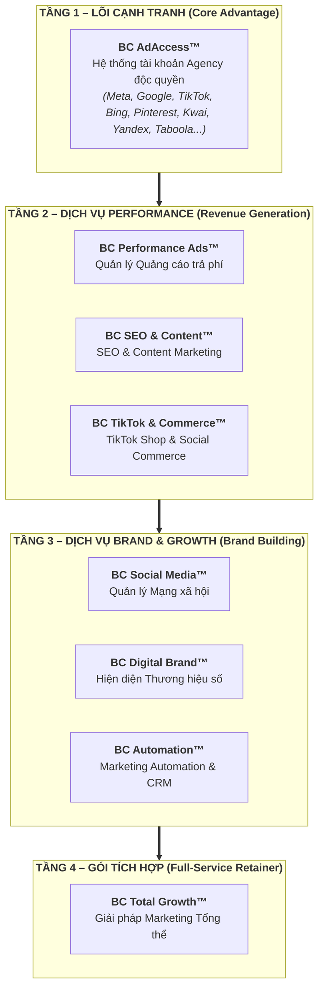
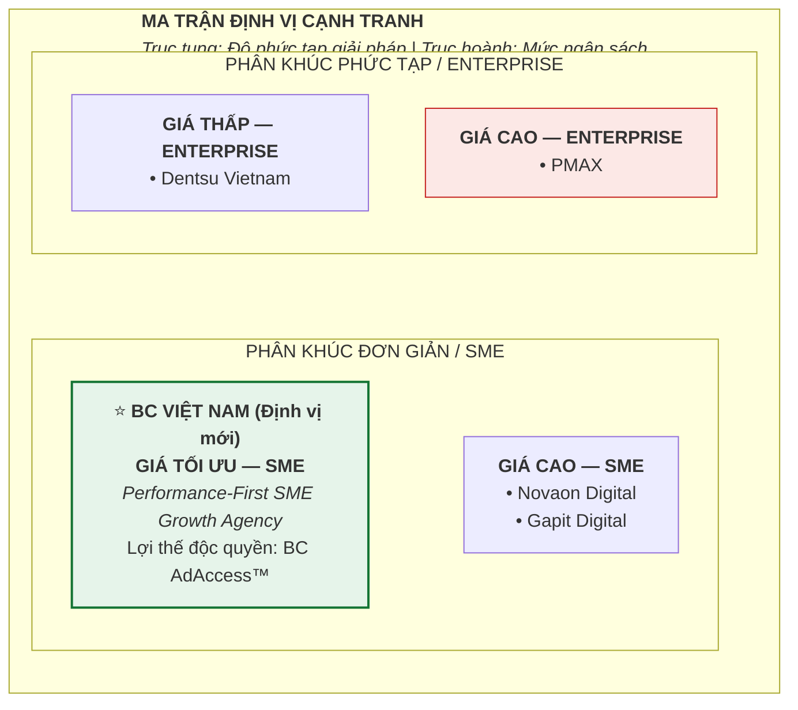

# BÁO CÁO CHIẾN LƯỢC MARKETING TỔNG THỂ
## BC VIỆT NAM – CHUYỂN DỊCH TỪ AD ACCOUNT RENTAL SANG FULL-SERVICE DIGITAL MARKETING AGENCY

---
**Kính gửi:** Ban Giám đốc Công ty TNHH Truyền Thông & Dịch Vụ BC Việt Nam  
**Ngày lập báo cáo:** Tháng 9/2026  
**Mục tiêu báo cáo:** Phân tích đối thủ PMAX, thiết kế hệ thống dịch vụ tổng thể, và đề xuất chiến lược định vị khác biệt cho BC Việt Nam trong hành trình trở thành Full-Service Digital Marketing Agency  
**Cơ sở dữ liệu:** Dữ liệu thu thập trực tiếp từ website https://pmax.com.vn và https://bcagency.vn (tháng 9/2026); bổ sung từ kinh nghiệm thực tiễn ngành và thông tin thị trường công khai.

---

# PHẦN 1: NGHIÊN CỨU ĐỐI THỦ CẠNH TRANH

## 1.1. Tổng Quan Về PMAX

**PMAX** (thành lập năm 2016) tự định vị là **"Total Marketing Partner"** – Đối tác Marketing Tổng thể tại Việt Nam, với tầm nhìn kiến tạo **"hệ sinh thái marketing toàn diện"**. Sau gần 10 năm hoạt động, PMAX đã xây dựng được nền tảng vững chắc với:

| Chỉ số | Số liệu (tính đến 2026) |
|--------|--------------------------|
| Số năm hoạt động | ~10 năm (từ 2016) |
| Thương hiệu đã phục vụ | 700+ thương hiệu |
| Quy mô nhân sự | 250+ nhân sự chuyên môn |
| Chuyên gia cấp cao | 50+ chuyên gia |
| Văn phòng | 2 (TP.HCM & Hà Nội) |
| Giải thưởng quốc tế (2024) | 16+ giải thưởng danh giá |

**Khách hàng tiêu biểu:** Vietjet, FE Credit, Vinfast, Watsons, Cuckoo, Lock&Lock – tất cả đều là các thương hiệu lớn, tập đoàn hoặc doanh nghiệp FDI.

---

## 1.2. Danh Mục Sản Phẩm/Dịch Vụ Của PMAX

*(Nguồn: Thu thập từ website pmax.com.vn – tháng 9/2026)*

### Nhóm 1: Total Marketing Consulting (Tư Vấn Marketing Toàn Diện)

| Dịch vụ con | Mô tả |
|-------------|-------|
| Data Science | Marketing Mix Modeling (MMM), Creative For Performance (CFP) – ra quyết định marketing dựa trên dữ liệu định lượng |
| Growth & Marketing Strategy | MSTP (Market Sizing – Segmentation – Targeting – Positioning), Marketing Operation Design |
| Brand Strategy | Xây dựng định vị thương hiệu như nền tảng tăng trưởng dài hạn |
| GTM Strategy (Go-To-Market) | Chiến lược đưa sản phẩm/dịch vụ ra thị trường hiệu quả |

### Nhóm 2: Total Brand Communications (Truyền Thông Thương Hiệu)

| Dịch vụ con | Mô tả |
|-------------|-------|
| Branding for Performance | Xây dựng và triển khai chiến dịch truyền thông thương hiệu hướng đến kết quả kinh doanh thực sự |
| Creative Strategy | Phát triển ý tưởng sáng tạo giải quyết bài toán thương hiệu |
| Campaign Planning & Execution | Lên kế hoạch và triển khai chiến dịch tích hợp |

### Nhóm 3: Total Media (Quảng Cáo Toàn Kênh)

| Dịch vụ con | Nền tảng/Mục tiêu |
|-------------|-------------------|
| Media for App | Tăng trưởng người dùng App, tối đa hoá tỷ lệ retention trên ứng dụng |
| Media for Branding | Facebook, Google, TikTok, Zalo, báo chí – mục tiêu xây dựng thương hiệu |
| Media for E-commerce | Facebook, Google, TikTok – mục tiêu tăng doanh số TMĐT (marketplace + D2C + social commerce) |
| Media for Lead Generation | Thu thập thông tin khách hàng tiềm năng, tối ưu chuyển đổi |

### Nhóm 4: Total E-Commerce Management (Quản Lý TMĐT Toàn Diện)

| Dịch vụ con | Mô tả |
|-------------|-------|
| Multi Channel Affiliate Marketing | Phát triển và quản lý tiếp thị liên kết đa kênh |
| E2E Activation | Chiến dịch kích hoạt end-to-end từ nhận thức đến chuyển đổi trên sàn TMĐT |
| Multi Channel Ecommerce Management | Quản lý vận hành gian hàng đa sàn (Shopee, Lazada, TikTok Shop, v.v.) |

### Nhóm 5: Total MCNs Powerhouse (Hệ Thống Creator & Livestream)

| Dịch vụ con | Mô tả |
|-------------|-------|
| Influencer Partnership | Kết nối và quản lý hợp tác influencer |
| Creator Development | Đào tạo và phát triển creator/KOC |
| Mega Livestream Operation | Vận hành các phiên livestream quy mô lớn |
| Performance Livestream Operation | Tối ưu doanh thu từ livestream, đo lường và cải thiện KPI |

### Nhóm 6: Digital Marketing Academy (Đào Tạo)

Các khóa học Digital Marketing dành cho cá nhân và doanh nghiệp – bổ trợ nguồn doanh thu và gia tăng thương hiệu tư duy dẫn đầu.

---

## 1.3. Định Vị Thương Hiệu & USP Của PMAX

### Tuyên bố định vị:
> *"PMAX – Total Marketing Partner – Đối tác Marketing Tổng thể, kiến tạo hệ sinh thái marketing toàn diện, giúp doanh nghiệp tối đa hóa hiệu quả đầu tư marketing và tạo ra tác động kinh doanh thực sự."*

### Các điểm USP chính của PMAX:

| USP | Biểu hiện cụ thể |
|-----|-----------------|
| **Data-driven approach** | Sở hữu hệ thống dữ liệu từ 5+ ngành hàng; ứng dụng Marketing Mix Modeling (MMM) để phân bổ ngân sách tối ưu |
| **Chuyên gia ngành hàng** | Có chuyên gia chuyên sâu theo từng ngành (FMCG, Tài chính, BĐS, App, Dược mỹ phẩm...) |
| **Full-funnel integration** | Tích hợp toàn phễu từ Branding → Performance → E-commerce → CRM |
| **Co-creation model** | Không "black box" – cộng tác đồng sáng tạo với khách hàng thông qua working sessions |
| **Track record & awards** | 16+ giải thưởng quốc tế 2024, Top 1 Digital Agency APAC theo MMA Smarties (2026) |
| **Scale & resources** | 250+ nhân sự, 50+ chuyên gia, quy trình chuẩn hóa |

---

## 1.4. Tệp Khách Hàng Mục Tiêu Của PMAX

Dựa trên phân tích portfolio khách hàng và định vị thương hiệu, PMAX rõ ràng nhắm vào:

| Phân khúc | Đặc điểm |
|-----------|----------|
| **Doanh nghiệp lớn & Tập đoàn** | Vietjet, Vinfast, FE Credit – ngân sách marketing từ 2 tỷ VND+/năm |
| **Thương hiệu FDI tại Việt Nam** | Watsons, Cuckoo, Lock&Lock – cần agency địa phương hiểu thị trường |
| **Scale-up & Unicorn** | Startup đã có Series B+ cần đẩy mạnh tăng trưởng có hệ thống |
| **Ngành hàng trọng điểm** | FMCG, Tài chính – ngân hàng, BĐS, TMĐT, App/Tech, Dược mỹ phẩm |

→ **Kết luận quan trọng:** PMAX KHÔNG phục vụ SME/doanh nghiệp nhỏ. Đây là **khoảng trống thị trường lớn** cho BC Việt Nam.

---

## 1.5. Quy Trình Làm Việc & Cam Kết Của PMAX

*(Lưu ý: PMAX không công bố chi tiết quy trình/báo giá trên website. Thông tin dưới đây được tổng hợp từ các bài viết chuyên môn và mô tả dịch vụ công khai.)*

**Quy trình tư vấn (đặc biệt với Consulting):**
1. Discovery Session – Hiểu bài toán kinh doanh của khách hàng
2. Data Audit – Đánh giá dữ liệu và năng lực marketing hiện tại
3. Strategy Workshop (Co-creation) – Đồng sáng tạo chiến lược
4. Implementation Roadmap – Lộ trình triển khai cụ thể
5. Execution & Optimization – Triển khai và tối ưu liên tục
6. Performance Review – Báo cáo đánh giá tác động kinh doanh

**Cam kết kết quả:** PMAX nhấn mạnh "tác động kinh doanh thực sự" và "ROI tối ưu" nhưng không công bố cam kết KPI cụ thể trên website (thông lệ trong ngành với khách hàng enterprise – cam kết được thỏa thuận riêng trong hợp đồng).

---

## 1.6. Đối Thủ Tương Đồng Khác Cần Lưu Ý

*(Bổ sung để BC Việt Nam có bức tranh thị trường đầy đủ)*

| Agency | Định vị | Điểm mạnh | Khác với PMAX |
|--------|---------|-----------|---------------|
| **Novaon Digital** | Performance + SEO + Data | Mạnh về SEO kỹ thuật, Google Marketing Partner | Thiên về SEO & SEM hơn |
| **Dentsu Vietnam** | Full-service (traditional + digital) | Network quốc tế, phục vụ tập đoàn đa quốc gia | Mạnh offline, phân khúc cao hơn PMAX |
| **Gapit Digital** | Digital transformation + Performance | Tích hợp công nghệ & marketing, mạnh B2B | Thiên B2B enterprise |

→ **Kết luận:** Thị trường SME (doanh nghiệp vừa và nhỏ) vẫn đang bị "bỏ ngỏ" bởi các agency lớn. BC Việt Nam có cơ hội chiếm lĩnh phân khúc này với lợi thế về giá và sự linh hoạt.

---

# PHẦN 2: BỘ GÓI SẢN PHẨM/DỊCH VỤ ĐỀ XUẤT CHO BC VIỆT NAM

## Tổng Quan Kiến Trúc Dịch Vụ

---

## GÓI 1: BC PERFORMANCE ADS™
### Quản Lý Quảng Cáo Trả Phí Toàn Kênh

**Mô tả dịch vụ:**
Gói dịch vụ quản lý toàn diện các chiến dịch quảng cáo trả phí trên các nền tảng số, kết hợp độc đáo giữa hệ thống tài khoản Agency của BC Việt Nam với năng lực chạy ads chuyên nghiệp. Khách hàng được hưởng lợi thế tài khoản Agency (ít lệnh cấm, hạn mức chi tiêu cao, hỗ trợ ưu tiên từ nền tảng) mà không cần tự thuê tài khoản riêng.

**Nội dung dịch vụ bao gồm:**
- Thiết lập và cấu hình tài khoản quảng cáo Agency (Meta, Google, TikTok)
- Nghiên cứu đối thủ, phân tích đối tượng mục tiêu
- Xây dựng cấu trúc chiến dịch (campaign structure)
- Thiết kế creative/banner quảng cáo (bộ cơ bản: 3-5 mẫu/tháng)
- Copywriting cho quảng cáo
- Cài đặt tracking: Meta Pixel, Google Tag, TikTok Pixel, Conversion API
- Quản lý ngân sách và tối ưu bid strategy hàng ngày
- A/B Testing creative và audience
- Báo cáo hiệu quả hàng tuần & hàng tháng
- Họp review chiến lược 1 lần/tháng

**Đối tượng khách hàng phù hợp:**
- Doanh nghiệp SME có sản phẩm/dịch vụ cần lead hoặc doanh số trực tiếp
- Shop TMĐT, D2C brand muốn scale nhanh
- Doanh nghiệp đang tự chạy ads kém hiệu quả, muốn outsource cho chuyên gia

**Quy trình triển khai:**

| Bước | Nội dung | Thời gian |
|------|----------|-----------|
| 1. Onboarding & Audit | Khảo sát mục tiêu, audit tài khoản/pixel hiện tại, phân tích đối thủ | Tuần 1 |
| 2. Strategy & Setup | Lên kế hoạch chiến dịch, thiết kế creative, cài đặt tài khoản & tracking | Tuần 2 |
| 3. Launch & Monitor | Chạy thử (test budget 20-30%), theo dõi sát sao trong 7 ngày đầu | Tuần 3 |
| 4. Optimize | Scale ngân sách cho nhóm hiệu quả, dừng nhóm kém, test creative mới | Tuần 4 trở đi |
| 5. Review & Report | Báo cáo tháng, họp review, đề xuất chiến lược tháng tiếp theo | Cuối mỗi tháng |

**Bảng báo giá tham khảo:**

*Giả định: Phí dịch vụ tính theo % ngân sách quảng cáo hoặc mức phí cố định, chưa bao gồm ngân sách quảng cáo. Giá chưa VAT.*

| Hạng mục | Cơ Bản (Starter) | Tiêu Chuẩn (Standard) | Cao Cấp (Pro) |
|----------|-----------------|----------------------|--------------|
| Nền tảng quảng cáo | 1 nền tảng | 2 nền tảng | 3-4 nền tảng |
| Ngân sách quảng cáo/tháng (KH tự nạp) | Đến 30 triệu | 30-100 triệu | 100-300 triệu |
| Phí quản lý dịch vụ/tháng | **8-12 triệu VND** | **15-25 triệu VND** | **28-50 triệu VND** |
| Creative quảng cáo | 3 mẫu/tháng | 6 mẫu/tháng | 10+ mẫu/tháng |
| Báo cáo | Hàng tháng | Hàng tuần | Hàng tuần + real-time dashboard |
| Account Manager | Chung | Riêng | Riêng + senior specialist |

**Cam kết KPI tham khảo** *(cam kết chính thức được thỏa thuận theo từng ngành hàng và mục tiêu cụ thể)*:
- Giảm CPA (Cost Per Acquisition) ≥15% sau 60 ngày so với baseline
- Báo cáo minh bạch 100%, không ẩn số liệu
- Thời gian phản hồi yêu cầu: trong vòng 4 giờ làm việc

---

## GÓI 2: BC SEO & CONTENT™
### Tối Ưu Tìm Kiếm & Xây Dựng Nội Dung Chiến Lược

**Mô tả dịch vụ:**
Gói dịch vụ SEO toàn diện kết hợp với chiến lược nội dung, giúp doanh nghiệp xây dựng lưu lượng truy cập tự nhiên bền vững và uy tín thương hiệu trên công cụ tìm kiếm.

**Nội dung dịch vụ bao gồm:**
- **Technical SEO:** Audit kỹ thuật website, tối ưu tốc độ tải trang, cấu trúc URL, sitemap, schema markup
- **On-page SEO:** Tối ưu title tag, meta description, heading structure, internal linking
- **Keyword Research:** Nghiên cứu từ khóa theo nhóm (awareness – consideration – conversion)
- **Content SEO:** Lên kế hoạch nội dung theo pillar-cluster model
- **Content Production:** Viết bài SEO chuẩn chất lượng cao (theo gói)
- **Off-page SEO / Backlink Building:** Xây dựng liên kết chất lượng từ các trang báo, diễn đàn uy tín
- **Local SEO** (nếu cần): Tối ưu Google Business Profile, bản đồ địa phương
- **Analytics & Reporting:** Theo dõi thứ hạng từ khóa, organic traffic, conversion

**Đối tượng khách hàng phù hợp:**
- Doanh nghiệp dịch vụ (giáo dục, y tế, tài chính, bất động sản) cần khách hàng tìm kiếm chủ động
- Website TMĐT/D2C muốn giảm phụ thuộc vào ngân sách quảng cáo trả phí
- Startup/SME cần xây dựng thương hiệu số bền vững dài hạn

**Quy trình triển khai:**

| Bước | Nội dung | Thời gian |
|------|----------|-----------|
| 1. SEO Audit & Research | Phân tích kỹ thuật, nghiên cứu từ khóa, phân tích đối thủ SEO | Tuần 1-2 |
| 2. Strategy & Plan | Xây dựng chiến lược nội dung, lộ trình SEO 6 tháng | Tuần 2-3 |
| 3. Technical Fix | Sửa các lỗi kỹ thuật ưu tiên cao, tối ưu cấu trúc | Tháng 1-2 |
| 4. Content Execution | Triển khai sản xuất nội dung theo lịch | Liên tục hàng tháng |
| 5. Link Building | Đặt bài PR, xây dựng backlink chất lượng | Từ tháng 2 trở đi |
| 6. Monitor & Optimize | Theo dõi ranking, điều chỉnh chiến lược | Hàng tháng |

**Bảng báo giá tham khảo:**

*Giả định: Giá tính theo gói tháng, cam kết tối thiểu 6 tháng do SEO cần thời gian. Giá chưa VAT.*

| Hạng mục | Cơ Bản | Tiêu Chuẩn | Cao Cấp |
|----------|--------|------------|---------|
| Từ khóa theo dõi | 30 từ khóa | 60 từ khóa | 100+ từ khóa |
| Bài SEO/tháng | 4 bài (800-1,000 từ) | 8 bài (1,000-1,500 từ) | 12-16 bài (1,500-2,000 từ) |
| Technical SEO | Cơ bản | Nâng cao | Toàn diện |
| Backlink building | 5 backlink/tháng | 15 backlink/tháng | 30+ backlink/tháng |
| Phí dịch vụ/tháng | **8-12 triệu VND** | **18-28 triệu VND** | **35-55 triệu VND** |
| Cam kết thời gian thấy kết quả | 3-4 tháng | 2-3 tháng | 1.5-2 tháng |

**Cam kết KPI tham khảo:**
- Top 10 Google cho ≥50% từ khóa mục tiêu sau 4-6 tháng (từ khóa cạnh tranh vừa)
- Tăng organic traffic ≥30% sau 6 tháng
- Báo cáo ranking hàng tháng, có thể kiểm tra độc lập

---

## GÓI 3: BC SOCIAL MEDIA™
### Quản Trị Mạng Xã Hội Toàn Diện

**Mô tả dịch vụ:**
Gói quản lý toàn diện các kênh mạng xã hội (Facebook, Instagram, TikTok, Zalo OA, LinkedIn) từ chiến lược nội dung, sản xuất creative, đăng bài, tương tác đến báo cáo hiệu quả.

**Nội dung dịch vụ bao gồm:**
- Xây dựng Social Media Strategy và Content Calendar hàng tháng
- Sản xuất nội dung: hình ảnh design, video ngắn (Reels/TikTok), caption, hashtag
- Đăng bài theo lịch (tần suất theo gói)
- Community Management: trả lời bình luận, tin nhắn trong giờ làm việc
- Monthly Analytics Report: phân tích engagement, reach, follower growth
- Chiến lược tăng trưởng kênh hữu cơ
- Tư vấn KOC/Influencer khi có chiến dịch (không bao gồm chi phí KOC)

**Đối tượng khách hàng phù hợp:**
- Thương hiệu B2C cần xây dựng cộng đồng và tương tác với khách hàng
- Doanh nghiệp mới cần thiết lập hiện diện mạng xã hội từ đầu
- Doanh nghiệp đang quản lý social media nội bộ kém hiệu quả

**Quy trình triển khai:**

| Bước | Nội dung | Thời gian |
|------|----------|-----------|
| 1. Brand Discovery | Khảo sát thương hiệu, đối thủ, đối tượng mục tiêu, tone of voice | Tuần 1 |
| 2. Strategy & Content Plan | Xây dựng Social Media Strategy, Content Pillar, Calendar tháng đầu | Tuần 2 |
| 3. Setup & Optimization | Tối ưu profile các kênh (ảnh bìa, bio, CTA, story highlights) | Tuần 2-3 |
| 4. Execution | Sản xuất và đăng nội dung theo lịch, quản lý cộng đồng | Hàng tháng |
| 5. Report & Strategy Review | Phân tích số liệu, đề xuất điều chỉnh chiến lược | Cuối tháng |

**Bảng báo giá tham khảo:**

*Giả định: Giá tính theo gói tháng, chưa bao gồm chi phí chạy boost post, seeding hoặc KOC. Giá chưa VAT.*

| Hạng mục | Cơ Bản | Tiêu Chuẩn | Cao Cấp |
|----------|--------|------------|---------|
| Số kênh quản lý | 1 kênh (Facebook hoặc TikTok) | 2 kênh | 3-4 kênh |
| Số bài đăng/tháng | 12 bài | 20 bài | 30+ bài |
| Video/Reels/tháng | 0 | 4 video ngắn | 8-12 video ngắn |
| Community Management | Không | Trong giờ hành chính | 12 giờ/ngày 7 ngày/tuần |
| Phí dịch vụ/tháng | **6-10 triệu VND** | **15-22 triệu VND** | **25-40 triệu VND** |

---

## GÓI 4: BC TIKTOK & SOCIAL COMMERCE™
### Bứt Phá Doanh Thu Với TikTok & Thương Mại Điện Tử

**Mô tả dịch vụ:**
Gói dịch vụ chuyên biệt cho TikTok và kênh thương mại điện tử, từ xây dựng kênh TikTok, vận hành TikTok Shop đến quảng cáo hiệu suất và livestream bán hàng. Đây là dịch vụ BC Việt Nam có lợi thế đặc biệt nhờ tư cách đối tác chính thức của TikTok và kinh nghiệm thực tiễn sâu trên nền tảng.

**Nội dung dịch vụ bao gồm:**

*Gói TikTok Organic:*
- Xây dựng chiến lược nội dung TikTok
- Sản xuất video TikTok (scripting, filming concept, editing guidance)
- Tối ưu profile và hashtag strategy
- Phân tích analytics TikTok

*Gói TikTok Shop & E-commerce:*
- Setup và tối ưu hóa TikTok Shop
- Quản lý sản phẩm, listing, thông tin sản phẩm
- Tham gia chương trình khuyến mãi của TikTok (Flash Sale, Campaign)
- Quản lý đánh giá và chat khách hàng

*Gói TikTok Ads Performance:*
- Quản lý quảng cáo TikTok Ads toàn diện (VSA, In-feed, TopView...)
- Tài khoản Agency TikTok (lợi thế cạnh tranh độc quyền của BC)
- Tối ưu ROAS cho chiến dịch TMĐT và Lead Gen

*Gói Livestream Production & Management:*
- Lên kịch bản và chiến lược phiên live
- Hỗ trợ vận hành phiên live (flash sale, event live)
- Tối ưu hiệu quả chuyển đổi từ live

**Đối tượng khách hàng phù hợp:**
- Brand FMCG, làm đẹp, thời trang muốn khai thác TikTok Shop
- Nhà bán hàng TMĐT muốn scale doanh thu qua TikTok
- Doanh nghiệp chưa có kinh nghiệm TikTok, cần "cầm tay chỉ việc"

**Quy trình triển khai:**

| Bước | Nội dung | Thời gian |
|------|----------|-----------|
| 1. TikTok Audit & Consulting | Đánh giá tình trạng kênh/shop hiện tại, xác định cơ hội | Tuần 1 |
| 2. Strategy Planning | Chiến lược content, shop, ads, lịch live tháng đầu | Tuần 2 |
| 3. Setup & Optimization | Tối ưu TikTok Shop, cài đặt quảng cáo, link tài khoản Agency | Tuần 2-3 |
| 4. Content & Live Execution | Thực thi nội dung và phiên live theo kế hoạch | Hàng tháng |
| 5. Performance Analysis | Báo cáo GMV, ROAS, follower growth, đề xuất tối ưu | Cuối tháng |

**Bảng báo giá tham khảo:**

*Giả định: Phí dịch vụ chưa bao gồm ngân sách quảng cáo TikTok Ads và chi phí KOC/creator. Giá chưa VAT.*

| Hạng mục | Cơ Bản | Tiêu Chuẩn | Cao Cấp |
|----------|--------|------------|---------|
| TikTok Channel Management | Có | Có | Có |
| TikTok Shop Management | Không | Có | Có |
| TikTok Ads Management | Không | Có | Có (tài khoản Agency) |
| Video content/tháng | 8 video | 16 video | 24+ video |
| Hỗ trợ Livestream | Không | 2 buổi/tháng | 4-8 buổi/tháng |
| Phí dịch vụ/tháng | **8-12 triệu VND** | **20-30 triệu VND** | **35-65 triệu VND** |

---

## GÓI 5: BC DIGITAL BRAND™
### Xây Dựng Thương Hiệu Số Toàn Diện

**Mô tả dịch vụ:**
Gói dịch vụ dành cho doanh nghiệp cần xây dựng nền tảng thương hiệu số từ đầu hoặc tái định vị thương hiệu, bao gồm thiết kế nhận diện, website và hệ thống tài sản số.

**Nội dung dịch vụ bao gồm:**
- Brand Strategy Consulting: xác định định vị, đối tượng mục tiêu, thông điệp thương hiệu
- Brand Identity Design: logo, bộ nhận diện thương hiệu (màu sắc, font, họa tiết)
- Social Media Kit: template bài đăng, story, cover photo
- Website Development: thiết kế và phát triển website chuẩn SEO (WordPress/Webflow)
- Landing Page Creation: thiết kế landing page cho từng chiến dịch
- Copywriting & Brand Voice Guide: hướng dẫn giọng điệu thương hiệu

**Đối tượng khách hàng phù hợp:**
- Startup/doanh nghiệp mới cần xây dựng thương hiệu từ đầu
- Doanh nghiệp muốn tái định vị hoặc nâng cấp nhận diện thương hiệu
- Doanh nghiệp có sản phẩm tốt nhưng hình ảnh thương hiệu yếu

**Bảng báo giá tham khảo** *(Dự án một lần, không phải gói tháng):*

| Hạng mục | Cơ Bản | Tiêu Chuẩn | Cao Cấp |
|----------|--------|------------|---------|
| Brand Strategy Workshop | Không | 2 buổi | 4 buổi + Brand Book đầy đủ |
| Brand Identity | Logo + basic kit | Logo + full identity kit | Full brand identity system |
| Website | Landing page 1 trang | Website 5-7 trang | Website đầy đủ + blog + SEO setup |
| Social Media Kit | Template cơ bản (5 mẫu) | Template đầy đủ (15 mẫu) | Template + motion graphics |
| Phí dự án | **15-25 triệu VND** | **35-60 triệu VND** | **70-120 triệu VND** |
| Thời gian hoàn thành | 3-4 tuần | 5-7 tuần | 8-12 tuần |

---

## GÓI 6: BC MARKETING AUTOMATION™
### Tự Động Hóa Marketing & Chăm Sóc Khách Hàng

**Mô tả dịch vụ:**
Gói dịch vụ tiên phong trong việc ứng dụng công nghệ tự động hóa marketing (CRM, Email Marketing, Chatbot, Zalo ZNS, SMS automation) để tối ưu hóa hành trình khách hàng và tăng tỷ lệ chuyển đổi, giữ chân khách hàng hiệu quả.

*(Đây là dịch vụ PMAX chưa mạnh/chưa tập trung – cơ hội khác biệt hóa lớn cho BC Việt Nam)*

**Nội dung dịch vụ bao gồm:**
- Tư vấn và triển khai CRM (HubSpot, Zoho, Salesforce tùy ngân sách)
- Setup Email Marketing workflow (welcome series, nurture, upsell, re-engagement)
- Chatbot Facebook Messenger / Zalo / Website tư động
- Zalo ZNS (Zalo Notification Service) automation
- SMS Marketing automation
- Lead scoring & segmentation
- Báo cáo conversion funnel và ROI automation

**Đối tượng khách hàng phù hợp:**
- Doanh nghiệp dịch vụ có quy trình bán hàng dài (BĐS, giáo dục, tài chính, B2B)
- TMĐT có lượng khách hàng lớn cần nurture và retain
- Doanh nghiệp đang lãng phí leads do thiếu hệ thống chăm sóc tự động

**Bảng báo giá tham khảo:**

*Giả định: Phí dịch vụ chưa bao gồm phí bản quyền phần mềm CRM/automation tool (KH tự trả hoặc BC hỗ trợ license với giá ưu đãi). Giá chưa VAT.*

| Hạng mục | Cơ Bản | Tiêu Chuẩn | Cao Cấp |
|----------|--------|------------|---------|
| Phạm vi triển khai | Email automation (3 workflow) | Email + Chatbot + ZNS | Full: CRM + Email + Chat + SMS + ZNS |
| Phí setup ban đầu | 10-15 triệu | 20-35 triệu | 50-80 triệu |
| Phí vận hành/tháng | 5-8 triệu | 12-20 triệu | 25-45 triệu |
| Thời gian triển khai | 2-3 tuần | 4-6 tuần | 8-12 tuần |

---

## GÓI 7: BC TOTAL GROWTH™ (GÓI FLAGSHIP)
### Giải Pháp Marketing Tổng Thể – Full-Service Retainer

**Mô tả dịch vụ:**
Đây là gói dịch vụ toàn diện nhất của BC Việt Nam, tích hợp tất cả các năng lực từ Paid Ads, SEO, Social Media, Content đến Marketing Automation dưới sự điều phối của một Account Director chuyên trách. Khách hàng chỉ cần tập trung vào kinh doanh cốt lõi, BC Việt Nam phụ trách toàn bộ hoạt động marketing số.

**Nội dung dịch vụ bao gồm:**
- Quarterly Marketing Strategy (Chiến lược marketing theo quý)
- Dedicated Account Director + multi-specialist team
- Paid Media Management (Meta + Google + TikTok với tài khoản Agency BC)
- SEO & Content Marketing (8-12 bài/tháng)
- Social Media Management (2-3 kênh)
- Monthly Performance Dashboard (real-time)
- Monthly Strategy Review Meeting
- Ưu tiên hỗ trợ kỹ thuật 24/7

**Đối tượng khách hàng phù hợp:**
- SME/doanh nghiệp tăng trưởng nhanh (doanh thu 5-50 tỷ/năm) muốn chuyên nghiệp hóa marketing
- Doanh nghiệp chưa có team marketing hoặc team marketing mỏng
- Startup Series A-B cần tăng trưởng nhanh với nguồn lực có hạn

**Quy trình triển khai:**

| Bước | Nội dung | Thời gian |
|------|----------|-----------|
| 1. Discovery Workshop | Khảo sát 360° về mục tiêu kinh doanh, thị trường, đối thủ | Tuần 1 |
| 2. Audit toàn diện | Audit website, ads, SEO, social media, analytics | Tuần 1-2 |
| 3. Quarterly Marketing Plan | Xây dựng kế hoạch marketing tổng thể cho Q đầu tiên | Tuần 2-3 |
| 4. Triển khai đồng bộ | Activate tất cả các kênh theo kế hoạch | Từ tuần 4 |
| 5. Weekly Standup | Cập nhật tiến độ, xử lý vấn đề phát sinh | Hàng tuần |
| 6. Monthly Review | Phân tích số liệu, điều chỉnh chiến lược | Cuối tháng |
| 7. Quarterly Strategy Review | Đánh giá kết quả, lên kế hoạch quý tiếp | Cuối mỗi quý |

**Bảng báo giá tham khảo:**

*Giả định: Cam kết tối thiểu 6 tháng. Phí chưa bao gồm ngân sách quảng cáo (KH tự nạp). Giá chưa VAT. Ngân sách quảng cáo đề xuất từ 30-300 triệu VND/tháng tùy quy mô doanh nghiệp.*

| Hạng mục | Growth Starter | Growth Pro | Growth Enterprise |
|----------|---------------|------------|-------------------|
| Ngân sách ads phù hợp | 30-80 triệu/tháng | 80-200 triệu/tháng | 200-500 triệu/tháng |
| Nền tảng ads | 2 kênh | 3 kênh | 4+ kênh |
| SEO (bài/tháng) | 6 bài | 10 bài | 16+ bài |
| Social Media (kênh) | 2 kênh | 3 kênh | 4 kênh |
| Marketing Automation | Không | Cơ bản | Đầy đủ |
| Account Director | Chia sẻ (2-3 KH) | Gần riêng (1-2 KH) | Riêng 100% |
| Phí dịch vụ/tháng | **35-55 triệu VND** | **60-100 triệu VND** | **120-200 triệu VND** |

---

# PHẦN 3: CHIẾN LƯỢC KHÁC BIỆT HÓA SO VỚI PMAX

## 3.1. Đánh Giá "Khoảng Trắng" Mà PMAX Bỏ Ngỏ

Sau khi phân tích chi tiết PMAX, có thể nhận định rõ ràng: **PMAX là agency phục vụ "tầng cao"** – doanh nghiệp lớn, ngân sách lớn, quy trình phức tạp. Điều này tạo ra **ít nhất 5 khoảng trắng chiến lược** mà BC Việt Nam có thể chiếm lĩnh:

---

## 3.2. Năm Dịch Vụ Khác Biệt Hóa Đề Xuất

### ① BC ADACCESS BUNDLE™ – Gói Tài Khoản Agency + Managed Service (PMAX KHÔNG CÓ)

**Cơ sở khác biệt:**
PMAX chỉ "chạy ads" cho khách hàng – họ không cung cấp tài khoản Agency. BC Việt Nam có lợi thế cạnh tranh **không thể sao chép nhanh**: hệ thống 2,600+ tài khoản Agency đang hoạt động trên 12+ nền tảng. Đây là "moat" (hào phòng thủ) mà không agency nào trong phân khúc mid-market có được.

**Mô hình dịch vụ độc đáo:**
> **"Bạn nhận tài khoản Agency + chúng tôi chạy giúp bạn"**

Khách hàng không cần chọn giữa "tự chạy với tài khoản Agency" hay "thuê agency với tài khoản thường". BC cung cấp **cả hai cùng một lúc**:
- Tài khoản Agency (ít ban, hạn mức cao, hỗ trợ ưu tiên từ platform)
- Dịch vụ managed advertising (team chuyên gia vận hành)
- Phí = phí tài khoản + phí quản lý → tổng chi phí vẫn thấp hơn thuê agency lớn như PMAX

**Tại sao PMAX không thể cạnh tranh trực tiếp dịch vụ này:**
PMAX không có mảng tài khoản Agency, họ chạy ads trực tiếp trên tài khoản khách hàng hoặc tài khoản nội bộ. Việc triển khai ad account rental sẽ thay đổi hoàn toàn mô hình kinh doanh của họ – điều này không thể xảy ra trong ngắn hạn.

---

### ② BC SME ACCELERATOR™ – Gói Marketing Tăng Trưởng Dành Riêng Cho SME (PMAX BỎ NGỎ)

**Cơ sở khác biệt:**
PMAX phục vụ doanh nghiệp lớn với minimum budget cao (ước tính từ 100-200 triệu/tháng phí dịch vụ). **Có ít nhất 500,000 doanh nghiệp SME tại Việt Nam** đang cần dịch vụ marketing chuyên nghiệp nhưng không đủ ngân sách để tiếp cận PMAX.

**Mô hình triển khai:**
- Gói chuẩn hóa cao (standardized packages) với quy trình được template hóa → giảm chi phí vận hành
- Phí dịch vụ linh hoạt từ 15-50 triệu/tháng
- Onboarding nhanh trong 1 tuần (PMAX mất 4-6 tuần)
- Dedicated SME team với chuyên môn sâu về ngành hàng phổ biến (thương mại, dịch vụ, nhà hàng, giáo dục, y tế)

**Khai thác lợi thế BC Việt Nam:**
Với kinh nghiệm 1,000+ khách hàng toàn cầu, BC đã tích lũy data và insight thực tiễn từ nhiều ngành, có thể tái sử dụng để phục vụ SME nhanh hơn và hiệu quả hơn đối thủ.

---

### ③ BC CROSS-BORDER ADS™ – Quảng Cáo Xuyên Biên Giới (PMAX KHÔNG CÓ)

**Cơ sở khác biệt:**
BC Việt Nam hiện phục vụ **1,000+ khách hàng toàn cầu** – đây là lợi thế đặc biệt mà PMAX (agency thuần Việt, phục vụ thị trường nội địa) không có. Nhu cầu của thị trường:

- Doanh nghiệp Việt Nam muốn xuất khẩu và quảng cáo ra thị trường nước ngoài (Mỹ, EU, Đông Nam Á)
- Doanh nghiệp nước ngoài muốn quảng cáo vào thị trường Việt Nam
- Seller Amazon/eBay người Việt cần tài khoản và dịch vụ ads quốc tế

**Dịch vụ cụ thể:**
- Tài khoản Agency quốc tế: Bing/Microsoft Ads, Taboola, Outbrain, Yandex (BC đã có)
- Tư vấn chiến lược quảng cáo thị trường quốc tế
- Đa ngôn ngữ: tiếng Anh, tiếng Nga (Yandex), tiếng Nhật/Hàn (nếu mở rộng)
- Hỗ trợ compliance quảng cáo theo quy định từng quốc gia

**Định vị:** *"Agency Việt duy nhất cung cấp giải pháp quảng cáo xuyên biên giới tích hợp"*

---

### ④ BC WHITE-LABEL PARTNER™ – Dịch Vụ Trắng Nhãn Cho Agency Nhỏ (PMAX KHÔNG CÓ)

**Cơ sở khác biệt:**
Tại Việt Nam có hàng nghìn **agency nhỏ/freelancer digital marketing** muốn cung cấp dịch vụ đầy đủ cho khách hàng nhưng thiếu hạ tầng (tài khoản Agency, nhân lực chuyên gia, quy trình). Họ thường phải từ chối các dự án lớn hoặc làm kém chất lượng.

**Mô hình White-Label của BC:**
BC Việt Nam trở thành **"backend partner"** cho các agency nhỏ/freelancer:
- Cung cấp tài khoản Agency dưới danh nghĩa agency đối tác
- Vận hành dịch vụ (chạy ads, SEO, content...) nhưng report dưới thương hiệu của đối tác
- Phí = phí buôn (wholesale pricing) + % doanh thu

**Tiềm năng thị trường:**
- Ước tính 5,000-10,000 agency nhỏ và freelancer digital marketing tại Việt Nam
- Mỗi đối tác có thể mang lại doanh thu 20-100 triệu/tháng cho BC
- Không cần BC bán trực tiếp cho end-client → tiết kiệm chi phí bán hàng

---

### ⑤ BC AI MARKETING SUITE™ – Ứng Dụng AI Trong Marketing Thực Chiến (PMAX MỚI BẮT ĐẦU)

**Cơ sở khác biệt:**
Cuộc cách mạng AI đang thay đổi căn bản ngành marketing (ChatGPT, Gemini, Midjourney, Meta AI Advantage+, Google PMAX...). PMAX có nhắc đến AI trong các bài viết nhưng chưa có gói dịch vụ AI cụ thể. Đây là **cửa sổ cơ hội** ngắn hạn (12-24 tháng) để BC Việt Nam trở thành **"AI-first marketing agency"** tại Việt Nam.

**Nội dung dịch vụ BC AI Marketing Suite:**
- **AI Ad Creative Generation:** Sử dụng AI để tạo hàng trăm biến thể creative → test nhanh → scale winner (tiết kiệm 70% chi phí creative)
- **AI Copywriting:** Tối ưu hóa ad copy bằng mô hình ngôn ngữ lớn, A/B test tự động
- **AI Campaign Optimization:** Ứng dụng Meta Advantage+, Google Performance Max, TikTok Smart+ với chiến lược tối ưu
- **AI Content Production:** Tăng tốc sản xuất nội dung SEO/Social với AI (5x nhanh hơn, giữ chất lượng)
- **AI Chatbot & Automation:** Triển khai chatbot AI cho customer service và lead nurturing
- **Monthly AI Marketing Workshop:** Đào tạo team marketing của khách hàng sử dụng AI tools

**Định vị:** *"Không phải agency thay thế AI – chúng tôi là agency giúp bạn DÙNG AI hiệu quả nhất"*

---

## 3.3. Định Vị Thương Hiệu Mới Cho BC Việt Nam

### Vấn đề với định vị hiện tại:
BC Việt Nam đang bị xem là **"đại lý tài khoản quảng cáo"** – một dịch vụ commodity dễ bị sao chép, cạnh tranh chủ yếu bằng giá. Khi muốn chuyển sang full-service agency, cần định vị lại hoàn toàn.

### Định vị mới đề xuất:

> ## **"BC Việt Nam – The Performance-First Growth Agency"**
> *Đối tác tăng trưởng hướng hiệu suất, dành cho doanh nghiệp SME đang bứt phá*

**Giải thích lựa chọn định vị:**

| Yếu tố | Lý giải |
|--------|---------|
| **"Performance-First"** | Mọi dịch vụ đều gắn với KPI và kết quả đo lường được – cạnh tranh bằng cam kết kết quả, không cạnh tranh bằng giá |
| **"Growth Agency"** | Định vị đồng hành tăng trưởng, không chỉ "làm dịch vụ" – tạo cảm giác đối tác chiến lược |
| **"Dành cho SME bứt phá"** | Rõ ràng về tệp khách hàng, tránh cạnh tranh trực tiếp với PMAX ở phân khúc enterprise |

### Bộ thông điệp thương hiệu:

| Thông điệp | Nội dung |
|-----------|----------|
| **Tagline** | *"Tăng trưởng thực, đo được, ngay hôm nay"* |
| **Brand Promise** | Mọi đồng ngân sách marketing của bạn đều có thể theo dõi, đo lường và tối ưu |
| **Differentiator** | Duy nhất kết hợp tài khoản Agency + Full-service Management + Cam kết KPI |
| **Evidence** | 8+ năm kinh nghiệm, 1,000+ khách hàng, 2,600+ tài khoản hoạt động |

---

## 3.4. Ma Trận Định Vị Cạnh Tranh

**Lợi thế vị trí "Performance-First SME Growth Agency":**
- Không đối đầu trực tiếp với PMAX (khác phân khúc)
- Không cạnh tranh đáy với các agency nhỏ lẻ (nhờ lợi thế tài khoản Agency)
- Khai thác thị trường SME rộng lớn chưa được phục vụ tốt

---

## 3.5. Lộ Trình Chuyển Đổi Chiến Lược Khuyến Nghị

| Giai đoạn | Thời gian | Trọng tâm | Mục tiêu |
|-----------|-----------|-----------|----------|
| **Giai đoạn 1: Foundation** | Tháng 1-3 | Xây dựng năng lực nội bộ: tuyển dụng chuyên gia SEO, Content, Social Media; chuẩn hóa quy trình | Sẵn sàng cung cấp dịch vụ full-service cơ bản |
| **Giai đoạn 2: Launch** | Tháng 3-6 | Ra mắt 3 gói dịch vụ trọng tâm: BC Performance Ads, BC TikTok & Social Commerce, BC Total Growth | Có 10-20 khách hàng full-service đầu tiên |
| **Giai đoạn 3: Scale** | Tháng 6-12 | Mở rộng đội ngũ, phát triển thêm White-label & Cross-border services; ra mắt AI Marketing Suite | Doanh thu từ full-service chiếm 50%+ tổng doanh thu |
| **Giai đoạn 4: Leadership** | Năm 2-3 | Định vị thương hiệu là "#1 Performance-First SME Growth Agency tại Việt Nam"; mở rộng thị trường Đông Nam Á | Cạnh tranh sòng phẳng với PMAX ở phân khúc mid-market |

---

# PHẦN 4: KHUYẾN NGHỊ VÀ KẾT LUẬN

## 4.1. Tóm Tắt Khuyến Nghị Chiến Lược

| Hành động | Ưu tiên | Ghi chú |
|-----------|---------|---------|
| Tái định vị thương hiệu BC Việt Nam thành "Performance-First Growth Agency" | 🔴 Cao | Cần làm trước khi ra mắt dịch vụ mới |
| Ra mắt gói BC AdAccess Bundle (tài khoản Agency + Managed Service) | 🔴 Cao | Lợi thế không thể sao chép, triển khai ngay |
| Phát triển gói BC Total Growth (Full-service Retainer) | 🔴 Cao | Gói flagship, tạo doanh thu recurring cao |
| Xây dựng White-label Partner Program | 🟡 Trung bình | Nguồn doanh thu B2B2B tiềm năng lớn |
| Phát triển Cross-border Ads service | 🟡 Trung bình | Khai thác 1,000+ khách hàng quốc tế hiện có |
| Ra mắt BC AI Marketing Suite | 🟡 Trung bình | Cần đầu tư nghiên cứu tool, đào tạo team |
| Xây dựng website mới phản ánh full-service positioning | 🔴 Cao | Website hiện tại chỉ thể hiện mảng tài khoản |

## 4.2. Cảnh Báo Rủi Ro Cần Lưu Ý

| Rủi ro | Mức độ | Cách xử lý |
|--------|--------|------------|
| Thiếu nhân lực chuyên môn khi mở rộng dịch vụ | 🔴 Cao | Tuyển dụng có kế hoạch, đào tạo nội bộ, có thể outsource một số phần |
| Xung đột lợi ích giữa khách hàng thuê tài khoản (cũ) và khách hàng managed service (mới) | 🟡 Trung bình | Phân chia rõ segment, team riêng biệt |
| Khó thay đổi nhận thức thị trường về BC là "đại lý tài khoản" | 🟡 Trung bình | Đầu tư vào content marketing, case study, PR |
| PMAX và đối thủ lớn nhìn thấy cơ hội và lấn sang phân khúc SME | 🟢 Thấp (ngắn hạn) | BC đã có lợi thế tài khoản Agency – PMAX không thể sao chép trong 1-2 năm |

---

## 4.3. Kết Luận

Cơ hội mà BC Việt Nam đang có là **ngoại lệ hiếm gặp trong ngành**: sở hữu đồng thời **hạ tầng kỹ thuật độc quyền** (2,600+ tài khoản Agency đa nền tảng), **kinh nghiệm thực chiến** (8+ năm, 1,000+ khách hàng) và **quan hệ đối tác chính thức** với các nền tảng lớn.

Nếu PMAX đang kiến tạo "hệ sinh thái marketing cho doanh nghiệp lớn", thì BC Việt Nam hoàn toàn có thể trở thành **"hệ sinh thái marketing tăng trưởng cho SME Việt Nam và khách hàng quốc tế"** – không phải sao chép PMAX, mà là **khai thác khoảng trắng thị trường mà PMAX không muốn và không thể phục vụ**.

Chìa khóa thành công: **Đừng cạnh tranh với PMAX bằng giá – hãy cạnh tranh bằng sự kết hợp độc đáo giữa hạ tầng tài khoản Agency và dịch vụ managed marketing**, một USP mà không agency nào trên thị trường đang có.

---

*Báo cáo này được lập dựa trên thông tin thu thập trực tiếp từ website pmax.com.vn và bcagency.vn vào tháng 9/2026, kết hợp với kinh nghiệm thực tiễn ngành. Các thông tin về giá dịch vụ đối thủ (PMAX) không được công bố trên website – mọi so sánh về giá là ước tính dựa trên thông tin thị trường. Báo giá của BC Việt Nam là đề xuất tham khảo ban đầu, cần được tinh chỉnh dựa trên cơ cấu chi phí và chiến lược kinh doanh thực tế của doanh nghiệp.*

*Mọi ý kiến phản hồi hoặc yêu cầu làm rõ, vui lòng liên hệ trực tiếp.*
