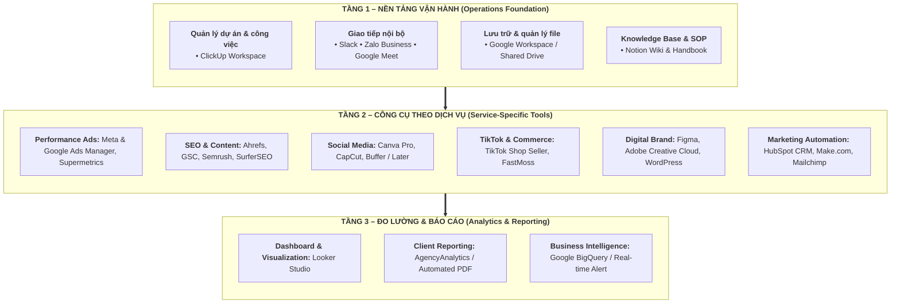
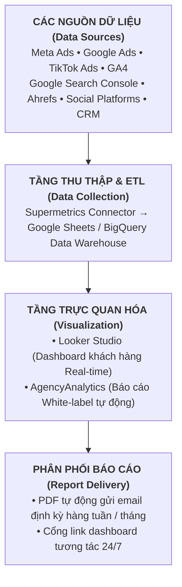

# HỆ THỐNG CÔNG CỤ & QUẢN LÝ VẬN HÀNH NỘI BỘ
## BC VIỆT NAM – FULL-SERVICE DIGITAL MARKETING AGENCY

---
**Tài liệu tham chiếu:** Kết hợp với Báo cáo Chiến lược Marketing BC Việt Nam (tháng 9/2026)  
**Mục tiêu tài liệu:** Đề xuất hệ thống công cụ, phần mềm và quy trình quản lý file vận hành nội bộ cho từng gói dịch vụ – hướng đến xây dựng agency chuyên nghiệp, có hệ thống và có thể mở rộng  
**Căn cứ:** Nghiên cứu thực tiễn từ các marketing agency hàng đầu Đông Nam Á, dữ liệu công khai về công cụ (tháng 9/2026)

---

# TỔNG QUAN KIẾN TRÚC HỆ THỐNG

Toàn bộ hệ thống công cụ của BC Việt Nam được tổ chức theo **3 tầng vận hành**:



---

# PHẦN 1: NỀN TẢNG VẬN HÀNH CHUNG (ÁP DỤNG CHO TOÀN AGENCY)

## 1.1. Quản Lý Dự Án & Phân Công Công Việc

### ⭐ KHUYẾN NGHỊ CHÍNH: ClickUp

**Lý do chọn ClickUp cho BC Việt Nam:**
- Miễn phí gói cơ bản, phí từ $7/người/tháng (gói Business) – phù hợp quy mô agency đang phát triển
- Đa năng nhất: quản lý task, Gantt chart, workload, time tracking, tài liệu nội bộ trong 1 nền tảng
- Có thể tùy biến theo từng loại dịch vụ (template riêng cho mỗi gói)
- Giao diện tiếng Anh nhưng đội ngũ agency Việt Nam đã quen sử dụng

**Cách thiết lập Space trong ClickUp theo gói dịch vụ:**

```
ClickUp Workspace: BC Việt Nam
│
├── 📁 SPACE: Operations (Vận hành nội bộ)
│   ├── HR & Tuyển dụng
│   ├── Tài chính & Hóa đơn
│   └── Admin & Pháp lý
│
├── 📁 SPACE: Sales & BD (Kinh doanh)
│   ├── Pipeline khách hàng mới
│   ├── Proposals đang soạn
│   └── Onboarding khách hàng
│
├── 📁 SPACE: Performance Ads
│   ├── [CLIENT NAME] – Meta Ads
│   ├── [CLIENT NAME] – Google Ads
│   └── [CLIENT NAME] – TikTok Ads
│
├── 📁 SPACE: SEO & Content
│   ├── [CLIENT NAME] – SEO Project
│   └── [CLIENT NAME] – Content Calendar
│
├── 📁 SPACE: Social Media
│   └── [CLIENT NAME] – Social Management
│
├── 📁 SPACE: TikTok & Commerce
│   └── [CLIENT NAME] – TikTok Project
│
├── 📁 SPACE: Digital Brand
│   └── [CLIENT NAME] – Brand Project
│
└── 📁 SPACE: Total Growth (Full-service)
    └── [CLIENT NAME] – Full Retainer
```

**Bảng so sánh lựa chọn thay thế:**

| Tiêu chí | ClickUp ⭐ | Monday.com | Notion | Asana |
|----------|-----------|------------|--------|-------|
| Phí/người/tháng | $7 (Business) | $12 (Standard) | $10 (Plus) | $10.99 (Premium) |
| Time tracking | Có (native) | Có | Không | Có (paid) |
| Gantt chart | Có | Có | Không | Có |
| Quản lý workload | Có | Có (hạn chế) | Không | Có |
| Client portal | Không | Có | Không | Không |
| Độ phức tạp setup | Trung bình | Dễ | Cao | Dễ |
| **Phù hợp BC VN** | **Nhất** | Tốt | Không phù hợp riêng | Tốt |

---

## 1.2. Giao Tiếp Nội Bộ

### ⭐ KHUYẾN NGHỊ: Slack (Kết hợp Zalo cho đội Việt Nam)

| Công cụ | Mục đích | Chi phí |
|---------|----------|---------|
| **Slack** | Giao tiếp team quốc tế, tích hợp với ClickUp/Google | Miễn phí / $7.25/người/tháng (Pro) |
| **Zalo Business** | Giao tiếp nội bộ đội Việt Nam, liên lạc khách hàng Việt | Miễn phí |
| **Google Meet / Zoom** | Họp client và nội bộ | Meet: miễn phí / Zoom: $15.99/host/tháng |

**Cấu trúc kênh Slack gợi ý:**
```
BC Việt Nam Slack
├── #general – Thông báo chung toàn công ty
├── #sales – Pipeline và deal mới
├── #ops – Vận hành và hành chính
├── #ads-team – Team Performance Ads
├── #seo-content-team – Team SEO & Content
├── #social-team – Team Social Media
├── #tiktok-team – Team TikTok & Commerce
├── #design-team – Team Digital Brand
├── #automation-team – Team Marketing Automation
├── #client-[tên_khách] – Kênh riêng từng khách hàng
└── #random – Vui vẻ & văn hóa công ty
```

---

## 1.3. Lưu Trữ & Quản Lý File

### ⭐ KHUYẾN NGHỊ: Google Workspace

**Lý do:**
- Tích hợp hoàn hảo: Drive + Docs + Sheets + Slides + Gmail + Meet
- Dễ chia sẻ với khách hàng (không cần tài khoản để xem)
- Giá $6/người/tháng (Business Starter) – rất hợp lý
- Đội ngũ Việt Nam quen thuộc

**Cấu trúc thư mục Google Drive chuẩn hóa:**

```
📁 BC Việt Nam – Shared Drive
│
├── 📁 1. INTERNAL (Nội bộ)
│   ├── 📁 HR & People
│   │   ├── Job Descriptions
│   │   ├── Onboarding Kits
│   │   └── Training Materials
│   ├── 📁 Finance
│   │   ├── Invoices (Hóa đơn)
│   │   ├── Contracts (Hợp đồng)
│   │   └── Pricing Sheet
│   ├── 📁 Sales & Business Development
│   │   ├── Proposal Templates
│   │   ├── Case Studies
│   │   └── Pitch Decks
│   └── 📁 Brand Assets (BC Việt Nam)
│       ├── Logo & Brand Guidelines
│       └── Company Presentation
│
├── 📁 2. CLIENTS (Khách hàng)
│   └── 📁 [Tên Khách Hàng]
│       ├── 📁 00_Contract & Onboarding
│       │   ├── Hợp đồng dịch vụ
│       │   ├── Brief ban đầu
│       │   └── Onboarding Checklist
│       ├── 📁 01_Strategy
│       │   ├── Phân tích đối thủ
│       │   ├── Kế hoạch Marketing
│       │   └── Strategy Deck
│       ├── 📁 02_Assets (Tài nguyên của KH)
│       │   ├── Logo & Brand KH
│       │   ├── Ảnh sản phẩm
│       │   └── Video nguồn
│       ├── 📁 03_Working Files (File làm việc)
│       │   ├── Ads Creatives
│       │   ├── Content Calendar
│       │   └── SEO Documents
│       ├── 📁 04_Reports (Báo cáo)
│       │   ├── Báo cáo tháng [MM-YYYY]
│       │   └── Dashboard Screenshots
│       └── 📁 05_Archive (Lưu trữ)
│
└── 📁 3. TEMPLATES (Mẫu chuẩn hóa)
    ├── Client Report Templates
    ├── Proposal Templates
    ├── Contract Templates
    ├── Brief Templates
    └── SOP Documents
```

---

## 1.4. Knowledge Base & Wiki Nội Bộ

### ⭐ KHUYẾN NGHỊ: Notion (riêng cho tài liệu hóa và SOP)

Notion được dùng song song với ClickUp nhưng với mục đích khác biệt: **lưu trữ kiến thức, quy trình chuẩn (SOP), tài liệu đào tạo và Wiki nội bộ** – không dùng để quản lý task.

**Cấu trúc Notion Workspace:**
```
BC Việt Nam – Notion Wiki
│
├── 📘 Company Handbook (Sổ tay nhân viên)
├── 📘 Dịch vụ & Báo giá (Luôn cập nhật)
├── 📘 SOPs – Quy trình chuẩn
│   ├── SOP: Onboarding khách hàng mới
│   ├── SOP: Triển khai chiến dịch Ads
│   ├── SOP: Báo cáo hàng tháng
│   └── SOP: Quy trình tạo content SEO
├── 📘 Client Database (Cơ sở dữ liệu KH)
├── 📘 Competitive Intel (Nghiên cứu đối thủ)
├── 📘 Learning Hub (Đào tạo)
│   ├── Tài liệu học nội bộ
│   ├── Case Studies thành công
│   └── Tool Guides
└── 📘 Meeting Notes (Ghi chép cuộc họp)
```

**Chi phí Notion:** Miễn phí cho cá nhân / $10/người/tháng (Plus)

---

# PHẦN 2: CÔNG CỤ CHUYÊN BIỆT THEO TỪNG GÓI DỊCH VỤ

---

## 2.1. GÓI BC PERFORMANCE ADS™ – Công Cụ Quảng Cáo Trả Phí

### A. Nền tảng quảng cáo chính (bắt buộc – miễn phí)

| Công cụ | Nền tảng | Mục đích | Chi phí |
|---------|----------|----------|---------|
| Meta Ads Manager | Facebook/Instagram | Tạo & quản lý chiến dịch | Miễn phí |
| Google Ads Manager | Google Search/Display/YouTube | Tạo & quản lý chiến dịch | Miễn phí |
| TikTok Ads Manager | TikTok | Tạo & quản lý chiến dịch | Miễn phí |
| Microsoft (Bing) Ads | Bing Search | Chiến dịch tìm kiếm Bing | Miễn phí |
| Meta Business Suite | Facebook/Instagram | Quản lý trang + inbox | Miễn phí |
| Google Tag Manager | Tất cả | Cài đặt tracking pixel/event | Miễn phí |
| Google Analytics 4 | Tất cả | Theo dõi hành vi user + conversion | Miễn phí |

### B. Công cụ nghiên cứu & tối ưu (trả phí – ưu tiên cao)

| Công cụ | Mục đích | Chi phí tháng | Ưu tiên |
|---------|----------|---------------|---------|
| **Meta Ads Library** | Nghiên cứu creative đối thủ trên Meta | Miễn phí | ⭐⭐⭐ |
| **Google Ads Transparency Center** | Nghiên cứu ads đối thủ trên Google | Miễn phí | ⭐⭐⭐ |
| **Facebook Pixel Helper** (Chrome) | Debug & kiểm tra Pixel | Miễn phí | ⭐⭐⭐ |
| **AdSpy** | Nghiên cứu creative Facebook/Instagram đối thủ | $149/tháng | ⭐⭐ |
| **Semrush Advertising Toolkit** | Phân tích PPC đối thủ (từ khóa, ngân sách) | Tích hợp gói SEO | ⭐⭐ |
| **Optmyzr** | Tối ưu Google Ads bán tự động | $208/tháng | ⭐ (scale) |
| **Madgicx** | AI audit & tối ưu Meta Ads | $49/tháng | ⭐⭐ |

### C. Công cụ thiết kế creative quảng cáo

| Công cụ | Mục đích | Chi phí tháng | Khuyến nghị |
|---------|----------|---------------|-------------|
| **Canva Pro** | Thiết kế banner, creative nhanh | $15/người/tháng | ⭐⭐⭐ Bắt buộc |
| **Adobe Creative Cloud** | Thiết kế chuyên nghiệp (Photoshop, Illustrator, Premiere) | $54.99/tháng (All Apps) | ⭐⭐⭐ Bắt buộc cho designer |
| **CapCut Business** | Chỉnh sửa video ngắn, creative TikTok/Reels | Miễn phí / $7.99/tháng | ⭐⭐⭐ Bắt buộc |
| **Jasper AI** | AI copywriting cho ad copy | $39/tháng | ⭐⭐ Khuyến nghị |
| **ChatGPT Team** | Brainstorm, viết copy, phân tích | $25/người/tháng | ⭐⭐⭐ Bắt buộc |

### D. Tracking & Attribution nâng cao

| Công cụ | Mục đích | Chi phí | Ưu tiên |
|---------|----------|---------|---------|
| **Conversions API (CAPI)** | Server-side tracking cho Meta, bypass iOS | Miễn phí (cần dev) | ⭐⭐⭐ |
| **UTM Builder** | Chuẩn hóa UTM parameters | Miễn phí | ⭐⭐⭐ |
| **Hyros** | Advanced attribution cho multi-channel | $300+/tháng | ⭐ (enterprise) |
| **Triple Whale** | E-commerce attribution dashboard | $129/tháng | ⭐⭐ (TMĐT) |

### E. Cấu trúc file quản lý vận hành (Performance Ads)

**📁 Google Drive – Client Folder (Ads) chuẩn:**
```
📁 [Tên KH] – Performance Ads
├── 📄 Ads_Strategy_[KH]_[Tháng].docx
├── 📄 Campaign_Structure_Planning.xlsx
├── 📁 Creatives
│   ├── 📁 [YYYY-MM] Static Banners
│   ├── 📁 [YYYY-MM] Video Creatives
│   └── 📁 Approved ✅
├── 📁 Tracking_Setup
│   ├── Pixel_Checklist.xlsx
│   ├── UTM_Matrix.xlsx
│   └── Conversion_Events_Config.docx
├── 📁 Reports
│   ├── Weekly_Ads_Report_[Tuần].xlsx
│   └── Monthly_Report_[MM-YYYY].pdf
└── 📄 Campaign_Log.xlsx (nhật ký thay đổi)
```

**📋 Template báo cáo Ads nội bộ (Google Sheet) cần có:**
- Tab 1: Overview Dashboard (Spend, CPC, CPM, CTR, ROAS, CPA)
- Tab 2: Campaign Performance (chi tiết theo campaign)
- Tab 3: Creative Performance (so sánh các creative)
- Tab 4: Audience Insights
- Tab 5: Budget Tracking (vs. kế hoạch)
- Tab 6: Action Log (ghi nhận tối ưu đã thực hiện)

---

## 2.2. GÓI BC SEO & CONTENT™ – Công Cụ Tối Ưu Tìm Kiếm & Nội Dung

### A. Bộ công cụ SEO cốt lõi

| Công cụ | Mục đích chính | Chi phí tháng | Ưu tiên |
|---------|---------------|---------------|---------|
| **Google Search Console** | Theo dõi ranking, impressions, clicks, lỗi crawl | Miễn phí | ⭐⭐⭐ Bắt buộc |
| **Google Analytics 4** | Phân tích traffic, behavior, conversion | Miễn phí | ⭐⭐⭐ Bắt buộc |
| **Ahrefs** ⭐ | Keyword research, backlink analysis, competitor audit | $129/tháng (Lite) – $249 (Standard) | ⭐⭐⭐ Ưu tiên 1 |
| **Semrush** (thay thế/bổ sung) | All-in-one: SEO + PPC + Content + Social | $139/tháng (Pro) | ⭐⭐⭐ Ưu tiên 1 (nếu không dùng Ahrefs) |
| **Screaming Frog SEO Spider** | Technical SEO audit: crawl website tìm lỗi | Miễn phí (500 URLs) / $259/năm | ⭐⭐⭐ Bắt buộc |
| **Google PageSpeed Insights** | Kiểm tra tốc độ tải trang Core Web Vitals | Miễn phí | ⭐⭐⭐ Bắt buộc |
| **Surfer SEO** | On-page SEO optimization, content score | $89/tháng | ⭐⭐ Khuyến nghị |

> **Gợi ý ngân sách ban đầu (giai đoạn đầu):** Ưu tiên Ahrefs Standard ($249/tháng) + Screaming Frog ($259/năm). Tổng ~7-8 triệu VND/tháng, đủ phục vụ tất cả khách hàng SEO.

### B. Công cụ sản xuất nội dung SEO

| Công cụ | Mục đích | Chi phí | Khuyến nghị |
|---------|----------|---------|-------------|
| **Google Docs** | Soạn thảo bài viết chuẩn, cộng tác real-time | Miễn phí (trong Google Workspace) | ⭐⭐⭐ Bắt buộc |
| **Surfer SEO Content Editor** | Tối ưu on-page score cho bài viết | Gộp trong gói Surfer | ⭐⭐⭐ |
| **ChatGPT / Claude AI** | Hỗ trợ viết outline, draft, edit nhanh | $20-25/tháng | ⭐⭐⭐ Bắt buộc |
| **Hemingway Editor** | Kiểm tra độ dễ đọc, cấu trúc câu | Miễn phí | ⭐⭐ |
| **Grammarly Business** | Kiểm tra ngữ pháp (đặc biệt với content tiếng Anh) | $15/người/tháng | ⭐⭐ |
| **Copyscape** | Kiểm tra đạo văn (plagiarism check) | $0.03/check | ⭐⭐⭐ Bắt buộc |

### C. Công cụ backlink & PR outreach

| Công cụ | Mục đích | Chi phí | Ghi chú |
|---------|----------|---------|---------|
| **Ahrefs Backlink Checker** | Phân tích backlink của KH và đối thủ | Tích hợp trong Ahrefs | - |
| **Hunter.io** | Tìm email liên hệ cho outreach PR | $49/tháng | ⭐⭐ |
| **Pitchbox** | Quản lý chiến dịch outreach backlink tự động | $165/tháng | ⭐ (scale) |
| **Mạng báo Việt Nam** | PR Newswire VN, các trang báo điện tử | Chi phí theo bài đặt | Quản lý bằng Google Sheet |

### D. Cấu trúc file quản lý vận hành (SEO & Content)

**📁 Google Drive – Client Folder (SEO) chuẩn:**
```
📁 [Tên KH] – SEO & Content
├── 📁 00_Audit & Research
│   ├── Technical_SEO_Audit_[Ngày].xlsx
│   ├── Keyword_Research_Master.xlsx
│   └── Competitor_SEO_Analysis.xlsx
├── 📁 01_Strategy
│   ├── SEO_Strategy_Document.docx
│   ├── Content_Pillar_Framework.docx
│   └── SEO_Roadmap_6months.xlsx
├── 📁 02_Content_Calendar
│   └── Content_Calendar_[YYYY].xlsx (master)
├── 📁 03_Articles
│   └── 📁 [YYYY-MM]
│       ├── [Tên bài]_Draft_v1.docx
│       ├── [Tên bài]_Final_Approved.docx
│       └── Published_URLs.xlsx
├── 📁 04_Backlinks
│   ├── Backlink_Database.xlsx
│   ├── Outreach_Tracker.xlsx
│   └── Link_Report_[MM].xlsx
└── 📁 05_Reports
    ├── SEO_Monthly_Report_[MM-YYYY].pdf
    └── Ranking_Tracker.xlsx
```

**📋 Master Keyword Tracking Sheet (Google Sheet) cần có:**
- Tab 1: Keyword Master List (từ khóa, vol, KD, current rank, target rank)
- Tab 2: Ranking Tracker hàng tuần (dùng Ahrefs export)
- Tab 3: Content Status (tên bài, từ khóa target, trạng thái, URL publish)
- Tab 4: Backlink Log
- Tab 5: Monthly Organic Traffic Summary

---

## 2.3. GÓI BC SOCIAL MEDIA™ – Công Cụ Quản Trị Mạng Xã Hội

### A. Công cụ lên lịch & quản lý đăng bài

| Công cụ | Nền tảng hỗ trợ | Điểm mạnh | Chi phí/tháng | Ưu tiên |
|---------|-----------------|-----------|---------------|---------|
| **Meta Business Suite** | Facebook + Instagram | Miễn phí, lên lịch + inbox | Miễn phí | ⭐⭐⭐ Bắt buộc |
| **Buffer** ⭐ | FB, IG, TikTok, LinkedIn, X, Pinterest | Đơn giản, giá tốt, phù hợp SME | $6/kênh/tháng (~6-10 kênh = $36-60) | ⭐⭐⭐ Khuyến nghị |
| **Hootsuite** | 35+ nền tảng | Toàn diện, inbox hợp nhất | $99/tháng | ⭐⭐ (scale) |
| **Later** | IG, FB, TikTok, Pinterest | Mạnh về visual planning, IG | $18-40/tháng | ⭐⭐ |
| **Zalo OA Console** | Zalo Official Account | Quản lý OA Zalo | Miễn phí | ⭐⭐⭐ |

> **Gợi ý**: Giai đoạn đầu dùng **Meta Business Suite + Buffer** – tổng chi phí khoảng $40-60/tháng, đủ quản lý 8-10 kênh xã hội cho nhiều khách hàng.

### B. Công cụ sản xuất nội dung Social Media

| Công cụ | Mục đích | Chi phí/tháng | Ghi chú |
|---------|----------|---------------|---------|
| **Canva Pro** | Thiết kế template bài đăng, story, cover | $15/người | ⭐⭐⭐ Bắt buộc |
| **CapCut Business** | Edit video ngắn cho Reels/TikTok | Miễn phí | ⭐⭐⭐ Bắt buộc |
| **Adobe Express** | Thiết kế nhanh, animation nhẹ | Tích hợp Creative Cloud hoặc $9.99 | ⭐⭐ |
| **Epidemic Sound** | Nhạc bản quyền cho video | $15/tháng | ⭐⭐ Khuyến nghị |
| **Pexels / Unsplash** | Ảnh stock miễn phí | Miễn phí | ⭐⭐⭐ |
| **Shutterstock** | Ảnh stock chuyên nghiệp | $29-49/tháng | ⭐⭐ |

### C. Công cụ theo dõi & phân tích Social Media

| Công cụ | Mục đích | Chi phí | Ghi chú |
|---------|----------|---------|---------|
| **Meta Insights** | Analytics FB/IG native | Miễn phí | ⭐⭐⭐ |
| **TikTok Analytics** | Analytics TikTok native | Miễn phí | ⭐⭐⭐ |
| **Sprout Social** | Deep analytics, social listening, reporting | $199/seat/tháng | ⭐ (chỉ khi scale lớn) |
| **Brandwatch** | Social listening, brand monitoring | Giá theo yêu cầu | ⭐ (enterprise) |
| **Mention.com** | Social listening phù hợp SME/agency | $41-149/tháng | ⭐⭐ |

### D. Cấu trúc file quản lý vận hành (Social Media)

**📁 Google Drive – Client Folder (Social Media) chuẩn:**
```
📁 [Tên KH] – Social Media
├── 📁 00_Brand Assets
│   ├── Logo & Màu sắc
│   ├── Brand Voice Guide
│   └── Template Content (Canva link)
├── 📁 01_Strategy
│   ├── Social_Media_Strategy.docx
│   ├── Content_Pillar.docx
│   └── Competitor_Analysis_Social.xlsx
├── 📁 02_Content_Calendar
│   └── Content_Calendar_[YYYY-MM].xlsx
├── 📁 03_Published_Content
│   └── 📁 [YYYY-MM]
│       ├── Hình ảnh đã đăng
│       ├── Video đã đăng
│       └── Published_Post_Log.xlsx
└── 📁 04_Reports
    └── Social_Monthly_Report_[MM-YYYY].pdf
```

**📋 Content Calendar Template (Google Sheet) cần có:**
- Ngày đăng | Nền tảng | Loại nội dung | Pillar chủ đề | Caption | Hashtag | Link ảnh/video | Trạng thái | URL sau khi đăng | Ghi chú

---

## 2.4. GÓI BC TIKTOK & SOCIAL COMMERCE™ – Công Cụ TikTok & TMĐT

### A. Công cụ quản lý TikTok

| Công cụ | Mục đích | Chi phí | Ghi chú |
|---------|----------|---------|---------|
| **TikTok Ads Manager** | Tạo & quản lý quảng cáo TikTok | Miễn phí | ⭐⭐⭐ Bắt buộc |
| **TikTok Business Center** | Quản lý tài khoản Agency TikTok (BC đã có) | Miễn phí | ⭐⭐⭐ Bắt buộc |
| **TikTok Shop Seller Center** | Quản lý gian hàng TikTok Shop | Miễn phí | ⭐⭐⭐ |
| **TikTok Creative Center** | Nghiên cứu trend, top ads, hashtag | Miễn phí | ⭐⭐⭐ Bắt buộc |
| **TikTok One** | Kết nối Creator, quản lý chiến dịch affiliate | Miễn phí | ⭐⭐⭐ |

### B. Công cụ sản xuất nội dung TikTok

| Công cụ | Mục đích | Chi phí/tháng | Ghi chú |
|---------|----------|---------------|---------|
| **CapCut Business** ⭐ | Chỉnh sửa video TikTok chuyên nghiệp, có AI | Miễn phí | ⭐⭐⭐ Bắt buộc |
| **TikTok Video Editor** | Editor native trong app | Miễn phí | ⭐⭐⭐ |
| **InShot** | Edit video mobile nhanh | Miễn phí / $3.99/tháng | ⭐⭐ |
| **Descript** | Edit video dạng text, tạo captions tự động | $24/tháng | ⭐⭐ |
| **Arcads** | Tạo AI video ad (avatar AI đọc script) | $299+/tháng | ⭐ (scale) |
| **ElevenLabs** | AI voiceover cho video | $5-22/tháng | ⭐⭐ |

### C. Công cụ quản lý TMĐT & Livestream

| Công cụ | Mục đích | Chi phí | Ghi chú |
|---------|----------|---------|---------|
| **Shopee Seller Center** | Quản lý gian hàng Shopee | Miễn phí | ⭐⭐⭐ |
| **Lazada Seller Center** | Quản lý gian hàng Lazada | Miễn phí | ⭐⭐⭐ |
| **Sapo / KiotViet** | Quản lý đơn hàng đa kênh cho SME Việt | 200-500k/tháng | ⭐⭐⭐ (cho KH nhỏ) |
| **Haravan / Shopify** | Nền tảng D2C cho website KH | $25-79/tháng | ⭐⭐ (D2C brand) |
| **StreamYard** | Livestream đồng thời nhiều kênh | $49/tháng | ⭐⭐ (nếu cần multi-stream) |
| **OBS Studio** | Phần mềm stream miễn phí, cần setup | Miễn phí | ⭐⭐⭐ (tiết kiệm) |

### D. Nghiên cứu & Phân tích TikTok

| Công cụ | Mục đích | Chi phí | Ghi chú |
|---------|----------|---------|---------|
| **TikTok Creative Center** | Xem top trending ads, hashtag, music | Miễn phí | ⭐⭐⭐ |
| **FastMoss** | Phân tích TikTok Shop: top products, shops, sales | $99/tháng | ⭐⭐⭐ Rất quan trọng |
| **Kalodata** | Phân tích sâu TikTok Shop & creator performance | $99-249/tháng | ⭐⭐ |
| **Pentos** | TikTok analytics & trending sounds | $99/tháng | ⭐⭐ |

### E. Cấu trúc file quản lý vận hành (TikTok & Commerce)

```
📁 [Tên KH] – TikTok & Commerce
├── 📁 00_Brand & Product Assets
│   ├── Ảnh sản phẩm gốc
│   ├── Video raw
│   └── TikTok Brand Kit
├── 📁 01_Strategy
│   ├── TikTok_Strategy.docx
│   ├── Product_Listing_Plan.xlsx
│   └── Live_Schedule.xlsx
├── 📁 02_Content
│   └── 📁 [YYYY-MM]
│       ├── Script_Video_[STT].docx
│       ├── Video_Final/
│       └── Published_TikTok_Log.xlsx
├── 📁 03_TikTok_Shop
│   ├── Product_Catalog.xlsx
│   ├── Promotion_Calendar.xlsx
│   └── Order_GMV_Tracker.xlsx
├── 📁 04_Ads
│   ├── TikTok_Ads_Campaign_Structure.xlsx
│   └── Creative_Performance.xlsx
└── 📁 05_Reports
    ├── TikTok_Weekly_[Tuần].pdf
    └── Monthly_GMV_Report_[MM].xlsx
```

---

## 2.5. GÓI BC DIGITAL BRAND™ – Công Cụ Thiết Kế & Xây Dựng Thương Hiệu Số

### A. Công cụ thiết kế thương hiệu

| Công cụ | Mục đích | Chi phí/tháng | Ưu tiên |
|---------|----------|---------------|---------|
| **Adobe Creative Cloud** ⭐ | Photoshop, Illustrator, InDesign, Premiere – tiêu chuẩn ngành | $54.99 (All Apps) | ⭐⭐⭐ Bắt buộc cho designer |
| **Figma** ⭐ | UI/UX design, prototype, cộng tác real-time | Miễn phí / $15/người | ⭐⭐⭐ Bắt buộc |
| **Canva Teams** | Design nhanh cho team, không cần designer | $30/team/tháng | ⭐⭐⭐ |
| **Adobe Firefly** | AI-generated images & design elements | Tích hợp trong Creative Cloud | ⭐⭐ |
| **Midjourney** | AI image generation chuyên nghiệp | $10-60/tháng | ⭐⭐ |

### B. Công cụ thiết kế & phát triển website

| Công cụ | Mục đích | Chi phí | Ghi chú |
|---------|----------|---------|---------|
| **WordPress** ⭐ | CMS phổ biến nhất, linh hoạt, nhiều plugin | Miễn phí (cần hosting) | ⭐⭐⭐ Tiêu chuẩn |
| **Webflow** | No-code website chuyên nghiệp, responsive | $14-39/project/tháng | ⭐⭐⭐ Khuyến nghị cho landing page |
| **Elementor Pro** | Page builder cho WordPress | $99/năm | ⭐⭐⭐ |
| **Yoast SEO** | SEO plugin cho WordPress | $99/năm | ⭐⭐⭐ |
| **WP Rocket** | Tăng tốc website WordPress | $49/năm | ⭐⭐⭐ |
| **Hostinger / SiteGround** | Hosting website | 60-150k/tháng (Hostinger VN) | ⭐⭐⭐ |

### C. Công cụ quản lý dự án thiết kế

| Công cụ | Mục đích | Chi phí | Ghi chú |
|---------|----------|---------|---------|
| **Figma** | Bàn giao design cho developer, prototype | Xem trên | ⭐⭐⭐ |
| **Zeplin** | Handoff design → developer | $12/tháng | ⭐⭐ |
| **Loom** | Ghi video review/feedback thiết kế | $15/người/tháng | ⭐⭐⭐ Rất hữu ích |
| **Frame.io** | Review video & animation với client | $15/tháng | ⭐⭐ |

### D. Cấu trúc file quản lý vận hành (Digital Brand)

```
📁 [Tên KH] – Digital Brand Project
├── 📁 00_Brief & Research
│   ├── Brand_Brief.docx
│   ├── Competitor_Visual_Analysis/
│   └── Mood_Board/
├── 📁 01_Brand_Identity
│   ├── 📁 Logo (AI, EPS, PNG, SVG)
│   ├── 📁 Brand_Guidelines (PDF + Source)
│   ├── Color_Palette.ase (Adobe Swatch)
│   └── Typography_Files/
├── 📁 02_Social_Media_Kit
│   ├── Templates Canva (link)
│   ├── Exported_Templates (PNG/MP4)
│   └── Story_Highlights_Icons/
├── 📁 03_Website
│   ├── Wireframe_v1 (Figma link)
│   ├── Design_Mockup_v[x] (Figma link)
│   └── Website_Content.docx
├── 📁 04_Deliverables_Final ✅
│   ├── Brand_Package_Final.zip
│   └── Website_Live_URL.txt
└── 📁 05_Revisions_History
    ├── Client_Feedback_v1.docx
    └── Revision_Log.xlsx
```

---

## 2.6. GÓI BC MARKETING AUTOMATION™ – Công Cụ CRM & Tự Động Hóa

### A. Nền tảng CRM & Marketing Automation

| Công cụ | Phù hợp với | Chi phí/tháng | Ưu tiên |
|---------|-------------|---------------|---------|
| **HubSpot Marketing Hub** ⭐ | Doanh nghiệp có budget, cần CRM đầy đủ | Miễn phí (cơ bản) / $800 (Professional) | ⭐⭐⭐ Tốt nhất về năng lực |
| **ActiveCampaign** ⭐ | SME muốn automation mạnh với giá hợp lý | $15-159/tháng (theo contacts) | ⭐⭐⭐ Khuyến nghị cho SME |
| **Zoho CRM + Marketing** | Doanh nghiệp muốn bộ tích hợp đầy đủ giá tốt | $14-52/người/tháng | ⭐⭐ Tốt cho B2B |
| **Mailchimp** | Email marketing đơn giản, SME nhỏ | Miễn phí / $13+/tháng | ⭐⭐ Chỉ email |
| **Brevo (Sendinblue)** | Email + SMS + WhatsApp automation | Miễn phí / $25/tháng | ⭐⭐⭐ Tốt cho thị trường VN |

> **Khuyến nghị cho BC Việt Nam (giai đoạn đầu):**
> - Khách hàng SME nhỏ (<5,000 contacts): **Brevo** hoặc **ActiveCampaign starter**
> - Khách hàng SME lớn (5,000-50,000 contacts): **ActiveCampaign** hoặc **HubSpot Starter**
> - Khách hàng enterprise: **HubSpot Professional**

### B. Công cụ Chatbot & Messaging Automation

| Công cụ | Nền tảng | Mục đích | Chi phí/tháng |
|---------|----------|----------|---------------|
| **ManyChat** ⭐ | Facebook Messenger + Instagram + WhatsApp | Chatbot automation, lead gen | Miễn phí / $15 |
| **Pancake / Fchat** | Facebook, Zalo, TikTok | CRM + Chatbot phổ biến tại VN | 300-800k |
| **Zalo ZNS API** | Zalo Notification Service | Gửi thông báo chính thức qua Zalo | Theo lượt gửi |
| **WATI / Twilio** | WhatsApp Business API | Automation qua WhatsApp | $49-299 |
| **Tidio** | Website live chat + chatbot | Chăm sóc KH trên website | $29/tháng |

### C. Công cụ kết nối & tích hợp (Integration)

| Công cụ | Mục đích | Chi phí/tháng | Ghi chú |
|---------|----------|---------------|---------|
| **Make (Zapier thay thế)** ⭐ | Kết nối các app, tự động hóa workflow không cần code | Miễn phí / $9-29 | ⭐⭐⭐ Rẻ hơn Zapier 3-5x |
| **Zapier** | Kết nối app automation | $19.99-69/tháng | ⭐⭐ Phổ biến hơn nhưng đắt hơn |
| **n8n** | Self-hosted automation, linh hoạt tuyệt đối | Miễn phí (self-host) | ⭐⭐ Cần kỹ thuật |

### D. Cấu trúc file quản lý vận hành (Marketing Automation)

```
📁 [Tên KH] – Marketing Automation
├── 📁 00_Discovery
│   ├── Customer_Journey_Map.pdf
│   ├── Funnel_Audit.xlsx
│   └── Tech_Stack_Current.docx
├── 📁 01_Strategy
│   ├── Automation_Strategy.docx
│   ├── Email_Sequence_Flow (Flowchart)
│   └── Lead_Scoring_Criteria.xlsx
├── 📁 02_Setup_Documentation
│   ├── CRM_Setup_Guide.docx
│   ├── Integration_Map.xlsx (tool A → tool B)
│   └── Zalo_ZNS_Template_Library/
├── 📁 03_Email_Templates
│   ├── Welcome_Series/
│   ├── Nurture_Sequence/
│   └── Re-engagement/
├── 📁 04_Reports
│   ├── Automation_Performance_[MM].xlsx
│   └── Lead_Funnel_Report_[MM].pdf
└── 📄 Automation_Technical_Doc.docx (tài liệu kỹ thuật)
```

---

## 2.7. GÓI BC TOTAL GROWTH™ – Hệ Thống Điều Phối Full-Service

Với gói flagship này, cần **hệ thống vận hành tích hợp** kết hợp tất cả công cụ trên cộng thêm:

### Công cụ Điều Phối & Báo Cáo Tổng Hợp

| Công cụ | Mục đích | Chi phí/tháng | Ghi chú |
|---------|----------|---------------|---------|
| **ClickUp (Master Board)** | Dashboard tổng hợp tất cả hoạt động của KH | Tích hợp sẵn | ⭐⭐⭐ |
| **Looker Studio (Google Data Studio)** ⭐ | Báo cáo đa kênh tự động cho KH | Miễn phí | ⭐⭐⭐ Bắt buộc |
| **Supermetrics** | Kéo data từ tất cả platform → Google Sheet/Looker Studio | $39-199/tháng | ⭐⭐⭐ Cực kỳ tiết kiệm thời gian |
| **AgencyAnalytics** | Báo cáo khách hàng white-label tự động | $10/KH/tháng | ⭐⭐⭐ Khuyến nghị cho reporting |

---

# PHẦN 3: HỆ THỐNG ĐO LƯỜNG & BÁO CÁO TỔNG QUAN

## 3.1. Kiến Trúc Dữ Liệu & Báo Cáo



## 3.2. Hệ Thống Báo Cáo Chuẩn Cho Khách Hàng

| Loại báo cáo | Tần suất | Công cụ | Hình thức |
|-------------|---------|---------|-----------|
| Daily Stats (nội bộ) | Hàng ngày | Google Sheet tự động | Nội bộ team |
| Weekly Performance Report | Hàng tuần | Google Sheet + Slide | Gửi KH qua email |
| Monthly Full Report | Hàng tháng | Looker Studio / AgencyAnalytics | PDF + Dashboard link |
| Quarterly Strategic Review | Mỗi quý | Google Slides | Họp trực tiếp/online |

---

# PHẦN 4: TỔNG HỢP CHI PHÍ ĐẦU TƯ CÔNG CỤ

## 4.1. Chi Phí Công Cụ Vận Hành Toàn Agency (Ước tính)

*Giả định: Agency có 10-15 nhân sự, phục vụ 15-25 khách hàng đồng thời. Tỷ giá ước tính $1 = 25,000 VND. Giá chưa VAT.*

### Tầng 1 – Bắt buộc ngay từ đầu

| Công cụ | Chi phí/tháng (USD) | Chi phí/tháng (VND) |
|---------|---------------------|---------------------|
| Google Workspace (10 users) | $60 | ~1,500,000 |
| ClickUp Business (10 users) | $70 | ~1,750,000 |
| Canva Pro (5 users) | $75 | ~1,875,000 |
| Adobe Creative Cloud (2 designers) | $110 | ~2,750,000 |
| CapCut Business | $0 | Miễn phí |
| Buffer (12 kênh) | $72 | ~1,800,000 |
| Ahrefs Standard | $249 | ~6,225,000 |
| Screaming Frog (năm) | $22 | ~550,000 |
| Looker Studio | $0 | Miễn phí |
| ChatGPT Team (5 users) | $125 | ~3,125,000 |
| Make.com (automation) | $29 | ~725,000 |
| **Tổng Tầng 1** | **~$812/tháng** | **~20,300,000 VND/tháng** |

### Tầng 2 – Mở rộng khi có thêm khách hàng

| Công cụ | Chi phí/tháng (USD) | Khi nào cần |
|---------|---------------------|-------------|
| Supermetrics (Ads + GA4) | $99 | Khi có 5+ KH ads |
| AgencyAnalytics (15 KH) | $150 | Khi có 10+ KH cần báo cáo tự động |
| ManyChat Pro | $15 | Khi triển khai chatbot |
| ActiveCampaign (2,500 contacts) | $39 | Khi bán gói Automation |
| FastMoss (TikTok research) | $99 | Khi có 3+ KH TikTok Shop |
| Notion Plus (10 users) | $100 | Khi đội ngũ > 10 người |
| **Tổng Tầng 2** | **~$502/tháng** | **~12,550,000 VND/tháng** |

### Tổng chi phí công cụ ước tính

| Giai đoạn | Chi phí công cụ/tháng | Ghi chú |
|-----------|----------------------|---------|
| Giai đoạn khởi động (0-3 tháng) | ~20-22 triệu VND | Chỉ Tầng 1 |
| Giai đoạn phát triển (3-6 tháng) | ~30-35 triệu VND | Tầng 1 + một số Tầng 2 |
| Giai đoạn ổn định (6+ tháng) | ~35-45 triệu VND | Đầy đủ cả 2 tầng |

> **Lưu ý quan trọng:** Chi phí công cụ nên được đưa vào **cost model dịch vụ** và phân bổ vào phí dịch vụ của từng khách hàng (thường tính ~10-15% phí dịch vụ hàng tháng là chi phí phần mềm và hạ tầng).

---

# PHẦN 5: QUY TRÌNH ONBOARDING KHÁCH HÀNG MỚI (SOP Chuẩn Hóa)

## 5.1. Checklist Onboarding Khách Hàng Mới (Dùng ClickUp Template)

### Tuần 1: Tiếp nhận & Thiết lập hạ tầng

- [ ] Ký hợp đồng dịch vụ + biên bản bàn giao
- [ ] Tạo thư mục Google Drive theo cấu trúc chuẩn
- [ ] Tạo project trong ClickUp, phân công Account Manager
- [ ] Tạo kênh riêng trong Slack (#client-[tên])
- [ ] Thu thập brand assets (logo, màu sắc, font, ảnh sản phẩm)
- [ ] Thu thập quyền truy cập: Ads Manager, GA4, GSC, trang mạng xã hội
- [ ] Cài đặt/kiểm tra tracking: Pixel, GA4, Google Tag Manager
- [ ] Điền đầy đủ Client Intake Form (thông tin brand, target audience, đối thủ, mục tiêu)

### Tuần 2: Phân tích & Lập kế hoạch

- [ ] Hoàn thành audit (theo dịch vụ): Ads audit / SEO audit / Social audit
- [ ] Nghiên cứu đối thủ
- [ ] Xây dựng Strategy Document
- [ ] Trình bày Strategy cho khách hàng (kick-off meeting)
- [ ] Nhận phê duyệt chiến lược

### Tuần 3-4: Triển khai

- [ ] Setup campaign / publish content / bắt đầu SEO tasks theo kế hoạch
- [ ] Test và đảm bảo tất cả tracking hoạt động chính xác
- [ ] Bàn giao dashboard báo cáo cho khách hàng

---

# PHẦN 6: KHUYẾN NGHỊ TRIỂN KHAI THEO THỨ TỰ ƯU TIÊN

## Roadmap Triển Khai Hệ Thống Công Cụ

| Tuần | Hành động | Ưu tiên |
|------|-----------|---------|
| **Tuần 1-2** | Setup Google Workspace, ClickUp (cấu trúc Space theo dịch vụ), Slack workspace | 🔴 Bắt buộc |
| **Tuần 2-3** | Thiết lập cấu trúc Google Drive chuẩn + toàn bộ Templates | 🔴 Bắt buộc |
| **Tuần 3-4** | Viết SOP cho từng quy trình cốt lõi vào Notion | 🔴 Bắt buộc |
| **Tháng 2** | Mua Ahrefs, setup Screaming Frog, cài Canva Pro & Adobe CC | 🔴 Bắt buộc |
| **Tháng 2** | Cài đặt Buffer, thiết lập luồng báo cáo Looker Studio mẫu | 🟡 Quan trọng |
| **Tháng 2-3** | Mua ChatGPT Team, Make.com, CapCut Business | 🟡 Quan trọng |
| **Tháng 3-4** | Mua Supermetrics, AgencyAnalytics khi có đủ 5+ khách hàng | 🟢 Khi cần |
| **Tháng 4-6** | Triển khai ActiveCampaign/HubSpot khi bán được gói Automation | 🟢 Khi cần |
| **Tháng 6+** | Cân nhắc FastMoss, Madgicx, Optmyzr khi scale lớn | 🟢 Tùy chọn |

---

*Tài liệu này được lập tháng 9/2026. Thị trường công cụ marketing thay đổi nhanh – khuyến nghị review lại chi phí và tính năng các công cụ mỗi 6 tháng. Giá USD quy đổi theo tỷ giá hiện hành tại thời điểm mua.*
