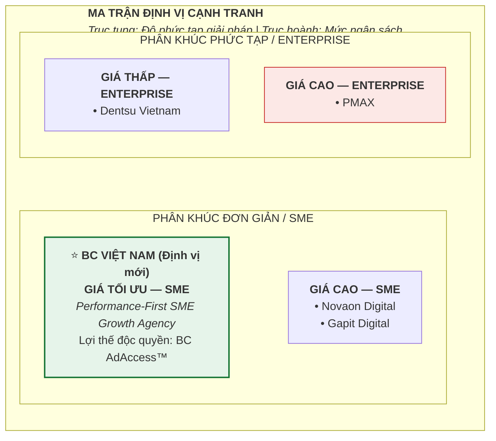
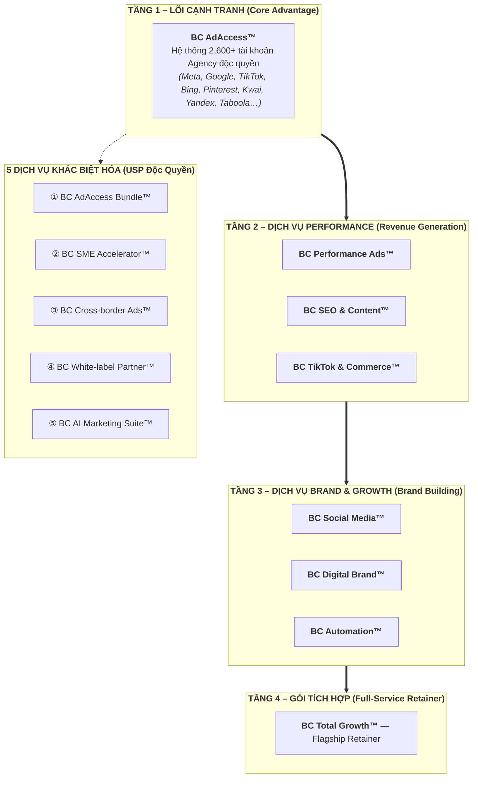
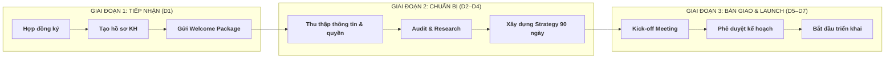
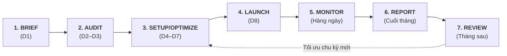
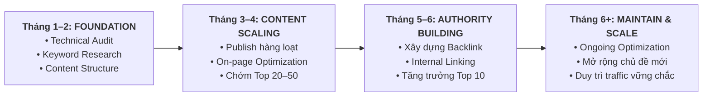
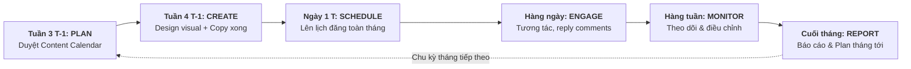
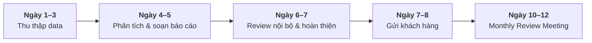
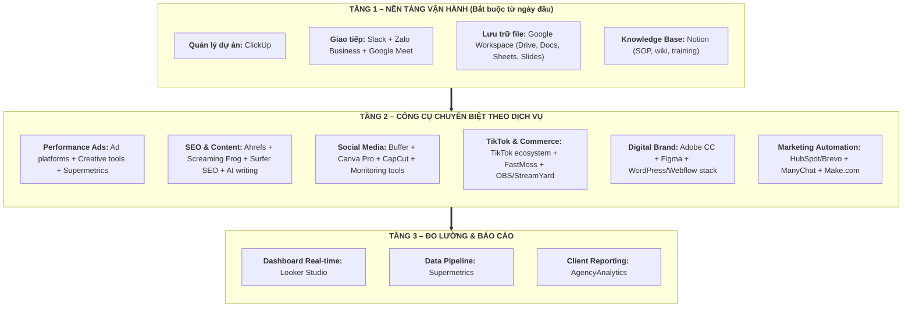
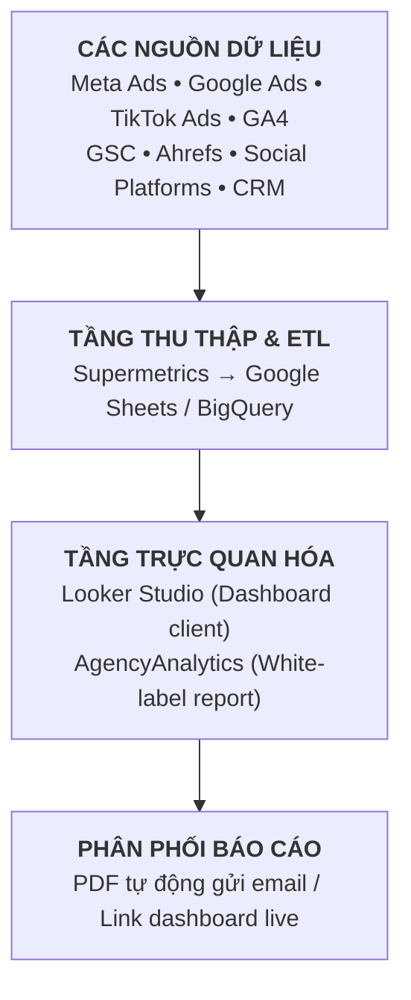

# BỘ TÀI LIỆU CHIẾN LƯỢC VẬN HÀNH TOÀN DIỆN
## BC VIỆT NAM – THE PERFORMANCE-FIRST GROWTH AGENCY

---

**Kính gửi:** Ban Giám đốc Công ty TNHH Truyền Thông & Dịch Vụ BC Việt Nam  
**Ngày lập:** Tháng 9/2026  
**Tính chất:** Tài liệu nội bộ – Bảo mật  
**Phạm vi:** Chiến lược toàn diện – từ nghiên cứu thị trường đến vận hành thực tế

---

> *Tài liệu này tổng hợp đầy đủ toàn bộ chiến lược, hệ thống dịch vụ, quy trình vận hành và nguồn lực cần chuẩn bị để BC Việt Nam chuyển dịch thành công từ Ad Account Rental sang Full-Service Digital Marketing Agency. Đây là cẩm nang triển khai thực tế, không phải tài liệu lý thuyết.*

---

## MỤC LỤC

| Phần | Nội dung |
|------|---------|
| **PHẦN I** | Nghiên cứu thị trường |
| **PHẦN II** | Định vị thương hiệu |
| **PHẦN III** | Các gói sản phẩm dịch vụ |
| **PHẦN IV** | Quy trình vận hành cơ bản |
| **PHẦN V** | Nguồn lực tài nguyên cần chuẩn bị |

---

---

# PHẦN I: NGHIÊN CỨU THỊ TRƯỜNG

---

## 1.1. Phân Tích Đối Thủ Cạnh Tranh Chính – PMAX

### Tổng quan PMAX

**PMAX** (thành lập 2016) tự định vị là **"Total Marketing Partner"** – Đối tác Marketing Tổng thể tại Việt Nam, với tầm nhìn kiến tạo "hệ sinh thái marketing toàn diện".

| Chỉ số | Số liệu (theo nguồn công khai PMAX) |
|--------|----------------|
| Số năm hoạt động | ~10 năm (thành lập 2016) |
| Thành tích dự án/khách hàng | 700+ dự án cho 400+ khách hàng *(hoặc 600+ chiến dịch cho 500+ thương hiệu – số liệu khác nhau theo trang/thời điểm; không nên dùng "700+ thương hiệu")* |
| Quy mô nhân sự | 200+ nhân sự *(một số trang nêu 250+; số liệu có thể thay đổi theo thời điểm)* |
| Chuyên gia cấp cao | 50+ chuyên gia *(theo tự công bố của PMAX)* |
| Văn phòng | 2 (TP.HCM & Hà Nội) |
| Giải thưởng tiêu biểu | Digital Agency of the Year – MMA Smarties **Vietnam 2024** và MMA Smarties **APAC 2023** |

> ⚠️ **Lưu ý biên soạn:** Không dùng "700+ thương hiệu" (dễ nhầm với "dự án"); Không dùng "Top 1 APAC 2026" (chưa có bằng chứng công khai năm 2026). Luôn ghi rõ tên giải và năm cụ thể.

**Khách hàng tiêu biểu:** Vietjet, FE Credit, Vinfast, Watsons, Cuckoo, Lock&Lock – toàn bộ là tập đoàn lớn và doanh nghiệp FDI.

### Danh mục dịch vụ PMAX (6 nhóm)

| Nhóm dịch vụ | Nội dung chính |
|-------------|----------------|
| **Total Marketing Consulting** | Data Science (MMM), Growth Strategy, Brand Strategy, GTM Strategy |
| **Total Brand Communications** | Branding for Performance, Creative Strategy, Campaign Planning & Execution |
| **Total Media** | Media for App, Branding, E-commerce, Lead Generation |
| **Total E-Commerce Management** | Multi Channel Affiliate, E2E Activation, Multi-channel Ecommerce Management |
| **Total MCNs Powerhouse** | Influencer Partnership, Creator Development, Mega/Performance Livestream |
| **Digital Marketing Academy** | Đào tạo Digital Marketing cá nhân và doanh nghiệp |

### USP của PMAX

| USP | Biểu hiện cụ thể |
|-----|-----------------|
| Data-driven approach | Hệ thống dữ liệu từ 5+ ngành; Marketing Mix Modeling (MMM) |
| Chuyên gia ngành hàng | Chuyên gia sâu theo từng ngành (FMCG, Tài chính, BĐS, App…) |
| Full-funnel integration | Branding → Performance → E-commerce → CRM tích hợp |
| Co-creation model | Đồng sáng tạo với khách hàng qua working sessions |
| Track record & awards | 16+ giải thưởng quốc tế, Top 1 APAC |

### Tệp khách hàng mục tiêu của PMAX

| Phân khúc | Đặc điểm |
|-----------|----------|
| Doanh nghiệp lớn & Tập đoàn | Ngân sách marketing từ 2 tỷ VND+/năm |
| Thương hiệu FDI tại Việt Nam | Cần agency địa phương hiểu thị trường |
| Scale-up & Unicorn | Startup Series B+ cần tăng trưởng có hệ thống |
| Ngành hàng trọng điểm | FMCG, Tài chính – ngân hàng, BĐS, TMĐT, App/Tech, Dược mỹ phẩm |

> **Nhận định chiến lược:** Danh mục khách hàng công khai của PMAX cho thấy họ đặc biệt mạnh trong phân khúc doanh nghiệp lớn và FDI. Tuy nhiên, **chưa có đủ bằng chứng công khai để khẳng định PMAX không phục vụ SME hoặc áp mức tối thiểu 100–200 triệu/tháng**. Cơ hội của BC Việt Nam nằm ở khả năng phục vụ **phân khúc SME cụ thể** (theo ngành, địa bàn, ngân sách) với tốc độ, tính minh bạch và hạ tầng tài khoản Agency – không phải dựa trên giả định đối thủ "bỏ ngỏ" hoàn toàn phân khúc này.

---

## 1.2. Bức Tranh Cạnh Tranh Toàn Diện

| Agency | Định vị | Điểm mạnh | Khác biệt so với PMAX |
|--------|---------|-----------|----------------------|
| **PMAX** | Total Marketing Partner cho enterprise | Full-funnel, data-driven, 250+ nhân sự | Benchmark cao nhất ngành |
| **Novaon Digital** | Performance + SEO + Data | Mạnh về SEO kỹ thuật, Google Marketing Partner | Thiên SEO/SEM hơn |
| **Dentsu Vietnam** | Full-service (traditional + digital) | Network quốc tế, phục vụ tập đoàn đa quốc gia | Mạnh offline, phân khúc cao nhất |
| **Gapit Digital** | Digital transformation + Performance | Tích hợp công nghệ & marketing, mạnh B2B | Thiên B2B enterprise |
| **Agency nhỏ lẻ/Freelancer** | Đa dạng, không chuyên | Giá thấp | Thiếu hệ thống, thiếu hạ tầng |

---

## 1.3. Khoảng Trắng Thị Trường – Cơ Hội Của BC Việt Nam

Phân tích cạnh tranh cho thấy **ít nhất 5 khoảng trắng chiến lược** mà không agency nào đang chiếm giữ:

| # | Khoảng trắng cần kiểm chứng | Nhận định thực tế |
|---|-------------|---------------|
| 1 | **Phân khúc SME chưa được phục vụ đúng cách:** 92,5% doanh nghiệp thành lập mới năm 2024 có vốn 0–10 tỷ đồng. Phân khúc SME cụ thể (theo ngành, ngân sách) cần được nghiên cứu TAM/SAM/SOM riêng. *(Lưu ý: không dùng số "500,000 SME" chưa được xác minh rõ nguồn và định nghĩa.)* | Lớn – cần định lượng |
| 2 | **Tài khoản Agency + Managed Service:** BC có hạ tầng Agency Account đa nền tảng đã vận hành; kết hợp với dịch vụ quản lý là định vị rõ ràng. *(Lưu ý: cần kiểm tra thị trường thường xuyên vì có đối thủ như Mega Digital cũng cung cấp Agency Account + service.)* | Khả thi – cần kiểm tra thị trường |
| 3 | **Quảng cáo xuyên biên giới:** BC có kinh nghiệm và tài khoản đa nền tảng quốc tế (Bing, Taboola, Yandex…). *(Lưu ý: không dùng "agency Việt duy nhất" vì chưa khảo sát toàn bộ thị trường.)* | Lớn – lợi thế thực tế |
| 4 | **White-label cho agency nhỏ:** 5,000–10,000 freelancer/agency nhỏ thiếu hạ tầng, cần backend partner | Lớn |
| 5 | **AI Marketing thực chiến:** "Cửa sổ cơ hội 12–24 tháng" là giả thuyết chiến lược, không phải dự báo chắc chắn. BC cần pilot có đo lường trước khi công bố mức tiết kiệm cụ thể. | Giả thuyết – cần pilot |

> ⚠️ **Lưu ý biên soạn:** Các con số "70% tiết kiệm creative" hay "nhanh hơn 5x" cần được đo lường qua pilot trước khi đưa vào tài liệu truyền thông chính thức.

---

## 1.4. Profile Hiện Tại Của BC Việt Nam – Lợi Thế Xuất Phát

| Chỉ số | Số liệu |
|--------|---------|
| Số năm hoạt động | 8+ năm |
| Khách hàng toàn cầu | 1,000+ khách hàng |
| Tài khoản quảng cáo | 2,600+ tài khoản Agency đang hoạt động |
| Số nền tảng hỗ trợ | 12+ nền tảng (Meta, Google, TikTok, Bing, Pinterest, Kwai, Yandex, Taboola, VK, X, Bigo…) |
| Trụ sở | Hà Nội |
| Tư cách đối tác | Đối tác chính thức TikTok và nhiều nền tảng lớn |

> **Điểm mấu chốt:** BC Việt Nam đang sở hữu đồng thời **hạ tầng tài khoản Agency quy mô lớn** và **đang xây dựng năng lực full-service marketing**. Sự kết hợp này tạo ra lợi thế cạnh tranh khó tái tạo trong ngắn hạn — đặc biệt với các agency nhỏ chưa có hạ tầng tài khoản Agency.
>
> *Lưu ý: Số liệu "2,600+ tài khoản", "1,000+ khách hàng" và "8+ năm" là thông tin nội bộ chưa được kiểm toán độc lập. Cần cập nhật từ dữ liệu vận hành thực tế trước khi đưa vào tài liệu đối ngoại.*

---

---

# PHẦN II: ĐỊNH VỊ THƯƠNG HIỆU

---

## 2.1. Vấn Đề Định Vị Hiện Tại Cần Thay Đổi

BC Việt Nam đang bị thị trường nhìn nhận là **"đại lý tài khoản quảng cáo"** – một dịch vụ commodity dễ bị sao chép, cạnh tranh chủ yếu bằng giá. Khi muốn chuyển sang full-service agency, cần định vị lại hoàn toàn.

---

## 2.2. Định Vị Mới Đề Xuất

> ## **"BC Việt Nam – The Performance-First Growth Agency"**
> ### *Đối tác tăng trưởng hướng hiệu suất, dành cho doanh nghiệp SME đang bứt phá*

### Giải thích lựa chọn định vị

| Yếu tố | Lý giải chiến lược |
|--------|-------------------|
| **"Performance-First"** | Mọi dịch vụ đều gắn với KPI và kết quả đo lường được – cạnh tranh bằng cam kết kết quả, không cạnh tranh bằng giá |
| **"Growth Agency"** | Định vị đồng hành tăng trưởng, không chỉ "làm dịch vụ" – tạo cảm giác đối tác chiến lược thực sự |
| **"Dành cho SME bứt phá"** | Rõ ràng về tệp khách hàng, tránh cạnh tranh trực tiếp với PMAX ở phân khúc enterprise |

---

## 2.3. Bộ Thông Điệp Thương Hiệu

| Thành phần | Nội dung |
|-----------|----------|
| **Tagline** | *"Tăng trưởng thực, đo được, ngay hôm nay"* |
| **Brand Promise** | Mọi đồng ngân sách marketing của bạn đều có thể theo dõi, đo lường và tối ưu |
| **Differentiator** | Kết hợp tài khoản Agency quy mô lớn + Full-service Management + Cam kết KPI có điều kiện |
| **Social Proof** | 8+ năm kinh nghiệm, 1,000+ khách hàng, 2,600+ tài khoản hoạt động |

---

## 2.4. Ma Trận Định Vị Cạnh Tranh



**Lợi thế vị trí "Performance-First SME Growth Agency":**
- Không đối đầu trực tiếp với PMAX (khác phân khúc hoàn toàn)
- Không cạnh tranh đáy với agency nhỏ lẻ (nhờ lợi thế tài khoản Agency)
- Khai thác thị trường SME rộng lớn chưa được phục vụ đúng mức

---

## 2.5. Lộ Trình Chuyển Đổi Chiến Lược

| Giai đoạn | Thời gian | Trọng tâm | Mục tiêu |
|-----------|-----------|-----------|----------|
| **Giai đoạn 1: Foundation** | Tháng 1–3 | Xây dựng năng lực nội bộ – tuyển dụng chuyên gia SEO, Content, Social Media; chuẩn hóa quy trình | Sẵn sàng cung cấp dịch vụ full-service cơ bản |
| **Giai đoạn 2: Launch** | Tháng 3–6 | Ra mắt 3 gói trọng tâm: BC Performance Ads, BC TikTok & Social Commerce, BC Total Growth | Có 10–20 khách hàng full-service đầu tiên |
| **Giai đoạn 3: Scale** | Tháng 6–12 | Mở rộng đội ngũ, phát triển White-label & Cross-border; ra mắt AI Marketing Suite | Doanh thu từ full-service chiếm 50%+ tổng doanh thu |
| **Giai đoạn 4: Leadership** | Năm 2–3 | Định vị "#1 Performance-First SME Growth Agency tại Việt Nam"; mở rộng Đông Nam Á | Cạnh tranh sòng phẳng với PMAX ở mid-market |

---

## 2.6. Các Hành Động Ưu Tiên Về Định Vị

| Hành động | Ưu tiên | Ghi chú |
|-----------|---------|---------|
| Tái định vị thương hiệu thành "Performance-First Growth Agency" | 🔴 Cao | Cần làm trước khi ra mắt dịch vụ mới |
| Ra mắt BC AdAccess Bundle (tài khoản Agency + Managed Service) | 🔴 Cao | Lợi thế không thể sao chép, triển khai ngay |
| Phát triển BC Total Growth (Full-service Retainer) | 🔴 Cao | Gói flagship, tạo doanh thu recurring cao |
| Xây dựng website mới phản ánh full-service positioning | 🔴 Cao | Website hiện tại chỉ thể hiện mảng tài khoản |
| Xây dựng White-label Partner Program | 🟡 Trung bình | Nguồn doanh thu B2B2B tiềm năng |
| Phát triển Cross-border Ads service | 🟡 Trung bình | Khai thác 1,000+ khách hàng quốc tế hiện có |
| Ra mắt BC AI Marketing Suite | 🟡 Trung bình | Cần đầu tư nghiên cứu tool, đào tạo team |

---

## 2.7. Quản Trị Rủi Ro Định Vị

| Rủi ro | Mức độ | Cách xử lý |
|--------|--------|------------|
| Thiếu nhân lực chuyên môn khi mở rộng dịch vụ | 🔴 Cao | Tuyển dụng có kế hoạch, đào tạo nội bộ, outsource một số phần |
| Xung đột lợi ích giữa KH thuê tài khoản (cũ) và managed service (mới) | 🟡 Trung bình | Phân chia rõ segment, team riêng biệt |
| Khó thay đổi nhận thức thị trường về BC là "đại lý tài khoản" | 🟡 Trung bình | Đầu tư content marketing, case study, PR |
| PMAX lấn sang phân khúc SME | 🟢 Thấp (ngắn hạn) | BC có lợi thế tài khoản Agency – PMAX không thể sao chép trong 1–2 năm |

---

---

# PHẦN III: CÁC GÓI SẢN PHẨM DỊCH VỤ

---

## Kiến Trúc Hệ Sinh Thái Dịch Vụ



---

## GÓI 1: BC PERFORMANCE ADS™
### Quản Lý Quảng Cáo Trả Phí Toàn Kênh

**Mô tả:** Quản lý toàn diện các chiến dịch quảng cáo trả phí, kết hợp độc đáo giữa hệ thống tài khoản Agency BC Việt Nam với năng lực chạy ads chuyên nghiệp. Khách hàng hưởng lợi thế tài khoản Agency (ít lệnh cấm, hạn mức cao, hỗ trợ ưu tiên) mà không cần tự thuê tài khoản riêng.

**Nội dung dịch vụ bao gồm:**
- Thiết lập và cấu hình tài khoản Agency (Meta, Google, TikTok)
- Nghiên cứu đối thủ, phân tích đối tượng mục tiêu
- Xây dựng cấu trúc chiến dịch tối ưu
- Thiết kế creative/banner quảng cáo (theo gói)
- Copywriting cho quảng cáo
- Cài đặt tracking: Meta Pixel, Google Tag, TikTok Pixel, Conversion API
- Quản lý ngân sách và tối ưu bid strategy hàng ngày
- A/B Testing creative và audience
- Báo cáo hàng tuần & hàng tháng + họp review chiến lược 1 lần/tháng

**Đối tượng phù hợp:** SME cần lead/doanh số trực tiếp; shop TMĐT/D2C muốn scale nhanh; doanh nghiệp đang tự chạy ads kém hiệu quả.

**Bảng giá tham khảo** *(chưa bao gồm ngân sách quảng cáo; chưa VAT)*:

| Hạng mục | Starter | Standard | Pro |
|----------|---------|----------|-----|
| Nền tảng | 1 nền tảng | 2 nền tảng | 3–4 nền tảng |
| NS quảng cáo KH/tháng | Đến 30 triệu | 30–100 triệu | 100–300 triệu |
| **Phí quản lý/tháng** | **8–12 triệu VND** | **15–25 triệu VND** | **28–50 triệu VND** |
| Creative/tháng | 3 mẫu | 6 mẫu | 10+ mẫu |
| Báo cáo | Hàng tháng | Hàng tuần | Hàng tuần + real-time dashboard |
| Account Manager | Chung | Riêng | Riêng + senior specialist |

### Chỉ Số Cam Kết & Chỉ Số Dự Kiến – Gói 1

> **Nguyên tắc:** Cam kết = BC kiểm soát 100% đầu ra. Dự kiến = BC ảnh hưởng nhưng kết quả phụ thuộc vào thuật toán, thị trường và yếu tố phía khách hàng.

**✅ CHỈ SỐ CAM KẾT** *(BC chịu trách nhiệm trực tiếp, ghi vào hợp đồng)*:

| Chỉ số | Starter | Standard | Pro | Lý do có thể cam kết |
|--------|---------|----------|-----|----------------------|
| Tracking setup hoàn tất trước launch | ✅ | ✅ | ✅ | BC trực tiếp thực thi; không phụ thuộc bên ngoài |
| Số creative launch/tháng | 3 mẫu | 6 mẫu | 10+ mẫu | BC kiểm soát quy trình sản xuất nội bộ |
| Cấu trúc chiến dịch được audit & duyệt | Tuần 1 | Tuần 1 | Tuần 1 | BC thực hiện; KH phê duyệt |
| Báo cáo gửi đúng hạn | Hàng tháng | Hàng tuần | Hàng tuần + dashboard | BC kiểm soát lịch và nội dung báo cáo |
| Họp review chiến lược | 1 lần/tháng | 1 lần/tháng | 1 lần/tháng | BC chủ động lịch hẹn |
| Phản hồi yêu cầu | ≤8h | ≤4h | ≤2h làm việc | SLA nội bộ do BC quy định |
| Budget allocation accuracy | ±5% | ±5% | ±3% | BC kiểm soát tài khoản ads trực tiếp |
| Không để account bị ban do lỗi vận hành BC | ✅ | ✅ | ✅ | BC kiểm soát tuân thủ chính sách platform |

**📊 CHỈ SỐ DỰ KIẾN** *(BC định hướng mục tiêu; được xác định sau audit; ghi vào hợp đồng dưới dạng "mục tiêu tối ưu", không phải bảo đảm)*:

| Chỉ số | Dự kiến | Điều kiện áp dụng |
|--------|---------|-------------------|
| Giảm CPA so với baseline | ≥15% sau 60 ngày | Baseline ≥30 ngày; ngân sách ổn định; landing page/offer không thay đổi |
| CTR quảng cáo | ≥1.5% (Meta); ≥4% (TikTok) | Creative chất lượng; audience phù hợp; không trong giai đoạn đặc biệt cạnh tranh cao |
| ROAS | ≥3x (TMĐT); ≥5x (Lead gen) | Phụ thuộc margin sản phẩm, giá chào, tỷ lệ chốt sales của đội KH |
| CPM tối ưu | Giảm 10–20% sau 45 ngày học máy | Phụ thuộc thuật toán, mùa vụ, cạnh tranh ngân sách trong ngành |
| Conversion rate | Tăng ≥10% sau A/B test | Chỉ áp dụng khi BC được quyền A/B test landing page; phụ thuộc chất lượng offer |

> *Lý do phân loại:* CPA/ROAS/CTR phụ thuộc vào: (1) chất lượng landing page và offer của khách hàng — yếu tố BC không kiểm soát; (2) thuật toán Meta/Google/TikTok thay đổi liên tục; (3) mức cạnh tranh đấu thầu theo mùa vụ và ngành; (4) chính sách iOS/cookie ảnh hưởng tracking. Agency cam kết kết quả performance tuyệt đối là vi phạm chuẩn ngành và tạo rủi ro pháp lý.

---

### Kế Hoạch Nhân Sự – Gói 1: BC Performance Ads™

> *Đặc điểm:* Gói kỹ thuật cao — đòi hỏi hiểu biết sâu về thuật toán Ads và tư duy tối ưu dữ liệu. Junior thực thi được với SOP chuẩn; cần supervision định kỳ để tránh sai lầm chiến lược gây tốn ngân sách lớn.*

**🔵 Mô Hình 1 — Senior AM/PM + Junior Specialists** *(Khuyến nghị Tiêu Chuẩn & Cao Cấp)*

| Vị trí | Cơ Bản | Tiêu Chuẩn | Cao Cấp |
|--------|--------|------------|---------|
| Senior Account Manager/PM | Shared — 1 SM : 6–8 KH | Shared — 1 SM : 4–5 KH | Shared — 1 SM : 2–3 KH |
| Junior Media Buyer (Ads Specialist) | Shared — 1 SM : 4–5 KH | Shared — 1 SM : 2–3 KH | Dedicated — 1 người/1 KH |
| Junior Creative Designer | Shared — 1 SM : 5–6 KH | Shared — 1 SM : 3–4 KH | Shared — 1 SM : 2 KH |
| Junior Reporting Analyst | Shared — 1 SM : 7–8 KH | Shared — 1 SM : 5 KH | Shared — 1 SM : 3–4 KH |
| **Ước tính chi phí nhân sự/KH** | **~5–7 triệu/tháng** | **~10–15 triệu/tháng** | **~22–32 triệu/tháng** |

*Ưu điểm:* Senior AM giám sát chiến lược, xử lý escalation, bắt lỗi ngân sách sớm. Junior thực thi theo SOP đã chuẩn hoá — tỷ lệ lợi nhuận tốt.
*Rủi ro:* Phụ thuộc Senior duy nhất — cần backup plan khi nghỉ phép/nghỉ việc.

**🟡 Mô Hình 2 — Toàn Junior Team** *(Phù hợp Cơ Bản; cần SOP & checklist chặt)*

| Vị trí | Cơ Bản | Tiêu Chuẩn | Cao Cấp |
|--------|--------|------------|---------|
| Junior Account Executive (kiêm client contact) | Shared — 1 SM : 3–4 KH | Shared — 1 SM : 2 KH | Shared — 1 SM : 1–2 KH |
| Junior Media Buyer (Ads Specialist) | Shared — 1 SM : 4–5 KH | Shared — 1 SM : 2–3 KH | Dedicated — 1 người/1 KH |
| Junior Creative Designer | Shared — 1 SM : 5–6 KH | Shared — 1 SM : 3–4 KH | Shared — 1 SM : 2 KH |
| Junior Reporting Analyst | Shared — 1 SM : 7–8 KH | Shared — 1 SM : 5 KH | Shared — 1 SM : 3–4 KH |
| **Ước tính chi phí nhân sự/KH** | **~3–5 triệu/tháng** | **~7–11 triệu/tháng** | **~15–22 triệu/tháng** |

*Điều kiện vận hành:* Bộ checklist tối ưu hàng tuần, template báo cáo chuẩn, quy trình peer-review giữa Junior, BC leadership dành ≥30 phút/tuần/KH để audit.
*Rủi ro:* Thiếu tư duy chiến lược — **không khuyến nghị cho KH ngân sách >80 triệu/tháng** nếu không có đầu mối Senior review định kỳ.

> **Kết luận vận hành:** Gói Cơ Bản: cả 2 mô hình khả thi — Mô hình 2 tiết kiệm nhân sự Senior nhưng cần SOP chặt. **Từ Tiêu Chuẩn trở lên: Mô hình 1 là bắt buộc** để đảm bảo chất lượng chiến lược và bảo vệ ngân sách quảng cáo lớn.

---

## GÓI 2: BC SEO & CONTENT™
### Tối Ưu Tìm Kiếm & Xây Dựng Nội Dung Chiến Lược

**Mô tả:** Dịch vụ SEO toàn diện kết hợp chiến lược nội dung, giúp xây dựng lưu lượng tự nhiên bền vững và uy tín thương hiệu trên công cụ tìm kiếm.

**Nội dung dịch vụ bao gồm:**
- Technical SEO: audit kỹ thuật website, tốc độ tải, cấu trúc URL, sitemap, schema markup
- On-page SEO: title tag, meta description, heading structure, internal linking
- Keyword Research: phân loại theo nhóm awareness – consideration – conversion
- Content SEO: kế hoạch nội dung theo pillar-cluster model
- Content Production: bài viết SEO chất lượng cao
- Off-page / Backlink Building: white-hat từ báo uy tín, diễn đàn ngành
- Local SEO (nếu cần): Google Business Profile
- Analytics & Reporting: ranking, organic traffic, conversion

**Đối tượng phù hợp:** Doanh nghiệp dịch vụ (giáo dục, y tế, tài chính, BĐS); website TMĐT/D2C muốn giảm phụ thuộc ads trả phí; SME cần thương hiệu số bền vững.

**Bảng giá tham khảo** *(cam kết tối thiểu 6 tháng; chưa VAT)*:

| Hạng mục | Cơ Bản | Tiêu Chuẩn | Cao Cấp |
|----------|--------|------------|---------|
| Từ khóa theo dõi | 30 từ khóa | 60 từ khóa | 100+ từ khóa |
| Bài SEO/tháng | 4 bài (800–1,000 từ) | 8 bài (1,000–1,500 từ) | 12–16 bài (1,500–2,000 từ) |
| Technical SEO | Cơ bản | Nâng cao | Toàn diện |
| Backlink/tháng | 5 backlink | 15 backlink | 30+ backlink |
| **Phí dịch vụ/tháng** | **8–12 triệu VND** | **18–28 triệu VND** | **35–55 triệu VND** |

### Chỉ Số Cam Kết & Chỉ Số Dự Kiến – Gói 2

> **Nguyên tắc:** SEO là kênh dài hạn — cam kết những gì agency thực thi; dự kiến những gì thuật toán và thị trường quyết định.

**✅ CHỈ SỐ CAM KẾT** *(BC chịu trách nhiệm trực tiếp, ghi vào hợp đồng)*:

| Chỉ số | Cơ Bản | Tiêu Chuẩn | Cao Cấp | Lý do có thể cam kết |
|--------|--------|------------|---------|----------------------|
| Số bài SEO publish/tháng | 4 bài | 8 bài | 12–16 bài | BC kiểm soát quy trình viết và publish |
| Technical audit report | Tuần 1 | Tuần 1 | Tuần 1 | BC thực hiện độc lập bằng Ahrefs/Screaming Frog |
| Lỗi kỹ thuật P1 được đề xuất fix | ≤5 ngày sau audit | ≤5 ngày | ≤3 ngày | BC kiểm soát tốc độ phát hiện và đề xuất |
| Từ khóa được track & báo cáo hàng tháng | 30 từ | 60 từ | 100+ từ | BC setup Ahrefs/GSC tracking trực tiếp |
| Keyword research & content plan gửi trước 15 ngày | ✅ | ✅ | ✅ | BC kiểm soát lịch nội bộ |
| Backlink outreach thực hiện/tháng | 5 site | 15 site | 30+ site | BC kiểm soát số lượng outreach; *không cam kết acceptance rate* |
| Schema markup & meta tags cài đặt | Cơ bản | Đầy đủ | Toàn diện | BC thực thi trực tiếp trên site |
| Báo cáo SEO hàng tháng | ✅ | ✅ | ✅ | BC kiểm soát nội dung và lịch gửi |

**📊 CHỈ SỐ DỰ KIẾN** *(xác định sau audit; đánh giá sau 3–6 tháng; không ghi vào hợp đồng dưới dạng bảo đảm)*:

| Chỉ số | Dự kiến | Điều kiện áp dụng |
|--------|---------|-------------------|
| Cải thiện thứ hạng từ khóa | ≥50% từ khóa mục tiêu vào Top 20 sau 4–6 tháng | Website có lịch sử ≥6 tháng; không phải từ khóa cạnh tranh cực cao (DA đối thủ ≥70) |
| Tăng organic traffic | ≥30% sau 6 tháng so với baseline | Search volume ổn định; website không bị Google penalty; KH implement technical recommendations |
| Backlink acceptance rate | ≥30–40% sau outreach | Phụ thuộc chất lượng domain, nội dung pitch, uy tín thương hiệu KH |
| Core Web Vitals cải thiện | LCP ≤2.5s; CLS ≤0.1 khi bàn giao | Chỉ áp dụng khi BC được quyền chỉnh sửa code/hosting |
| Domain Rating tăng | +5–10 DR sau 6 tháng | Phụ thuộc tổng backlink chất lượng thực đạt từ outreach |

> *Lý do phân loại:* Thứ hạng Google là kết quả của ≥200 yếu tố thuật toán — không agency nào toàn cầu cam kết thứ hạng tuyệt đối mà không vi phạm đạo đức ngành. Traffic phụ thuộc search volume (biến động theo mùa), Google core updates (không báo trước) và khả năng implement kỹ thuật của KH. BC cam kết **đầu vào chất lượng** (deliverables, quy trình), không cam kết **đầu ra nền tảng** (thuật toán bên thứ ba).

---

### Kế Hoạch Nhân Sự – Gói 2: BC SEO & Content™

> *Đặc điểm:* SEO đòi hỏi kỹ năng kỹ thuật lẫn sản xuất nội dung dài hạn. Junior thực thi được phần lớn; tuy nhiên Technical SEO audit và chiến lược từ khóa cần người có kinh nghiệm để tránh lỗi ảnh hưởng ranking.*

**🔵 Mô Hình 1 — Senior SEO Strategist/PM + Junior Specialists** *(Khuyến nghị toàn bộ tiers)*

| Vị trí | Cơ Bản | Tiêu Chuẩn | Cao Cấp |
|--------|--------|------------|---------|
| Senior SEO Strategist/PM | Shared — 1 SM : 6–7 KH | Shared — 1 SM : 4–5 KH | Shared — 1 SM : 2–3 KH |
| Junior SEO Specialist | Shared — 1 SM : 5–6 KH | Shared — 1 SM : 3–4 KH | Dedicated — 1 SM : 2 KH |
| Junior Content Writer | Shared — 1 SM : 4–5 KH (4 bài) | Dedicated — 1 SM : 2–3 KH (8 bài) | 1–2 người dedicated (12–16 bài) |
| Junior Link Builder | Shared — 1 SM : 7–8 KH | Shared — 1 SM : 3–4 KH | Shared — 1 SM : 2 KH |
| **Ước tính chi phí nhân sự/KH** | **~5–8 triệu/tháng** | **~12–18 triệu/tháng** | **~25–38 triệu/tháng** |

*Ưu điểm:* Senior Strategist kiểm soát chiến lược từ khóa, audit kỹ thuật, review nội dung theo tháng. Junior Writer và SEO Specialist thực thi — tỷ lệ chia sẻ tốt, biên lợi nhuận cao ở Cơ Bản.

**🟡 Mô Hình 2 — Toàn Junior Team** *(Cơ Bản; cần SOP audit kỹ thuật định kỳ)*

| Vị trí | Cơ Bản | Tiêu Chuẩn | Cao Cấp |
|--------|--------|------------|---------|
| Junior SEO Specialist (kiêm Account Exec) | Shared — 1 SM : 4–5 KH | Shared — 1 SM : 2–3 KH | Dedicated — 1 SM : 1–2 KH |
| Junior Content Writer | Shared — 1 SM : 4–5 KH | Dedicated — 1 SM : 2 KH | 1–2 người dedicated |
| Junior Link Builder | Shared — 1 SM : 7 KH | Shared — 1 SM : 3–4 KH | Shared — 1 SM : 2 KH |
| **Ước tính chi phí nhân sự/KH** | **~4–6 triệu/tháng** | **~9–14 triệu/tháng** | **~18–28 triệu/tháng** |

*Điều kiện vận hành:* Junior SEO kiêm account dễ overload; cần bộ checklist Technical SEO, template keyword research, quy trình content brief chuẩn. BC leadership review SEO audit ít nhất 1 lần/tháng.
*Rủi ro:* Lỗi kỹ thuật (duplicate content, canonical sai, redirect loop) có thể gây mất ranking đột ngột — thiệt hại khó khắc phục ngắn hạn.

> **Kết luận vận hành:** SEO Cao Cấp đặc biệt cần Senior chủ trì vì lỗi kỹ thuật tốn 3–6 tháng phục hồi. **Mô hình 1 được khuyến nghị cho tất cả tiers.** Mô hình 2 chỉ chấp nhận được ở Cơ Bản với điều kiện BC leadership thực hiện audit kỹ thuật hàng tháng.

---

## GÓI 3: BC SOCIAL MEDIA™
### Quản Trị Mạng Xã Hội Toàn Diện

**Mô tả:** Quản lý toàn diện các kênh mạng xã hội (Facebook, Instagram, TikTok, Zalo OA, LinkedIn) từ chiến lược nội dung, sản xuất creative, đăng bài, tương tác đến báo cáo.

**Nội dung dịch vụ bao gồm:**
- Social Media Strategy và Content Calendar hàng tháng
- Sản xuất nội dung: hình ảnh, video ngắn (Reels/TikTok), caption, hashtag
- Đăng bài theo lịch tối ưu
- Community Management: trả lời bình luận, tin nhắn trong giờ làm việc
- Monthly Analytics Report: engagement, reach, follower growth
- Chiến lược tăng trưởng kênh hữu cơ

**Đối tượng phù hợp:** Thương hiệu B2C cần cộng đồng; doanh nghiệp mới cần thiết lập hiện diện; doanh nghiệp đang quản lý social kém hiệu quả.

**Bảng giá tham khảo** *(chưa bao gồm chi phí boost post, seeding, KOC; chưa VAT)*:

| Hạng mục | Cơ Bản | Tiêu Chuẩn | Cao Cấp |
|----------|--------|------------|---------|
| Số kênh | 1 kênh | 2 kênh | 3–4 kênh |
| Số bài/tháng | 12 bài | 20 bài | 30+ bài |
| Video/Reels/tháng | 0 | 4 video | 8–12 video |
| Community Management | Không | Trong giờ hành chính | 12h/ngày 7 ngày/tuần |
| **Phí dịch vụ/tháng** | **6–10 triệu VND** | **15–22 triệu VND** | **25–40 triệu VND** |

---

### Chỉ Số Cam Kết & Chỉ Số Dự Kiến – Gói 3: BC Social Media™

> *Nguyên tắc: BC cam kết khối lượng sản xuất và quy trình vận hành; tăng trưởng cộng đồng và hiệu suất nội dung phụ thuộc vào thuật toán nền tảng và đặc tính sản phẩm/thương hiệu của khách hàng.*

**✅ CHỈ SỐ CAM KẾT** *(Agency kiểm soát 100% đầu ra — có thể ghi vào hợp đồng)*

| Chỉ số | Cơ Bản | Tiêu Chuẩn | Cao Cấp | Lý do có thể cam kết |
|--------|--------|------------|---------|----------------------|
| Số bài đăng/tháng | ≥12 bài | ≥20 bài | ≥30 bài | BC kiểm soát lịch sản xuất và lịch đăng bài |
| Video/Reels/tháng | 0 | ≥4 video | ≥8 video | Sản xuất nội bộ – BC quyết định khối lượng |
| Content Calendar bàn giao | Trước ngày 25 tháng trước | Trước ngày 25 tháng trước | Trước ngày 20 tháng trước | Quy trình nội bộ BC, không phụ thuộc bên ngoài |
| Thời gian phản hồi inbox (giờ hành chính) | Không cam kết | ≤4 giờ | ≤2 giờ | Community Management do BC trực tiếp thực hiện |
| Báo cáo Monthly Analytics | ≥1 báo cáo/tháng | ≥1 báo cáo/tháng | ≥1 báo cáo/tháng | BC tự tổng hợp dữ liệu và xuất báo cáo |
| Bàn giao tài sản số (caption, hình ảnh, video) | 100% đúng hạn | 100% đúng hạn | 100% đúng hạn | Deliverable nội bộ – BC hoàn toàn chủ động |

**📊 CHỈ SỐ DỰ KIẾN** *(BC ảnh hưởng nhưng không bảo đảm — phụ thuộc thuật toán và thị trường)*

| Chỉ số | Dự kiến | Điều kiện áp dụng |
|--------|---------|-------------------|
| Tăng trưởng Follower/tháng | +3–8% | Tài khoản đã có ≥1,000 followers; sản phẩm/dịch vụ phù hợp nhu cầu thị trường |
| Organic Reach trung bình/bài | +15–30% so với baseline | Không chạy boost; không có thay đổi lớn trong thuật toán của nền tảng |
| Engagement Rate | 2–5% (ngành B2C) | Phụ thuộc chất lượng creative, thời điểm đăng, phản ứng thị trường |
| Viral content (>10K reach/bài) | 1–3 bài/tháng | Không thể đảm bảo – viral phụ thuộc thuật toán và yếu tố xã hội |
| Chuyển đổi từ Social (traffic/lead) | Tăng 20–40% sau 3 tháng | Phụ thuộc landing page KH, offer, và hành vi người dùng |

> *Lý do phân loại:* Mạng xã hội vận hành trên thuật toán phân phối nội dung mà không agency nào kiểm soát được (Meta 2024: reach hữu cơ ~2–5% với fanpage). Tần suất và chất lượng nội dung ảnh hưởng đáng kể đến kết quả, nhưng không quyết định hoàn toàn. BC cam kết **chất lượng và khối lượng đầu vào** — yếu tố duy nhất trong tầm kiểm soát của agency.

---

### Kế Hoạch Nhân Sự – Gói 3: BC Social Media™

> *Đặc điểm:* Social Media là gói thâm dụng sáng tạo — cần đội ngũ designer và content creator mạnh; đây là gói phù hợp nhất với Mô hình 2 (All Junior) trong toàn bộ danh mục dịch vụ BC, đặc biệt ở tier Cơ Bản và Tiêu Chuẩn.

**🔵 Mô Hình 1 — Senior Social Media PM + Junior Specialists** *(Khuyến nghị từ tier Tiêu Chuẩn trở lên)*

| Vị trí | Cơ Bản | Tiêu Chuẩn | Cao Cấp |
|--------|--------|------------|---------|
| Senior Social Media PM | Shared — 1 SM : 6 KH | Shared — 1 SM : 4 KH | Shared — 1 SM : 2 KH |
| Junior SM Specialist | Shared — 1 SM : 5 KH | Shared — 1 SM : 3 KH | Dedicated — 1 KH |
| Junior Graphic Designer | Shared — 1 SM : 6 KH | Shared — 1 SM : 3 KH | Dedicated — 1 KH |
| Junior Video Editor | — | Shared — 1 SM : 4 KH | Shared — 1 SM : 2 KH |
| Junior Community Manager | — | Shared — 1 SM : 3 KH | Dedicated — 1 KH |
| **Ước tính chi phí nhân sự/KH** | **~8–11 triệu/tháng** | **~15–20 triệu/tháng** | **~30–42 triệu/tháng** |

*Ưu điểm:* Senior PM đảm bảo chiến lược nội dung nhất quán và xử lý tình huống khủng hoảng truyền thông; phù hợp với KH có thương hiệu cần bảo vệ hình ảnh liên tục.
*Rủi ro:* Chi phí nhân sự tier Cơ Bản cao so với doanh thu — cần tối ưu số KH shared để đảm bảo biên lợi nhuận đủ hấp dẫn.

**🟡 Mô Hình 2 — Toàn Junior Team** *(Phù hợp Cơ Bản và Tiêu Chuẩn; cần SOP bài bản và review nội dung hàng tuần)*

| Vị trí | Cơ Bản | Tiêu Chuẩn | Cao Cấp |
|--------|--------|------------|---------|
| Junior SM Lead (người có kinh nghiệm nhất team) | Shared — 1 SM : 5 KH | Shared — 1 SM : 3 KH | Shared — 1 SM : 2 KH |
| Junior SM Specialist | Shared — 1 SM : 5 KH | Shared — 1 SM : 3 KH | Dedicated — 1 KH |
| Junior Graphic Designer | Shared — 1 SM : 6 KH | Shared — 1 SM : 3 KH | Dedicated — 1 KH |
| Junior Video Editor | — | Shared — 1 SM : 4 KH | Shared — 1 SM : 2 KH |
| Junior Community Manager | — | Shared — 1 SM : 4 KH | Shared — 1 SM : 2 KH |
| **Ước tính chi phí nhân sự/KH** | **~5–7 triệu/tháng** | **~10–15 triệu/tháng** | **~24–35 triệu/tháng** |

*Điều kiện vận hành:* Content Calendar template hóa theo ngành; checklist review 2 lớp (SM Lead → Director) trước khi publish; dashboard engagement tự động hóa.
*Rủi ro:* Thiếu tư duy chiến lược khi KH cần pivot nội dung; creative dễ rập khuôn theo thời gian; tier Cao Cấp với All Junior cần giám sát sát sao từ cấp Director.

> **Kết luận vận hành:** Gói Cơ Bản → **Mô hình 2 tối ưu về margin**; Tiêu Chuẩn → **cả 2 mô hình khả thi**, ưu tiên Mô hình 1 với KH ngành nhạy cảm (F&B, thẩm mỹ, bất động sản); Cao Cấp → **bắt buộc Mô hình 1** vì khối lượng nội dung lớn, vận hành cộng đồng 12h/7 ngày và yêu cầu điều phối chiến lược đa kênh đòi hỏi Senior dẫn dắt.

---

## GÓI 4: BC TIKTOK & SOCIAL COMMERCE™
### Bứt Phá Doanh Thu Với TikTok & Thương Mại Điện Tử

**Mô tả:** Dịch vụ chuyên biệt cho TikTok, từ xây dựng kênh, vận hành TikTok Shop đến quảng cáo hiệu suất và livestream bán hàng. BC Việt Nam có lợi thế đặc biệt nhờ tư cách **đối tác chính thức của TikTok** và tài khoản Agency TikTok.

**Nội dung dịch vụ bao gồm:**

*TikTok Organic:*
- Xây dựng chiến lược nội dung TikTok, sản xuất video (scripting, filming concept, editing), tối ưu profile và hashtag strategy

*TikTok Shop & E-commerce:*
- Setup và tối ưu TikTok Shop; quản lý sản phẩm, listing; tham gia Flash Sale/Campaign TikTok; quản lý đánh giá và chat khách hàng

*TikTok Ads Performance:*
- Quản lý TikTok Ads toàn diện (VSA, In-feed, TopView…); tài khoản Agency TikTok; tối ưu ROAS cho TMĐT và Lead Gen

*Livestream Production & Management:*
- Lên kịch bản và chiến lược phiên live; hỗ trợ vận hành; tối ưu hiệu quả chuyển đổi

**Đối tượng phù hợp:** Brand FMCG, làm đẹp, thời trang; nhà bán hàng TMĐT; doanh nghiệp chưa có kinh nghiệm TikTok.

**Bảng giá tham khảo** *(chưa bao gồm ngân sách TikTok Ads và chi phí KOC; chưa VAT)*:

| Hạng mục | Cơ Bản | Tiêu Chuẩn | Cao Cấp |
|----------|--------|------------|---------|
| TikTok Channel Management | ✅ | ✅ | ✅ |
| TikTok Shop Management | ❌ | ✅ | ✅ |
| TikTok Ads (tài khoản Agency) | ❌ | ✅ | ✅ |
| Video content/tháng | 8 video | 16 video | 24+ video |
| Hỗ trợ Livestream | Không | 2 buổi/tháng | 4–8 buổi/tháng |
| **Phí dịch vụ/tháng** | **8–12 triệu VND** | **20–30 triệu VND** | **35–65 triệu VND** |

---

### Chỉ Số Cam Kết & Chỉ Số Dự Kiến – Gói 4: BC TikTok & Social Commerce™

> *Nguyên tắc: BC cam kết khối lượng sản xuất video, quy trình vận hành TikTok Shop và reporting; doanh thu, GMV và hiệu suất viral phụ thuộc vào sản phẩm, ngân sách Ads và thuật toán TikTok.*

**✅ CHỈ SỐ CAM KẾT** *(Agency kiểm soát 100% đầu ra — có thể ghi vào hợp đồng)*

| Chỉ số | Cơ Bản | Tiêu Chuẩn | Cao Cấp | Lý do có thể cam kết |
|--------|--------|------------|---------|----------------------|
| Số video TikTok/tháng | ≥8 video | ≥16 video | ≥24 video | BC kiểm soát quy trình sản xuất và lịch đăng |
| TikTok Shop setup & go-live | Không | ≤2 tuần từ khi KH cung cấp đủ tài liệu | ≤2 tuần từ khi KH cung cấp đủ tài liệu | Setup kỹ thuật thuộc thẩm quyền BC |
| Số buổi hỗ trợ Livestream/tháng | 0 | ≥2 buổi | ≥4 buổi | Lịch live do BC và KH thống nhất, BC cam kết có mặt |
| Báo cáo hiệu suất/tháng | ≥1 báo cáo | ≥1 báo cáo | ≥1 báo cáo | BC tổng hợp từ TikTok Ads Manager và TikTok Analytics |
| Tracking TikTok Ads (gói có Ads) | – | Thiết lập đầy đủ Pixel + Event | Thiết lập đầy đủ Pixel + Event | BC kiểm soát tài khoản Agency TikTok |
| Quản lý sản phẩm TikTok Shop (gói có Shop) | – | ≥95% sản phẩm cập nhật đúng thông tin | ≥95% sản phẩm cập nhật đúng thông tin | Vận hành nội bộ – BC hoàn toàn chủ động |

**📊 CHỈ SỐ DỰ KIẾN** *(BC ảnh hưởng nhưng không bảo đảm — phụ thuộc thuật toán và thị trường)*

| Chỉ số | Dự kiến | Điều kiện áp dụng |
|--------|---------|-------------------|
| GMV TikTok Shop/tháng | Tăng 20–50% sau 3 tháng so với baseline | Sản phẩm phù hợp TikTok (giá <500K, hình ảnh đẹp, có review); đủ ngân sách Ads |
| Video Views trung bình | 5,000–50,000 lượt/video | Phụ thuộc chất lượng hook, sản phẩm và thuật toán FYP của TikTok |
| Follower growth/tháng | +500–3,000 followers | Phụ thuộc viral content và ngân sách promote |
| ROAS TikTok Ads | 2x–5x (FMCG/fashion) | Phụ thuộc chất lượng creative, giá sản phẩm, targeting, và mùa vụ |
| Livestream Conversion Rate | 1–5% lượt xem thành đơn hàng | Phụ thuộc kịch bản live, giá ưu đãi, KOL/host, và thời điểm |
| Tăng trưởng Affiliate/KOC | 10–30 affiliate/tháng (gói Cao Cấp) | Phụ thuộc mức hoa hồng và sức hút của sản phẩm |

> *Lý do phân loại:* TikTok là nền tảng thuật toán mạnh nhất hiện nay — một video đơn lẻ có thể đạt triệu views hoặc gần zero tùy FYP. GMV phụ thuộc vào yếu tố sản phẩm (giá, hình ảnh, review), thị trường (mùa vụ, đối thủ), và ngân sách – không nằm trong tầm kiểm soát của agency. BC cam kết **khối lượng sản xuất và quy trình vận hành chuyên nghiệp** trên nền tảng tài khoản Agency chính thức.

---

### Kế Hoạch Nhân Sự – Gói 4: BC TikTok & Social Commerce™

> *Đặc điểm:* TikTok đòi hỏi kỹ năng kỹ thuật cao (TikTok Ads Manager, TikTok Shop, Pixel tracking) kết hợp tư duy trend nhanh — Mô hình 2 (All Junior) có rủi ro đáng kể ở tier Tiêu Chuẩn và Cao Cấp do phức tạp vận hành kỹ thuật, đặc biệt TikTok Ads và Shop.

**🔵 Mô Hình 1 — Senior TikTok PM + Junior Specialists** *(Khuyến nghị cho tất cả tiers)*

| Vị trí | Cơ Bản | Tiêu Chuẩn | Cao Cấp |
|--------|--------|------------|---------|
| Senior TikTok PM | Shared — 1 SM : 5 KH | Shared — 1 SM : 3 KH | Shared — 1 SM : 2 KH |
| Junior TikTok Content Creator | Shared — 1 SM : 3 KH | Shared — 1 SM : 2 KH | Dedicated — 1 KH |
| Junior Video Editor | Shared — 1 SM : 4 KH | Shared — 1 SM : 3 KH | Shared — 1 SM : 2 KH |
| Junior TikTok Shop Manager | — | Shared — 1 SM : 2 KH | Dedicated — 1 KH |
| Junior TikTok Ads Specialist | — | Shared — 1 SM : 2 KH | Dedicated — 1 KH |
| Junior Livestream Coordinator | — | Shared — 1 SM : 3 KH | Shared — 1 SM : 2 KH |
| **Ước tính chi phí nhân sự/KH** | **~10–14 triệu/tháng** | **~22–28 triệu/tháng** | **~45–60 triệu/tháng** |

*Ưu điểm:* Senior PM kiểm soát toàn bộ từ TikTok strategy đến Ads và Shop — đảm bảo ROAS mục tiêu không bị phá vỡ bởi lỗi thao tác; phù hợp với đặc thù TikTok cần phản ứng nhanh theo trend.
*Rủi ro:* Senior TikTok PM kinh nghiệm đầy đủ (Ads + Shop + Strategy) còn khan hiếm tại thị trường Việt Nam — cần chiến lược giữ chân tích cực.

**🟡 Mô Hình 2 — Toàn Junior Team** *(Chỉ phù hợp tier Cơ Bản — organic TikTok thuần; KHÔNG khuyến nghị Tiêu Chuẩn và Cao Cấp)*

| Vị trí | Cơ Bản | Tiêu Chuẩn | Cao Cấp |
|--------|--------|------------|---------|
| Junior TikTok Lead (người có kinh nghiệm nhất team) | Shared — 1 SM : 4 KH | ⚠️ Không khuyến nghị | ⚠️ Không khuyến nghị |
| Junior TikTok Content Creator | Shared — 1 SM : 3 KH | — | — |
| Junior Video Editor | Shared — 1 SM : 4 KH | — | — |
| **Ước tính chi phí nhân sự/KH** | **~7–10 triệu/tháng** | **—** | **—** |

*Điều kiện vận hành:* Chỉ phù hợp tier Cơ Bản (TikTok organic, không Ads và TikTok Shop); bắt buộc có quy trình duyệt nội dung 2 lớp, template content calendar theo trend hàng tuần và BC Director review tài khoản định kỳ.
*Rủi ro:* TikTok Ads và TikTok Shop đòi hỏi kinh nghiệm kỹ thuật — Junior tự vận hành không có giám sát có thể gây thiệt hại ngân sách Ads hoặc vi phạm chính sách TikTok Shop dẫn đến ban tài khoản.

> **Kết luận vận hành:** Mô hình 1 là **tiêu chuẩn vận hành cho tất cả tiers Gói 4**; Mô hình 2 chỉ được phép ở tier Cơ Bản (không có Ads và Shop), với điều kiện Director kỹ thuật review định kỳ. **Gói 4 đòi hỏi human capital chất lượng cao nhất trong danh mục — tuyển dụng và giữ Senior TikTok PM là ưu tiên chiến lược để triển khai dịch vụ này.**

---

## GÓI 5: BC DIGITAL BRAND™
### Xây Dựng Thương Hiệu Số Toàn Diện

**Mô tả:** Dành cho doanh nghiệp cần xây dựng nền tảng thương hiệu số từ đầu hoặc tái định vị thương hiệu – bao gồm thiết kế nhận diện, website và hệ thống tài sản số.

**Nội dung dịch vụ bao gồm:**
- Brand Strategy Consulting: định vị, đối tượng mục tiêu, thông điệp thương hiệu
- Brand Identity Design: logo, bộ nhận diện (màu sắc, font, họa tiết)
- Social Media Kit: template bài đăng, story, cover photo
- Website Development: chuẩn SEO (WordPress/Webflow)
- Landing Page Creation: thiết kế cho từng chiến dịch
- Copywriting & Brand Voice Guide

**Đối tượng phù hợp:** Startup/doanh nghiệp mới; doanh nghiệp muốn tái định vị; doanh nghiệp có sản phẩm tốt nhưng hình ảnh thương hiệu yếu.

**Bảng giá tham khảo** *(dự án một lần, không phải gói tháng; chưa VAT)*:

| Hạng mục | Cơ Bản | Tiêu Chuẩn | Cao Cấp |
|----------|--------|------------|---------|
| Brand Strategy Workshop | Không | 2 buổi | 4 buổi + Brand Book |
| Brand Identity | Logo + basic kit | Logo + full identity kit | Full brand identity system |
| Website | Landing page 1 trang | Website 5–7 trang | Website đầy đủ + blog + SEO |
| Social Media Kit | 5 template cơ bản | 15 template | Template + motion graphics |
| **Phí dự án** | **15–25 triệu VND** | **35–60 triệu VND** | **70–120 triệu VND** |
| Thời gian hoàn thành | 3–4 tuần | 5–7 tuần | 8–12 tuần |

---

### Chỉ Số Cam Kết & Chỉ Số Dự Kiến – Gói 5: BC Digital Brand™

> *Nguyên tắc: Đây là dự án một lần (one-time project) — BC cam kết deliverables cụ thể khi bàn giao; hiệu quả thương hiệu và kinh doanh sau đó phụ thuộc vào cách khách hàng sử dụng tài sản và các yếu tố thị trường.*

**✅ CHỈ SỐ CAM KẾT** *(Agency kiểm soát 100% đầu ra — có thể ghi vào hợp đồng)*

| Chỉ số | Gói Cơ Bản | Gói Tiêu Chuẩn | Gói Cao Cấp | Lý do có thể cam kết |
|--------|-----------|----------------|-------------|----------------------|
| Số concept thiết kế logo trình bày | ≥2 concept | ≥3 concept | ≥4 concept | BC kiểm soát quy trình sáng tạo nội bộ |
| Số vòng revision thiết kế | ≥2 vòng | ≥3 vòng | ≥4 vòng | BC quyết định lịch trình và phạm vi chỉnh sửa |
| Website go-live đúng timeline | ≤4 tuần (sau KH duyệt final) | ≤7 tuần (sau KH duyệt final) | ≤12 tuần (sau KH duyệt final) | Timeline do BC và KH thống nhất; BC cam kết đúng hạn nếu KH feedback đúng lịch |
| Mobile responsive (website) | ✅ 100% | ✅ 100% | ✅ 100% | Tiêu chuẩn kỹ thuật thuộc trách nhiệm BC |
| Bàn giao source files (AI/PSD/Figma) | ✅ | ✅ | ✅ | BC giữ và bàn giao toàn bộ file gốc |
| Bảo hành kỹ thuật sau bàn giao | 30 ngày | 60 ngày | 90 ngày | BC cam kết fix lỗi kỹ thuật phát sinh từ code của BC |
| Tài liệu Brand Guide | Không | Brand Guideline cơ bản | Brand Book đầy đủ | Deliverable nội bộ – BC hoàn toàn chủ động |

**📊 CHỈ SỐ DỰ KIẾN** *(BC ảnh hưởng nhưng không bảo đảm — phụ thuộc triển khai sau bàn giao)*

| Chỉ số | Dự kiến | Điều kiện áp dụng |
|--------|---------|-------------------|
| Traffic website sau launch | +30–80% sau 3 tháng | Phụ thuộc vào SEO, Ads và content strategy mà KH triển khai sau đó |
| Website Conversion Rate | 1–4% (tùy ngành) | Phụ thuộc chất lượng traffic, offer, và UX optimization liên tục |
| Nhận diện thương hiệu (brand recall) | Cải thiện rõ rệt sau 6 tháng | Phụ thuộc vào việc KH nhất quán ứng dụng bộ nhận diện trên mọi điểm chạm |
| Tỷ lệ chuyển đổi từ profile/landing page | Tăng 15–35% so với trước | Phụ thuộc vào chất lượng traffic và offer của KH |

> *Lý do phân loại:* Gói 5 là dự án xây dựng tài sản số — BC cam kết **chất lượng và đầy đủ deliverables khi bàn giao**. Kết quả kinh doanh sau đó (traffic, conversion, brand awareness) phụ thuộc vào cách khách hàng triển khai, ngân sách marketing và chiến lược bán hàng — những yếu tố nằm ngoài phạm vi hợp đồng thiết kế.

---

### Kế Hoạch Nhân Sự – Gói 5: BC Digital Brand™

> *Đặc điểm:* Gói 5 là dự án một lần (one-time project) — nhân sự phân bổ theo **số dự án song song** thay vì số KH retainer hàng tháng; tiến độ bàn giao và chất lượng sáng tạo quyết định trực tiếp uy tín và giá trị hợp đồng.

**🔵 Mô Hình 1 — Senior Art Director/Brand PM + Junior Specialists** *(Khuyến nghị từ tier Tiêu Chuẩn trở lên)*

| Vị trí | Cơ Bản (3–4 tuần) | Tiêu Chuẩn (5–7 tuần) | Cao Cấp (8–12 tuần) |
|--------|--------------------|-----------------------|---------------------|
| Senior Art Director/Brand PM | Shared — 1 AD : 4 dự án | Shared — 1 AD : 2 dự án | Dedicated — 1 dự án |
| Junior Brand Designer | Shared — 1 SM : 3 dự án | Shared — 1 SM : 2 dự án | Dedicated — 1 dự án |
| Junior Web Developer | — *(landing page 1 trang: scope nhẹ)* | Shared — 1 SM : 2 dự án | Dedicated — 1 dự án |
| Junior Copywriter | Shared — 1 SM : 4 dự án | Shared — 1 SM : 2 dự án | Dedicated — 1 dự án |
| **Ước tính chi phí nhân sự/dự án** | **~12–18 triệu/dự án** | **~28–40 triệu/dự án** | **~55–80 triệu/dự án** |

*Ưu điểm:* Senior Art Director đảm bảo tầm nhìn thương hiệu nhất quán, quyết định aesthetic quan trọng và dẫn dắt pitch concept — không thể thay thế ở tier Tiêu Chuẩn và Cao Cấp.
*Rủi ro:* Nếu Senior AD đảm nhận quá nhiều dự án song song, chất lượng sáng tạo giảm và timeline bị đội lên — cần kiểm soát WIP (work-in-progress) nghiêm ngặt.

**🟡 Mô Hình 2 — Toàn Junior Team** *(Phù hợp tier Cơ Bản; cần Senior review trước khi trình KH)*

| Vị trí | Cơ Bản (3–4 tuần) | Tiêu Chuẩn (5–7 tuần) | Cao Cấp (8–12 tuần) |
|--------|--------------------|-----------------------|---------------------|
| Junior Brand Lead (Designer kinh nghiệm nhất) | Shared — 1 SM : 3 dự án | ⚠️ Chỉ khi có Senior review | ⚠️ Không khuyến nghị |
| Junior Brand Designer | Shared — 1 SM : 3 dự án | Shared — 1 SM : 2 dự án | — |
| Junior Web Developer | — *(landing page)* | Shared — 1 SM : 2 dự án | — |
| Junior Copywriter | Shared — 1 SM : 4 dự án | Shared — 1 SM : 2 dự án | — |
| **Ước tính chi phí nhân sự/dự án** | **~7–12 triệu/dự án** | **~18–28 triệu/dự án** | **—** |

*Điều kiện vận hành:* Brand brief template hóa theo ngành; gallery moodboard tham chiếu; bắt buộc có 1 checkpoint review từ Director trước khi present concept chính thức với KH.
*Rủi ro:* Junior thiếu kinh nghiệm thương hiệu dễ "copy style" thay vì xây dựng identity độc bản; KH Tiêu Chuẩn/Cao Cấp kỳ vọng chiều sâu brand strategy — All Junior khó đáp ứng nếu không có mentor dẫn dắt từng bước.

> **Kết luận vận hành:** Gói Cơ Bản → **Mô hình 2 khả thi** với gate review bắt buộc trước khi pitch concept; Tiêu Chuẩn → **ưu tiên mạnh Mô hình 1** vì website đầy đủ và brand system đòi hỏi kinh nghiệm; Cao Cấp → **bắt buộc Mô hình 1 với Senior Art Director dẫn dắt toàn bộ** — đây là dự án có giá trị hợp đồng cao và rủi ro reputational lớn nếu bàn giao kém chất lượng.

---

## GÓI 6: BC MARKETING AUTOMATION™
### Tự Động Hóa Marketing & Chăm Sóc Khách Hàng

**Mô tả:** Tiên phong ứng dụng công nghệ tự động hóa marketing (CRM, Email Marketing, Chatbot, Zalo ZNS, SMS automation) để tối ưu hành trình khách hàng và tăng tỷ lệ chuyển đổi, giữ chân.

*(Đây là dịch vụ PMAX chưa tập trung – cơ hội khác biệt hóa lớn cho BC Việt Nam)*

**Nội dung dịch vụ bao gồm:**
- Tư vấn và triển khai CRM (HubSpot, Zoho, Salesforce tùy ngân sách)
- Email Marketing workflow: welcome series, nurture, upsell, re-engagement
- Chatbot Facebook Messenger / Zalo / Website tự động
- Zalo ZNS (Zalo Notification Service) automation
- SMS Marketing automation
- Lead scoring & segmentation
- Báo cáo conversion funnel và ROI automation

**Đối tượng phù hợp:** Doanh nghiệp dịch vụ có quy trình bán hàng dài (BĐS, giáo dục, tài chính, B2B); TMĐT cần nurture và retain; doanh nghiệp đang lãng phí leads.

**Bảng giá tham khảo** *(chưa bao gồm phí bản quyền phần mềm; chưa VAT)*:

| Hạng mục | Cơ Bản | Tiêu Chuẩn | Cao Cấp |
|----------|--------|------------|---------|
| Phạm vi triển khai | Email automation (3 workflow) | Email + Chatbot + ZNS | Full: CRM + Email + Chat + SMS + ZNS |
| Phí setup ban đầu | 10–15 triệu | 20–35 triệu | 50–80 triệu |
| Phí vận hành/tháng | 5–8 triệu | 12–20 triệu | 25–45 triệu |
| Thời gian triển khai | 2–3 tuần | 4–6 tuần | 8–12 tuần |

---

### Chỉ Số Cam Kết & Chỉ Số Dự Kiến – Gói 6: BC Marketing Automation™

> *Nguyên tắc: BC cam kết thiết lập và kiểm thử đầy đủ hệ thống tự động hóa; hiệu suất thực tế (open rate, conversion) phụ thuộc vào chất lượng dữ liệu khách hàng và hành vi người dùng cuối.*

**✅ CHỈ SỐ CAM KẾT** *(Agency kiểm soát 100% đầu ra — có thể ghi vào hợp đồng)*

| Chỉ số | Cơ Bản | Tiêu Chuẩn | Cao Cấp | Lý do có thể cam kết |
|--------|--------|------------|---------|----------------------|
| Số workflow automation thiết lập & kiểm thử | ≥3 workflow | ≥8 workflow | ≥15 workflow | BC kiểm soát quá trình thiết lập kỹ thuật |
| Timeline go-live hệ thống | ≤3 tuần (sau KH cung cấp đủ tài liệu) | ≤6 tuần | ≤12 tuần | Tiến độ triển khai thuộc trách nhiệm BC |
| Integration với hệ thống KH | Email automation | Email + Chatbot + ZNS | Full: CRM + Email + Chat + SMS + ZNS | BC cam kết kết nối kỹ thuật theo phạm vi đã ký |
| QA & User Acceptance Testing (UAT) | ✅ | ✅ | ✅ | BC tự kiểm thử toàn bộ trước bàn giao |
| Tài liệu SOP vận hành | Cơ bản | Đầy đủ | Đầy đủ + Video hướng dẫn | Deliverable nội bộ – BC hoàn toàn chủ động |
| Đào tạo vận hành cho team KH | 1 buổi | 2 buổi | 3 buổi + Q&A session | BC cam kết tổ chức theo lịch thống nhất |
| Hỗ trợ kỹ thuật sau triển khai | 30 ngày | 60 ngày | 90 ngày | BC cam kết fix bug trong phạm vi hệ thống BC cài đặt |

**📊 CHỈ SỐ DỰ KIẾN** *(BC ảnh hưởng nhưng không bảo đảm — phụ thuộc chất lượng data và hành vi khách hàng)*

| Chỉ số | Dự kiến | Điều kiện áp dụng |
|--------|---------|-------------------|
| Email Open Rate | 20–35% | Phụ thuộc chất lượng danh sách, tiêu đề email, và thói quen đọc email của tệp KH |
| Email Click-Through Rate (CTR) | 3–8% | Phụ thuộc chất lượng nội dung và tính liên quan của offer |
| Chatbot Auto-Response Rate | 70–90% tin nhắn tự xử lý | Phụ thuộc vào tỷ lệ câu hỏi nằm trong kịch bản đã cấu hình |
| Lead Nurture Conversion Rate | Tăng 15–30% so với manual | Phụ thuộc chất lượng leads đầu vào và độ dài sales cycle |
| Tỷ lệ mở Zalo ZNS | 60–80% | Phụ thuộc vào chính sách ZNS của Zalo và template được duyệt |
| Giảm thời gian xử lý leads/team sales | 30–50% | Phụ thuộc vào quy trình nội bộ và adoption rate của team KH |

> *Lý do phân loại:* Marketing Automation là hạ tầng — BC cam kết **xây dựng và vận hành đúng quy trình kỹ thuật**. Tuy nhiên, hiệu quả thực tế phụ thuộc vào chất lượng dữ liệu CRM của khách hàng (sạch/rác), hành vi của người nhận email/chat, và mức độ adoption của team kinh doanh KH — các yếu tố ngoài tầm kiểm soát của BC.

---

### Kế Hoạch Nhân Sự – Gói 6: BC Marketing Automation™

> *Đặc điểm:* Đây là gói kỹ thuật nhất trong toàn bộ danh mục — đòi hỏi Senior Tech Lead có nền tảng CRM, API và automation workflow; **Mô hình 2 (All Junior) không phù hợp ở bất kỳ tier nào** do rủi ro lỗi kỹ thuật ảnh hưởng trực tiếp đến hệ thống dữ liệu và vận hành của khách hàng.

**🔵 Mô Hình 1 — Senior Automation PM/Tech Lead + Junior Specialists** *(Tiêu chuẩn bắt buộc — Áp dụng cho cả 3 tiers)*

| Vị trí | Cơ Bản | Tiêu Chuẩn | Cao Cấp |
|--------|--------|------------|---------|
| Senior Automation PM/Tech Lead | Shared — 1 SM : 4 KH | Shared — 1 SM : 3 KH | Shared — 1 SM : 2 KH |
| Junior CRM/Email Automation Specialist | Dedicated — 1 KH | Dedicated — 1 KH | Dedicated — 1 KH |
| Junior Chatbot Developer | — | Dedicated — 1 KH | Dedicated — 1 KH |
| Junior Reporting/Analytics Specialist | Shared — 1 SM : 3 KH | Shared — 1 SM : 2 KH | Dedicated — 1 KH |
| **Ước tính chi phí nhân sự/KH** | **~20–27 triệu/tháng** | **~32–45 triệu/tháng** | **~52–72 triệu/tháng** |

*Ưu điểm:* Tech Lead đảm bảo kiến trúc hệ thống đúng ngay từ đầu — tránh technical debt và rework tốn kém; giám sát Junior Specialist để không gây lỗi kỹ thuật ảnh hưởng CRM và dữ liệu KH.
*Rủi ro:* Senior Automation với background CRM + API + Email Marketing đầy đủ là nhân sự rất khan hiếm tại Việt Nam — BC cần chiến lược giữ chân và phát triển nội bộ dài hạn.

**🔴 Mô Hình 2 — Toàn Junior Team** *(KHÔNG KHUYẾN NGHỊ cho bất kỳ tier nào)*

| Tier | Lý do không áp dụng |
|------|---------------------|
| Cơ Bản | Email workflow automation đòi hỏi kiểm thử logic phức tạp; lỗi trigger dẫn đến email spam tới toàn bộ database KH — thiệt hại uy tín không thể khắc phục nhanh |
| Tiêu Chuẩn | CRM integration + Chatbot NLP + ZNS template approval — mỗi lớp là rủi ro kỹ thuật riêng; Junior thiếu kinh nghiệm debug cross-system issues khi có sự cố production |
| Cao Cấp | Full-stack automation (CRM + Email + Chatbot + SMS + ZNS) — hệ thống đa tầng yêu cầu Senior architect; toàn Junior là rủi ro nghiêm trọng với KH doanh nghiệp có dữ liệu lớn |

> **Kết luận vận hành:** Gói 6 là **gói duy nhất trong danh mục BC mà Mô hình 2 bị loại trừ hoàn toàn**. BC cần ưu tiên tuyển dụng và giữ chân 1–2 Senior Automation Tech Lead như nhân sự chiến lược; đây cũng là lý do Gói 6 nên được định vị là **dịch vụ premium khác biệt hóa với biên lợi nhuận cao** — không phải gói chạy theo volume.

---

## GÓI 7: BC TOTAL GROWTH™ – GÓI FLAGSHIP
### Giải Pháp Marketing Tổng Thể – Full-Service Retainer

**Mô tả:** Gói dịch vụ toàn diện nhất, tích hợp tất cả năng lực: Paid Ads, SEO, Social Media, Content đến Marketing Automation – dưới sự điều phối của Account Director chuyên trách. Khách hàng chỉ tập trung vào kinh doanh cốt lõi, BC Việt Nam phụ trách toàn bộ hoạt động marketing số.

**Nội dung dịch vụ bao gồm:**
- Quarterly Marketing Strategy (chiến lược marketing theo quý)
- Dedicated Account Director + multi-specialist team
- Paid Media Management (Meta + Google + TikTok, tài khoản Agency BC)
- SEO & Content Marketing (8–16 bài/tháng)
- Social Media Management (2–4 kênh)
- Monthly Performance Dashboard (real-time Looker Studio)
- Monthly Strategy Review Meeting + Weekly Standup
- Ưu tiên hỗ trợ kỹ thuật 24/7

**Đối tượng phù hợp:** SME tăng trưởng nhanh (doanh thu 5–50 tỷ/năm); doanh nghiệp chưa có/team marketing mỏng; Startup Series A–B cần tăng trưởng nhanh.

**Bảng giá tham khảo** *(cam kết 6 tháng; chưa bao gồm ngân sách quảng cáo; chưa VAT)*:

| Hạng mục | Growth Starter | Growth Pro | Growth Enterprise |
|----------|---------------|------------|-------------------|
| NS ads phù hợp | 30–80 triệu/tháng | 80–200 triệu/tháng | 200–500 triệu/tháng |
| Nền tảng ads | 2 kênh | 3 kênh | 4+ kênh |
| SEO (bài/tháng) | 6 bài | 10 bài | 16+ bài |
| Social Media (kênh) | 2 kênh | 3 kênh | 4 kênh |
| Marketing Automation | Không | Cơ bản | Đầy đủ |
| Account Director | Chia sẻ (2–3 KH) | Gần riêng (1–2 KH) | Riêng 100% |
| **Phí dịch vụ/tháng** | **35–55 triệu VND** | **60–100 triệu VND** | **120–200 triệu VND** |

---

### Chỉ Số Cam Kết & Chỉ Số Dự Kiến – Gói 7: BC Total Growth™ (Flagship)

> *Nguyên tắc: Là gói tích hợp toàn bộ năng lực, BC cam kết quy trình điều phối chiến lược, báo cáo và toàn bộ deliverables của từng kênh thành phần; kết quả tổng thể phụ thuộc vào sự tương tác đa kênh và các yếu tố thị trường bên ngoài.*

**✅ CHỈ SỐ CAM KẾT** *(Agency kiểm soát 100% đầu ra — có thể ghi vào hợp đồng)*

| Chỉ số | Growth Starter | Growth Pro | Growth Enterprise | Lý do có thể cam kết |
|--------|---------------|------------|-------------------|----------------------|
| Quarterly Marketing Strategy Deck | ✅ 1 deck/quý | ✅ 1 deck/quý | ✅ 1 deck/quý | BC chủ động lập chiến lược theo quý |
| Monthly Performance Dashboard (Looker Studio) | ✅ | ✅ | ✅ (real-time) | BC kiểm soát thiết lập và cập nhật dashboard |
| Monthly Strategy Review Meeting | ✅ ≥1 cuộc/tháng | ✅ ≥1 cuộc/tháng | ✅ ≥1 cuộc/tháng | BC cam kết tổ chức theo lịch thống nhất |
| Weekly Standup Report | ❌ | ✅ | ✅ | Báo cáo nội bộ – BC hoàn toàn chủ động |
| Deliverables Paid Media (Gói 1 tích hợp) | Cam kết theo tier Cơ Bản | Cam kết theo tier Tiêu Chuẩn | Cam kết theo tier Cao Cấp | Kế thừa cam kết Gói 1 |
| Deliverables SEO & Content | ≥6 bài/tháng | ≥10 bài/tháng | ≥16 bài/tháng | Kế thừa cam kết Gói 2 |
| Deliverables Social Media | 2 kênh, ≥20 bài/tháng | 3 kênh, ≥30 bài/tháng | 4 kênh, ≥40 bài/tháng | Kế thừa cam kết Gói 3 |
| Account Director chuyên trách | Chia sẻ (2–3 KH) | Gần riêng (1–2 KH) | Riêng 100% | Phân bổ nhân sự do BC quyết định và cam kết |
| Ưu tiên hỗ trợ kỹ thuật | Trong ngày làm việc | Trong 4 giờ | 24/7 | SLA do BC thiết lập và cam kết |

**📊 CHỈ SỐ DỰ KIẾN** *(BC ảnh hưởng nhưng không bảo đảm — phụ thuộc tổng hòa đa kênh và thị trường)*

| Chỉ số | Dự kiến | Điều kiện áp dụng |
|--------|---------|-------------------|
| Tăng trưởng doanh thu từ digital | +20–50% sau 12 tháng | Phụ thuộc vào chất lượng sản phẩm/dịch vụ KH, giá, và thị trường cạnh tranh |
| Marketing ROI tổng thể | 3x–8x (so với tổng chi phí dịch vụ) | Phụ thuộc vào ngân sách Ads, vòng đời KH (LTV), và khả năng chuyển đổi của KH |
| Tổng Leads/tháng | Tăng 30–80% sau 6 tháng | Phụ thuộc vào ngân sách tổng thể (Ads + SEO) và chất lượng landing page KH |
| Cost per Acquisition (CPA) tổng thể | Giảm 15–25% sau 6 tháng | Phụ thuộc vào tối ưu hóa đa kênh và baseline ban đầu của KH |
| Brand Search Volume | Tăng 20–40% sau 12 tháng | Phụ thuộc vào mức độ nhận diện thương hiệu và hiệu quả chiến dịch Brand Awareness |
| Customer Retention Rate | Cải thiện 10–20% (nếu triển khai Automation) | Chỉ áp dụng khi Gói 6 được tích hợp; phụ thuộc adoption của team KH |

> *Lý do phân loại:* Gói 7 là gói điều phối tích hợp — kết quả tổng thể (doanh thu, ROI) là hệ quả của hiệu suất đa kênh cộng hưởng, không phải chỉ do agency tạo ra. BC cam kết **quy trình chiến lược đồng bộ và toàn bộ deliverables cam kết của từng gói thành phần**. Tăng trưởng kinh doanh thực tế phụ thuộc vào sản phẩm, giá cả, team bán hàng, và khả năng triển khai của khách hàng — những yếu tố BC có thể hỗ trợ nhưng không quyết định thay.

---

### Kế Hoạch Nhân Sự – Gói 7: BC Total Growth™ (Flagship)

> *Đặc điểm:* Gói Flagship vận hành theo mô hình **pod team tích hợp** — mỗi khách hàng được phục vụ bởi một tổ chiến lược đa kỹ năng do Account Director điều phối; không thể vận hành theo kiểu specialist rời rạc như các gói đơn lẻ. Đây là gói tập trung nhiều nhân lực nhất, đòi hỏi cả chiều rộng lẫn chiều sâu chuyên môn.

**🔵 Mô Hình 1 — Account Director + Senior Digital PM + Junior Specialists** *(Tiêu chuẩn vận hành Gói 7)*

| Vị trí | Growth Starter | Growth Pro | Growth Enterprise |
|--------|---------------|------------|-------------------|
| Account Director | Shared — 1 AD : 3 KH | Shared — 1 AD : 2 KH | Dedicated — 1 KH |
| Senior Digital PM (điều phối đa kênh) | Shared — 1 SM : 3 KH | Shared — 1 SM : 2 KH | Dedicated — 1 KH |
| Junior Ads Specialist (Meta + Google) | Shared — 1 SM : 2 KH | Dedicated — 1 KH | Dedicated (2 chuyên viên) |
| Junior SEO/Content Specialist | Shared — 1 SM : 2 KH | Dedicated — 1 KH | Dedicated — 1 KH |
| Junior Social Media Specialist | Shared — 1 SM : 2 KH | Dedicated — 1 KH | Dedicated — 1 KH |
| Junior Graphic Designer | Shared — 1 SM : 2 KH | Dedicated — 1 KH | Dedicated — 1 KH |
| Junior Automation Specialist *(nếu tích hợp Gói 6)* | — | Shared — 1 SM : 2 KH | Dedicated — 1 KH |
| Junior Reporting/Analytics | Shared — 1 SM : 3 KH | Shared — 1 SM : 2 KH | Dedicated — 1 KH |
| **Tổng FTE quy đổi/KH** | **~2.5–3.5 FTE** | **~4–5.5 FTE** | **~6.5–9 FTE** |
| **Ước tính chi phí nhân sự/KH** | **~38–55 triệu/tháng** | **~62–90 triệu/tháng** | **~115–175 triệu/tháng** |

*Ưu điểm:* Mô hình pod đảm bảo tính nhất quán chiến lược đa kênh; Account Director là điểm liên lạc duy nhất với KH — loại bỏ silo thông tin giữa các specialist; phù hợp với SME/doanh nghiệp muốn outsource toàn bộ bộ phận marketing.
*Rủi ro:* Account Director giỏi là nguồn lực hiếm và có giá cao — BC cần lộ trình phát triển nội bộ từ Senior PM lên Account Director.

**🟡 Mô Hình 2 — Toàn Junior Team** *(Chỉ khả thi Growth Starter với điều kiện nghiêm ngặt; KHÔNG áp dụng Growth Pro và Enterprise)*

| Vị trí | Growth Starter | Growth Pro | Growth Enterprise |
|--------|---------------|------------|-------------------|
| Junior Team Lead (người có kinh nghiệm nhất, kiêm điều phối) | Shared — 1 SM : 2 KH | ⚠️ Không khuyến nghị | ⚠️ Không khuyến nghị |
| Junior Ads Specialist | Dedicated — 1 KH | — | — |
| Junior SEO/Content Specialist | Dedicated — 1 KH | — | — |
| Junior Social Media Specialist | Dedicated — 1 KH | — | — |
| Junior Graphic Designer | Dedicated — 1 KH | — | — |
| **Tổng FTE quy đổi/KH** | **~3–4 FTE** | **—** | **—** |
| **Ước tính chi phí nhân sự/KH** | **~32–45 triệu/tháng** | **—** | **—** |

*Điều kiện vận hành:* Chỉ áp dụng Growth Starter với KH có kỳ vọng phù hợp với năng lực junior; bắt buộc có Director review chiến lược hàng tháng; Monthly Strategy Deck phải được cấp trên chuẩn bị — không để Junior tự soạn.
*Rủi ro:* Gói Flagship mà thiếu Account Director/Senior PM dẫn dắt → mất tính nhất quán chiến lược đa kênh; KH trả 35–55 triệu/tháng kỳ vọng tầm vóc senior — toàn Junior dễ mất hợp đồng ngay tháng 2–3.

> **Kết luận vận hành:** Growth Starter → **ưu tiên Mô hình 1**; Mô hình 2 chỉ dùng khi BC chưa tuyển được Senior PM và cần giữ KH trong ngắn hạn — với cam kết nâng cấp trong 30–60 ngày. Growth Pro và Enterprise → **bắt buộc Mô hình 1 với Account Director riêng biệt** — đây là phân khúc KH trả 60–200 triệu/tháng, kỳ vọng chất lượng ngang tầm agency đầu thị trường. **BC nên xây lộ trình phát triển Junior → Senior Specialist → Senior PM → Account Director nội bộ để giải bài toán nhân sự Flagship bền vững và giảm rủi ro phụ thuộc tuyển dụng bên ngoài.**

---

## 5 Dịch Vụ Khác Biệt Hóa Độc Quyền

### ① BC ADACCESS BUNDLE™ – Tài Khoản Agency + Managed Service

> **"Bạn nhận tài khoản Agency + chúng tôi chạy giúp bạn"**

Khách hàng không cần chọn giữa "tự chạy với tài khoản Agency" hay "thuê agency với tài khoản thường". BC cung cấp **cả hai cùng một lúc**: tài khoản Agency (ít ban, hạn mức cao, hỗ trợ ưu tiên từ nền tảng) + dịch vụ managed advertising. Lợi thế này đặc biệt khó tái tạo với các agency nhỏ chưa có hạ tầng tài khoản Agency.

*Lưu ý: Tư cách đối tác chính thức không đảm bảo tài khoản không bị hạn chế hoặc bị thu hồi theo chính sách của từng nền tảng. Cần thông tin rõ ràng với khách hàng về điều khoản sử dụng tài khoản Agency.*

### ② BC SME ACCELERATOR™ – Marketing Tăng Trưởng Dành Riêng Cho SME

Gói chuẩn hóa cao (standardized packages) với quy trình template hóa – giảm chi phí vận hành, onboarding nhanh trong 1–2 tuần, phí từ 15–50 triệu/tháng. Khai thác thị trường SME Việt Nam rộng lớn (theo GSO 2024: hơn 900,000 doanh nghiệp đang hoạt động, 92%+ có vốn dưới 10 tỷ) — phân khúc mà các agency lớn thường ít tập trung.

### ③ BC CROSS-BORDER ADS™ – Quảng Cáo Xuyên Biên Giới

Tận dụng hệ thống tài khoản Bing/Taboola/Yandex sẵn có và kinh nghiệm phục vụ khách hàng quốc tế để phục vụ: doanh nghiệp Việt muốn xuất khẩu ra nước ngoài; doanh nghiệp nước ngoài muốn vào thị trường Việt; Amazon/eBay seller người Việt. Đây là năng lực hiếm có trong thị trường agency Việt Nam quy mô vừa và nhỏ.

### ④ BC WHITE-LABEL PARTNER™ – Dịch Vụ Trắng Nhãn Cho Agency Nhỏ

BC là **backend partner** cho agency nhỏ và freelancer: cung cấp tài khoản Agency + vận hành dịch vụ dưới thương hiệu đối tác. Phí = wholesale pricing + % doanh thu. Mô hình này giúp BC mở rộng khách hàng mà không cần tăng chi phí bán hàng tuyến tính.

### ⑤ BC AI MARKETING SUITE™ – Ứng Dụng AI Trong Marketing Thực Chiến

- AI Ad Creative Generation: tạo nhiều biến thể creative, test nhanh, tìm creative hiệu quả để scale — rút ngắn đáng kể thời gian iteration so với phương pháp thủ công
- AI Copywriting: tối ưu ad copy bằng LLM, A/B test tự động
- AI Campaign Optimization: Meta Advantage+, Google Performance Max, TikTok Smart+ *(tính năng của nền tảng, BC hỗ trợ thiết lập và tối ưu)*
- AI Content Production: đẩy nhanh tốc độ sản xuất nội dung SEO/Social đáng kể so với phương pháp thuần thủ công *(mức tăng tốc cụ thể phụ thuộc vào workflow và loại nội dung)*
- AI Chatbot & Automation: customer service và lead nurturing
- Monthly AI Marketing Workshop: đào tạo team marketing khách hàng

*"Không phải agency thay thế AI – chúng tôi là agency giúp bạn DÙNG AI hiệu quả nhất"*

---

---

# PHẦN IV: QUY TRÌNH VẬN HÀNH CƠ BẢN

---

## QUY ƯỚC CHUNG

### Ký hiệu vai trò

| Ký hiệu | Vai trò |
|---------|---------|
| **AM** | Account Manager – quản lý mối quan hệ khách hàng |
| **PM** | Project Manager – điều phối dự án nội bộ |
| **SPEC** | Specialist – chuyên viên kỹ thuật (Ads/SEO/Social/TikTok) |
| **DESIGN** | Designer – thiết kế creative |
| **COPY** | Copywriter – viết nội dung |
| **TECH** | Tech/Dev – hỗ trợ kỹ thuật |
| **BM** | Board/Management – cấp Giám đốc |

### Thang ưu tiên

| Mức | Nhãn | Thời gian phản hồi |
|-----|------|-------------------|
| P0 | 🔴 Khẩn cấp | ≤ 2 giờ |
| P1 | 🟠 Cao | ≤ 4 giờ làm việc |
| P2 | 🟡 Trung bình | ≤ 1 ngày làm việc |
| P3 | 🟢 Thấp | ≤ 3 ngày làm việc |

### Nền tảng công cụ quản lý cốt lõi

- **Task management:** ClickUp (board Kanban, Gantt, Docs)
- **Communication:** Slack (nội bộ) + Zalo/Email (với KH)
- **Cloud storage:** Google Drive (theo cấu trúc chuẩn)
- **Reporting:** Looker Studio + Google Sheets
- **CRM:** HubSpot

---

## SOP-01: QUY TRÌNH ONBOARDING KHÁCH HÀNG MỚI
**Thời gian chuẩn:** 5–7 ngày làm việc | **Áp dụng:** Tất cả gói dịch vụ

### Sơ đồ tổng thể



### Giai đoạn 1: Tiếp Nhận (Ngày 1)

**Bước 1.1 – Xác nhận hợp đồng & thanh toán** *(AM thực hiện)*
- Nhận xác nhận ký hợp đồng từ Sales
- Kiểm tra hóa đơn/biên lai thanh toán tháng đầu
- Cập nhật CRM (HubSpot): chuyển deal sang stage "Active Client"
- Tạo thư mục Google Drive: `/BC Agency/Clients/[Tên KH]/`

**Bước 1.2 – Tạo Workspace nội bộ** *(AM + PM)*
- Tạo project mới trên ClickUp theo template
- Add team members phù hợp gói dịch vụ
- Tạo kênh Slack nội bộ: `#kh-[tên viết tắt]`
- Tạo kênh liên lạc với KH (Zalo Group hoặc email thread)

**Bước 1.3 – Gửi Welcome Package** *(AM)*
- Email chào mừng theo template
- Đính kèm: Onboarding Checklist, Client Intake Form, thông tin đội ngũ
- Gửi qua email + Zalo; follow-up reminder sau 24h nếu chưa phản hồi

### Giai đoạn 2: Thu Thập Thông Tin (Ngày 2–3)

**Bước 2.1 – Client Intake Form** (các thông tin cần thu thập):
- Thông tin doanh nghiệp (ngành hàng, sản phẩm/dịch vụ, USP)
- Đối tượng mục tiêu (nhân khẩu học, hành vi, pain points)
- Lịch sử marketing (đã chạy gì, kết quả, bài học)
- Mục tiêu KPI cụ thể (doanh số, lead, traffic, followers)
- Budget phân bổ theo tháng
- Tone of voice, brand guidelines (nếu có)
- 3–5 đối thủ cạnh tranh chính
- Các kênh đang sở hữu (website, fanpage, Zalo OA, TikTok Shop…)
- Lịch ra sản phẩm/promotion 3 tháng tới

**Bước 2.2 – Thu thập quyền truy cập tài khoản:**

| Tài khoản | Perf. Ads | SEO | Social | TikTok |
|-----------|:---------:|:---:|:------:|:------:|
| Meta Business Manager | ✅ | – | ✅ | – |
| Google Ads | ✅ | – | – | – |
| Google Analytics 4 | ✅ | ✅ | ✅ | ✅ |
| Google Search Console | – | ✅ | – | – |
| Website (WordPress/Haravan) | – | ✅ | – | – |
| Facebook Page / Instagram | – | – | ✅ | – |
| TikTok Ads Manager | – | – | – | ✅ |
| TikTok Shop | – | – | – | ✅ |

*Lưu ý bảo mật: Không nhận mật khẩu trực tiếp – KH cấp quyền qua Business Manager/Partner Access*

### Giai đoạn 3: Research & Audit (Ngày 3–5)

**Nội dung Ads Audit (nếu có lịch sử):** Cấu trúc campaign; performance lịch sử 3–6 tháng (CTR, CPC, CPM, CPA, ROAS); đối tượng target; creative assets; cài đặt Pixel/Tracking; phát hiện vấn đề (budget drain, audience overlap, ad fatigue).

**Nội dung SEO Audit:** Core Web Vitals, crawl errors, sitemap; title tags, meta descriptions; backlink profile; keyword rankings Top 20; competitor analysis.

**Nội dung Social Audit:** Engagement rate; posting frequency & content mix; best-performing content; audience demographics; brand voice consistency.

**Competitor & Market Research:** Phân tích 3–5 đối thủ; ad strategy, content approach, keyword targeting; xác định opportunities và gaps.

### Giai đoạn 4: Xây Dựng Strategy & Phê Duyệt (Ngày 5–7)

**Bước 4.1 – Soạn Strategy 90 ngày:** Mục tiêu KPI theo tháng; plan triển khai cụ thể; budget allocation; key milestones.

**Bước 4.2 – Kick-off Meeting (60–90 phút):**
1. Giới thiệu đội ngũ (10 phút)
2. Tóm tắt Audit & Research (20 phút)
3. Trình bày Strategy 90 ngày (25 phút)
4. Thống nhất KPIs & milestones (15 phút)
5. Quy trình làm việc & communication protocol (10 phút)
6. Q&A (10 phút)

**Checklist Onboarding hoàn tất:**
```
☐ Hợp đồng & hóa đơn đã hoàn tất
☐ CRM (HubSpot) đã cập nhật đầy đủ
☐ Google Drive folder đã tạo theo cấu trúc chuẩn
☐ ClickUp project đã khởi tạo và assign đúng người
☐ Welcome Package đã gửi và KH đã xác nhận
☐ Client Intake Form đã điền đầy đủ
☐ Tất cả tài khoản cần thiết đã được cấp quyền
☐ Audit đã hoàn thành và lưu Drive
☐ Strategy 90 ngày đã soạn
☐ Kick-off Meeting đã diễn ra
☐ KPIs đã thống nhất bằng văn bản
```

---

## SOP-02: QUY TRÌNH VẬN HÀNH GÓI PERFORMANCE ADS
**Áp dụng:** BC Performance Ads™ (Meta, Google, TikTok Ads)

### Chu kỳ vận hành tháng



### Bước 1: Nhận Brief & Lập Kế Hoạch (Ngày 1–3)

- **Monthly Brief Meeting:** Review kết quả tháng trước; mục tiêu, promotion, sản phẩm tháng này; phân bổ budget; yêu cầu creative mới.
- **Campaign Plan:** Phân bổ budget theo platform; campaign structure (Campaign → Ad Set → Ad); audiences strategy (cold/warm/retargeting); creative brief; KPI targets.
- **SLA Creative:**
  - Static banner (1–3 sizes): 2 ngày làm việc
  - Video creative (15–30s): 3–5 ngày làm việc
  - Bộ 5+ creatives: 5–7 ngày làm việc

### Bước 2: Setup & Optimization (Ngày 4–7)

**Checklist trước launch:**
```
☐ UTM parameters chuẩn và nhất quán
☐ Landing page load time < 3 giây
☐ Pixel/conversion tracking hoạt động
☐ Budget caps đặt đúng
☐ Creative preview trên mobile OK
☐ All copy đúng chính tả, không vi phạm policy
☐ A/B test setup (nếu có)
```

**Tần suất tối ưu ongoing:**

| Hoạt động | Tần suất | Platform |
|-----------|----------|----------|
| Check spend & performance | Hàng ngày (9:00 sáng) | Tất cả |
| Điều chỉnh bid/budget | 2–3 lần/tuần | Tất cả |
| Pause ad underperforming | Khi CPC > 2x benchmark | Tất cả |
| Test creative mới | Mỗi 2 tuần | Tất cả |
| Review search terms | Hàng tuần | Google Search |
| Thêm negative keywords | Hàng tuần | Google Search |

### Bước 3: Monitoring & Alert Protocol

| Tình huống | Hành động | Thông báo |
|------------|-----------|-----------|
| Tài khoản bị disable | Pause toàn bộ → điều tra → báo AM | AM → KH trong 2h |
| Budget hết giữa tháng | Báo AM → họp khẩn với KH | Ngay lập tức |
| CPA > 3x target sau 5 ngày | Review toàn bộ → đề xuất plan B | Weekly review |
| Landing page lỗi 404 | Pause ads → báo KH sửa → resume | Ngay lập tức |
| Policy violation | Pause → đọc lý do → fix creative → appeal | AM → KH trong 4h |

### KPI Benchmarks Tham Khảo

| Platform | CTR | CPC (VND) | CPM (VND) |
|----------|-----|-----------|-----------|
| Meta Ads (Conversion) | > 1.5% | < 1,500 | < 80,000 |
| Meta Ads (Traffic) | > 2% | < 800 | – |
| Google Search | > 5% | < 3,000 | – |
| Google Performance Max | > 8% (overall) | < 2,000 | – |
| TikTok Ads | > 1% | < 1,200 | < 50,000 |

---

## SOP-03: QUY TRÌNH VẬN HÀNH GÓI SEO & CONTENT
**Áp dụng:** BC SEO & Content™ (tối thiểu 6 tháng)

### Chu kỳ SEO tổng quan



### Tháng đầu tiên: Foundation

**Technical SEO Audit & Fix:**
- Crawl toàn website bằng Screaming Frog; kiểm tra 404, redirect chains, duplicate content, canonical tags
- Kiểm tra Core Web Vitals (PageSpeed Insights + Search Console)
- Kiểm tra sitemap.xml và robots.txt
- Liệt kê issues theo ưu tiên (Critical/Important/Nice-to-have)

**Keyword Research & Mapping:**
- Phân loại theo search intent: Informational / Commercial / Transactional / Navigational
- Phân loại theo funnel stage: TOFU / MOFU / BOFU
- Keyword mapping: assign mỗi URL target 1 primary keyword + 3–5 secondary

**Content Strategy & Calendar:**
- Topic Cluster model: 1 Pillar Page + 5–10 Cluster Articles
- Lập Content Calendar tháng 1; brief từng bài

### Hàng Tháng: Quy Trình Content Production

**Tiêu chuẩn content SEO:**
- Độ dài: tối thiểu 1,200 từ (TOFU), 800 từ (MOFU/BOFU)
- Keyword density: 0.5–1.5% primary keyword
- Internal links: tối thiểu 2–3 links/bài
- Heading structure: H1 (1) → H2 (3–5) → H3 (theo nhu cầu)
- SLA viết bài: 2–3 ngày/bài; review: COPY → SPEC (SEO) → AM (brand voice) → KH (nếu cần)

**On-page Optimization Checklist:**
```
☐ Title tag (50–60 ký tự, có primary keyword)
☐ Meta description (120–155 ký tự, có CTA)
☐ URL slug ngắn gọn, có primary keyword
☐ Alt text cho tất cả images
☐ Schema markup (Article, FAQ, Breadcrumb)
☐ Internal linking với anchor text phù hợp
☐ Featured image chuẩn (1200×630px)
☐ Submit URL lên Google Search Console
```

**Backlink Building (từ tháng 3, white-hat only):**
- Guest posting, Digital PR, Resource link building, Broken link building
- Target: 2–5 backlinks chất lượng/tháng (DA > 30)
- **KHÔNG làm:** Mua link, link farms, PBN (rủi ro penalty)

### KPI Timeline SEO

| Timeline | Kỳ vọng |
|----------|---------|
| Tháng 1–2 | Technical fixes xong; content được publish; baseline keywords tracked |
| Tháng 3–4 | Top 20–30 từ khóa mục tiêu; organic traffic tăng 15–30% |
| Tháng 5–6 | Top 10 từ khóa dễ; organic traffic tăng 40–80% |
| Tháng 7–12 | Top 3–5 từ khóa trung bình; organic là nguồn traffic đáng kể |

---

## SOP-04: QUY TRÌNH VẬN HÀNH GÓI SOCIAL MEDIA
**Áp dụng:** BC Social Media™

### Chu kỳ vận hành tháng



### Content Mix Đề Xuất

| Loại content | Tỷ lệ | Ví dụ |
|-------------|-------|-------|
| Value/Educational | 30% | Tips, How-to, Behind the scenes |
| Product/Service | 20% | Feature highlight, testimonial, case study |
| Entertainment/Trending | 20% | Meme, trending sound, viral format |
| Promotion/Offer | 15% | Sale, discount, limited time offer |
| User Generated/Community | 15% | Review KH, Q&A, poll |

### Tần Suất Đăng Bài

| Gói | Facebook | Instagram | Zalo OA |
|-----|----------|-----------|---------|
| Basic | 3 posts/tuần | 3 posts/tuần | 2 posts/tuần |
| Standard | 5 posts/tuần | 5 posts/tuần | 3 posts/tuần |
| Premium | 7 posts/tuần | 7 posts/tuần + 5 Stories | 5 posts/tuần |

### Format Mix Đề Xuất

- Image posts: 40% | Carousel: 25% | Reels/Short video: 25% | Stories: 10%

### Community Management SLA

- Trong giờ hành chính (8:00–17:30): ≤ 2 giờ
- Ngoài giờ (17:30–22:00): ≤ 4 giờ
- Đêm/cuối tuần: Sáng hôm sau làm việc

### Thời Điểm Đăng Tối Ưu

| Ngày | Giờ tối ưu |
|------|-----------|
| Thứ Hai – Thứ Tư | 8:00–9:00 và 11:30–12:30 |
| Thứ Năm – Thứ Sáu | 11:30–12:30 và 17:00–18:30 |
| Thứ Bảy – Chủ Nhật | 9:00–11:00 |

### Xử Lý Khủng Hoảng Mạng Xã Hội

1. Alert ngay cho AM trong 30 phút phát hiện (🔴 P0)
2. Không reply vội – tham khảo ý kiến AM/KH trước
3. Tạo draft response, trình KH phê duyệt
4. Cân nhắc reply công khai hay xử lý inbox
5. Theo dõi sentiment 24–48h sau
6. Báo cáo tóm tắt sau khi xử lý

---

## SOP-05: QUY TRÌNH VẬN HÀNH GÓI TIKTOK & COMMERCE
**Áp dụng:** BC TikTok & Social Commerce™

### Đặc thù vận hành TikTok

- **Vòng đời content ngắn:** Video trung bình shelf-life 24–72h → cần sản xuất liên tục
- **Tốc độ trend nhanh:** Phải react với trending sounds/challenges trong 24h hoặc bỏ qua
- **Commerce tích hợp:** Quản lý đồng thời organic content + Ads + TikTok Shop
- **Livestream:** Đòi hỏi chuẩn bị kỹ và ứng biến real-time

### Quy Trình Hàng Tuần

**Monday Planning Meeting (SPEC + COPY + AM):**
- Review performance tuần trước
- Trending sounds/challenges đang hot (hết trend trong 3–5 ngày)
- Content plan tuần tới: chủ đề, format, script
- Lịch Livestream (nếu có)

**Trend Monitoring (hàng ngày):** Check TikTok Creative Center + Discover page + Business Center trending hashtags. Quyết định trong 24h: adopt hay bỏ qua.

### Tiêu Chuẩn Sản Xuất Video

**Hook framework (0–3 giây đầu):**
- Gây tò mò: *"Bạn có biết [surprising fact]?"*
- Gây shock: *"Đây là lý do [common belief] là SAI"*
- Pain point: *"Nếu bạn đang gặp [problem], đây là giải pháp"*
- Bold claim: *"[Sản phẩm] này giúp tôi [result] trong X ngày"*

**Độ dài video:** 15–30s (brand awareness); 30–60s (product demo, tips); 60–90s (tutorial, storytelling)

**Editing checklist:**
```
☐ Hook < 3 giây phải grabbing
☐ Subtitles/captions đầy đủ (80% user xem không có tiếng)
☐ Trending sound volume balanced
☐ Transitions mượt mà
☐ CTA rõ ràng ở cuối
☐ Video không bị crop bởi UI TikTok (safe zone: top 10% và bottom 20%)
```

### TikTok Ads – Creative Strategy

- **Native-first approach:** Ads phải trông như organic TikTok, không như traditional banner
- **Spark Ads:** Boost organic posts tốt nhất thay vì tạo Dark Post
- **Creative rotation:** Thay creative mỗi 7–14 ngày để tránh ad fatigue

### Quản Lý TikTok Shop Hàng Ngày

- Kiểm tra đơn hàng mới (confirm, process, ship)
- Kiểm tra và trả lời reviews
- Check stock levels (alert khi hàng gần hết)
- Monitor conversion metrics (view → cart → purchase)

### Kịch Bản Livestream 2h (Mẫu)

| Thời gian | Nội dung |
|-----------|----------|
| 0:00–0:10 | Chào hỏi, giới thiệu, hype |
| 0:10–0:40 | Sản phẩm bestseller (3 sản phẩm) |
| 0:40–0:50 | Flash sale / Deal sốc #1 |
| 0:50–1:20 | Sản phẩm mới / featured |
| 1:20–1:30 | Mini game / giveaway |
| 1:30–2:00 | Encore bestsellers + đẩy đơn cuối |

---

## SOP-06: QUY TRÌNH BÁO CÁO HÀNG THÁNG
**Áp dụng:** Tất cả gói dịch vụ

### Lịch Báo Cáo Hàng Tháng



### Data Sources Theo Gói

| Gói | Data source | Metric cần lấy |
|-----|------------|----------------|
| Performance Ads | Meta/Google/TikTok Ads Manager | Spend, Impressions, Clicks, CTR, Conversions, CPA, ROAS |
| SEO & Content | GSC, GA4, Ahrefs | Organic clicks, Impressions, CTR, Keyword rankings, Backlinks |
| Social Media | Meta Insights, Instagram Insights, Zalo | Reach, Impressions, Engagement, Followers, Best posts |
| TikTok | TikTok Analytics, TikTok Shop | Views, Followers, Engagement, Revenue, Orders |

### Cấu Trúc Báo Cáo Tháng Chuẩn

- **Phần 1 – Executive Summary (1 trang):** Đạt/không đạt KPI; 3 điểm nổi bật (wins); 3 vấn đề cần cải thiện; Recommendation tháng sau
- **Phần 2 – KPI Dashboard:** So sánh tháng này vs tháng trước vs Target; trend chart; số liệu quan trọng
- **Phần 3 – Performance Chi tiết:** Số liệu chi tiết từng campaign/channel; phân tích nguyên nhân; top/underperforming elements
- **Phần 4 – Insight & Action Plan:** Insight rút ra từ data; action items với người phụ trách + deadline

### Quy Tắc Phân Tích

- Luôn so sánh MoM (tháng này vs tháng trước) VÀ vs Target
- Giải thích nguyên nhân (không chỉ đưa số liệu)
- Đề xuất action cụ thể, không chung chung
- Nếu không đạt target: trình bày honest với kế hoạch khắc phục

### Format Gửi Báo Cáo

- PDF báo cáo (visual report)
- Link Looker Studio dashboard (tự cập nhật real-time)
- Email tóm tắt ngắn gọn (không quá 200 chữ, bullet points)

### Monthly Review Meeting (Ngày 10–12, 45–60 phút)

1. Walk-through báo cáo: KPI đạt/chưa đạt (15 phút)
2. Phân tích nguyên nhân và bài học (10 phút)
3. Trình bày plan tháng tới (20 phút)
4. Thống nhất budget, target, creative needs (10 phút)
5. Q&A (5 phút)

---

## SOP-07: QUY TRÌNH XỬ LÝ KHIẾU NẠI & VẤN ĐỀ PHÁT SINH
**Áp dụng:** Tất cả gói dịch vụ

### Phân Loại Vấn Đề

| Loại | Ví dụ | Xử lý | Escalate |
|------|-------|-------|---------|
| **Loại A – Kỹ thuật/Vận hành** | Tài khoản ads bị tắt, website lỗi, data tracking sai | SPEC + TECH | AM nếu ảnh hưởng > 24h hoặc thiệt hại > 5M VND |
| **Loại B – Kết quả/KPI** | KH không hài lòng kết quả, không đạt target | AM + SPEC phân tích cùng | BM nếu KH đề nghị hủy hợp đồng |
| **Loại C – Dịch vụ/Thái độ** | Phàn nàn về response time, thái độ nhân viên | AM (primary) | BM ngay lập tức |
| **Loại D – Tranh chấp tài chính** | Tranh chấp phí, yêu cầu hoàn tiền, vi phạm điều khoản | BM + Legal | Ngay lập tức lên BM |

### Quy Trình Xử Lý Chuẩn (5 bước)

**Bước 1 – Tiếp nhận & phân loại (≤ 2 giờ):** AM tiếp nhận mọi kênh, ghi nhận vào ClickUp với tag "Khiếu nại – [Loại A/B/C/D]", phản hồi KH xác nhận đã nhận trong ≤ 2 giờ làm việc.

**Bước 2 – Điều tra & phân tích (≤ 8 giờ làm việc):** Thu thập bằng chứng (screenshot, data, timeline); xác định: lỗi của BC / KH / bên thứ 3 / kỳ vọng không thực tế; đánh giá mức độ thiệt hại; họp nội bộ ra quyết định.

**Bước 3 – Đề xuất giải pháp (≤ 24 giờ):**

| Nguyên nhân | Giải pháp |
|-------------|----------|
| Lỗi hoàn toàn từ BC | Xin lỗi + Khắc phục ngay + Đền bù phù hợp |
| Lỗi một phần từ BC | Xin lỗi + Khắc phục + Giải thích rõ ràng |
| Lỗi từ KH/bên thứ 3 | Giải thích nhẹ nhàng + Hỗ trợ khắc phục |
| Kỳ vọng không thực tế | Giải thích cơ sở + Re-set expectations + Education |
| Tranh chấp nghiêm trọng | Escalate BM + Legal review |

**Bước 4 – Thực hiện giải pháp & theo dõi:** SPEC thực hiện giải pháp kỹ thuật; AM follow-up KH; update KH sau mỗi bước quan trọng; confirm KH sau khi hoàn tất.

**Bước 5 – Post-mortem & cải thiện quy trình:** Viết Post-mortem Report (5 Whys) trong 3 ngày; xác định điều cần thay đổi; cập nhật SOP hoặc training; lưu case study ẩn danh vào knowledge base.

### Nguyên Tắc Vàng Khi Xử Lý Khiếu Nại

1. **Không phòng thủ** – Lắng nghe trước, giải thích sau
2. **Không hứa khi chưa chắc** – Thà báo sau còn hơn thất hứa
3. **Không để KH "kêu vào khoảng không"** – Luôn có người tiếp nhận và phản hồi
4. **Không giấu sự cố** – Proactive báo KH trước khi họ phát hiện
5. **Luôn tài liệu hóa** – Mọi trao đổi quan trọng phải có bằng văn bản

---

## SOP-08: QUY TRÌNH OFFBOARDING KHÁCH HÀNG
**Áp dụng:** Tất cả gói dịch vụ

### Quy Trình Offboarding Chuẩn (8 bước)

**Bước 1 – Xác nhận offboarding (trước ngày kết thúc HĐ ≥ 30 ngày):** Xác nhận ngày kết thúc chính xác; kiểm tra điều khoản hợp đồng; gửi email xác nhận; thông báo nội bộ và cập nhật CRM.

**Bước 2 – Lập kế hoạch offboarding:** Checklist tất cả việc cần bàn giao; assign tasks với deadline; tạo folder "Offboarding – [Tên KH] – [Tháng/Năm]" trên Drive.

**Bước 3 – Hoàn tất công việc đang làm (2 tuần cuối):** Với Ads: không khởi động campaign mới, tối ưu campaign đang chạy đến ngày cuối. Với SEO: nộp báo cáo cuối kỳ, bàn giao keyword tracker, không bắt đầu link-building mới. Với Social/TikTok: hoàn thành content calendar đã commit.

**Bước 4 – Bàn giao tài sản kỹ thuật số:**

| Hạng mục | Bàn giao | Ghi chú |
|----------|----------|---------|
| Quyền Admin ads accounts | ✅ KH tự sở hữu | BC rút quyền sau khi confirm |
| Custom Audiences & Pixel data | ✅ Thuộc về KH | Không được xóa |
| Google Analytics 4 | ✅ Rút editor access | KH vẫn là owner |
| Content files (designs, copy) | ✅ Download và giao file | Lưu Drive |
| Báo cáo tổng kết toàn kỳ | ✅ Giao bản PDF | |
| Brand assets đã tạo | ✅ Giao full files | |

**KHÔNG bàn giao:** Tài khoản BC Việt Nam sở hữu (ad accounts của BC); quy trình nội bộ/SOP; data của các KH khác.

**Bước 5 – Thanh toán cuối kỳ:** Kiểm tra invoice cuối; thu hết số tiền còn nợ; hoàn tiền nếu KH đã thanh toán trước và còn dư (theo điều khoản HĐ).

**Bước 6 – Offboarding Meeting (30–45 phút):** Tổng kết kết quả toàn hành trình; bàn giao checklist; exit feedback; cánh cửa để ngỏ cho tương lai.

**Bước 7 – Internal Wrap-up:** Cập nhật CRM stage "Churned" + ghi rõ lý do; lưu toàn bộ file vào archive; remove team khỏi ClickUp project; retrospective nội bộ; request testimonial (nếu KH hài lòng, sau 2 tuần).

**Bước 8 – Win-back Strategy (sau 2–3 tháng):** Theo dõi KH cũ qua social; gửi check-in email thân thiện sau 3 tháng; chia sẻ case study hoặc insight có giá trị; nếu có gói mới phù hợp → mời demo.

---

## Escalation Matrix

| Tình huống | Level 1 | Level 2 | Level 3 |
|------------|---------|---------|---------|
| Tài khoản ads bị tắt | SPEC | AM | BM |
| KH không trả lời (> 3 ngày) | AM email/Zalo | AM gọi điện | BM reach out |
| KH không hài lòng kết quả | AM + SPEC họp | BM họp với KH | Điều chỉnh hợp đồng |
| KH yêu cầu hủy hợp đồng | AM | BM | Legal (nếu tranh chấp) |
| Sự cố data leak | AM + TECH | BM | Legal + Thông báo KH |
| Nhân viên vi phạm cam kết bảo mật | AM | BM | HR |

---

---

# PHẦN V: NGUỒN LỰC TÀI NGUYÊN CẦN CHUẨN BỊ

---

## 5.1. Kiến Trúc Hệ Thống Công Cụ (3 Tầng)



---

## 5.2. Tầng 1: Nền Tảng Vận Hành Chung

### ClickUp – Quản Lý Dự Án

**Lý do chọn:** Đa năng nhất (task, Gantt, workload, time tracking, docs trong 1 nền tảng); tùy biến theo từng loại dịch vụ; phí $7/người/tháng (Business).

**Cấu trúc Space theo gói dịch vụ:**
```
ClickUp Workspace: BC Việt Nam
├── 📁 Operations (HR, Finance, Admin)
├── 📁 Sales & BD (Pipeline, Proposals, Onboarding)
├── 📁 Performance Ads (Client ads management)
├── 📁 SEO & Content (Client SEO projects)
├── 📁 Social Media (Client social management)
├── 📁 TikTok & Commerce (TikTok projects)
├── 📁 Digital Brand (Brand projects)
└── 📁 Total Growth (Full-service retainers)
```

### Google Workspace – Lưu Trữ & Cộng Tác

**Cấu trúc Google Drive chuẩn hóa:**
```
📁 BC Việt Nam – Shared Drive
├── 📁 1. INTERNAL (HR, Finance, Sales & BD, Brand Assets BC)
├── 📁 2. CLIENTS
│   └── 📁 [Tên Khách Hàng]
│       ├── 📁 00_Contract & Onboarding
│       ├── 📁 01_Strategy
│       ├── 📁 02_Assets (Tài nguyên KH)
│       ├── 📁 03_Working Files
│       ├── 📁 04_Reports
│       └── 📁 05_Archive
└── 📁 3. TEMPLATES (Report, Proposal, Contract, Brief, SOP)
```

### Kênh Giao Tiếp

| Công cụ | Mục đích | Chi phí |
|---------|----------|---------|
| **Slack** | Giao tiếp team quốc tế, tích hợp ClickUp/Google | Free / $7.25/người/tháng |
| **Zalo Business** | Giao tiếp nội bộ đội Việt, liên lạc khách hàng Việt | Miễn phí |
| **Google Meet** | Họp client và nội bộ | Miễn phí (trong Google Workspace) |

**Cấu trúc kênh Slack:**
```
#general | #sales | #ops | #ads-team | #seo-content-team
#social-team | #tiktok-team | #design-team | #automation-team
#client-[tên_khách] | #random
```

### Notion – Knowledge Base & Wiki Nội Bộ

Dùng song song với ClickUp cho: SOP, Company Handbook, Competitive Intel, Learning Hub, Client Database, Meeting Notes.

---

## 5.3. Tầng 2: Công Cụ Chuyên Biệt Theo Dịch Vụ

### Gói BC Performance Ads™

| Nhóm | Công cụ | Chi phí/tháng | Ghi chú |
|------|---------|---------------|---------|
| **Ad platforms (bắt buộc, miễn phí)** | Meta Ads Manager, Google Ads, TikTok Ads Manager, Microsoft Ads | Miễn phí | Bắt buộc |
| **Tracking** | GTM, GA4, Conversions API | Miễn phí | Bắt buộc |
| **Creative design** | Canva Pro | $15/người | ⭐⭐⭐ |
| **Creative design** | Adobe Creative Cloud | $55/tháng (All Apps) | Cho designer |
| **Creative editing** | CapCut Business | Miễn phí | ⭐⭐⭐ |
| **AI copywriting** | ChatGPT Team | $25/người/tháng | ⭐⭐⭐ |
| **Competitor research** | AdSpy | $149/tháng | ⭐⭐ |
| **Meta optimization** | Madgicx | $49/tháng | ⭐⭐ |

### Gói BC SEO & Content™

| Công cụ | Mục đích | Chi phí/tháng | Ưu tiên |
|---------|----------|---------------|---------|
| **Google Search Console** | Tracking ranking, crawl errors | Miễn phí | ⭐⭐⭐ |
| **Google Analytics 4** | Traffic, behavior, conversion | Miễn phí | ⭐⭐⭐ |
| **Ahrefs Standard** ⭐ | Keyword research, backlink, competitor audit | $249/tháng | ⭐⭐⭐ Ưu tiên 1 |
| **Screaming Frog** | Technical SEO audit | $22/tháng (amortized) | ⭐⭐⭐ |
| **Surfer SEO** | On-page optimization, content score | $89/tháng | ⭐⭐ |
| **ChatGPT/Claude AI** | Outline, draft, edit nhanh | $20–25/tháng | ⭐⭐⭐ |
| **Copyscape** | Kiểm tra đạo văn | $0.03/check | ⭐⭐⭐ |

### Gói BC Social Media™

| Công cụ | Mục đích | Chi phí/tháng | Ưu tiên |
|---------|----------|---------------|---------|
| **Meta Business Suite** | Lên lịch + inbox FB/IG | Miễn phí | ⭐⭐⭐ |
| **Buffer** ⭐ | Lên lịch đa kênh (FB, IG, TikTok, LinkedIn…) | $6/kênh (~$40–60 cho 8–10 kênh) | ⭐⭐⭐ |
| **Canva Pro** | Thiết kế template bài đăng, story | $20/người/tháng *(Canva Business; trả năm)* | ⭐⭐⭐ |
| **CapCut Business** | Edit video Reels/TikTok | Miễn phí | ⭐⭐⭐ |
| **Mention.com** | Social listening, brand monitoring | $41–149/tháng | ⭐⭐ |

### Gói BC TikTok & Social Commerce™

| Công cụ | Mục đích | Chi phí/tháng | Ưu tiên |
|---------|----------|---------------|---------|
| **TikTok Ads Manager** | Quản lý quảng cáo TikTok | Miễn phí | ⭐⭐⭐ |
| **TikTok Business Center** | Tài khoản Agency TikTok (BC đã có) | Miễn phí | ⭐⭐⭐ |
| **TikTok Shop Seller Center** | Quản lý gian hàng | Miễn phí | ⭐⭐⭐ |
| **TikTok Creative Center** | Nghiên cứu trend, top ads, hashtag | Miễn phí | ⭐⭐⭐ |
| **CapCut Business** | Chỉnh sửa video TikTok | Miễn phí | ⭐⭐⭐ |
| **FastMoss** ⭐ | Phân tích TikTok Shop: top products, sales | $99/tháng | ⭐⭐⭐ |
| **OBS Studio** | Phần mềm livestream (miễn phí) | Miễn phí | ⭐⭐⭐ |
| **StreamYard** | Livestream đồng thời nhiều kênh | $49/tháng | ⭐⭐ |
| **Sapo/KiotViet** | Quản lý đơn hàng đa kênh | 200–500k VND/tháng | ⭐⭐⭐ (KH nhỏ) |

### Gói BC Digital Brand™

| Công cụ | Mục đích | Chi phí/tháng | Ưu tiên |
|---------|----------|---------------|---------|
| **Adobe Creative Cloud** ⭐ | Photoshop, Illustrator, Premiere | $54.99/người/tháng *(Individual, trả năm)* — hoặc $99.99/license/tháng *(Teams, trả năm; khuyến nghị cho agency)* | ⭐⭐⭐ Designer |
| **Figma** ⭐ | UI/UX design, prototype, cộng tác | Free / $15/người | ⭐⭐⭐ |
| **Canva Teams** | Design nhanh cho team | $30/team/tháng | ⭐⭐⭐ |
| **WordPress + Elementor Pro** | CMS phổ biến, linh hoạt | Free + $99/năm | ⭐⭐⭐ |
| **Yoast SEO** | SEO plugin WordPress | $99/năm | ⭐⭐⭐ |
| **WP Rocket** | Tăng tốc website WordPress | $49/năm | ⭐⭐⭐ |
| **Webflow** | No-code website chuyên nghiệp | $14–39/project/tháng | ⭐⭐⭐ Landing page |
| **Loom** | Ghi video review/feedback thiết kế | $15/người/tháng | ⭐⭐⭐ |

### Gói BC Marketing Automation™

| Nhóm | Công cụ | Chi phí/tháng | Phù hợp |
|------|---------|---------------|---------|
| **CRM & Email** | HubSpot (Pro) | $800/tháng *(3 Core Seats; 2,000 contacts; bắt buộc onboarding $3,000 một lần)* | Enterprise KH |
| **CRM & Email** | ActiveCampaign ⭐ | $15–159/tháng | SME (best value) |
| **CRM & Email** | Brevo | $25/tháng | Thị trường VN |
| **Chatbot** | ManyChat | Free / Essential $14 (250 contacts) / Pro $29 (2,500 contacts) | FB/IG/WhatsApp |
| **Chatbot VN** | Pancake / Fchat | 300–800k VND/tháng | FB/Zalo/TikTok VN |
| **Automation** | Make.com ⭐ | $9–29/tháng | Rẻ hơn Zapier 3–5x |
| **Automation** | Zapier | $20–69/tháng | Phổ biến hơn |

---

## 5.4. Tầng 3: Đo Lường & Báo Cáo

### Kiến Trúc Dữ Liệu & Báo Cáo



### Hệ Thống Báo Cáo Chuẩn

| Loại báo cáo | Tần suất | Công cụ | Hình thức |
|-------------|---------|---------|-----------|
| Daily Stats (nội bộ) | Hàng ngày | Google Sheet tự động | Nội bộ team |
| Weekly Performance | Hàng tuần | Google Sheet + Slide | Gửi KH qua email |
| Monthly Full Report | Hàng tháng | Looker Studio / AgencyAnalytics | PDF + Dashboard link |
| Quarterly Strategic Review | Mỗi quý | Google Slides | Họp trực tiếp/online |

| Công cụ | Mục đích | Chi phí/tháng |
|---------|----------|---------------|
| **Looker Studio** ⭐ | Dashboard đa kênh, tự động real-time | Miễn phí |
| **Supermetrics** | Kéo data từ tất cả platform → Google Sheets | Starter ~$44/tháng; Growth ~$177/tháng *(trả năm; phụ thuộc số connector và destination)* |
| **AgencyAnalytics** | Báo cáo white-label tự động cho KH | $20/KH/tháng *(trả năm; Freelancer plan)* |

---

## 5.5. Chi Phí Công Cụ Ước Tính

*Giả định: Agency 10–15 nhân sự, phục vụ 15–25 khách hàng đồng thời. Tỷ giá $1 = 25,000 VND. Giá chưa VAT.*

### Tầng 1 – Bắt Buộc Ngay Từ Đầu

*Giá cập nhật theo bảng giá nhà cung cấp Q1/2025; trả năm trừ khi ghi khác. Tỷ giá $1 = 25,000 VND.*

| Công cụ | Chi phí/tháng (USD) | Chi phí/tháng (VND) | Ghi chú |
|---------|---------------------|---------------------|---------|
| Google Workspace Starter (10 users) | $70 | ~1,750,000 | $7/người/tháng trả năm |
| ClickUp Business (10 users) | $120 | ~3,000,000 | $12/người/tháng trả năm |
| Canva Business (5 users) | $100 | ~2,500,000 | $20/người/tháng trả năm |
| Adobe CC Individual (2 designers) | $110 | ~2,750,000 | $54.99/người trả năm; hoặc Teams ~$200 nếu cần admin control |
| Buffer (12 kênh) | $72 | ~1,800,000 | $6/kênh/tháng |
| Ahrefs Standard | $249 | ~6,225,000 | |
| Screaming Frog (amortized) | $22 | ~550,000 | $259/năm chia 12 tháng |
| Looker Studio | $0 | Miễn phí | |
| ChatGPT Team (5 users) | $125 | ~3,125,000 | $25/người/tháng |
| Make.com (automation) | $29 | ~725,000 | |
| CapCut Business | $0 | Miễn phí | |
| **TỔNG TẦNG 1 (ước tính)** | **~$897/tháng** | **~22,425,000 VND/tháng** | *±10% tùy số user thực tế* |

### Tầng 2 – Mở Rộng Khi Có Thêm Khách Hàng

*Giá cập nhật theo bảng giá nhà cung cấp Q1/2025; trả năm trừ khi ghi khác.*

| Công cụ | Chi phí/tháng (USD) | Khi nào cần | Ghi chú |
|---------|---------------------|-------------|---------|
| Supermetrics | $44–$177 | Khi có 5+ KH ads | Starter $44; Growth $177 tùy connector/destination trả năm |
| AgencyAnalytics (15 KH) | $300 | Khi có 10+ KH cần báo cáo tự động | $20/KH/tháng trả năm |
| ManyChat | $14–$29 | Khi triển khai chatbot | Essential $14 (250 contacts); Pro $29 (2,500 contacts) |
| ActiveCampaign (2,500 contacts) | $39 | Khi bán gói Automation | |
| FastMoss (TikTok research) | $99 | Khi có 3+ KH TikTok Shop | |
| Notion Plus (10 users) | $100 | Khi đội ngũ > 10 người | |
| **TỔNG TẦNG 2 (ước tính)** | **~$596–$748/tháng** | **~14,900–18,700,000 VND/tháng** | *Tùy plan Supermetrics và số KH AgencyAnalytics* |

### Tổng Chi Phí Công Cụ Theo Giai Đoạn

| Giai đoạn | Chi phí công cụ/tháng | Ghi chú |
|-----------|----------------------|---------|
| Giai đoạn khởi động (0–3 tháng) | ~22–25 triệu VND | Chỉ Tầng 1 (đã cập nhật giá thực tế) |
| Giai đoạn phát triển (3–6 tháng) | ~35–42 triệu VND | Tầng 1 + một số Tầng 2 |
| Giai đoạn ổn định (6+ tháng) | ~44–55 triệu VND | Đầy đủ cả 2 tầng |

> **Lưu ý quan trọng:** Chi phí công cụ nên được đưa vào **cost model dịch vụ** và phân bổ vào phí dịch vụ của từng khách hàng (~10–15% phí dịch vụ hàng tháng là chi phí phần mềm và hạ tầng). *Các con số trên là ước tính dựa trên bảng giá công khai; giá thực tế có thể thay đổi theo số lượng user, promotion và đàm phán nhà cung cấp.*

---

## 5.6. Lộ Trình Triển Khai Hệ Thống Công Cụ

| Tuần | Hành động | Ưu tiên |
|------|-----------|---------|
| **Tuần 1–2** | Setup Google Workspace, ClickUp (cấu trúc Space theo dịch vụ), Slack workspace | 🔴 Bắt buộc |
| **Tuần 2–3** | Thiết lập cấu trúc Google Drive chuẩn + toàn bộ Templates | 🔴 Bắt buộc |
| **Tuần 3–4** | Viết SOP cho từng quy trình cốt lõi vào Notion | 🔴 Bắt buộc |
| **Tháng 2** | Mua Ahrefs, setup Screaming Frog, cài Canva Pro & Adobe CC | 🔴 Bắt buộc |
| **Tháng 2** | Cài đặt Buffer, thiết lập luồng báo cáo Looker Studio mẫu | 🟡 Quan trọng |
| **Tháng 2–3** | Mua ChatGPT Team, Make.com, CapCut Business | 🟡 Quan trọng |
| **Tháng 3–4** | Mua Supermetrics, AgencyAnalytics khi có đủ 5+ khách hàng | 🟢 Khi cần |
| **Tháng 4–6** | Triển khai ActiveCampaign/HubSpot khi bán được gói Automation | 🟢 Khi cần |
| **Tháng 6+** | Cân nhắc FastMoss, Madgicx, Optmyzr khi scale lớn | 🟢 Tùy chọn |

---

## 5.7. Onboarding Khách Hàng Mới – Checklist Công Cụ Cần Chuẩn Bị

### Tuần 1: Tiếp Nhận & Thiết Lập Hạ Tầng

- [ ] Ký hợp đồng dịch vụ + biên bản bàn giao
- [ ] Tạo thư mục Google Drive theo cấu trúc chuẩn
- [ ] Tạo project trong ClickUp, phân công Account Manager
- [ ] Tạo kênh riêng trong Slack (#client-[tên])
- [ ] Thu thập brand assets (logo, màu sắc, font, ảnh sản phẩm)
- [ ] Thu thập quyền truy cập: Ads Manager, GA4, GSC, trang mạng xã hội
- [ ] Cài đặt/kiểm tra tracking: Pixel, GA4, Google Tag Manager
- [ ] Điền đầy đủ Client Intake Form

### Tuần 2: Phân Tích & Lập Kế Hoạch

- [ ] Hoàn thành audit (theo dịch vụ): Ads audit / SEO audit / Social audit
- [ ] Nghiên cứu đối thủ
- [ ] Xây dựng Strategy Document
- [ ] Trình bày Strategy cho khách hàng (kick-off meeting)
- [ ] Nhận phê duyệt chiến lược

### Tuần 3–4: Triển Khai

- [ ] Setup campaign / publish content / bắt đầu SEO tasks theo kế hoạch
- [ ] Test và đảm bảo tất cả tracking hoạt động chính xác
- [ ] Bàn giao dashboard báo cáo cho khách hàng

---

---

# PHỤ LỤC: THÔNG TIN LIÊN HỆ NỘI BỘ

*(Cập nhật thực tế khi triển khai)*

| Vai trò | Người phụ trách | Liên hệ |
|---------|----------------|---------|
| Giám đốc (BM) | [Tên] | [Email/Phone] |
| Trưởng nhóm AM | [Tên] | [Email/Phone] |
| Lead Ads Specialist | [Tên] | [Email/Phone] |
| Lead SEO Specialist | [Tên] | [Email/Phone] |
| Lead Social Specialist | [Tên] | [Email/Phone] |
| Lead TikTok Specialist | [Tên] | [Email/Phone] |
| Tech Support | [Tên] | [Email/Phone] |

---

# KẾT LUẬN CHIẾN LƯỢC

Cơ hội mà BC Việt Nam đang có là **không phổ biến trong ngành**: sở hữu đồng thời **hạ tầng tài khoản Agency quy mô lớn** (2,600+ tài khoản đa nền tảng theo dữ liệu vận hành nội bộ), **kinh nghiệm thực chiến tích lũy nhiều năm** và **đang xây dựng quan hệ đối tác chính thức** với các nền tảng lớn.

BC Việt Nam hoàn toàn có thể trở thành **"hệ sinh thái marketing tăng trưởng cho SME Việt Nam và khách hàng quốc tế"** – không phải cạnh tranh trực diện với PMAX hay agency enterprise, mà là **khai thác khoảng trắng thị trường phân khúc SME tăng trưởng** với sản phẩm dịch vụ chuẩn hóa, có thể đo lường và có giá cạnh tranh.

**Chìa khóa thành công:** Cạnh tranh bằng **sự kết hợp giữa hạ tầng tài khoản Agency và dịch vụ managed marketing chuẩn hóa** – thay vì cạnh tranh bằng giá thuần túy. Tuy nhiên, sự kết hợp này cần được chứng minh qua kết quả thực tế và minh bạch với khách hàng ngay từ đầu.

---

## ⚠️ DISCLAIMER VÀ LƯU Ý QUAN TRỌNG

> *Phần này là bắt buộc đối với mọi phiên bản tài liệu dùng cho mục đích đối ngoại hoặc trình bày với đối tác/nhà đầu tư.*

### Về Dữ Liệu Thị Trường

- Các số liệu về quy mô thị trường SME Việt Nam trích từ GSO 2024 và VCCI; chỉ mang tính tham khảo định hướng chiến lược.
- Giá dịch vụ của các đối thủ (PMAX, Novaon, Gapit…) là ước tính dựa trên thông tin thị trường công khai, không phải báo giá chính thức; có thể thay đổi tùy dự án và thời điểm.
- Phân khúc và định vị thị trường dựa trên phân tích chiến lược, không phải nghiên cứu thị trường có kiểm chứng độc lập.

### Về Năng Lực Và Số Liệu BC Việt Nam

- Các số liệu vận hành ("2,600+ tài khoản", "1,000+ khách hàng", "8+ năm") là dữ liệu nội bộ, chưa được kiểm toán độc lập. Cần xác nhận lại từ hệ thống dữ liệu thực tế trước khi đưa vào tài liệu đối ngoại chính thức.
- Tư cách đối tác chính thức TikTok và các nền tảng cần được ghi rõ tên chương trình đối tác cụ thể. Tư cách đối tác **không đảm bảo** tài khoản không bị hạn chế hoặc bị thu hồi theo chính sách nền tảng. Cần thông báo rõ điều này với khách hàng trong hợp đồng.

### Về KPI Và Cam Kết Dịch Vụ

- Tất cả KPI trong tài liệu này (giảm CPA, cải thiện thứ hạng SEO, tăng organic traffic…) là **mục tiêu tham khảo có điều kiện**, không phải cam kết tuyệt đối.
- KPI cụ thể cho từng khách hàng phải được thống nhất bằng văn bản sau giai đoạn audit ban đầu, và phụ thuộc vào: chất lượng dữ liệu baseline, ngân sách ổn định, sự phối hợp của khách hàng, và yếu tố thị trường ngoài tầm kiểm soát của agency.
- SEO: không có agency nào có thể cam kết thứ hạng Google tuyệt đối do thuật toán thay đổi liên tục.

### Về Giá Công Cụ Phần Mềm

- Giá công cụ trong Phần V dựa trên bảng giá công khai tại Q1/2025; cập nhật định kỳ mỗi 6 tháng.
- Giá thực tế phụ thuộc vào số user, promotion, gói enterprise và đàm phán nhà cung cấp.

---

*Tài liệu này được tổng hợp từ nghiên cứu và dữ liệu vận hành nội bộ, cập nhật tháng 9/2026. Đây là **phiên bản nội bộ** dành cho BGĐ và nhóm triển khai — chưa phải tài liệu đối ngoại chính thức. Mọi số liệu liên quan đến khách hàng, tài khoản và kết quả kinh doanh cần được xác minh lại trước khi công bố ra bên ngoài.*

---

**BC VIỆT NAM – The Performance-First Growth Agency**
*Bộ tài liệu tổng hợp v2.0 (hiệu chỉnh sau kiểm chứng thực tế) | Tháng 9/2026*
*Tài liệu thuộc quyền sở hữu của BC Việt Nam – Bảo mật nội bộ – Không phát hành ngoài tổ chức*
