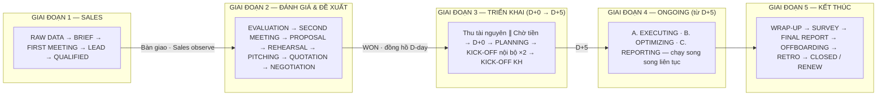
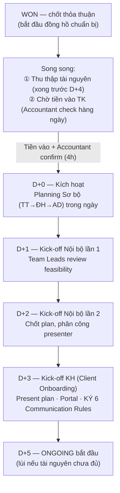
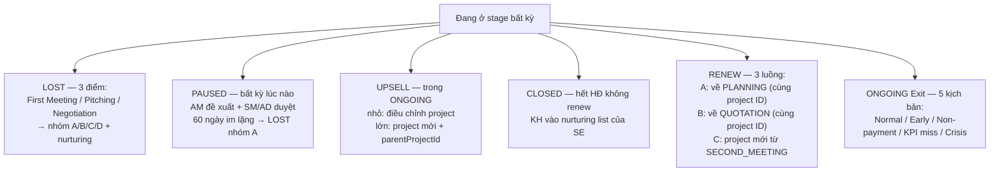

# TỔNG QUAN VÒNG ĐỜI DỰ ÁN BC AGENCY

**Mã tài liệu:** `01_Tong_quan_vong_doi_du_an.md`
**Phiên bản:** 1.1 — 12/09/2026 (mô hình tier & gate bàn giao đã chốt — xem 10 §8)
**Nguồn:** Lifecycle v2.3 (chuẩn trình tự) + Lifecycle V6.0 `[V6.0]` (chi tiết bổ sung) + Cơ cấu tổ chức (tài liệu 05)

---

## 1. Vòng đời 5 giai đoạn

Vòng đời dự án BC Agency đi từ **Raw Data** (lead thô) đến **CLOSED / RENEW**, chia thành 5 giai đoạn với 2 điểm bàn giao lớn:

### Bảng tổng hợp giai đoạn

| Giai đoạn | Stage (mã PMS) | Chủ thực thi | Bàn giao / Gate chính |
|-----------|----------------|--------------|----------------------|
| **1. Sales** | RAW_DATA → BRIEF_SENT → FIRST_MEETING (+BYPASS) → BRIEF_RECEIVED → LEAD → QUALIFIED | Sales Executive, SM | Gate bàn giao Sales → BPVH tại **QUALIFIED** + Handoff Package 5 nhóm bắt buộc (quyết định 12/09 — 10 §8) |
| **2. Đánh giá & Đề xuất** | EVALUATION → SECOND_MEETING → PROPOSAL_INTERNAL → REHEARSAL → PROPOSAL → PROPOSAL_REVIEW → PITCHING → QUOTATION → NEGOTIATION → **WON** | AM, Planner, AD, Accountant | WON = điểm chuyển giao Sales → Ops, khởi động đồng hồ D-day |
| **3. Triển khai** | COLLECTING ∥ WAIT_PAYMENT → **D+0** → PLANNING_DRAFT → KICKOFF_I1 (D+1) → KICKOFF_I2 (D+2) → KICKOFF_CLIENT (D+3) → **ONGOING (D+5)** | AM, Planner, toàn BPVH, Accountant | D+0 chỉ kích hoạt khi Accountant xác nhận tiền vào TK |
| **4. Vận hành ONGOING** | 3 nhánh song song: EXECUTING (Content → Design/Video → AM duyệt → Ads → Publish), OPTIMIZING (Routine ∥ Emergency), REPORTING (Daily/Weekly/Monthly) | Toàn bộ BPVH | KPI < 70% → Emergency; Exit theo 5 kịch bản |
| **5. Kết thúc** | UPSELL (bất kỳ) → WRAPUP → SURVEY → FINAL_REPORT → OFFBOARDING → INTERNAL_RETRO → **CLOSED** hoặc **RENEW** (3 luồng) | AM, SE, AD, Accountant | Offboarding xong mới được CLOSED; Renew 3 luồng A/B/C |

### Các quy trình ngang (xảy ra ở bất kỳ giai đoạn nào)

| Quy trình | Nội dung | Mục |
|-----------|----------|-----|
| **LOST Management** | 3 điểm LOST: First Meeting / Pitching / Negotiation; phân loại nhóm A/B/C/D; nurturing | Tài liệu 02 §6, 06 §6 |
| **PAUSED** | Tạm dừng bất kỳ lúc nào; AM đề xuất + SM/AD duyệt; review 2 tuần/lần; 60 ngày không hồi âm → LOST nhóm A | Tài liệu 06 §5 |
| **UPSELL** | Mini-flow cơ hội mở rộng trong ONGOING; đề xuất nhanh 24h | Tài liệu 06 §8 |

## 2. Nguyên tắc vận hành nền tảng

1. **Hard Gates — không nhảy bước `[V6.0]`:** chỉ chuyển stage khi thỏa mãn 100% Done criteria của stage hiện tại; nút chuyển stage bị vô hiệu trên UI và từ chối ở tầng API nếu thiếu điều kiện.
2. **"Không ghi nhận vào PMS = Không tồn tại" `[V6.0]`:** mọi lead, meeting, feedback, quyết định gate, vòng sửa proposal đều phải nằm trên PMS. Feedback KH nhận qua Zalo/Email **bắt buộc** được nhập lại vào PMS.
3. **Observe mode 2 chiều `[V6.0]`:** Sales Phase — Sales thực thi, Vận hành theo dõi; từ WON trở đi — Vận hành thực thi, Sales theo dõi. Sales Executive chỉ quay lại chủ động khi CLOSED (nhận nurturing list).
4. **D+0 là điều kiện duy nhất kích hoạt triển khai:** tiền vào TK + Accountant xác nhận + **LOI hoặc HĐ đã ký** (quyết định 12/09 — xem khoản `[KXN-5]` đã chốt tại 10 §8; HĐ đầy đủ chậm nhất 7 ngày sau D+0).
5. **AM là điểm chặn chất lượng duy nhất hướng khách hàng:** mọi content/creative (duyệt trong 2h) và mọi báo cáo (QC trước khi gửi) đều bắt buộc qua AM — không có ngoại lệ, kể cả khẩn cấp.
6. **Tiền và ngân sách là của KH:** mọi thay đổi budget/targeting luôn cần KH duyệt rõ ràng — Rule "Im lặng = Đồng ý" (24h) **không áp dụng** cho hai mục này.
7. **Capacity là rào chắn nhận việc:** >100% utilization → ngừng nhận dự án mới (CEO/COO quyết định); 80–100% → AD duyệt.

## 3. Mô hình Tier khách hàng — ✅ ĐÃ CHỐT (12/09/2026)

**Quyết định (KXN-1): dùng mô hình 5 tier A–E theo Lifecycle V6.0** — điểm CQ cao = khách hàng tốt hơn; auto xếp tier bằng AUTO SCORING. Định mức proposal theo chiều V6.0 (KXN-8). Chi tiết đầy đủ: phụ lục 09 §1 + nhật ký quyết định 10 §8.

| Tier | Điểm CQ | First Meeting | Định mức proposal |
|------|---------|---------------|-------------------|
| **A** | < 1.5 | — **AUTO LOST** ngay (trừ tư vấn theo K4) | — |
| **B** | 1.5 – 1.99 | **Bắt buộc** | AM soạn **8–12 trang** · vòng sửa **≤2** |
| **C** | 2.0 – 2.99 | **Bắt buộc** | AM soạn **8–12 trang** · vòng sửa **≤2** |
| **D** | 3.0 – 3.49 | Có thể bypass — vùng borderline, SM thẩm định 4h | Planner chủ trì **15–25 trang** · vòng sửa **≤4** |
| **E** | ≥ 3.5 | SM được duyệt bypass · ưu tiên tài nguyên | Planner chủ trì **15–25 trang** (+Team Bios, Brand Safety với Big Corp) · vòng sửa **≤4** |

> **Ghi chú lịch sử:** bản 1.0 tạm dùng v2.3 (4 tier, A/B = giá trị cao) làm chuẩn trình tự và gắn `[KXN-1]` vì 2 nguồn mâu thuẫn. Quyết định 12/09 chọn V6.0 vì chỉ V6.0 có cơ chế chấm CQ đầy đủ (trọng số 30/25/20/15/10) để auto xếp tier, và toàn bộ pipeline Phase 0-1 đã viết theo A–E.

## 4. D+ Timeline triển khai (từ WON đến D+5)

| Mốc | Điều kiện | Người gác |
|-----|-----------|-----------|
| WON → D+0 | Tiền vào TK + Accountant confirm trong 4h làm việc | Accountant (`FIN_L1`) |
| Thu thập tài nguyên | Hoàn tất **trước D+4**; thiếu → D+5 tự lùi | AM |
| D+1 / D+2 | Kick-off nội bộ **không được lùi** — vắng phải gửi feedback trước qua chat | AM |
| D+3 | KH ký 6 Communication Rules; từ chối → AD negotiate, ghi exception | AM → AD |
| D+5 | ONGOING bắt đầu khi đủ tài nguyên (pixel, quyền ad account) | AM + Media |

## 5. Hệ thống công cụ

| Hệ thống | Vai trò | Trạng thái |
|----------|---------|-----------|
| **PMS** | Xương sống quy trình — 141 tham chiếu module: Project, Task, File, Budget, Event, Notification, Audit Log, Content Post, ProposalRevision, Strategic Brief (16 sections), Media Plan, Report, Approval, Comment, KPI, Ads Report, Client Portal, Analytics, Insights Library, Capacity, Dashboard | Đang vận hành (theo thiết kế quy trình) |
| **CMS** | Track ad account/top-up, aggregate account health | Tương lai `[KXN-9]` |
| **TMS** | Capacity, KPI cá nhân Sales | Tương lai `[KXN-9]` |
| Nền tảng quảng cáo | Meta Ads Manager / Business Suite / Events Manager, Google Ads, TikTok Ads Manager, Facebook Ad Library | Đang dùng |
| Hỗ trợ | Zalo (kênh chính), Email, Zoom/Meet/Teams, Google Drive/Docs/Sheets/Slides/Forms, Typeform, Figma/Photoshop, Premiere/CapCut/DaVinci, Zapier/n8n, Pancake/Getfly (KH có CRM) | Đang dùng |
| AI | Manus AI (Meta pull), AI Agent tự pull data | Giai đoạn 2 `[KXN-9]` |

## 6. Cách đi lại trong vòng đời — 6 nhánh thoát/đổi luồng

Chi tiết từng nhánh: LOST tại 02 §6; PAUSED tại 06 §5 và ONGOING Exit tại 06 §7; **UPSELL tại 06 §8**; RENEW/CLOSED tại 06 §3–4.
