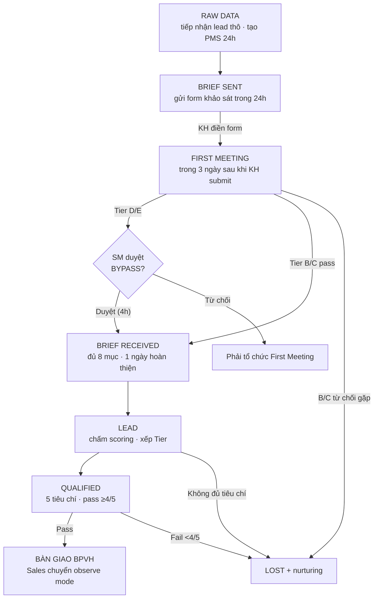

# GIAI ĐOẠN 1: SALES — TIẾP NHẬN & SÀNG LỌC LEAD

**Mã tài liệu:** `02_Giai_doan_1_Sales.md`
**Phiên bản:** 1.1 — 12/09/2026 (KXN-1/2/3/4 đã chốt — xem 10 §8)
**Chủ thực thi:** Sales Executive (SE) · Sales Manager (SM) quản lý pipeline
**Nguyên tắc giai đoạn:** Sales thực thi — Vận hành theo dõi (Observe) `[V6.0]`
**Trình tự theo v2.3:** RAW_DATA → BRIEF_SENT → FIRST_MEETING (+BYPASS) → BRIEF_RECEIVED → LEAD → QUALIFIED → bàn giao BPVH

---

## 1. Sơ đồ luồng giai đoạn

> **Trình tự scoring — ✅ ĐÃ CHỐT (KXN-2, ngày 12/09):** AUTO SCORING chạy **trước** First Meeting (ngay sau brief sơ bộ đủ 3 trường, theo V6.0) và chấm lại `qualifiedTier` sau Full Brief. Cách này giải được mâu thuẫn nội bộ v2.3 (entry FIRST_MEETING khai Input tier từ LEAD — stage diễn ra sau nó). Stage PMS giữ trình tự v2.3 (RAW_DATA → … → QUALIFIED); AUTO SCORING là bước hệ thống chạy giữa BRIEF_SENT và FIRST_MEETING, không phải stage riêng. Chi tiết: tài liệu 10 §3.2 + §8.

## 2. Các bước chi tiết

### 2.1 RAW DATA — Khởi tạo lead (PMS: `RAW_DATA`)

| 5W1H | Nội dung |
|------|----------|
| **What** | Tiếp nhận và phân loại thông tin KH thô từ mọi nguồn: Landing page, Zalo, Fanpage, Referral, Cold outreach `[V6.0]` |
| **Who** | Sales Executive tiếp nhận · SM theo dõi pipeline |
| **When** | Ngay khi có lead từ bất kỳ nguồn nào |
| **Where/Tools** | PMS tạo project mới · Zalo/Email nhận thông tin |
| **Why** | Mọi KH bắt đầu từ đây — bước sàng lọc đầu tiên quan trọng nhất |
| **How** | Điền PMS · phân loại nguồn inbound/outbound/referral · chưa cần liên hệ KH |

- **Input:** Lead info thô (có thể chỉ tên + SĐT).
- **Output:** Project record PMS ở stage `RAW_DATA` — anti-duplicate `[V6.0]`, nguồn lead ghi nhận, SE được assign.
- **Done (Hard Gate):** project đã tạo với thông tin cơ bản; nguồn lead đã ghi nhận; SE đã được assign.
- **SLA:** nhận thông tin → **24h phải tạo project trên PMS** → không gia hạn.
- **Rủi ro & Escalation:**

| Rủi ro | Xử lý |
|--------|-------|
| Thông tin quá ít không liên hệ được | SE tìm thêm qua MXH → vẫn tạo project với info có sẵn → ghi chú cần bổ sung |

- **PMS:** Project Module (stage RAW_DATA) · Audit Log (ghi nguồn lead) · Anti-duplicate `[V6.0]`.

### 2.2 BRIEF SENT — Gửi link điền Brief (PMS: `BRIEF_SENT`)

| 5W1H | Nội dung |
|------|----------|
| **What** | Gửi form khảo sát nhu cầu cho KH suy nghĩ trước về mục tiêu (Google Form) |
| **Who** | SE soạn và gửi · KH điền |
| **When** | Trong 24h sau khi tạo RAW_DATA |
| **Where/Tools** | Zalo/Email gửi link form — Zalo ưu tiên `[V6.0]` |
| **Why** | First Meeting hiệu quả hơn; KH nghiêm túc hơn khi đã điền form |
| **How** | Gửi link kèm note ngắn giải thích mục đích |

- **Input:** Project ở stage RAW_DATA. **Output:** form đã gửi, KH confirm nhận.
- **Done:** form đã gửi thành công; KH confirm nhận; stage PMS cập nhật `BRIEF_SENT`.
- **SLA:** sau RAW_DATA → **24h** → không gia hạn; trễ → SM nhận alert.
- **Rủi ro & Escalation:** KH không mở form sau 2 ngày → ngày 2 nhắc Zalo → ngày 3 gọi điện → ngày 4 escalate SM.
- **PMS:** Project Module · Notification (alert nếu KH chưa submit sau 48h).
- **Điều kiện chuyển tiếp `[V6.0]`:** trong 2h làm việc kiểm tra brief đủ **3 trường tối thiểu: Ngân sách, Sản phẩm, Nhu cầu thật** → đủ thì kích hoạt AUTO SCORING.

### 2.2b AUTO SCORING — Chấm điểm & xếp tier `[V6.0]` — ✅ chính thức (KXN-1/2 đã chốt)

> **Chính thức (quyết định 12/09):** AUTO SCORING chạy sau brief sơ bộ đủ 3 trường, **trước** First Meeting; chấm lại `qualifiedTier` sau Full Brief. Mô hình tier chính thức: **5 tier A–E** theo V6.0. Vận hành chi tiết:

- **Knockout K1–K5 → AUTO LOST ngay:** K1 sản phẩm vi phạm policy quảng cáo nền tảng; K2 đòi cam kết KPI cứng; K3 tranh chấp/kiện tụng pháp lý công khai; K4 đòi ứng tiền chạy trước; K5 spy quy trình, thiếu thiện chí cung cấp thông tin.
- **Cờ cảnh báo K6–K12 → FLAG SM Review trong 4h:** brand lớn, CEO gặp gấp, nhảy ≥3 agency/12 tháng, timeline gấp <2 tuần… *(danh sách đầy đủ K6–K12 chưa liệt kê tường minh trong nguồn `[KXN-20]`)*.
- **Trọng số điểm CQ (thang 1–5):** Nhu cầu/KPI theo data 30% · ngân sách 25% · thẩm quyền quyết định 20% · nhu cầu nguồn lực 15% · pháp lý & sản phẩm 10%.
- **Map tier (✅ quyết định 12/09 — chuẩn chính thức):** Tier A (<1.5đ) AUTO LOST · Tier B/C (1.5–2.99) First Meeting bắt buộc · Tier D (3.0–3.49, borderline — SM thẩm định 4h) / Tier E (≥3.5) SM được duyệt bypass.

### 2.3 FIRST MEETING (PMS: `FIRST_MEETING`)

| 5W1H | Nội dung |
|------|----------|
| **What** | Gặp online xác nhận nhu cầu thật sự, lọc KH spy ý tưởng `[V6.0]: 30–45p, KH nói ≥70% thời lượng, tuyệt đối không trình bày chiến lược hay báo giá` |
| **Who** | SE chủ trì · KH tham dự · Tier D/E: SM duyệt bypass |
| **When** | Trong 3 ngày làm việc sau khi KH submit form |
| **Where/Tools** | Zoom/Meet/Teams · Zalo confirm lịch · PMS ghi note |
| **Why** | Lọc spy · xác nhận nhu cầu thật · tăng tỉ lệ chốt |
| **How** | Tier B/C bắt buộc gặp · Tier D/E SM duyệt bypass nếu nhãn lớn |

- **Input:** brief sơ bộ từ form + **tier sơ bộ từ AUTO SCORING** (đã chạy trước First Meeting — quyết định KXN-2).
- **Output:** meeting notes + brief bổ sung (BPVH dùng soạn Proposal); quyết định tiếp tục/LOST cập nhật ngay sau buổi gặp.
- **Done:** brief có đủ mục tiêu + ngân sách sơ bộ; stage PMS đã cập nhật; meeting notes đã lưu.
- **SLA:** sau khi KH submit form → **3 ngày làm việc** → được +2 ngày nếu có lý do, ghi vào PMS.
- **Rủi ro & Escalation:**

| Rủi ro | Xử lý |
|--------|-------|
| KH từ chối lên lịch (Tier B/C) | SE thử lại 1 lần → vẫn từ chối → LOST ngay → nurturing list |
| KH không phản hồi sau 3 ngày | Ngày 2 nhắc Zalo → ngày 3 SM contact trực tiếp → ngày 4 LOST |

- **PMS:** Project Module (stage + meeting notes) · Notification (alert SLA).

### 2.3b BYPASS FIRST MEETING (PMS: `firstMeetingBypass`)

| 5W1H | Nội dung |
|------|----------|
| **What** | Cho phép Tier D/E bỏ qua First Meeting khi là nhãn lớn đấu thầu nhiều agency |
| **Who** | **SM là người duy nhất** được duyệt bypass |
| **When** | Khi KH Tier D/E không muốn gặp từng agency riêng lẻ |
| **Where/Tools** | PMS ghi nhận bypass decision · Zalo SM duyệt |
| **Why** | Tránh mất cơ hội với nhãn lớn, nhưng kiểm soát chặt tránh lạm dụng |
| **How** | SE xin phép → SM review → duyệt/từ chối → ghi lý do vào PMS |

- **Input:** yêu cầu bypass từ SE kèm lý do cụ thể. **Output:** Approved (flow nhảy thẳng BRIEF_RECEIVED) / Rejected (phải tổ chức First Meeting).
- **Done:** SM đã review và quyết định; lý do đã ghi PMS.
- **SLA:** submit request → **SM phản hồi trong 4h làm việc** → không gia hạn.
- **Rủi ro:** SE lạm dụng bypass → SM review pattern hàng tháng; quá nhiều bypass không hợp lý → nhắc nhở SE.
- **PMS:** Project Module (`firstMeetingBypass`, `firstMeetingBypassById`).

### 2.4 BRIEF RECEIVED — Nhận Brief chi tiết (PMS: `BRIEF_RECEIVED`)

| 5W1H | Nội dung |
|------|----------|
| **What** | Thu thập brief chi tiết đầy đủ làm đầu vào cho BPVH |
| **Who** | SE hỗ trợ KH điền · KH là chủ thể cung cấp |
| **When** | Trong hoặc ngay sau First Meeting |
| **Where/Tools** | PMS upload brief · GG Drive lưu file · Zalo clarify phần thiếu |
| **Why** | Brief đầy đủ là nền tảng để BPVH soạn Proposal chính xác |
| **How** | KH tự điền HOẶC SE điền cùng KH trong buổi gặp · lưu PMS ngay |

- **Input:** meeting notes từ First Meeting. **Output:** brief chi tiết đầy đủ — người nhận BPVH (soạn Proposal + Evaluation).
- **Done (Hard Gate) — brief đủ 8 mục:** ✅ **ĐÃ CHỐT (KXN-3, 12/09) — mô hình 2 cấp form:** (i) **form sơ bộ 3 trường** (Ngân sách, Sản phẩm, Nhu cầu thật) kích hoạt AUTO SCORING; (ii) **Full Brief 8 sections theo V6.0**: (1) Bối cảnh, (2) Sản phẩm/USP, (3) Giá/Chính sách, (4) Kênh phân phối, (5) Chân dung KH, (6) KPIs kỳ vọng, (7) Scope of Work, (8) Ngân sách & Timeline; 8 mục v2.3 (mục tiêu, ngân sách, timeline, target audience, sản phẩm, đối thủ, kênh mong muốn, KPI kỳ vọng) giữ làm **checklist tối thiểu bắt buộc** khi duyệt gate. File đã upload PMS; SE đã review confirm đủ.
- **SLA:** kết thúc First Meeting → **1 ngày làm việc hoàn thiện** → không gia hạn.
- **Rủi ro:** brief thiếu thông tin → SE clarify ngay qua Zalo; chưa đủ → chưa chuyển LEAD; ghi note phần cần bổ sung.
- **PMS:** Project Module · File Module.

### 2.5 LEAD — Xác nhận cơ hội, xếp tier (PMS: `LEAD`)

| 5W1H | Nội dung |
|------|----------|
| **What** | Confirm đây là cơ hội thật đáng đầu tư thời gian; đưa vào pipeline chính thức |
| **Who** | SE confirm · SM review nếu cần |
| **When** | Ngay sau khi nhận đủ brief |
| **Where/Tools** | PMS stage LEAD + scoring tool |
| **Why** | Đánh dấu KH vào phễu chính thức; bắt đầu track conversion rate từ đây |
| **How** | SE điền scoring form trong PMS · hệ thống tính điểm và xếp Tier tự động |

- **Input:** brief chi tiết đã hoàn thiện. **Output:** Lead với Tier classification (PMS `clientTier`).
- **Done:** Tier đã xếp; stage PMS = LEAD; SE được assign chính thức.
- **SLA:** sau khi brief đủ → **1 ngày làm việc** → không gia hạn.
- **Rủi ro:** không chắc Tier → SE hỏi SM → SM review brief và quyết định.
- **PMS:** Project Module (`clientTier`) · Dashboard (pipeline view).
- **Bổ sung V6.0:** LEAD tại V6.0 là **Decision Gate 2 — bàn giao sang Vận hành** với Handoff Package 5 nhóm checklist: (1) Hồ sơ KH (pháp nhân, đầu mối chính + dự phòng, full brief), (2) Tài chính (dự toán phí DV, NSQC ước tính, phương thức thanh toán), (3) Kỳ vọng & Scope (KPI không cam kết cứng, phạm vi kênh sơ bộ), (4) Nội bộ (phân bổ AM chính thức, xác nhận Capacity trống), (5) Pháp lý & Rủi ro (không vướng policy/tranh chấp). SM ký duyệt → AM xác nhận tiếp nhận (SLA 4h làm việc). **✅ ĐÃ CHỐT (KXN-4, 12/09): điểm bàn giao chính thức tại QUALIFIED (trình tự v2.3), Handoff Package 5 nhóm của V6.0 là checklist bắt buộc tại điểm bàn giao này.**

### 2.6 QUALIFIED — Decision Gate Go/No-Go (PMS: `QUALIFIED`)

| 5W1H | Nội dung |
|------|----------|
| **What** | Chấm điểm KH theo **5 tiêu chí chuẩn** quyết định bàn giao BPVH |
| **Who** | SE chấm · SM review nếu borderline |
| **When** | Trong 1 ngày sau khi xếp LEAD |
| **Where/Tools** | PMS qualified scorecard form |
| **Why** | Lọc KH không phù hợp trước khi BPVH đầu tư thời gian |
| **How** | 5 tiêu chí: **Ngân sách đủ / Ngành phù hợp / KH có quyền quyết định / Timeline hợp lý / Kỳ vọng thực tế** — **Pass ≥ 4/5** |

- **Input:** Lead với brief đầy đủ (stage LEAD). **Output:** Pass → bàn giao BPVH; Fail → LOST + nurturing list.
- **Done:** 5 tiêu chí đã chấm đủ; quyết định đã ghi PMS; nếu LOST lý do đã ghi rõ.
- **SLA:** sau stage LEAD → **1 ngày** → không gia hạn.
- **Rủi ro & Escalation:** borderline 3/5 → SE escalate SM → SM review brief trực tiếp → quyết định cuối thuộc SM.
- **PMS:** Project Module (stage QUALIFIED/LOST + lý do) · Audit Log (lịch sử quyết định).
- **Bổ sung V6.0:** Gate 1 này SM **bắt buộc ký duyệt Go/No-Go** (SLA 1 ngày làm việc); SE chấm lại điểm CQ lần 2 (`qualifiedTier`) dựa trên Full Brief; tiêu chuẩn qualify: khai thác đủ thông tin + KH đồng ý Pitching + thiện chí đàm phán ngân sách/KPI.

## 3. Điểm bàn giao Sales → BPVH

| Hạng mục | Nội dung |
|----------|----------|
| **Vị trí** | ✅ **ĐÃ CHỐT (KXN-4, 12/09):** bàn giao tại **QUALIFIED pass** (trình tự v2.3), kèm **Handoff Package 5 nhóm của V6.0 làm checklist bắt buộc** |
| **Trước khi chuyển** | Brief chi tiết + meeting notes + Tier + qualified scorecard + **Handoff Package 5 nhóm đủ 100%** trên PMS |
| **Sau khi chuyển** | BPVH nhận tại stage EVALUATION (SLA 2 ngày đánh giá); SE chuyển observe mode |
| **Quy tắc chính thức (từ quyết định 12/09)** | SM ký duyệt bàn giao → AM xác nhận tiếp nhận trong 4h làm việc |

## 4. SLA tổng hợp giai đoạn Sales

| Stage | Trigger | SLA | Gia hạn |
|-------|---------|-----|---------|
| RAW DATA | Nhận lead | 24h tạo project | Không |
| BRIEF SENT | Sau RAW_DATA | 24h gửi form | Không — trễ SM nhận alert |
| FIRST MEETING | KH submit form | 3 ngày làm việc | +2 ngày có lý do, ghi PMS |
| BYPASS | SE submit request | SM phản hồi 4h làm việc | Không |
| BRIEF RECEIVED | Kết thúc First Meeting | 1 ngày làm việc | Không |
| LEAD | Brief đủ | 1 ngày làm việc | Không |
| QUALIFIED | Stage LEAD | 1 ngày | Không |
| AM xác nhận bàn giao `[V6.0]` | SM ký duyệt | 4h làm việc | Không |

## 5. Module PMS sử dụng trong giai đoạn

Project Module (stage, clientTier, firstMeetingBypass) · File Module (brief) · Notification (SLA alert, 48h không submit) · Dashboard (pipeline) · Audit Log (nguồn lead, quyết định gate) · Scoring tool (AUTO SCORING, qualified scorecard) `[V6.0]`.

## 6. LOST tại giai đoạn Sales

Khi KH từ chối tại First Meeting (hoặc AUTO LOST theo Knockout `[V6.0]`): xử lý theo quy trình **LOST Management** chung — phân loại nhóm A/B/C/D, tag NURTURE_ACTIVE/PASSIVE/BLACKLIST, set re-contact date trong 24h. Chi tiết đầy đủ tại [06_Giai_doan_5_Ket_thuc_Closed_Renew.md](06_Giai_doan_5_Ket_thuc_Closed_Renew.md) §6.

## 7. Khoản của giai đoạn này — ✅ ĐÃ CHỐT ngày 12/09/2026

| Mã | Khoản | Quyết định |
|----|-------|------------|
| `[KXN-1]` | Mô hình tier | **5 tier A–E theo V6.0** (điểm cao = tốt) — chi tiết 01 §3, 09 §1 |
| `[KXN-2]` | Thời điểm AUTO SCORING | **Trước First Meeting** (sau brief 3 trường) + chấm lại `qualifiedTier` sau Full Brief |
| `[KXN-3]` | Danh sách 8 mục brief | **2 cấp form**: sơ bộ 3 trường + Full Brief 8 sections (V6.0); 8 mục v2.3 = checklist tối thiểu |
| `[KXN-4]` | Vị trí gate bàn giao | **Tại QUALIFIED** (v2.3) + Handoff Package 5 nhóm (V6.0) làm checklist bắt buộc |

Nhật ký quyết định đầy đủ: tài liệu 10 §8.
